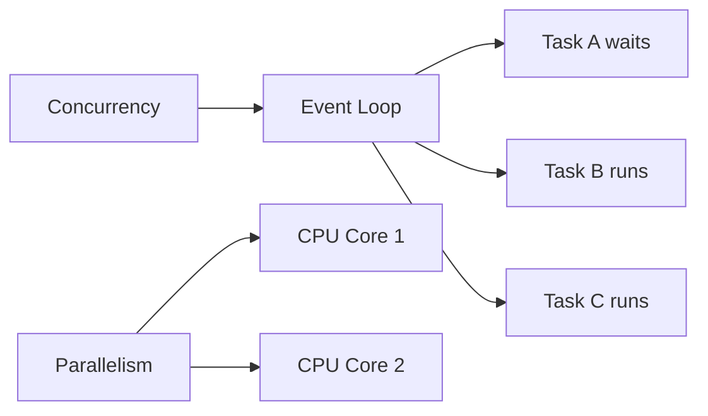
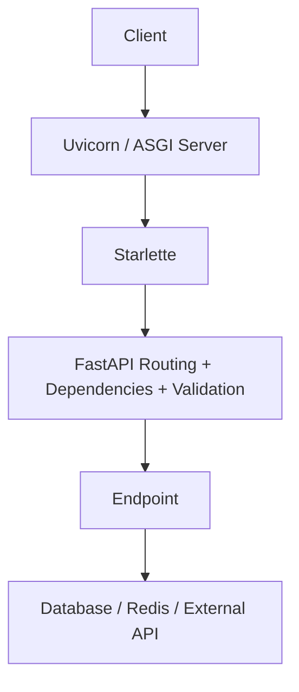
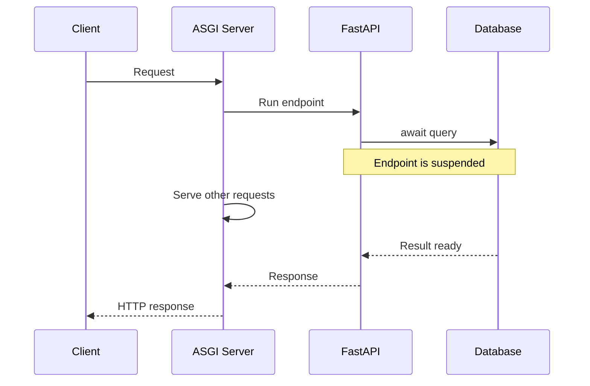
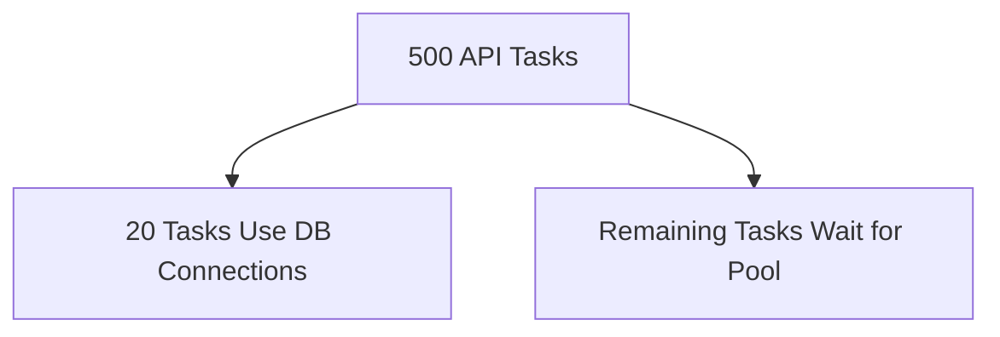
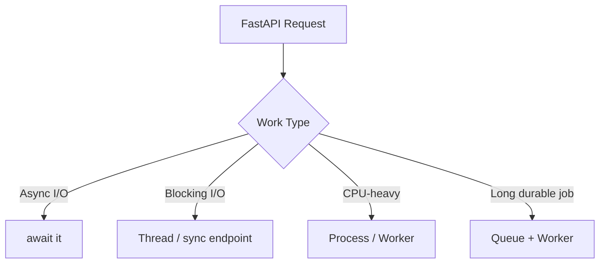
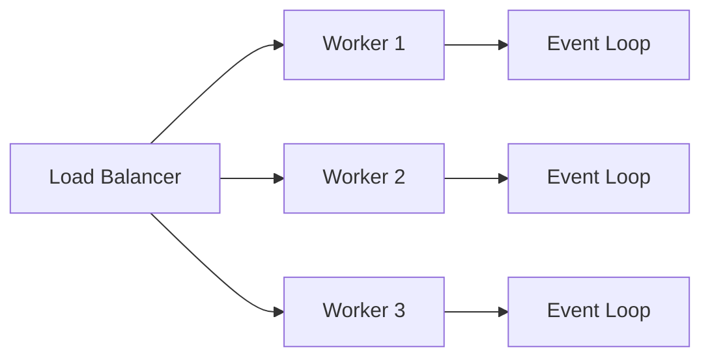
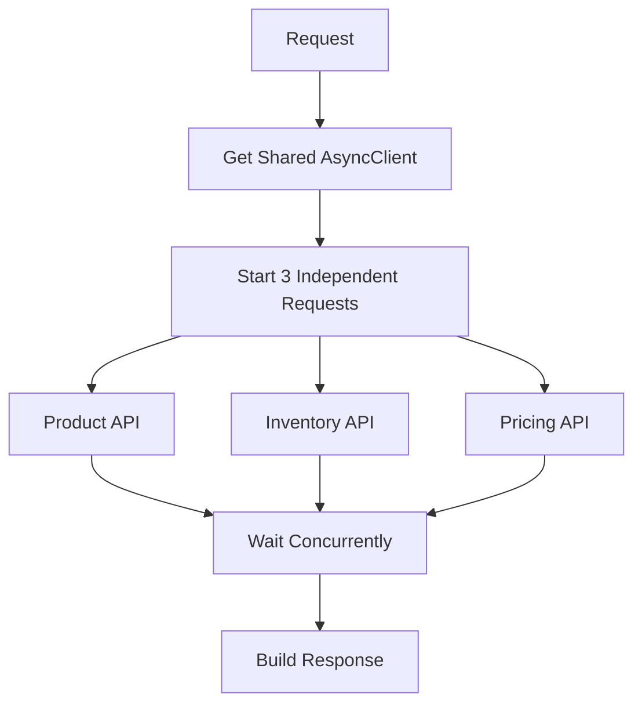

# Async Endpoints and Why FastAPI Is Fast

FastAPI handles I/O-heavy APIs efficiently because it is built on the **ASGI** ecosystem. An `async def` endpoint can pause while waiting for a database, Redis, or another API, allowing the event loop to work on other requests.

> **Key idea:** `async def` does not automatically make code faster. It helps when the work is **I/O-bound** and the libraries underneath support `await`.

## Index

1. [Core Idea](#1-core-idea)
2. [How FastAPI Async Execution Works](#2-how-fastapi-async-execution-works)
3. [`def` vs `async def`](#3-def-vs-async-def)
4. [Blocking the Event Loop](#4-blocking-the-event-loop)
5. [Concurrent I/O](#5-concurrent-io)
6. [Database and Connection Pools](#6-database-and-connection-pools)
7. [CPU-Bound and Background Work](#7-cpu-bound-and-background-work)
8. [Workers and Scaling](#8-workers-and-scaling)
9. [Testing and Observability](#9-testing-and-observability)
10. [Practical Example](#10-practical-example)
11. [Interview-Ready Summary](#11-interview-ready-summary)

---

# 1. Core Idea

Most API endpoints spend much of their time waiting for external systems:

- Database queries
- Redis
- External HTTP APIs
- Object storage
- Message brokers
- Network responses

With synchronous code, a thread performing blocking I/O stays occupied until that operation finishes.

With asynchronous code, the current coroutine can pause at `await`, and the event loop can run another ready task.

```text
Request A: [run][-------- waiting --------][resume][response]
Request B:      [run][---- waiting ----][resume][response]
Request C:           [run][------ waiting ------][resume]
```

The requests are **concurrent**: their waiting periods overlap.

> Async does not remove waiting. It lets the server use waiting time more efficiently.

## Concurrency vs Parallelism

| Concept | Meaning | Typical use |
|---|---|---|
| Concurrency | Multiple tasks make progress during overlapping time | HTTP calls, DB queries, Redis |
| Parallelism | Work executes at the same time on multiple CPU cores | Image processing, ML inference |
| Async I/O | Tasks yield control while waiting | High-concurrency APIs |
| Multiprocessing | Multiple processes use multiple CPU cores | CPU-heavy workloads |



---

# 2. How FastAPI Async Execution Works

A common FastAPI request path looks like this:



FastAPI is built on **Starlette**, and applications are commonly served using **Uvicorn**.

When an async endpoint reaches an incomplete `await`:

1. The coroutine is suspended.
2. The event loop runs another ready task.
3. The awaited operation finishes.
4. The coroutine becomes ready again.
5. Execution continues after the `await`.



---

# 3. `def` vs `async def`

FastAPI supports both styles.

## 3.1 Use `async def` for awaitable I/O

Use it when the important I/O calls underneath the endpoint provide async APIs.

Common examples:

- SQLAlchemy `AsyncSession`
- `asyncpg`
- `httpx.AsyncClient`
- Async Redis clients
- Async message-broker clients

```python
@app.get("/users/{user_id}")
async def get_user(user_id: int):
    return await user_repository.get(user_id)
```

## 3.2 Use `def` for blocking libraries

A normal FastAPI path operation declared with `def` is executed in a thread pool so that it does not directly block the main event loop.

```python
@app.get("/legacy-report")
def legacy_report():
    return legacy_sdk.generate_report()
```

This is useful when a library has no async API.

## 3.3 Decision Guide

| Work inside endpoint | Recommended approach |
|---|---|
| Async DB / HTTP / Redis client | `async def` + `await` |
| Blocking DB driver or SDK | `def`, or explicitly offload |
| Small in-memory calculation | Either |
| Mixed async + blocking calls | `async def` + explicit thread offload |
| Heavy CPU calculation | Process or external worker |
| Long reliable job | Queue + worker |

## 3.4 Important Helper-Function Rule

FastAPI automatically offloads **sync path operations and sync dependencies** that it manages.

It does **not** inspect every helper function called from inside `async def`.

```python
def blocking_helper():
    return legacy_client.fetch_data()

@app.get("/bad")
async def bad():
    return blocking_helper()  # still blocks the event-loop thread
```

If that helper performs slow blocking I/O, explicitly offload it.

```python
import asyncio

result = await asyncio.to_thread(blocking_helper)
```

Starlette also provides `run_in_threadpool()`.

---

# 4. Blocking the Event Loop

This is the most important practical rule:

> Do not run slow blocking operations directly inside `async def`.

## Blocking

```python
import time

@app.get("/bad")
async def bad_endpoint():
    time.sleep(5)
    return {"status": "done"}
```

`time.sleep()` blocks the event-loop thread. Other tasks on that worker cannot make normal progress during the sleep.

## Non-blocking

```python
import asyncio

@app.get("/good")
async def good_endpoint():
    await asyncio.sleep(5)
    return {"status": "done"}
```

`asyncio.sleep()` suspends only the current coroutine.

### Common blocking calls to watch

- `requests.get(...)`
- `time.sleep(...)`
- Sync SQLAlchemy sessions
- `psycopg2`
- Sync Redis clients
- `boto3` calls
- Large file operations
- `subprocess.run(...)`
- Heavy Pandas transformations

A blocking operation is not automatically safe just because it appears inside an `async def`.

---

# 5. Concurrent I/O

Multiple `await` statements are sequential unless you explicitly schedule independent operations concurrently.

## Sequential

```python
user = await get_user(user_id)
orders = await get_orders(user_id)
pricing = await get_pricing(user_id)
```

If each independent call takes about 200 ms, total waiting can approach 600 ms.

## Concurrent

```python
user, orders, pricing = await asyncio.gather(
    get_user(user_id),
    get_orders(user_id),
    get_pricing(user_id),
)
```

The total waiting time may be closer to the slowest operation.

```mermaid
gantt
    title Sequential vs Concurrent I/O
    dateFormat X
    axisFormat %L ms

    section Sequential
    User    :0, 200
    Orders  :200, 400
    Pricing :400, 600

    section Concurrent
    User    :0, 200
    Orders  :0, 200
    Pricing :0, 200
```



## Bound concurrency

Do not fan out thousands of tasks without limits.

```python
semaphore = asyncio.Semaphore(20)

async def fetch_with_limit(item_id: int):
    async with semaphore:
        return await fetch_item(item_id)
```

The limit should reflect:

- DB connection-pool size
- HTTP connection-pool size
- Downstream API capacity
- Memory
- Rate limits

### `gather()` vs `TaskGroup`

`asyncio.gather()` is widely used and simple.

For Python 3.11+, `asyncio.TaskGroup` provides structured concurrency and stronger failure handling: if one child task fails, remaining child tasks are cancelled automatically when leaving the task group.

---

# 6. Database and Connection Pools

Async database access improves concurrency, but it does not make inefficient queries fast.

```python
from sqlalchemy import select
from sqlalchemy.ext.asyncio import AsyncSession

async def find_active_users(session: AsyncSession):
    result = await session.execute(
        select(User).where(User.is_active.is_(True))
    )
    return result.scalars().all()
```

## Practical rules

- Use an async-compatible database driver.
- Use a session per request or unit of work.
- Do not share one `AsyncSession` across unrelated concurrent tasks.
- Keep transactions short.
- Avoid N+1 queries.
- Add indexes based on real query patterns.
- Paginate large result sets.
- Configure the connection pool intentionally.

## Pool bottleneck

An async API can accept many requests even when the database cannot execute all of them immediately.



Async makes waiting efficient. It does **not** increase database capacity.

> The connection pool should protect the database, not simply match incoming request concurrency.

---

# 7. CPU-Bound and Background Work

Async is mainly useful for **I/O-bound** workloads.

CPU-heavy work includes:

- Image processing
- PDF rendering
- Video conversion
- Compression
- Large data transformations
- ML inference
- Complex report generation

Running CPU-heavy Python directly inside `async def` blocks the event loop.



## Thread vs Process

- **Thread:** useful for blocking I/O.
- **Process:** useful for CPU-heavy Python work.
- **External worker / queue:** best when work is long-running, retryable, or must survive application restarts.

FastAPI `BackgroundTasks` is useful for small in-process post-response work, but it is not a durable job system.

Use an external queue when execution must be reliable.

---

# 8. Workers and Scaling

Each worker process has its own:

- Python interpreter
- Event loop
- Memory
- Connection pools
- In-memory cache
- Application state



Multiple workers help use multiple CPU cores and provide process isolation.

Example:

```bash
uvicorn app.main:app --host 0.0.0.0 --port 8000 --workers 4
```

Do not choose the worker count using a fixed formula only. Measure:

- CPU
- Memory
- Request latency
- DB limits
- Blocking work
- Payload size
- Downstream capacity

Also remember that four workers can create four separate database pools.

---

# 9. Testing and Observability

Async behavior should be tested under both functional and load conditions.

## Async endpoint test

```python
import pytest
from httpx import ASGITransport, AsyncClient

@pytest.mark.anyio
async def test_health():
    transport = ASGITransport(app=app)

    async with AsyncClient(
        transport=transport,
        base_url="http://test",
    ) as client:
        response = await client.get("/health")

    assert response.status_code == 200
```

## Important production signals

Monitor:

- p50 / p95 / p99 latency
- Error rate
- In-flight requests
- Event-loop lag
- Thread-pool saturation
- DB connection wait time
- Downstream latency
- Timeouts
- Task cancellations
- Worker restarts

A service can have low CPU and still be overloaded because tasks are waiting on exhausted connection pools or slow downstream systems.

### Thread-pool limit

Starlette uses AnyIO for sync work. The documented default limiter is currently **40 tokens**, shared with other sync work that uses the same limiter.

Do not increase it blindly. More threads may increase memory usage, context switching, DB pressure, and lock contention.

---

# 10. Practical Example

The following endpoint demonstrates the most common real-world async pattern:

- Reuse one async HTTP client.
- Set timeouts.
- Run independent calls concurrently.
- Map downstream errors properly.

```python
import asyncio
from contextlib import asynccontextmanager

import httpx
from fastapi import FastAPI, HTTPException, Request


@asynccontextmanager
async def lifespan(app: FastAPI):
    app.state.http_client = httpx.AsyncClient(
        timeout=httpx.Timeout(
            connect=2.0,
            read=5.0,
            write=5.0,
            pool=1.0,
        ),
        limits=httpx.Limits(
            max_connections=100,
            max_keepalive_connections=20,
        ),
    )

    try:
        yield
    finally:
        await app.state.http_client.aclose()


app = FastAPI(lifespan=lifespan)


async def fetch_json(
    client: httpx.AsyncClient,
    url: str,
) -> dict:
    response = await client.get(url)
    response.raise_for_status()
    return response.json()


@app.get("/products/{product_id}/summary")
async def product_summary(product_id: int, request: Request):
    client: httpx.AsyncClient = request.app.state.http_client
    base_url = "https://example.com/internal"

    try:
        product, inventory, pricing = await asyncio.gather(
            fetch_json(client, f"{base_url}/products/{product_id}"),
            fetch_json(client, f"{base_url}/inventory/{product_id}"),
            fetch_json(client, f"{base_url}/pricing/{product_id}"),
        )

    except httpx.TimeoutException as exc:
        raise HTTPException(
            status_code=504,
            detail="A downstream service timed out",
        ) from exc

    except (httpx.HTTPStatusError, httpx.RequestError) as exc:
        raise HTTPException(
            status_code=502,
            detail="A downstream service failed",
        ) from exc

    return {
        "product": product,
        "inventory": inventory,
        "pricing": pricing,
    }
```

### Why this design works



The endpoint does not create a new HTTP client per request, the network calls are awaitable, independent calls overlap, and downstream failures are translated into meaningful HTTP responses.

---

# 11. Interview-Ready Summary

The main points to remember are:

- FastAPI uses the **ASGI** model, commonly with Uvicorn and Starlette.
- `async def` is useful when the endpoint performs **awaitable I/O**.
- Async improves **concurrency**, not CPU parallelism.
- Slow blocking calls inside `async def` block the event loop.
- Sync FastAPI routes and dependencies are executed through a thread pool.
- FastAPI does not automatically offload arbitrary sync helper functions called inside an async route.
- Use `asyncio.gather()` or `TaskGroup` for independent async operations, but keep concurrency bounded.
- Async database access still depends on DB capacity and connection-pool limits.
- Use threads for blocking I/O, processes for CPU-heavy Python work, and durable queues for long-running reliable jobs.
- Reuse HTTP clients and connection pools, configure timeouts, and measure before tuning workers or concurrency.

> **Best mental model:** Use `async` when your application spends time waiting for I/O and the full call chain can cooperate with the event loop.

---

## Official References Checked

- FastAPI — Concurrency and `async` / `await`: https://fastapi.tiangolo.com/async/
- Starlette — Thread Pool: https://www.starlette.io/threadpool/
- Python — Coroutines and Tasks: https://docs.python.org/3/library/asyncio-task.html
- Python — `asyncio`: https://docs.python.org/3/library/asyncio.html
- Pydantic — Documentation: https://docs.pydantic.dev/
