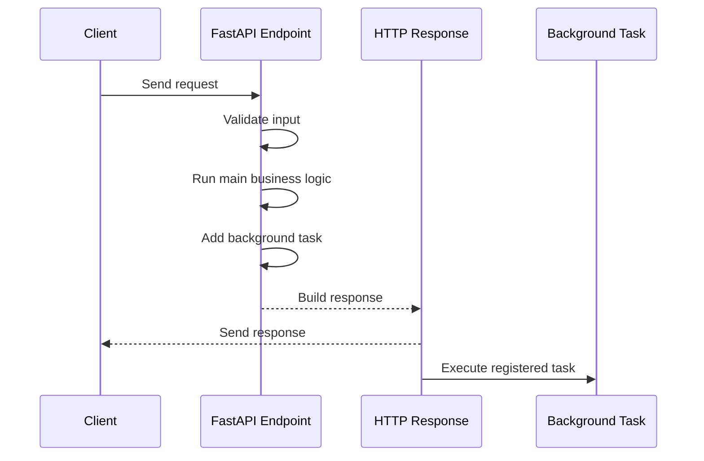
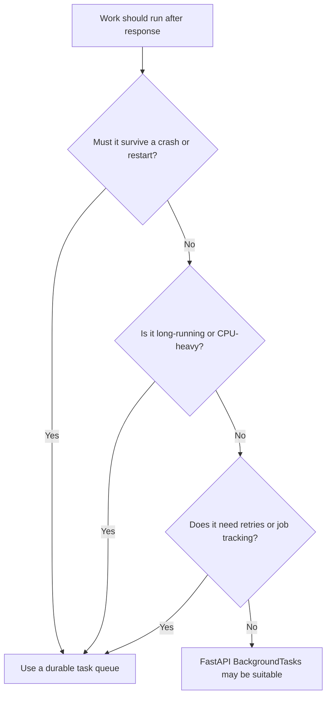
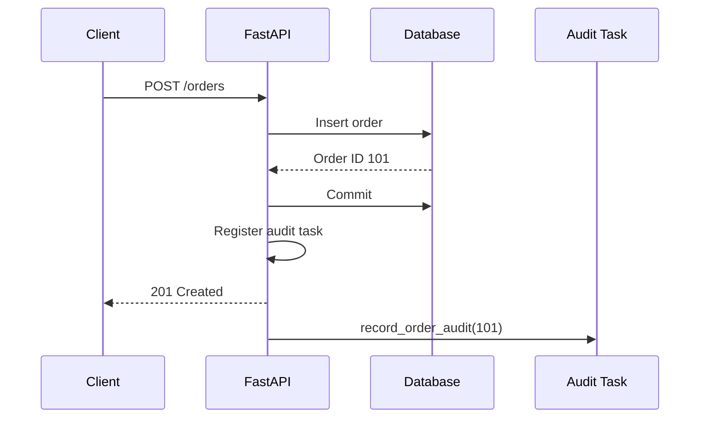

# FastAPI Background Tasks

> FastAPI's `BackgroundTasks` lets an endpoint return its HTTP response first and then run small, non-critical work inside the same application process.

---

## Index

1. [What Is a Background Task?](#1-what-is-a-background-task)
2. [Why Background Tasks Are Useful](#2-why-background-tasks-are-useful)
3. [How FastAPI Executes Background Tasks](#3-how-fastapi-executes-background-tasks)
4. [Basic `BackgroundTasks` Example](#4-basic-backgroundtasks-example)
5. [Arguments and Keyword Arguments](#5-arguments-and-keyword-arguments)
6. [Synchronous vs Asynchronous Task Functions](#6-synchronous-vs-asynchronous-task-functions)
7. [Using Background Tasks with Dependencies](#7-using-background-tasks-with-dependencies)
8. [Running Multiple Background Tasks](#8-running-multiple-background-tasks)
9. [Returning HTTP `202 Accepted`](#9-returning-http-202-accepted)
10. [Error Handling and Logging](#10-error-handling-and-logging)
11. [Database and Request-Lifecycle Considerations](#11-database-and-request-lifecycle-considerations)
12. [Testing Background Tasks](#12-testing-background-tasks)
13. [`BackgroundTasks` vs a Task Queue](#13-backgroundtasks-vs-a-task-queue)
14. [Practical Production Example](#14-practical-production-example)
15. [Best Practices](#15-best-practices)
16. [Key Takeaways](#16-key-takeaways)

---

# 1. What Is a Background Task?

A background task is work that starts **after FastAPI has prepared and sent the response** to the client.

Consider an endpoint that creates a user:

```text
1. Validate the request
2. Save the user
3. Return the response
4. Send the welcome email
```

The client needs to know whether the user was created. It normally does not need to wait for the welcome email to be sent.

FastAPI provides the `BackgroundTasks` class for this type of post-response work:

```python
from fastapi import BackgroundTasks
```

The task function can be either:

- A normal synchronous function declared with `def`
- An asynchronous function declared with `async def`

FastAPI handles both forms.

> [!IMPORTANT]
> `BackgroundTasks` runs work inside the same application process. It is not a durable job queue and does not provide automatic retries, distributed workers, job persistence, or guaranteed execution after a server failure.

---

# 2. Why Background Tasks Are Useful

Without a background task, the client waits for every operation:

```text
Client
  |
  | POST /users
  v
FastAPI
  |
  | Save user
  | Send email        <-- client is still waiting
  | Write audit log
  v
Response
```

With `BackgroundTasks`, FastAPI can respond earlier:

```text
Client
  |
  | POST /users
  v
FastAPI
  |
  | Save user
  | Register tasks
  v
Response returned
  |
  +----> Send email
  |
  +----> Write audit log
```

Typical use cases include:

- Sending a non-critical email notification
- Writing an audit or activity log
- Updating a small cache entry
- Sending an analytics event
- Triggering a lightweight webhook
- Performing small post-processing work
- Deleting a temporary file after returning it

A background task is useful when the work:

1. Does not affect the immediate response.
2. Is relatively small.
3. Can run in the same FastAPI process.
4. Does not require strong delivery guarantees.

---

# 3. How FastAPI Executes Background Tasks

FastAPI's `BackgroundTasks` is based on Starlette's background-task implementation.

The lifecycle is approximately:



The important point is:

```text
The task is attached to the response
              +
It starts only after the response is sent
```

The task is still part of the application process. It is not automatically transferred to another server or independent worker.

---

# 4. Basic `BackgroundTasks` Example

## 4.1 Create the Task Function

```python
def write_notification(email: str, message: str) -> None:
    with open("notifications.log", "a", encoding="utf-8") as file:
        file.write(f"{email}: {message}\n")
```

This task uses normal blocking file I/O, so a regular `def` function is appropriate.

## 4.2 Add the Task from an Endpoint

```python
from fastapi import BackgroundTasks, FastAPI, status

app = FastAPI()


def write_notification(email: str, message: str) -> None:
    with open("notifications.log", "a", encoding="utf-8") as file:
        file.write(f"{email}: {message}\n")


@app.post("/notifications", status_code=status.HTTP_202_ACCEPTED)
async def create_notification(
    email: str,
    background_tasks: BackgroundTasks,
) -> dict[str, str]:
    background_tasks.add_task(
        write_notification,
        email,
        "Your notification was created.",
    )

    return {
        "status": "accepted",
        "message": "The notification will be processed in the background.",
    }
```

The important line is:

```python
background_tasks.add_task(
    write_notification,
    email,
    "Your notification was created.",
)
```

Do not call the function yourself:

```python
# Incorrect: executes immediately
background_tasks.add_task(write_notification(email, "Hello"))
```

Pass the function object followed by its arguments:

```python
# Correct
background_tasks.add_task(write_notification, email, "Hello")
```

---

# 5. Arguments and Keyword Arguments

The `add_task()` method accepts:

```python
background_tasks.add_task(
    task_function,
    positional_argument_1,
    positional_argument_2,
    keyword_argument=value,
)
```

Example:

```python
def send_email(
    recipient: str,
    subject: str,
    *,
    template_name: str,
) -> None:
    print(
        f"Sending '{subject}' to {recipient} "
        f"using template '{template_name}'"
    )


@app.post("/users")
async def create_user(
    email: str,
    background_tasks: BackgroundTasks,
) -> dict[str, str]:
    background_tasks.add_task(
        send_email,
        email,
        "Welcome",
        template_name="welcome.html",
    )

    return {"email": email, "status": "created"}
```

FastAPI stores the callable and its arguments, then invokes it after sending the response.

---

# 6. Synchronous vs Asynchronous Task Functions

A background task may use either `def` or `async def`, but the choice should match the library used inside the function.

## 6.1 Use `def` for Blocking Libraries

Use `def` when the task calls a synchronous library:

```python
def generate_report_file(report_id: int) -> None:
    # Synchronous file or SDK operation
    with open(f"report-{report_id}.txt", "w", encoding="utf-8") as file:
        file.write("Report generated")
```

Common synchronous operations include:

- Standard file operations
- A synchronous email SDK
- A synchronous database client
- A blocking third-party library

Starlette runs synchronous background tasks through its thread-pool mechanism, preventing the synchronous function from directly blocking the event loop.

## 6.2 Use `async def` for Awaitable I/O

Use `async def` when the libraries provide real asynchronous methods:

```python
import httpx


async def notify_external_service(event_id: str) -> None:
    async with httpx.AsyncClient(timeout=10.0) as client:
        await client.post(
            "https://example.com/events",
            json={"event_id": event_id},
        )
```

Register it normally:

```python
background_tasks.add_task(notify_external_service, event_id)
```

## 6.3 Do Not Put Blocking Work Inside `async def`

This is a common design problem:

```python
import time


async def bad_task() -> None:
    time.sleep(10)  # Blocks the event-loop thread
```

Declaring a function with `async def` does not automatically make blocking code asynchronous.

A better rule is:

```text
Async library with awaitable methods  -> async def
Blocking/synchronous library          -> def
CPU-heavy work                         -> separate worker system
```

---

# 7. Using Background Tasks with Dependencies

FastAPI can inject the same `BackgroundTasks` object into dependencies and the endpoint.

Tasks added at different dependency levels are collected and executed after the response.

```python
from typing import Annotated

from fastapi import BackgroundTasks, Depends, FastAPI, Header

app = FastAPI()


def write_audit_log(message: str) -> None:
    with open("audit.log", "a", encoding="utf-8") as file:
        file.write(f"{message}\n")


def audit_request(
    background_tasks: BackgroundTasks,
    x_request_id: Annotated[str | None, Header()] = None,
) -> str | None:
    if x_request_id:
        background_tasks.add_task(
            write_audit_log,
            f"Request received: {x_request_id}",
        )

    return x_request_id


@app.post("/orders")
async def create_order(
    background_tasks: BackgroundTasks,
    request_id: Annotated[str | None, Depends(audit_request)],
) -> dict[str, str | None]:
    background_tasks.add_task(
        write_audit_log,
        "Order created successfully",
    )

    return {
        "status": "created",
        "request_id": request_id,
    }
```

Conceptually:

```text
Dependency adds task
        |
        v
Endpoint adds task
        |
        v
FastAPI merges them into one BackgroundTasks collection
        |
        v
Response is sent
        |
        v
Collected tasks execute
```

This is useful for cross-cutting operations such as:

- Audit logging
- Request tracking
- Analytics
- Security event logging
- Lightweight cleanup

---

# 8. Running Multiple Background Tasks

Call `add_task()` multiple times:

```python
def send_customer_email(order_id: int) -> None:
    print(f"Sending email for order {order_id}")


def write_order_audit(order_id: int) -> None:
    print(f"Writing audit record for order {order_id}")


@app.post("/orders/{order_id}")
async def complete_order(
    order_id: int,
    background_tasks: BackgroundTasks,
) -> dict[str, int | str]:
    background_tasks.add_task(send_customer_email, order_id)
    background_tasks.add_task(write_order_audit, order_id)

    return {
        "order_id": order_id,
        "status": "completed",
    }
```

Starlette executes registered tasks in order.

```text
Task 1
  |
  | success
  v
Task 2
  |
  | success
  v
Task 3
```

If an earlier task raises an unhandled exception, later tasks may not execute.

```text
Task 1: success
  |
Task 2: exception
  |
Task 3: not executed
```

Therefore, avoid placing several unrelated critical operations into one background-task chain without appropriate exception handling.

---

# 9. Returning HTTP `202 Accepted`

`202 Accepted` means the server accepted the request, but processing has not necessarily finished.

It is often suitable when the endpoint schedules work:

```python
from fastapi import BackgroundTasks, FastAPI, status

app = FastAPI()


def process_import(import_id: int) -> None:
    print(f"Processing import {import_id}")


@app.post(
    "/imports/{import_id}",
    status_code=status.HTTP_202_ACCEPTED,
)
async def start_import(
    import_id: int,
    background_tasks: BackgroundTasks,
) -> dict[str, int | str]:
    background_tasks.add_task(process_import, import_id)

    return {
        "import_id": import_id,
        "status": "accepted",
    }
```

However, returning `202` does not make `BackgroundTasks` durable. It only communicates that processing continues after the response.

For long-running jobs, a stronger API design normally creates a job record:

```json
{
  "job_id": "job_123",
  "status": "pending",
  "status_url": "/jobs/job_123"
}
```

The actual work should then be handled by a durable worker queue.

---

# 10. Error Handling and Logging

An exception raised after the response has been sent cannot be converted into a new client error response.

The client may already have received:

```http
HTTP/1.1 202 Accepted
```

Even if the background task fails a moment later.

Handle expected failures inside the task and log enough context:

```python
import logging

logger = logging.getLogger(__name__)


def send_invoice_email(invoice_id: int, recipient: str) -> None:
    try:
        # Replace with the actual email integration.
        print(f"Sending invoice {invoice_id} to {recipient}")
    except Exception:
        logger.exception(
            "Failed to send invoice email",
            extra={
                "invoice_id": invoice_id,
                "recipient": recipient,
            },
        )
```

For a non-critical task, catching and logging may be sufficient.

For work requiring retries or guaranteed delivery, use a task queue that supports:

- Retry policies
- Backoff
- Dead-letter handling
- Job status
- Monitoring
- Persistence

> [!NOTE]
> A successful HTTP response means the request handler completed and the task was registered. It does not prove that the background operation completed successfully.

---

# 11. Database and Request-Lifecycle Considerations

## 11.1 Pass Stable Values, Not Request-Scoped Resources

Avoid passing a request-scoped database session directly into a background task:

```python
# Risky design
background_tasks.add_task(process_user, db_session, user_id)
```

The dependency that created the session may be cleaned up as part of request processing. The task should create the resources it needs.

Prefer passing identifiers:

```python
background_tasks.add_task(process_user, user_id)
```

Then open a new database session inside the task:

```python
def process_user(user_id: int) -> None:
    with create_database_session() as session:
        user = session.get(User, user_id)

        if user is None:
            return

        # Perform the required work.
```

## 11.2 Commit Important Data Before Scheduling Follow-Up Work

This order is safer:

```text
1. Validate request
2. Write important database data
3. Commit transaction
4. Register background task using the saved record ID
5. Return response
```

The task can then query committed data.

## 11.3 Do Not Depend on Mutable Request Objects

Prefer this:

```python
background_tasks.add_task(
    write_audit_event,
    user_id,
    request_id,
)
```

Instead of passing an entire request object or another object whose lifecycle is tied to the request.

## 11.4 Temporary Files Need Careful Handling

When processing an uploaded file, do not assume a request-managed file object will remain valid after the response.

Safer options include:

1. Copy the file to a controlled temporary location before returning.
2. Pass the saved path or object-storage key to the task.
3. Let the task open the resource itself.
4. Delete the temporary resource in a `finally` block.

For large or important file processing, use an external job queue and durable storage.

---

# 12. Testing Background Tasks

FastAPI's test client waits for application handling to finish, including attached background tasks. This makes task effects testable.

```python
from pathlib import Path

from fastapi.testclient import TestClient

from app.main import app

client = TestClient(app)


def test_notification_is_written(tmp_path: Path) -> None:
    response = client.post(
        "/notifications",
        params={"email": "developer@example.com"},
    )

    assert response.status_code == 202

    # Assert the observable result produced by the task.
```

A cleaner unit-testing approach is to inject a service and mock the service method:

```python
from unittest.mock import Mock


def test_background_email_is_scheduled() -> None:
    email_service = Mock()

    # Call the relevant service or endpoint with the mocked dependency.
    # Assert that the email operation was invoked with expected values.
```

Useful test levels are:

### Unit Test

Test the task function directly:

```python
def test_build_notification_message() -> None:
    result = build_notification_message("Ava")
    assert result == "Hello Ava"
```

### Endpoint Test

Verify:

- The endpoint returns the correct status.
- The correct background operation is scheduled or invoked.
- Task arguments are correct.

### Integration Test

Verify interaction with:

- The email provider
- The database
- Object storage
- An external API

Use test doubles or sandbox environments for external services.

---

# 13. `BackgroundTasks` vs a Task Queue

This is the most important architecture decision.

| Requirement | FastAPI `BackgroundTasks` | Worker Queue |
|---|---:|---:|
| Executes after response | Yes | Yes |
| Runs in the same app process | Yes | Usually no |
| Separate worker processes | No | Yes |
| Persistent job storage | No | Usually yes |
| Automatic retries | No | Usually yes |
| Multiple servers/workers | Not coordinated | Supported |
| CPU-heavy processing | Poor fit | Better fit |
| Long-running work | Poor fit | Better fit |
| Small local post-response work | Good fit | May be unnecessary |
| Operational complexity | Low | Higher |

Common worker systems include:

- Celery
- Dramatiq
- RQ
- ARQ
- Cloud-managed queue and worker services

## 13.1 Choose `BackgroundTasks` When

Use it for work such as:

- Append a small audit record
- Send a best-effort internal notification
- Delete a temporary local file
- Update a small cache entry
- Perform a lightweight post-response call
- Access objects that intentionally belong to the same application process

## 13.2 Choose a Task Queue When

Use a durable queue when the work:

- Must survive application restarts
- Must be retried
- Takes a long time
- Is CPU-intensive
- Requires multiple worker machines
- Needs scheduling
- Needs rate limiting
- Needs job status tracking
- Is business-critical
- Must not be lost

Decision diagram:



---

# 14. Practical Production Example

The following example demonstrates a small, best-effort audit task.

## 14.1 Project Structure

```text
app/
├── main.py
├── schemas.py
├── services/
│   ├── audit_service.py
│   └── order_service.py
└── tests/
    └── test_orders.py
```

## 14.2 Request and Response Models

```python
# app/schemas.py

from pydantic import BaseModel, EmailStr


class OrderCreate(BaseModel):
    customer_email: EmailStr
    product_id: int
    quantity: int


class OrderResponse(BaseModel):
    id: int
    status: str
```

## 14.3 Audit Task

```python
# app/services/audit_service.py

import logging

logger = logging.getLogger(__name__)


def record_order_audit(order_id: int, event: str) -> None:
    try:
        logger.info(
            "Order audit event",
            extra={
                "order_id": order_id,
                "event": event,
            },
        )
    except Exception:
        logger.exception(
            "Unable to write order audit event",
            extra={"order_id": order_id},
        )
```

## 14.4 Order Service

```python
# app/services/order_service.py

from dataclasses import dataclass

from app.schemas import OrderCreate


@dataclass(frozen=True)
class CreatedOrder:
    id: int
    status: str


def create_order(data: OrderCreate) -> CreatedOrder:
    # In a real application:
    # 1. Open/use a transaction.
    # 2. Create the order.
    # 3. Commit the transaction.
    # 4. Return the persisted ID.
    return CreatedOrder(id=101, status="created")
```

## 14.5 Endpoint

```python
# app/main.py

from fastapi import BackgroundTasks, FastAPI, status

from app.schemas import OrderCreate, OrderResponse
from app.services.audit_service import record_order_audit
from app.services.order_service import create_order

app = FastAPI()


@app.post(
    "/orders",
    response_model=OrderResponse,
    status_code=status.HTTP_201_CREATED,
)
async def place_order(
    payload: OrderCreate,
    background_tasks: BackgroundTasks,
) -> OrderResponse:
    order = create_order(payload)

    background_tasks.add_task(
        record_order_audit,
        order.id,
        "order.created",
    )

    return OrderResponse(
        id=order.id,
        status=order.status,
    )
```

Flow:



The order creation remains the critical synchronous operation. The audit entry is treated as small, post-response work.

If audit delivery is legally or operationally mandatory, it should not rely only on this mechanism. A durable event or queue design would be more appropriate.

---

# 15. Best Practices

## 15.1 Keep Tasks Small

A task should finish quickly and avoid monopolizing application resources.

```text
Good fit:
- Small log write
- Short notification
- Lightweight cleanup

Poor fit:
- Video transcoding
- Large report generation
- ML inference pipeline
- Large CSV import
```

## 15.2 Pass IDs and Immutable Values

Prefer:

```python
background_tasks.add_task(process_order, order_id)
```

Avoid passing:

- Open database sessions
- Open file handles
- Mutable request-scoped objects
- Large in-memory payloads

## 15.3 Make Tasks Idempotent Where Possible

An idempotent task can safely run more than once without creating incorrect results.

Example strategy:

```python
def send_order_confirmation(order_id: int) -> None:
    order = load_order(order_id)

    if order.confirmation_sent_at is not None:
        return

    send_email(order.customer_email)
    mark_confirmation_as_sent(order_id)
```

This is still not a substitute for a durable queue, but it makes task behavior safer.

## 15.4 Add Structured Logging

Include identifiers such as:

- Request ID
- User ID
- Order ID
- Job ID
- Task name
- Attempt number, when using a real worker queue

## 15.5 Set Timeouts for External Calls

A background task can still occupy application resources.

```python
async with httpx.AsyncClient(timeout=10.0) as client:
    await client.post(url, json=payload)
```

## 15.6 Do Not Hide Business-Critical Work

If the API must guarantee that an operation occurs, either:

1. Complete it before returning success, or
2. Persist the intent and dispatch it through a durable queue or outbox mechanism.

## 15.7 Keep Task Functions Separate from Endpoints

Prefer:

```python
@app.post("/orders")
async def create_order_endpoint(...):
    ...
    background_tasks.add_task(send_confirmation, order_id)
```

Instead of defining substantial task logic inside the endpoint.

This improves:

- Readability
- Reuse
- Unit testing
- Error handling
- Migration to a real task queue later

## 15.8 Monitor Thread-Pool Usage

Synchronous endpoints, synchronous dependencies, file operations, and synchronous background tasks may share Starlette's thread-pool capacity.

A large number of slow blocking tasks can reduce application throughput. Moving such workloads to dedicated workers is usually better than increasing in-process concurrency without understanding the resource impact.

---

# 16. Key Takeaways

```text
BackgroundTasks = small post-response work in the same FastAPI process
```

Remember these rules:

1. Import `BackgroundTasks` from `fastapi`.
2. Receive it as an endpoint or dependency parameter.
3. Register work with `background_tasks.add_task()`.
4. Pass the function itself, not the result of calling it.
5. Use `def` for blocking libraries and `async def` for genuinely awaitable I/O.
6. Tasks execute after the response has been sent.
7. Multiple tasks execute in registration order.
8. An unhandled failure can prevent later tasks from running.
9. Do not rely on request-scoped sessions or file handles after the response.
10. Use a durable worker queue for long-running, CPU-heavy, retryable, distributed, or business-critical work.

Final decision rule:

```text
Small + local + best-effort
        |
        v
FastAPI BackgroundTasks

Long-running + critical + retryable + distributed
        |
        v
Durable queue and worker
```

---

## Official References

- FastAPI — Background Tasks: <https://fastapi.tiangolo.com/tutorial/background-tasks/>
- FastAPI — `BackgroundTasks` Reference: <https://fastapi.tiangolo.com/reference/background/>
- Starlette — Background Tasks: <https://www.starlette.io/background/>
- Starlette — Thread Pool: <https://www.starlette.io/threadpool/>
