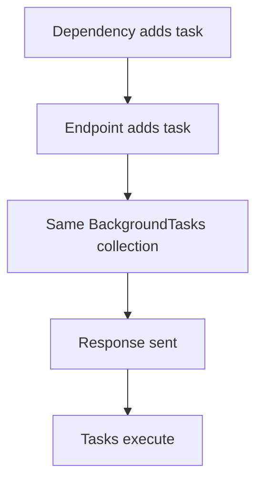
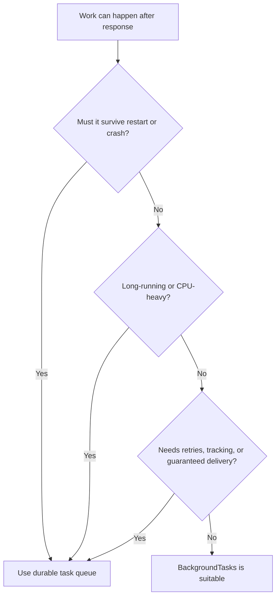
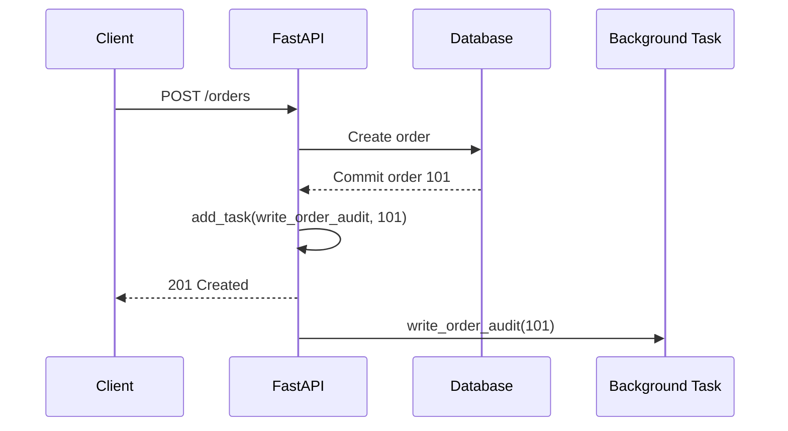

# FastAPI Background Tasks

> FastAPI `BackgroundTasks` lets an endpoint return the HTTP response first and then run small, best-effort work inside the same application process.

## Index

1. [What Background Tasks Are](#1-what-background-tasks-are)
2. [How `BackgroundTasks` Works](#2-how-backgroundtasks-works)
3. [Sync vs Async Task Functions](#3-sync-vs-async-task-functions)
4. [Dependencies and Multiple Tasks](#4-dependencies-and-multiple-tasks)
5. [Error and Request-Lifecycle Considerations](#5-error-and-request-lifecycle-considerations)
6. [`BackgroundTasks` vs a Task Queue](#6-backgroundtasks-vs-a-task-queue)
7. [Practical Example](#7-practical-example)
8. [Testing](#8-testing)
9. [Best Practices and Key Takeaways](#9-best-practices-and-key-takeaways)

---

# 1. What Background Tasks Are

A background task is work that FastAPI runs **after the response has been sent to the client**.

For example, when an order is created, the client normally needs the order result immediately but does not need to wait for a notification email.

```text
Request
  ↓
Validate data
  ↓
Create and commit order
  ↓
Register background task
  ↓
Return HTTP response
  ↓
Run background task
```

Typical lightweight uses include:

- Sending a non-critical email
- Writing an audit or activity log
- Sending an analytics event
- Triggering a lightweight webhook
- Performing small cleanup work

The important idea is that `BackgroundTasks` is **in-process**. It is not a separate worker system and does not provide durable job execution.


---

# 2. How `BackgroundTasks` Works

Import `BackgroundTasks` from FastAPI and declare it as an endpoint parameter:

```python
from fastapi import BackgroundTasks
```

FastAPI creates the `BackgroundTasks` object and injects it into the request handler.

Register work with:

```python
background_tasks.add_task(
    task_function,
    argument_1,
    argument_2,
    keyword_argument=value,
)
```

The first argument is the **function itself**, followed by the arguments that FastAPI should use when calling it later.

```python
background_tasks.add_task(send_email, email, subject="Welcome")
```

Conceptually:

```text
add_task(function, *args, **kwargs)
              ↓
FastAPI stores the callable
              ↓
Response is sent
              ↓
Stored callable is executed
```

`BackgroundTasks` comes from Starlette's background-task implementation, which FastAPI integrates with its dependency system.

---

# 3. Sync vs Async Task Functions

A background task can be declared with either `def` or `async def`.

The correct choice depends on the library used inside the task.

## 3.1 Use `def` for Blocking or Synchronous Work

Use a normal function when the code uses blocking APIs:

```python
def write_audit_log(order_id: int) -> None:
    with open("audit.log", "a", encoding="utf-8") as file:
        file.write(f"order.created:{order_id}\n")
```

Common examples:

- Standard file I/O
- Synchronous database clients
- Synchronous email SDKs
- Blocking third-party libraries

Starlette runs synchronous background tasks through its thread-pool mechanism instead of executing the blocking function directly on the event loop.

## 3.2 Use `async def` for Real Async I/O

Use `async def` when the library exposes awaitable operations:

```python
import httpx

async def notify_service(order_id: int) -> None:
    async with httpx.AsyncClient(timeout=10.0) as client:
        await client.post(
            "https://example.com/events",
            json={"order_id": order_id},
        )
```

A useful rule is:

| Work type | Recommended task |
|---|---|
| Awaitable network/database I/O | `async def` |
| Blocking/synchronous library | `def` |
| CPU-heavy processing | Separate worker system |

Declaring a function as `async def` does **not** make blocking code asynchronous. A blocking call inside an async task can still block the event loop.

---

# 4. Dependencies and Multiple Tasks

## 4.1 Using `BackgroundTasks` in Dependencies

FastAPI can inject `BackgroundTasks` into both dependencies and the endpoint.

When different dependency levels add tasks, FastAPI reuses the same background-task collection and runs the collected tasks after the response.



This is useful for cross-cutting work such as:

- Audit logging
- Request tracking
- Analytics
- Lightweight security-event logging

## 4.2 Multiple Tasks Run in Order

You can call `add_task()` multiple times:

```python
background_tasks.add_task(task_one, order_id)
background_tasks.add_task(task_two, order_id)
```

Starlette executes registered background tasks **in order**.

```text
Task 1 → Task 2 → Task 3
```

If one task raises an unhandled exception, later tasks in that background-task collection do not get an opportunity to run.

That matters when several independent operations are registered together. Business-critical work should not depend on this best-effort execution model.

---

# 5. Error and Request-Lifecycle Considerations

## 5.1 A Task Failure Cannot Change an Already-Sent Response

Once the response has been sent, a background-task exception cannot be converted into a new client error response.

The client may already have received:

```text
HTTP 202 Accepted
```

even if the background operation fails afterward.

For small non-critical tasks, log failures with useful identifiers:

```python
logger.exception(
    "Background task failed",
    extra={"order_id": order_id},
)
```

If work needs retries, persistence, or guaranteed delivery, use a durable queue.

## 5.2 Pass Stable Values, Not Request-Scoped Resources

Prefer passing IDs and immutable values:

```python
background_tasks.add_task(process_order, order_id)
```

Avoid depending on request-scoped resources such as:

- Open database sessions
- Open file handles
- The `Request` object
- Mutable request-scoped state

A safer task opens the resources it needs itself:

```python
def process_order(order_id: int) -> None:
    with create_database_session() as session:
        order = session.get(Order, order_id)
        if order is None:
            return

        # Perform the background work.
```

## 5.3 Commit Important Data Before Scheduling Follow-Up Work

For database-backed operations, use this order:

```text
1. Validate request
2. Write important data
3. Commit transaction
4. Register task using the saved record ID
5. Return response
6. Background task loads committed data
```

This keeps the background task independent from the request transaction.

---

# 6. `BackgroundTasks` vs a Task Queue

This is the most important architecture decision.

| Requirement | `BackgroundTasks` | Durable Task Queue |
|---|---:|---:|
| Run after response | Yes | Yes |
| Same application process | Yes | Usually no |
| Separate workers | No | Yes |
| Persistent job storage | No | Usually yes |
| Automatic retries | No | Usually yes |
| Job status/monitoring | No | Usually yes |
| Survive app restart/crash | No guarantee | Designed for it |
| CPU-heavy work | Poor fit | Better fit |
| Long-running work | Poor fit | Better fit |
| Small local post-response work | Good fit | Often unnecessary |

Common durable worker systems include Celery, Dramatiq, RQ, ARQ, and cloud-managed queue/worker services.

Use this decision flow:



A good mental model is:

> **`BackgroundTasks` = small, local, best-effort post-response work.**  
> **Task queue = durable, retryable, distributed, or heavy work.**

---

# 7. Practical Example

Consider an order endpoint where creating the order is critical, but writing an audit event can happen after the response.

```python
import logging

from fastapi import BackgroundTasks, FastAPI, status
from pydantic import BaseModel

app = FastAPI()
logger = logging.getLogger(__name__)


class OrderCreate(BaseModel):
    product_id: int
    quantity: int


class OrderResponse(BaseModel):
    id: int
    status: str


def create_order_in_db(payload: OrderCreate) -> int:
    # Real application:
    # 1. Start/use transaction
    # 2. Insert order
    # 3. Commit transaction
    # 4. Return persisted ID
    return 101


def write_order_audit(order_id: int) -> None:
    try:
        logger.info(
            "Order audit event",
            extra={
                "order_id": order_id,
                "event": "order.created",
            },
        )
    except Exception:
        logger.exception(
            "Unable to write order audit event",
            extra={"order_id": order_id},
        )


@app.post(
    "/orders",
    response_model=OrderResponse,
    status_code=status.HTTP_201_CREATED,
)
async def create_order(
    payload: OrderCreate,
    background_tasks: BackgroundTasks,
) -> OrderResponse:
    order_id = create_order_in_db(payload)

    background_tasks.add_task(
        write_order_audit,
        order_id,
    )

    return OrderResponse(
        id=order_id,
        status="created",
    )
```

Execution flow:



Why this is a reasonable use:

- Order creation finishes before success is returned.
- The task receives only the stable `order_id`.
- Audit writing is small and non-critical in this example.
- The client does not wait for the audit operation.

If the audit event were legally or operationally mandatory, a durable queue or transactional outbox would be a better design.

---

# 8. Testing

For task logic, test the background function directly whenever possible.

```python
def test_write_order_audit() -> None:
    write_order_audit(101)

    # Assert the expected observable effect.
```

For an endpoint test, verify:

- Correct HTTP status
- Correct response body
- Correct task/service arguments
- Expected observable task result when appropriate

Keep task logic in separate functions or services. This makes the code easier to test and easier to migrate to a worker queue later.

---

# 9. Best Practices and Key Takeaways

## 9.1 Keep In-Process Tasks Small

Good fits:

- Short email notification
- Small audit/log operation
- Analytics event
- Lightweight webhook
- Temporary cleanup

Poor fits:

- Video processing
- Large CSV imports
- Large report generation
- ML pipelines
- CPU-intensive work
- Anything requiring guaranteed delivery

## 9.2 Pass IDs Instead of Live Objects

Prefer:

```python
background_tasks.add_task(process_order, order_id)
```

The task should create its own database session, client, or file handle when needed.

## 9.3 Use the Correct Sync/Async Model

```text
Async library  → async def + await
Sync library   → def
CPU-heavy work → worker process / task queue
```

## 9.4 Add Timeouts and Logging

External calls should have explicit timeouts, and task logs should include identifiers such as:

- Request ID
- User ID
- Order ID
- Task name

## 9.5 Remember the Execution Guarantee

`BackgroundTasks` gives you **post-response execution inside the application process**, not durable job delivery.

If the process stops before or during the task, the application has no built-in retry or persistence mechanism.

---

## Final Summary

```text
FastAPI BackgroundTasks
        │
        ├── Executes after response
        ├── Runs in the same app process
        ├── Supports def and async def
        ├── Integrates with dependencies
        ├── Multiple tasks run in order
        ├── No built-in retries or persistence
        └── Best for small, non-critical work
```

For normal FastAPI development, remember the boundary:

> Use `BackgroundTasks` when delaying a small operation improves response time and losing that operation would not break core business correctness. Use a durable worker queue when the job is heavy, long-running, retryable, trackable, distributed, or business-critical.
