# FastAPI Dependency Injection (`Depends`)

> **Purpose:** Understand how FastAPI resolves and injects reusable request-level logic such as database sessions, authentication, pagination, configuration, and authorization.
>
> **Target level:** Backend developers with 3+ years of experience  
> **Examples:** Python 3.10+ and modern `Annotated` syntax  
> **Documentation checked:** July 27, 2026

---

# 1. What Dependency Injection Means

Dependency Injection, usually called **DI**, means that a function declares what it needs, while another system creates or retrieves those required objects.

Without dependency injection, an endpoint creates everything itself:

```python
@app.get("/orders")
def list_orders():
    db = create_database_session()
    user = authenticate_request()
    orders = load_orders(db, user)
    db.close()

    return orders
```

This endpoint is responsible for too many things:

- Creating and closing the database session
- Authenticating the user
- Loading business data
- Handling the HTTP response

With FastAPI dependency injection, the endpoint only declares its requirements:

```python
@app.get("/orders")
def list_orders(
    db: DbSession,
    current_user: CurrentUser,
):
    return load_orders(db, current_user)
```

FastAPI resolves `DbSession` and `CurrentUser` before calling the endpoint.

## Simple mental model

| Endpoint says | FastAPI does |
| --- | --- |
| I need a database | Create or retrieve a database session |
| I need a user | Validate the request and load the user |
| I need pagination | Read and validate query parameters |

The endpoint receives ready-to-use values.

---

# 2. Why FastAPI Uses Dependency Injection

`Depends` is useful for logic that is shared across multiple endpoints.

Common real-world use cases include:

- Database sessions
- Authentication
- Role and permission checks
- Tenant resolution
- Pagination and filtering
- API-key verification
- Request context creation
- Repositories and service objects
- Feature-flag evaluation
- Configuration access
- Rate-limit checks
- External client creation and cleanup

## Main benefits

### Reusability

Write authentication or database setup once and reuse it across routes.

### Separation of concerns

An endpoint focuses on application behavior instead of infrastructure setup.

### Testability

Production dependencies can be replaced with test implementations.

### Type safety

Injected values can have proper Python type annotations and editor support.

### Automatic OpenAPI integration

When a dependency declares query parameters, headers, cookies, or security schemes, FastAPI can include them in the generated API schema.

---

# 3. How `Depends` Works

The modern signature is conceptually:

```python
Depends(
    dependency=None,
    *,
    use_cache=True,
    scope=None,
)
```

The most common form is:

```python
Depends(some_callable)
```

A dependency can be any callable that FastAPI can inspect:

- A normal function
- An async function
- A class
- An object implementing `__call__`
- A generator dependency using `yield`
- An async generator dependency using `yield`

FastAPI performs these steps for every request:

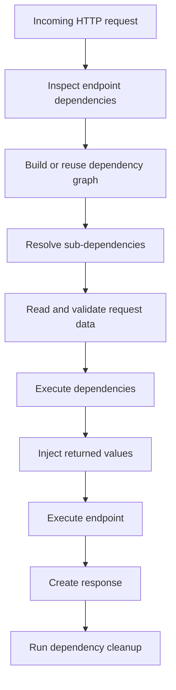

## Important detail

Pass the dependency callable itself:

```python
Depends(get_current_user)
```

Do not call it:

```python
# Incorrect
Depends(get_current_user())
```

FastAPI must inspect and call the dependency so it can resolve its parameters and sub-dependencies.

---

# 4. Basic Dependency Example

The following dependency handles common search and pagination parameters:

```python
from typing import Annotated

from fastapi import Depends, FastAPI, Query

app = FastAPI()


def get_pagination(
    page: Annotated[int, Query(ge=1)] = 1,
    page_size: Annotated[int, Query(ge=1, le=100)] = 20,
) -> dict[str, int]:
    return {
        "page": page,
        "page_size": page_size,
        "offset": (page - 1) * page_size,
    }


@app.get("/products")
def list_products(
    pagination: Annotated[dict[str, int], Depends(get_pagination)],
):
    return {
        "offset": pagination["offset"],
        "limit": pagination["page_size"],
    }
```

Request:

```http
GET /products?page=3&page_size=10
```

FastAPI performs the following work:

1. Detects that `list_products()` depends on `get_pagination()`.
2. Reads `page` and `page_size` from the query string.
3. Validates their ranges.
4. Calls `get_pagination(page=3, page_size=10)`.
5. Injects the returned dictionary into `pagination`.
6. Calls the endpoint.

Result:

```json
{
  "offset": 20,
  "limit": 10
}
```

## Visual flow

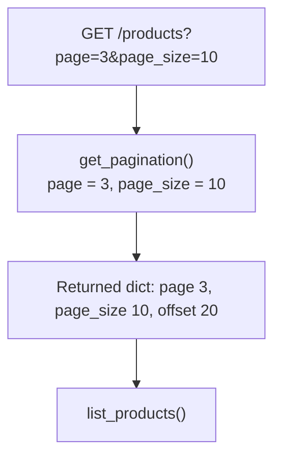

---

# 5. How FastAPI Resolves Dependency Parameters

A dependency is processed similarly to an endpoint. Its parameters may come from:

- Path parameters
- Query parameters
- Headers
- Cookies
- Request bodies
- Other dependencies
- Special FastAPI objects such as `Request`

Example:

```python
from typing import Annotated

from fastapi import Header, HTTPException, Request


def build_request_context(
    request: Request,
    x_tenant_id: Annotated[str, Header()],
) -> dict[str, str]:
    if not x_tenant_id.strip():
        raise HTTPException(status_code=400, detail="Tenant ID is required")

    return {
        "tenant_id": x_tenant_id,
        "client_host": request.client.host if request.client else "unknown",
    }
```

Use it in an endpoint:

```python
RequestContext = Annotated[
    dict[str, str],
    Depends(build_request_context),
]


@app.get("/dashboard")
def get_dashboard(context: RequestContext):
    return {
        "tenant": context["tenant_id"],
        "client": context["client_host"],
    }
```

The dependency validates the request context before the endpoint executes.

If it raises `HTTPException`, FastAPI stops resolving that branch and returns the HTTP error.

---

# 6. Reusable Type Aliases with `Annotated`

Modern FastAPI documentation prefers `typing.Annotated` when possible.

Instead of repeating:

```python
@app.get("/products")
def list_products(
    pagination: Annotated[dict[str, int], Depends(get_pagination)],
):
    ...
```

Create a reusable alias:

```python
Pagination = Annotated[
    dict[str, int],
    Depends(get_pagination),
]
```

Then use it naturally:

```python
@app.get("/products")
def list_products(pagination: Pagination):
    ...


@app.get("/orders")
def list_orders(pagination: Pagination):
    ...
```

## Why aliases are useful

They keep route signatures readable and centralize dependency wiring.

```python
DbSession = Annotated[Session, Depends(get_db)]
CurrentUser = Annotated[User, Depends(get_current_user)]
Pagination = Annotated[PaginationParams, Depends()]
```

The endpoint becomes a clear declaration of its requirements:

```python
@app.get("/orders")
def list_orders(
    db: DbSession,
    user: CurrentUser,
    pagination: Pagination,
):
    ...
```

## Type alias meaning

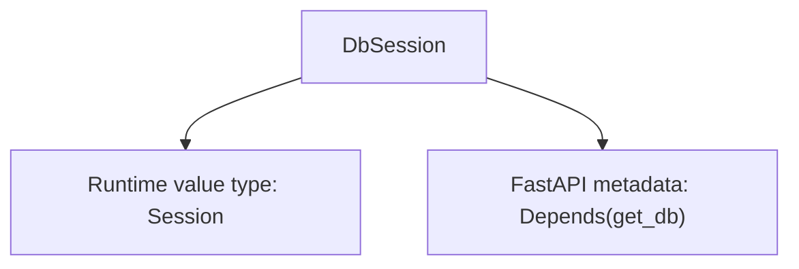

Static tools understand the value as `Session`, while FastAPI reads the dependency metadata.

---

# 7. Sub-dependencies and Dependency Graphs

A dependency can depend on another dependency.

This creates a **dependency graph** rather than a flat list.

Consider this authentication chain:

```python
from dataclasses import dataclass
from typing import Annotated

from fastapi import Depends, Header, HTTPException, status


@dataclass
class User:
    id: int
    username: str
    is_active: bool
    role: str


def get_access_token(
    authorization: Annotated[str | None, Header()] = None,
) -> str:
    if not authorization or not authorization.startswith("Bearer "):
        raise HTTPException(
            status_code=status.HTTP_401_UNAUTHORIZED,
            detail="Missing bearer token",
        )

    return authorization.removeprefix("Bearer ").strip()


def get_current_user(
    token: Annotated[str, Depends(get_access_token)],
) -> User:
    # Replace this demo logic with real token verification.
    if token != "valid-token":
        raise HTTPException(
            status_code=status.HTTP_401_UNAUTHORIZED,
            detail="Invalid token",
        )

    return User(
        id=101,
        username="avadh",
        is_active=True,
        role="admin",
    )


def get_active_user(
    user: Annotated[User, Depends(get_current_user)],
) -> User:
    if not user.is_active:
        raise HTTPException(
            status_code=status.HTTP_403_FORBIDDEN,
            detail="Inactive user",
        )

    return user
```

Use only the final dependency:

```python
ActiveUser = Annotated[User, Depends(get_active_user)]


@app.get("/profile")
def read_profile(user: ActiveUser):
    return {
        "id": user.id,
        "username": user.username,
    }
```

FastAPI automatically resolves the entire chain.


## Resolution order

FastAPI resolves dependencies from the deepest required dependency upward:

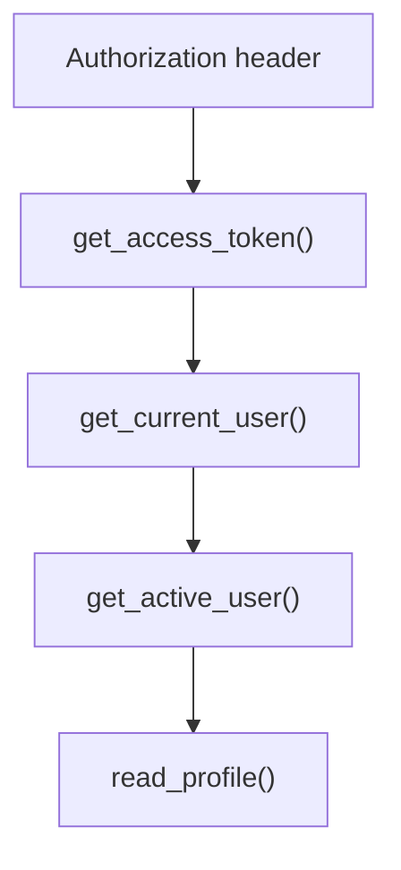

Sub-dependencies can be nested as deeply as the application requires, but shallow and focused graphs are easier to understand.

---

# 8. Authentication and Authorization

Dependency injection is a natural fit for authentication and authorization because each route can declare its exact security requirement.

## Authentication dependency

Authentication answers:

> Who is making this request?

```python
CurrentUser = Annotated[User, Depends(get_current_user)]
```

## Authorization dependency

Authorization answers:

> Is this user allowed to perform this operation?

```python
def require_admin(user: CurrentUser) -> User:
    if user.role != "admin":
        raise HTTPException(
            status_code=status.HTTP_403_FORBIDDEN,
            detail="Admin access required",
        )

    return user


AdminUser = Annotated[User, Depends(require_admin)]
```

Use the appropriate dependency per route:

```python
@app.get("/account")
def read_account(user: CurrentUser):
    return {"username": user.username}


@app.delete("/admin/users/{user_id}")
def delete_user(user_id: int, admin: AdminUser):
    return {
        "deleted_user_id": user_id,
        "deleted_by": admin.username,
    }
```

## Security dependency graph

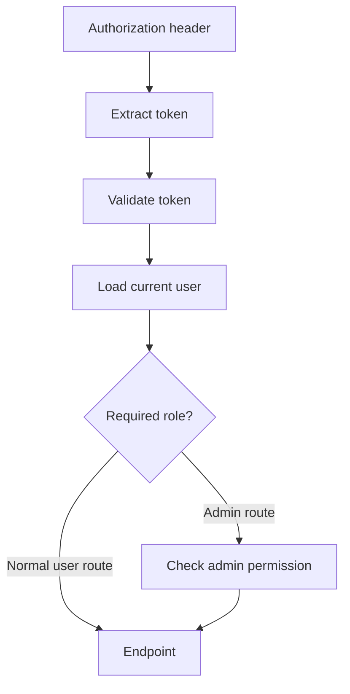

This design keeps authentication reusable while allowing route-specific authorization.

---

# 9. Database Sessions with `yield`

Database sessions need setup and cleanup.

A dependency using `yield` behaves similarly to a context manager:

```python
from collections.abc import Generator
from typing import Annotated

from fastapi import Depends
from sqlalchemy import create_engine
from sqlalchemy.orm import Session, sessionmaker

DATABASE_URL = "sqlite:///./app.db"

engine = create_engine(
    DATABASE_URL,
    connect_args={"check_same_thread": False},
)

SessionLocal = sessionmaker(
    bind=engine,
    autoflush=False,
    expire_on_commit=False,
)


def get_db() -> Generator[Session, None, None]:
    db = SessionLocal()

    try:
        yield db
    finally:
        db.close()


DbSession = Annotated[Session, Depends(get_db)]
```

Use it in an endpoint:

```python
@app.get("/customers/{customer_id}")
def get_customer(
    customer_id: int,
    db: DbSession,
):
    customer = db.get(Customer, customer_id)

    if customer is None:
        raise HTTPException(status_code=404, detail="Customer not found")

    return customer
```

## Lifecycle

```text
1. Create session
2. Yield session
3. Inject session into endpoint
4. Execute endpoint
5. Build/send response
6. Close session in finally block
```

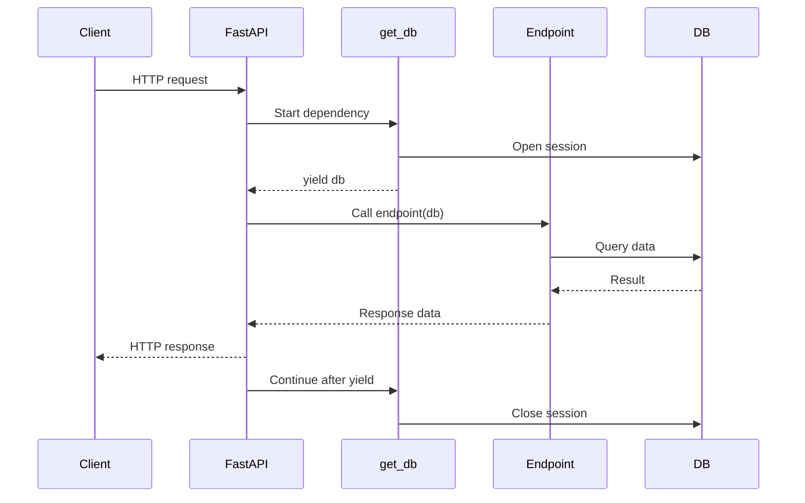

## Why `try/finally` matters

Cleanup must run even when:

- The endpoint raises an exception
- A downstream dependency fails
- Database work fails
- Response processing fails

Use one `yield` per dependency and place mandatory cleanup in `finally`.

---

# 10. Dependency Cleanup Scope

Modern FastAPI supports a `scope` option mainly for dependencies using `yield`.

```python
Depends(get_resource, scope="function")
```

or:

```python
Depends(get_resource, scope="request")
```

## `scope="request"`

This is the default behavior.

The cleanup code after `yield` runs after the response is sent.

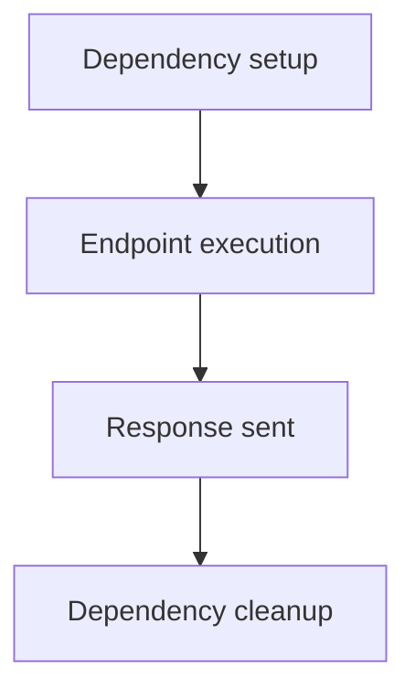

Use it when the resource should remain available through response processing.

## `scope="function"`

Cleanup runs after the endpoint function finishes but before the response is sent.

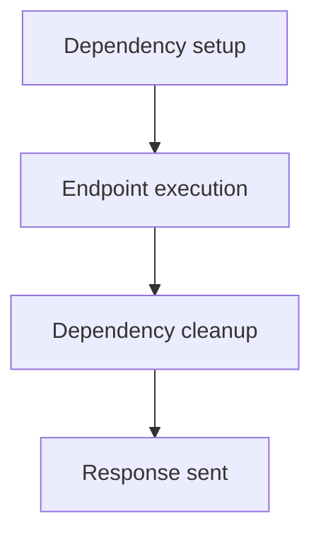

Example:

```python
FunctionScopedDb = Annotated[
    Session,
    Depends(get_db, scope="function"),
]
```

## Scope comparison

| Scope | Cleanup occurs | Typical reason |
|---|---|---|
| `request` | After the response is sent | Resource may be needed during response handling |
| `function` | After endpoint execution, before sending the response | Release a resource as early as possible |

> `Depends(scope="function")` for `yield` dependencies was added in FastAPI 0.121.0. Confirm the installed FastAPI version before using it in an older project.

---

# 11. Classes as Dependencies

A class can act as a dependency. FastAPI inspects its constructor parameters, creates an instance, and injects that instance.

```python
from typing import Annotated

from fastapi import Depends, Query


class ProductFilters:
    def __init__(
        self,
        search: Annotated[str | None, Query(max_length=100)] = None,
        category: str | None = None,
        min_price: float | None = None,
        max_price: float | None = None,
    ) -> None:
        self.search = search
        self.category = category
        self.min_price = min_price
        self.max_price = max_price


ProductFilterParams = Annotated[
    ProductFilters,
    Depends(),
]
```

Use it in an endpoint:

```python
@app.get("/products")
def list_products(filters: ProductFilterParams):
    return {
        "search": filters.search,
        "category": filters.category,
        "price_range": {
            "min": filters.min_price,
            "max": filters.max_price,
        },
    }
```

FastAPI uses the annotated class as the dependency callable when `Depends()` has no explicit argument.

## Function or class?

Use a function when:

- The dependency performs one focused action.
- A dictionary or single object is enough.
- There is little reusable state.

Use a class when:

- Multiple related values belong together.
- Named attributes improve readability.
- The dependency represents a structured request object.
- Validation and helper methods belong to the object.

---

# 12. Callable Objects as Configured Dependencies

An object implementing `__call__` can act as a dependency.

This pattern is useful when the dependency needs configuration.

```python
from typing import Annotated

from fastapi import Depends, HTTPException, Query


class RequireMinimumAge:
    def __init__(self, minimum_age: int) -> None:
        self.minimum_age = minimum_age

    def __call__(
        self,
        age: Annotated[int, Query(ge=0)],
    ) -> int:
        if age < self.minimum_age:
            raise HTTPException(
                status_code=403,
                detail=f"Minimum age is {self.minimum_age}",
            )

        return age


require_adult = RequireMinimumAge(minimum_age=18)
require_senior = RequireMinimumAge(minimum_age=60)
```

Use configured instances:

```python
@app.get("/adult-content")
def adult_content(
    age: Annotated[int, Depends(require_adult)],
):
    return {"allowed": True, "age": age}


@app.get("/senior-benefits")
def senior_benefits(
    age: Annotated[int, Depends(require_senior)],
):
    return {"eligible": True, "age": age}
```

FastAPI calls the instance:

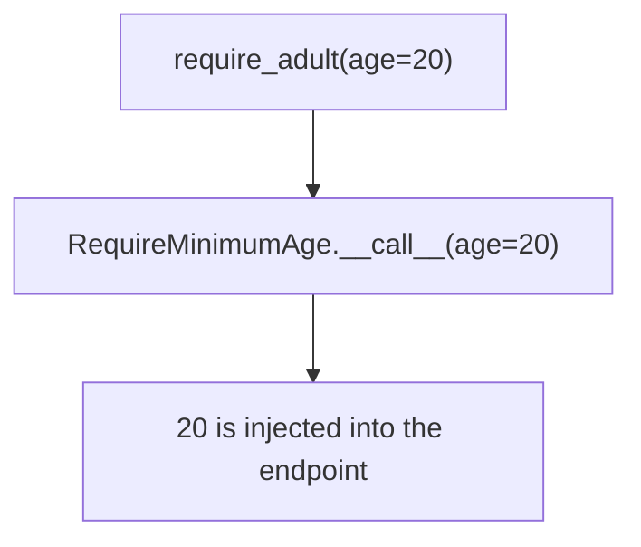

This provides reusable behavior without using global mutable state.

---

# 13. Route, Router, and Application Dependencies

A dependency can be attached at several levels.

## 13.1 Parameter dependency

Use this when the endpoint needs the dependency's returned value.

```python
@app.get("/profile")
def read_profile(user: CurrentUser):
    return user
```

## 13.2 Route decorator dependency

Use this when the dependency must execute, but the endpoint does not need its returned value.

```python
def verify_api_key(
    x_api_key: Annotated[str, Header()],
) -> None:
    if x_api_key != "expected-key":
        raise HTTPException(status_code=401, detail="Invalid API key")


@app.get(
    "/internal/status",
    dependencies=[Depends(verify_api_key)],
)
def internal_status():
    return {"status": "ok"}
```

The dependency runs before the endpoint, but no extra parameter appears in the endpoint signature.

## 13.3 Router-level dependency

Apply shared logic to every endpoint in a router:

```python
from fastapi import APIRouter

admin_router = APIRouter(
    prefix="/admin",
    tags=["admin"],
    dependencies=[Depends(verify_api_key)],
)


@admin_router.get("/reports")
def list_reports():
    return []


@admin_router.get("/settings")
def read_settings():
    return {}
```

## 13.4 Dependency while including a router

```python
app.include_router(
    admin_router,
    dependencies=[Depends(require_internal_network)],
)
```

This adds a dependency without changing the original router.

## 13.5 Application-level dependency

Apply a dependency to all path operations:

```python
app = FastAPI(
    dependencies=[Depends(add_request_context)],
)
```

Use application-wide dependencies only for behavior that truly applies to every route.

## Choosing the correct level

| Requirement | Best location |
|---|---|
| Endpoint needs returned value | Endpoint parameter |
| Check applies to one endpoint | Route decorator |
| Check applies to a feature group | `APIRouter` |
| Add policy when mounting a router | `include_router()` |
| Logic applies to every route | `FastAPI(...)` |

---

# 14. Dependency Caching and `use_cache`

FastAPI caches a dependency's result within a single request by default.

Consider two dependencies that both require the current user:

```python
def get_account(user: CurrentUser) -> Account:
    ...


def get_permissions(user: CurrentUser) -> set[str]:
    ...
```

An endpoint uses both:

```python
@app.get("/dashboard")
def dashboard(
    account: Annotated[Account, Depends(get_account)],
    permissions: Annotated[set[str], Depends(get_permissions)],
):
    ...
```

Dependency graph:

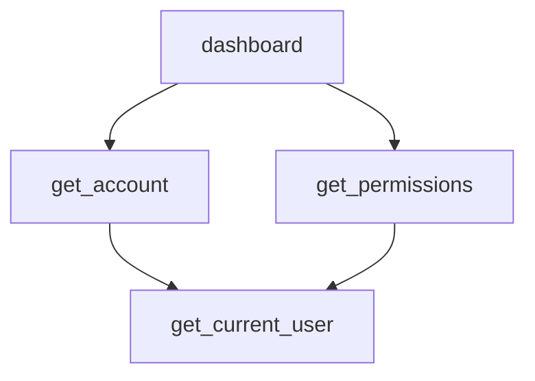

By default, `get_current_user()` is called once for that request, and its result is reused.

```text
Request 1: get_current_user() runs once
Request 2: get_current_user() runs once again
```

The cache is request-scoped, not an application-wide cache.

## Disabling the cache

```python
FreshRequestId = Annotated[
    str,
    Depends(generate_request_value, use_cache=False),
]
```

With `use_cache=False`, FastAPI executes that dependency again when it appears multiple times in the same request graph.

Use this only when repeated execution is intentional. Authentication, database sessions, and request context normally benefit from the default cache.

---

# 15. Sync and Async Dependencies

FastAPI supports both `def` and `async def` dependencies.

## Async dependency

Use `async def` when the dependency calls asynchronous code:

```python
async def get_remote_profile(
    user: CurrentUser,
) -> dict:
    return await profile_client.fetch(user.id)
```

## Synchronous dependency

Use normal `def` when using a synchronous library:

```python
def get_legacy_record(record_id: int) -> dict:
    return legacy_client.fetch(record_id)
```

FastAPI can mix synchronous and asynchronous dependencies in the same graph.

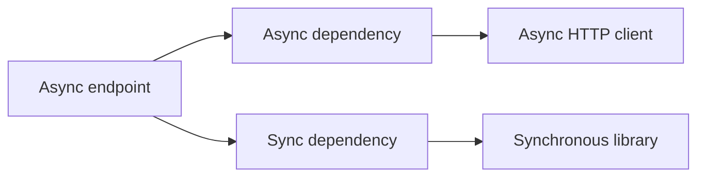

Normal `def` dependencies called by FastAPI are handled in an external thread pool so they do not directly block the event loop.

## Practical rule

| Dependency work | Definition |
|---|---|
| Uses `await` with async database or HTTP client | `async def` |
| Uses a synchronous SDK or database client | `def` |
| Performs simple CPU-light validation | Either; usually `def` is clear |
| Performs heavy CPU work | Move it to a worker/process system |

Do not declare a function `async def` and then perform long blocking I/O inside it.

---

# 16. `Depends` vs Middleware

Both dependencies and middleware can run shared logic, but they solve different problems.

## Middleware

Middleware wraps the overall HTTP request/response cycle.

Typical uses:

- Request logging
- CORS
- Compression
- Trace IDs
- Response timing
- Global headers
- Observability

## Dependency

A dependency belongs to FastAPI's route dependency graph.

Typical uses:

- Current user
- Permission checks
- Database session
- Tenant context
- Validated pagination
- Route-specific services
- Request data transformed into domain objects

## Comparison

| Area | Dependency | Middleware |
|---|---|---|
| Can be route-specific | Yes | Usually global or path-filtered manually |
| Can inject a typed value | Yes | Not directly into function parameters |
| Supports sub-dependencies | Yes | No FastAPI dependency graph |
| Integrated with parameter validation | Yes | Manual |
| Integrated with OpenAPI | Often yes | Usually no |
| Wraps every request/response | Only where applied | Yes |
| Best for authentication rules | Usually dependency | Sometimes middleware for coarse checks |
| Best for logging/timing | Possible, but not ideal | Yes |

## Decision guide

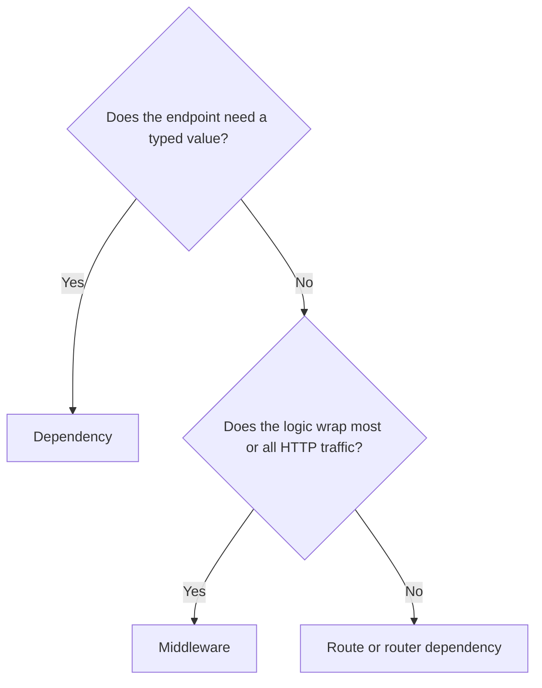

A common production design uses middleware for request tracing and dependencies for authentication, authorization, tenant resolution, and database access.

---

# 17. `Depends` vs `Security`

`Security()` is built on the same dependency system.

Use `Depends()` for normal dependency injection and security checks that do not need OAuth2 scope metadata.

```python
CurrentUser = Annotated[
    User,
    Depends(get_current_user),
]
```

Use `Security()` when declaring OAuth2 scopes that should be included in OpenAPI and the interactive API documentation.

```python
from fastapi import Security


@app.get("/users/me/items")
def read_own_items(
    user: Annotated[
        User,
        Security(get_current_user, scopes=["items:read"]),
    ],
):
    return []
```

## Main difference

| Feature | `Depends` | `Security` |
|---|---|---|
| Dependency injection | Yes | Yes |
| Authentication and authorization logic | Yes | Yes |
| Declares OAuth2 scopes | No | Yes |
| Adds required scopes to OpenAPI | No | Yes |

Use `Security` when scopes are part of the API's formal authorization contract.

---

# 18. Testing with Dependency Overrides

FastAPI exposes:

```python
app.dependency_overrides
```

It is a dictionary mapping an original dependency to a replacement dependency.

## Application dependency

```python
def get_current_user() -> User:
    # Real token validation and database work
    ...
```

## Test override

```python
from fastapi.testclient import TestClient


def override_current_user() -> User:
    return User(
        id=999,
        username="test-user",
        is_active=True,
        role="admin",
    )


client = TestClient(app)


def test_admin_endpoint():
    app.dependency_overrides[get_current_user] = override_current_user

    try:
        response = client.get("/admin/reports")

        assert response.status_code == 200
    finally:
        app.dependency_overrides.clear()
```

FastAPI calls the override instead of the original dependency. The original dependency's sub-dependencies are also skipped for that override.

## Pytest fixture pattern

```python
import pytest


@pytest.fixture
def authenticated_client():
    app.dependency_overrides[get_current_user] = override_current_user

    with TestClient(app) as client:
        yield client

    app.dependency_overrides.clear()


def test_profile(authenticated_client: TestClient):
    response = authenticated_client.get("/profile")

    assert response.status_code == 200
    assert response.json()["username"] == "test-user"
```

## Override a database dependency

```python
def override_get_db():
    db = TestingSessionLocal()

    try:
        yield db
    finally:
        db.close()


app.dependency_overrides[get_db] = override_get_db
```

This keeps endpoint code unchanged while tests use an isolated database.

## Testing architecture

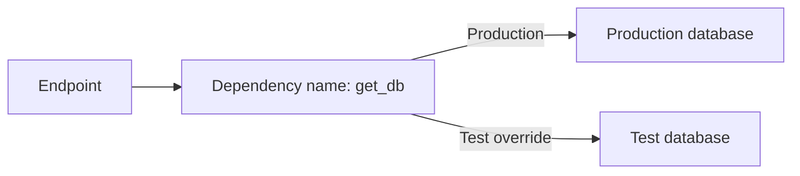

This is one of the strongest practical benefits of FastAPI dependency injection.

---

# 19. Recommended Project Structure

For a medium-sized application, organize dependencies by responsibility.

```text
app/
├── main.py
├── api/
│   ├── dependencies.py
│   └── routers/
│       ├── users.py
│       ├── products.py
│       └── orders.py
├── core/
│   ├── config.py
│   └── security.py
├── db/
│   ├── session.py
│   └── models.py
├── repositories/
│   ├── users.py
│   └── orders.py
├── services/
│   └── order_service.py
└── tests/
    ├── conftest.py
    └── test_orders.py
```

## `db/session.py`

```python
def get_db():
    ...
```

## `api/dependencies.py`

```python
DbSession = Annotated[Session, Depends(get_db)]
CurrentUser = Annotated[User, Depends(get_current_user)]
AdminUser = Annotated[User, Depends(require_admin)]
Pagination = Annotated[PaginationParams, Depends()]
```

## `api/routers/orders.py`

```python
@router.get("/")
def list_orders(
    db: DbSession,
    user: CurrentUser,
    pagination: Pagination,
):
    ...
```

This structure separates:

- Infrastructure creation
- Request-level dependency wiring
- Business services
- Persistence logic
- API transport code

---

# 20. Practical Mini Design

The following design combines authentication, tenant resolution, database access, and a service object.

## Domain dependencies

```python
from dataclasses import dataclass
from typing import Annotated

from fastapi import Depends, Header, HTTPException
from sqlalchemy.orm import Session


@dataclass(frozen=True)
class RequestContext:
    user: User
    tenant_id: str


def get_tenant_id(
    x_tenant_id: Annotated[str, Header()],
) -> str:
    if not x_tenant_id:
        raise HTTPException(status_code=400, detail="Tenant ID is required")

    return x_tenant_id


def get_request_context(
    user: CurrentUser,
    tenant_id: Annotated[str, Depends(get_tenant_id)],
) -> RequestContext:
    if tenant_id not in user.allowed_tenants:
        raise HTTPException(status_code=403, detail="Tenant access denied")

    return RequestContext(
        user=user,
        tenant_id=tenant_id,
    )


RequestCtx = Annotated[
    RequestContext,
    Depends(get_request_context),
]
```

## Service dependency

```python
class OrderService:
    def __init__(
        self,
        db: Session,
        context: RequestContext,
    ) -> None:
        self.db = db
        self.context = context

    def list_orders(self) -> list[Order]:
        return (
            self.db.query(Order)
            .filter(Order.tenant_id == self.context.tenant_id)
            .all()
        )


def get_order_service(
    db: DbSession,
    context: RequestCtx,
) -> OrderService:
    return OrderService(
        db=db,
        context=context,
    )


OrderServiceDep = Annotated[
    OrderService,
    Depends(get_order_service),
]
```

## Endpoint

```python
@router.get("/orders")
def list_orders(service: OrderServiceDep):
    return service.list_orders()
```

## Complete dependency graph

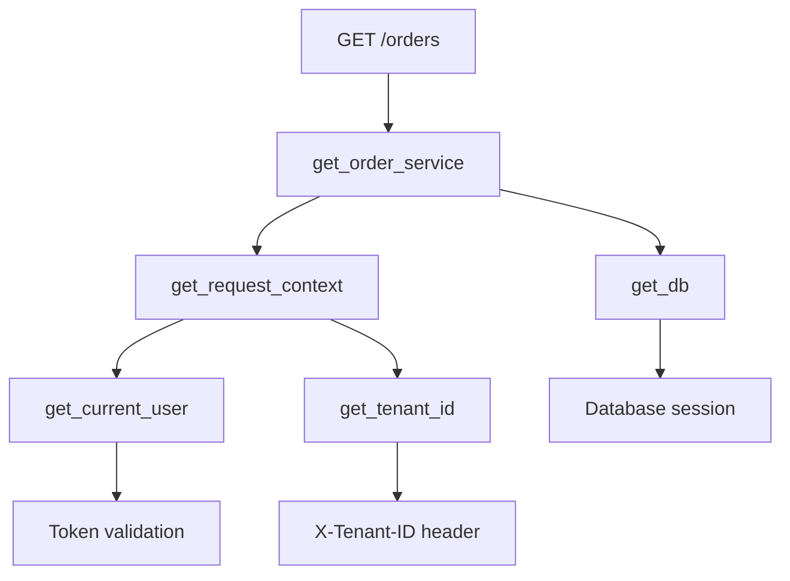

The endpoint only knows that it needs an `OrderService`.

The dependency graph handles:

- Database lifecycle
- Token validation
- User loading
- Tenant validation
- Service construction

## Layer responsibility

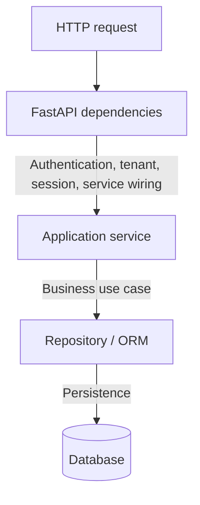

This is a practical form of dependency injection without requiring a separate DI container.

---

# 21. Design Guidelines

## Keep each dependency focused

A dependency should have one clear responsibility.

Good separation:

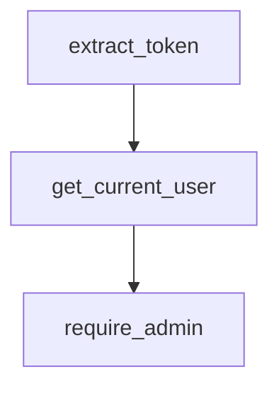

Avoid one large dependency that parses headers, validates tokens, loads the user, checks permissions, creates a database session, and performs the business operation.

## Return meaningful typed objects

Prefer:

```python
def get_current_user(...) -> User:
    ...
```

over loosely structured output:

```python
def get_current_user(...) -> dict:
    ...
```

Typed domain objects improve editor support and reduce key-name errors.

## Use dependencies for request-scoped wiring

Dependencies are ideal for objects that are created or resolved per request:

- Session
- User
- Tenant
- Request context
- Service
- Repository

Application-wide clients and connection pools are often better created during application lifespan and then exposed through lightweight dependencies.

## Keep business logic out of dependency wiring

A dependency may construct an `OrderService`, but the service should execute the order use case.

```text
Dependency: create/provide required object
Service: execute business operation
Endpoint: translate HTTP input/output
```

## Prefer `Annotated` aliases for repeated dependencies

```python
CurrentUser = Annotated[User, Depends(get_current_user)]
DbSession = Annotated[Session, Depends(get_db)]
```

This reduces noisy endpoint signatures without hiding the injected value's type.

## Use decorator dependencies when no value is needed

```python
dependencies=[Depends(verify_api_key)]
```

This clearly communicates that the dependency is a gate or side-effect check.

## Preserve request-level caching by default

The default `use_cache=True` is appropriate for most dependencies.

Disable it only when repeated execution within the same request is required.

## Use `yield` for lifecycle-managed resources

```python
def get_resource():
    resource = open_resource()

    try:
        yield resource
    finally:
        resource.close()
```

This is appropriate for sessions, temporary clients, locks, and other resources requiring reliable cleanup.

## Make dependencies easy to override

Depend on stable named callables:

```python
Depends(get_payment_gateway)
```

Tests can replace them:

```python
app.dependency_overrides[get_payment_gateway] = get_fake_gateway
```

Avoid hiding dependency construction inside endpoint bodies.

---

# 22. Key Takeaways

- `Depends` lets a path operation declare the values or checks it requires.
- FastAPI inspects dependency callables, resolves their parameters, executes them, and injects their results.
- Dependencies can form nested graphs through sub-dependencies.
- Modern FastAPI code should prefer `Annotated[Type, Depends(...)]` where possible.
- The same dependency result is cached once per request by default.
- Use `yield` when a dependency requires cleanup.
- `scope="request"` cleans up after the response; `scope="function"` cleans up before the response is sent.
- Use parameter dependencies when an endpoint needs the returned value.
- Use route, router, or application dependency lists when only execution is required.
- Use dependencies for authentication, authorization, database sessions, tenant context, and service construction.
- Use middleware for cross-cutting HTTP request/response behavior such as logging, timing, CORS, and tracing.
- Use `Security()` instead of `Depends()` when OAuth2 scopes must appear in OpenAPI.
- Use `app.dependency_overrides` to replace production dependencies during tests.
- Well-designed dependencies keep endpoints small, typed, reusable, and easy to test.

---

# Official References

- FastAPI Dependencies: <https://fastapi.tiangolo.com/tutorial/dependencies/>
- Sub-dependencies: <https://fastapi.tiangolo.com/tutorial/dependencies/sub-dependencies/>
- Dependencies with `yield`: <https://fastapi.tiangolo.com/tutorial/dependencies/dependencies-with-yield/>
- Classes as Dependencies: <https://fastapi.tiangolo.com/tutorial/dependencies/classes-as-dependencies/>
- Dependencies in Path Operation Decorators: <https://fastapi.tiangolo.com/tutorial/dependencies/dependencies-in-path-operation-decorators/>
- Global Dependencies: <https://fastapi.tiangolo.com/tutorial/dependencies/global-dependencies/>
- Advanced Dependencies: <https://fastapi.tiangolo.com/advanced/advanced-dependencies/>
- Dependency Reference: <https://fastapi.tiangolo.com/reference/dependencies/>
- Testing Dependency Overrides: <https://fastapi.tiangolo.com/advanced/testing-dependencies/>
- Bigger Applications and `APIRouter`: <https://fastapi.tiangolo.com/tutorial/bigger-applications/>
