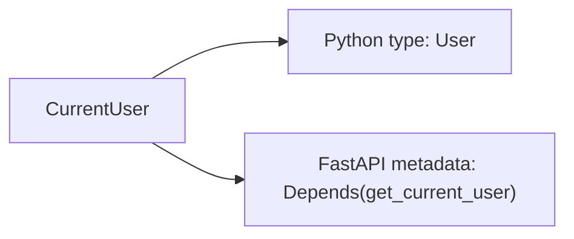
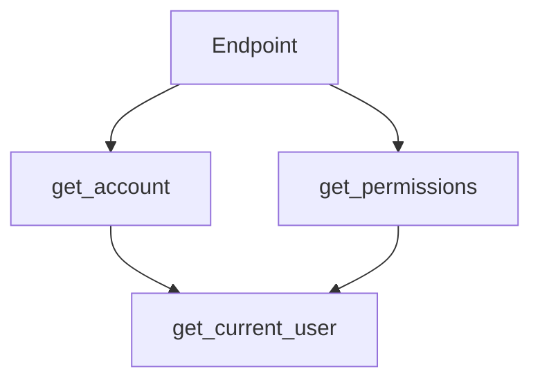
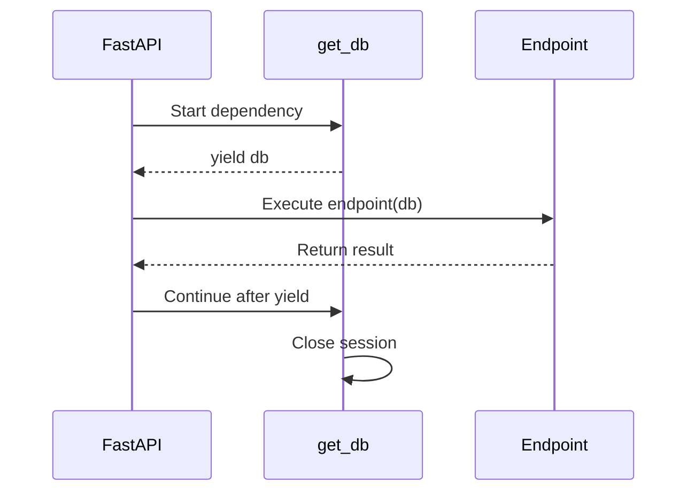
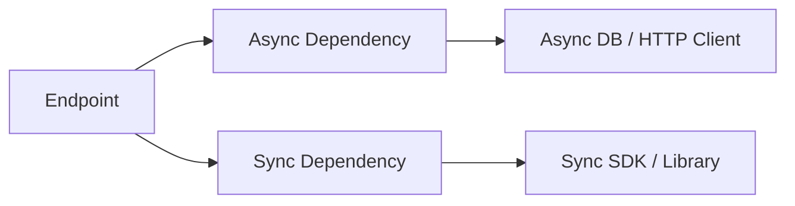
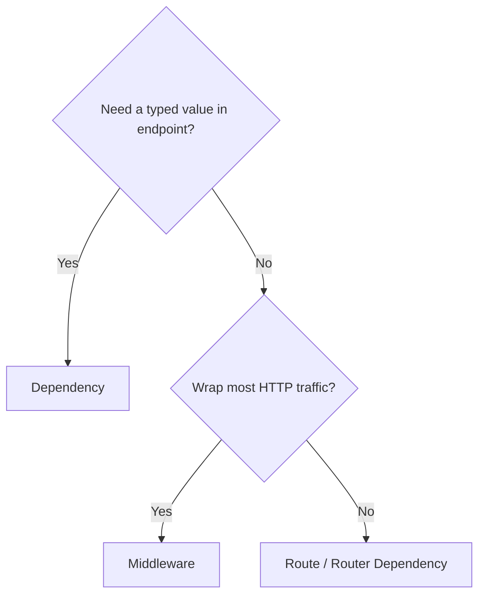
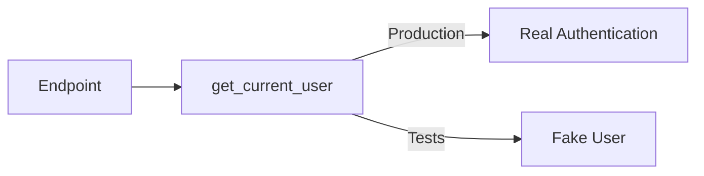
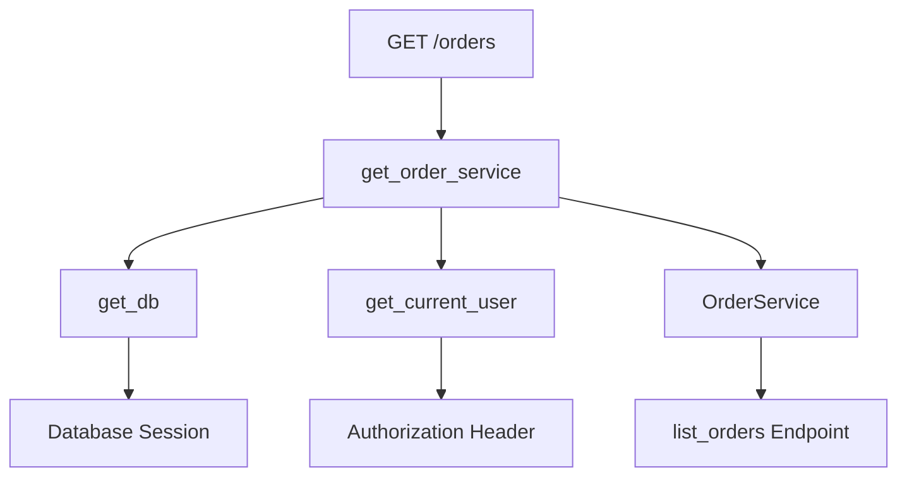
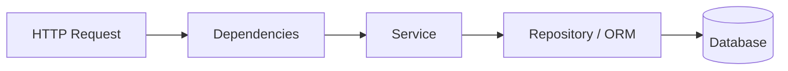
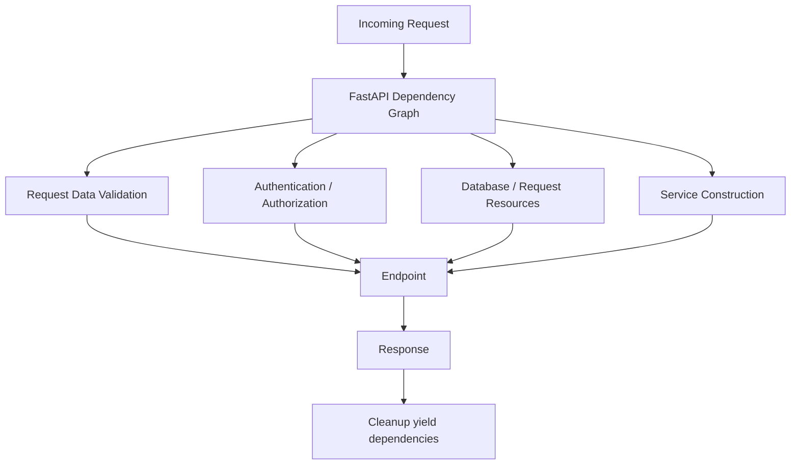

# FastAPI Dependency Injection (`Depends`)

> FastAPI dependency injection lets an endpoint **declare what it needs**—such as a database session, authenticated user, pagination values, or service object—and FastAPI resolves and injects those values before the endpoint runs.

> **Examples:** Python 3.10+ with modern `Annotated` syntax.

---

## Index

1. Dependency Injection Mental Model
2. How `Depends` Works
3. Reusable Dependencies with `Annotated`
4. Sub-dependencies and Request Caching
5. Dependencies with `yield`
6. Authentication and Authorization
7. Where Dependencies Can Be Applied
8. Sync vs Async Dependencies
9. `Depends` vs Middleware
10. `Depends` vs `Security`
11. Testing with Dependency Overrides
12. Practical Example
13. Best-Practice Summary

---

# 1. Dependency Injection Mental Model

Dependency Injection (DI) means a function **declares its requirements**, while another system provides them.

Without DI, an endpoint often creates infrastructure itself:

```python
@app.get("/orders")
def list_orders():
    db = create_session()
    user = authenticate_request()

    try:
        return load_orders(db, user)
    finally:
        db.close()
```

The endpoint now handles database lifecycle, authentication, and business work.

With FastAPI DI:

```python
@app.get("/orders")
def list_orders(
    db: DbSession,
    user: CurrentUser,
):
    return load_orders(db, user)
```

The endpoint only describes what it needs.

### Mental model

| Endpoint declares | FastAPI resolves |
|---|---|
| `DbSession` | Database session |
| `CurrentUser` | Authenticated user |
| `Pagination` | Validated query parameters |
| `OrderServiceDep` | Ready-to-use service |


The important idea is:

> **Endpoints describe requirements; dependencies handle request-level setup and reusable checks.**

---

# 2. How `Depends` Works

The common form is:

```python
Depends(some_callable)
```

FastAPI can use many kinds of callables as dependencies:

- Normal functions
- `async def` functions
- Classes
- Callable objects implementing `__call__`
- Generator dependencies using `yield`
- Async generator dependencies using `yield`

Example:

```python
from typing import Annotated

from fastapi import Depends, FastAPI, Query

app = FastAPI()


def get_pagination(
    page: Annotated[int, Query(ge=1)] = 1,
    page_size: Annotated[int, Query(ge=1, le=100)] = 20,
) -> dict[str, int]:
    return {
        "page": page,
        "page_size": page_size,
        "offset": (page - 1) * page_size,
    }


@app.get("/products")
def list_products(
    pagination: Annotated[
        dict[str, int],
        Depends(get_pagination),
    ],
):
    return pagination
```

For:

```text
GET /products?page=3&page_size=10
```

FastAPI:

1. Detects `get_pagination`.
2. Reads the query parameters.
3. Validates them.
4. Calls the dependency.
5. Injects its returned value.
6. Calls the endpoint.

Result:

```json
{
  "page": 3,
  "page_size": 10,
  "offset": 20
}
```

### Important syntax

Pass the callable itself:

```python
Depends(get_pagination)    # Correct
```

FastAPI needs the callable so it can inspect its parameters and resolve any nested dependencies.

---

# 3. Reusable Dependencies with `Annotated`

Modern FastAPI code commonly uses `typing.Annotated` to combine a Python type with FastAPI dependency metadata.

Instead of repeating:

```python
user: Annotated[User, Depends(get_current_user)]
```

create a reusable alias:

```python
CurrentUser = Annotated[
    User,
    Depends(get_current_user),
]
```

Then endpoints stay clean:

```python
@app.get("/profile")
def read_profile(user: CurrentUser):
    return user
```

The alias means two things:



Typical aliases in a real project:

```python
DbSession = Annotated[Session, Depends(get_db)]
CurrentUser = Annotated[User, Depends(get_current_user)]
AdminUser = Annotated[User, Depends(require_admin)]
Pagination = Annotated[PaginationParams, Depends()]
```

This keeps type information visible while reducing repeated dependency wiring.

---

# 4. Sub-dependencies and Request Caching

A dependency can depend on another dependency.

For example:

```python
def get_access_token(...) -> str:
    ...


def get_current_user(
    token: Annotated[str, Depends(get_access_token)],
) -> User:
    ...


def require_admin(
    user: Annotated[User, Depends(get_current_user)],
) -> User:
    ...
```

FastAPI resolves the deepest requirement first:


This creates a **dependency graph**.

### Per-request caching

If the same dependency is required multiple times in one request, FastAPI normally executes it once and reuses the result.



`get_current_user()` is normally resolved once for that request.

The default behavior is:

```python
Depends(get_current_user, use_cache=True)
```

Use:

```python
Depends(get_value, use_cache=False)
```

only when the dependency must intentionally run again within the same request.

> This cache is **request-scoped**. It is not an application-wide cache.

---

# 5. Dependencies with `yield`

Use `yield` when a dependency needs both **setup and cleanup**.

Database sessions are the common example:

```python
from collections.abc import Generator

from sqlalchemy.orm import Session


def get_db() -> Generator[Session, None, None]:
    db = SessionLocal()

    try:
        yield db
    finally:
        db.close()
```

Create an alias:

```python
DbSession = Annotated[
    Session,
    Depends(get_db),
]
```

Lifecycle:



The `finally` block ensures cleanup even when an exception occurs.

### Cleanup scope

A `yield` dependency can use two scopes:

| Scope | Cleanup timing |
|---|---|
| `request` | After the response is sent |
| `function` | After the endpoint function returns, before the response is sent |

`request` is the default for a dependency using `yield`.

Example:

```python
EarlyDbSession = Annotated[
    Session,
    Depends(get_db, scope="function"),
]
```

Use `scope="function"` when the resource is no longer needed after the path operation returns and should be released earlier.

---

# 6. Authentication and Authorization

Dependencies are a natural place for request-level security.

### Authentication

Authentication answers:

> **Who is making this request?**

```python
def get_current_user(
    token: Annotated[str, Depends(get_access_token)],
) -> User:
    user = validate_token_and_load_user(token)

    if user is None:
        raise HTTPException(
            status_code=401,
            detail="Invalid credentials",
        )

    return user
```

Alias:

```python
CurrentUser = Annotated[
    User,
    Depends(get_current_user),
]
```

### Authorization

Authorization answers:

> **Is this user allowed to perform this operation?**

```python
def require_admin(user: CurrentUser) -> User:
    if user.role != "admin":
        raise HTTPException(
            status_code=403,
            detail="Admin access required",
        )

    return user


AdminUser = Annotated[
    User,
    Depends(require_admin),
]
```

Then different routes can declare different access requirements:

```python
@app.get("/account")
def read_account(user: CurrentUser):
    ...


@app.delete("/admin/users/{user_id}")
def delete_user(
    user_id: int,
    admin: AdminUser,
):
    ...
```

This keeps reusable authentication separate from route-specific authorization.

---

# 7. Where Dependencies Can Be Applied

FastAPI allows dependencies at several levels.

## 7.1 Endpoint parameter

Use when the endpoint needs the returned value.

```python
@app.get("/profile")
def read_profile(user: CurrentUser):
    return user
```

## 7.2 Route decorator

Use when the dependency must run but its value is not needed.

```python
@app.get(
    "/internal/status",
    dependencies=[Depends(verify_api_key)],
)
def internal_status():
    return {"status": "ok"}
```

## 7.3 Router level

Apply shared checks to a feature group:

```python
router = APIRouter(
    prefix="/admin",
    dependencies=[Depends(verify_api_key)],
)
```

## 7.4 While including a router

```python
app.include_router(
    router,
    dependencies=[Depends(require_internal_network)],
)
```

## 7.5 Application level

```python
app = FastAPI(
    dependencies=[Depends(add_request_context)],
)
```

### Choosing the level

| Requirement | Best location |
|---|---|
| Endpoint needs dependency value | Parameter |
| One endpoint needs a check | Route decorator |
| Feature group shares a rule | `APIRouter` |
| Rule added while mounting router | `include_router()` |
| Every path operation needs it | `FastAPI(...)` |

---

# 8. Sync vs Async Dependencies

FastAPI supports both synchronous and asynchronous dependency functions.

### Async dependency

Use `async def` when the work itself uses async I/O:

```python
async def get_remote_profile(
    user: CurrentUser,
) -> Profile:
    return await profile_client.fetch(user.id)
```

### Sync dependency

Use `def` with synchronous libraries:

```python
def get_legacy_record(record_id: int) -> dict:
    return legacy_client.fetch(record_id)
```

FastAPI can mix both styles in the same dependency graph.



Normal synchronous dependencies executed by FastAPI are handled so they do not run directly on the event loop.

The practical rule is simple:

- Use `async def` when you actually need `await`.
- Use `def` for synchronous libraries.
- Do not put long blocking I/O inside an `async def` dependency.
- Move heavy CPU work to an appropriate worker/process system.

---

# 9. `Depends` vs Middleware

Both can run shared logic, but they work at different layers.

| Area | Dependency | Middleware |
|---|---|---|
| Route-specific | Yes | Usually not naturally |
| Inject typed values | Yes | No direct parameter injection |
| Sub-dependencies | Yes | No DI graph |
| Request parameter validation | Yes | Manual |
| OpenAPI integration | Often | Usually no |
| Wraps whole request/response cycle | Only where applied | Yes |

### Use dependencies for

- Current user
- Permission checks
- Database sessions
- Tenant context
- Pagination
- Request-scoped services

### Use middleware for

- Request logging
- CORS
- Timing
- Trace/request IDs
- Compression
- Global response headers



---

# 10. `Depends` vs `Security`

`Security()` uses the same dependency system as `Depends()`.

Use `Depends()` for normal dependency injection and for security logic that does not need OAuth2 scope metadata.

Use `Security()` when the route declares OAuth2 scopes that should also appear in OpenAPI.

```python
from fastapi import Security


@app.get("/users/me/items")
def read_own_items(
    user: Annotated[
        User,
        Security(
            get_current_user,
            scopes=["items:read"],
        ),
    ],
):
    ...
```

| Feature | `Depends` | `Security` |
|---|---|---|
| Dependency injection | Yes | Yes |
| Authentication logic | Yes | Yes |
| OAuth2 scope declaration | No | Yes |
| Scope metadata in OpenAPI | No | Yes |

For many internal APIs, plain `Depends()` is sufficient. Use `Security()` when OAuth2 scopes are part of the API authorization contract.

---

# 11. Testing with Dependency Overrides

FastAPI lets tests replace production dependencies without changing endpoint code.

Production dependency:

```python
def get_current_user() -> User:
    ...
```

Test replacement:

```python
def override_current_user() -> User:
    return User(
        id=999,
        username="test-user",
        role="admin",
    )
```

Register the override:

```python
app.dependency_overrides[get_current_user] = (
    override_current_user
)
```

FastAPI now uses the override anywhere the original dependency is required.

After the test:

```python
app.dependency_overrides.clear()
```

This is especially useful for replacing:

- Authentication providers
- Database dependencies
- External API clients
- Payment gateways
- Expensive integrations



---

# 12. Practical Example

The following example shows the most common real-world pattern: **database session + authenticated user + service injection**.

## 12.1 Database dependency

```python
def get_db():
    db = SessionLocal()

    try:
        yield db
    finally:
        db.close()


DbSession = Annotated[
    Session,
    Depends(get_db),
]
```

## 12.2 Current-user dependency

```python
def get_current_user(
    authorization: Annotated[str | None, Header()] = None,
) -> User:
    if not authorization:
        raise HTTPException(
            status_code=401,
            detail="Missing authorization header",
        )

    user = authenticate(authorization)

    if user is None:
        raise HTTPException(
            status_code=401,
            detail="Invalid credentials",
        )

    return user


CurrentUser = Annotated[
    User,
    Depends(get_current_user),
]
```

## 12.3 Service dependency

```python
class OrderService:
    def __init__(
        self,
        db: Session,
        user: User,
    ) -> None:
        self.db = db
        self.user = user

    def list_orders(self):
        return (
            self.db.query(Order)
            .filter(Order.user_id == self.user.id)
            .all()
        )


def get_order_service(
    db: DbSession,
    user: CurrentUser,
) -> OrderService:
    return OrderService(
        db=db,
        user=user,
    )


OrderServiceDep = Annotated[
    OrderService,
    Depends(get_order_service),
]
```

## 12.4 Endpoint

```python
@router.get("/orders")
def list_orders(service: OrderServiceDep):
    return service.list_orders()
```

The endpoint has only one visible requirement, while FastAPI resolves the full graph:



The responsibilities stay separated:



This is the form of dependency injection you will see frequently in production FastAPI applications.

---

# 13. Best-Practice Summary

### Keep dependencies focused

A dependency should resolve one clear concern:

```text
token → current user → permission check
```

Avoid mixing authentication, database creation, permission checks, and business operations into one large dependency.

### Prefer typed return values

```python
def get_current_user(...) -> User:
    ...
```

Typed objects are clearer than loosely structured dictionaries.

### Prefer `Annotated` aliases for repeated dependencies

```python
CurrentUser = Annotated[
    User,
    Depends(get_current_user),
]
```

They keep route signatures readable without hiding the injected type.

### Use `yield` for lifecycle-managed resources

Use it for objects that need reliable cleanup, especially database sessions and temporary clients.

### Keep request wiring separate from business logic

Dependencies should **provide objects or validate request-level requirements**.

Services should execute business use cases.

### Preserve request caching unless repeated execution is intentional

The default `use_cache=True` is correct for most dependencies such as users, sessions, tenant context, and service objects.

### Use the narrowest dependency level

Apply a dependency only where it belongs: endpoint, route, router, or application.

---

## Final Mental Model



> **Remember:** `Depends` is not just a helper for calling functions. It is FastAPI's request-level dependency graph for validation, authentication, resource lifecycle, reusable services, and testable application wiring.
