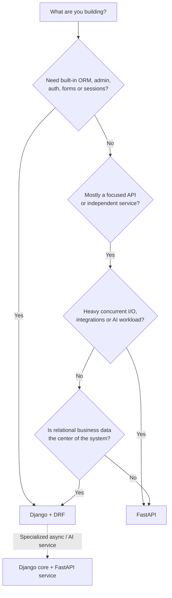
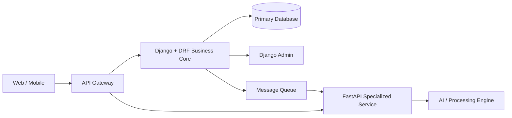

# FastAPI vs Django: When to Pick Which

> Understand the practical difference between FastAPI and Django, where each framework fits best, and how to choose confidently for real projects.
>
> **Versions referenced:** FastAPI 0.141.1, Django 6.1, and Django REST Framework 3.18.0.

## In short

- **FastAPI** is an API-first framework. It gives you type-based validation, dependency injection, automatic OpenAPI documentation, and strong async support, while letting you choose components such as the ORM, migrations, and authentication system.
- **Django** is a batteries-included web framework. It provides an ORM, migrations, authentication, sessions, forms, templates, middleware, and a powerful admin site.
- For API development, the practical comparison is usually **FastAPI vs Django + Django REST Framework (DRF)**, because DRF adds serializers, API views/viewsets, routers, permissions, filtering, pagination, and API-oriented request/response handling.
- Prefer **FastAPI** for focused APIs, microservices, high-concurrency I/O, integrations, and AI/ML services.
- Prefer **Django + DRF** for relational, CRUD-heavy business applications where admin operations, users, permissions, and integrated data management matter.
- Both support async. Async is mainly useful for **I/O-bound waiting** such as database, HTTP, or network calls; it does not make CPU-heavy Python work automatically faster.
- Do not choose only from benchmark numbers. Database design, external calls, serialization, caching, and application architecture usually matter more to real response time.



---

# 1. The Core Difference

FastAPI and Django can both build production web APIs, but their **default responsibilities are different**.

## FastAPI

FastAPI focuses on the API layer:

- HTTP routing
- Request and response validation
- Python type hints
- Pydantic models
- Dependency injection
- OpenAPI schema generation
- Swagger UI / ReDoc
- Async request handling

You normally choose the surrounding components yourself, for example:

```text
FastAPI
  + SQLAlchemy / SQLModel
  + Alembic
  + PostgreSQL
  + JWT / external identity provider
  + Celery / another worker system
```

This makes FastAPI flexible, but the team must define consistent architecture and conventions.

## Django

Django provides a complete application platform:

- ORM
- Database migrations
- Authentication and permissions
- Sessions
- Forms and ModelForms
- Templates
- Admin site
- Middleware
- Security utilities
- Caching support
- Management commands

For REST APIs, Django is commonly paired with **Django REST Framework**.

### Simple mental model

```text
FastAPI      = API-first framework + choose your surrounding components
Django       = Full web application framework
Django + DRF = Full application framework + mature REST API layer
```

The key question is therefore not *“Which one can return JSON faster?”* but:

> **Does the system need a focused API service or an integrated business application platform?**

---

# 2. FastAPI vs Django + DRF

Comparing FastAPI with bare Django is not completely fair for REST API projects.

DRF adds the API features normally expected in a Django API codebase:

- Serializers and validation
- API views and ViewSets
- Routers
- Authentication classes
- Permission classes
- Pagination
- Filtering and search
- Content negotiation
- Browsable API
- OpenAPI/schema tooling

So the practical comparison is usually:

```text
Focused API / service                  -> FastAPI
Business application with REST APIs   -> Django + DRF
```

---

# 3. Feature Comparison

| Area | FastAPI | Django + DRF |
|---|---|---|
| Primary focus | API-first services | Full business/web applications with APIs |
| API validation | Pydantic models | DRF serializers |
| Response validation | Native response models | DRF serializers |
| OpenAPI docs | Automatic and built in | Supported through DRF schema tooling |
| ORM | Not built in | Django ORM built in |
| Migrations | Separate tool, commonly Alembic | Built in |
| Admin panel | Not built in | Built in |
| Authentication | Security primitives; full identity design is application-specific | Users, password hashing, sessions, groups, permissions + DRF auth |
| Dependency injection | First-class feature | Not a central framework pattern |
| Async | ASGI-first and natural for async APIs | Async views and many async APIs under ASGI |
| Templates and forms | Available through integrations, but not the main focus | Built in and deeply integrated |
| Project structure | Flexible | Convention-driven |
| Microservices | Excellent fit | Possible, but often heavier than needed |
| CRUD/business systems | More components must be assembled | Excellent fit |
| Internal operations | Separate admin solution required | Django admin is a major advantage |
| Architecture consistency | Depends heavily on team conventions | Strong framework conventions |

---

# 4. Async and Performance

## 4.1 FastAPI async model

FastAPI supports both synchronous and asynchronous path functions.

```python
@app.get("/sync")
def sync_endpoint():
    return blocking_library_call()


@app.get("/async")
async def async_endpoint():
    return await async_library_call()
```

A normal `def` path function is run in a thread pool by FastAPI. An `async def` path function runs on the async event loop and should avoid directly calling blocking I/O.

Use `async def` when the libraries in the request path are async, for example:

- Async HTTP clients
- Async database drivers
- Async cache clients
- Streaming APIs
- Long-lived network connections

## 4.2 Django async model

Django 6.1 supports async views and an async-enabled request stack under ASGI. Many Django components expose async APIs, including parts of the ORM, cache framework, authentication, sessions, and signals.

However, the full path still matters:

```text
ASGI server
   ↓
Async middleware
   ↓
Async view
   ↓
Async-compatible operations
```

If synchronous middleware or a blocking library is inserted into the path, Django has to adapt between sync and async execution.

A useful Django 6.1 limitation to remember is that **database transactions still need synchronous handling**. Transactional work should remain inside a synchronous function when required.

## 4.3 What async actually improves

Async is best for **I/O-bound concurrency**, not CPU-heavy computation.

```text
Good async workload:
Request -> await external API -> await database -> await cache -> response

CPU-heavy workload:
Request -> image processing / ML inference / PDF parsing / heavy calculation
                     ↓
              worker / separate process
```

For CPU-heavy tasks, use background workers, multiprocessing, dedicated inference services, or specialized compute infrastructure.

## 4.4 Real performance

A more realistic latency model is:

```text
Total response time =
    framework overhead
  + application logic
  + database queries
  + external API calls
  + serialization
  + network time
```

FastAPI is a strong fit for lightweight and highly concurrent API workloads, but that does not mean every FastAPI application will outperform every Django application.

---

# 5. When FastAPI Is the Better Choice

Choose FastAPI when the application is mainly an API or independently deployable service.

## 5.1 API-first backend

Good examples include:

- Mobile application APIs
- React/Vue/Angular backends
- Public developer APIs
- Backend-for-frontend services
- Third-party integration APIs

The request schema is directly visible from Python type hints and Pydantic models, which makes API contracts easy to understand.

## 5.2 Microservices and focused services

FastAPI works especially well for small services with one clear responsibility:

- Notification service
- Search service
- Payment orchestration service
- Document processing API
- Integration gateway
- Recommendation service

A small service often does not need Django's forms, templates, admin, session framework, or complete model stack.

## 5.3 AI and ML services

FastAPI is common around Python AI workloads because it fits naturally with model-serving and orchestration code.

Typical endpoints might look like:

```text
POST /predict
POST /extract-document
POST /generate-summary
POST /embeddings
GET  /jobs/{job_id}
```

It is particularly useful when the API coordinates external LLMs, model servers, object storage, vector databases, or async processing services.

## 5.4 Teams that want component freedom

FastAPI is a good fit when the team intentionally wants to choose its own:

- ORM
- Migration system
- Authentication provider
- Repository/service architecture
- Background worker
- Project layout

The trade-off is that the team must establish those conventions itself.

---

# 6. When Django Is the Better Choice

Choose Django when the system is primarily a **data-driven business application**.

## 6.1 Relational and CRUD-heavy systems

Django is a strong default for applications such as:

- Insurance platforms
- Healthcare administration systems
- ERP/CRM systems
- Recruitment platforms
- E-commerce back offices
- Approval/workflow systems
- Multi-tenant business portals

These applications usually need more than endpoints. They need models, migrations, permissions, operational screens, reports, admin workflows, and strong relational data handling.

## 6.2 Admin and internal operations

The Django admin can create a useful model-based internal interface with very little code.

```python
@admin.register(Product)
class ProductAdmin(admin.ModelAdmin):
    list_display = ["id", "name", "price", "is_active"]
    list_filter = ["is_active"]
    search_fields = ["name"]
```

This can immediately help support, QA, operations, and product teams inspect or manage application data.

The admin should remain an **internal management tool**. Complex customer-facing or process-oriented screens should use dedicated views or a separate frontend.

## 6.3 Authentication and permissions

Django already provides core identity features such as:

- User models
- Password hashing
- Sessions
- Groups
- Permissions
- Authentication middleware
- CSRF protection
- Admin-user management

DRF builds API authentication and permission policies on top of that ecosystem.

## 6.4 Mature monoliths

For many business products, a modular Django monolith is simpler and faster to operate than starting with several microservices.

Benefits include:

- Easier transactions across modules
- Centralized authentication and permissions
- Faster local development
- Fewer distributed-system failures
- Consistent data modeling

Extract a service later when an actual scaling, ownership, dependency, or deployment boundary becomes clear.

---

# 7. Practical Example: Product Creation API

Assume we need this endpoint:

```http
POST /products
```

Request:

```json
{
  "name": "Mechanical Keyboard",
  "price": "129.99"
}
```

## 7.1 FastAPI approach

```python
from decimal import Decimal

from fastapi import FastAPI
from pydantic import BaseModel, Field

app = FastAPI()


class ProductCreate(BaseModel):
    name: str = Field(min_length=2, max_length=120)
    price: Decimal = Field(gt=0)


class ProductResponse(ProductCreate):
    id: int


@app.post("/products", response_model=ProductResponse, status_code=201)
async def create_product(payload: ProductCreate) -> ProductResponse:
    # Normally call a service/repository here.
    return ProductResponse(id=1, **payload.model_dump())
```

FastAPI already gives this endpoint:

- JSON parsing
- Input validation
- Response validation
- OpenAPI schema
- Interactive API docs

The database model, migration, session handling, authentication storage, and admin interface are separate architecture decisions.

## 7.2 Django + DRF approach

```python
# models.py
from django.db import models


class Product(models.Model):
    name = models.CharField(max_length=120)
    price = models.DecimalField(max_digits=10, decimal_places=2)
```

```python
# serializers.py
from rest_framework import serializers
from .models import Product


class ProductSerializer(serializers.ModelSerializer):
    class Meta:
        model = Product
        fields = ["id", "name", "price"]
```

```python
# views.py
from rest_framework.viewsets import ModelViewSet
from .models import Product
from .serializers import ProductSerializer


class ProductViewSet(ModelViewSet):
    queryset = Product.objects.all()
    serializer_class = ProductSerializer
```

The Django version has more framework structure, but the model also participates in:

- ORM queries
- Database migrations
- Admin registration
- DRF CRUD operations
- Permission integration

### Main observation

```text
FastAPI:
Smaller API layer, but more surrounding architecture is selected by the team.

Django + DRF:
More framework structure, but more application capabilities are already integrated.
```

---

# 8. Database, Authentication, and Project Structure

## FastAPI style

A common production structure is:

```text
app/
├── main.py
├── api/
│   └── routes/
├── schemas/
├── models/
├── services/
├── repositories/
├── core/
├── db/
└── tests/
```

This is a convention, not a FastAPI requirement.

A typical relational stack is:

```text
FastAPI + Pydantic + SQLAlchemy + Alembic + PostgreSQL
```

The team should explicitly define:

- Session lifecycle
- Transaction boundaries
- Schema-to-model mapping
- Dependency conventions
- Authentication strategy
- Sync vs async database access

## Django style

A common Django project is split into domain apps:

```text
project/
├── manage.py
├── config/
├── users/
├── products/
├── orders/
└── tests/
```

Each app usually keeps related models, migrations, admin configuration, views, and API serializers close together.

Django 6.1 also adds ORM improvements such as **model field fetch modes**, which can help control on-demand field loading and reduce some N+1-style access patterns.

---

# 9. Using FastAPI and Django Together

The choice does not have to be exclusive.

A common architecture is:



Example:

- Django manages customers, policies, claims, users, permissions, and operations.
- FastAPI exposes document extraction, AI inference, or another independently scalable service.
- Communication happens through HTTP, events, or a message queue.

Use this split only when there is a meaningful boundary such as:

- Different scaling requirements
- Different runtime dependencies
- Independent release cycles
- Separate ownership
- Security isolation
- Clear domain responsibility

Using both frameworks without a real boundary only adds deployment, authentication, tracing, networking, and contract-management complexity.

---

# 10. Decision Framework and Best Practices

## Pick FastAPI when most of these are true

- The product is mainly an API.
- The service has one focused responsibility.
- Concurrent I/O is important.
- The frontend is completely separate.
- OpenAPI-first development is valuable.
- Authentication is externalized or token-oriented.
- The team wants control over ORM and architecture choices.
- The service handles AI, integrations, streaming, or orchestration.

## Pick Django + DRF when most of these are true

- The product is a business application.
- Relational data is central.
- An internal admin is valuable.
- Users, groups, sessions, and permissions are core concepts.
- Rapid CRUD delivery matters.
- The system has many connected business entities.
- Strong framework conventions help the team.
- A modular monolith is a sensible starting architecture.

## Shared best practices

1. **Keep business logic outside endpoints and views.**


2. **Do not force async everywhere.** Use it when the complete request path benefits from non-blocking I/O.

3. **Use `Decimal` for money**, with a suitable database decimal type and explicit currency/rounding rules.

4. **Optimize measured bottlenecks**, especially database queries, N+1 access, external API latency, caching, and worker queues.

5. **Prefer a modular monolith until service boundaries are clear.** Microservices solve specific organizational and scaling problems; they are not automatically a better architecture.

6. **Keep dependencies patched and review release notes before upgrades.** FastAPI remains in the `0.x` series and can evolve quickly; Django and DRF also introduce compatibility changes between feature releases.

---

# Final Takeaway

```text
Choose FastAPI when:
API/service boundaries, async I/O, integrations, or AI workloads are the center of the system.

Choose Django + DRF when:
Relational business data, admin operations, users, permissions, and integrated CRUD are the center of the system.

Use both when:
A real system boundary justifies separate scaling, dependencies, ownership, or deployment.
```

The most interview-relevant idea is that **framework choice should follow the shape of the product and its operational needs, not a simple “FastAPI is faster” benchmark comparison**.
