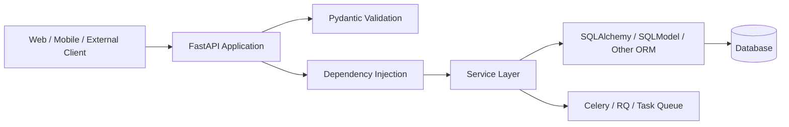
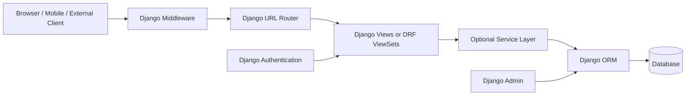
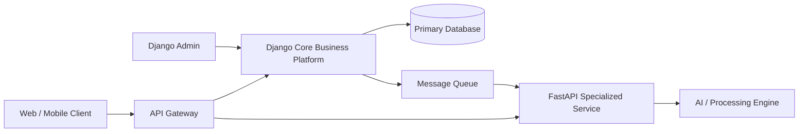
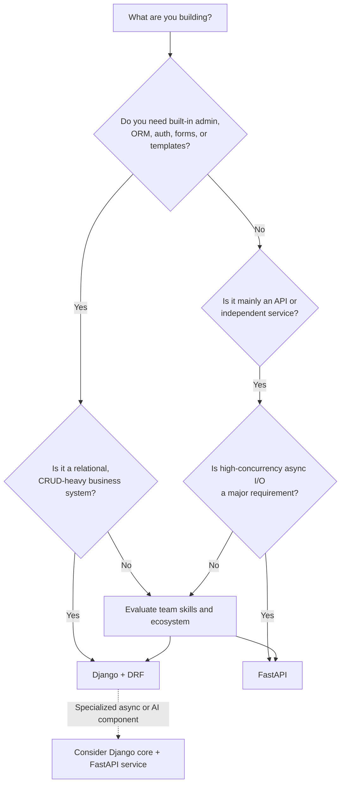

# FastAPI vs Django: When to Pick Which

> **Topic:** FastAPI  
> **Audience:** Python developers with 3+ years of experience  
> **Purpose:** Understand the practical differences between FastAPI and Django and make a confident framework choice for real projects and technical discussions  
> **Last verified:** July 27, 2026  
> **Versions referenced:** FastAPI 0.139.0 and Django 6.0.7

---

# 1. The Core Difference

FastAPI and Django are both Python web frameworks, but they solve different default problems.

## FastAPI

FastAPI is primarily an **API-first framework**.

It is designed around:

- HTTP APIs
- Python type hints
- Request and response validation
- OpenAPI schema generation
- Interactive API documentation
- Dependency injection
- Asynchronous request handling
- Lightweight service architecture

FastAPI gives you strong API building blocks, but you usually choose and integrate the remaining components yourself, such as:

- ORM
- Migration tool
- Admin interface
- Authentication storage
- Background job system
- Project structure

## Django

Django is primarily a **full web application framework**.

It includes an integrated set of components:

- ORM
- Database migrations
- Authentication
- Sessions
- Forms
- Templates
- Admin panel
- Middleware
- Security protections
- Caching utilities
- Management commands

For REST APIs, Django is commonly used with **Django REST Framework**, usually called DRF.

## Simple Mental Model

```text
FastAPI
    = API toolkit with modern typing and async-first design

Django
    = Complete web application platform

Django + DRF
    = Complete web platform with a mature REST API layer
```

The decision should therefore not be based only on which framework can return JSON faster.

The better question is:

> Does the project need a focused API service, or does it need an integrated business application platform?

---

# 2. A Fair Comparison: FastAPI vs Django + DRF

Comparing FastAPI directly with core Django can be misleading.

Core Django can return JSON, but Django REST Framework adds the API-specific features normally expected in production systems:

- Serializers
- Request parsing
- Authentication policies
- Permissions
- Pagination
- Filtering
- ViewSets
- Routers
- Browsable API
- OpenAPI schema support

Therefore, use the following comparison in practice:

```text
API-only or service-oriented application:
FastAPI

Database-heavy business application with APIs:
Django + Django REST Framework
```

---

# 3. High-Level Architecture

## FastAPI-Oriented Architecture



FastAPI provides the HTTP and API layer. The development team selects the data, task, and administration components.

## Django-Oriented Architecture



Django provides more of the application platform as one integrated system.

---

# 4. Feature Comparison

| Area | FastAPI | Django / Django REST Framework |
|---|---|---|
| Primary purpose | API-first services | Full web and business applications |
| Default architecture | Lightweight and composable | Integrated and convention-driven |
| Async model | First-class ASGI and async support | Supports async views and ASGI; some application paths may remain synchronous |
| Request validation | Pydantic models and type hints | Django Forms or DRF Serializers |
| Response validation | Native `response_model` support | DRF Serializers |
| API documentation | Automatic Swagger UI and ReDoc | Available through DRF schema tooling or third-party packages |
| ORM | Not built in | Built-in Django ORM |
| Migrations | Chosen separately, often Alembic | Built-in migration framework |
| Admin panel | Not built in | Powerful built-in admin |
| Authentication | Security utilities; application integration required | Built-in users, sessions, permissions, and DRF authentication options |
| Dependency injection | Built in | Not a central framework feature |
| Templates | Possible through Starlette/Jinja integration | Built-in template system |
| Forms | No full built-in forms framework | Built-in Forms and ModelForms |
| Project conventions | Flexible | Strong conventions |
| Microservices | Excellent fit | Possible, but often heavier than necessary |
| Business CRUD systems | Requires more assembly | Excellent fit |
| WebSockets | Strong ASGI ecosystem support | Supported through ASGI, commonly with Channels or related tooling |
| Learning focus | Typing, async, Pydantic, DI | ORM, apps, settings, middleware, models, migrations, DRF |
| Initial API code | Usually small | More structured and sometimes more verbose |
| Long-term consistency | Depends heavily on team architecture | Strong defaults encourage consistency |

---

# 5. When FastAPI Is the Better Choice

Choose FastAPI when the system is mainly an API or independently deployable service.

## 5.1 API-First Products

FastAPI is a strong choice when the backend exists mainly to serve:

- Mobile applications
- React, Vue, or Angular frontends
- Third-party integrations
- Public developer APIs
- Internal platform APIs
- Backend-for-frontend services

Its type-driven request declarations make API contracts visible directly in the endpoint code.

## 5.2 High-Concurrency I/O Workloads

FastAPI works well when requests spend significant time waiting for I/O:

- Calling external APIs
- Querying async database drivers
- Reading from object storage
- Communicating with message brokers
- Streaming data
- Maintaining many network connections

Async does not make CPU work faster. It improves resource usage when many requests are waiting on external operations.

## 5.3 Microservices

FastAPI is usually easier to adopt for focused services such as:

- Payment orchestration service
- Notification service
- Search service
- Recommendation API
- Document processing API
- Authentication gateway
- AI inference service

A small service may not need Django’s admin, forms, template system, session framework, or complete ORM integration.

## 5.4 Machine Learning and AI APIs

FastAPI fits naturally around Python-based ML systems because:

- Models are commonly loaded in Python.
- Input schemas can be expressed using Pydantic.
- OpenAPI documentation is generated automatically.
- Async endpoints can coordinate calls to model servers or external AI services.
- It is straightforward to build inference and orchestration endpoints.

Example use cases:

```text
POST /predict
POST /extract-document
POST /generate-summary
POST /embeddings
GET  /jobs/{job_id}
```

## 5.5 Teams That Need Component Freedom

FastAPI is appropriate when the team wants to choose:

- SQLAlchemy instead of a framework-owned ORM
- Alembic for migrations
- A custom identity provider
- A separate frontend
- A specific repository or service-layer pattern
- Different libraries for different services

This flexibility is valuable, but it creates architectural responsibility. Without team conventions, two FastAPI services can end up looking completely different.

---

# 6. When Django Is the Better Choice

Choose Django when the project is a data-driven business application rather than only an API transport layer.

## 6.1 Database-Heavy Business Systems

Django is especially effective for:

- Insurance platforms
- Healthcare administration systems
- ERP applications
- CRM systems
- Recruitment platforms
- E-commerce back offices
- Workflow and approval systems
- Content management applications
- Multi-tenant business portals

These systems usually require more than endpoints. They require models, permissions, admin operations, migrations, forms, reports, and internal workflows.

## 6.2 Admin and Operations Are Important

Django’s admin can provide internal users with a working data-management interface very early in development.

For example, an insurance platform may need operations teams to manage:

- Policies
- Customers
- Claims
- Documents
- Payment status
- Reference data
- Product configuration

FastAPI can support the same business logic, but the admin experience must be built or integrated separately.

## 6.3 Built-In Authentication and Sessions

Django is a strong default when the application needs:

- User accounts
- Password authentication
- Groups
- Permissions
- Session-based login
- CSRF protection
- Password reset flows
- Admin-user management

FastAPI provides security primitives and OpenAPI security integration, but a complete identity system still needs to be designed or connected.

## 6.4 Server-Rendered Web Applications

Django is normally the better choice when the backend must render:

- HTML pages
- Forms
- Validation errors
- Internal portals
- Content pages
- Traditional multi-page applications

FastAPI can render templates, but Django’s template, form, CSRF, session, and model ecosystems are more integrated.

## 6.5 Mature Monoliths

A well-structured Django monolith is often a sensible starting point for a business product.

It can provide:

- Faster feature delivery
- Simple transactions across modules
- Centralized permissions
- Easier local development
- Fewer distributed-system problems
- Consistent data modeling

Do not choose microservices only because FastAPI makes small services easy to create. Service boundaries should follow business and scaling needs.

---

# 7. Practical Example: Building the Same API

Consider a simple endpoint that creates a product.

Request:

```json
{
  "name": "Mechanical Keyboard",
  "price": 129.99,
  "is_active": true
}
```

Response:

```json
{
  "id": 1,
  "name": "Mechanical Keyboard",
  "price": 129.99,
  "is_active": true
}
```

## 7.1 FastAPI Version

```python
from typing import Annotated

from fastapi import Depends, FastAPI, status
from pydantic import BaseModel, ConfigDict, Field

app = FastAPI()


class ProductCreate(BaseModel):
    name: str = Field(min_length=2, max_length=120)
    price: float = Field(gt=0)
    is_active: bool = True


class ProductResponse(ProductCreate):
    model_config = ConfigDict(from_attributes=True)

    id: int


def get_current_user() -> dict:
    # Replace with real token validation.
    return {"id": 42, "role": "admin"}


@app.post(
    "/products",
    response_model=ProductResponse,
    status_code=status.HTTP_201_CREATED,
)
async def create_product(
    payload: ProductCreate,
    current_user: Annotated[dict, Depends(get_current_user)],
) -> ProductResponse:
    # Replace with service and repository/database code.
    return ProductResponse(id=1, **payload.model_dump())
```

What FastAPI provides here:

- JSON parsing
- Input validation
- Output validation
- OpenAPI schema
- Swagger UI
- Dependency injection
- HTTP status handling

What is not shown:

- Database model
- ORM session
- Migration
- Persistent authentication model
- Admin interface

These are selected and configured separately.

## 7.2 Django + DRF Version

### Model

```python
# products/models.py

from django.db import models


class Product(models.Model):
    name = models.CharField(max_length=120)
    price = models.DecimalField(max_digits=10, decimal_places=2)
    is_active = models.BooleanField(default=True)
    created_at = models.DateTimeField(auto_now_add=True)

    def __str__(self) -> str:
        return self.name
```

### Serializer

```python
# products/serializers.py

from rest_framework import serializers

from .models import Product


class ProductSerializer(serializers.ModelSerializer):
    class Meta:
        model = Product
        fields = ["id", "name", "price", "is_active"]
        read_only_fields = ["id"]

    def validate_price(self, value):
        if value <= 0:
            raise serializers.ValidationError(
                "Price must be greater than zero."
            )
        return value
```

### ViewSet

```python
# products/views.py

from rest_framework.permissions import IsAdminUser
from rest_framework.viewsets import ModelViewSet

from .models import Product
from .serializers import ProductSerializer


class ProductViewSet(ModelViewSet):
    queryset = Product.objects.all()
    serializer_class = ProductSerializer
    permission_classes = [IsAdminUser]
```

### Router

```python
# config/urls.py

from django.contrib import admin
from django.urls import include, path
from rest_framework.routers import DefaultRouter

from products.views import ProductViewSet

router = DefaultRouter()
router.register("products", ProductViewSet, basename="product")

urlpatterns = [
    path("admin/", admin.site.urls),
    path("api/", include(router.urls)),
]
```

### Admin Registration

```python
# products/admin.py

from django.contrib import admin

from .models import Product


@admin.register(Product)
class ProductAdmin(admin.ModelAdmin):
    list_display = ["id", "name", "price", "is_active"]
    list_filter = ["is_active"]
    search_fields = ["name"]
```

Django requires more framework structure, but this structure also gives the project:

- Persistent model
- Migration support
- ORM query API
- CRUD API
- Permission integration
- Routing
- Admin interface

## Main Observation

```text
FastAPI:
Less framework code for the HTTP API itself,
but more architecture must be selected around it.

Django:
More framework structure,
but more application capabilities arrive already integrated.
```

---

# 8. Async and Performance

## 8.1 FastAPI Async Model

FastAPI is built on ASGI technologies and is designed to support both:

```python
@app.get("/sync")
def sync_endpoint():
    return blocking_library_call()
```

and:

```python
@app.get("/async")
async def async_endpoint():
    return await async_library_call()
```

FastAPI handles normal `def` endpoints and `async def` endpoints differently so that both can be used in one application.

Use `async def` when the libraries called by the endpoint are asynchronous.

Use normal `def` when the endpoint calls blocking libraries that do not support `await`, unless that blocking work is explicitly moved to an appropriate thread or worker.

## 8.2 Django Async Model

Modern Django supports:

- ASGI deployment
- Async views
- Async middleware support
- Async ORM operations for many query patterns
- Sync-to-async adapters where required

However, the entire request path must be considered.

A single synchronous middleware or blocking library can reduce the benefit of an otherwise asynchronous request path.

## 8.3 Performance Is More Than Framework Overhead

Application response time is often dominated by:

```text
Database query time
+ external API latency
+ serialization cost
+ cache access
+ network overhead
+ business logic
```

Framework overhead may be a small part of total latency.

A useful performance model is:

```text
Total latency =
    framework overhead
  + business logic
  + database time
  + external service time
  + serialization
  + network time
```

FastAPI usually has an advantage for lightweight, high-concurrency API workloads, especially when the complete stack is asynchronous.

Django can still scale very well when:

- Queries are optimized.
- Caching is used correctly.
- Static files are handled outside the application.
- Work is distributed across processes.
- Expensive tasks are moved to workers.
- The database is properly indexed.
- The application is profiled before optimization.

## Important Rule

> Choose FastAPI because its API-first and async model fits the system—not only because its name contains “Fast.”

---

# 9. Database and ORM Considerations

## FastAPI

FastAPI does not force a database layer.

Common choices include:

- SQLAlchemy
- SQLModel
- Django ORM used independently in advanced integrations
- Tortoise ORM
- MongoDB clients
- Direct database drivers
- Repository abstractions

A common relational stack is:

```text
FastAPI
+ Pydantic
+ SQLAlchemy
+ Alembic
+ PostgreSQL
```

This provides flexibility, but the team must define:

- Session lifecycle
- Transaction boundaries
- Repository conventions
- Migration workflow
- Model-to-schema mapping
- Async versus sync database access
- Testing strategy

## Django

Django’s ORM and migrations are integrated into the framework.

A Django model acts as the primary definition of persisted application data:

```text
Model change
    ↓
makemigrations
    ↓
Migration file
    ↓
migrate
    ↓
Database schema updated
```

Django is particularly productive when the domain has:

- Many related tables
- CRUD-heavy workflows
- Frequent schema changes
- Admin-managed reference data
- Complex filters and reports
- Strong model-driven behavior

## Practical Choice

Choose FastAPI when database access is only one replaceable component of a service.

Choose Django when the domain model and relational data management are central to the application.

---

# 10. Authentication, Authorization, and Security

## FastAPI

FastAPI provides tools for implementing security schemes such as:

- OAuth2 flows
- Bearer tokens
- API keys
- OpenID Connect metadata
- Dependency-based access checks

Example:

```python
from typing import Annotated

from fastapi import Depends, HTTPException, status


def require_admin(user: Annotated[dict, Depends(get_current_user)]) -> dict:
    if user["role"] != "admin":
        raise HTTPException(
            status_code=status.HTTP_403_FORBIDDEN,
            detail="Admin access is required.",
        )
    return user
```

This is clean and composable, but the application still needs decisions around:

- User storage
- Token issuing
- Refresh tokens
- Revocation
- Password hashing
- Role model
- Permission model
- Login auditing
- Identity provider integration

## Django

Django includes:

- User model support
- Password hashing
- Sessions
- Groups
- Permissions
- Authentication middleware
- CSRF protection
- Security middleware
- Admin integration

Django also includes protections and utilities related to:

- XSS
- CSRF
- SQL injection through parameterized ORM queries
- Clickjacking
- Host header validation
- HTTPS-related settings
- Content Security Policy configuration in modern Django versions

Django’s defaults are useful for applications with browser logins and internal users.

## Practical Choice

Use FastAPI when authentication is token-based, externalized, or service-oriented.

Use Django when users, sessions, groups, permissions, and browser security are central application concepts.

---

# 11. Admin Panel and Internal Operations

Django’s admin is one of the biggest practical differences between the frameworks.

It reads model metadata and creates an internal, model-oriented management interface.

Example:

```python
@admin.register(Claim)
class ClaimAdmin(admin.ModelAdmin):
    list_display = [
        "claim_number",
        "customer",
        "status",
        "created_at",
    ]
    list_filter = ["status", "created_at"]
    search_fields = [
        "claim_number",
        "customer__email",
    ]
```

This can immediately help:

- Operations teams
- Support teams
- QA engineers
- Product managers
- Data administrators

However, Django’s own documentation recommends the admin mainly as an internal management tool. It should not automatically become the customer-facing frontend.

FastAPI has no equivalent built-in admin. Options include:

- Building a separate admin frontend
- Using a third-party admin package
- Connecting a low-code internal tool
- Creating a dedicated operations service

## Decision Impact

If internal data operations are required from the first release, Django can save significant development time.

---

# 12. Project Structure and Development Style

## Typical FastAPI Structure

```text
app/
├── main.py
├── api/
│   ├── dependencies.py
│   └── routes/
│       ├── users.py
│       └── products.py
├── schemas/
│   ├── user.py
│   └── product.py
├── models/
├── services/
├── repositories/
├── core/
│   ├── config.py
│   └── security.py
├── db/
└── tests/
```

This is only a convention. FastAPI does not require it.

### Benefit

The architecture can be designed around the service.

### Risk

Without agreed conventions, developers may place business logic directly in route functions, mix ORM models with API schemas, or create inconsistent dependency patterns.

## Typical Django Structure

```text
project/
├── manage.py
├── config/
│   ├── settings.py
│   ├── urls.py
│   ├── asgi.py
│   └── wsgi.py
├── users/
│   ├── models.py
│   ├── views.py
│   ├── admin.py
│   ├── apps.py
│   └── migrations/
├── products/
│   ├── models.py
│   ├── serializers.py
│   ├── views.py
│   ├── admin.py
│   └── migrations/
└── tests/
```

Django encourages applications to be divided into reusable domain modules.

### Benefit

Developers familiar with Django can navigate new projects quickly.

### Risk

Large projects can become tightly coupled if every feature directly imports models and logic from every other Django app.

---

# 13. Testing and Maintainability

Both frameworks support production-quality testing.

## FastAPI Testing Style

FastAPI works naturally with:

- `pytest`
- `TestClient`
- `httpx`
- Dependency overrides
- Async test clients
- Mocked service dependencies

Dependency injection makes external components replaceable during tests.

Example concept:

```python
app.dependency_overrides[get_current_user] = lambda: {
    "id": 1,
    "role": "admin",
}
```

## Django Testing Style

Django provides:

- Test client
- Database test setup
- Transaction-aware test classes
- Fixture support
- Management command testing
- Email testing utilities
- Authentication helpers

DRF adds an API test client and request factories.

## Maintainability Difference

FastAPI maintainability depends more heavily on the architecture chosen by the team.

Django maintainability benefits from framework conventions, but teams should still separate:

- HTTP handling
- Domain logic
- Data access
- Integrations
- Long-running tasks

Neither framework prevents bad architecture.

---

# 14. Deployment and Scaling

## FastAPI Deployment

FastAPI applications are normally deployed as ASGI applications using a server such as Uvicorn or another compatible process setup.

```text
Load Balancer
    ↓
ASGI Processes
    ↓
FastAPI Application
    ↓
Database / Cache / External Services
```

Use multiple processes or containers for CPU utilization and availability.

## Django Deployment

Django can run through:

- WSGI for traditional synchronous applications
- ASGI for asynchronous capabilities

```text
Load Balancer
    ↓
WSGI or ASGI Processes
    ↓
Django Application
    ↓
Database / Cache / Task Workers
```

## Scaling Principles Shared by Both

- Keep application instances stateless where possible.
- Store shared session or cache state externally.
- Use connection pooling carefully.
- Add database indexes based on query patterns.
- Avoid N+1 queries.
- Move CPU-heavy and long-running work to worker processes.
- Set request timeouts.
- Apply rate limiting at the gateway or application layer.
- Add metrics, tracing, and structured logs.
- Scale based on measured bottlenecks.

## CPU-Bound Work

Neither FastAPI async endpoints nor Django async views make CPU-heavy Python work automatically scalable.

For tasks such as:

- Image processing
- PDF extraction
- Large report generation
- ML inference
- Video processing
- Heavy calculations

use one or more of:

- Background workers
- Separate inference services
- Multiprocessing
- Specialized compute infrastructure
- Queue-based job execution

---

# 15. Using FastAPI and Django Together

The choice does not always need to be exclusive.

A common architecture is:



Example:

- Django manages customers, policies, claims, permissions, and operations.
- FastAPI exposes a document-extraction or AI-inference service.
- The services communicate through HTTP or a message queue.

This is useful when the specialized service has:

- Different scaling requirements
- Different dependencies
- Heavy async I/O
- ML model dependencies
- Independent release cycles

## Avoid Unnecessary Splitting

Do not split one simple application into Django and FastAPI merely to use both frameworks.

A second framework adds:

- Deployment complexity
- Authentication propagation
- Distributed tracing needs
- Failure handling
- Network latency
- Contract versioning
- More repositories or modules to maintain

Use both only when the boundary provides clear operational or domain value.

---

# 16. Decision Framework

## Decision Tree



## Quick Selection Rules

### Pick FastAPI when most statements are true

- The product is mainly an API.
- The service has a focused responsibility.
- Async I/O is important.
- Automatic API contracts are important.
- The frontend is completely separate.
- Authentication is provided by an external identity system.
- The team wants to choose its own ORM and architecture.
- The service is related to AI, streaming, gateways, or integrations.

### Pick Django when most statements are true

- The product is a business application.
- Relational data is central.
- An internal admin is needed.
- User accounts, sessions, groups, and permissions are important.
- The project includes server-rendered pages or forms.
- Rapid CRUD delivery matters.
- The team benefits from framework conventions.
- The application is likely to begin as a modular monolith.

---

# 17. Common Real-World Scenarios

| Scenario | Recommended Default | Reason |
|---|---|---|
| AI inference endpoint | FastAPI | Lightweight API layer and natural fit with Python AI libraries |
| Insurance claims platform | Django + DRF | Relational workflows, permissions, admin, audit-oriented operations |
| Internal CRUD portal | Django | Admin, ORM, forms, authentication, and templates |
| Public developer API | FastAPI | Strong schema generation, validation, and API-first ergonomics |
| Notification microservice | FastAPI | Small focused service with external I/O |
| E-commerce back office | Django + DRF | Models, admin, users, permissions, and operational workflows |
| Streaming or WebSocket gateway | FastAPI | ASGI-first model and lightweight service design |
| Content-driven website | Django | Templates, forms, admin, and mature content ecosystem |
| Recruitment management system | Django + DRF | Complex relational domain and internal operations |
| OCR/document extraction service | FastAPI | Independent compute/API service with async orchestration |
| Small API over an existing database | Depends | FastAPI for a focused read/API layer; Django if model management and admin are needed |
| New SaaS MVP with many business screens | Django + DRF | Faster integrated delivery for users, data, permissions, and admin |
| Backend-for-frontend service | FastAPI | Tailored API aggregation with concurrent external calls |

---

# 18. Best Practices

## 18.1 Base the Choice on Product Shape

Start with business and operational requirements:

```text
Users
Data model
Admin operations
Authentication
Frontend model
Integration count
Traffic pattern
Team experience
Deployment model
```

Do not start with benchmark charts.

## 18.2 Keep Business Logic Outside Endpoints

FastAPI route functions and Django/DRF views should coordinate work, not contain the entire domain.

```text
Request
    ↓
Endpoint / View
    ↓
Application or Service Layer
    ↓
Domain Rules
    ↓
Repository / ORM / Integration
```

## 18.3 Do Not Force Async Everywhere

Use async only when the complete call path benefits from it.

A blocking database or SDK call inside an `async def` function can block the event loop unless handled correctly.

## 18.4 Use Decimal for Money

For financial applications, avoid binary floating-point fields for persisted money.

```python
from decimal import Decimal
```

Use suitable database decimal types and define currency, precision, and rounding rules explicitly.

## 18.5 Measure Before Optimizing

Monitor:

- Request latency
- Error rate
- Database query count
- Slow queries
- External API latency
- Worker queue time
- CPU and memory usage
- Event-loop blocking
- Cache hit rate

## 18.6 Prefer a Modular Monolith Until Boundaries Are Clear

A modular Django application or a well-structured FastAPI application is often easier to operate than early microservices.

Extract a service when there is a concrete reason, such as:

- Independent scaling
- Independent ownership
- Security isolation
- Different runtime dependencies
- Separate release cycle
- Clear domain boundary

## 18.7 Keep Framework Versions Patched

FastAPI remains in the `0.x` version series and evolves actively. Pin dependencies and review release notes before upgrades.

For Django, use a currently supported release series and apply patch/security releases promptly.

---

# 19. Final Summary

The practical distinction is:

```text
FastAPI optimizes the API development experience.

Django optimizes the complete web application development experience.
```

Choose **FastAPI** for:

- Focused APIs
- Microservices
- AI and data services
- High-concurrency I/O workloads
- API gateways
- External integration services
- Teams that need component-level flexibility

Choose **Django + DRF** for:

- Business platforms
- Relational, CRUD-heavy systems
- Admin-driven operations
- Authentication and permission-heavy applications
- Server-rendered websites
- Workflow systems
- Products that benefit from an integrated framework

The strongest engineering answer is not that one framework is universally better.

It is:

> FastAPI is usually the better API-first service framework, while Django is usually the better integrated business-application framework. The correct choice depends on the product boundary, data model, operational needs, async workload, and team architecture.

---

# 20. Official References

The content was verified against current official documentation available on July 27, 2026.

## FastAPI

- [FastAPI Official Documentation](https://fastapi.tiangolo.com/)
- [FastAPI Features](https://fastapi.tiangolo.com/features/)
- [Concurrency and async / await](https://fastapi.tiangolo.com/async/)
- [FastAPI Dependencies](https://fastapi.tiangolo.com/tutorial/dependencies/)
- [FastAPI Security](https://fastapi.tiangolo.com/tutorial/security/)
- [FastAPI Release Notes](https://fastapi.tiangolo.com/release-notes/)
- [About FastAPI Versions](https://fastapi.tiangolo.com/deployment/versions/)

## Django

- [Django Official Website](https://www.djangoproject.com/)
- [Django Download and Current Release](https://www.djangoproject.com/download/)
- [Django 6.0 Documentation](https://docs.djangoproject.com/en/6.0/)
- [Django Models](https://docs.djangoproject.com/en/6.0/topics/db/models/)
- [Django Migrations](https://docs.djangoproject.com/en/6.0/topics/migrations/)
- [Django Async Support](https://docs.djangoproject.com/en/6.0/topics/async/)
- [Django Authentication](https://docs.djangoproject.com/en/6.0/topics/auth/)
- [Django Admin](https://docs.djangoproject.com/en/6.0/ref/contrib/admin/)
- [Django Security](https://docs.djangoproject.com/en/6.0/topics/security/)

## Django REST Framework

- [Django REST Framework](https://www.django-rest-framework.org/)
- [DRF Serializers](https://www.django-rest-framework.org/api-guide/serializers/)
- [DRF ViewSets](https://www.django-rest-framework.org/api-guide/viewsets/)
- [DRF Routers](https://www.django-rest-framework.org/api-guide/routers/)
- [DRF Schemas](https://www.django-rest-framework.org/api-guide/schemas/)
