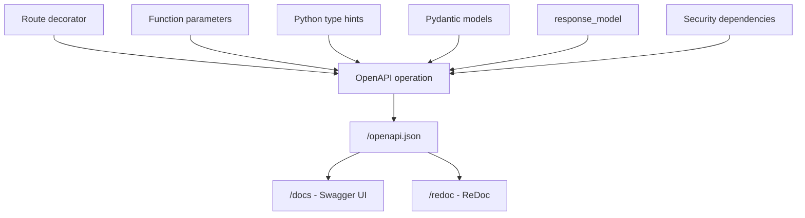
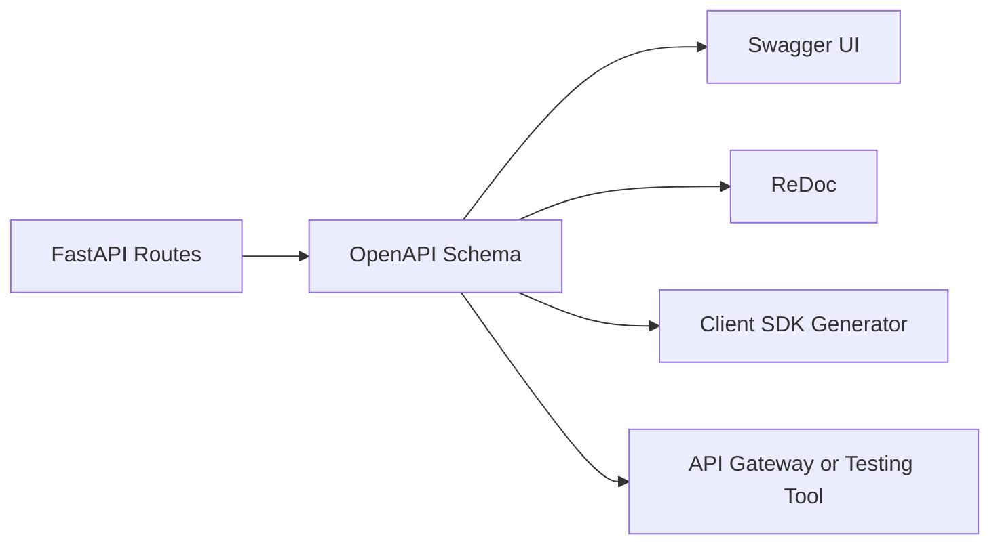
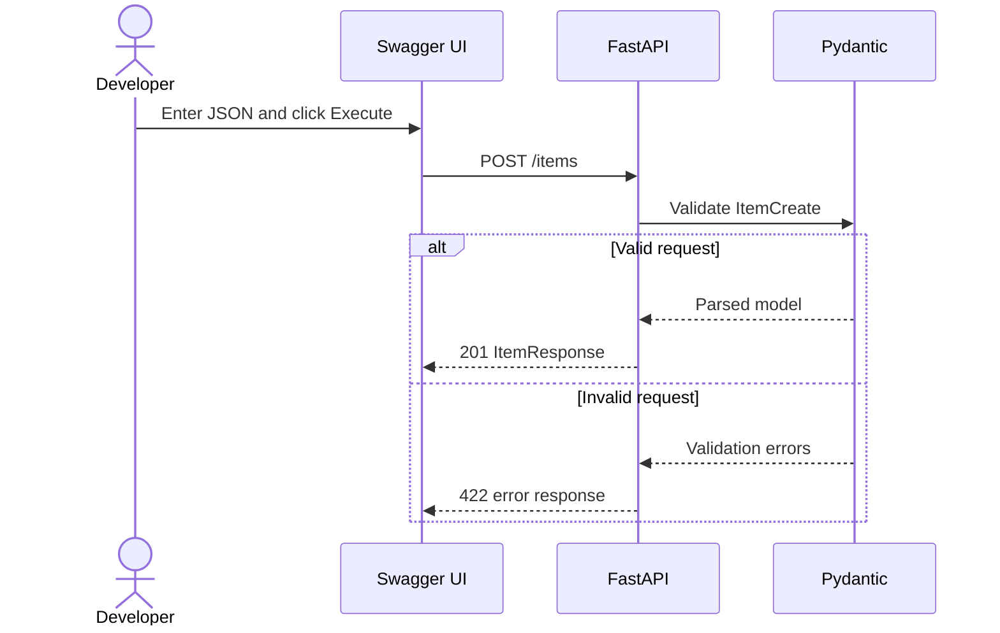
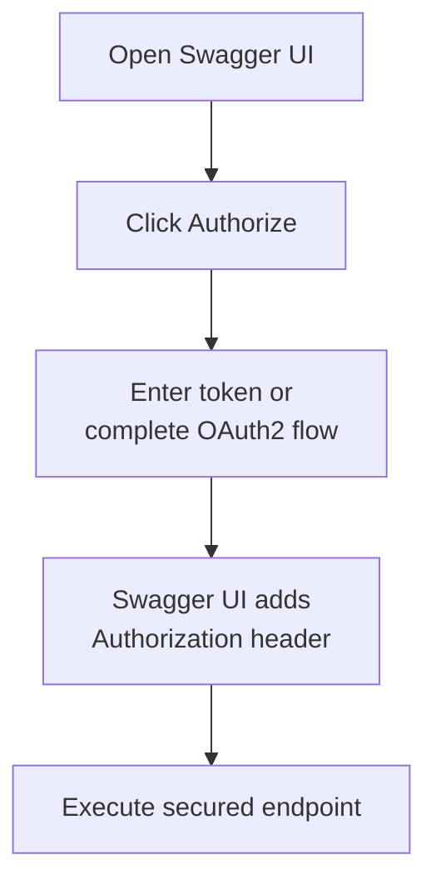
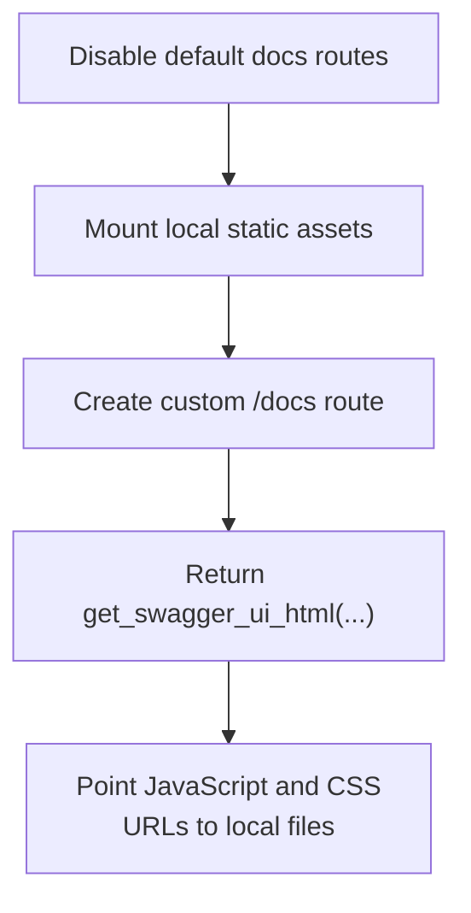
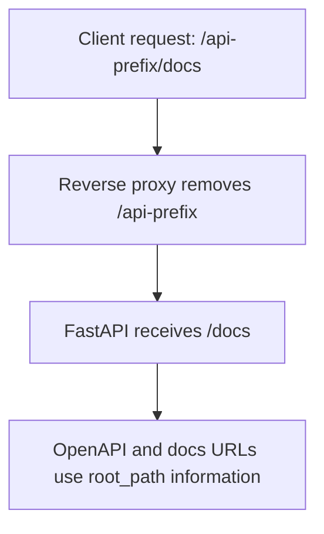
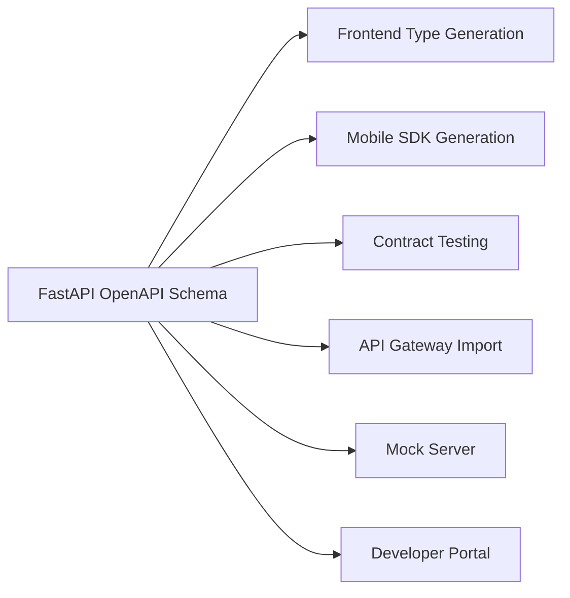
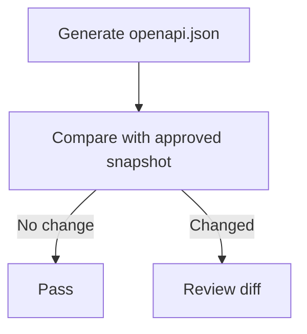
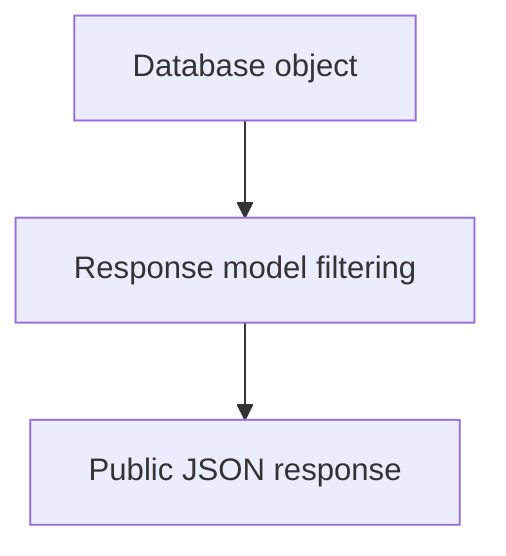

# FastAPI: Auto OpenAPI / Swagger Docs

> FastAPI reads your route declarations, Python type hints, Pydantic models, validation rules, responses, and security dependencies, then converts them into an **OpenAPI schema**. Swagger UI and ReDoc use that schema to display API documentation automatically.

## In short

- The schema is built from declarations you already write — route decorator, function signature, type hints, Pydantic models, `response_model`, security dependencies — so documentation cannot drift from runtime behaviour.
- Three URLs exist by default: `/docs` (Swagger UI, interactive), `/redoc` (ReDoc, readable reference) and `/openapi.json` (the raw schema). Both UIs only render that schema; neither inspects Python.
- Enrich it with field metadata (`Field`, `Path`, `Query`: `description`, `examples`, constraints) and route metadata (`summary`, `description`, `response_description`, `tags`, `operation_id`, `deprecated=True`).
- Declare error contracts with `responses={404: {"model": ErrorResponse, "description": "..."}}`, and keep the runtime body identical to what you documented.
- `include_in_schema=False` hides a route from the schema only — the route still exists and still serves requests.
- Security dependencies such as `OAuth2PasswordBearer`, `APIKeyHeader` and `HTTPBearer` produce the **Authorize** button, but your application must still validate the credential.
- `docs_url`, `redoc_url` and `openapi_url` move or disable the interfaces (`openapi_url=None` disables all of it), and `root_path` fixes docs served behind a proxy prefix.



**Interview answer:** FastAPI inspects every route as the application starts — path and method from the decorator, parameter sources and types from the function signature, request and response JSON Schemas from the Pydantic models, plus any declared metadata and security schemes — and assembles all of it into one OpenAPI document served at `/openapi.json`. Swagger UI and ReDoc are simply two viewers over that document, which is why the published docs always match the validation the code actually performs. The same schema also drives client SDK generation, contract tests in CI, and API gateway imports.

**Gotcha:** the `responses` mapping only documents an error shape; it does not produce one. A plain `HTTPException` still returns `{"detail": "..."}`, so an endpoint documented as returning `ErrorResponse` with `code` and `message` will lie to its consumers until you add an exception handler that emits that exact body.

---

# 1. What Automatic API Documentation Means

In many frameworks, developers manually write and maintain API documentation. That documentation can become outdated when endpoints change.

FastAPI follows a different approach: you define the API contract in Python, and FastAPI generates both the machine-readable and the human-readable documentation from that same source.

## Main benefit

Your validation, runtime behavior, and documentation use the same declarations. This greatly reduces documentation drift.

```python
@app.get("/users/{user_id}")
async def get_user(user_id: int):
    return {"user_id": user_id}
```

From `user_id: int`, FastAPI understands that:

- `user_id` is a path parameter.
- It is required.
- It must be an integer.
- Invalid values should produce a validation error.
- The documentation should display it as an integer input.

---

# 2. OpenAPI, Swagger UI, and ReDoc

These terms are related, but they are not the same thing.

## 2.1 OpenAPI

**OpenAPI** is a standard format for describing HTTP APIs.

It describes information such as:

- Available paths
- HTTP methods
- Request parameters
- Request bodies
- Response schemas
- Status codes
- Authentication schemes
- API metadata

FastAPI normally exposes the generated schema as JSON at `GET /openapi.json`. A simplified part of it looks like this:

```json
{
  "openapi": "3.1.0",
  "info": {
    "title": "Inventory API",
    "version": "1.0.0"
  },
  "paths": {
    "/items/{item_id}": {
      "get": {
        "summary": "Get an item"
      }
    }
  }
}
```

## 2.2 Swagger UI

**Swagger UI** is a browser-based interface that reads the OpenAPI schema.

It is useful for:

- Exploring endpoints
- Viewing request and response schemas
- Entering parameters
- Sending real requests using **Try it out**
- Testing authentication
- Viewing status codes and response headers

FastAPI serves it at `/docs` by default.

## 2.3 ReDoc

**ReDoc** is another interface that reads the same OpenAPI schema.

It is generally more suitable for:

- Clean API reference documentation
- Reading large schemas
- Navigating grouped endpoints
- Sharing documentation with consumers

FastAPI serves it at `/redoc` by default.

## Relationship



> Swagger UI and ReDoc do not independently inspect your Python code. They render the OpenAPI schema generated by FastAPI.

---

# 3. How FastAPI Generates the Documentation

FastAPI collects metadata from several parts of your application, as shown in the diagram at the top of this note. Each declaration contributes a specific part of the generated operation.

## Common sources of schema information

| FastAPI declaration | Documentation produced |
|---|---|
| `@app.get("/items/{item_id}")` | Path and HTTP method |
| `item_id: int` | Required integer path parameter |
| `limit: int = 20` | Optional query parameter with default value |
| `item: ItemCreate` | JSON request body schema |
| `response_model=ItemResponse` | Success response schema |
| `status_code=201` | Documented success status code |
| `summary="Create item"` | Short operation heading |
| `description="..."` | Detailed operation description |
| `tags=["Items"]` | Documentation grouping |
| `Depends(oauth2_scheme)` | Security scheme and authorization input |

---

# 4. Default Documentation URLs

For a standard FastAPI application:

```python
from fastapi import FastAPI

app = FastAPI()
```

FastAPI creates these endpoints automatically:

| URL | Purpose |
|---|---|
| `/docs` | Interactive Swagger UI |
| `/redoc` | Alternative ReDoc documentation |
| `/openapi.json` | Raw OpenAPI schema |
| `/docs/oauth2-redirect` | Swagger UI OAuth2 redirect helper |

Locally those become `http://127.0.0.1:8000/docs`, `/redoc` and `/openapi.json`. Run the application with `fastapi dev main.py` or `uvicorn main:app --reload`.

---

# 5. First Practical Example

```python
from fastapi import FastAPI
from pydantic import BaseModel, Field

app = FastAPI(
    title="Inventory API",
    description="API for managing inventory items.",
    version="1.0.0",
)

class ItemCreate(BaseModel):
    name: str = Field(min_length=2, max_length=100)
    price: float = Field(gt=0)
    quantity: int = Field(ge=0)

class ItemResponse(ItemCreate):
    id: int

@app.post(
    "/items",
    response_model=ItemResponse,
    status_code=201,
    summary="Create an inventory item",
    tags=["Items"],
)
async def create_item(item: ItemCreate) -> ItemResponse:
    """Create and return a new inventory item."""
    return ItemResponse(id=1, **item.model_dump())
```

FastAPI derives the following documentation automatically:

```text
POST /items

Request body:
- name: required string, 2-100 characters
- price: required number, greater than 0
- quantity: required integer, 0 or greater

Success response:
- HTTP 201
- id: integer
- name: string
- price: number
- quantity: integer
```

## Request flow in Swagger UI



---

# 6. How Type Hints Become API Documentation

FastAPI uses the route path and function signature to determine where each value comes from.

```python
from typing import Annotated

from fastapi import Body, FastAPI, Path, Query
from pydantic import BaseModel

app = FastAPI()

class ItemUpdate(BaseModel):
    name: str
    price: float

@app.put("/items/{item_id}")
async def update_item(
    item_id: Annotated[int, Path(gt=0)],
    item: Annotated[ItemUpdate, Body()],
    notify: Annotated[bool, Query()] = False,
):
    return {
        "item_id": item_id,
        "item": item,
        "notify": notify,
    }
```

FastAPI interprets the parameters as follows:

| Parameter | Source | Reason |
|---|---|---|
| `item_id` | Path | The name exists inside `/items/{item_id}` |
| `item` | Request body | It is a Pydantic model |
| `notify` | Query string | It is a scalar value not present in the route path |

Swagger UI then shows separate input sections for the path parameter, query parameter, and JSON body.

---

# 7. Documenting Request Models

A Pydantic model becomes a reusable JSON Schema component inside OpenAPI.

## 7.1 Field descriptions and constraints

```python
from pydantic import BaseModel, Field

class ProductCreate(BaseModel):
    name: str = Field(
        min_length=2,
        max_length=120,
        description="Customer-facing product name",
        examples=["Mechanical Keyboard"],
    )
    sku: str = Field(
        pattern=r"^[A-Z0-9-]+$",
        description="Unique uppercase stock-keeping unit",
        examples=["KB-MECH-001"],
    )
    price: float = Field(
        gt=0,
        description="Selling price; must be greater than zero",
        examples=[129.99],
    )
    in_stock: bool = Field(
        default=True,
        description="Whether the product can currently be ordered",
    )
```

The documentation displays:

- Field names
- Data types
- Required or optional status
- Default values
- Minimum and maximum constraints
- Regular-expression patterns
- Descriptions
- Examples

## 7.2 Model-level example with Pydantic v2

```python
from pydantic import BaseModel, ConfigDict, Field

class CustomerCreate(BaseModel):
    model_config = ConfigDict(
        json_schema_extra={
            "examples": [
                {
                    "name": "Asha Patel",
                    "email": "asha@example.com",
                    "age": 29,
                }
            ]
        }
    )

    name: str = Field(min_length=2)
    email: str
    age: int = Field(ge=18)
```

Use examples that look realistic but contain no real secrets or personal data.

## 7.3 Separate input and output models

Avoid using one database model for every purpose.

| Model | Purpose |
| --- | --- |
| `ProductCreate` | Fields accepted from the client |
| `ProductUpdate` | Fields that may be changed |
| `ProductResponse` | Fields returned to the client |
| `ProductDB` | Internal persistence representation |

Declaring `response_model=UserResponse` on a route whose `UserCreate` body carries a password keeps that password out of both the documented schema and the serialized response.

> `response_model` is not only documentation. It also validates and filters the output according to the declared response contract — see [Response Models](response-models.md).

---

# 8. Documenting Path and Query Parameters

Use `Path`, `Query`, `Header`, and `Cookie` when you need constraints, descriptions, examples, aliases, or deprecation information.

## 8.1 Path parameters

```python
from typing import Annotated

from fastapi import FastAPI, Path

app = FastAPI()

@app.get("/orders/{order_id}")
async def get_order(
    order_id: Annotated[
        int,
        Path(
            gt=0,
            description="Internal numeric order identifier",
            examples=[4501],
        ),
    ],
):
    return {"order_id": order_id}
```

A path parameter is always required because the URL cannot match without it.

## 8.2 Query parameters

```python
from typing import Annotated, Literal

from fastapi import Query

@app.get("/products")
async def list_products(
    search: Annotated[
        str | None,
        Query(
            min_length=2,
            max_length=50,
            description="Text searched in product names",
        ),
    ] = None,
    page: Annotated[int, Query(ge=1, description="Page number")] = 1,
    page_size: Annotated[
        int,
        Query(ge=1, le=100, description="Maximum records per page"),
    ] = 20,
    sort: Annotated[
        Literal["name", "price", "created_at"],
        Query(description="Field used to sort results"),
    ] = "created_at",
):
    return {
        "search": search,
        "page": page,
        "page_size": page_size,
        "sort": sort,
    }
```

Swagger UI displays enum-like choices for `Literal` values, making the allowed values easy to discover.

## 8.3 Parameter aliases

Use an alias when the public HTTP name differs from the Python variable name.

```python
@app.get("/reports")
async def get_reports(
    from_date: Annotated[
        str | None,
        Query(alias="from", description="Start date in YYYY-MM-DD format"),
    ] = None,
):
    return {"from": from_date}
```

The client calls `GET /reports?from=2026-07-01` while the Python code keeps the valid identifier `from_date`.

---

# 9. Documenting Responses

Good documentation describes both successful and expected error responses.

## 9.1 Success response with `response_model`

```python
from fastapi import status

@app.post(
    "/products",
    response_model=ProductResponse,
    status_code=status.HTTP_201_CREATED,
    response_description="The newly created product",
)
async def create_product(payload: ProductCreate):
    ...
```

## 9.2 Multiple response schemas

```python
from fastapi import FastAPI, HTTPException
from pydantic import BaseModel

app = FastAPI()

class ProductResponse(BaseModel):
    id: int
    name: str

class ErrorResponse(BaseModel):
    code: str
    message: str

@app.get(
    "/products/{product_id}",
    response_model=ProductResponse,
    responses={
        404: {
            "model": ErrorResponse,
            "description": "Product was not found",
        },
        409: {
            "model": ErrorResponse,
            "description": "Product is not available in the current state",
        },
    },
)
async def get_product(product_id: int):
    if product_id != 1:
        raise HTTPException(status_code=404, detail="Product not found")

    return ProductResponse(id=1, name="Mechanical Keyboard")
```

## Important distinction

The `responses` dictionary documents additional responses, but it does not automatically make your runtime exception body match the declared model.

The standard `HTTPException` response is `{"detail": "Product not found"}`. If your documented error contract is `{"code": "PRODUCT_NOT_FOUND", "message": "Product not found"}`, then an exception handler must return that exact structure.

## 9.3 Reusable error responses

```python
ERROR_RESPONSES = {
    401: {
        "model": ErrorResponse,
        "description": "Authentication is required",
    },
    403: {
        "model": ErrorResponse,
        "description": "The authenticated user is not allowed to perform this action",
    },
}

@app.delete(
    "/products/{product_id}",
    status_code=204,
    responses={
        **ERROR_RESPONSES,
        404: {
            "model": ErrorResponse,
            "description": "Product was not found",
        },
    },
)
async def delete_product(product_id: int):
    ...
```

This keeps common response documentation consistent across endpoints.

---

# 10. Improving Endpoint Descriptions

The route decorator accepts metadata that directly improves generated documentation.

```python
@app.patch(
    "/products/{product_id}",
    summary="Update selected product fields",
    description=(
        "Updates only the fields provided by the client. "
        "Fields omitted from the request remain unchanged."
    ),
    response_description="The updated product",
    operation_id="updateProduct",
    tags=["Products"],
)
async def update_product(product_id: int, payload: ProductUpdate):
    ...
```

## Common metadata

| Option | Purpose |
|---|---|
| `summary` | Short operation title |
| `description` | Detailed behavior and rules |
| `response_description` | Description of the main successful response |
| `tags` | Grouping in Swagger UI and ReDoc |
| `operation_id` | Stable identifier used by OpenAPI tools and SDK generators |
| `deprecated=True` | Marks an operation as deprecated |
| `include_in_schema=False` | Excludes an operation from OpenAPI |

## Docstrings as descriptions

FastAPI can use the path operation function docstring as the description.

```python
@app.post("/payments", summary="Create a payment")
async def create_payment(payload: PaymentCreate):
    """
    Create a payment for an existing invoice.

    - The invoice must be open.
    - The amount must not exceed the outstanding balance.
    - An idempotency key should be supplied by external clients.
    """
    ...
```

Use route metadata for concise, contract-focused details. Keep internal implementation details out of public API documentation.

## Deprecating an endpoint

```python
@app.get(
    "/v1/customers",
    deprecated=True,
    summary="List customers using the legacy contract",
)
async def list_legacy_customers():
    ...
```

Marking an operation deprecated informs API consumers, but it does not block requests.

---

# 11. Organizing Endpoints with Tags

Tags keep large APIs readable.

```python
from fastapi import FastAPI

tags_metadata = [
    {
        "name": "Products",
        "description": "Create, search, update, and retire products.",
    },
    {
        "name": "Orders",
        "description": "Order placement and order lifecycle operations.",
    },
    {
        "name": "Administration",
        "description": "Restricted operational endpoints.",
    },
]

app = FastAPI(
    title="Commerce API",
    version="2.0.0",
    openapi_tags=tags_metadata,
)
```

Apply tags directly:

```python
@app.get("/products", tags=["Products"])
async def list_products():
    ...
```

For larger applications, place the tag on an `APIRouter`:

```python
from fastapi import APIRouter

router = APIRouter(
    prefix="/products",
    tags=["Products"],
)

@router.get("")
async def list_products():
    ...
```

## Recommended tag structure

Prefer domain-oriented tags such as `Products`, `Orders`, `Customers`, `Payments`, `Reports` and `Administration`. Avoid technical group names such as `GET APIs`, `POST APIs`, `Database APIs` or `Utility APIs` — consumers search by business capability, not by implementation layer.

---

# 12. Authentication in Swagger UI

When security is declared with FastAPI security dependencies, the OpenAPI schema includes the corresponding security scheme. Swagger UI then displays an **Authorize** button.

## 12.1 OAuth2 password bearer example

```python
from typing import Annotated

from fastapi import Depends, FastAPI
from fastapi.security import OAuth2PasswordBearer

app = FastAPI()

oauth2_scheme = OAuth2PasswordBearer(tokenUrl="/auth/token")

@app.get("/profile", tags=["Users"])
async def read_profile(
    token: Annotated[str, Depends(oauth2_scheme)],
):
    return {"token_received": bool(token)}
```

Swagger UI understands that `/profile` requires a bearer token.



## 12.2 API key header example

```python
from typing import Annotated

from fastapi import Depends, Security
from fastapi.security import APIKeyHeader

api_key_header = APIKeyHeader(name="X-API-Key")

@app.get("/internal/status")
async def internal_status(
    api_key: Annotated[str, Security(api_key_header)],
):
    return {"status": "ok"}
```

Swagger UI displays a field for the `X-API-Key` value and sends it in requests after authorization.

> The documentation interface only sends the credentials. Your application must still validate tokens, API keys, roles, permissions, and scopes.

---

# 13. Customizing Documentation URLs

Customize the docs when your organization uses versioned prefixes or reserves `/docs` for another service.

```python
from fastapi import FastAPI

app = FastAPI(
    docs_url="/api/docs",
    redoc_url="/api/reference",
    openapi_url="/api/openapi.json",
)
```

The interfaces now live at `/api/docs`, `/api/reference` and `/api/openapi.json`.

## Disabling interfaces selectively

```python
# ReDoc only is disabled
app = FastAPI(docs_url="/docs", redoc_url=None)

# Both interfaces gone, schema still served for SDK generation and tooling
app = FastAPI(docs_url=None, redoc_url=None, openapi_url="/openapi.json")
```

## Disable OpenAPI and both documentation interfaces

```python
app = FastAPI(openapi_url=None)
```

When no OpenAPI schema is exposed, the default Swagger UI and ReDoc interfaces cannot function and are also disabled.

---

# 14. Configuring Swagger UI

FastAPI accepts Swagger UI configuration through `swagger_ui_parameters`.

```python
from fastapi import FastAPI

app = FastAPI(
    title="Commerce API",
    swagger_ui_parameters={
        "defaultModelsExpandDepth": -1,
        "displayRequestDuration": True,
        "filter": True,
        "operationsSorter": "method",
        "tagsSorter": "alpha",
    },
)
```

## Useful parameters

| Parameter | Effect |
|---|---|
| `filter` | Adds endpoint filtering/search |
| `displayRequestDuration` | Shows request duration |
| `operationsSorter` | Sorts operations, for example by method |
| `tagsSorter` | Sorts tag groups |
| `defaultModelsExpandDepth` | Controls the schemas/models section |
| `docExpansion` | Controls whether operation groups start expanded |

These values are passed to Swagger UI, so supported options depend on the bundled Swagger UI version.

## Persisting authorization locally

```python
app = FastAPI(
    swagger_ui_parameters={
        "persistAuthorization": True,
    }
)
```

This can improve local development convenience, but consider the risk of credentials remaining in browser storage on shared machines.

## Self-hosting documentation assets

Swagger UI and ReDoc normally load JavaScript and CSS assets from external CDNs. In offline or restricted environments, you can self-host those assets.

High-level approach:



Simplified example:

```python
from fastapi import FastAPI
from fastapi.openapi.docs import get_swagger_ui_html
from fastapi.staticfiles import StaticFiles

app = FastAPI(docs_url=None, redoc_url=None)
app.mount("/static", StaticFiles(directory="static"), name="static")

@app.get("/docs", include_in_schema=False)
async def custom_swagger_ui():
    return get_swagger_ui_html(
        openapi_url=app.openapi_url,
        title=f"{app.title} - Swagger UI",
        swagger_js_url="/static/swagger-ui-bundle.js",
        swagger_css_url="/static/swagger-ui.css",
    )
```

Keep self-hosted assets pinned and updated as part of your dependency-management process.

---

# 15. Hiding Endpoints from the Schema

Some routes are needed by the application but should not appear in the public API contract.

```python
@app.get("/health", include_in_schema=False)
async def health_check():
    return {"status": "healthy"}
```

Common examples:

- Internal health checks
- Metrics endpoints
- OAuth2 redirect helpers
- Temporary migration endpoints
- Internal operational routes

## Important security point

`include_in_schema=False` only removes the route from OpenAPI documentation. The route still exists and can still receive requests.

Use authentication, authorization, network restrictions, or gateway policies to secure internal endpoints.

---

# 16. Disabling or Conditionally Enabling Docs

Documentation visibility can be controlled through application settings.

```python
from fastapi import FastAPI
from pydantic_settings import BaseSettings, SettingsConfigDict

class Settings(BaseSettings):
    model_config = SettingsConfigDict(env_file=".env")

    app_env: str = "development"
    openapi_url: str = "/openapi.json"

settings = Settings()

app = FastAPI(
    openapi_url=settings.openapi_url,
    docs_url="/docs" if settings.openapi_url else None,
    redoc_url="/redoc" if settings.openapi_url else None,
)
```

Example environment values:

```env
OPENAPI_URL=/openapi.json   # development
OPENAPI_URL=                # schema exposure intentionally disabled
```

## Do not treat hidden documentation as API security

Disabled docs are not disabled endpoints, hidden docs are not enabled authorization, and an absent schema is not a removed vulnerability.

Protect the API using real controls:

- Authentication
- Role and permission checks
- OAuth2 scopes where appropriate
- Input and output validation
- Rate limiting at the gateway or infrastructure layer
- Secure password hashing
- TLS
- Secret management
- Dependency and security updates

Disabling docs may be an operational or compliance choice, but it is not a replacement for security.

---

# 17. Custom OpenAPI Schema

Most projects should use FastAPI's default schema generation. Customize it only when there is a clear requirement.

Typical reasons include:

- Adding a logo or custom extension
- Adding organization-specific metadata
- Normalizing generated operation IDs
- Integrating vendor extensions required by an API gateway
- Modifying servers or security metadata

## Custom schema function

```python
from fastapi import FastAPI
from fastapi.openapi.utils import get_openapi

app = FastAPI(title="Billing API", version="1.0.0")

def custom_openapi():
    if app.openapi_schema:
        return app.openapi_schema

    schema = get_openapi(
        title=app.title,
        version=app.version,
        description="Billing and invoice management API.",
        routes=app.routes,
    )

    schema["info"]["x-logo"] = {
        "url": "https://example.com/logo.png"
    }

    app.openapi_schema = schema
    return app.openapi_schema

app.openapi = custom_openapi
```

## Why cache the schema?

Schema generation inspects application routes. Once routes are fully registered the result can be reused, which is what the `if app.openapi_schema: return app.openapi_schema` guard above does — it avoids rebuilding the same document on every schema request.

## Stable operation IDs

SDK generators often use `operationId` values as generated method names.

Explicit IDs can make client libraries more predictable:

```python
@app.get(
    "/customers/{customer_id}",
    operation_id="getCustomerById",
)
async def get_customer(customer_id: int):
    ...
```

Operation IDs must remain unique across the entire OpenAPI document.

---

# 18. Docs Behind a Reverse Proxy

Documentation can fail when the application is hosted behind a proxy under a path prefix.

A public URL of `https://api.example.com/service-a/docs` reaches the application at the internal path `/docs`, so the external prefix is `/service-a`. Configure `root_path` when the proxy removes that prefix before forwarding the request — either on the app with `app = FastAPI(root_path="/service-a")`, or on the server with `fastapi run main.py --root-path /service-a`.

## Conceptual request flow



Also ensure the proxy forwards trusted scheme and host information correctly. Otherwise, generated URLs may use an incorrect host or `http` instead of `https`.

---

# 19. Using OpenAPI Beyond Documentation

The generated schema is useful even when no human opens Swagger UI.



## Common practical uses

### Generate typed clients

Frontend teams can generate TypeScript clients from `/openapi.json`.

Benefits:

- Typed request parameters
- Typed response models
- Less handwritten API boilerplate
- Earlier detection of contract changes

### Contract validation in CI

Store or generate the schema during CI and compare it with the previous released schema.

This can detect:

- Removed paths
- Removed fields
- Changed data types
- Newly required fields
- Changed status codes

### API gateway integration

Many gateways can import OpenAPI documents to configure routing, validation, or developer portals. Support varies by product, so gateway-specific extensions may still be required.

---

# 20. Testing the Generated Schema

The OpenAPI schema is part of your API contract and should be testable.

## 20.1 Basic schema test

```python
from fastapi.testclient import TestClient

from app.main import app

client = TestClient(app)

def test_openapi_schema_is_available():
    response = client.get("/openapi.json")

    assert response.status_code == 200

    schema = response.json()
    assert schema["info"]["title"] == "Commerce API"
    assert "/products" in schema["paths"]
```

## 20.2 Verify response schema exists

```python
def test_create_product_contract_is_documented():
    schema = client.get("/openapi.json").json()

    create_operation = schema["paths"]["/products"]["post"]

    assert create_operation["operationId"]
    assert "201" in create_operation["responses"]
```

## 20.3 Snapshot testing

A schema snapshot can reveal accidental contract changes.



Do not blindly reject every change. Some schema changes are intentional and should update the approved contract.

## 20.4 Validate important contract rules

Useful checks include:

- Every public operation has a tag.
- Every operation has a meaningful summary.
- Operation IDs are unique.
- Error responses are documented consistently.
- Sensitive fields do not appear in response schemas.
- Deprecated endpoints are clearly marked.

---

# 21. Production Best Practices

## 21.1 Treat OpenAPI as a contract

Do not consider Swagger UI only a testing page. The schema may be consumed by frontend generators, mobile clients, partner teams, gateways, and automated tests.

## 21.2 Use dedicated response models



This prevents internal or sensitive fields from leaking into public responses.

## 21.3 Document business constraints

Validation rules describe structural constraints, but not always business meaning. A bare `amount: number` is a weak description; this is better:

> Payment amount in the invoice currency. It must not exceed the invoice's outstanding balance.

## 21.4 Keep examples realistic and safe

Use valid-looking examples without including:

- Production access tokens
- Real customer records
- Internal hostnames
- Real secrets
- Personal information

## 21.5 Keep operation IDs stable

Changing an `operationId` may rename methods in generated clients and create unnecessary downstream changes.

## 21.6 Document expected errors

Consumers need to understand unsuccessful responses as much as successful ones.

Document common statuses such as:

- `400` — invalid business request
- `401` — missing or invalid authentication
- `403` — insufficient permission
- `404` — resource not found
- `409` — state conflict
- `422` — request validation failure
- `429` — rate limit exceeded

Only document responses that your API can actually return, and keep the runtime body consistent with the documented schema.

## 21.7 Avoid manual schema modification unless necessary

Prefer the normal declarations first: type hints, Pydantic models, `Field` metadata, route metadata, security dependencies and documented responses.

Use a custom `app.openapi()` function only for requirements the standard declarations cannot express cleanly.

## 21.8 Pin and review dependencies

FastAPI's documentation interfaces use frontend assets and framework dependencies that evolve over time. Pin versions for production, review release notes, run tests, and update deliberately.

---

# 22. Putting the Declarations Together

Most of this note's declarations belong on the same operation. This example adds the one security scheme not shown above — `HTTPBearer`, for a plain `Authorization: Bearer <token>` header — and pairs it with documented failure responses and a route deliberately kept out of the schema.

```python
from typing import Annotated

from fastapi import FastAPI, Security, status
from fastapi.security import HTTPAuthorizationCredentials, HTTPBearer

app = FastAPI(title="Product Catalog API", version="1.0.0")

bearer_scheme = HTTPBearer()

@app.post(
    "/products",
    response_model=ProductResponse,
    status_code=status.HTTP_201_CREATED,
    summary="Create a product",
    response_description="The newly created product",
    tags=["Products"],
    operation_id="createProduct",
    responses={
        401: {"model": ErrorResponse, "description": "Bearer authentication failed"},
        409: {"model": ErrorResponse, "description": "A product with the same SKU exists"},
    },
)
async def create_product(
    payload: ProductCreate,
    credentials: Annotated[HTTPAuthorizationCredentials, Security(bearer_scheme)],
):
    ...

@app.get("/health", include_in_schema=False)
async def health_check():
    return {"status": "healthy"}
```

Swagger UI groups this operation under **Products**, offers an **Authorize** button for the bearer token, documents the `201`, `401` and `409` bodies, and shows no `/health` entry at all.

---

# Official References

Content checked against FastAPI **0.140.0**, released on **2026-07-24**.

- FastAPI — First Steps and automatic docs: https://fastapi.tiangolo.com/tutorial/first-steps/
- FastAPI — Features and OpenAPI standards: https://fastapi.tiangolo.com/features/
- FastAPI — Metadata and docs URLs: https://fastapi.tiangolo.com/tutorial/metadata/
- FastAPI — Configure Swagger UI: https://fastapi.tiangolo.com/how-to/configure-swagger-ui/
- FastAPI — Custom docs UI assets: https://fastapi.tiangolo.com/how-to/custom-docs-ui-assets/
- FastAPI — Conditional OpenAPI: https://fastapi.tiangolo.com/how-to/conditional-openapi/
- FastAPI — Extending OpenAPI: https://fastapi.tiangolo.com/how-to/extending-openapi/
- FastAPI — Behind a proxy: https://fastapi.tiangolo.com/advanced/behind-a-proxy/
- FastAPI — Request example data: https://fastapi.tiangolo.com/tutorial/schema-extra-example/
- FastAPI — Release notes: https://fastapi.tiangolo.com/release-notes/
