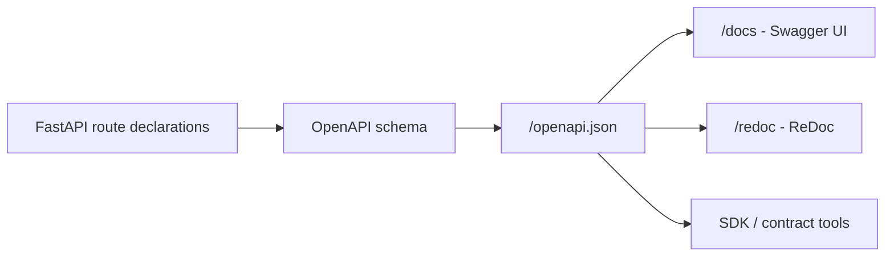
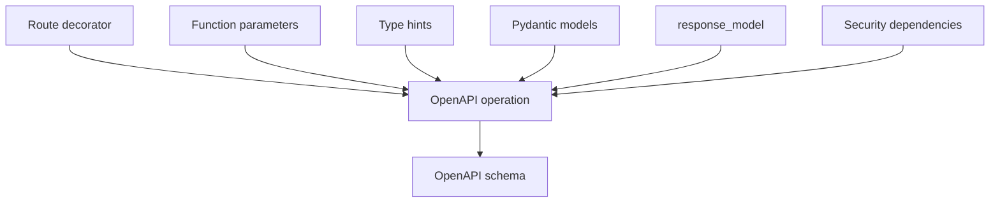
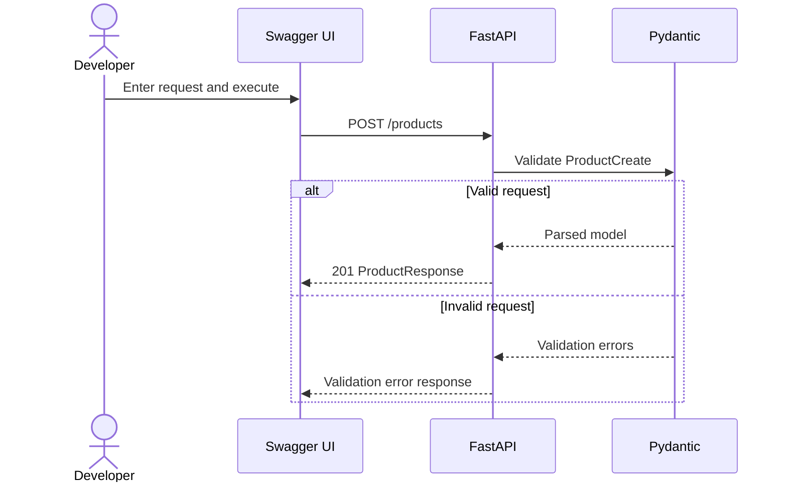
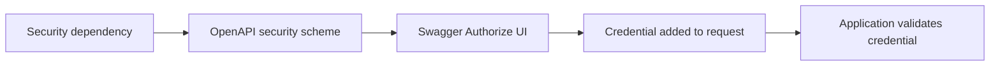
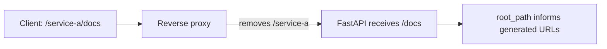
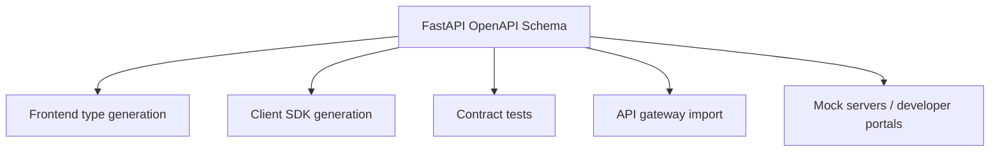
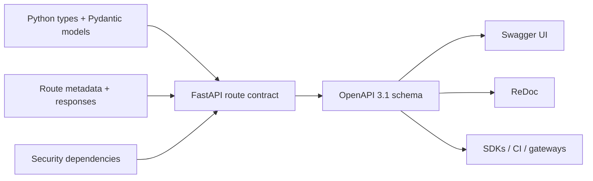

# FastAPI: Auto OpenAPI / Swagger Docs

> FastAPI builds an **OpenAPI schema** from your registered routes, Python type hints, Pydantic models, validation rules, response declarations, metadata, and security dependencies. **Swagger UI** and **ReDoc** render that schema as human-readable API documentation.

## In short

- FastAPI uses the API declarations already present in your code, so documentation and validation usually stay closely aligned.
- `/openapi.json` exposes the machine-readable OpenAPI schema.
- `/docs` provides interactive **Swagger UI**.
- `/redoc` provides **ReDoc**, which is useful as a readable API reference.
- Pydantic `Field`, FastAPI `Path` / `Query`, `response_model`, `responses`, tags, summaries, and security dependencies enrich the generated contract.
- `response_model` is not documentation only; it also validates, serializes, and filters successful output.
- `responses={...}` documents additional responses, but your runtime code must still return the documented status code and body.
- `include_in_schema=False` hides a route from OpenAPI only; it does **not** secure or disable the endpoint.
- `docs_url`, `redoc_url`, and `openapi_url` can move or disable the built-in documentation endpoints.
- When a reverse proxy removes a URL prefix, configure `root_path` so the generated docs use correct URLs.



---

# Index

1. Automatic documentation model
2. OpenAPI vs Swagger UI vs ReDoc
3. What FastAPI reads from your code
4. Default documentation URLs
5. Practical example
6. Request and response documentation
7. Additional error responses
8. Authentication in Swagger UI
9. Organizing and describing endpoints
10. Hiding, moving, or disabling docs
11. Reverse proxy and `root_path`
12. Custom OpenAPI and production use

---

# 1. Automatic Documentation Model

In many frameworks, API code and API documentation are maintained separately. That makes documentation drift easy.

FastAPI follows a **declaration-driven** approach. You describe the API using normal Python code, and FastAPI uses the same declarations for validation and OpenAPI generation.

```python
@app.get("/users/{user_id}")
async def get_user(user_id: int):
    return {"user_id": user_id}
```

From this route, FastAPI knows that:

- `GET` is the HTTP method.
- `/users/{user_id}` is the path.
- `user_id` is a required path parameter.
- `user_id` must be an integer.
- Invalid input should fail validation.
- The OpenAPI schema should describe `user_id` as an integer path parameter.

## Important detail

FastAPI exposes an `app.openapi()` method. The generated schema is built from the registered routes when needed and stored in `app.openapi_schema`, so the same schema can be reused instead of rebuilt for every documentation request.

The default OpenAPI specification version generated by current FastAPI is **OpenAPI 3.1.0**.

---

# 2. OpenAPI vs Swagger UI vs ReDoc

These three terms are related, but they are not interchangeable.

| Component | Purpose |
|---|---|
| **OpenAPI** | Standard machine-readable description of the API |
| **Swagger UI** | Interactive browser UI built from the OpenAPI schema |
| **ReDoc** | Readable API reference built from the same schema |

## OpenAPI

OpenAPI describes things such as:

- paths and HTTP methods
- path/query/header/cookie parameters
- request-body schemas
- response schemas and status codes
- authentication schemes
- tags and endpoint metadata

FastAPI serves the schema at `/openapi.json` by default.

## Swagger UI

Swagger UI is normally available at `/docs` and is useful during development because you can:

- inspect endpoints
- enter parameters
- send request bodies
- authorize with supported security schemes
- execute real requests using **Try it out**

## ReDoc

ReDoc is normally available at `/redoc`. It renders the same OpenAPI document but focuses more on structured reading and API reference navigation.

> Swagger UI and ReDoc do not independently inspect your Python code. They consume the OpenAPI schema generated by FastAPI.

---

# 3. What FastAPI Reads from Your Code

FastAPI combines information from multiple declarations.

| Declaration | OpenAPI information produced |
|---|---|
| `@app.get("/items/{item_id}")` | Path and HTTP method |
| `item_id: int` | Integer path parameter |
| `page: int = 1` | Query parameter with default value |
| `payload: ItemCreate` | Request-body schema |
| `response_model=ItemResponse` | Successful response schema |
| `status_code=201` | Successful status code |
| `Field(gt=0)` | JSON Schema validation constraint |
| `summary="Create item"` | Operation summary |
| `tags=["Items"]` | Documentation grouping |
| FastAPI security dependency | OpenAPI security scheme |



The important interview concept is that **FastAPI uses type declarations as API metadata**, not only as editor hints.

---

# 4. Default Documentation URLs

For a basic application:

```python
from fastapi import FastAPI

app = FastAPI()
```

FastAPI provides:

| URL | Purpose |
|---|---|
| `/docs` | Swagger UI |
| `/redoc` | ReDoc |
| `/openapi.json` | Raw OpenAPI schema |

For local development, start the application with a supported FastAPI CLI command such as:

```bash
fastapi dev main.py
```

Then open:

```text
http://127.0.0.1:8000/docs
```

---

# 5. Practical Example

This single example shows the declarations most commonly used in normal FastAPI development.

```python
from typing import Annotated

from fastapi import FastAPI, Security, status
from fastapi.responses import JSONResponse
from fastapi.security import HTTPAuthorizationCredentials, HTTPBearer
from pydantic import BaseModel, Field

app = FastAPI(
    title="Product API",
    description="API for managing products.",
    version="1.0.0",
)

bearer = HTTPBearer()


class ProductCreate(BaseModel):
    name: str = Field(
        min_length=2,
        max_length=100,
        description="Customer-facing product name",
        examples=["Mechanical Keyboard"],
    )
    sku: str = Field(
        pattern=r"^[A-Z0-9-]+$",
        description="Unique uppercase SKU",
        examples=["KB-001"],
    )
    price: float = Field(
        gt=0,
        description="Selling price; must be greater than zero",
        examples=[129.99],
    )


class ProductResponse(ProductCreate):
    id: int


class ErrorResponse(BaseModel):
    code: str
    message: str


@app.post(
    "/products",
    response_model=ProductResponse,
    status_code=status.HTTP_201_CREATED,
    summary="Create a product",
    response_description="The newly created product",
    tags=["Products"],
    operation_id="createProduct",
    responses={
        409: {
            "model": ErrorResponse,
            "description": "A product with the same SKU already exists",
        }
    },
)
async def create_product(
    payload: ProductCreate,
    credentials: Annotated[
        HTTPAuthorizationCredentials,
        Security(bearer),
    ],
):
    # A real application would validate credentials and check the database.
    if payload.sku == "EXISTING-SKU":
        return JSONResponse(
            status_code=409,
            content=ErrorResponse(
                code="SKU_EXISTS",
                message="A product with this SKU already exists",
            ).model_dump(),
        )

    return ProductResponse(id=1, **payload.model_dump())
```

From this code, Swagger UI can show:

- a `POST /products` operation under the **Products** tag
- an **Authorize** control for bearer authentication
- the request-body fields and their constraints
- request examples
- a documented `201` success response
- a documented `409` error response
- the response schema returned to clients



---

# 6. Request and Response Documentation

## 6.1 Request models

Pydantic models become reusable JSON Schema components in OpenAPI.

Use `Field` when you want both validation and richer documentation:

```python
price: float = Field(
    gt=0,
    description="Selling price in the configured currency",
    examples=[99.50],
)
```

Common metadata includes:

- `description`
- `examples`
- `min_length` / `max_length`
- `gt` / `ge` / `lt` / `le`
- `pattern`

For route parameters, the equivalent FastAPI helpers are commonly `Path`, `Query`, `Header`, and `Cookie`.

## 6.2 Parameter source detection

FastAPI determines parameter location from the route and type declaration.

```python
@app.get("/products/{product_id}")
async def get_product(product_id: int, include_stock: bool = False):
    ...
```

Here:

- `product_id` is a **path parameter** because it appears in the path.
- `include_stock` becomes a **query parameter** because it is a scalar value that is not part of the path.

A Pydantic model parameter normally represents the JSON request body.

## 6.3 Response models

```python
@app.get("/products/{product_id}", response_model=ProductResponse)
async def get_product(product_id: int):
    ...
```

`response_model` has two important roles:

1. It documents the expected response schema.
2. It validates, serializes, and filters returned data according to that schema.

This is why separate models such as `UserCreate` and `UserResponse` are valuable: sensitive input-only fields such as passwords should not accidentally appear in API responses.

---

# 7. Additional Error Responses

Successful responses are not enough for a useful API contract. Consumers also need expected errors.

```python
responses={
    404: {
        "model": ErrorResponse,
        "description": "Product was not found",
    },
    409: {
        "model": ErrorResponse,
        "description": "Product state conflict",
    },
}
```

## Critical distinction

The `responses` mapping **documents** additional responses. It does not automatically make every runtime exception use that body.

For example:

```python
raise HTTPException(status_code=404, detail="Product not found")
```

normally produces a body shaped like:

```json
{
  "detail": "Product not found"
}
```

If your OpenAPI contract says the body is:

```json
{
  "code": "PRODUCT_NOT_FOUND",
  "message": "Product not found"
}
```

then your runtime code or exception handler must actually return that structure.

**Interview takeaway:** documentation and runtime validation are closely connected in FastAPI, but custom error contracts still require implementation discipline.

---

# 8. Authentication in Swagger UI

FastAPI security utilities can add security schemes to OpenAPI.

Common examples include:

- `HTTPBearer`
- `OAuth2PasswordBearer`
- `APIKeyHeader`

When a route depends on one of these security schemes, Swagger UI can display an **Authorize** control and send the credential with test requests.



Important: the documentation UI only helps send the credential. Your application still needs the real authentication and authorization logic.

For example, `OAuth2PasswordBearer` can extract a bearer token from the `Authorization` header, but your code must still validate the token's signature, expiry, user, scopes, or permissions as required.

---

# 9. Organizing and Describing Endpoints

Useful route metadata improves both human-readable docs and generated clients.

```python
@app.patch(
    "/products/{product_id}",
    summary="Update selected product fields",
    description="Only provided fields are changed.",
    response_description="The updated product",
    tags=["Products"],
    operation_id="updateProduct",
    deprecated=False,
)
async def update_product(product_id: int):
    ...
```

| Option | Purpose |
|---|---|
| `summary` | Short operation title |
| `description` | More detailed contract information |
| `response_description` | Description of the primary success response |
| `tags` | Groups related operations |
| `operation_id` | Stable OpenAPI operation identifier |
| `deprecated=True` | Marks an operation deprecated |
| `include_in_schema=False` | Removes the route from OpenAPI |

## Tag by business domain

Prefer tags such as:

- `Products`
- `Orders`
- `Customers`
- `Payments`

Avoid grouping by implementation details such as `GET APIs` or `Database APIs`.

For larger applications, set tags and prefixes on `APIRouter` so related routes stay consistent.

---

# 10. Hiding, Moving, or Disabling Docs

## Hide one endpoint

```python
@app.get("/health", include_in_schema=False)
async def health():
    return {"status": "ok"}
```

The route still exists. It is only excluded from the OpenAPI document.

> Hiding an endpoint is not a security mechanism. Use authentication, authorization, network rules, or gateway policies for real access control.

## Move the docs URLs

```python
app = FastAPI(
    docs_url="/api/docs",
    redoc_url="/api/reference",
    openapi_url="/api/openapi.json",
)
```

## Disable selected interfaces

```python
app = FastAPI(
    docs_url=None,
    redoc_url=None,
    openapi_url="/openapi.json",
)
```

The schema remains available for tooling even though the built-in browser interfaces are disabled.

## Disable OpenAPI exposure

```python
app = FastAPI(openapi_url=None)
```

Without an OpenAPI endpoint, the built-in Swagger UI and ReDoc routes cannot operate normally.

This may be an operational or compliance choice, but disabling documentation does **not** secure the API itself.

---

# 11. Reverse Proxy and `root_path`

Documentation can break when the application is served behind a proxy that strips a path prefix.

Example public URL:

```text
https://api.example.com/service-a/docs
```

The proxy may remove `/service-a` and forward only `/docs` to FastAPI.

Configure:

```python
app = FastAPI(root_path="/service-a")
```



`root_path` is an ASGI mechanism used for this type of deployment. It helps FastAPI generate OpenAPI/docs URLs that include the external prefix correctly.

---

# 12. Custom OpenAPI and Production Use

Most applications should use FastAPI's standard schema generation. Customize it only when a real integration requires it.

Typical reasons include:

- organization-specific metadata
- vendor extensions required by an API gateway
- custom logos or schema extensions
- controlled `operationId` naming
- custom server metadata

A custom schema usually follows this pattern:

```python
from fastapi.openapi.utils import get_openapi


def custom_openapi():
    if app.openapi_schema:
        return app.openapi_schema

    schema = get_openapi(
        title=app.title,
        version=app.version,
        description=app.description,
        routes=app.routes,
    )

    schema["info"]["x-service"] = "catalog"
    app.openapi_schema = schema
    return app.openapi_schema


app.openapi = custom_openapi
```

Caching the result in `app.openapi_schema` avoids regenerating the same document repeatedly.

## OpenAPI beyond documentation

The schema is useful for much more than Swagger UI.



## Production best practices

- Treat OpenAPI as an **API contract**, not just a testing screen.
- Use dedicated request and response models.
- Add meaningful field descriptions for business rules that types alone cannot explain.
- Document error responses that the API can actually return.
- Keep documented error bodies consistent with runtime responses.
- Keep `operation_id` values stable when generated clients depend on them.
- Never place real credentials, secrets, or customer data in examples.
- Use `include_in_schema=False` only for documentation visibility, never for security.
- Prefer standard FastAPI declarations before overriding `app.openapi()`.
- Pin and review dependencies in production so documentation tooling changes are deliberate.

---

# Final Mental Model



The key concept to remember is simple:

> **FastAPI turns your API declarations into an OpenAPI contract. Swagger UI and ReDoc are views over that contract, while tools such as SDK generators and contract tests can consume the same schema programmatically.**
