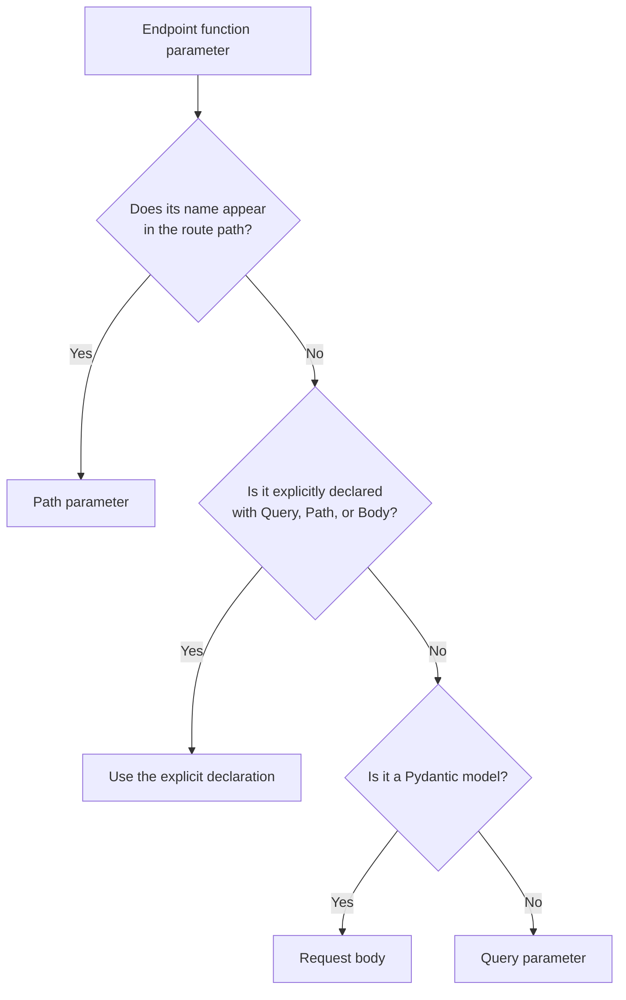
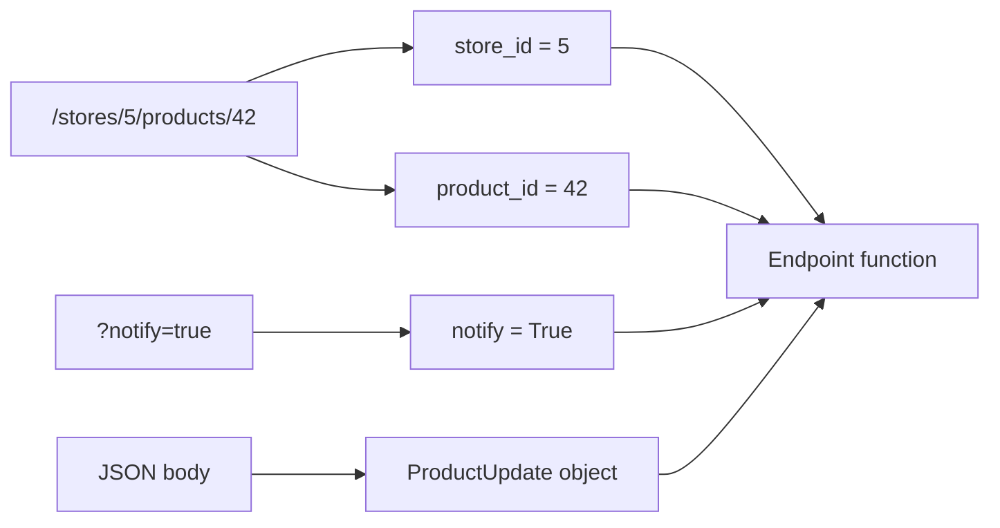
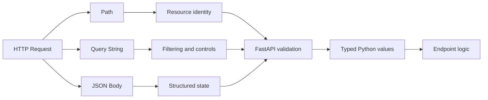

# FastAPI: Path, Query & Body Parameters

> FastAPI uses the endpoint path, Python type hints, and special helpers such as `Path`, `Query`, and `Body` to determine where request data comes from, validate it, convert it into Python objects, and document it automatically.

## Index

1. [The Big Picture](#1-the-big-picture)
2. [How FastAPI Detects Parameter Sources](#2-how-fastapi-detects-parameter-sources)
3. [Path Parameters](#3-path-parameters)
4. [Query Parameters](#4-query-parameters)
5. [Request Body Parameters](#5-request-body-parameters)
6. [Using Path, Query, and Body Together](#6-using-path-query-and-body-together)
7. [Required, Optional, and Nullable Values](#7-required-optional-and-nullable-values)
8. [Validation and Metadata](#8-validation-and-metadata)
9. [Multiple Body Parameters](#9-multiple-body-parameters)
10. [Query Parameter Models](#10-query-parameter-models)
11. [Aliases and API Naming](#11-aliases-and-api-naming)
12. [Validation Error Responses](#12-validation-error-responses)
13. [Practical CRUD Example](#13-practical-crud-example)
14. [Testing the API](#14-testing-the-api)
15. [Design Guidelines](#15-design-guidelines)
16. [Quick Reference](#16-quick-reference)

---

# 1. The Big Picture

A client can send data to a FastAPI endpoint in different parts of an HTTP request.

```text
PUT /products/42?notify=true
Content-Type: application/json

{
  "name": "Mechanical Keyboard",
  "price": 89.99,
  "stock": 20
}
```

FastAPI separates this request into three parameter sources:

```text
┌────────────────────────────────────────────────────────────┐
│ PUT /products/42?notify=true                               │
├────────────────────────────────────────────────────────────┤
│ Path parameter                                             │
│   product_id = 42                                          │
│                                                            │
│ Query parameter                                            │
│   notify = true                                            │
│                                                            │
│ Request body                                               │
│   name  = "Mechanical Keyboard"                            │
│   price = 89.99                                            │
│   stock = 20                                               │
└────────────────────────────────────────────────────────────┘
```

These parameter types have different purposes.

| Parameter type | Location | Typical purpose |
|---|---|---|
| Path | Inside the URL path | Identify a specific resource |
| Query | After `?` in the URL | Filtering, sorting, searching, and pagination |
| Body | HTTP request payload | Create or update structured data |

---

# 2. How FastAPI Detects Parameter Sources

Consider this endpoint:

```python
from fastapi import FastAPI
from pydantic import BaseModel

app = FastAPI()


class ProductUpdate(BaseModel):
    name: str
    price: float


@app.put("/products/{product_id}")
async def update_product(
    product_id: int,
    product: ProductUpdate,
    notify: bool = False,
):
    return {
        "product_id": product_id,
        "product": product,
        "notify": notify,
    }
```

FastAPI identifies the source of each value as follows:

```text
Function parameter                  FastAPI interpretation
──────────────────────────────────────────────────────────
product_id matches {product_id}  →  Path parameter
notify is a simple type          →  Query parameter
product is a Pydantic model      →  Request body
```

The corresponding request is:

```http
PUT /products/42?notify=true
Content-Type: application/json
```

```json
{
  "name": "Mechanical Keyboard",
  "price": 89.99
}
```

## Parameter Detection Flow



## Important Rule

A parameter matching a placeholder in the route is always treated as a path parameter.

```python
@app.get("/products/{product_id}")
async def get_product(product_id: int):
    ...
```

Here, `product_id` comes from `/products/{product_id}`, not from the query string.

---

# 3. Path Parameters

A path parameter is part of the URL itself.

```text
GET /products/42
              └── product_id
```

## Basic Path Parameter

```python
from fastapi import FastAPI

app = FastAPI()


@app.get("/products/{product_id}")
async def get_product(product_id: int):
    return {"product_id": product_id}
```

Request:

```http
GET /products/42
```

Response:

```json
{
  "product_id": 42
}
```

FastAPI converts the string value `"42"` from the URL into the Python integer `42`.

## Automatic Type Validation

This request is invalid:

```http
GET /products/keyboard
```

Because `product_id` must be an integer, FastAPI returns a validation error instead of calling the endpoint with incorrect data.

## Path Parameters Are Always Required

The client cannot call this route without supplying `product_id`:

```python
@app.get("/products/{product_id}")
async def get_product(product_id: int):
    ...
```

This route does not match:

```http
GET /products/
```

Even a nullable annotation does not make a path parameter optional:

```python
@app.get("/products/{product_id}")
async def get_product(product_id: int | None):
    ...
```

The value must still exist in the URL because the route contains `{product_id}`.

## Path Validation with `Path`

Use `Path()` when you need validation rules or documentation metadata.

```python
from typing import Annotated

from fastapi import FastAPI, Path

app = FastAPI()


@app.get("/products/{product_id}")
async def get_product(
    product_id: Annotated[
        int,
        Path(
            title="Product ID",
            description="Unique positive identifier of the product",
            ge=1,
        ),
    ],
):
    return {"product_id": product_id}
```

The rule `ge=1` means:

```text
product_id >= 1
```

Valid:

```http
GET /products/1
GET /products/500
```

Invalid:

```http
GET /products/0
GET /products/-10
```

## Common Numeric Constraints

| Constraint | Meaning |
|---|---|
| `gt=0` | Greater than 0 |
| `ge=0` | Greater than or equal to 0 |
| `lt=100` | Less than 100 |
| `le=100` | Less than or equal to 100 |

Example:

```python
@app.get("/products/{product_id}")
async def get_product(
    product_id: Annotated[int, Path(gt=0, le=1_000_000)],
):
    return {"product_id": product_id}
```

## Enum Path Parameters

Use an enum when a path value must belong to a fixed set.

```python
from enum import Enum

from fastapi import FastAPI

app = FastAPI()


class ProductStatus(str, Enum):
    active = "active"
    inactive = "inactive"
    archived = "archived"


@app.get("/products/status/{status}")
async def get_products_by_status(status: ProductStatus):
    return {"status": status}
```

Valid requests:

```http
GET /products/status/active
GET /products/status/archived
```

Invalid request:

```http
GET /products/status/deleted
```

This approach provides validation, editor support, and dropdown values in the generated API documentation.

## File Paths

A path converter can capture a complete file path:

```python
@app.get("/files/{file_path:path}")
async def read_file(file_path: str):
    return {"file_path": file_path}
```

Request:

```http
GET /files/documents/2026/report.pdf
```

Result:

```json
{
  "file_path": "documents/2026/report.pdf"
}
```

---

# 4. Query Parameters

Query parameters appear after `?` in the URL.

```text
GET /products?skip=0&limit=20&active=true
              └──────────────────────────
                    Query parameters
```

They are normally used for:

- Pagination
- Searching
- Filtering
- Sorting
- Feature flags
- Optional response controls

## Basic Query Parameters

```python
from fastapi import FastAPI

app = FastAPI()


@app.get("/products")
async def list_products(skip: int = 0, limit: int = 20):
    return {
        "skip": skip,
        "limit": limit,
    }
```

Request:

```http
GET /products?skip=20&limit=10
```

FastAPI converts both values to integers.

## Optional Query Parameters

```python
@app.get("/products")
async def list_products(search: str | None = None):
    return {"search": search}
```

Both requests are valid:

```http
GET /products
GET /products?search=keyboard
```

When the client omits `search`, the function receives `None`.

## Required Query Parameters

A query parameter without a default value is required:

```python
@app.get("/products")
async def list_products(category: str):
    return {"category": category}
```

Valid:

```http
GET /products?category=electronics
```

Invalid:

```http
GET /products
```

## Boolean Conversion

```python
@app.get("/products")
async def list_products(in_stock: bool = True):
    return {"in_stock": in_stock}
```

FastAPI recognizes common Boolean representations:

```text
?in_stock=true
?in_stock=True
?in_stock=1
?in_stock=yes
?in_stock=on
```

These are converted into the Python value `True`.

## Query Validation with `Query`

```python
from typing import Annotated

from fastapi import FastAPI, Query

app = FastAPI()


@app.get("/products")
async def list_products(
    search: Annotated[
        str | None,
        Query(
            min_length=2,
            max_length=50,
            description="Search text matched against product names",
        ),
    ] = None,
    limit: Annotated[int, Query(ge=1, le=100)] = 20,
):
    return {
        "search": search,
        "limit": limit,
    }
```

Rules:

```text
search:
  minimum length = 2
  maximum length = 50

limit:
  minimum value = 1
  maximum value = 100
```

## Pattern Validation

```python
@app.get("/products")
async def list_products(
    sort: Annotated[
        str,
        Query(pattern="^(name|price|created_at)$"),
    ] = "created_at",
):
    return {"sort": sort}
```

Valid:

```http
GET /products?sort=price
```

Invalid:

```http
GET /products?sort=random
```

For a fixed set of values, an enum or `Literal` is usually clearer than a regular expression.

```python
from typing import Literal


@app.get("/products")
async def list_products(
    sort: Literal["name", "price", "created_at"] = "created_at",
):
    return {"sort": sort}
```

## Multiple Values for One Query Parameter

A query key can appear multiple times:

```http
GET /products?tag=python&tag=fastapi&tag=backend
```

Declare it explicitly with `Query()`:

```python
@app.get("/products")
async def list_products(
    tag: Annotated[list[str] | None, Query()] = None,
):
    return {"tags": tag}
```

Response:

```json
{
  "tags": [
    "python",
    "fastapi",
    "backend"
  ]
}
```

> A list query parameter should be explicitly declared with `Query()`. Otherwise, FastAPI can interpret a complex value as request-body data.

## Pagination Example

```python
@app.get("/products")
async def list_products(
    offset: Annotated[int, Query(ge=0)] = 0,
    limit: Annotated[int, Query(ge=1, le=100)] = 20,
):
    return {
        "offset": offset,
        "limit": limit,
    }
```

Request:

```http
GET /products?offset=40&limit=20
```

---

# 5. Request Body Parameters

The request body contains structured data sent by the client.

It is commonly used with:

- `POST` to create a resource
- `PUT` to replace or fully update a resource
- `PATCH` to partially update a resource

A body can technically be used with other HTTP methods, but request bodies on `GET` should normally be avoided because support across clients, proxies, and documentation tools can be inconsistent.

## Pydantic Body Model

```python
from fastapi import FastAPI
from pydantic import BaseModel, Field

app = FastAPI()


class ProductCreate(BaseModel):
    name: str = Field(min_length=2, max_length=100)
    description: str | None = Field(default=None, max_length=500)
    price: float = Field(gt=0)
    stock: int = Field(default=0, ge=0)


@app.post("/products")
async def create_product(product: ProductCreate):
    return product
```

Request:

```http
POST /products
Content-Type: application/json
```

```json
{
  "name": "Mechanical Keyboard",
  "description": "Wireless keyboard with tactile switches",
  "price": 89.99,
  "stock": 20
}
```

FastAPI performs the following work:

```text
JSON request
    │
    ▼
Parse JSON
    │
    ▼
Validate fields using Pydantic
    │
    ▼
Convert compatible values to Python types
    │
    ▼
Create ProductCreate instance
    │
    ▼
Call endpoint function
```

## Accessing Body Fields

```python
@app.post("/products")
async def create_product(product: ProductCreate):
    total_value = product.price * product.stock

    return {
        "name": product.name,
        "inventory_value": total_value,
    }
```

## Converting the Model to a Dictionary

With Pydantic v2:

```python
product_data = product.model_dump()
```

Example:

```python
@app.post("/products")
async def create_product(product: ProductCreate):
    product_data = product.model_dump()
    product_data["status"] = "created"
    return product_data
```

## Nested Request Body

```python
class Manufacturer(BaseModel):
    name: str
    country: str


class ProductCreate(BaseModel):
    name: str
    price: float = Field(gt=0)
    manufacturer: Manufacturer
```

Request:

```json
{
  "name": "Mechanical Keyboard",
  "price": 89.99,
  "manufacturer": {
    "name": "KeyWorks",
    "country": "India"
  }
}
```

## Lists in the Body

```python
class ProductCreate(BaseModel):
    name: str
    price: float = Field(gt=0)
    tags: list[str] = []
```

A safer reusable default style is:

```python
class ProductCreate(BaseModel):
    name: str
    price: float = Field(gt=0)
    tags: list[str] = Field(default_factory=list)
```

## Body Metadata with `Body`

Use `Body()` when you need body-level rules or behavior.

```python
from typing import Annotated

from fastapi import Body


@app.post("/products")
async def create_product(
    product: Annotated[
        ProductCreate,
        Body(description="Product information to create"),
    ],
):
    return product
```

## Embedding a Single Body Model

By default, this declaration:

```python
async def create_product(product: ProductCreate):
    ...
```

expects:

```json
{
  "name": "Mechanical Keyboard",
  "price": 89.99,
  "stock": 20
}
```

To require a top-level `product` key, use `embed=True`:

```python
@app.post("/products")
async def create_product(
    product: Annotated[ProductCreate, Body(embed=True)],
):
    return product
```

The expected body becomes:

```json
{
  "product": {
    "name": "Mechanical Keyboard",
    "price": 89.99,
    "stock": 20
  }
}
```

---

# 6. Using Path, Query, and Body Together

A real endpoint often uses all three sources.

```python
from typing import Annotated

from fastapi import Body, FastAPI, Path, Query
from pydantic import BaseModel, Field

app = FastAPI()


class ProductUpdate(BaseModel):
    name: str = Field(min_length=2, max_length=100)
    price: float = Field(gt=0)
    stock: int = Field(ge=0)


@app.put("/stores/{store_id}/products/{product_id}")
async def update_product(
    store_id: Annotated[int, Path(ge=1)],
    product_id: Annotated[int, Path(ge=1)],
    product: Annotated[ProductUpdate, Body()],
    notify: Annotated[bool, Query()] = False,
):
    return {
        "store_id": store_id,
        "product_id": product_id,
        "notify": notify,
        "product": product,
    }
```

Request:

```http
PUT /stores/5/products/42?notify=true
Content-Type: application/json
```

```json
{
  "name": "Mechanical Keyboard Pro",
  "price": 109.99,
  "stock": 25
}
```

## Request Mapping



FastAPI does not depend on the order of these parameters. It uses route names, annotations, and declarations to identify their sources.

---

# 7. Required, Optional, and Nullable Values

These concepts are related but not identical.

## Required

The client must provide the value.

```python
@app.get("/products")
async def list_products(category: str):
    ...
```

`category` is required because it has no default.

## Optional

The client may omit the value.

```python
@app.get("/products")
async def list_products(category: str | None = None):
    ...
```

The default `None` makes the parameter optional.

## Nullable

The supplied value may be `null`.

For request-body fields:

```python
class ProductUpdate(BaseModel):
    description: str | None
```

This means `description` may be a string or `null`, but it is still required unless a default is provided.

```json
{
  "description": null
}
```

To make it both optional and nullable:

```python
class ProductUpdate(BaseModel):
    description: str | None = None
```

The client may now omit `description` completely.

## Comparison

```python
class Example(BaseModel):
    title: str
    description: str | None
    notes: str | None = None
```

| Field | Can be omitted? | Can be `null`? |
|---|---:|---:|
| `title` | No | No |
| `description` | No | Yes |
| `notes` | Yes | Yes |

## Important Query Parameter Detail

```python
q: str | None = None
```

The default `= None` makes `q` optional. The union annotation communicates that the Python value may be `None` and improves type checking.

---

# 8. Validation and Metadata

FastAPI helpers support validation rules and OpenAPI metadata.

## String Validation

```python
search: Annotated[
    str,
    Query(
        min_length=2,
        max_length=50,
    ),
]
```

## Numeric Validation

```python
product_id: Annotated[int, Path(ge=1)]
limit: Annotated[int, Query(ge=1, le=100)] = 20
price: Annotated[float, Body(gt=0)]
```

## Common Validation Arguments

| Argument | Purpose |
|---|---|
| `min_length` | Minimum string/list length |
| `max_length` | Maximum string/list length |
| `pattern` | Regular-expression pattern |
| `gt` | Greater than |
| `ge` | Greater than or equal |
| `lt` | Less than |
| `le` | Less than or equal |
| `multiple_of` | Value must be a multiple of another number |

## Documentation Metadata

```python
product_id: Annotated[
    int,
    Path(
        title="Product ID",
        description="Database identifier of the product",
        examples=[42],
        ge=1,
    ),
]
```

Useful metadata includes:

- `title`
- `description`
- `examples`
- `deprecated`
- `alias`

FastAPI includes this information in the OpenAPI schema and generated Swagger UI.

---

# 9. Multiple Body Parameters

An HTTP request has one body, but FastAPI can construct that body from multiple declared parameters.

```python
from typing import Annotated

from fastapi import Body, FastAPI
from pydantic import BaseModel

app = FastAPI()


class Product(BaseModel):
    name: str
    price: float


class AuditInfo(BaseModel):
    changed_by: str
    reason: str


@app.put("/products/{product_id}")
async def update_product(
    product_id: int,
    product: Product,
    audit: AuditInfo,
    priority: Annotated[int, Body(ge=1, le=5)],
):
    return {
        "product_id": product_id,
        "product": product,
        "audit": audit,
        "priority": priority,
    }
```

FastAPI expects one JSON object whose keys match the parameter names:

```json
{
  "product": {
    "name": "Mechanical Keyboard",
    "price": 89.99
  },
  "audit": {
    "changed_by": "avadh",
    "reason": "Price correction"
  },
  "priority": 2
}
```

## Why `Body()` Is Needed for a Scalar

Without `Body()`:

```python
priority: int
```

FastAPI normally interprets a simple scalar as a query parameter.

With:

```python
priority: Annotated[int, Body()]
```

FastAPI reads it from the JSON body.

---

# 10. Query Parameter Models

When an endpoint has many related filter parameters, group them into a Pydantic model.

```python
from typing import Annotated, Literal

from fastapi import FastAPI, Query
from pydantic import BaseModel, ConfigDict, Field

app = FastAPI()


class ProductFilters(BaseModel):
    model_config = ConfigDict(extra="forbid")

    limit: int = Field(default=20, ge=1, le=100)
    offset: int = Field(default=0, ge=0)
    search: str | None = Field(default=None, min_length=2, max_length=50)
    order_by: Literal["name", "price", "created_at"] = "created_at"
    tags: list[str] = Field(default_factory=list)


@app.get("/products")
async def list_products(
    filters: Annotated[ProductFilters, Query()],
):
    return filters
```

Example request:

```http
GET /products?limit=10&offset=20&order_by=price&tags=keyboard&tags=wireless
```

Benefits:

- Keeps endpoint signatures readable
- Reuses filter definitions across endpoints
- Centralizes validation
- Improves editor support
- Generates structured OpenAPI documentation
- Can reject unknown filters with `extra="forbid"`

With `extra="forbid"`, this request is rejected:

```http
GET /products?limit=10&unknown=value
```

> Query parameter models require a sufficiently recent FastAPI version. Keep FastAPI and Pydantic dependencies current and tested together.

---

# 11. Aliases and API Naming

Python variable names and public API parameter names do not always follow the same convention.

For example, an external API may use:

```text
item-query
```

But this is not a valid Python variable name.

Use an alias:

```python
@app.get("/products")
async def list_products(
    search: Annotated[
        str | None,
        Query(alias="item-query"),
    ] = None,
):
    return {"search": search}
```

Request:

```http
GET /products?item-query=keyboard
```

Inside Python:

```python
search == "keyboard"
```

## When Aliases Are Useful

- Supporting an existing API contract
- Using camelCase externally and snake_case internally
- Avoiding Python reserved words
- Maintaining backward compatibility during API migrations

---

# 12. Validation Error Responses

FastAPI normally returns HTTP `422 Unprocessable Entity` when request data cannot be validated.

Example endpoint:

```python
@app.get("/products/{product_id}")
async def get_product(
    product_id: Annotated[int, Path(ge=1)],
):
    return {"product_id": product_id}
```

Invalid request:

```http
GET /products/0
```

Simplified response structure:

```json
{
  "detail": [
    {
      "type": "greater_than_equal",
      "loc": ["path", "product_id"],
      "msg": "Input should be greater than or equal to 1",
      "input": "0",
      "ctx": {
        "ge": 1
      }
    }
  ]
}
```

The `loc` field identifies where the problem occurred:

```text
["path", "product_id"]    → path parameter
["query", "limit"]        → query parameter
["body", "price"]         → request-body field
```

This predictable structure is useful for frontend form handling, API clients, logging, and automated tests.

---

# 13. Practical CRUD Example

The following example demonstrates normal parameter usage in a small product API.

```python
from typing import Annotated, Literal

from fastapi import FastAPI, Path, Query, status
from pydantic import BaseModel, ConfigDict, Field

app = FastAPI(title="Product API")


class ProductCreate(BaseModel):
    model_config = ConfigDict(str_strip_whitespace=True)

    name: str = Field(min_length=2, max_length=100)
    description: str | None = Field(default=None, max_length=500)
    price: float = Field(gt=0)
    stock: int = Field(default=0, ge=0)
    tags: list[str] = Field(default_factory=list)


class ProductUpdate(BaseModel):
    name: str | None = Field(default=None, min_length=2, max_length=100)
    description: str | None = Field(default=None, max_length=500)
    price: float | None = Field(default=None, gt=0)
    stock: int | None = Field(default=None, ge=0)
    tags: list[str] | None = None


@app.post("/products", status_code=status.HTTP_201_CREATED)
async def create_product(product: ProductCreate):
    return {
        "id": 101,
        **product.model_dump(),
    }


@app.get("/products/{product_id}")
async def get_product(
    product_id: Annotated[int, Path(ge=1)],
    include_inventory: Annotated[bool, Query()] = False,
):
    product = {
        "id": product_id,
        "name": "Mechanical Keyboard",
        "price": 89.99,
    }

    if include_inventory:
        product["stock"] = 20

    return product


@app.get("/products")
async def list_products(
    search: Annotated[
        str | None,
        Query(min_length=2, max_length=50),
    ] = None,
    category: Annotated[str | None, Query(max_length=50)] = None,
    order_by: Literal["name", "price", "created_at"] = "created_at",
    offset: Annotated[int, Query(ge=0)] = 0,
    limit: Annotated[int, Query(ge=1, le=100)] = 20,
):
    return {
        "filters": {
            "search": search,
            "category": category,
            "order_by": order_by,
        },
        "pagination": {
            "offset": offset,
            "limit": limit,
        },
        "items": [],
    }


@app.patch("/products/{product_id}")
async def update_product(
    product_id: Annotated[int, Path(ge=1)],
    product: ProductUpdate,
):
    changes = product.model_dump(exclude_unset=True)

    return {
        "product_id": product_id,
        "changes": changes,
    }
```

## Why `exclude_unset=True` Matters for PATCH

Suppose the client sends:

```json
{
  "price": 99.99
}
```

This code:

```python
product.model_dump(exclude_unset=True)
```

returns only:

```python
{
  "price": 99.99
}
```

It does not include fields that the client did not send. This is useful for partial database updates.

## Endpoint Design

```text
POST   /products
       Body: product data

GET    /products/{product_id}
       Path: product_id
       Query: include_inventory

GET    /products
       Query: search, category, sorting, pagination

PATCH  /products/{product_id}
       Path: product_id
       Body: partial update data
```

---

# 14. Testing the API

## Run the Application

Assuming the file is named `main.py`:

```bash
fastapi dev main.py
```

A commonly used alternative is:

```bash
uvicorn main:app --reload
```

## Interactive Documentation

FastAPI normally exposes:

```text
Swagger UI:  http://127.0.0.1:8000/docs
ReDoc:       http://127.0.0.1:8000/redoc
OpenAPI:     http://127.0.0.1:8000/openapi.json
```

The generated documentation shows:

- Parameter location
- Required or optional status
- Data type
- Validation rules
- Request-body schema
- Example values
- Validation errors

## cURL: Path and Query Parameters

```bash
curl "http://127.0.0.1:8000/products/42?include_inventory=true"
```

## cURL: Query Filters

```bash
curl \
  "http://127.0.0.1:8000/products?search=keyboard&order_by=price&offset=0&limit=20"
```

## cURL: Request Body

```bash
curl -X POST "http://127.0.0.1:8000/products" \
  -H "Content-Type: application/json" \
  -d '{
    "name": "Mechanical Keyboard",
    "description": "Wireless mechanical keyboard",
    "price": 89.99,
    "stock": 20,
    "tags": ["keyboard", "wireless"]
  }'
```

## cURL: Combined Parameters

```bash
curl -X PUT \
  "http://127.0.0.1:8000/stores/5/products/42?notify=true" \
  -H "Content-Type: application/json" \
  -d '{
    "name": "Mechanical Keyboard Pro",
    "price": 109.99,
    "stock": 25
  }'
```

---

# 15. Design Guidelines

## Use Path Parameters for Resource Identity

Prefer:

```http
GET /users/42
GET /orders/1001
GET /projects/9/tasks/15
```

Avoid placing the primary resource identifier only in a query parameter:

```http
GET /users?id=42
```

The path-based version communicates resource hierarchy more clearly.

## Use Query Parameters for Result Controls

Good query parameter use cases:

```http
GET /products?category=electronics
GET /products?search=keyboard
GET /products?offset=20&limit=10
GET /products?order_by=price
GET /orders?status=pending
```

## Use the Body for Structured State

Good body use cases:

```http
POST /products
PATCH /products/42
PUT /users/10/profile
```

The body should represent data being created, replaced, or changed.

## Use Pydantic Models for Business Payloads

Prefer:

```python
class ProductCreate(BaseModel):
    name: str
    price: float
```

over many separate body fields:

```python
async def create_product(
    name: Annotated[str, Body()],
    price: Annotated[float, Body()],
):
    ...
```

A model is easier to reuse, test, document, and extend.

## Keep Validation Near the API Boundary

```python
class ProductCreate(BaseModel):
    name: str = Field(min_length=2, max_length=100)
    price: float = Field(gt=0)
    stock: int = Field(ge=0)
```

Invalid data is rejected before it reaches service or database logic.

## Prefer `Annotated`

Modern FastAPI documentation recommends the `Annotated` style:

```python
limit: Annotated[int, Query(ge=1, le=100)] = 20
```

It separates:

```text
Python type       → int
FastAPI metadata  → Query(ge=1, le=100)
Default value     → 20
```

## Separate Input and Output Models

Real applications often use different models:

```python
class ProductCreate(BaseModel):
    name: str
    price: float


class ProductResponse(BaseModel):
    id: int
    name: str
    price: float
    created_at: datetime
```

This prevents database-only or sensitive fields from accidentally becoming accepted input.

## Model PATCH Payloads Carefully

For a partial update, fields normally need optional defaults:

```python
class ProductPatch(BaseModel):
    name: str | None = None
    price: float | None = Field(default=None, gt=0)
```

Then:

```python
changes = payload.model_dump(exclude_unset=True)
```

## Keep Pagination Bounded

```python
limit: Annotated[int, Query(ge=1, le=100)] = 20
```

A maximum prevents clients from requesting an unbounded result set.

## Do Not Trust Type Conversion as Business Authorization

Validation confirms that:

```text
product_id is an integer
price is greater than zero
```

It does not confirm that:

```text
The product exists
The current user owns the product
The user can update its price
The requested state transition is allowed
```

These checks belong in service, authorization, and domain logic.

## Preserve API Compatibility

Renaming a Python function argument can unintentionally change the public query parameter unless an alias is used.

For a stable public contract:

```python
search_text: Annotated[str | None, Query(alias="search")] = None
```

Internal variable:

```text
search_text
```

Public query key:

```text
search
```

---

# 16. Quick Reference

## Source Detection

```text
Matches {name} in route       → Path
Simple scalar                 → Query
Pydantic model                → Body
Explicit Path()/Query()/Body()→ Explicit source
```

## Compact Example

```python
from typing import Annotated

from fastapi import Body, FastAPI, Path, Query
from pydantic import BaseModel, Field

app = FastAPI()


class ProductUpdate(BaseModel):
    name: str = Field(min_length=2)
    price: float = Field(gt=0)


@app.put("/products/{product_id}")
async def update_product(
    product_id: Annotated[int, Path(ge=1)],
    product: Annotated[ProductUpdate, Body()],
    notify: Annotated[bool, Query()] = False,
):
    return {
        "product_id": product_id,
        "notify": notify,
        "product": product,
    }
```

## Decision Guide

```text
Does the value identify a resource?
    Yes → Path parameter

Does it filter, sort, search, paginate, or control the response?
    Yes → Query parameter

Does it represent structured data being created or changed?
    Yes → Request body
```

## Final Mental Model



---

# Official References

- [FastAPI — Path Parameters](https://fastapi.tiangolo.com/tutorial/path-params/)
- [FastAPI — Query Parameters](https://fastapi.tiangolo.com/tutorial/query-params/)
- [FastAPI — Request Body](https://fastapi.tiangolo.com/tutorial/body/)
- [FastAPI — Query Parameter Validation](https://fastapi.tiangolo.com/tutorial/query-params-str-validations/)
- [FastAPI — Path and Numeric Validation](https://fastapi.tiangolo.com/tutorial/path-params-numeric-validations/)
- [FastAPI — Query Parameter Models](https://fastapi.tiangolo.com/tutorial/query-param-models/)
- [FastAPI — Multiple Body Parameters](https://fastapi.tiangolo.com/tutorial/body-multiple-params/)
- [Pydantic — Models](https://docs.pydantic.dev/latest/concepts/models/)
- [Pydantic — Fields](https://docs.pydantic.dev/latest/concepts/fields/)
