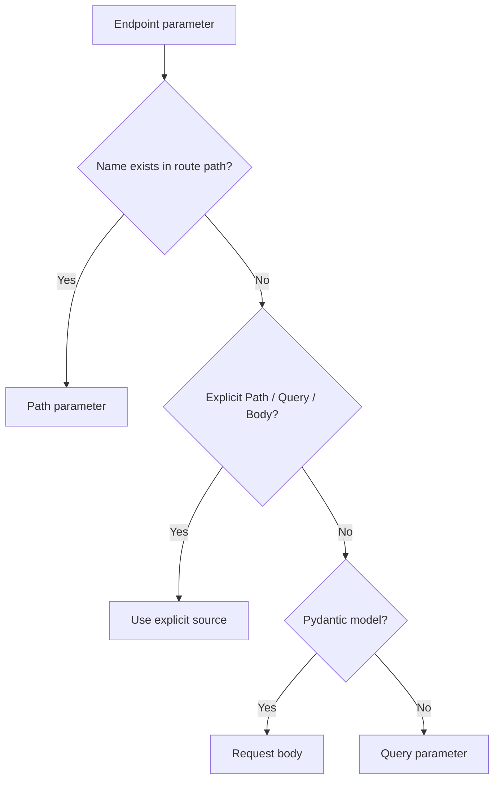

# FastAPI: Path, Query & Body Parameters

> FastAPI uses the route path, Python type hints, and helpers such as `Path`, `Query`, and `Body` to decide where request data comes from, validate it, convert it to Python values, and document the API automatically.

## In Short

- A parameter whose name appears in the route, such as `{product_id}`, is a **path parameter** and is always required.
- A simple value such as `str`, `int`, `float`, or `bool` is normally a **query parameter** when it is not part of the path.
- A Pydantic `BaseModel` is normally read from the **request body**.
- Use `Path()`, `Query()`, and `Body()` with `Annotated` when you need validation, metadata, aliases, or an explicit request source.
- For partial updates, `model_dump(exclude_unset=True)` is important because it keeps only fields that the client actually sent.
- Invalid path, query, or body data normally produces HTTP `422` with error details showing where validation failed.



**Interview takeaway:** FastAPI detects request data mainly from the route name, the Python type, and explicit declarations. Parameter order does not decide whether data comes from the path, query string, or body.

---

# 1. Request Data at a Glance

Consider this request:

```http
PUT /products/42?notify=true
Content-Type: application/json

{
  "name": "Mechanical Keyboard",
  "price": 89.99,
  "stock": 20
}
```

FastAPI can map it like this:

| Source | Example | Typical use |
|---|---|---|
| Path | `/products/42` | Identify a specific resource |
| Query | `?notify=true` | Filtering, pagination, sorting, options |
| Body | JSON payload | Create or update structured data |

A useful REST-style rule is:

```text
Path  -> Which resource?
Query -> How should I fetch/process it?
Body  -> What data should I create/change?
```

---

# 2. Path Parameters

A path parameter is part of the URL.

```python
from fastapi import FastAPI

app = FastAPI()

@app.get("/products/{product_id}")
async def get_product(product_id: int):
    return {"product_id": product_id}
```

Request:

```http
GET /products/42
```

FastAPI reads `"42"` from the URL, converts it to `int`, validates it, and passes `42` to the function.

## Path Parameters Are Always Required

Because the route contains `{product_id}`, the value must exist in the URL. Even this annotation does not make the path parameter optional:

```python
product_id: int | None
```

The route still requires a value such as `/products/42`.

## Path Validation

Use `Path()` for constraints and API documentation metadata.

```python
from typing import Annotated
from fastapi import Path

@app.get("/products/{product_id}")
async def get_product(
    product_id: Annotated[int, Path(ge=1, description="Product identifier")],
):
    return {"product_id": product_id}
```

Common numeric constraints:

| Constraint | Meaning |
|---|---|
| `gt=0` | Greater than `0` |
| `ge=1` | Greater than or equal to `1` |
| `lt=100` | Less than `100` |
| `le=100` | Less than or equal to `100` |

## Fixed Path Values

Use `Enum` when a path value must come from a known set.

```python
from enum import Enum

class ProductStatus(str, Enum):
    active = "active"
    inactive = "inactive"
    archived = "archived"

@app.get("/products/status/{status}")
async def products_by_status(status: ProductStatus):
    return {"status": status}
```

This gives validation and clearer OpenAPI documentation.

---

# 3. Query Parameters

Query parameters appear after `?` in the URL.

```http
GET /products?search=keyboard&limit=20
```

Simple function parameters that are not part of the path are treated as query parameters by default.

```python
@app.get("/products")
async def list_products(
    search: str | None = None,
    limit: int = 20,
):
    return {"search": search, "limit": limit}
```

Here:

- `search` is optional because its default is `None`.
- `limit` is optional because it has a default of `20`.
- A parameter such as `category: str` with no default would be required.

## Query Validation

```python
from typing import Annotated
from fastapi import Query

@app.get("/products")
async def list_products(
    search: Annotated[
        str | None,
        Query(min_length=2, max_length=50),
    ] = None,
    limit: Annotated[int, Query(ge=1, le=100)] = 20,
):
    return {"search": search, "limit": limit}
```

## Repeated Query Values

For URLs such as:

```http
GET /products?tag=python&tag=fastapi&tag=backend
```

declare a list explicitly with `Query()`:

```python
@app.get("/products")
async def list_products(
    tag: Annotated[list[str] | None, Query()] = None,
):
    return {"tags": tag}
```

## Query Parameter Models

For a larger group of related filters, FastAPI can read query parameters into a Pydantic model.

```python
from typing import Annotated, Literal
from fastapi import Query
from pydantic import BaseModel, ConfigDict, Field

class ProductFilters(BaseModel):
    model_config = ConfigDict(extra="forbid")

    limit: int = Field(default=20, ge=1, le=100)
    offset: int = Field(default=0, ge=0)
    order_by: Literal["name", "price", "created_at"] = "created_at"
    tags: list[str] = Field(default_factory=list)

@app.get("/products")
async def list_products(
    filters: Annotated[ProductFilters, Query()],
):
    return filters
```

This keeps endpoint signatures clean and centralizes filter validation. Query parameter models are supported in FastAPI `0.115.0+`.

---

# 4. Request Body Parameters

Use the request body for structured data, normally with Pydantic models.

```python
from pydantic import BaseModel, Field

class ProductCreate(BaseModel):
    name: str = Field(min_length=2, max_length=100)
    price: float = Field(gt=0)
    stock: int = Field(default=0, ge=0)

@app.post("/products")
async def create_product(product: ProductCreate):
    return product
```

Request:

```json
{
  "name": "Mechanical Keyboard",
  "price": 89.99,
  "stock": 20
}
```

FastAPI uses Pydantic to validate the body and gives the endpoint a `ProductCreate` object.

## Pydantic v2: Convert a Model to a Dictionary

```python
product_data = product.model_dump()
```

`model_dump()` is the normal Pydantic v2 method used by current FastAPI applications.

## Nested Body Data

```python
class Manufacturer(BaseModel):
    name: str
    country: str

class ProductCreate(BaseModel):
    name: str
    price: float = Field(gt=0)
    manufacturer: Manufacturer
```

FastAPI validates nested models automatically.

## `Body()` and Embedded Models

A single model normally expects its fields directly at the top level:

```json
{
  "name": "Mechanical Keyboard",
  "price": 89.99
}
```

With `Body(embed=True)`:

```python
from typing import Annotated
from fastapi import Body

@app.post("/products")
async def create_product(
    product: Annotated[ProductCreate, Body(embed=True)],
):
    return product
```

FastAPI expects:

```json
{
  "product": {
    "name": "Mechanical Keyboard",
    "price": 89.99
  }
}
```

---

# 5. Using Path, Query, and Body Together

This is the most practical pattern to remember.

```python
from typing import Annotated
from fastapi import Body, FastAPI, Path, Query
from pydantic import BaseModel, Field

app = FastAPI()

class ProductUpdate(BaseModel):
    name: str = Field(min_length=2, max_length=100)
    price: float = Field(gt=0)
    stock: int = Field(ge=0)

@app.put("/stores/{store_id}/products/{product_id}")
async def update_product(
    store_id: Annotated[int, Path(ge=1)],
    product_id: Annotated[int, Path(ge=1)],
    product: Annotated[ProductUpdate, Body()],
    notify: Annotated[bool, Query()] = False,
):
    return {
        "store_id": store_id,
        "product_id": product_id,
        "notify": notify,
        "product": product,
    }
```

Request:

```http
PUT /stores/5/products/42?notify=true
Content-Type: application/json

{
  "name": "Mechanical Keyboard Pro",
  "price": 109.99,
  "stock": 25
}
```

```mermaid
flowchart LR
    A[/stores/5/products/42] --> B[store_id = 5]
    A --> C[product_id = 42]
    D[?notify=true] --> E[notify = True]
    F[JSON body] --> G[ProductUpdate]
    B --> H[Endpoint]
    C --> H
    E --> H
    G --> H
```

FastAPI does not use argument order to decide the source. It uses the route, annotations, types, and explicit declarations.

---

# 6. Important Practical Patterns

## Multiple Body Parameters

A request has one body, but FastAPI can combine several declared body parameters into one JSON object.

```python
class Product(BaseModel):
    name: str
    price: float

class AuditInfo(BaseModel):
    changed_by: str
    reason: str

@app.put("/products/{product_id}")
async def update_product(
    product_id: int,
    product: Product,
    audit: AuditInfo,
    priority: Annotated[int, Body(ge=1, le=5)],
):
    ...
```

Expected JSON shape:

```json
{
  "product": {
    "name": "Mechanical Keyboard",
    "price": 89.99
  },
  "audit": {
    "changed_by": "avadh",
    "reason": "Price correction"
  },
  "priority": 2
}
```

A bare scalar such as `priority: int` would normally be treated as a query parameter. `Body()` is what keeps it inside the JSON body.

## Partial Updates with `PATCH`

For partial updates, make fields optional and dump only values sent by the client.

```python
class ProductPatch(BaseModel):
    name: str | None = None
    price: float | None = Field(default=None, gt=0)
    stock: int | None = Field(default=None, ge=0)

@app.patch("/products/{product_id}")
async def patch_product(product_id: int, payload: ProductPatch):
    changes = payload.model_dump(exclude_unset=True)
    return {"product_id": product_id, "changes": changes}
```

If the client sends only:

```json
{
  "price": 99.99
}
```

then `changes` contains only:

```python
{"price": 99.99}
```

This avoids overwriting fields the client did not send.

---

# 7. Required, Optional, and Nullable

These terms are different.

```python
class Example(BaseModel):
    title: str
    description: str | None
    notes: str | None = None
```

| Field | Can be omitted? | Can be `null`? |
|---|---:|---:|
| `title` | No | No |
| `description` | No | Yes |
| `notes` | Yes | Yes |

Key idea:

```text
str | None     -> value may be None
= None         -> value may be omitted
```

For path parameters, the route itself still makes the value required.

---

# 8. Validation Errors

When request data fails validation, FastAPI normally returns HTTP `422`.

Example:

```python
@app.get("/products/{product_id}")
async def get_product(
    product_id: Annotated[int, Path(ge=1)],
):
    return {"product_id": product_id}
```

A request to `/products/0` produces an error whose `loc` shows where the invalid value came from.

```json
{
  "detail": [
    {
      "loc": ["path", "product_id"],
      "msg": "Input should be greater than or equal to 1"
    }
  ]
}
```

Typical locations:

| `loc` | Source |
|---|---|
| `["path", "product_id"]` | Path |
| `["query", "limit"]` | Query |
| `["body", "price"]` | Body |

This structure is useful in frontend form handling, API tests, and logs.

---

# 9. Design Guidelines

## Use Path for Resource Identity

```http
GET /users/42
GET /orders/1001
GET /projects/9/tasks/15
```

## Use Query for Result Controls

```http
GET /products?search=keyboard
GET /products?status=active
GET /products?offset=20&limit=10
GET /products?order_by=price
```

## Use Body for Structured State Changes

```http
POST  /products
PUT   /products/42
PATCH /products/42
```

## Prefer Pydantic Models for Business Payloads

A model is easier to validate, reuse, test, and document than many unrelated scalar body parameters.

## Prefer `Annotated`

```python
limit: Annotated[int, Query(ge=1, le=100)] = 20
```

It keeps the three concerns clear:

| Part | Purpose |
|---|---|
| `int` | Python type |
| `Query(...)` | FastAPI metadata and validation |
| `= 20` | Default value |

## Keep Validation at the API Boundary

Validate request shape and simple constraints early, but keep business rules separate.

FastAPI validation can confirm that:

```text
product_id is an integer
price is greater than zero
```

It does not confirm that:

```text
the product exists
the current user owns it
the user is allowed to update it
the requested state transition is valid
```

Those checks belong in authorization, service, and domain logic.

---

# 10. Quick Reference

| Parameter | Default source | Common use |
|---|---|---|
| Name matches `{name}` in route | Path | Resource ID |
| Simple scalar | Query | Filters, pagination, flags |
| Pydantic model | Body | Create/update payload |
| `Path(...)` | Path | Explicit path validation/metadata |
| `Query(...)` | Query | Explicit query validation/metadata |
| `Body(...)` | Body | Explicit body behavior/validation |

```text
/products/42?notify=true
          |       |
          |       +--> Query parameter
          +----------> Path parameter

JSON payload ----------> Request body
```

**Final interview point:** When reading a FastAPI endpoint, first identify route placeholders, then simple scalar parameters, then Pydantic models, and finally check for explicit `Path`, `Query`, or `Body` declarations. That tells you exactly where each request value comes from.
