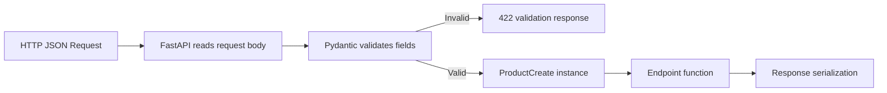
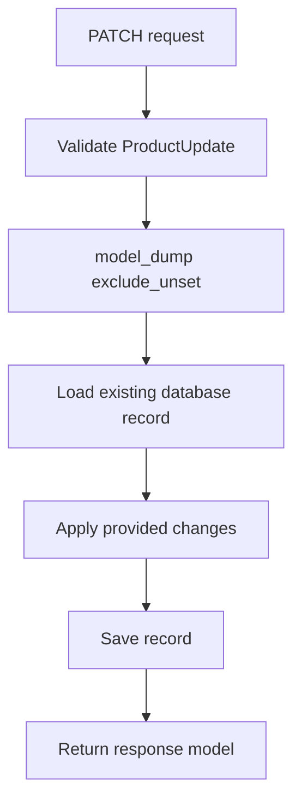
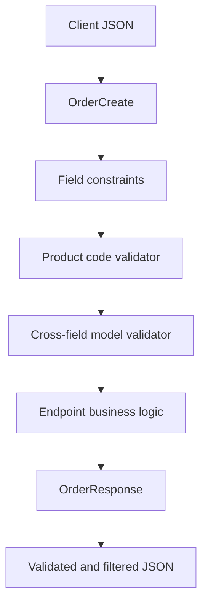

# Pydantic Models & Validation (v1 vs v2)

> **Pydantic converts untrusted input into validated Python objects.**  
> FastAPI uses Pydantic models to validate request data, generate OpenAPI schemas, create API documentation, and serialize response data.

This guide focuses on **Pydantic v2**, which is the current production version and the correct default for modern FastAPI applications. Pydantic v1 is covered mainly to help you understand and migrate older codebases.

---

# 1. Why FastAPI Uses Pydantic

An API receives data from outside the application:

- JSON request bodies
- Query parameters
- Path parameters
- Headers
- Form data
- Database or service responses

External data must never be trusted directly.

Pydantic provides a structured boundary between raw input and application code.

```text
Untrusted client data
        │
        ▼
Pydantic validation
        │
        ├── Invalid ──► Structured validation error
        │
        └── Valid ────► Typed Python object
                              │
                              ▼
                       Business logic
```

A Pydantic model gives FastAPI:

- Runtime data validation
- Type conversion where appropriate
- Clear validation errors
- IDE autocompletion
- JSON Schema generation
- OpenAPI documentation
- Request-body parsing
- Response serialization and filtering

Without a model, developers usually repeat manual checks throughout the codebase.

```python
# Manual validation: repetitive and incomplete

payload = await request.json()

if "name" not in payload:
    raise ValueError("name is required")

if not isinstance(payload["price"], (int, float)):
    raise ValueError("price must be numeric")
```

With Pydantic:

```python
from pydantic import BaseModel, Field


class ProductCreate(BaseModel):
    name: str = Field(min_length=2, max_length=100)
    price: float = Field(gt=0)
```

The model becomes an explicit contract for the data.

---

# 2. How Validation Works in FastAPI

Consider this endpoint:

```python
from fastapi import FastAPI
from pydantic import BaseModel

app = FastAPI()


class ProductCreate(BaseModel):
    name: str
    price: float
    in_stock: bool = True


@app.post("/products")
async def create_product(product: ProductCreate):
    return product
```

When a client sends a request, FastAPI performs the following flow:



Request:

```json
{
  "name": "Mechanical Keyboard",
  "price": "89.50",
  "in_stock": true
}
```

Default Pydantic validation is generally **lax**, so `"89.50"` can be converted into `89.5`.

Inside the endpoint:

```python
product.name       # str
product.price      # float
product.in_stock   # bool
```

Your business logic receives a validated object instead of a raw dictionary.

---

# 3. Creating a Basic Pydantic Model

A Pydantic model inherits from `BaseModel`.

```python
from pydantic import BaseModel


class UserCreate(BaseModel):
    username: str
    email: str
    age: int
    is_active: bool = True
```

Create an instance:

```python
user = UserCreate(
    username="avadh",
    email="avadh@example.com",
    age="28",
)
```

Pydantic converts `"28"` into `28` under normal lax validation.

```python
print(user.age)
# 28

print(type(user.age))
# <class 'int'>
```

## Model fields

Each field normally contains:

```text
field_name: type = default_value
```

Example:

```python
class UserCreate(BaseModel):
    username: str                 # required
    age: int                      # required
    is_active: bool = True        # optional because a default exists
    bio: str | None = None        # optional and nullable
```

---

# 4. Required, Optional, and Nullable Fields

This area is especially important when reading Pydantic v1 and v2 code.

## Core concepts

- **Required** means the caller must provide the field.
- **Optional** means the caller may omit the field.
- **Nullable** means the value may be `None`.

These are related, but they are not the same.

## Pydantic v2 behavior

```python
from pydantic import BaseModel


class Example(BaseModel):
    name: str
    nickname: str | None
    city: str | None = None
    country: str = "India"
```

| Field | Required? | Accepts `None`? | Default |
|---|---:|---:|---|
| `name: str` | Yes | No | None |
| `nickname: str \| None` | Yes | Yes | None provided |
| `city: str \| None = None` | No | Yes | `None` |
| `country: str = "India"` | No | No | `"India"` |

The most important rule is:

> In Pydantic v2, `T | None` means nullable. It does not automatically mean the field may be omitted.

Example:

```python
class Profile(BaseModel):
    middle_name: str | None
```

This is valid:

```python
Profile(middle_name=None)
```

This is invalid because the field is still required:

```python
Profile()
```

To make it both optional and nullable:

```python
class Profile(BaseModel):
    middle_name: str | None = None
```

## Why this matters for PATCH models

A PATCH model usually needs every field to be optional:

```python
class UserUpdate(BaseModel):
    username: str | None = None
    email: str | None = None
    is_active: bool | None = None
```

---

# 5. Field Constraints with `Field`

Type hints describe the general data type. `Field` adds business constraints and schema metadata.

```python
from decimal import Decimal

from pydantic import BaseModel, Field


class ProductCreate(BaseModel):
    name: str = Field(
        min_length=2,
        max_length=100,
        description="Display name of the product",
    )
    price: Decimal = Field(
        gt=0,
        max_digits=10,
        decimal_places=2,
    )
    quantity: int = Field(ge=0, le=10_000)
    sku: str = Field(pattern=r"^[A-Z0-9-]+$")
```

## Common constraints

| Data type | Common constraints |
|---|---|
| Numbers | `gt`, `ge`, `lt`, `le`, `multiple_of` |
| Strings | `min_length`, `max_length`, `pattern` |
| Decimal | `max_digits`, `decimal_places` |
| Lists | `min_length`, `max_length` |
| Any field | `title`, `description`, `examples`, `deprecated` |

Meaning:

```text
gt = greater than
ge = greater than or equal
lt = less than
le = less than or equal
```

Example:

```python
age: int = Field(ge=18, le=100)
```

This means:

```text
18 <= age <= 100
```

## Reusable constrained types with `Annotated`

`Annotated` is useful when the same rule is reused in multiple models.

```python
from typing import Annotated

from pydantic import BaseModel, Field


PositiveQuantity = Annotated[int, Field(gt=0, le=10_000)]
ProductName = Annotated[str, Field(min_length=2, max_length=100)]


class OrderItem(BaseModel):
    product_name: ProductName
    quantity: PositiveQuantity
```

This avoids repeating the same constraints across models.

---

# 6. Common Built-in Validation Types

Pydantic includes validation-aware types for common API data.

```python
from datetime import date, datetime
from uuid import UUID

from pydantic import AnyHttpUrl, BaseModel, EmailStr


class UserProfile(BaseModel):
    id: UUID
    email: EmailStr
    website: AnyHttpUrl | None = None
    birth_date: date
    created_at: datetime
```

Example request:

```json
{
  "id": "3d6f0a24-b2fa-4d6e-84f2-7d122fe76829",
  "email": "developer@example.com",
  "website": "https://example.com",
  "birth_date": "1997-05-14",
  "created_at": "2026-07-27T09:30:00Z"
}
```

Pydantic converts these strings into Python objects:

```python
profile.id          # UUID
profile.birth_date  # datetime.date
profile.created_at  # datetime.datetime
```

## Useful types in normal API development

- `EmailStr`
- `UUID`
- `date`
- `datetime`
- `Decimal`
- `AnyHttpUrl`
- `IPvAnyAddress`
- `SecretStr`
- `Literal`
- `Enum`

Example using `Literal`:

```python
from typing import Literal

from pydantic import BaseModel


class SortOptions(BaseModel):
    order: Literal["asc", "desc"] = "asc"
```

Only `"asc"` or `"desc"` is accepted.

> `EmailStr` requires the optional `email-validator` dependency.

```bash
pip install "pydantic[email]"
```

---

# 7. Nested Models and Collections

Real API payloads usually contain nested data.

```python
from pydantic import BaseModel, Field


class Address(BaseModel):
    line1: str
    city: str
    postal_code: str
    country: str = "India"


class OrderItem(BaseModel):
    product_id: int
    quantity: int = Field(gt=0)
    unit_price: float = Field(gt=0)


class OrderCreate(BaseModel):
    customer_id: int
    shipping_address: Address
    items: list[OrderItem] = Field(min_length=1)
```

Request:

```json
{
  "customer_id": 101,
  "shipping_address": {
    "line1": "MG Road",
    "city": "Ahmedabad",
    "postal_code": "380001"
  },
  "items": [
    {
      "product_id": 12,
      "quantity": 2,
      "unit_price": 499.0
    }
  ]
}
```

Validation occurs recursively.

```text
OrderCreate
├── customer_id: int
├── shipping_address: Address
│   ├── line1: str
│   ├── city: str
│   ├── postal_code: str
│   └── country: str
└── items: list[OrderItem]
    ├── product_id: int
    ├── quantity: int > 0
    └── unit_price: float > 0
```

If `items[0].quantity` is invalid, the error location points to the exact nested field.

```text
body -> items -> 0 -> quantity
```

---

# 8. Field Validators in Pydantic v2

`Field` handles common declarative constraints. Use a custom validator when a rule requires Python logic.

Pydantic v2 uses `@field_validator`.

```python
from pydantic import BaseModel, field_validator


class UserCreate(BaseModel):
    username: str

    @field_validator("username")
    @classmethod
    def normalize_username(cls, value: str) -> str:
        normalized = value.strip().lower()

        if " " in normalized:
            raise ValueError("username must not contain spaces")

        return normalized
```

Input:

```python
UserCreate(username="  Avadh_Dev  ")
```

Result:

```python
username="avadh_dev"
```

## Important validator rule

A validator must return the validated value.

```python
@field_validator("username")
@classmethod
def validate_username(cls, value: str) -> str:
    if len(value) < 3:
        raise ValueError("username is too short")

    return value
```

If the validator does not return the value, the field may become `None` or validation behavior may be incorrect.

## Validating multiple fields with one function

```python
class Customer(BaseModel):
    first_name: str
    last_name: str

    @field_validator("first_name", "last_name")
    @classmethod
    def normalize_name(cls, value: str) -> str:
        value = value.strip()

        if not value:
            raise ValueError("name must not be empty")

        return value.title()
```

---

# 9. Model Validators and Cross-Field Validation

A field validator is best for one field. A model validator is best when the rule depends on multiple fields.

```python
from typing_extensions import Self

from pydantic import BaseModel, model_validator


class RegistrationRequest(BaseModel):
    password: str
    password_confirmation: str

    @model_validator(mode="after")
    def passwords_must_match(self) -> Self:
        if self.password != self.password_confirmation:
            raise ValueError("passwords do not match")

        return self
```

Another example:

```python
from datetime import date
from typing_extensions import Self

from pydantic import BaseModel, model_validator


class DateRange(BaseModel):
    start_date: date
    end_date: date

    @model_validator(mode="after")
    def validate_date_order(self) -> Self:
        if self.end_date < self.start_date:
            raise ValueError("end_date must be on or after start_date")

        return self
```

## Why not always use a field validator?

A field validator can read previously validated fields through `ValidationInfo`, but field order becomes important.

```python
from pydantic import BaseModel, ValidationInfo, field_validator


class RegistrationRequest(BaseModel):
    password: str
    password_confirmation: str

    @field_validator("password_confirmation")
    @classmethod
    def passwords_must_match(
        cls,
        value: str,
        info: ValidationInfo,
    ) -> str:
        if value != info.data.get("password"):
            raise ValueError("passwords do not match")

        return value
```

This works because `password` appears before `password_confirmation`.

For rules involving the complete object, an `after` model validator is usually clearer.

---

# 10. Validation Modes: Before, After, Plain, and Wrap

Pydantic v2 validators support different execution modes.

```text
Raw input
   │
   ▼
Before validator
   │
   ▼
Pydantic type validation and conversion
   │
   ▼
After validator
   │
   ▼
Validated value
```

## `mode="after"`

Runs after Pydantic has converted and validated the field type.

```python
from pydantic import BaseModel, field_validator


class Product(BaseModel):
    price: float

    @field_validator("price", mode="after")
    @classmethod
    def validate_price(cls, value: float) -> float:
        if value <= 0:
            raise ValueError("price must be positive")

        return round(value, 2)
```

The validator receives a `float`, not raw input.

`after` is the default mode for `@field_validator`.

## `mode="before"`

Runs before Pydantic's normal type validation.

Use it for preprocessing raw input.

```python
from typing import Any

from pydantic import BaseModel, field_validator


class TagsRequest(BaseModel):
    tags: list[str]

    @field_validator("tags", mode="before")
    @classmethod
    def convert_comma_separated_tags(cls, value: Any) -> Any:
        if isinstance(value, str):
            return [item.strip() for item in value.split(",")]

        return value
```

Both inputs work:

```json
{"tags": ["python", "fastapi"]}
```

```json
{"tags": "python, fastapi"}
```

Use `Any` for before validators because raw input can be any object.

## `mode="plain"`

A plain validator replaces Pydantic's internal validation for that field.

It should be used carefully because the declared type may no longer be enforced automatically.

## `mode="wrap"`

A wrap validator can execute code:

- Before validation
- After validation
- Around validation
- Instead of normal validation

It is the most flexible but also the most complex mode.

For normal API development, most validation should use:

1. `Field`
2. `field_validator` with `after`
3. `model_validator` with `after`
4. `before` only when preprocessing is genuinely required

---

# 11. Model Configuration with `ConfigDict`

Pydantic v2 configures models through `model_config`.

```python
from pydantic import BaseModel, ConfigDict


class APIModel(BaseModel):
    model_config = ConfigDict(
        extra="forbid",
        str_strip_whitespace=True,
        validate_assignment=True,
    )
```

## Common configuration options

| Setting | Purpose |
|---|---|
| `extra="forbid"` | Reject undeclared fields |
| `extra="ignore"` | Ignore undeclared fields |
| `extra="allow"` | Store undeclared fields |
| `str_strip_whitespace=True` | Trim surrounding string whitespace |
| `str_to_lower=True` | Convert strings to lowercase |
| `strict=True` | Enable strict validation for the model |
| `validate_assignment=True` | Revalidate fields when attributes change |
| `frozen=True` | Make model instances immutable |
| `from_attributes=True` | Read values from object attributes |
| `validate_by_name=True` | Accept the Python field name |
| `validate_by_alias=True` | Accept the field alias |
| `serialize_by_alias=True` | Serialize using aliases by default |

## Rejecting extra fields

```python
from pydantic import BaseModel, ConfigDict


class LoginRequest(BaseModel):
    model_config = ConfigDict(extra="forbid")

    username: str
    password: str
```

Request:

```json
{
  "username": "avadh",
  "password": "secret",
  "is_admin": true
}
```

The request is rejected because `is_admin` is not declared.

This is useful for security-sensitive request models because unexpected client fields do not silently pass through.

## Shared base model

```python
from pydantic import BaseModel, ConfigDict


class APIModel(BaseModel):
    model_config = ConfigDict(
        extra="forbid",
        str_strip_whitespace=True,
    )


class UserCreate(APIModel):
    username: str
    email: str
```

All models inheriting from `APIModel` receive the shared configuration.

---

# 12. Strict Mode and Type Coercion

Pydantic normally attempts reasonable type conversion.

```python
from pydantic import BaseModel


class QuantityRequest(BaseModel):
    quantity: int
```

This succeeds in lax mode:

```python
QuantityRequest(quantity="5")
```

Result:

```python
quantity=5
```

This behavior is convenient for HTTP data because query parameters and form values often arrive as strings.

## Field-level strict mode

```python
from pydantic import BaseModel, Field


class PaymentRequest(BaseModel):
    amount: float = Field(gt=0)
    installments: int = Field(strict=True, ge=1)
```

Now this is rejected:

```json
{
  "amount": 999.0,
  "installments": "3"
}
```

`installments` must be a real integer.

## Model-level strict mode

```python
from pydantic import BaseModel, ConfigDict


class StrictPayload(BaseModel):
    model_config = ConfigDict(strict=True)

    user_id: int
    enabled: bool
```

## When strict mode is useful

Use strict validation when silent conversion could hide bad client behavior:

- Financial calculation inputs
- Security-sensitive flags
- Internal service-to-service contracts
- Event payloads
- Data pipelines
- IDs where `"001"` and `1` have different meanings

Do not enable strict mode blindly for every public HTTP endpoint. Some legitimate HTTP values naturally arrive as strings.

---

# 13. Aliases for API Field Names

Python commonly uses `snake_case`, while some APIs use `camelCase`.

```python
from pydantic import BaseModel, ConfigDict, Field


class UserResponse(BaseModel):
    model_config = ConfigDict(
        validate_by_name=True,
        validate_by_alias=True,
    )

    user_id: int = Field(alias="userId")
    full_name: str = Field(alias="fullName")
```

Both forms can be accepted:

```python
UserResponse(user_id=1, full_name="Avadh Bhalodiya")
```

```python
UserResponse(userId=1, fullName="Avadh Bhalodiya")
```

Serialize using aliases:

```python
user.model_dump(by_alias=True)
```

Output:

```json
{
  "userId": 1,
  "fullName": "Avadh Bhalodiya"
}
```

## Separate validation and serialization aliases

Pydantic v2 supports:

```python
from pydantic import BaseModel, Field


class Customer(BaseModel):
    name: str = Field(
        validation_alias="customer_name",
        serialization_alias="customerName",
    )
```

Input:

```json
{
  "customer_name": "Avadh"
}
```

Serialized output with `by_alias=True`:

```json
{
  "customerName": "Avadh"
}
```

This is useful when integrating with different legacy input and output formats.

---

# 14. Serialization with `model_dump`

Validation converts external data into a model. Serialization converts a model into a dictionary or JSON.

## Dictionary output

```python
user.model_dump()
```

Pydantic v1 equivalent:

```python
user.dict()
```

## JSON output

```python
user.model_dump_json()
```

Pydantic v1 equivalent:

```python
user.json()
```

## Excluding fields

```python
user.model_dump(exclude={"password"})
```

## Excluding `None`

```python
user.model_dump(exclude_none=True)
```

## Excluding unset values

```python
user.model_dump(exclude_unset=True)
```

This is especially useful for PATCH requests.

## Excluding default values

```python
user.model_dump(exclude_defaults=True)
```

## Including selected fields

```python
user.model_dump(include={"id", "username", "email"})
```

## Custom field serialization

```python
from datetime import datetime

from pydantic import BaseModel, field_serializer


class EventResponse(BaseModel):
    created_at: datetime

    @field_serializer("created_at")
    def serialize_created_at(self, value: datetime) -> str:
        return value.isoformat().replace("+00:00", "Z")
```

Pydantic v2 also provides:

- `@field_serializer`
- `@model_serializer`
- `@computed_field`

These replace many older custom serialization patterns.

---

# 15. Request Models and Response Models

Do not automatically reuse the same model for create input, database representation, and public output.

A user-creation request may contain a password, but a response must not expose it.

```python
from pydantic import BaseModel, EmailStr


class UserCreate(BaseModel):
    username: str
    email: EmailStr
    password: str


class UserResponse(BaseModel):
    id: int
    username: str
    email: EmailStr
```

FastAPI endpoint:

```python
from fastapi import FastAPI

app = FastAPI()


@app.post("/users", response_model=UserResponse)
async def create_user(payload: UserCreate):
    database_record = {
        "id": 101,
        "username": payload.username,
        "email": payload.email,
        "password": "hashed-value",
        "internal_status": "active",
    }

    return database_record
```

FastAPI filters the response according to `UserResponse`.

Returned JSON:

```json
{
  "id": 101,
  "username": "avadh",
  "email": "avadh@example.com"
}
```

The password and internal fields are excluded.

```text
UserCreate
├── username
├── email
└── password
        │
        ▼
Business logic / database
        │
        ▼
UserResponse
├── id
├── username
└── email
```

Response models provide:

- Output validation
- Output filtering
- OpenAPI response schema
- Protection against accidental field exposure

---

# 16. ORM Objects and `from_attributes`

Older Pydantic v1 code often uses:

```python
class Config:
    orm_mode = True
```

Pydantic v2 uses:

```python
from pydantic import BaseModel, ConfigDict


class UserResponse(BaseModel):
    model_config = ConfigDict(from_attributes=True)

    id: int
    username: str
    email: str
```

Example ORM-like object:

```python
class UserORM:
    def __init__(self) -> None:
        self.id = 1
        self.username = "avadh"
        self.email = "avadh@example.com"
```

Validate from attributes:

```python
orm_user = UserORM()

response = UserResponse.model_validate(orm_user)
```

Without `from_attributes=True`, Pydantic normally expects dictionary-like input.

FastAPI can use this model as a response model for SQLAlchemy objects or other domain objects that expose attributes.

---

# 17. Partial Updates with PATCH

A PATCH endpoint should update only fields explicitly provided by the client.

## Update model

```python
from pydantic import BaseModel, Field


class ProductUpdate(BaseModel):
    name: str | None = Field(default=None, min_length=2)
    price: float | None = Field(default=None, gt=0)
    in_stock: bool | None = None
```

Request:

```json
{
  "price": 799.0
}
```

Convert only supplied fields:

```python
changes = payload.model_dump(exclude_unset=True)
```

Result:

```python
{"price": 799.0}
```

Without `exclude_unset=True`, fields with defaults may appear and overwrite stored values.

## Distinguishing omitted fields from explicit `null`

```json
{}
```

means the client did not provide the field.

```json
{
  "name": null
}
```

means the client explicitly provided `null`.

You can inspect fields supplied by the client:

```python
payload.model_fields_set
```

Example:

```python
{"name"}
```

## Typical PATCH flow



---

# 18. Validation Errors and FastAPI 422 Responses

When request validation fails, FastAPI normally returns HTTP `422 Unprocessable Entity`.

Request:

```json
{
  "name": "A",
  "price": -10,
  "quantity": "many"
}
```

Model:

```python
from pydantic import BaseModel, Field


class ProductCreate(BaseModel):
    name: str = Field(min_length=2)
    price: float = Field(gt=0)
    quantity: int = Field(ge=0)
```

Simplified error response:

```json
{
  "detail": [
    {
      "type": "string_too_short",
      "loc": ["body", "name"],
      "msg": "String should have at least 2 characters",
      "input": "A"
    },
    {
      "type": "greater_than",
      "loc": ["body", "price"],
      "msg": "Input should be greater than 0",
      "input": -10
    },
    {
      "type": "int_parsing",
      "loc": ["body", "quantity"],
      "msg": "Input should be a valid integer",
      "input": "many"
    }
  ]
}
```

## Understanding the error structure

| Key | Meaning |
|---|---|
| `type` | Machine-readable validation error type |
| `loc` | Location of the invalid value |
| `msg` | Human-readable explanation |
| `input` | Invalid input value |
| `ctx` | Optional context such as minimum value |

Nested location example:

```json
{
  "loc": ["body", "items", 0, "quantity"]
}
```

Meaning:

```text
request body
└── items
    └── first item
        └── quantity
```

Pydantic collects multiple independent validation failures, allowing the client to correct several fields in one request.

---

# 19. `TypeAdapter` for Validation Without a Model

Not every value needs a named `BaseModel`.

Pydantic v2 provides `TypeAdapter` for validating arbitrary Python types.

```python
from pydantic import TypeAdapter


integer_list_adapter = TypeAdapter(list[int])

result = integer_list_adapter.validate_python(["1", 2, 3])
```

Result:

```python
[1, 2, 3]
```

Validate JSON:

```python
result = integer_list_adapter.validate_json('["1", 2, 3]')
```

Generate JSON Schema:

```python
schema = integer_list_adapter.json_schema()
```

## Practical use cases

- Validating a list from a message queue
- Validating cached JSON
- Validating function output
- Validating `TypedDict`
- Validating dataclasses
- Reusing a complex type without creating a wrapper model

Example:

```python
from typing import Annotated

from pydantic import Field, TypeAdapter


PositiveIds = list[Annotated[int, Field(gt=0)]]

adapter = TypeAdapter(PositiveIds)
ids = adapter.validate_python([1, "2", 3])
```

---

# 20. Pydantic v1 vs v2 Comparison

Pydantic v2 is a major rewrite. Its validation engine is powered by `pydantic-core`, implemented in Rust.

## Common API changes

| Pydantic v1 | Pydantic v2 |
|---|---|
| `model.dict()` | `model.model_dump()` |
| `model.json()` | `model.model_dump_json()` |
| `Model.parse_obj(data)` | `Model.model_validate(data)` |
| `Model.parse_raw(json_data)` | `Model.model_validate_json(json_data)` |
| `Model.schema()` | `Model.model_json_schema()` |
| `model.copy()` | `model.model_copy()` |
| `Model.construct()` | `Model.model_construct()` |
| `Model.__fields__` | `Model.model_fields` |
| `@validator` | `@field_validator` |
| `@root_validator` | `@model_validator` |
| Inner `class Config` | `model_config = ConfigDict(...)` |
| `orm_mode = True` | `from_attributes=True` |
| `allow_mutation = False` | `frozen=True` |
| `schema_extra` | `json_schema_extra` |
| `regex=` | `pattern=` |
| `min_items` / `max_items` | `min_length` / `max_length` |
| `validate_arguments` | `validate_call` |
| Custom `__root__` field | `RootModel` |
| `GenericModel` | `BaseModel, Generic[T]` |
| `json_encoders` configuration | Serializer decorators preferred |

## Configuration comparison

### Pydantic v1

```python
from pydantic import BaseModel


class User(BaseModel):
    id: int
    name: str

    class Config:
        orm_mode = True
        extra = "forbid"
        allow_mutation = False
```

### Pydantic v2

```python
from pydantic import BaseModel, ConfigDict


class User(BaseModel):
    model_config = ConfigDict(
        from_attributes=True,
        extra="forbid",
        frozen=True,
    )

    id: int
    name: str
```

## Validation comparison

### Pydantic v1

```python
from pydantic import BaseModel, validator


class User(BaseModel):
    username: str

    @validator("username")
    def normalize_username(cls, value: str) -> str:
        return value.strip().lower()
```

### Pydantic v2

```python
from pydantic import BaseModel, field_validator


class User(BaseModel):
    username: str

    @field_validator("username")
    @classmethod
    def normalize_username(cls, value: str) -> str:
        return value.strip().lower()
```

## Required and nullable behavior

This is a notable migration difference.

### Pydantic v1

Older v1 code often treated this as an optional field with an implicit `None` default:

```python
class Profile(BaseModel):
    nickname: str | None
```

### Pydantic v2

The same declaration is required but accepts `None`:

```python
class Profile(BaseModel):
    nickname: str | None
```

To allow omission in v2:

```python
class Profile(BaseModel):
    nickname: str | None = None
```

## Current FastAPI compatibility

Modern FastAPI applications should use native Pydantic v2 models.

FastAPI temporarily supported `pydantic.v1` models while projects migrated, but that temporary compatibility was removed in FastAPI `0.128.0`.

The Pydantic v2 package still exposes a `pydantic.v1` namespace for non-FastAPI migration scenarios:

```python
from pydantic.v1 import BaseModel
```

Do not use that namespace for models passed to current FastAPI endpoints.

---

# 21. Migrating Validators from v1 to v2

## Single-field validator

### v1

```python
from pydantic import BaseModel, validator


class Product(BaseModel):
    code: str

    @validator("code")
    def validate_code(cls, value: str) -> str:
        value = value.strip().upper()

        if not value.startswith("PRD-"):
            raise ValueError("code must start with PRD-")

        return value
```

### v2

```python
from pydantic import BaseModel, field_validator


class Product(BaseModel):
    code: str

    @field_validator("code")
    @classmethod
    def validate_code(cls, value: str) -> str:
        value = value.strip().upper()

        if not value.startswith("PRD-"):
            raise ValueError("code must start with PRD-")

        return value
```

## Pre-validation

### v1

```python
@validator("tags", pre=True)
def parse_tags(cls, value):
    ...
```

### v2

```python
@field_validator("tags", mode="before")
@classmethod
def parse_tags(cls, value):
    ...
```

## Root validation

### v1

```python
from pydantic import BaseModel, root_validator


class DateRange(BaseModel):
    start: int
    end: int

    @root_validator
    def validate_range(cls, values):
        if values["end"] < values["start"]:
            raise ValueError("invalid range")

        return values
```

### v2

```python
from typing_extensions import Self

from pydantic import BaseModel, model_validator


class DateRange(BaseModel):
    start: int
    end: int

    @model_validator(mode="after")
    def validate_range(self) -> Self:
        if self.end < self.start:
            raise ValueError("invalid range")

        return self
```

## Item-level validation for lists

Pydantic v1 supported `each_item=True`.

```python
# Pydantic v1
@validator("scores", each_item=True)
def score_must_be_positive(cls, value):
    ...
```

In Pydantic v2, annotate the list item type.

```python
from typing import Annotated

from pydantic import BaseModel, Field


PositiveScore = Annotated[int, Field(ge=0)]


class Result(BaseModel):
    scores: list[PositiveScore]
```

This is more reusable and keeps the constraint close to the item type.

---

# 22. Complete FastAPI Example

The following example combines the concepts commonly used in production APIs.

```python
from datetime import datetime, timezone
from decimal import Decimal
from typing import Annotated, Literal
from uuid import UUID, uuid4

from fastapi import FastAPI, Query, status
from pydantic import (
    BaseModel,
    ConfigDict,
    EmailStr,
    Field,
    field_validator,
    model_validator,
)
from typing_extensions import Self


app = FastAPI(title="Order API")


ProductCode = Annotated[
    str,
    Field(
        min_length=5,
        max_length=30,
        pattern=r"^[A-Z0-9-]+$",
    ),
]


class APIModel(BaseModel):
    model_config = ConfigDict(
        extra="forbid",
        str_strip_whitespace=True,
    )


class Address(APIModel):
    line1: str = Field(min_length=3, max_length=150)
    city: str = Field(min_length=2, max_length=80)
    postal_code: str = Field(min_length=4, max_length=12)
    country: str = "India"


class OrderItemCreate(APIModel):
    product_code: ProductCode
    quantity: int = Field(gt=0, le=100)
    unit_price: Decimal = Field(
        gt=0,
        max_digits=10,
        decimal_places=2,
    )

    @field_validator("product_code")
    @classmethod
    def normalize_product_code(cls, value: str) -> str:
        return value.upper()


class OrderCreate(APIModel):
    customer_email: EmailStr
    shipping_address: Address
    items: list[OrderItemCreate] = Field(min_length=1)
    coupon_code: str | None = Field(
        default=None,
        min_length=3,
        max_length=30,
    )

    @model_validator(mode="after")
    def validate_total_quantity(self) -> Self:
        total_quantity = sum(item.quantity for item in self.items)

        if total_quantity > 200:
            raise ValueError(
                "total quantity across all items cannot exceed 200"
            )

        return self


class OrderResponse(BaseModel):
    id: UUID
    customer_email: EmailStr
    status: Literal["pending", "confirmed", "cancelled"]
    total_amount: Decimal
    created_at: datetime


class OrderFilters(BaseModel):
    model_config = ConfigDict(extra="forbid")

    limit: int = Field(default=20, gt=0, le=100)
    offset: int = Field(default=0, ge=0)
    status: Literal["pending", "confirmed", "cancelled"] | None = None


@app.post(
    "/orders",
    response_model=OrderResponse,
    status_code=status.HTTP_201_CREATED,
)
async def create_order(payload: OrderCreate) -> OrderResponse:
    total_amount = sum(
        item.unit_price * item.quantity
        for item in payload.items
    )

    return OrderResponse(
        id=uuid4(),
        customer_email=payload.customer_email,
        status="pending",
        total_amount=total_amount,
        created_at=datetime.now(timezone.utc),
    )


@app.get("/orders", response_model=list[OrderResponse])
async def list_orders(
    filters: Annotated[OrderFilters, Query()],
) -> list[OrderResponse]:
    # Normally, filters would be passed to the repository layer.
    return []
```

## Data flow



## What this design provides

- Strictly defined request shape
- Reusable field types
- Nested validation
- Cross-field validation
- Safe response filtering
- Automatic request and response schemas
- Swagger UI documentation
- Typed objects throughout the endpoint

---

# 23. Testing Pydantic Validation

Validation rules should be tested independently from HTTP endpoints.

```python
import pytest
from pydantic import ValidationError


def test_product_code_is_normalized() -> None:
    item = OrderItemCreate(
        product_code="prd-100",
        quantity=2,
        unit_price="499.00",
    )

    assert item.product_code == "PRD-100"
    assert item.quantity == 2


def test_quantity_must_be_positive() -> None:
    with pytest.raises(ValidationError) as exc_info:
        OrderItemCreate(
            product_code="PRD-100",
            quantity=0,
            unit_price="499.00",
        )

    errors = exc_info.value.errors()

    assert errors[0]["loc"] == ("quantity",)
```

Test FastAPI behavior separately:

```python
from fastapi.testclient import TestClient


client = TestClient(app)


def test_create_order_returns_422_for_empty_items() -> None:
    response = client.post(
        "/orders",
        json={
            "customer_email": "avadh@example.com",
            "shipping_address": {
                "line1": "MG Road",
                "city": "Ahmedabad",
                "postal_code": "380001",
            },
            "items": [],
        },
    )

    assert response.status_code == 422
```

## Useful test categories

- Valid input
- Missing required field
- Invalid type
- Boundary values
- Empty collections
- Invalid nested values
- Custom field validator failure
- Cross-field validator failure
- Serialization output
- Extra-field rejection
- PATCH omitted-versus-null behavior

---

# 24. Practical Design Guidelines

## Keep transport validation separate from business rules

Pydantic is ideal for validating the shape and consistency of data.

Good Pydantic rules:

- Email format
- Positive quantity
- Valid date ordering
- Enum membership
- String length
- Allowed pattern
- Two request fields must match

Rules that usually belong in a service or domain layer:

- Email must be unique in the database
- Customer has sufficient account balance
- Product is currently available
- User has permission to update the record
- Coupon is valid for the selected customer

Pydantic should not become a hidden database or network-access layer.

```text
Pydantic validation
    │
    ├── Data shape
    ├── Type correctness
    ├── Local field rules
    └── Cross-field consistency

Service/domain validation
    │
    ├── Database state
    ├── Permissions
    ├── External services
    └── Business workflow rules
```

## Prefer declarative constraints before custom validators

Prefer:

```python
quantity: int = Field(gt=0, le=100)
```

over:

```python
@field_validator("quantity")
@classmethod
def validate_quantity(cls, value: int) -> int:
    if value <= 0 or value > 100:
        raise ValueError("invalid quantity")

    return value
```

`Field` constraints are easier to read and automatically appear in JSON Schema.

## Use separate input and output models

Typical naming:

```text
UserCreate
UserUpdate
UserResponse
UserInternal
```

This prevents internal fields from leaking into API responses.

## Use `extra="forbid"` selectively

This is valuable for:

- Authentication payloads
- Payment payloads
- Internal service contracts
- Commands and events
- APIs where typos must fail immediately

For highly flexible ingestion APIs, ignoring or allowing extras may be intentional.

## Keep validators deterministic

A validator should ideally produce the same result for the same input.

Avoid doing the following inside ordinary validators:

- Database queries
- HTTP calls
- Sending emails
- Mutating unrelated global state
- Slow file operations

## Prefer `Decimal` for monetary values

For financial values:

```python
from decimal import Decimal

amount: Decimal = Field(gt=0, decimal_places=2)
```

Binary floating-point values can produce precision surprises.

## Use strictness where conversion is dangerous

Lax conversion is helpful at an HTTP boundary, but strict fields improve reliability for sensitive contracts.

## Keep models focused

A model with dozens of unrelated fields is difficult to evolve and test.

Prefer nested models that represent clear concepts:

```text
OrderCreate
├── CustomerReference
├── Address
├── list[OrderItem]
└── PaymentSelection
```

---

# 25. Key Takeaways

- Pydantic models are runtime-validated data contracts built from Python type hints.
- FastAPI uses them for request parsing, validation, OpenAPI schemas, documentation, and response filtering.
- A field is optional only when it has a default value.
- `str | None` means nullable; `str | None = None` means nullable and optional.
- Use `Field` for declarative constraints.
- Use `@field_validator` for custom single-field rules.
- Use `@model_validator` for cross-field rules.
- Use `ConfigDict` instead of the old v1 `Config` class.
- Use `model_dump`, `model_validate`, and `model_json_schema` in v2.
- Use separate request and response models to protect sensitive data.
- Use `from_attributes=True` when validating ORM or object attributes.
- Use `exclude_unset=True` for partial updates.
- Use `TypeAdapter` when validation is needed without a named model.
- Treat Pydantic v1 syntax as legacy code that should be migrated.
- Current FastAPI applications should use native Pydantic v2 models.

---

## Official References

- [Pydantic Documentation](https://docs.pydantic.dev/latest/)
- [Pydantic Migration Guide](https://docs.pydantic.dev/latest/migration/)
- [Pydantic Models](https://docs.pydantic.dev/latest/concepts/models/)
- [Pydantic Fields](https://docs.pydantic.dev/latest/concepts/fields/)
- [Pydantic Validators](https://docs.pydantic.dev/latest/concepts/validators/)
- [Pydantic Strict Mode](https://docs.pydantic.dev/latest/concepts/strict_mode/)
- [FastAPI Request Body](https://fastapi.tiangolo.com/tutorial/body/)
- [FastAPI Body Fields](https://fastapi.tiangolo.com/tutorial/body-fields/)
- [FastAPI Response Models](https://fastapi.tiangolo.com/tutorial/response-model/)
- [FastAPI Pydantic v1 to v2 Migration](https://fastapi.tiangolo.com/how-to/migrate-from-pydantic-v1-to-pydantic-v2/)
