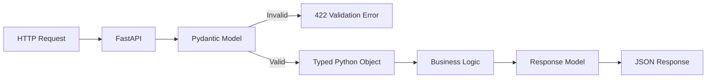
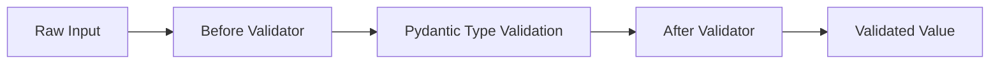
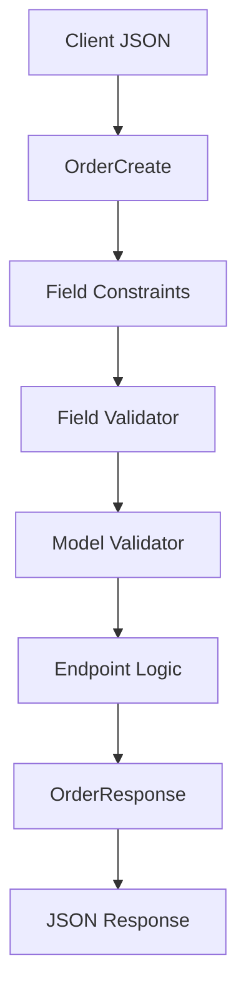

# Pydantic Models & Validation (v1 vs v2)

> FastAPI uses Pydantic models as typed data contracts for request validation, parsing, OpenAPI/JSON Schema generation, API documentation, and response serialization.

## In short

- **Pydantic v2 is the current production line**. As of August 2026, Pydantic 2.13 is the current stable series; 2.14 is still pre-release.
- Current FastAPI uses **Pydantic v2 models**. FastAPI removed `pydantic.v1` endpoint-model compatibility in **0.128.0**.
- A field is optional only when it has a default. `str | None` is **required but nullable**; `str | None = None` is optional and nullable.
- Prefer `Field(...)` for normal constraints before writing custom validators.
- Use `@field_validator` for one field and `@model_validator(mode="after")` for rules involving multiple fields.
- Pydantic is **lax by default**, so safe conversions such as `"5"` → `5` can occur. Use strict validation where coercion is unsafe.
- In v2, common APIs were renamed: `dict()` → `model_dump()`, `parse_obj()` → `model_validate()`, `Config` → `ConfigDict`, and `@validator` → `@field_validator`.



The key interview idea is simple: **Pydantic creates a validated boundary between untrusted external data and application logic.**

---

# 1. Why FastAPI Uses Pydantic

API input comes from outside your application and should not be trusted directly.

Common sources include:

- JSON request bodies
- Query parameters
- Path parameters
- Headers and forms
- Database or service data used in responses

Without Pydantic, validation quickly becomes repetitive:

```python
payload = await request.json()

if "name" not in payload:
    raise ValueError("name is required")

if not isinstance(payload["price"], (int, float)):
    raise ValueError("price must be numeric")
```

With Pydantic:

```python
from pydantic import BaseModel, Field


class ProductCreate(BaseModel):
    name: str = Field(min_length=2, max_length=100)
    price: float = Field(gt=0)
```

FastAPI can now validate the request, generate OpenAPI schema, and document the endpoint automatically.

---

# 2. Basic Model and FastAPI Validation Flow

A Pydantic model inherits from `BaseModel`.

```python
from fastapi import FastAPI
from pydantic import BaseModel

app = FastAPI()


class ProductCreate(BaseModel):
    name: str
    price: float
    in_stock: bool = True


@app.post("/products")
async def create_product(product: ProductCreate):
    return product
```

Request:

```json
{
  "name": "Mechanical Keyboard",
  "price": "89.50"
}
```

By default, Pydantic uses lax validation where appropriate, so `"89.50"` is converted to `89.5`.

Inside the endpoint:

```python
product.name      # str
product.price     # float
product.in_stock  # bool
```

If validation fails, FastAPI normally returns HTTP `422` before the endpoint business logic runs.

---

# 3. Required, Optional, and Nullable Fields

This is one of the most important Pydantic v2 concepts.

```python
from pydantic import BaseModel


class Profile(BaseModel):
    name: str
    nickname: str | None
    city: str | None = None
    country: str = "India"
```

| Field | Required? | Accepts `None`? | Default |
|---|---:|---:|---|
| `name: str` | Yes | No | — |
| `nickname: str \| None` | Yes | Yes | — |
| `city: str \| None = None` | No | Yes | `None` |
| `country: str = "India"` | No | No | `"India"` |

The important rule:

```python
nickname: str | None
```

means:

> The field must be supplied, but its value may be `None`.

To make it optional:

```python
nickname: str | None = None
```

This matters especially for PATCH/update models.

---

# 4. Field Constraints with `Field`

Use `Field` when the rule can be expressed declaratively.

```python
from decimal import Decimal
from pydantic import BaseModel, Field


class ProductCreate(BaseModel):
    name: str = Field(min_length=2, max_length=100)
    price: Decimal = Field(gt=0, max_digits=10, decimal_places=2)
    quantity: int = Field(ge=0, le=10_000)
    sku: str = Field(pattern=r"^[A-Z0-9-]+$")
```

## Common constraints

| Type | Common constraints |
|---|---|
| Numbers | `gt`, `ge`, `lt`, `le`, `multiple_of` |
| Strings | `min_length`, `max_length`, `pattern` |
| Decimal | `max_digits`, `decimal_places` |
| Lists | `min_length`, `max_length` |
| Schema metadata | `title`, `description`, `examples`, `deprecated` |

Prefer this:

```python
quantity: int = Field(gt=0, le=100)
```

instead of writing a custom validator for the same simple range check.

## Reusable constraints with `Annotated`

```python
from typing import Annotated
from pydantic import Field

PositiveQuantity = Annotated[int, Field(gt=0, le=10_000)]
```

You can reuse `PositiveQuantity` across multiple models.

---

# 5. Useful Built-in Types

Pydantic understands many common API types.

```python
from datetime import date, datetime
from decimal import Decimal
from typing import Literal
from uuid import UUID

from pydantic import AnyHttpUrl, BaseModel, EmailStr


class UserProfile(BaseModel):
    id: UUID
    email: EmailStr
    website: AnyHttpUrl | None = None
    birth_date: date
    created_at: datetime
    balance: Decimal
    status: Literal["active", "inactive"] = "active"
```

Commonly useful types:

- `EmailStr`
- `UUID`
- `date`
- `datetime`
- `Decimal`
- `AnyHttpUrl`
- `SecretStr`
- `Literal`
- `Enum`

`EmailStr` requires the optional email validation dependency:

```bash
pip install "pydantic[email]"
```

---

# 6. Nested Models

Real API bodies are often nested.

```python
from pydantic import BaseModel, Field


class Address(BaseModel):
    line1: str
    city: str
    postal_code: str


class OrderItem(BaseModel):
    product_id: int
    quantity: int = Field(gt=0)


class OrderCreate(BaseModel):
    customer_id: int
    shipping_address: Address
    items: list[OrderItem] = Field(min_length=1)
```

Structure:

```text
OrderCreate
├── customer_id
├── shipping_address: Address
│   ├── line1
│   ├── city
│   └── postal_code
└── items: list[OrderItem]
    ├── product_id
    └── quantity
```

Validation is recursive. If `items[0].quantity` is invalid, FastAPI's error location points to that exact nested value.

---

# 7. Field Validators

Use `@field_validator` when a rule needs Python logic.

```python
from pydantic import BaseModel, field_validator


class UserCreate(BaseModel):
    username: str

    @field_validator("username")
    @classmethod
    def normalize_username(cls, value: str) -> str:
        value = value.strip().lower()

        if " " in value:
            raise ValueError("username must not contain spaces")

        return value
```

Important: **a field validator must return the validated value**.

## Validator modes



### `mode="after"`

Runs after Pydantic converts the value to the declared type.

```python
@field_validator("price")
@classmethod
def validate_price(cls, value: float) -> float:
    if value <= 0:
        raise ValueError("price must be positive")
    return value
```

`after` is the normal/default choice.

### `mode="before"`

Runs on raw input before normal conversion.

```python
from typing import Any


@field_validator("tags", mode="before")
@classmethod
def parse_tags(cls, value: Any) -> Any:
    if isinstance(value, str):
        return [item.strip() for item in value.split(",")]
    return value
```

Use `before` only when preprocessing raw input is genuinely needed.

---

# 8. Model Validators for Cross-Field Rules

Use `@model_validator` when validation depends on multiple fields.

```python
from typing_extensions import Self
from pydantic import BaseModel, model_validator


class RegistrationRequest(BaseModel):
    password: str
    password_confirmation: str

    @model_validator(mode="after")
    def passwords_must_match(self) -> Self:
        if self.password != self.password_confirmation:
            raise ValueError("passwords do not match")

        return self
```

For `mode="after"`:

- the fields are already validated
- the method works with the complete model
- return `self`

Typical uses include:

- password confirmation
- date-range validation
- dependent fields
- mutually exclusive options

Keep database queries, HTTP calls, and permission checks out of ordinary Pydantic validators. Those belong in the service/domain layer.

---

# 9. Model Configuration with `ConfigDict`

Pydantic v2 uses `model_config`.

```python
from pydantic import BaseModel, ConfigDict


class APIModel(BaseModel):
    model_config = ConfigDict(
        extra="forbid",
        str_strip_whitespace=True,
        validate_assignment=True,
    )
```

Common options:

| Setting | Purpose |
|---|---|
| `extra="forbid"` | Reject undeclared fields |
| `str_strip_whitespace=True` | Trim string whitespace |
| `strict=True` | Disable normal coercion for the model |
| `validate_assignment=True` | Revalidate values on assignment |
| `frozen=True` | Make instances immutable |
| `from_attributes=True` | Read data from object attributes |
| `validate_by_name=True` | Accept Python field names |
| `validate_by_alias=True` | Accept aliases |
| `serialize_by_alias=True` | Serialize using aliases by default |

For security-sensitive request models, `extra="forbid"` is often useful because accidental or unexpected input fields fail immediately.

---

# 10. Strict Mode vs Type Coercion

Default Pydantic behavior is usually convenient at an HTTP boundary:

```python
from pydantic import BaseModel


class QuantityRequest(BaseModel):
    quantity: int


QuantityRequest(quantity="5")
# quantity=5
```

For fields where coercion is risky:

```python
from pydantic import BaseModel, Field


class PaymentRequest(BaseModel):
    amount: float = Field(gt=0)
    installments: int = Field(strict=True, ge=1)
```

Now `"3"` is rejected for `installments`.

Strict validation is especially useful for:

- financial or accounting contracts
- internal service-to-service messages
- security-sensitive flags
- events and data pipelines
- fields where `"001"` and `1` have different meanings

Do not enable strict mode everywhere automatically. Query parameters and form data often arrive as strings.

---

# 11. Serialization and PATCH Updates

Pydantic v2 uses `model_dump()`.

```python
user.model_dump()
user.model_dump(exclude_none=True)
user.model_dump(exclude_unset=True)
user.model_dump(exclude={"password"})
```

## Important PATCH pattern

```python
from pydantic import BaseModel, Field


class ProductUpdate(BaseModel):
    name: str | None = Field(default=None, min_length=2)
    price: float | None = Field(default=None, gt=0)
    in_stock: bool | None = None
```

Request:

```json
{
  "price": 799.0
}
```

Use:

```python
changes = payload.model_dump(exclude_unset=True)
```

Result:

```python
{"price": 799.0}
```

This prevents omitted fields from overwriting existing database values.

### Omitted vs explicit `null`

These are different:

```json
{}
```

```json
{"name": null}
```

Check fields explicitly supplied by the client with:

```python
payload.model_fields_set
```

That distinction is frequently important in real PATCH endpoints.

---

# 12. ORM/Object Conversion with `from_attributes`

Pydantic v1 used `orm_mode = True`.

Pydantic v2 uses:

```python
from pydantic import BaseModel, ConfigDict


class UserResponse(BaseModel):
    model_config = ConfigDict(from_attributes=True)

    id: int
    username: str
    email: str
```

Then:

```python
response = UserResponse.model_validate(orm_user)
```

Pydantic reads matching object attributes instead of requiring only dictionary-style input.

This is commonly used with ORM objects returned from database layers.

---

# 13. Validation Errors and FastAPI `422`

Example model:

```python
from pydantic import BaseModel, Field


class ProductCreate(BaseModel):
    name: str = Field(min_length=2)
    price: float = Field(gt=0)
    quantity: int = Field(ge=0)
```

Invalid request:

```json
{
  "name": "A",
  "price": -10,
  "quantity": "many"
}
```

FastAPI returns a structured `422` response containing validation details.

Typical error fields include:

| Key | Meaning |
|---|---|
| `type` | Machine-readable validation error |
| `loc` | Where the invalid value occurred |
| `msg` | Human-readable message |
| `input` | Invalid input |
| `ctx` | Optional validation context |

For nested data:

```text
body -> items -> 0 -> quantity
```

means the invalid field is `quantity` in the first item of the request body.

---

# 14. Pydantic v1 vs v2

Pydantic v2 is a major rewrite whose core validation logic is implemented in Rust through `pydantic-core`.

## Common migration changes

| Pydantic v1 | Pydantic v2 |
|---|---|
| `model.dict()` | `model.model_dump()` |
| `model.json()` | `model.model_dump_json()` |
| `Model.parse_obj(data)` | `Model.model_validate(data)` |
| `Model.parse_raw(data)` | `Model.model_validate_json(data)` |
| `Model.schema()` | `Model.model_json_schema()` |
| `model.copy()` | `model.model_copy()` |
| `Model.construct()` | `Model.model_construct()` |
| `Model.__fields__` | `Model.model_fields` |
| `@validator` | `@field_validator` |
| `@root_validator` | `@model_validator` |
| inner `class Config` | `model_config = ConfigDict(...)` |
| `orm_mode = True` | `from_attributes=True` |
| `allow_mutation = False` | `frozen=True` |
| `schema_extra` | `json_schema_extra` |
| `regex=` | `pattern=` |
| `min_items` / `max_items` | `min_length` / `max_length` |
| custom `__root__` models | `RootModel` |

## Required/nullable migration difference

This declaration changed behavior:

```python
nickname: str | None
```

In v1 it commonly behaved as optional with an implicit `None`.

In v2 it is **required but nullable**.

Use:

```python
nickname: str | None = None
```

when omission should be allowed.

## FastAPI compatibility

For new and current FastAPI applications, use native Pydantic v2 imports:

```python
from pydantic import BaseModel
```

FastAPI introduced temporary `pydantic.v1` compatibility for migration, but removed it in FastAPI `0.128.0`.

Current FastAPI endpoint models therefore need Pydantic v2.

---

# 15. Complete Practical Example

This single example combines the features used most often in normal API development.

```python
from decimal import Decimal
from typing import Annotated, Literal
from uuid import UUID, uuid4

from fastapi import FastAPI, status
from pydantic import (
    BaseModel,
    ConfigDict,
    EmailStr,
    Field,
    field_validator,
    model_validator,
)
from typing_extensions import Self

app = FastAPI()

ProductCode = Annotated[
    str,
    Field(min_length=5, max_length=30, pattern=r"^[A-Z0-9-]+$"),
]


class APIModel(BaseModel):
    model_config = ConfigDict(
        extra="forbid",
        str_strip_whitespace=True,
    )


class OrderItemCreate(APIModel):
    product_code: ProductCode
    quantity: int = Field(gt=0, le=100)
    unit_price: Decimal = Field(
        gt=0,
        max_digits=10,
        decimal_places=2,
    )

    @field_validator("product_code")
    @classmethod
    def normalize_product_code(cls, value: str) -> str:
        return value.upper()


class OrderCreate(APIModel):
    customer_email: EmailStr
    items: list[OrderItemCreate] = Field(min_length=1)
    coupon_code: str | None = None

    @model_validator(mode="after")
    def validate_total_quantity(self) -> Self:
        if sum(item.quantity for item in self.items) > 200:
            raise ValueError("total quantity cannot exceed 200")
        return self


class OrderResponse(BaseModel):
    id: UUID
    customer_email: EmailStr
    status: Literal["pending", "confirmed", "cancelled"]
    total_amount: Decimal


@app.post(
    "/orders",
    response_model=OrderResponse,
    status_code=status.HTTP_201_CREATED,
)
async def create_order(payload: OrderCreate) -> OrderResponse:
    total = sum(item.unit_price * item.quantity for item in payload.items)

    return OrderResponse(
        id=uuid4(),
        customer_email=payload.customer_email,
        status="pending",
        total_amount=total,
    )
```

Data flow:



This design gives you:

- typed request data
- nested validation
- reusable constraints
- custom normalization
- cross-field validation
- safe response filtering
- automatic OpenAPI documentation

---

# 16. Practical Design Guidelines

## Prefer simple validation first

Use this order:

1. Python type hints
2. `Field(...)`
3. `field_validator`
4. `model_validator`
5. service/domain validation for database or external-state rules

## Keep Pydantic focused on data contracts

Good Pydantic validation:

- string length
- email format
- positive quantity
- enum membership
- date ordering
- matching request fields

Usually keep these in the service/domain layer:

- email uniqueness in the database
- permissions
- inventory availability
- account balance
- remote API checks
- coupon eligibility

## Use separate request and response models

Typical naming:

```text
UserCreate
UserUpdate
UserResponse
UserInternal
```

This keeps input rules clear and prevents sensitive/internal fields from accidentally leaking into responses.

## Prefer `Decimal` for money

```python
from decimal import Decimal

amount: Decimal = Field(gt=0, decimal_places=2)
```

Avoid relying on binary floating-point arithmetic for monetary calculations.

## Keep validators deterministic

Avoid database queries, network calls, email sending, or unrelated side effects inside ordinary validators.

---

# Final Mental Model

```text
External Data
     |
     v
Pydantic Model
     |
     +--> Type parsing
     +--> Field constraints
     +--> Custom validation
     |
     v
Typed Python Object
     |
     v
Service / Business Logic
     |
     v
Response Model
     |
     v
JSON Response
```

For interviews, remember the separation:

> **Pydantic validates and transforms data shape. FastAPI uses that contract at the HTTP boundary. Business rules that depend on databases, permissions, or external state belong outside the Pydantic model.**
