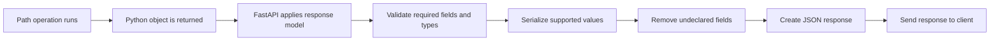
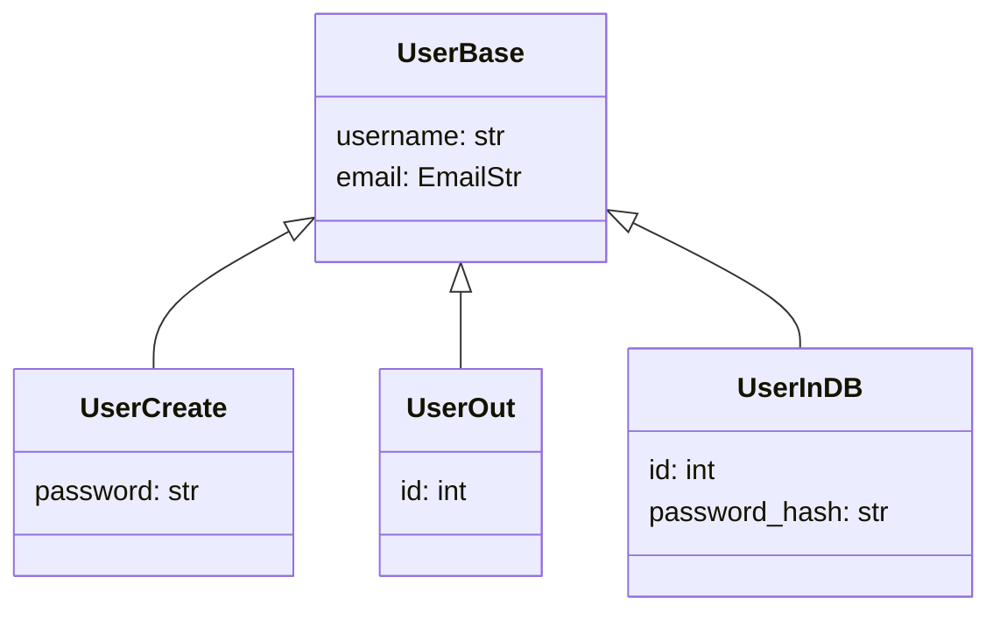
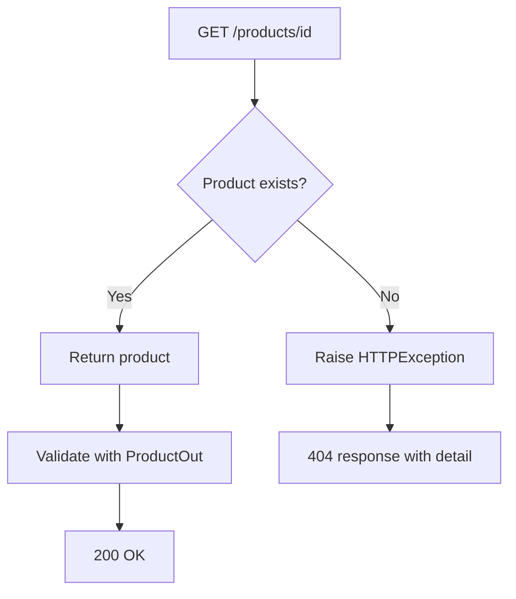
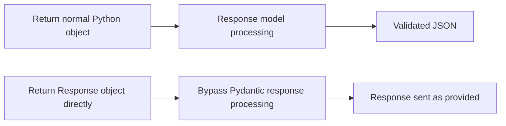

# FastAPI Response Models (`response_model`)

> A **response model** defines the public structure of data returned by a FastAPI endpoint. FastAPI uses it to validate, serialize, filter, and document the response.

---

# 1. What Is a Response Model?

A FastAPI endpoint normally performs two different data operations:

- **Request validation**: validates data coming into the API.
- **Response validation**: validates and shapes data going out of the API.

A response model describes the second operation.

```python
from fastapi import FastAPI
from pydantic import BaseModel

app = FastAPI()


class ProductOut(BaseModel):
    id: int
    name: str
    price: float


@app.get("/products/{product_id}", response_model=ProductOut)
async def get_product(product_id: int):
    return {
        "id": product_id,
        "name": "Mechanical Keyboard",
        "price": 89.99,
    }
```

Here, `ProductOut` is the public contract of the response.

The client is expected to receive:

```json
{
  "id": 1,
  "name": "Mechanical Keyboard",
  "price": 89.99
}
```

---

# 2. Why Response Models Matter

`response_model` is not only used for API documentation. It provides four important behaviors.

## 2.1 Response validation

FastAPI checks whether the returned data matches the declared model.

```python
class ProductOut(BaseModel):
    id: int
    name: str
    price: float
```

If the endpoint forgets to return `price`, the response does not satisfy the contract.

```python
@app.get("/products/{product_id}", response_model=ProductOut)
async def get_product(product_id: int):
    return {
        "id": product_id,
        "name": "Mechanical Keyboard",
        # price is missing
    }
```

This is treated as a **server-side programming error**, not as invalid client input. FastAPI normally returns a `500 Internal Server Error` instead of sending an incorrect response shape to the client.

## 2.2 Serialization

FastAPI and Pydantic convert supported Python values into JSON-compatible output.

Examples include:

- Pydantic models
- `datetime`
- `date`
- `UUID`
- enums
- nested models
- lists and dictionaries

```python
from datetime import datetime
from uuid import UUID

from pydantic import BaseModel


class OrderOut(BaseModel):
    id: UUID
    created_at: datetime
```

These Python objects are serialized into JSON strings in the final response.

## 2.3 Output filtering

Fields that are not defined in the response model are removed from the response.

```python
class UserOut(BaseModel):
    id: int
    username: str
```

```python
@app.get("/users/{user_id}", response_model=UserOut)
async def get_user(user_id: int):
    return {
        "id": user_id,
        "username": "avadh",
        "password_hash": "secret-hash",
        "internal_role": "system-admin",
    }
```

Actual response:

```json
{
  "id": 1,
  "username": "avadh"
}
```

This filtering is especially important for security.

## 2.4 OpenAPI documentation

FastAPI adds the response schema to:

- Swagger UI at `/docs`
- ReDoc at `/redoc`
- OpenAPI JSON at `/openapi.json`
- generated API clients

The response model therefore acts as a contract between backend and frontend teams.

---

# 3. How Response Processing Works



A useful mental model is:

```text
Internal application data
        ↓
Response model contract
        ↓
Validated and filtered public JSON
```

The response model is the boundary between internal data and public API data.

---

# 4. Basic `response_model` Usage

## 4.1 Using the decorator parameter

```python
from typing import Any

from fastapi import FastAPI
from pydantic import BaseModel

app = FastAPI()


class ProductOut(BaseModel):
    id: int
    name: str
    price: float


@app.get("/products/{product_id}", response_model=ProductOut)
async def get_product(product_id: int) -> Any:
    return {
        "id": product_id,
        "name": "Monitor",
        "price": 249.99,
    }
```

`response_model` is a parameter of the route decorator, such as:

- `@app.get(...)`
- `@app.post(...)`
- `@app.put(...)`
- `@app.patch(...)`
- `@app.delete(...)`

It is not a function parameter.

## 4.2 Using a return type annotation

FastAPI can also use the function return annotation as the response model.

```python
@app.get("/products/{product_id}")
async def get_product(product_id: int) -> ProductOut:
    return ProductOut(
        id=product_id,
        name="Monitor",
        price=249.99,
    )
```

This gives strong editor and type-checker support.

---

# 5. Return Type vs `response_model`

Both approaches can define the response schema, but they solve slightly different problems.

| Approach | Example | Best suited for |
|---|---|---|
| Return annotation | `def get() -> ProductOut` | Returned Python value already matches the declared type |
| Decorator parameter | `response_model=ProductOut` | Returned object has a different internal type or contains extra data |

## 5.1 Prefer a return annotation when types match

```python
@app.get("/products/{product_id}")
async def get_product(product_id: int) -> ProductOut:
    return ProductOut(
        id=product_id,
        name="Laptop Stand",
        price=39.99,
    )
```

Benefits:

- better IDE completion
- static type checking
- clearer function contract
- less duplicated type information

## 5.2 Use `response_model` when the returned value differs

A service or repository may return a dictionary, ORM entity, or internal domain object.

```python
from typing import Any


@app.get("/products/{product_id}", response_model=ProductOut)
async def get_product(product_id: int) -> Any:
    product_record = {
        "id": product_id,
        "name": "Laptop Stand",
        "price": 39.99,
        "supplier_cost": 18.00,
    }

    return product_record
```

`ProductOut` filters out `supplier_cost`.

## 5.3 Priority rule

When both are declared, `response_model` takes priority for FastAPI response processing.

```python
@app.get("/products/{product_id}", response_model=ProductOut)
async def get_product(product_id: int) -> dict[str, object]:
    return {
        "id": product_id,
        "name": "Laptop Stand",
        "price": 39.99,
    }
```

The return annotation is useful to Python tooling, while `response_model` controls FastAPI's response schema.

## 5.4 Disable response-model generation

Sometimes a return annotation contains types that FastAPI cannot convert into a Pydantic schema.

```python
from fastapi import Response
from fastapi.responses import RedirectResponse


@app.get("/portal", response_model=None)
async def get_portal(redirect: bool = False) -> Response | dict[str, str]:
    if redirect:
        return RedirectResponse("/docs")

    return {"message": "Portal is ready"}
```

Use `response_model=None` only when automatic response validation and documentation are intentionally not required.

---

# 6. Separate Input and Output Models

Using the same model for request and response can expose private or internal data.

## 6.1 Unsafe design

```python
from pydantic import BaseModel, EmailStr


class User(BaseModel):
    username: str
    email: EmailStr
    password: str
```

```python
@app.post("/users")
async def create_user(user: User) -> User:
    return user
```

This sends the password back to the client.

## 6.2 Safer design

```python
from pydantic import BaseModel, EmailStr


class UserCreate(BaseModel):
    username: str
    email: EmailStr
    password: str


class UserOut(BaseModel):
    id: int
    username: str
    email: EmailStr
```

```python
@app.post("/users", response_model=UserOut, status_code=201)
async def create_user(user: UserCreate):
    saved_user = {
        "id": 101,
        "username": user.username,
        "email": user.email,
        "password_hash": "generated-password-hash",
    }

    return saved_user
```

Response:

```json
{
  "id": 101,
  "username": "avadh",
  "email": "avadh@example.com"
}
```

## 6.3 Shared base model

Use inheritance to avoid repeating common fields.

```python
from pydantic import BaseModel, EmailStr


class UserBase(BaseModel):
    username: str
    email: EmailStr


class UserCreate(UserBase):
    password: str


class UserOut(UserBase):
    id: int


class UserInDB(UserBase):
    id: int
    password_hash: str
```



This pattern is common in production APIs:

- `UserCreate`: request payload
- `UserUpdate`: update payload
- `UserOut`: public API response
- `UserInDB`: persistence or internal representation

---

# 7. Common Response Shapes

A response model can be any type Pydantic can represent as a schema.

## 7.1 Single object

```python
@app.get("/products/{product_id}", response_model=ProductOut)
async def get_product(product_id: int):
    return {
        "id": product_id,
        "name": "Mouse",
        "price": 29.99,
    }
```

## 7.2 List of objects

```python
@app.get("/products", response_model=list[ProductOut])
async def list_products():
    return [
        {"id": 1, "name": "Mouse", "price": 29.99},
        {"id": 2, "name": "Keyboard", "price": 89.99},
    ]
```

## 7.3 Optional response

```python
@app.get("/products/{product_id}", response_model=ProductOut | None)
async def find_product(product_id: int):
    if product_id != 1:
        return None

    return {
        "id": 1,
        "name": "Mouse",
        "price": 29.99,
    }
```

This technically permits a JSON `null` response. In resource-based APIs, a `404` response is usually clearer than returning `null` for a missing resource.

## 7.4 Dictionary response

Use a typed dictionary when keys are dynamic.

```python
@app.get("/inventory", response_model=dict[str, int])
async def get_inventory():
    return {
        "mouse": 20,
        "keyboard": 12,
        "monitor": 8,
    }
```

## 7.5 Nested response models

```python
from pydantic import BaseModel, Field


class CategoryOut(BaseModel):
    id: int
    name: str


class ProductDetailOut(BaseModel):
    id: int
    name: str
    price: float
    category: CategoryOut
    tags: list[str] = Field(default_factory=list)
```

```python
@app.get("/products/{product_id}", response_model=ProductDetailOut)
async def get_product(product_id: int):
    return {
        "id": product_id,
        "name": "Mechanical Keyboard",
        "price": 89.99,
        "category": {
            "id": 5,
            "name": "Computer Accessories",
        },
        "tags": ["wireless", "mechanical"],
    }
```

## 7.6 Multiple possible success models

A union can represent more than one valid response shape.

```python
from typing import Literal

from pydantic import BaseModel


class CardPaymentOut(BaseModel):
    type: Literal["card"]
    transaction_id: str
    last_four: str


class BankTransferOut(BaseModel):
    type: Literal["bank_transfer"]
    transaction_id: str
    reference_number: str
```

```python
@app.get(
    "/payments/{payment_id}",
    response_model=CardPaymentOut | BankTransferOut,
)
async def get_payment(payment_id: int):
    if payment_id % 2 == 0:
        return {
            "type": "card",
            "transaction_id": "txn-1001",
            "last_four": "4242",
        }

    return {
        "type": "bank_transfer",
        "transaction_id": "txn-1002",
        "reference_number": "BANK-REF-9001",
    }
```

A discriminator field such as `type` makes union responses easier for Pydantic, OpenAPI, generated clients, and frontend applications to understand.

---

# 8. Response Validation and Serialization

## 8.1 FastAPI validates returned data

Consider this model:

```python
class ProductOut(BaseModel):
    id: int
    name: str
    price: float
```

This response is invalid because `price` is missing:

```python
return {
    "id": 1,
    "name": "Keyboard",
}
```

This response may be converted successfully because Pydantic can perform supported type conversion:

```python
return {
    "id": "1",
    "name": "Keyboard",
    "price": "89.99",
}
```

However, do not depend on implicit conversion as a substitute for correct application types. Services and repositories should still return predictable domain data.

## 8.2 Response validation is different from request validation

| Validation type | Who caused the invalid data? | Typical result |
|---|---|---|
| Request validation | API client | `422 Unprocessable Content` |
| Response validation | Server application code | `500 Internal Server Error` |

The distinction is important:

- A bad request is the client's responsibility.
- A bad response violates the server's own API contract.

## 8.3 Output filtering is schema-based

```python
class PublicProfile(BaseModel):
    id: int
    display_name: str
```

```python
internal_user = {
    "id": 1,
    "display_name": "Avadh",
    "email": "private@example.com",
    "access_token": "secret-token",
}
```

Using `response_model=PublicProfile` returns only:

```json
{
  "id": 1,
  "display_name": "Avadh"
}
```

This is safer than manually deleting confidential fields in every endpoint.

---

# 9. Controlling Returned Fields

FastAPI provides response-model parameters for controlling serialized fields.

## 9.1 `response_model_exclude_unset`

Returns only fields that were explicitly set in the source data.

```python
class ProductOut(BaseModel):
    id: int
    name: str
    description: str | None = None
    discount: float = 0
```

```python
@app.get(
    "/products/{product_id}",
    response_model=ProductOut,
    response_model_exclude_unset=True,
)
async def get_product(product_id: int):
    return {
        "id": product_id,
        "name": "Mouse",
    }
```

Response:

```json
{
  "id": 1,
  "name": "Mouse"
}
```

The default values were not included because they were not explicitly supplied.

## 9.2 `response_model_exclude_defaults`

Removes fields whose values equal their model defaults, even if those values were explicitly set.

```python
@app.get(
    "/products/{product_id}",
    response_model=ProductOut,
    response_model_exclude_defaults=True,
)
async def get_product(product_id: int):
    return {
        "id": product_id,
        "name": "Mouse",
        "description": None,
        "discount": 0,
    }
```

Response:

```json
{
  "id": 1,
  "name": "Mouse"
}
```

## 9.3 `response_model_exclude_none`

Removes fields whose value is `None`.

```python
@app.get(
    "/products/{product_id}",
    response_model=ProductOut,
    response_model_exclude_none=True,
)
async def get_product(product_id: int):
    return {
        "id": product_id,
        "name": "Mouse",
        "description": None,
        "discount": 10,
    }
```

Response:

```json
{
  "id": 1,
  "name": "Mouse",
  "discount": 10
}
```

## 9.4 Difference between exclusion options

| Parameter | Removes a field when... |
|---|---|
| `exclude_unset=True` | It was not explicitly provided |
| `exclude_defaults=True` | Its value equals the declared default |
| `exclude_none=True` | Its value is `None` |

Example model:

```python
class SettingsOut(BaseModel):
    theme: str = "light"
    language: str | None = None
```

Example source data:

```python
{
    "theme": "light",
    "language": None,
}
```

| Configuration | Possible output |
|---|---|
| No exclusion | `{"theme": "light", "language": null}` |
| Exclude defaults | `{}` |
| Exclude `None` | `{"theme": "light"}` |

## 9.5 `response_model_include` and `response_model_exclude`

```python
class EmployeeOut(BaseModel):
    id: int
    name: str
    department: str
    salary: float
```

```python
@app.get(
    "/employees/{employee_id}/summary",
    response_model=EmployeeOut,
    response_model_include={"id", "name", "department"},
)
async def get_employee_summary(employee_id: int):
    return {
        "id": employee_id,
        "name": "Ravi",
        "department": "Engineering",
        "salary": 95000,
    }
```

These parameters are convenient for small, temporary variations. For stable public APIs, prefer a dedicated response model:

```python
class EmployeeSummaryOut(BaseModel):
    id: int
    name: str
    department: str
```

Why dedicated models are better:

- the OpenAPI schema accurately matches the actual response
- generated clients receive the correct type
- the endpoint contract is easier to understand
- future field changes are safer

---

# 10. Database and ORM Objects

Repository layers often return ORM objects rather than dictionaries.

With Pydantic v2, configure the response model to read values from object attributes.

```python
from pydantic import BaseModel, ConfigDict


class ProductOut(BaseModel):
    model_config = ConfigDict(from_attributes=True)

    id: int
    name: str
    price: float
```

Example ORM-like class:

```python
class ProductRecord:
    def __init__(self, product_id: int, name: str, price: float):
        self.id = product_id
        self.name = name
        self.price = price
        self.internal_supplier_id = 900
```

```python
@app.get("/products/{product_id}", response_model=ProductOut)
async def get_product(product_id: int):
    return ProductRecord(
        product_id=product_id,
        name="Monitor",
        price=249.99,
    )
```

Response:

```json
{
  "id": 1,
  "name": "Monitor",
  "price": 249.99
}
```

`internal_supplier_id` is not part of `ProductOut`, so it is not exposed.

## 10.1 Architecture example


The ORM entity represents persistence data. The response model represents public API data. They should not automatically be treated as the same model.

## 10.2 Lazy-loaded relationships

Be careful when a response model accesses nested ORM relationships.

```python
class OrderOut(BaseModel):
    model_config = ConfigDict(from_attributes=True)

    id: int
    customer: CustomerOut
    items: list[OrderItemOut]
```

Serializing `customer` or `items` may trigger lazy database queries. In async applications, it may also fail when data is accessed outside the expected session context.

Load the relationships intentionally in the repository layer before returning the object.

---

# 11. Status Codes and Error Responses

## 11.1 Success model with status code

```python
from fastapi import status


@app.post(
    "/products",
    response_model=ProductOut,
    status_code=status.HTTP_201_CREATED,
)
async def create_product(product: ProductCreate):
    return {
        "id": 101,
        **product.model_dump(),
    }
```

The response model controls the body, while `status_code` controls the HTTP status.

## 11.2 Documenting additional responses

```python
from fastapi import FastAPI, HTTPException
from pydantic import BaseModel

app = FastAPI()


class ProductOut(BaseModel):
    id: int
    name: str
    price: float


class ErrorResponse(BaseModel):
    detail: str
```

```python
@app.get(
    "/products/{product_id}",
    response_model=ProductOut,
    responses={
        404: {
            "model": ErrorResponse,
            "description": "Product was not found",
        }
    },
)
async def get_product(product_id: int):
    if product_id != 1:
        raise HTTPException(
            status_code=404,
            detail="Product not found",
        )

    return {
        "id": 1,
        "name": "Mouse",
        "price": 29.99,
    }
```

The OpenAPI documentation now describes both:

- `200` with `ProductOut`
- `404` with `ErrorResponse`

Important: the `responses` mapping primarily documents additional responses. It does not apply the main `response_model` validation pipeline to every manually returned error response. Make sure the runtime error body matches the documented schema.

## 11.3 Response flow with multiple status codes



---

# 12. Returning `Response` Directly

FastAPI supports direct response classes such as:

- `JSONResponse`
- `FileResponse`
- `StreamingResponse`
- `RedirectResponse`
- `HTMLResponse`
- plain `Response`

```python
from fastapi.responses import JSONResponse


@app.get("/health")
async def health_check():
    return JSONResponse(
        status_code=200,
        content={"status": "healthy"},
    )
```

When a `Response` object is returned directly, FastAPI passes it through without normal Pydantic response conversion and validation.



## 12.1 Why this matters

This code can accidentally bypass filtering:

```python
@app.get("/users/{user_id}", response_model=UserOut)
async def get_user(user_id: int):
    return JSONResponse(
        content={
            "id": user_id,
            "username": "avadh",
            "password_hash": "secret-hash",
        }
    )
```

Because `JSONResponse` is returned directly, do not assume `UserOut` will remove `password_hash`.

## 12.2 When direct responses are appropriate

Use direct responses when you need:

- file downloads
- streaming data
- redirects
- HTML or XML output
- custom media types
- low-level control over headers or status codes

For ordinary JSON APIs, return a Python object or Pydantic model and let FastAPI apply the response model.

---

# 13. Reusable Response Envelopes

Many APIs use a consistent wrapper around returned data.

## 13.1 Generic success envelope

```python
from typing import Generic, TypeVar

from pydantic import BaseModel

DataT = TypeVar("DataT")


class ApiResponse(BaseModel, Generic[DataT]):
    success: bool = True
    message: str
    data: DataT
```

```python
@app.get(
    "/products/{product_id}",
    response_model=ApiResponse[ProductOut],
)
async def get_product(product_id: int):
    return {
        "success": True,
        "message": "Product fetched successfully",
        "data": {
            "id": product_id,
            "name": "Monitor",
            "price": 249.99,
        },
    }
```

Response:

```json
{
  "success": true,
  "message": "Product fetched successfully",
  "data": {
    "id": 1,
    "name": "Monitor",
    "price": 249.99
  }
}
```

## 13.2 Paginated response model

```python
class ProductPageOut(BaseModel):
    items: list[ProductOut]
    total: int
    page: int
    page_size: int
    total_pages: int
```

```python
@app.get("/products", response_model=ProductPageOut)
async def list_products(page: int = 1, page_size: int = 20):
    return {
        "items": [
            {"id": 1, "name": "Mouse", "price": 29.99},
            {"id": 2, "name": "Keyboard", "price": 89.99},
        ],
        "total": 42,
        "page": page,
        "page_size": page_size,
        "total_pages": 3,
    }
```

The response model ensures every paginated endpoint has a stable and documented structure.

---

# 14. Testing Response Models

Response models should be tested as public API contracts.

```python
from fastapi.testclient import TestClient

client = TestClient(app)
```

## 14.1 Test the response shape

```python
def test_get_product_response_shape():
    response = client.get("/products/1")

    assert response.status_code == 200
    assert response.json() == {
        "id": 1,
        "name": "Mouse",
        "price": 29.99,
    }
```

## 14.2 Test that private fields are filtered

```python
def test_user_response_does_not_expose_private_data():
    response = client.get("/users/1")
    body = response.json()

    assert response.status_code == 200
    assert "password" not in body
    assert "password_hash" not in body
    assert "access_token" not in body
```

## 14.3 Validate the response using the model

```python
def test_product_response_matches_schema():
    response = client.get("/products/1")

    product = ProductOut.model_validate(response.json())

    assert product.id == 1
    assert product.price == 29.99
```

## 14.4 Test OpenAPI when contract stability matters

For larger systems, generated OpenAPI schemas can be stored and compared in CI to detect accidental breaking changes.

Examples of contract-breaking changes:

- removing a response field
- changing a field from optional to required
- changing a field type
- changing a nested model
- changing a documented status code

---

# 15. Production Best Practices

## 15.1 Treat response models as public contracts

Once clients depend on a response shape, changing it can become a breaking API change.

Use versioning or backward-compatible evolution for significant changes.

## 15.2 Use dedicated output models

Prefer:

```python
class UserOut(BaseModel):
    id: int
    username: str
    email: str
```

Instead of exposing database or request models directly.

## 15.3 Never depend only on manual field removal

Avoid patterns such as:

```python
user_data.pop("password_hash")
return user_data
```

A future field may be added and accidentally exposed. A strict output model is safer.

## 15.4 Keep endpoint responses predictable

Avoid returning unrelated shapes from the same successful endpoint.

Less predictable:

```python
return product
```

or:

```python
return {"message": "No product"}
```

Better:

- return `ProductOut` for success
- return a documented `404` error for missing data

## 15.5 Use unions only for real polymorphism

A union is appropriate when multiple response types are part of the intentional API design.

For simple success and error handling, prefer status-specific response documentation rather than a broad union containing success and error models.

## 15.6 Avoid direct `JSONResponse` for ordinary JSON data

Direct response objects bypass normal response-model behavior. Return dictionaries, Pydantic models, or ORM objects for standard JSON endpoints.

## 15.7 Load ORM relationships intentionally

Nested response serialization can access related attributes. Prevent unexpected query growth by loading required relationships before returning the entity.

## 15.8 Keep schemas meaningful

Use business-oriented names:

- `ProductCreate`
- `ProductUpdate`
- `ProductSummaryOut`
- `ProductDetailOut`
- `ProductPageOut`

Avoid unclear names such as:

- `ProductModel2`
- `ProductResponseNew`
- `ProductDataFinal`

## 15.9 Use constrained field types

```python
from pydantic import BaseModel, Field


class ProductOut(BaseModel):
    id: int = Field(gt=0)
    name: str = Field(min_length=1, max_length=200)
    price: float = Field(ge=0)
```

The response contract becomes more precise and better documented.

## 15.10 Monitor response-validation failures

A response-validation failure usually indicates one of these problems:

- repository data does not match expectations
- a field was renamed but the response model was not updated
- an optional database value was declared as required
- a nested relationship was not loaded
- a service returned the wrong object

Log and alert on repeated `500` errors instead of hiding the mismatch.

---

# 16. Quick Reference

## 16.1 Basic single response

```python
@app.get("/products/{product_id}", response_model=ProductOut)
async def get_product(product_id: int):
    return product
```

## 16.2 List response

```python
@app.get("/products", response_model=list[ProductOut])
async def list_products():
    return products
```

## 16.3 Return annotation

```python
@app.get("/products/{product_id}")
async def get_product(product_id: int) -> ProductOut:
    return product
```

## 16.4 Exclude unset fields

```python
@app.get(
    "/products/{product_id}",
    response_model=ProductOut,
    response_model_exclude_unset=True,
)
async def get_product(product_id: int):
    return product
```

## 16.5 Exclude `None`

```python
@app.get(
    "/products/{product_id}",
    response_model=ProductOut,
    response_model_exclude_none=True,
)
async def get_product(product_id: int):
    return product
```

## 16.6 ORM response model

```python
class ProductOut(BaseModel):
    model_config = ConfigDict(from_attributes=True)

    id: int
    name: str
```

## 16.7 Additional response documentation

```python
@app.get(
    "/products/{product_id}",
    response_model=ProductOut,
    responses={404: {"model": ErrorResponse}},
)
async def get_product(product_id: int):
    ...
```

## 16.8 Main parameter summary

| Parameter | Purpose |
|---|---|
| `response_model` | Declares the response schema |
| `status_code` | Declares the primary HTTP status code |
| `responses` | Documents additional status codes and response content |
| `response_model_exclude_unset` | Removes fields that were not explicitly set |
| `response_model_exclude_defaults` | Removes fields equal to model defaults |
| `response_model_exclude_none` | Removes fields with `None` values |
| `response_model_include` | Includes only selected response fields |
| `response_model_exclude` | Excludes selected response fields |
| `response_model=None` | Disables automatic response-model generation |

---

# 17. Final Understanding

A FastAPI response model is the API's **outgoing data contract**.

```text
Request model
    Controls what the client may send

Service and database models
    Represent internal application data

Response model
    Controls what the client may receive
```

The most important practical points are:

1. Use response models to validate and document returned data.
2. Use separate input and output models for sensitive resources.
3. Let response models remove internal fields automatically.
4. Prefer return annotations when the returned value matches the output type.
5. Use `response_model` when the internal return type differs from the public schema.
6. Use dedicated models instead of frequent `include` and `exclude` shortcuts.
7. Remember that returning a `Response` directly bypasses normal Pydantic response processing.
8. Treat response-validation errors as application bugs.
9. Test both the response shape and the absence of confidential fields.
10. Design response models as stable contracts for frontend and external clients.

---

## Official References

- [FastAPI: Response Model — Return Type](https://fastapi.tiangolo.com/tutorial/response-model/)
- [FastAPI: Extra Models](https://fastapi.tiangolo.com/tutorial/extra-models/)
- [FastAPI: Response Status Code](https://fastapi.tiangolo.com/tutorial/response-status-code/)
- [FastAPI: Additional Responses in OpenAPI](https://fastapi.tiangolo.com/advanced/additional-responses/)
- [FastAPI: Return a Response Directly](https://fastapi.tiangolo.com/advanced/response-directly/)
- [Pydantic: Models](https://docs.pydantic.dev/latest/concepts/models/)
- [Pydantic: Configuration](https://docs.pydantic.dev/latest/api/config/)
