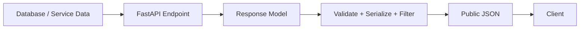
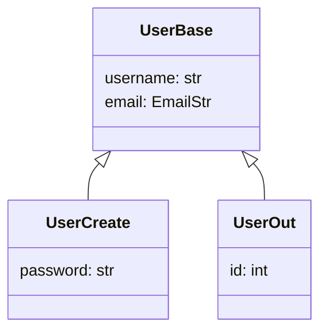
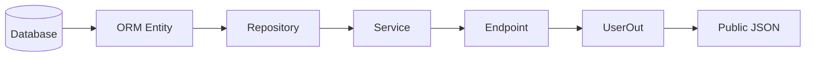
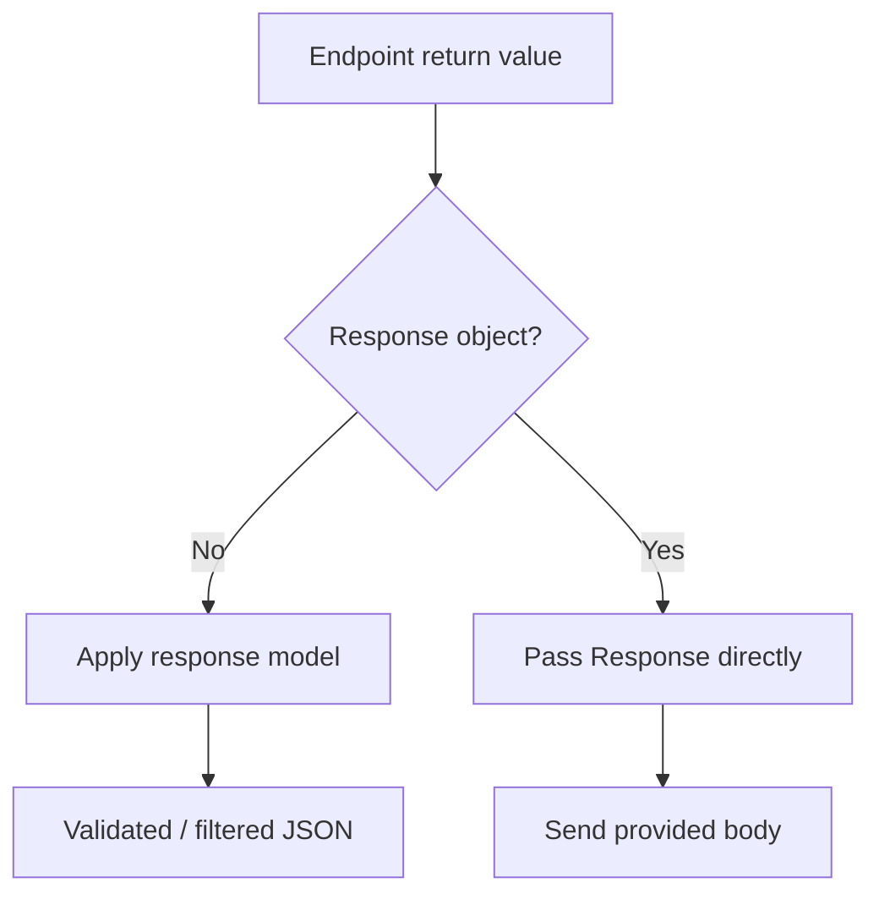
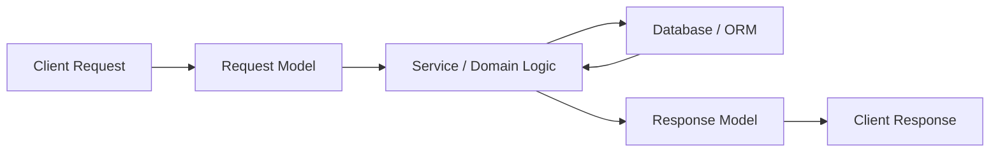

# FastAPI Response Models (`response_model`)

> A **response model** defines the public structure of data returned by a FastAPI endpoint. It acts as the API's outgoing contract: FastAPI can validate the returned data, convert it to JSON-compatible output, filter fields, and document the response schema in OpenAPI.

## In Short

- Use `response_model=` when you want FastAPI to control the public response shape.
- A return-type annotation can also define the response schema when your Python return type naturally matches it.
- If both are declared, `response_model` controls FastAPI's response processing.
- Extra fields returned by your service or ORM object are not included when they are outside the declared response schema.
- Request and response models should normally be separate, especially for sensitive fields such as passwords.
- Pydantic v2 can read ORM/object attributes with `ConfigDict(from_attributes=True)`.
- Returning a `Response` subclass such as `JSONResponse` directly bypasses normal Pydantic response-model processing.



A useful mental model is:

> **Request models control what clients may send. Response models control what clients are allowed to receive.**

---

# 1. Why Response Models Matter

Suppose an application stores more user information than the frontend should receive.

```python
from fastapi import FastAPI
from pydantic import BaseModel, ConfigDict, EmailStr

app = FastAPI()


class UserOut(BaseModel):
    model_config = ConfigDict(from_attributes=True)

    id: int
    username: str
    email: EmailStr
```

The service layer may return:

```python
user_data = {
    "id": 101,
    "username": "avadh",
    "email": "avadh@example.com",
    "password_hash": "internal-secret",
    "internal_role": "admin",
}
```

With a response model:

```python
@app.get("/users/{user_id}", response_model=UserOut)
async def get_user(user_id: int):
    return user_data
```

the client receives only:

```json
{
  "id": 101,
  "username": "avadh",
  "email": "avadh@example.com"
}
```

`password_hash` and `internal_role` are outside `UserOut`, so they are not part of the public response.

This gives four practical benefits:

### 1.1 Response validation

FastAPI checks that the returned data satisfies the declared response contract.

If `email` is required but missing or invalid, the server has produced data that does not match its own API contract. That is treated as a server-side error rather than bad client input.

### 1.2 Serialization

Python and Pydantic values are converted into JSON-compatible output.

Common examples include:

- `datetime`
- `date`
- `UUID`
- enums
- nested Pydantic models
- lists and dictionaries

### 1.3 Output filtering

Fields that are not part of the declared output schema are excluded from the normal response-model result.

This is an important API safety boundary because internal fields do not have to be manually removed in every endpoint.

### 1.4 OpenAPI documentation

The response schema is added to FastAPI's OpenAPI definition and appears in Swagger UI and ReDoc.

That makes the response model useful for:

- frontend/backend contracts
- generated API clients
- API documentation
- contract testing

---

# 2. `response_model` vs Return-Type Annotation

FastAPI supports both styles.

## 2.1 Return-type annotation

Use a return type when the Python value naturally matches the public model.

```python
@app.get("/users/{user_id}")
async def get_user(user_id: int) -> UserOut:
    return UserOut(
        id=user_id,
        username="avadh",
        email="avadh@example.com",
    )
```

This gives good editor support and static type checking.

## 2.2 `response_model`

Use `response_model` when your endpoint returns a dictionary, ORM entity, domain object, or another internal type.

```python
from typing import Any


@app.get("/users/{user_id}", response_model=UserOut)
async def get_user(user_id: int) -> Any:
    return {
        "id": user_id,
        "username": "avadh",
        "email": "avadh@example.com",
        "password_hash": "internal-secret",
    }
```

FastAPI uses `UserOut` as the public response contract.

## 2.3 When both are present

```python
@app.get("/users/{user_id}", response_model=UserOut)
async def get_user(user_id: int) -> dict[str, object]:
    return {
        "id": user_id,
        "username": "avadh",
        "email": "avadh@example.com",
    }
```

Here:

- `dict[str, object]` is useful to Python tooling.
- `response_model=UserOut` controls FastAPI's response validation, filtering, schema generation, and documentation.

---

# 3. Separate Request and Response Models

Do not normally use one model for both input and output when the fields have different exposure rules.

```python
from pydantic import BaseModel, EmailStr


class UserBase(BaseModel):
    username: str
    email: EmailStr


class UserCreate(UserBase):
    password: str


class UserOut(UserBase):
    id: int
```

Endpoint:

```python
@app.post("/users", response_model=UserOut, status_code=201)
async def create_user(user: UserCreate):
    return {
        "id": 101,
        "username": user.username,
        "email": user.email,
        "password_hash": "generated-hash",
    }
```

The request may contain `password`, while the response contract never exposes it.



A common production naming pattern is:

- `UserCreate` — create request
- `UserUpdate` — update request
- `UserOut` — public response
- `UserDetailOut` — detailed response
- `UserInDB` or ORM entity — internal persistence representation

---

# 4. Common Response Shapes

Response models are not limited to one object.

## 4.1 Single object

```python
@app.get("/users/{user_id}", response_model=UserOut)
async def get_user(user_id: int):
    ...
```

## 4.2 List

```python
@app.get("/users", response_model=list[UserOut])
async def list_users():
    ...
```

## 4.3 Optional result

```python
@app.get("/users/{user_id}", response_model=UserOut | None)
async def find_user(user_id: int):
    ...
```

This allows a JSON `null` result.

For normal resource APIs, a `404 Not Found` response is usually clearer than returning `null` when the resource does not exist.

## 4.4 Nested models

```python
class TeamOut(BaseModel):
    id: int
    name: str


class UserDetailOut(UserOut):
    team: TeamOut
    skills: list[str]
```

FastAPI applies the response schema recursively to nested data.

## 4.5 Union responses

When one success endpoint intentionally returns multiple valid shapes, a union can represent them.

```python
response_model=AdminUserOut | CustomerUserOut
```

For polymorphic APIs, a discriminator field such as `type` makes the shapes easier for Pydantic, OpenAPI, generated clients, and frontend code to understand.

---

# 5. Response Validation vs Request Validation

These two failures mean different things.

| Validation | Invalid data came from | Typical HTTP result |
|---|---|---|
| Request validation | Client | `422` |
| Response validation | Server/application code | `500` |

Example response model:

```python
class UserOut(BaseModel):
    id: int
    username: str
    email: EmailStr
```

Invalid response:

```python
return {
    "id": 101,
    "username": "avadh",
    # email missing
}
```

The endpoint has violated its own declared contract.

Pydantic may also perform supported type coercion. For example, a value such as `"101"` may become integer `101` where conversion is valid.

Do not depend on coercion as a replacement for correct service-layer types. Your application should still return predictable data.

---

# 6. Controlling Which Fields Are Returned

FastAPI exposes useful response-model serialization options.

Assume:

```python
class UserProfileOut(BaseModel):
    username: str
    bio: str | None = None
    theme: str = "light"
```

## 6.1 `response_model_exclude_unset=True`

Removes fields that were not explicitly supplied.

```python
@app.get(
    "/profile",
    response_model=UserProfileOut,
    response_model_exclude_unset=True,
)
async def get_profile():
    return {"username": "avadh"}
```

Possible response:

```json
{
  "username": "avadh"
}
```

## 6.2 `response_model_exclude_defaults=True`

Removes fields whose value equals the model's default.

## 6.3 `response_model_exclude_none=True`

Removes fields whose value is `None`.

## 6.4 Quick difference

| Option | Field is removed when... |
|---|---|
| `exclude_unset` | It was not explicitly set |
| `exclude_defaults` | Its value equals the declared default |
| `exclude_none` | Its value is `None` |

FastAPI also supports `response_model_include` and `response_model_exclude`.

They are useful for small variations, but for stable public APIs prefer a dedicated response model because the model name and OpenAPI contract remain clearer.

---

# 7. ORM and Database Objects

Repository layers often return ORM objects instead of dictionaries.

With Pydantic v2, use `from_attributes=True` when the model should read fields from object attributes.

```python
from pydantic import BaseModel, ConfigDict, EmailStr


class UserOut(BaseModel):
    model_config = ConfigDict(from_attributes=True)

    id: int
    username: str
    email: EmailStr
```

Then an endpoint can return an ORM-style object:

```python
@app.get("/users/{user_id}", response_model=UserOut)
async def get_user(user_id: int):
    return await user_repository.get(user_id)
```

Conceptually:



## Nested ORM relationships

If `UserOut` contains related objects such as `team`, `roles`, or `orders`, serialization may access those attributes.

With lazy-loaded ORM relationships this can cause:

- extra database queries
- N+1 query problems
- async session/lazy-loading errors

Load relationships intentionally in the repository or query layer before returning the entity.

---

# 8. Status Codes and Additional Responses

The response model controls the response body. `status_code` controls the main HTTP status.

```python
@app.post(
    "/users",
    response_model=UserOut,
    status_code=201,
)
async def create_user(user: UserCreate):
    ...
```

For additional documented responses:

```python
class ErrorOut(BaseModel):
    detail: str


@app.get(
    "/users/{user_id}",
    response_model=UserOut,
    responses={
        404: {
            "model": ErrorOut,
            "description": "User not found",
        }
    },
)
async def get_user(user_id: int):
    ...
```

The `responses` mapping is mainly used to describe additional OpenAPI responses.

Do not assume that declaring a model inside `responses` automatically applies the main `response_model` validation pipeline to every manually created error response. Your runtime error body must still match the contract you document.

---

# 9. Direct `Response` Objects Bypass the Normal Model Pipeline

FastAPI can return response classes directly:

- `JSONResponse`
- `FileResponse`
- `StreamingResponse`
- `RedirectResponse`
- `HTMLResponse`
- `Response`

Example:

```python
from fastapi.responses import JSONResponse


@app.get("/health")
async def health():
    return JSONResponse(
        status_code=200,
        content={"status": "healthy"},
    )
```

When a `Response` object is returned directly, FastAPI passes it through instead of performing the normal Pydantic response-model conversion.

That matters here:

```python
@app.get("/users/{user_id}", response_model=UserOut)
async def get_user(user_id: int):
    return JSONResponse(
        content={
            "id": user_id,
            "username": "avadh",
            "email": "avadh@example.com",
            "password_hash": "secret",
        }
    )
```

Do **not** expect `UserOut` to remove `password_hash` in this case.



Use direct responses when you actually need low-level response control, such as:

- file downloads
- streaming
- redirects
- HTML/XML
- custom media types
- special headers/body handling

For normal JSON APIs, returning Python/Pydantic/ORM data with a response model is usually cleaner.

---

# 10. Production Best Practices

### Use response models as public API contracts

A response field can become a dependency for frontend applications, mobile apps, integrations, and generated clients.

Changing its type, required/optional state, or nested structure can be a breaking API change.

### Prefer dedicated output models

Use business-oriented names such as:

```text
UserCreate
UserUpdate
UserOut
UserDetailOut
UserPageOut
```

Avoid exposing database entities directly as your documented API contract.

### Do not rely on manual secret-field removal

This is fragile:

```python
user_data.pop("password_hash")
return user_data
```

A new internal field can later be added and accidentally exposed.

A dedicated output model makes the allowed response fields explicit.

### Keep success responses predictable

Prefer:

```text
200 -> UserOut
404 -> documented error
```

instead of returning unrelated success shapes depending on internal conditions.

### Use unions only for intentional polymorphism

A union is useful when several success shapes are genuinely part of the API design.

Do not use a broad union simply to mix normal success and error handling.

### Watch ORM relationship loading

Nested response models can access related ORM attributes. Fetch required relationships intentionally to avoid hidden query growth.

### Test the public response contract

At minimum, test:

```python
def test_user_response_does_not_expose_private_fields():
    response = client.get("/users/101")

    assert response.status_code == 200
    assert "password" not in response.json()
    assert "password_hash" not in response.json()
```

For larger APIs, OpenAPI schema snapshots or contract tests can detect accidental breaking changes.

---

# 11. Quick Reference

| Feature | Purpose |
|---|---|
| `response_model=Model` | Declares the public response schema |
| Return annotation | Can define the response type when Python return data matches |
| `status_code` | Sets the primary HTTP status |
| `responses` | Documents additional status codes/content |
| `response_model_exclude_unset` | Omits fields not explicitly set |
| `response_model_exclude_defaults` | Omits fields equal to defaults |
| `response_model_exclude_none` | Omits fields whose value is `None` |
| `response_model_include` | Includes selected fields |
| `response_model_exclude` | Excludes selected fields |
| `response_model=None` | Disables automatic response-model generation |
| `ConfigDict(from_attributes=True)` | Reads model data from object/ORM attributes |
| Direct `Response` return | Bypasses normal Pydantic response-model processing |

---

## Final Mental Model



Keep the layers separate:

- **Request model** — what the client may send.
- **Service/ORM model** — what the application uses internally.
- **Response model** — what the client may receive.

For most production FastAPI endpoints, that separation gives clearer contracts, safer field exposure, better OpenAPI documentation, and easier long-term API maintenance.
