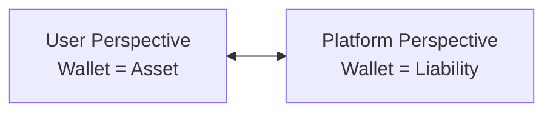
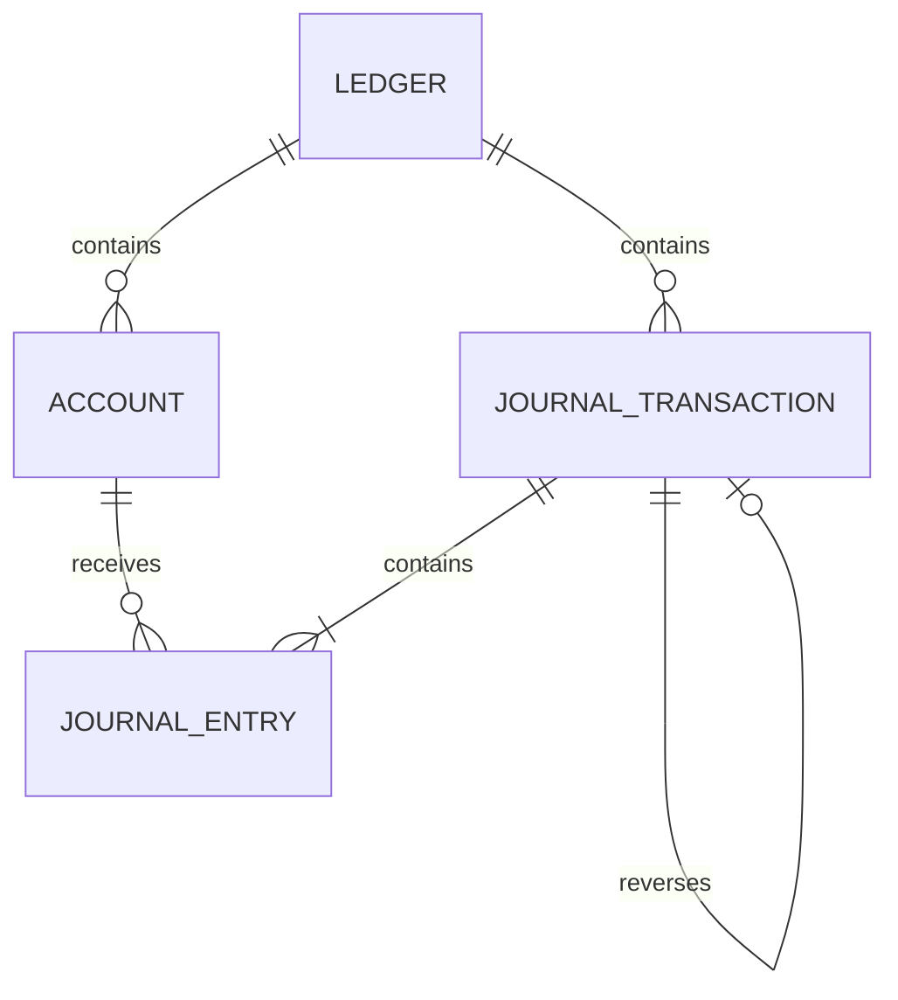
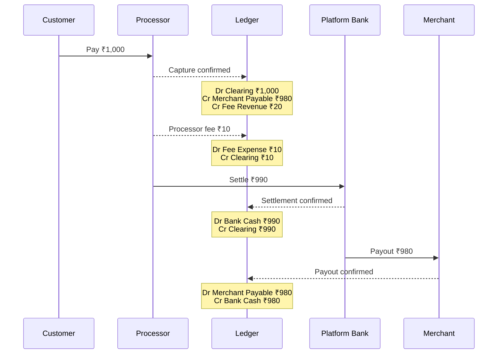
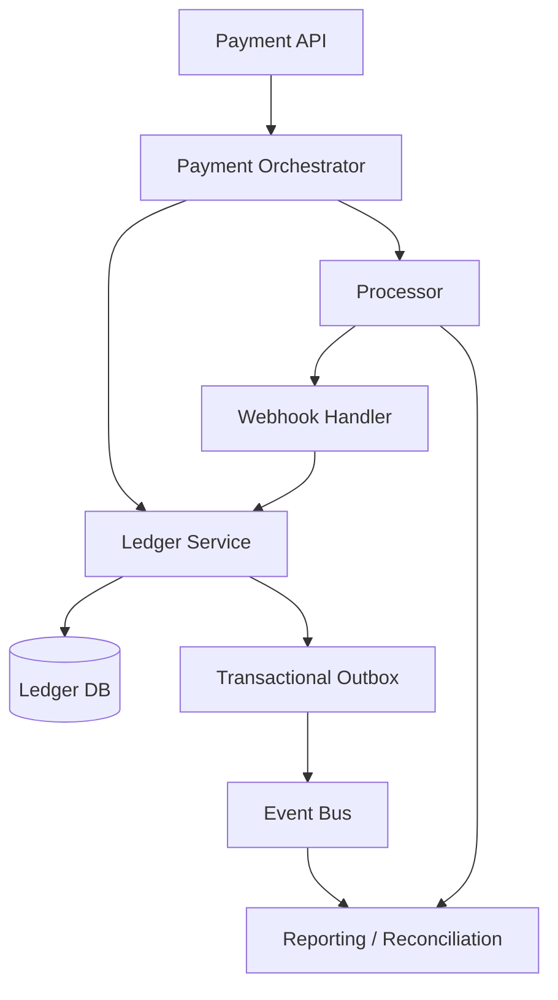

# Double-Entry Ledger in Payments & Fintech

> A concise, developer-focused guide to understanding how reliable payment systems record money movement.

## In short

A **double-entry ledger** records every financial event using two or more entries so that:

```text
Total Debits = Total Credits
```

The ledger is the **financial source of truth**. A `balance` column may be cached for performance, but the balance must always be explainable from ledger entries.

For payment systems, the most important ideas are:

- Every posted transaction must balance.
- Debit and credit meaning depends on the account type.
- A user's wallet balance is usually a **liability** from the platform's perspective.
- Posting must be **atomic** and **idempotent**.
- Concurrent balance-changing operations need strong consistency.
- Posted financial history should be immutable.
- Corrections are recorded using reversals or compensating entries.
- Internal balance is not enough; the ledger must be reconciled with processors and banks.


---

# Index

1. [Core Concept](#1-core-concept)
2. [Accounts, Debits, and Credits](#2-accounts-debits-and-credits)
3. [Core Ledger Data Model](#3-core-ledger-data-model)
4. [End-to-End Marketplace Payment Example](#4-end-to-end-marketplace-payment-example)
5. [Posting Transactions Safely](#5-posting-transactions-safely)
6. [Idempotency and Concurrency](#6-idempotency-and-concurrency)
7. [Posted, Pending, and Available Balance](#7-posted-pending-and-available-balance)
8. [Reversals, Refunds, and Immutability](#8-reversals-refunds-and-immutability)
9. [Reconciliation](#9-reconciliation)
10. [Multi-Currency and Ledger Architecture](#10-multi-currency-and-ledger-architecture)
11. [Interview-Relevant Recap](#11-interview-relevant-recap)

---

# 1. Core Concept

## 1.1 What Is a Ledger?

A **ledger** is the system of record that explains:

- what money moved,
- which accounts changed,
- why they changed,
- when the change became effective,
- and how the current balance was produced.

A normal payment record may tell you that a payment succeeded. A ledger explains the financial effect of that payment.

For example, instead of storing only:

```text
merchant_balance = ₹980
```

the ledger stores the entries that produced that balance.

## 1.2 Why Double Entry?

Every financial transaction affects at least two accounts.

If a payment platform receives money and also owes that money to a merchant, both positions must be recorded.

The core invariant is:

```text
Total debit amount = Total credit amount
```

Because each transaction balances, the platform can prove where value came from and where it went.

## 1.3 Ledger vs Balance Column

A balance answers:

> How much is available now?

A ledger answers:

> Why is that the balance?

That distinction is important in real payment systems because payments can be retried, refunded, disputed, settled later, split across parties, and reconciled against external systems.

A production design commonly uses:

```text
Immutable journal entries
        +
Atomically maintained balance snapshot
```

The journal entries remain the source of truth. The balance snapshot is an optimization for fast reads and authorization.

---

# 2. Accounts, Debits, and Credits

## 2.1 Main Account Types

| Account Type | Increased By | Decreased By | Fintech Example |
|---|---|---|---|
| Asset | Debit | Credit | Bank cash, processor clearing, receivable |
| Liability | Credit | Debit | User wallet, merchant payable |
| Revenue | Credit | Debit | Platform fee revenue |
| Expense | Debit | Credit | Processor fee expense |
| Equity | Credit | Debit | Retained earnings |

The words **debit** and **credit** do not directly mean "money out" and "money in". Their effect depends on the account type.

## 2.2 Platform Perspective Matters

Suppose a user sees:

```text
Wallet balance = ₹1,000
```

To the user, that amount feels like an asset.

To the payment platform, it is usually a **liability**, because the platform owes ₹1,000 to the user.



This perspective is one of the most important ideas to understand when designing wallet, marketplace, or payout systems.

## 2.3 Accounting Equation

The traditional accounting equation is:

```text
Assets = Liabilities + Equity
```

Revenue increases equity over time, while expenses reduce it.

Correct double-entry posting preserves this relationship.

---

# 3. Core Ledger Data Model

A practical ledger usually contains four main concepts.

## 3.1 Ledger

A **ledger** defines an accounting boundary.

Examples include:

- one ledger per legal entity,
- one ledger per regulated country,
- separate production and sandbox ledgers.

Accounts from unrelated ledger boundaries should not be mixed silently in one transaction.

## 3.2 Account

An account represents one financial position.

Typical payment-platform accounts include:

```text
Bank Cash
Processor Clearing
Merchant Payable
User Wallet Liability
Platform Fee Revenue
Processor Fee Expense
Refund Payable
Reserve Liability
```

A useful account record usually contains:

```text
account_id
ledger_id
account_code
account_type
currency
owner_type
owner_id
status
```

For customer or merchant balances, separate owner-level accounts are easier to audit and safer for concurrency than one shared generic balance.

## 3.3 Journal Transaction

A **journal transaction** represents one atomic business event, such as:

- payment captured,
- payout completed,
- refund created,
- processing fee charged.

It contains two or more journal entries.

Useful fields include:

```text
id
ledger_id
idempotency_key
event_type
status
external_reference
effective_at
created_at
reversal_of
metadata
```

## 3.4 Journal Entry

A **journal entry** applies one debit or credit to one account.

Useful fields include:

```text
transaction_id
account_id
direction
amount_minor
currency
entry_type
sequence_no
```

Store monetary amounts as **integers in the smallest supported currency unit**, not floating-point values.

For example:

```text
₹250.00 -> 25000 paise
$10.50   -> 1050 cents
```

Do not assume every currency has two decimal places.

## 3.5 Relationship



---

# 4. End-to-End Marketplace Payment Example

Assume:

```text
Customer pays      = ₹1,000
Platform fee       = ₹20
Merchant receives  = ₹980
Processor fee      = ₹10
Processor settles  = ₹990
```

This single example shows how business events become ledger movements.

## 4.1 Payment Captured

When the processor confirms a ₹1,000 capture:

| Account | Debit | Credit |
|---|---:|---:|
| Processor clearing asset | ₹1,000 | — |
| Merchant payable | — | ₹980 |
| Platform fee revenue | — | ₹20 |
| **Total** | **₹1,000** | **₹1,000** |

Meaning:

- the processor owes the platform ₹1,000,
- the platform owes the merchant ₹980,
- the platform earned ₹20.

## 4.2 Processor Fee Recorded

The processor charges ₹10:

| Account | Debit | Credit |
|---|---:|---:|
| Processor fee expense | ₹10 | — |
| Processor clearing asset | — | ₹10 |
| **Total** | **₹10** | **₹10** |

The expected processor settlement is now ₹990.

## 4.3 Processor Settlement Received

When ₹990 reaches the platform bank:

| Account | Debit | Credit |
|---|---:|---:|
| Bank cash | ₹990 | — |
| Processor clearing asset | — | ₹990 |
| **Total** | **₹990** | **₹990** |

The clearing balance for this payment is now fully settled.

## 4.4 Merchant Payout

When ₹980 is sent to the merchant:

| Account | Debit | Credit |
|---|---:|---:|
| Merchant payable | ₹980 | — |
| Bank cash | — | ₹980 |
| **Total** | **₹980** | **₹980** |

Final result:

```text
Platform revenue       = ₹20
Processor fee expense  = ₹10
Net contribution       = ₹10
```

## 4.5 Complete Flow



The key point is that the ledger records the **economic meaning** of each stage instead of copying processor objects directly.

---

# 5. Posting Transactions Safely

A financial transaction should be posted as one atomic database operation.

## 5.1 Required Validation

Before posting:

```text
At least two entries exist
At least one debit exists
At least one credit exists
Every amount is positive
Debit total equals credit total
Accounts exist and are active
Accounts belong to the correct ledger
Currency rules are valid
Idempotency key is valid
Balance or overdraft rules pass
```

## 5.2 Atomic Posting Flow

```text
BEGIN

1. Check idempotency key
2. Load and lock required accounts/balances
3. Validate ledger and currency
4. Validate spendable balance
5. Validate debits = credits
6. Insert journal transaction
7. Insert all journal entries
8. Update cached balances if used
9. Insert outbox event if required
10. Mark transaction posted

COMMIT
```

If any step fails, the complete operation should roll back.

## 5.3 Database-Level Protection

Application validation alone is not enough for financial integrity.

Useful protections include:

- database transactions,
- unique constraints,
- foreign keys,
- database permissions,
- stored procedures or controlled posting functions,
- deferred constraint triggers where appropriate.

A normal row-level SQL `CHECK` constraint cannot easily prove that the debit and credit totals across several entry rows are balanced. That rule normally needs transaction-level posting logic.

---

# 6. Idempotency and Concurrency

These are not optional details in payment systems. They are part of correctness.

## 6.1 Idempotency

Distributed systems often deliver operations **at least once**.

A request can succeed, but its response may be lost:

```text
Client sends payment command
        ↓
Server posts ledger transaction
        ↓
Response is lost
        ↓
Client retries
```

Without idempotency, the same money movement can be recorded twice.

Use a stable key such as:

```text
payment_capture:pay_123
refund:rf_456
payout:po_789
webhook:evt_101
```

Enforce it with a database constraint such as:

```sql
UNIQUE (ledger_id, idempotency_key)
```

The same key should represent the same logical request. If the key is reused with different important parameters, reject the request.

Idempotency should continue through the complete flow:

```text
API Request
   ↓
Command / Queue Message
   ↓
Worker
   ↓
Ledger Posting
   ↓
External Processor Request
```

Protecting only the HTTP endpoint is not enough.

## 6.2 Concurrency and Double Spending

Suppose a wallet contains ₹1,000 and two concurrent requests each try to withdraw ₹800.

Without synchronization:

```text
Request A reads ₹1,000
Request B reads ₹1,000
Request A approves ₹800
Request B approves ₹800
```

The platform incorrectly approves ₹1,600.

Common protections are:

### Row Locking

```sql
SELECT account_id, available_balance_minor
FROM account_balances
WHERE account_id = $1
FOR UPDATE;
```

### Optimistic Versioning

```sql
UPDATE account_balances
SET available_balance_minor = available_balance_minor - $1,
    version = version + 1
WHERE account_id = $2
  AND version = $3;
```

If zero rows are updated, reload and retry.

### Serializable Transactions

PostgreSQL supports `SERIALIZABLE` isolation. The application must retry the **entire transaction** when a serialization failure occurs.

### Ordered Single-Writer Processing

At high scale, commands for the same account can be routed to the same ordered partition or actor.

Even with ordered processing, idempotency and durable storage are still required.

## 6.3 Deterministic Lock Ordering

If a transfer touches multiple accounts, lock them in a stable order, for example by ascending `account_id`.

This reduces deadlock risk.

---

# 7. Posted, Pending, and Available Balance

Payment state and accounting state are related but not identical.

## 7.1 Posted Balance

The balance produced by finalized ledger entries.

## 7.2 Pending Balance

Money that is authorized or initiated but not yet final.

Examples include:

- card authorization holds,
- pending bank transfers,
- payouts submitted but not confirmed.

## 7.3 Available Balance

The amount that can currently be spent or withdrawn.

A common model is:

```text
Available Balance
= Posted Balance
- Pending Debits
- Reserve Holds
- Other Restrictions
+ Eligible Pending Credits
```

A platform can model pending funds using:

1. separate pending ledger entries, or
2. a reservation/hold system outside posted accounting.

The important rule is that **money-movement authorization must use strongly consistent spendable state**, not a stale read replica or delayed reporting view.

---

# 8. Reversals, Refunds, and Immutability

## 8.1 Posted Entries Should Be Immutable

Once a transaction is posted, do not silently edit or delete its financial entries.

Financial history should explain both:

- what originally happened,
- and what later corrected it.

## 8.2 Reversal

A reversal creates a new transaction with the opposite accounting effect.

Use a relationship such as:

```text
reversal_of = original_transaction_id
```

Typical uses:

- duplicate internal posting,
- accounting correction,
- voided movement before final completion.

## 8.3 Refund

A refund is usually a **new business event**, not simply an edit of the original payment.

Its accounting may differ because:

- the merchant may already have been paid,
- platform fees may or may not be refundable,
- processor fees may not be returned,
- the merchant may be allowed to go negative.

That is why payment systems should model refunds explicitly.

## 8.4 Compensating Transactions

In distributed workflows, an external step can succeed while a later internal step fails.

Do not erase the successful event. Record the real state and create a compensating or recovery transaction when needed.

---

# 9. Reconciliation

Balanced ledger entries prove **internal consistency**.

They do not prove that the bank or processor actually moved the expected money.

**Reconciliation** compares internal financial records with external records.

## 9.1 Common Reconciliation Layers


Typical comparisons include:

- captured payments vs processor charges,
- processor clearing vs settlement reports,
- bank cash account vs bank statement,
- merchant payable vs payout records,
- refunds and disputes vs processor records.

## 9.2 Suspense Account

When an external transaction is real but cannot yet be mapped correctly, use a controlled **suspense account** rather than guessing.

The unmatched amount remains visible until it is investigated and reclassified.

A mature financial platform monitors:

```text
Reconciliation mismatch count
Reconciliation mismatch amount
Unmatched transaction age
Suspense account balance
Missing settlement age
```

---

# 10. Multi-Currency and Ledger Architecture

## 10.1 One Currency per Account

Do not combine unrelated currency amounts into one balance.

Use separate accounts such as:

```text
User 42 INR Wallet
User 42 USD Wallet
User 42 EUR Wallet
```

An FX conversion is normally represented as linked accounting legs for each currency, with explicit:

- source amount,
- destination amount,
- exchange rate,
- rate timestamp,
- spread or fee,
- rounding policy.

Rounding differences should be recorded explicitly instead of silently discarded.

## 10.2 Payment Service vs Ledger Service

Keep responsibilities clear.

### Payment Service

Usually knows:

```text
Payment method
Processor state
Authorization
Capture
Refund API
Webhook mapping
Processor retries
```

### Ledger Service

Usually knows:

```text
Accounts
Debit/credit rules
Journal posting
Balance constraints
Reversals
Financial history
```

A processor "charge" or "payment intent" is a business/processor object. It is **not automatically a ledger entry**.

## 10.3 Transactional Outbox

If posting a ledger transaction must also publish an event, use a **transactional outbox**.

```text
Database Transaction
├── Post journal entries
├── Update balance snapshot
└── Insert outbox event
        ↓
      COMMIT

Background Publisher
├── Read outbox
├── Publish event
└── Mark sent
```

This avoids the dual-write failure where the ledger commits but event publishing fails.

## 10.4 Read Models

The financial write model should prioritize correctness.

Separate read models can serve:

- wallet balance APIs,
- merchant statements,
- dashboards,
- finance reporting,
- analytics warehouses.

These views may be eventually consistent, but spend authorization should use strongly consistent state.

---

# 11. Interview-Relevant Recap

For an intermediate developer, these are the ideas worth remembering.

## 11.1 Core Invariant

```text
For every posted journal transaction:
Total Debits = Total Credits
```

## 11.2 Source of Truth

Journal entries are the durable financial history.

Cached balances are useful, but they must stay derivable and verifiable from the ledger.

## 11.3 Account Perspective

A wallet balance is usually a **liability to the platform**, because the platform owes those funds to the user.

## 11.4 Correct Posting

Financial posting should be:

```text
Atomic
Idempotent
Consistent under concurrency
Auditable
Immutable after posting
```

## 11.5 Safe Corrections

Do not rewrite history.

Use:

```text
Reversal
Refund
Compensating transaction
```

depending on the business event.

## 11.6 External Proof

A balanced internal ledger is necessary but not sufficient.

The platform must reconcile with:

```text
Processor records
Settlement files
Bank statements
Payout records
```

## 11.7 Practical Production Model

A common architecture is:



The key design principle is simple:

> A payment record tells you that a payment happened. A double-entry ledger explains where the money came from, where it went, who owns it now, and why every financial balance is correct.

---

# References

Official documentation reviewed for this guide:

1. Modern Treasury — Ledgers Guarantees  
   https://docs.moderntreasury.com/ledgers/docs/ledgers-guarantees

2. Modern Treasury — Idempotent Requests  
   https://docs.moderntreasury.com/platform/reference/idempotent-requests

3. TigerBeetle — Financial Accounting  
   https://docs.tigerbeetle.com/coding/financial-accounting/

4. TigerBeetle — Data Modeling  
   https://docs.tigerbeetle.com/coding/data-modeling/

5. TigerBeetle — Reliable Transaction Submission  
   https://docs.tigerbeetle.com/coding/reliable-transaction-submission/

6. PostgreSQL 18 — Transaction Isolation  
   https://www.postgresql.org/docs/current/transaction-iso.html

7. PostgreSQL 18 — Serialization Failure Handling  
   https://www.postgresql.org/docs/current/mvcc-serialization-failure-handling.html
