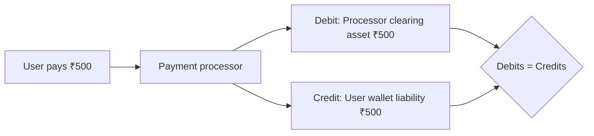
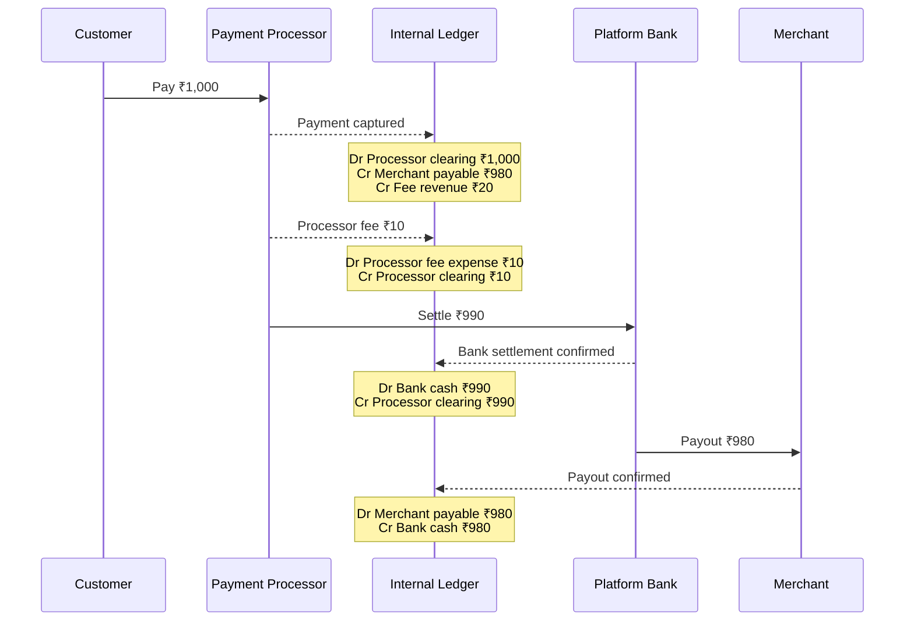
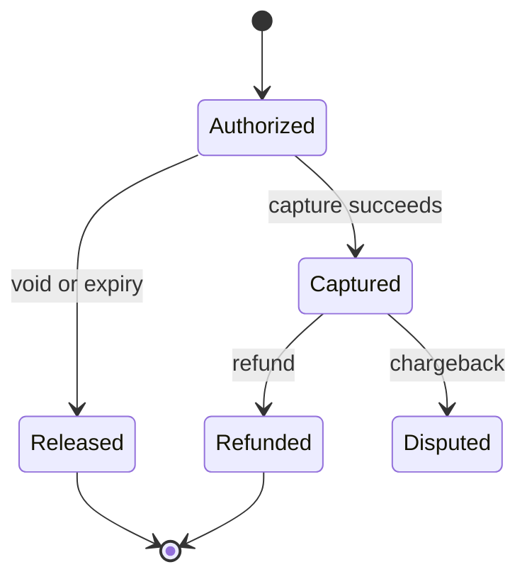
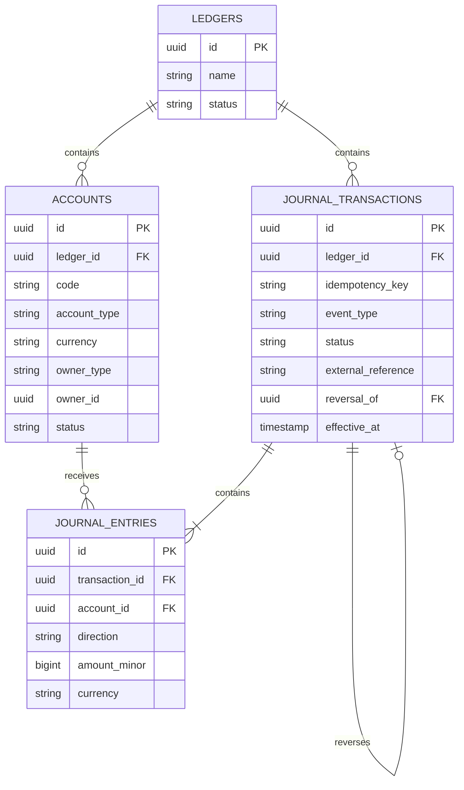
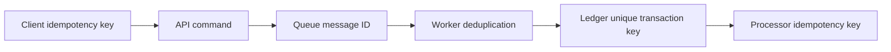
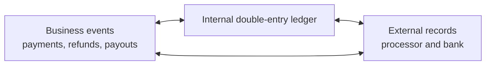
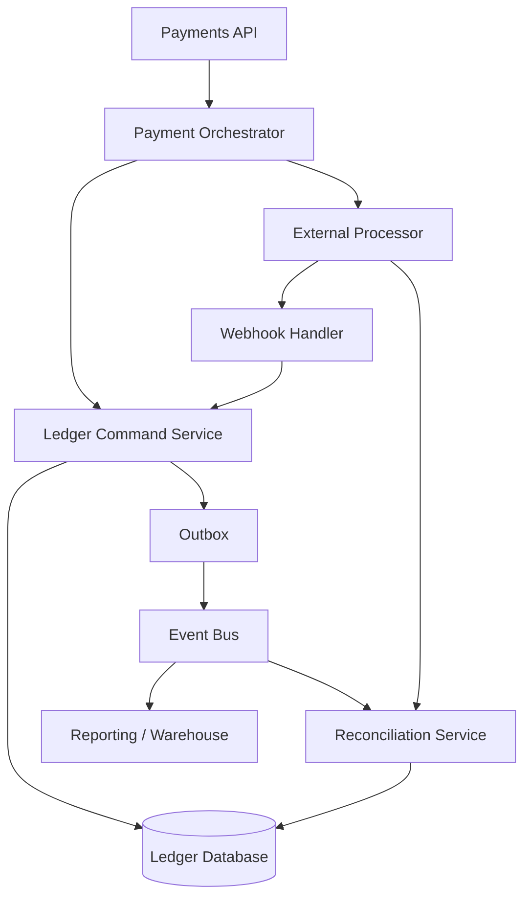
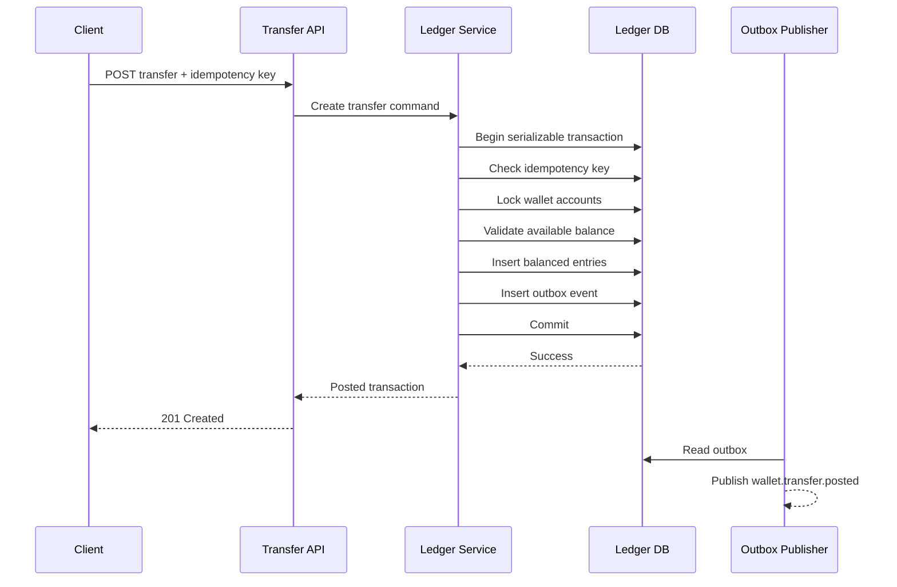
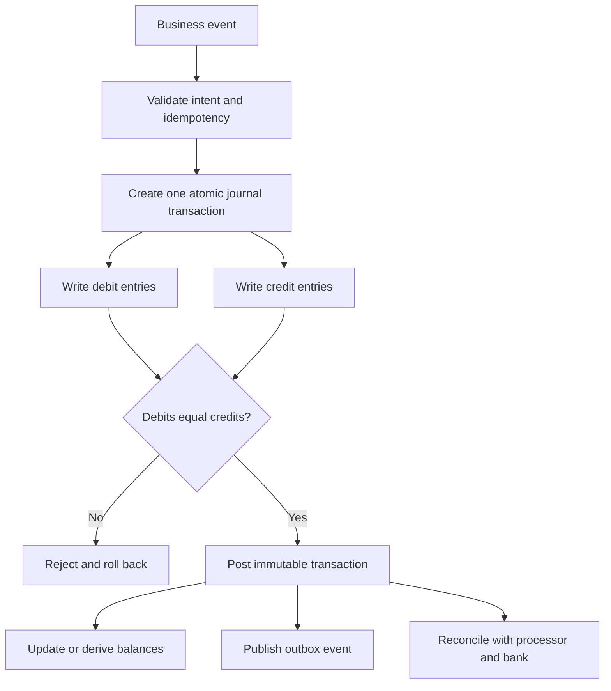

# Double-Entry Ledger in Payments & Fintech

> A practical, developer-focused guide to designing reliable money movement systems.
>
> **Audience:** Backend developers with 3+ years of experience  
> **Last reviewed:** 3 August 2026

---

# 1. What Is a Double-Entry Ledger?

A **ledger** is the system of record that explains how money moved and what every balance represents.

In a **double-entry ledger**, every financial transaction creates at least two entries:

- One or more **debit entries**
- One or more **credit entries**

For every posted transaction:

```text
Total debits = Total credits
```

Example: a user adds ₹500 to a wallet.

| Account | Debit | Credit |
|---|---:|---:|
| Bank clearing asset | ₹500 | — |
| User wallet liability | — | ₹500 |
| **Total** | **₹500** | **₹500** |

The platform has received or expects to receive ₹500, so its asset increases. At the same time, the platform owes ₹500 to the user, so its liability increases.



A ledger is different from a simple `balance` column. A balance tells you **what the amount is now**. A ledger tells you:

- Why the balance changed
- Which business event caused it
- Which accounts were affected
- Whether the movement was pending or final
- How to reverse or reconcile it

---

# 2. Core Ledger Building Blocks

## 2.1 Ledger

A ledger is a logical accounting boundary.

Examples:

- One ledger for the entire payment platform
- Separate ledgers for regulated entities or countries
- Separate ledgers for different products
- Separate ledgers for sandbox and production

Transactions should not silently move value between unrelated ledger boundaries.

## 2.2 Account

A ledger account tracks one financial position.

Examples:

- Platform bank cash
- Payment processor clearing balance
- Merchant payable
- User wallet balance
- Platform fee revenue
- Refund receivable
- Chargeback reserve

An account usually has:

```text
account_id
ledger_id
account_code
account_type
currency
owner/reference
status
created_at
```

## 2.3 Journal Transaction

A journal transaction represents one business event recorded in the ledger.

Examples:

- Payment captured
- Wallet funded
- Merchant payout initiated
- Refund completed
- Chargeback opened
- Processing fee charged

A journal transaction contains two or more entries and should be posted atomically.

## 2.4 Journal Entry

A journal entry is one debit or credit applied to one account.

```text
Journal transaction: PAY-10045

Entry 1: Debit  Processor clearing asset  ₹1,000
Entry 2: Credit Merchant payable           ₹980
Entry 3: Credit Platform fee revenue        ₹20
```

The transaction is balanced because:

```text
Debits  = ₹1,000
Credits = ₹980 + ₹20 = ₹1,000
```

## 2.5 Balance

A balance is derived from entries.

Conceptually:

```text
Balance = opening balance + posted debits - posted credits
```

The exact sign depends on the account type and the balance representation chosen by the application.

A robust ledger treats journal entries as the source of truth. A stored balance may be maintained for performance, but it must be derivable from entries.

---

# 3. Debits and Credits

“Debit” does not always mean money leaving, and “credit” does not always mean money entering. Their meaning depends on the account type.

## 3.1 Normal Balance Rules

| Account type | Increased by | Decreased by | Common fintech examples |
|---|---|---|---|
| Asset | Debit | Credit | Bank cash, processor clearing, receivable |
| Liability | Credit | Debit | User wallet balance, merchant payable |
| Revenue | Credit | Debit | Platform fee revenue, subscription revenue |
| Expense | Debit | Credit | Processor fee expense, chargeback expense |
| Equity | Credit | Debit | Retained earnings, contributed capital |

A useful memory aid is:

```text
DEAD: Debits increase Expenses, Assets, and Drawings
CLIC: Credits increase Liabilities, Income, and Capital
```

For payment systems, assets and liabilities are the most frequently used categories.

## 3.2 Platform Perspective Matters

Suppose a user wallet displays ₹1,000.

From the **user’s perspective**, it feels like an asset.

From the **platform’s accounting perspective**, it is normally a liability because the platform owes ₹1,000 to the user.


This perspective difference is one of the most important concepts in fintech ledger design.

## 3.3 Accounting Equation

The traditional accounting equation is:

```text
Assets = Liabilities + Equity
```

Revenue increases equity, while expenses reduce equity. A double-entry system preserves this equation when transactions are modelled correctly.

---

# 4. Why Fintech Systems Need a Ledger

Payment systems operate in an environment where:

- Network requests are retried
- Webhooks may arrive more than once or out of order
- Payment authorization and settlement occur at different times
- Processor fees are deducted separately
- Refunds and chargebacks can happen later
- Bank and processor records must be reconciled
- Multiple parties may own different portions of one payment

A double-entry ledger provides the following benefits.

## 4.1 Financial Consistency

Money cannot be created or destroyed by an incomplete write because every transaction must balance.

## 4.2 Auditability

Every balance can be explained through immutable journal entries.

## 4.3 Atomic Money Movement

All entries for one transaction succeed or fail together.

## 4.4 Easier Reconciliation

Internal ledger balances can be compared with processor reports, bank statements, and payout files.

## 4.5 Support for Complex Flows

A single customer payment can be split across:

- Merchant payable
- Platform fee
- Tax payable
- Processor fee
- Reserve amount
- Referral or broker commission

## 4.6 Safe Corrections

Incorrect transactions are reversed with new entries rather than silently edited or deleted.

---

# 5. Chart of Accounts for a Payment Platform

A **chart of accounts** defines the accounts and account categories used by the platform.

A simplified marketplace chart may look like this:

| Code | Account | Type | Purpose |
|---|---|---|---|
| `1000` | Bank cash | Asset | Cash held in the platform bank account |
| `1010` | Processor clearing | Asset | Money expected from or held by a processor |
| `1100` | Customer receivable | Asset | Money customers owe the platform |
| `2000` | User wallet liability | Liability | Funds owed to wallet users |
| `2010` | Merchant payable | Liability | Funds owed to merchants |
| `2020` | Refund payable | Liability | Approved refunds not yet sent |
| `2030` | Tax payable | Liability | Tax collected for remittance |
| `2040` | Merchant reserve | Liability | Merchant funds temporarily held in reserve |
| `4000` | Platform fee revenue | Revenue | Fees earned by the platform |
| `4010` | Subscription revenue | Revenue | Subscription charges |
| `5000` | Processor fee expense | Expense | Fees charged by payment processors |
| `5010` | Chargeback expense | Expense | Losses absorbed by the platform |

## 5.1 Control Accounts and Subaccounts

A platform may have one control account and many customer-level subaccounts.

```text
Merchant payable control account
├── Merchant A payable
├── Merchant B payable
└── Merchant C payable
```

The sum of merchant subaccounts should match the merchant payable control balance.

## 5.2 Account Ownership

Accounts should clearly identify their owner or business reference.

```json
{
  "account_code": "merchant_payable",
  "owner_type": "merchant",
  "owner_id": "mer_8421",
  "currency": "INR"
}
```

Avoid using one generic merchant balance row for all merchants. Separate accounts improve auditability, reporting, and concurrency control.

---

# 6. End-to-End Marketplace Payment Example

Assume:

- Customer pays: **₹1,000**
- Platform fee: **₹20**
- Merchant receives: **₹980**
- Processor later charges: **₹10**
- Processor settles net cash: **₹990**

## 6.1 Payment Captured

When the processor confirms capture:

| Account | Debit | Credit |
|---|---:|---:|
| Processor clearing asset | ₹1,000 | — |
| Merchant payable | — | ₹980 |
| Platform fee revenue | — | ₹20 |
| **Total** | **₹1,000** | **₹1,000** |

Meaning:

- The processor owes the platform ₹1,000.
- The platform owes the merchant ₹980.
- The platform has earned ₹20.

## 6.2 Processor Fee Recorded

| Account | Debit | Credit |
|---|---:|---:|
| Processor fee expense | ₹10 | — |
| Processor clearing asset | — | ₹10 |
| **Total** | **₹10** | **₹10** |

The expected processor receivable falls from ₹1,000 to ₹990.

## 6.3 Processor Settlement Received

| Account | Debit | Credit |
|---|---:|---:|
| Bank cash | ₹990 | — |
| Processor clearing asset | — | ₹990 |
| **Total** | **₹990** | **₹990** |

The processor clearing account is now zero for this payment.

## 6.4 Merchant Payout Sent

| Account | Debit | Credit |
|---|---:|---:|
| Merchant payable | ₹980 | — |
| Bank cash | — | ₹980 |
| **Total** | **₹980** | **₹980** |

Final economic result:

```text
Platform revenue          ₹20
Less processor expense   (₹10)
Platform net contribution ₹10
```



---

# 7. Common Payment and Wallet Flows

## 7.1 Wallet Top-Up

A user adds ₹500 to a wallet.

| Account | Debit | Credit |
|---|---:|---:|
| Processor clearing asset | ₹500 | — |
| User wallet liability | — | ₹500 |

The user’s displayed balance increases because the platform’s liability to that user increases.

## 7.2 Wallet-to-Wallet Transfer

User A sends ₹200 to User B.

| Account | Debit | Credit |
|---|---:|---:|
| User A wallet liability | ₹200 | — |
| User B wallet liability | — | ₹200 |

No external cash moves. The platform simply changes who owns the liability.

## 7.3 Wallet Withdrawal

A user withdraws ₹300 to a bank account.

| Account | Debit | Credit |
|---|---:|---:|
| User wallet liability | ₹300 | — |
| Bank cash or payout clearing | — | ₹300 |

The user balance decreases, and the platform cash position decreases or a payout clearing obligation is created.

## 7.4 Platform Fee Deducted from Wallet Transfer

User A sends ₹200, User B receives ₹195, and the platform earns ₹5.

| Account | Debit | Credit |
|---|---:|---:|
| User A wallet liability | ₹200 | — |
| User B wallet liability | — | ₹195 |
| Platform fee revenue | — | ₹5 |

## 7.5 Full Refund

Suppose the original payment credited merchant payable by ₹980 and fee revenue by ₹20. If both amounts are reversed and ₹1,000 is returned:

| Account | Debit | Credit |
|---|---:|---:|
| Merchant payable | ₹980 | — |
| Platform fee revenue | ₹20 | — |
| Bank cash or processor clearing | — | ₹1,000 |

Actual refund entries depend on whether:

- The merchant already received a payout
- The platform fee is refundable
- The processor returns its processing fee
- The merchant balance can become negative

## 7.6 Partial Refund

For a ₹300 partial refund, the allocation policy must be explicit.

Example where the platform fee is proportionally reversed:

```text
Original platform fee rate = 2%
Refund amount              = ₹300
Fee reversal               = ₹6
Merchant portion           = ₹294
```

| Account | Debit | Credit |
|---|---:|---:|
| Merchant payable | ₹294 | — |
| Platform fee revenue | ₹6 | — |
| Bank cash or processor clearing | — | ₹300 |

## 7.7 Chargeback

A chargeback may initially create a receivable from the merchant.

| Account | Debit | Credit |
|---|---:|---:|
| Merchant chargeback receivable | ₹1,000 | — |
| Processor clearing or bank cash | — | ₹1,000 |

If the platform decides to absorb the loss:

| Account | Debit | Credit |
|---|---:|---:|
| Chargeback expense | ₹1,000 | — |
| Merchant chargeback receivable | — | ₹1,000 |

## 7.8 Reserve Hold

Move ₹100 from the merchant’s available payable into reserve.

| Account | Debit | Credit |
|---|---:|---:|
| Merchant available payable | ₹100 | — |
| Merchant reserve liability | — | ₹100 |

Total merchant liability remains unchanged; only availability changes.

---

# 8. Pending, Posted, and Available Balances

Payment state and ledger state should be related, but they are not always identical.

## 8.1 Posted Balance

The sum of finalized ledger entries.

```text
Posted balance = entries that are financially recognized
```

## 8.2 Pending Balance

The sum of authorized or initiated movements that are not yet final.

Examples:

- Card authorization hold
- Pending ACH debit
- Payout submitted but not confirmed
- Bank transfer awaiting settlement

## 8.3 Available Balance

The amount that the user or merchant can spend or withdraw.

A common formula is:

```text
Available balance
= Posted balance
- Pending debits
- Reserve holds
- Minimum required balance
+ Eligible pending credits, if business rules allow
```

## 8.4 Authorization and Capture

For a card authorization of ₹1,000, the system may create a pending hold without recognizing final revenue.



Two common approaches are:

### Approach A: Separate Pending Entries

Store pending debits and credits separately from posted entries.

### Approach B: Reservation Model

Keep posted accounting separate and maintain holds or reservations that reduce available balance.

The second model can make statutory accounting cleaner, while the first can provide a complete operational view. The correct choice depends on product and reporting requirements.

---

# 9. Ledger Data Model

A practical relational model contains four main entities.



## 9.1 Recommended Transaction Fields

| Field | Purpose |
|---|---|
| `id` | Internal immutable transaction ID |
| `ledger_id` | Accounting boundary |
| `idempotency_key` | Prevent duplicate posting |
| `event_type` | Payment capture, refund, payout, etc. |
| `status` | Pending, posted, reversed, rejected |
| `external_reference` | Processor payment, payout, or bank reference |
| `effective_at` | Financially effective timestamp |
| `created_at` | System insertion timestamp |
| `reversal_of` | Original transaction being reversed |
| `metadata` | Searchable business context |

## 9.2 Recommended Entry Fields

| Field | Purpose |
|---|---|
| `transaction_id` | Parent journal transaction |
| `account_id` | Account affected |
| `direction` | Debit or credit |
| `amount_minor` | Integer amount in the smallest currency unit |
| `currency` | Currency code |
| `entry_type` | Principal, fee, tax, reserve, etc. |
| `sequence_no` | Stable ordering within a transaction |

---

# 10. PostgreSQL Schema Example

The following schema is intentionally simplified. Production systems also need authorization, tenant boundaries, partitioning strategy, data retention, and operational tooling.

```sql
CREATE TYPE account_type AS ENUM (
    'asset',
    'liability',
    'revenue',
    'expense',
    'equity'
);

CREATE TYPE entry_direction AS ENUM ('debit', 'credit');

CREATE TYPE journal_status AS ENUM (
    'pending',
    'posted',
    'reversed',
    'rejected'
);

CREATE TABLE ledgers (
    id              UUID PRIMARY KEY,
    name            TEXT NOT NULL,
    status          TEXT NOT NULL DEFAULT 'active',
    created_at      TIMESTAMPTZ NOT NULL DEFAULT now()
);

CREATE TABLE ledger_accounts (
    id              UUID PRIMARY KEY,
    ledger_id       UUID NOT NULL REFERENCES ledgers(id),
    code            TEXT NOT NULL,
    account_type    account_type NOT NULL,
    currency        CHAR(3) NOT NULL,
    owner_type      TEXT,
    owner_id        UUID,
    status          TEXT NOT NULL DEFAULT 'active',
    created_at      TIMESTAMPTZ NOT NULL DEFAULT now(),

    UNIQUE (ledger_id, code, currency, owner_type, owner_id)
);

CREATE TABLE journal_transactions (
    id                  UUID PRIMARY KEY,
    ledger_id           UUID NOT NULL REFERENCES ledgers(id),
    idempotency_key     TEXT NOT NULL,
    event_type          TEXT NOT NULL,
    status              journal_status NOT NULL DEFAULT 'pending',
    external_reference  TEXT,
    reversal_of         UUID REFERENCES journal_transactions(id),
    effective_at        TIMESTAMPTZ NOT NULL,
    metadata            JSONB NOT NULL DEFAULT '{}'::jsonb,
    created_at          TIMESTAMPTZ NOT NULL DEFAULT now(),

    UNIQUE (ledger_id, idempotency_key)
);

CREATE TABLE journal_entries (
    id              UUID PRIMARY KEY,
    transaction_id  UUID NOT NULL REFERENCES journal_transactions(id),
    account_id      UUID NOT NULL REFERENCES ledger_accounts(id),
    sequence_no     SMALLINT NOT NULL,
    direction       entry_direction NOT NULL,
    amount_minor    BIGINT NOT NULL CHECK (amount_minor > 0),
    currency        CHAR(3) NOT NULL,
    entry_type      TEXT NOT NULL,
    created_at      TIMESTAMPTZ NOT NULL DEFAULT now(),

    UNIQUE (transaction_id, sequence_no)
);

CREATE INDEX idx_entries_account
    ON journal_entries (account_id, created_at, id);

CREATE INDEX idx_transactions_external_reference
    ON journal_transactions (external_reference)
    WHERE external_reference IS NOT NULL;

CREATE INDEX idx_transactions_effective_at
    ON journal_transactions (ledger_id, effective_at, id);
```

## 10.1 Important Schema Limitation

A normal SQL `CHECK` constraint cannot easily verify that all rows belonging to a transaction have equal debit and credit totals because the rule spans multiple rows.

Enforce balancing through one of these mechanisms:

1. A single database function that inserts and posts the complete transaction
2. A deferred constraint trigger
3. An application service plus database-level posting guard
4. A specialized financial ledger database

The safest relational approach is to make the database posting function the only allowed write path.

---

# 11. Posting a Transaction Safely

Posting must be atomic.

```text
Begin database transaction
    Validate idempotency key
    Validate accounts
    Validate ledger and currency
    Validate debit total equals credit total
    Validate balance or overdraft rules
    Insert journal transaction
    Insert all journal entries
    Mark transaction as posted
    Update cached balances, if used
Commit
```

If any step fails, the complete operation must roll back.

## 11.1 Posting Pseudocode

```python
from dataclasses import dataclass
from decimal import Decimal
from typing import Literal

Direction = Literal["debit", "credit"]


@dataclass(frozen=True)
class EntryInput:
    account_id: str
    direction: Direction
    amount_minor: int
    currency: str
    entry_type: str


def post_transaction(
    db,
    *,
    ledger_id: str,
    transaction_id: str,
    idempotency_key: str,
    event_type: str,
    entries: list[EntryInput],
) -> str:
    if len(entries) < 2:
        raise ValueError("A journal transaction requires at least two entries")

    if any(entry.amount_minor <= 0 for entry in entries):
        raise ValueError("Entry amounts must be positive")

    debit_total = sum(
        entry.amount_minor for entry in entries if entry.direction == "debit"
    )
    credit_total = sum(
        entry.amount_minor for entry in entries if entry.direction == "credit"
    )

    if debit_total != credit_total:
        raise ValueError("Journal transaction is not balanced")

    with db.transaction(isolation="serializable"):
        existing = db.fetch_one(
            """
            SELECT id, status
            FROM journal_transactions
            WHERE ledger_id = %s AND idempotency_key = %s
            """,
            (ledger_id, idempotency_key),
        )

        if existing:
            return existing["id"]

        accounts = db.fetch_all_for_update(
            """
            SELECT id, ledger_id, currency, status
            FROM ledger_accounts
            WHERE id = ANY(%s)
            ORDER BY id
            FOR UPDATE
            """,
            ([entry.account_id for entry in entries],),
        )

        validate_accounts(ledger_id, accounts, entries)
        validate_balance_rules(db, accounts, entries)

        db.execute(
            """
            INSERT INTO journal_transactions (
                id, ledger_id, idempotency_key, event_type,
                status, effective_at
            )
            VALUES (%s, %s, %s, %s, 'pending', now())
            """,
            (transaction_id, ledger_id, idempotency_key, event_type),
        )

        for sequence_no, entry in enumerate(entries, start=1):
            db.execute(
                """
                INSERT INTO journal_entries (
                    id, transaction_id, account_id, sequence_no,
                    direction, amount_minor, currency, entry_type
                )
                VALUES (gen_random_uuid(), %s, %s, %s, %s, %s, %s, %s)
                """,
                (
                    transaction_id,
                    entry.account_id,
                    sequence_no,
                    entry.direction,
                    entry.amount_minor,
                    entry.currency,
                    entry.entry_type,
                ),
            )

        db.execute(
            """
            UPDATE journal_transactions
            SET status = 'posted'
            WHERE id = %s
            """,
            (transaction_id,),
        )

    return transaction_id
```

The code illustrates the flow, but production integrity should not depend only on application validation. Database permissions and stored procedures should prevent direct unbalanced writes.

---

# 12. Idempotency and Duplicate Prevention

Distributed payment systems operate with **at-least-once delivery** in many places. A client may retry after a timeout even though the first request succeeded.

Without idempotency:

```text
Client sends wallet credit request
Server commits ledger transaction
Response is lost
Client retries
Server posts the same credit again
```

The user incorrectly receives two credits.

## 12.1 Idempotency Key

Every business operation should have a stable, unique idempotency key.

Examples:

```text
wallet_topup:pay_12345
payment_capture:ch_67890
refund:rf_44551
payout:po_77331
webhook:evt_99882
```

Store a uniqueness constraint such as:

```sql
UNIQUE (ledger_id, idempotency_key)
```

## 12.2 Same Key, Same Intent

A retry using the same key should represent the same logical operation.

Store a request hash or important parameters so the system can reject this dangerous case:

```text
First request:  key=transfer-100, amount=₹500
Second request: key=transfer-100, amount=₹5,000
```

## 12.3 Idempotency Must Be End-to-End

Idempotency is needed at more than the HTTP API layer.

Apply it to:

- Public API requests
- Internal commands
- Queue messages
- Webhook handlers
- Batch imports
- Processor callbacks
- Ledger posting
- Payout submission



A duplicate-resistant API is not enough if the worker can post the ledger twice.

---

# 13. Concurrency and Double-Spend Prevention

Consider two simultaneous ₹800 withdrawals from a wallet containing ₹1,000.

Without proper concurrency control:

```text
Request A reads balance = ₹1,000
Request B reads balance = ₹1,000
Request A approves ₹800
Request B approves ₹800
Final withdrawals = ₹1,600
```

## 13.1 Common Protection Strategies

### Row Locking

Lock the account or balance row before checking and posting.

```sql
SELECT id, posted_balance_minor, version
FROM account_balances
WHERE account_id = $1
FOR UPDATE;
```

### Optimistic Version Check

Update only when the account version is unchanged.

```sql
UPDATE account_balances
SET posted_balance_minor = posted_balance_minor - $1,
    version = version + 1
WHERE account_id = $2
  AND version = $3;
```

If zero rows are updated, reload and retry.

### Serializable Transactions

Use the database’s serializable isolation level and retry serialization failures.

```text
BEGIN ISOLATION LEVEL SERIALIZABLE;
...
COMMIT;
```

### Single-Writer Partition

Route all commands for the same account to one ordered partition or actor.

```text
partition key = account_id
```

This can simplify ordering at high scale but still requires idempotency and durable storage.

## 13.2 Deterministic Lock Ordering

When one transfer touches multiple accounts, lock accounts in a consistent order, such as ascending `account_id`, to reduce deadlocks.

```text
Lock account A, then account B
```

All code paths must use the same ordering rule.

## 13.3 Ledger Balance vs Spendable Balance

Do not check a user-facing balance from a stale read replica before approving a withdrawal. The spend decision must use strongly consistent state that includes holds and concurrent transactions.

---

# 14. Reversals, Refunds, and Corrections

## 14.1 Never Edit Posted Entries

Posted journal entries should be immutable.

Do not:

```sql
UPDATE journal_entries SET amount_minor = 5000 WHERE id = ...;
DELETE FROM journal_entries WHERE id = ...;
```

Instead, create a reversal transaction.

## 14.2 Reversal Pattern

Original transaction:

| Account | Debit | Credit |
|---|---:|---:|
| User A wallet liability | ₹200 | — |
| User B wallet liability | — | ₹200 |

Reversal:

| Account | Debit | Credit |
|---|---:|---:|
| User B wallet liability | ₹200 | — |
| User A wallet liability | — | ₹200 |

Link the reversal to the original transaction:

```text
reversal_of = original_transaction_id
```

## 14.3 Refund Is Not Always a Reversal

A refund is a new business event. It may occur days after the payment and can have different fee treatment.

Use a strict reversal for:

- Incorrect duplicate posting
- Internal accounting correction
- Voided transaction before completion

Use a refund transaction for:

- Customer refund
- Partial refund
- Post-settlement return of funds

## 14.4 Compensating Transactions

In distributed systems, an external payment may succeed while a later internal step fails. Do not attempt to erase history. Record the actual state, then create a compensating transaction or recovery workflow.

---

# 15. Reconciliation

A ledger is internally consistent when debits equal credits. That does not prove the external bank or processor moved the expected cash.

**Reconciliation** compares the internal ledger with external financial records.

## 15.1 Main Reconciliation Types

### Processor Reconciliation

Compare:

- Internal captured payments
- Processor charges
- Processor fees
- Refunds
- Disputes
- Settlements

### Bank Reconciliation

Compare:

- Ledger bank cash account
- Bank statement transactions
- Payout deposits
- Withdrawal debits
- Returns and reversals

### Payout Reconciliation

Compare:

- Merchant payable entries
- Payout instructions
- Processor payout status
- Bank confirmation
- Merchant settlement reports

## 15.2 Three-Way Reconciliation

A mature platform often reconciles three layers:



Examples of mismatches:

- Processor captured a payment but the ledger did not post it
- Ledger posted a payout but the bank rejected it
- Bank settlement amount differs because of an unrecorded fee
- Duplicate webhook created a duplicate business record
- Currency conversion caused an amount difference

## 15.3 Suspense Account

When an external transaction cannot yet be mapped, place it in a controlled suspense account rather than forcing an incorrect allocation.

Example:

| Account | Debit | Credit |
|---|---:|---:|
| Bank cash | ₹5,000 | — |
| Unidentified receipts suspense | — | ₹5,000 |

After identifying the merchant deposit:

| Account | Debit | Credit |
|---|---:|---:|
| Unidentified receipts suspense | ₹5,000 | — |
| Merchant payable | — | ₹5,000 |

Suspense accounts must be monitored and cleared promptly.

---

# 16. Multi-Currency Ledgers

Do not combine different currencies in one balance.

```text
₹100 + $100 is not a meaningful balance
```

## 16.1 One Currency per Account

Use separate accounts:

```text
User 42 INR wallet
User 42 USD wallet
User 42 EUR wallet
```

## 16.2 Smallest Currency Unit

Store amounts as integers in the currency’s smallest supported unit.

```text
INR ₹10.50  -> 1050 paise
USD $10.50  -> 1050 cents
JPY ¥10     -> 10
```

Do not assume every currency has two decimal places. Maintain currency exponent or scale metadata.

## 16.3 FX Conversion

Suppose a user exchanges USD 100 for INR 8,300. This is not one same-currency transfer. It is two balanced currency legs connected by one FX business event.

USD ledger:

| Account | Debit | Credit |
|---|---:|---:|
| User USD wallet liability | $100 | — |
| FX liquidity USD liability/account | — | $100 |

INR ledger:

| Account | Debit | Credit |
|---|---:|---:|
| FX liquidity INR account | ₹8,300 | — |
| User INR wallet liability | — | ₹8,300 |

The two legs should be linked by:

- `fx_trade_id`
- Applied exchange rate
- Rate source
- Spread or fee
- Timestamp
- Rounding policy

## 16.4 Rounding

Define a deterministic rounding policy.

```text
Converted minor amount = round(source amount × exchange rate)
```

Any rounding difference must be recorded in a rounding gain/loss account, not silently discarded.

---

# 17. Ledger Architecture

The ledger should be the financial source of truth, but it should not contain every domain concern.



## 17.1 Payment Service vs Ledger Service

The payment service knows:

- Processor state
- Payment method
- Authorization and capture
- Retry rules
- Webhook mapping

The ledger service knows:

- Accounts
- Debit and credit rules
- Balance constraints
- Journal posting
- Reversals
- Financial history

Keep the boundary clear. A processor object such as a “charge” is not itself a ledger entry.

## 17.2 Transactional Outbox

When a posted ledger transaction must publish an event, write both the transaction and outbox record in the same database transaction.

```text
Database transaction:
    Post journal entries
    Insert outbox event
Commit

Background publisher:
    Read unsent outbox rows
    Publish event
    Mark as sent
```

This avoids the dual-write problem where the database commit succeeds but event publishing fails.

## 17.3 Read Models

The ledger write model should favor correctness. Separate read models can serve:

- User balance API
- Merchant statements
- Finance reports
- Operational dashboards
- Data warehouse analytics

A read model may be eventually consistent, but money movement authorization must use strongly consistent ledger state.

---

# 18. Important Invariants and Controls

A production ledger should enforce or continuously verify these rules.

## 18.1 Transaction-Level Invariants

```text
At least two entries exist
At least one debit and one credit exist
Debit total equals credit total
All amounts are positive integers
All accounts exist and are active
All accounts belong to the intended ledger
Currencies are compatible with the transaction model
The idempotency key is unique
```

## 18.2 Account-Level Invariants

```text
Account currency never changes after posting begins
Posted entries are immutable
Closed accounts reject new entries
Accounts with no-overdraft rules cannot go below their allowed limit
Pending and posted balances are tracked independently
```

## 18.3 System-Level Invariants

```text
Every external money movement has a traceable internal reference
Every reversal points to an original transaction
Every processor settlement is reconciled
Every bank statement line is matched, explained, or placed in suspense
Total subledger balances agree with control accounts
```

## 18.4 Audit Fields

Capture:

- Who or which service initiated the command
- Request ID and trace ID
- Idempotency key
- Original external event ID
- Effective timestamp
- Creation timestamp
- Reversal relationship
- Rule or product version used
- Human adjustment reason and approver

---

# 19. Practical Design Decisions

## 19.1 Compute Balance or Store Balance?

### Compute from Entries

```sql
SELECT
    SUM(
        CASE direction
            WHEN 'debit' THEN amount_minor
            ELSE -amount_minor
        END
    )
FROM journal_entries
WHERE account_id = $1;
```

Advantages:

- Simple source of truth
- Easy to audit
- No separate balance update bug

Limitations:

- Expensive for high-volume accounts
- Historical scans grow over time

### Maintain Cached Balance

Store balances in an `account_balances` table and update them in the same database transaction as entries.

Advantages:

- Fast balance reads
- Easier real-time authorization

Limitations:

- Requires strict atomicity
- Must be periodically verified against entries

A common production design uses immutable entries plus atomically maintained balance snapshots.

## 19.2 Signed Amount or Direction Column?

### Signed Amount

```text
+1000 or -1000
```

### Direction + Positive Amount

```text
direction = debit
amount = 1000
```

Direction plus a positive amount is often clearer for audit and prevents ambiguous negative-credit combinations.

## 19.3 One Entry Table or Separate Debit/Credit Tables?

One journal entry table with a direction field is usually simpler and easier to query.

## 19.4 One Transaction per Business Event

A single journal transaction should represent one atomic accounting event.

Do not combine an entire day’s unrelated payments into one journal transaction merely to reduce rows. It weakens traceability and reversal handling.

## 19.5 Business Time vs System Time

Store both:

```text
effective_at = when the transaction financially applies
created_at   = when the system recorded it
```

These differ during delayed webhooks, backfills, reconciliation adjustments, and late bank files.

## 19.6 Metadata Is Not Accounting Structure

Metadata is useful for search and traceability, but important accounting dimensions should be first-class fields or accounts.

Avoid hiding critical data only in JSON:

```json
{
  "maybe_merchant_id": "...",
  "possibly_currency": "INR"
}
```

---

# 20. Observability and Operational Support

A ledger requires financial and technical monitoring.

## 20.1 Useful Metrics

- Posted transactions per second
- Posting latency
- Duplicate/idempotent replay count
- Serialization retry count
- Balance check failure count
- Reconciliation mismatch count and amount
- Suspense account balance and age
- Unmatched bank transaction count
- Negative merchant balance count
- Pending transaction age
- Reversal rate

## 20.2 Useful Alerts

Alert when:

- Any posted transaction is unbalanced
- A control account differs from its subledger total
- A suspense balance remains unresolved past its SLA
- Settlement is missing after the expected window
- Webhook backlog grows
- Idempotency conflicts contain different request payloads
- An account exceeds an overdraft or reserve limit

## 20.3 Traceability

One support query should trace the full path:

```text
customer order
→ payment intent
→ processor charge
→ webhook event
→ ledger transaction
→ journal entries
→ settlement
→ bank statement line
→ merchant payout
```

Use stable correlation IDs across services.

---

# 21. Worked Example: Wallet Transfer API

## 21.1 Request

```http
POST /v1/wallet-transfers
Idempotency-Key: transfer_01JABC123
Content-Type: application/json
```

```json
{
  "source_wallet_id": "wal_sender",
  "destination_wallet_id": "wal_receiver",
  "amount_minor": 25000,
  "currency": "INR"
}
```

`25000` represents ₹250.00.

## 21.2 Validation

The service validates:

```text
Source and destination are different
Both wallets are active
Both use INR
Amount is positive
Source has at least ₹250 available
Idempotency key is new or matches the original request
```

## 21.3 Ledger Posting

| Account | Debit | Credit |
|---|---:|---:|
| Sender wallet liability | ₹250 | — |
| Receiver wallet liability | — | ₹250 |

## 21.4 Response

```json
{
  "transfer_id": "trf_01JABC123",
  "ledger_transaction_id": "jtx_01JXYZ890",
  "status": "posted",
  "amount_minor": 25000,
  "currency": "INR"
}
```

## 21.5 Retry Behaviour

The same request with the same idempotency key returns the original result.

A request with the same key but a different amount returns a conflict.

```http
409 Conflict
```

```json
{
  "code": "IDEMPOTENCY_KEY_REUSED",
  "message": "The idempotency key was already used with different parameters."
}
```

## 21.6 Complete Flow



---

# 22. Interview-Relevant Summary

A strong explanation of a double-entry ledger should cover these ideas:

## 22.1 Core Principle

Every posted financial event contains balanced debit and credit entries.

```text
Total debit amount = Total credit amount
```

## 22.2 Ledger Is the Source of Truth

Balances are derived from immutable entries. Cached balances are an optimization, not an independent truth.

## 22.3 User Balance Is Often a Liability

A wallet balance shown as an asset to the user is generally a liability from the platform’s perspective.

## 22.4 Posting Must Be Atomic

All entries belonging to a transaction must commit or roll back together.

## 22.5 Idempotency Is Mandatory

Retries, duplicate webhooks, and lost responses must not create duplicate money movements.

## 22.6 Concurrency Must Protect Spendable Balance

Use account locks, version checks, serializable transactions, ordered partitions, or a specialized ledger engine to prevent double spending.

## 22.7 Never Mutate Financial History

Correct posted mistakes using reversals or compensating entries.

## 22.8 Internal Balance Is Not Enough

Reconcile the ledger against processors, payouts, and bank statements.

## 22.9 Multi-Currency Requires Separate Accounting

Each account should represent one currency or asset. FX is modelled as linked, balanced legs.

## 22.10 A Good Ledger Explains Every Number

For any displayed balance, the system should answer:

```text
What events created this balance?
Which funds are pending, available, or reserved?
Which external transactions support it?
How would it be reversed?
Has it been reconciled?
```

---

# 23. References

The following official documentation was reviewed while preparing this guide:

1. Modern Treasury — Debits and Credits  
   https://docs.moderntreasury.com/ledgers/docs/guide-to-debits-and-credits

2. Modern Treasury — Ledger Transactions Overview  
   https://docs.moderntreasury.com/ledgers/docs/ledger-transactions-overview

3. Modern Treasury — Ledgers Overview  
   https://docs.moderntreasury.com/ledgers/docs/overview

4. Modern Treasury — Idempotent Requests  
   https://docs.moderntreasury.com/platform/reference/idempotent-requests

5. Modern Treasury — Lock on Account Balance or Version  
   https://docs.moderntreasury.com/ledgers/docs/lock-on-account-balance-or-version

6. Modern Treasury — Balances Used in Account Reconciliation  
   https://docs.moderntreasury.com/ledgers/docs/balances-used-in-account-reconciliation

7. Stripe — Balance Transaction Types  
   https://docs.stripe.com/reports/balance-transaction-types

8. Stripe — Reporting and Reconciliation  
   https://docs.stripe.com/plan-integration/get-started/reporting-reconciliation

9. TigerBeetle — Financial Accounting  
   https://docs.tigerbeetle.com/coding/financial-accounting/

10. TigerBeetle — Reliable Transaction Submission  
    https://docs.tigerbeetle.com/coding/reliable-transaction-submission/

11. PostgreSQL — Transaction Isolation  
    https://www.postgresql.org/docs/current/transaction-iso.html

12. PostgreSQL — Serialization Failure Handling  
    https://www.postgresql.org/docs/current/mvcc-serialization-failure-handling.html

---

## Final Mental Model



> A payment record says that a payment happened. A double-entry ledger explains exactly where the money came from, where it went, who owns it, and why every balance is correct.
