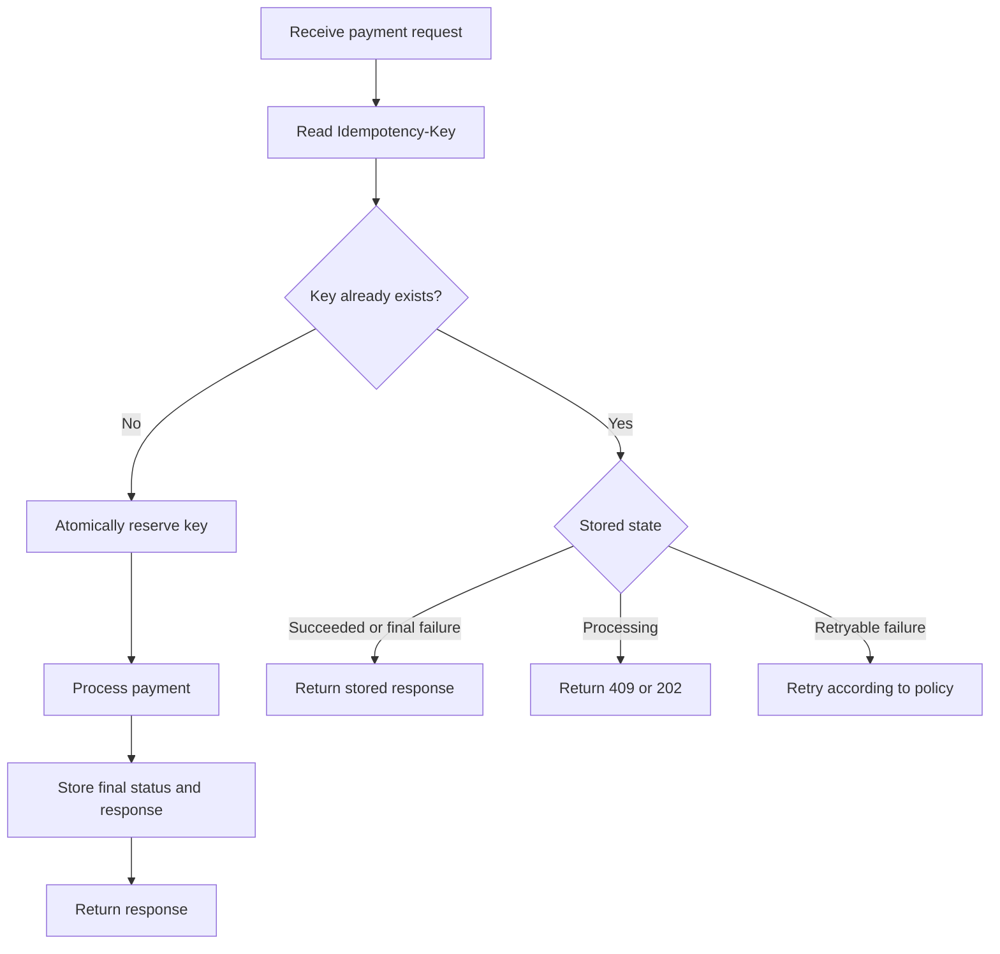
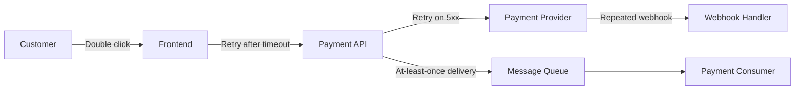
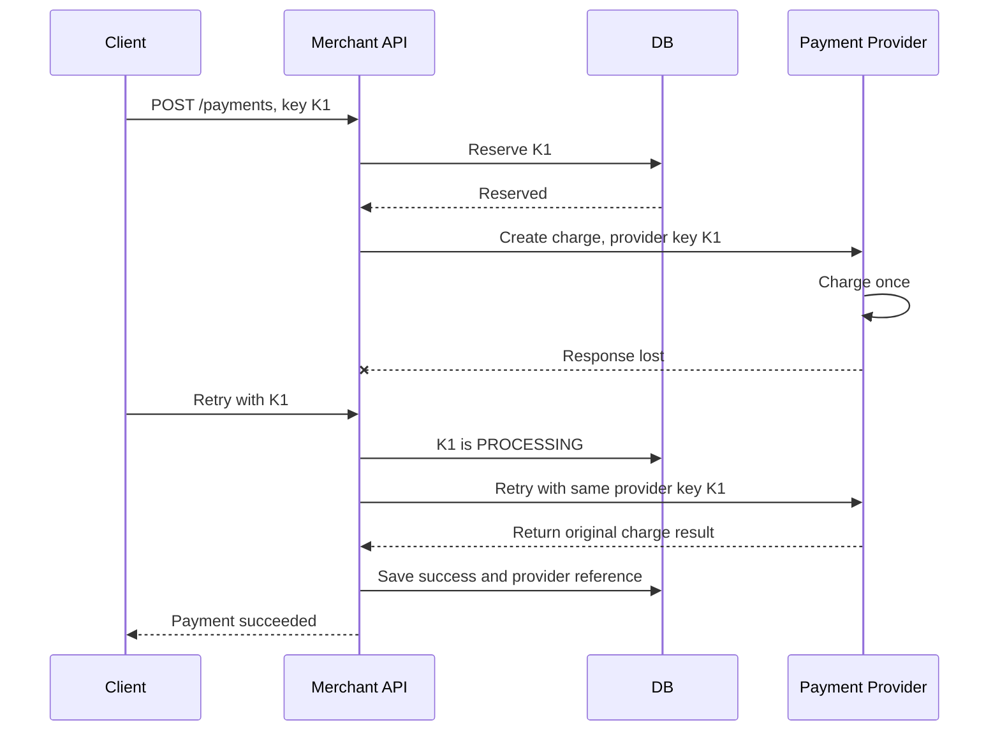
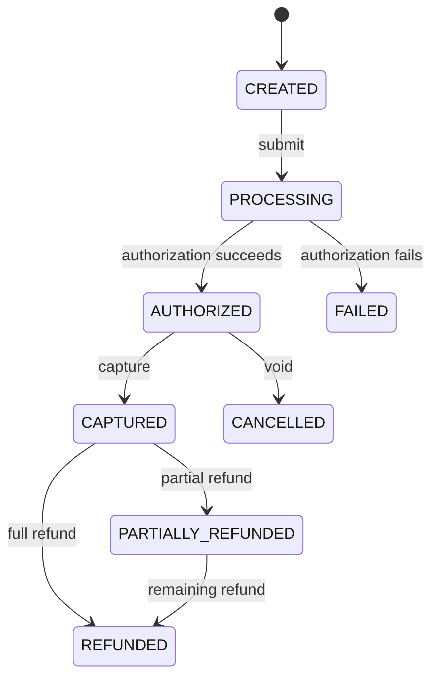
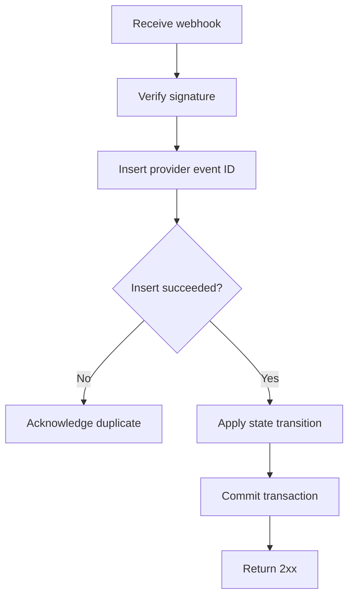
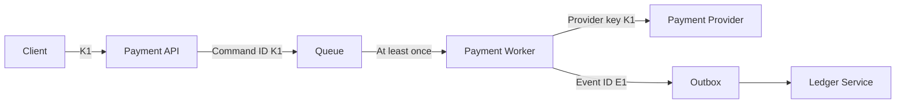

# Idempotency Keys in Payments

> Understand how payment systems safely handle retries without charging, refunding, or transferring money twice.

## In short

- An idempotency key identifies **one logical money-moving operation**; every retry of that operation reuses the same key, and a new payment, capture, refund, or payout needs a new key.
- The server stores the key with a request fingerprint and the final response, so a replay returns the original result instead of moving money again.
- Concurrency is handled by a **database unique constraint** scoped to `(tenant, operation, key)` — a "check, then insert" lets two servers both charge.
- The same key sent with a different payload is a conflict to reject, never a response to replay.
- Propagate a **stable provider idempotency key** downstream: an idempotent public API does not stop the provider from charging twice on retry.
- Idempotency does not replace payment state machines, webhook deduplication, or reconciliation — each solves a different problem.
- Queues and webhooks are at-least-once, so the realistic goal is an **exactly-once financial effect**, not exactly-once delivery.



**Interview answer:** An idempotency key is a client-generated value attached to a money-moving request. The server atomically reserves the key using a unique constraint, performs the operation exactly once, then stores the resulting status and response body against that key, so any retry carrying the same key replays the stored result rather than charging again. The same key is propagated to the payment provider, so the retry cannot create a second charge downstream either.

**Gotcha:** Reading the key before inserting it. "Look up the key, and create it if missing" is a race — two instances can both see nothing and both charge the customer. The insert itself has to be the concurrency guard.

---

# 1. Why Idempotency Is Critical in Payments

Payment APIs operate across networks, databases, queues, banks, card networks, and third-party payment service providers. Any component can become slow, disconnect, or return an unclear response.

Consider this situation:

1. A customer clicks **Pay ₹1,000**.
2. Your backend sends a charge request to the payment provider.
3. The provider successfully charges the card.
4. The network connection fails before your backend receives the response.
5. Your backend does not know whether the charge succeeded.
6. The client retries the request.

Without idempotency, the retry may create a second charge.

Idempotency allows the system to safely answer:

> “Have I already processed this exact logical payment operation?”

It is especially important for operations such as:

- Creating a payment
- Capturing an authorization
- Issuing a refund
- Creating a payout
- Transferring money
- Reversing a payment
- Applying wallet credit
- Processing a webhook event

---

# 2. The Duplicate Payment Problem

Duplicate requests are not limited to users double-clicking a button. They can appear at several layers.



Typical causes include:

- A user clicks the payment button multiple times.
- A mobile app retries after losing connectivity.
- An API gateway retries an upstream request.
- A worker crashes after completing the payment but before acknowledging the message.
- A load balancer times out while the backend continues processing.
- A payment provider sends the same webhook more than once.
- Two application instances process the same request concurrently.

A disabled frontend button improves user experience, but it does not provide backend correctness. The backend must enforce idempotency independently.

---

# 3. Idempotency Mechanics — the Short Version

> Idempotency keys let a client safely retry a request without creating a second
> charge. The key is stored with a request fingerprint and the saved response, so
> a replay returns the original result. A unique constraint scoped to
> `(tenant, operation, key)` makes the reservation atomic, and the same key
> arriving with a different fingerprint is rejected rather than replayed.
> Full detail: [HTTP Idempotency](../api-design/idempotency-http-methods.md)

The parts that are specific to money movement are worth spelling out.

## 3.1 Key scope and retention

Scope a key by `merchant/account + operation type + idempotency key`, so an unrelated merchant or a different API operation cannot collide on the same string.

A key identifies one business command, not the lifetime of a payment: create, capture, refund, and a second refund each need their own key.

Retain records for longer than the realistic retry window — 24 to 48 hours for a simple checkout API, several days for mobile or asynchronous workflows, and longer for payouts, bank transfers, or operations that can stay pending. Never delete a key while a client or worker may still retry the operation.

## 3.2 Add business-level uniqueness too

Idempotency keys should not be the only protection. Where an order may have only one active payment attempt of a given type, enforce it in the schema as well:

```sql
CREATE UNIQUE INDEX uq_payment_order_attempt
    ON payments (merchant_id, order_id, attempt_number);
```

This is defence in depth if a client accidentally mints a new idempotency key for an operation it already performed.

## 3.3 Fingerprint the business command

Include the fields that define the financial effect: merchant or tenant identifier, operation type, order or payment identifier, amount in minor units, currency, destination account where relevant, and any capture or refund reference. Exclude unstable transport metadata such as request timestamps, trace IDs, and authentication tokens.

A fingerprint allows payload comparison without retaining the whole request body, which limits storage and privacy exposure. Never place card PAN, CVV, bank credentials, email addresses, phone numbers, or other personal data inside the key or the fingerprint input.

---

# 4. Calling a Payment Provider Safely

Your public API may be idempotent while your provider call is not. You must preserve idempotency across the complete payment chain.



## 4.1 Propagate a stable downstream key

A downstream key can be derived from the internal operation identity, for example `provider_key = f"payment-create:{payment_attempt_id}"`. It must remain identical across every retry of the same provider operation.

Do not generate a fresh provider key inside each retry loop.

## 4.2 Do not keep a database transaction open during a network call

Holding a database transaction and row lock while waiting for a payment provider can cause:

- Long locks
- Connection-pool exhaustion
- Deadlocks
- Reduced throughput
- Difficult recovery when the provider is slow

A safer pattern is:

1. Use a short transaction to reserve the idempotency key and create a payment attempt.
2. Commit.
3. Call the provider with a stable provider idempotency key.
4. Use another short transaction to save the result.

This creates a recovery gap, but provider idempotency, webhooks, and reconciliation close that gap safely.

## 4.3 The difficult failure window

A provider may charge successfully, but your process may crash before saving the provider response.

Recovery options:

- Retry the provider request with the same provider idempotency key.
- Query the provider using your merchant reference.
- Consume the provider webhook.
- Run a reconciliation job for stale `PROCESSING` records.

Never assume that “no local success record” means “the customer was not charged.”

---

# 5. Retries and Error Handling

Idempotency makes retries safer, but it does not mean every error should be retried.

## 5.1 Retry classification

| Failure | Retry? | Key behaviour |
|---|---|---|
| Client network timeout | Yes | Same key |
| Connection reset | Yes | Same key |
| Provider `429` | Yes, after delay | Same key |
| Provider `500`, `502`, `503`, `504` | Usually, according to provider policy | Same key |
| Validation error | No until request is corrected | New request may need a new key |
| Insufficient funds | Usually no automatic retry | A later user-authorized attempt uses a new key |
| Card declined | Usually no automatic retry | New attempt uses a new key |
| Same key with different payload | No | Reject as conflict |
| Authentication or authorization error | No until credentials or permissions change | Do not loop |

## 5.2 Backoff between retries

Space retries with capped exponential backoff plus random jitter, so a provider outage does not turn into a synchronised retry storm — full detail in [Retries and Dead-Letter Queues](../task-processing/retries-dead-letter-queues.md).

## 5.3 Store terminal and retryable outcomes deliberately

Your internal policy may distinguish:

- `SUCCEEDED`: replay the successful result.
- `FAILED_FINAL`: replay a permanent failure such as a decline.
- `FAILED_RETRYABLE`: allow controlled continuation with the same key.
- `PROCESSING`: do not start a parallel operation.

Provider behaviour differs. For example, Stripe documents that it stores and replays the first result, including `500` responses. Your own API contract must clearly define its behaviour rather than assuming every provider follows the same model.

---

# 6. Idempotency and Payment State Machines

Idempotency prevents duplicate commands. A payment state machine controls valid transitions.



These mechanisms solve different problems:

| Mechanism | Responsibility |
|---|---|
| Idempotency key | Prevent the same command from running twice |
| State machine | Prevent invalid payment transitions |
| Database transaction | Keep local changes atomic |
| Provider idempotency | Prevent duplicate external side effects |
| Webhook deduplication | Prevent duplicate event processing |
| Reconciliation | Repair uncertain or inconsistent state |

Example:

- Repeating the same capture command with the same key should not capture twice.
- Sending a new capture key for an already fully captured payment should still be rejected by the state machine.

---

# 7. Webhooks and Event Deduplication

Payment providers commonly deliver webhooks with **at-least-once delivery**. This means the same event may arrive multiple times.

Webhook deduplication should use the provider's event identifier, not the original client idempotency key.

## 7.1 Event inbox table

```sql
CREATE TABLE processed_webhook_events (
    provider VARCHAR(50) NOT NULL,
    provider_event_id VARCHAR(255) NOT NULL,
    event_type VARCHAR(100) NOT NULL,
    payload_hash CHAR(64) NOT NULL,
    processed_at TIMESTAMPTZ NOT NULL DEFAULT NOW(),

    PRIMARY KEY (provider, provider_event_id)
);
```

## 7.2 Processing flow



The event insert and the local state update should normally occur in the same database transaction.

## 7.3 Idempotency and webhooks complement each other

> API idempotency protects outgoing commands.  
> Webhook deduplication protects incoming events.

A production payment integration generally needs both.

---

# 8. Multi-Service Payment Flows

In a microservice architecture, stopping duplicates at the API gateway is not sufficient. A message may still be delivered twice downstream.



Each boundary should have a stable identity:

- HTTP request: idempotency key
- Internal command: command ID
- Queue message: message ID or command ID
- Provider operation: provider idempotency key
- Domain event: event ID
- Webhook: provider event ID
- Ledger posting: unique posting reference

## 8.1 Outbox pattern

Suppose the payment is saved successfully, but publishing `PaymentSucceeded` fails. The system must not lose the event or publish inconsistent events.

The transactional outbox pattern writes both records in one local transaction:

```text
Transaction:
  1. Update payment to SUCCEEDED
  2. Insert PaymentSucceeded event into outbox
Commit
```

A separate publisher sends outbox events. Consumers deduplicate using the event ID.

## 8.2 Exactly-once effect, not magical exactly-once delivery

Networks and queues often provide at-least-once delivery. Reliable systems accept that duplicates can occur and make handlers idempotent.

The practical objective is:

> Messages may be delivered more than once,  
> but the financial effect happens once.

---

# 9. Provider Behaviour

Provider-specific rules must be verified before implementation.

| Provider | Header | Documented behaviour |
|---|---|---|
| Stripe | `Idempotency-Key` | Supports idempotency for mutating requests. Stripe API v1 documents support on `POST`; it stores the first status and response body, including `500` responses. Keys may be pruned after at least 24 hours, and reused keys are checked against original parameters. |
| Adyen | `idempotency-key` | Supports idempotency on `POST`; recommends UUIDs, limits keys to 64 characters, and documents validity for at least seven days. Duplicate checks are scoped to a company account and are not cross-region when multiple regional endpoints are used. |
| PayPal | `PayPal-Request-Id` | Supported REST `POST` APIs use a client-generated request ID. Support and retention are API-specific. A repeated request returns the latest status, and simultaneous requests with the same ID may cause the later request to fail. |

Important: provider rules can change and can differ between API versions and endpoints. Keep provider-specific behaviour behind an adapter and verify the current official documentation during integration upgrades.

---

# 10. Practical FastAPI and PostgreSQL Example

The following example shows the structure of an implementation. Production code should additionally include authentication, authorization, provider-specific error mapping, metrics, tracing, and reconciliation.

## 10.1 Request and response models

```python
from decimal import Decimal
from uuid import UUID

from pydantic import BaseModel, Field, field_validator

class CreatePaymentRequest(BaseModel):
    order_id: str = Field(min_length=1, max_length=100)
    amount: int = Field(gt=0, description="Amount in minor currency units")
    currency: str = Field(min_length=3, max_length=3)

    @field_validator("currency")
    @classmethod
    def normalize_currency(cls, value: str) -> str:
        return value.upper()

class PaymentResponse(BaseModel):
    payment_id: UUID
    order_id: str
    amount: int
    currency: str
    status: str
    provider_reference: str | None = None
```

## 10.2 Fingerprint helper

```python
import hashlib
import json
from typing import Any

def fingerprint_command(
    *,
    tenant_id: str,
    operation: str,
    payload: dict[str, Any],
) -> str:
    command = {
        "tenant_id": tenant_id,
        "operation": operation,
        "payload": payload,
    }
    canonical = json.dumps(
        command,
        sort_keys=True,
        separators=(",", ":"),
        ensure_ascii=False,
    )
    return hashlib.sha256(canonical.encode("utf-8")).hexdigest()
```

## 10.3 Service flow

```python
from dataclasses import dataclass
from enum import StrEnum
from typing import Any
from uuid import UUID, uuid4

class IdempotencyState(StrEnum):
    PROCESSING = "PROCESSING"
    SUCCEEDED = "SUCCEEDED"
    FAILED_FINAL = "FAILED_FINAL"
    FAILED_RETRYABLE = "FAILED_RETRYABLE"

@dataclass(frozen=True)
class StoredResponse:
    status_code: int
    body: dict[str, Any]
    replayed: bool

class IdempotencyConflictError(Exception):
    pass

class OperationInProgressError(Exception):
    pass

async def create_payment_idempotently(
    *,
    tenant_id: UUID,
    idempotency_key: str,
    request: CreatePaymentRequest,
    idempotency_repo,
    payment_repo,
    payment_provider,
) -> StoredResponse:
    operation = "CREATE_PAYMENT"
    payload = request.model_dump(mode="json")
    fingerprint = fingerprint_command(
        tenant_id=str(tenant_id),
        operation=operation,
        payload=payload,
    )

    # The repository must use a database unique constraint.
    reservation = await idempotency_repo.reserve(
        record_id=uuid4(),
        tenant_id=tenant_id,
        operation=operation,
        key=idempotency_key,
        request_fingerprint=fingerprint,
    )

    if not reservation.created:
        existing = reservation.record

        if existing.request_fingerprint != fingerprint:
            raise IdempotencyConflictError(
                "The idempotency key was already used with a different request."
            )

        if existing.status in {
            IdempotencyState.SUCCEEDED,
            IdempotencyState.FAILED_FINAL,
        }:
            return StoredResponse(
                status_code=existing.response_status,
                body=existing.response_body,
                replayed=True,
            )

        if existing.status == IdempotencyState.PROCESSING:
            raise OperationInProgressError(
                "A request with this key is already processing."
            )

        # FAILED_RETRYABLE continues with the same logical operation.

    payment = await payment_repo.get_or_create_attempt(
        tenant_id=tenant_id,
        order_id=request.order_id,
        amount=request.amount,
        currency=request.currency,
        idempotency_record_id=reservation.record.id,
    )

    # Stable across retries. Never generate this inside a retry loop.
    provider_idempotency_key = f"create-payment:{payment.id}"

    try:
        provider_result = await payment_provider.create_payment(
            amount=request.amount,
            currency=request.currency,
            merchant_reference=str(payment.id),
            idempotency_key=provider_idempotency_key,
        )
    except payment_provider.PermanentDecline as exc:
        body = {
            "payment_id": str(payment.id),
            "status": "FAILED",
            "code": exc.code,
        }
        await idempotency_repo.complete_final_failure(
            record_id=reservation.record.id,
            response_status=402,
            response_body=body,
            error_code=exc.code,
        )
        return StoredResponse(status_code=402, body=body, replayed=False)
    except payment_provider.RetryableError as exc:
        await idempotency_repo.mark_retryable_failure(
            record_id=reservation.record.id,
            error_code=exc.code,
        )
        raise

    payment = await payment_repo.mark_succeeded(
        payment_id=payment.id,
        provider_reference=provider_result.reference,
    )

    body = PaymentResponse(
        payment_id=payment.id,
        order_id=payment.order_id,
        amount=payment.amount,
        currency=payment.currency,
        status=payment.status,
        provider_reference=payment.provider_reference,
    ).model_dump(mode="json")

    await idempotency_repo.complete_success(
        record_id=reservation.record.id,
        response_status=201,
        response_body=body,
        resource_type="payment",
        resource_id=payment.id,
        provider_reference=provider_result.reference,
    )

    return StoredResponse(status_code=201, body=body, replayed=False)
```

## 10.4 FastAPI endpoint

```python
from typing import Annotated
from uuid import UUID

from fastapi import APIRouter, Header, HTTPException, Response, status
from fastapi.responses import JSONResponse

router = APIRouter(prefix="/payments", tags=["payments"])

@router.post("", response_model=PaymentResponse)
async def create_payment(
    payload: CreatePaymentRequest,
    idempotency_key: Annotated[
        str,
        Header(alias="Idempotency-Key", min_length=16, max_length=255),
    ],
    tenant_id: UUID,  # Usually resolved from authentication context.
):
    try:
        result = await create_payment_idempotently(
            tenant_id=tenant_id,
            idempotency_key=idempotency_key,
            request=payload,
            idempotency_repo=idempotency_repo,
            payment_repo=payment_repo,
            payment_provider=payment_provider,
        )
    except IdempotencyConflictError as exc:
        raise HTTPException(
            status_code=status.HTTP_409_CONFLICT,
            detail={
                "code": "IDEMPOTENCY_KEY_REUSED",
                "message": str(exc),
            },
        ) from exc
    except OperationInProgressError as exc:
        raise HTTPException(
            status_code=status.HTTP_409_CONFLICT,
            detail={
                "code": "IDEMPOTENCY_REQUEST_IN_PROGRESS",
                "message": str(exc),
            },
            headers={"Retry-After": "1"},
        ) from exc

    headers = {
        "Idempotency-Key": idempotency_key,
        "Idempotency-Replayed": str(result.replayed).lower(),
    }
    return JSONResponse(
        status_code=result.status_code,
        content=result.body,
        headers=headers,
    )
```

## 10.5 Atomic reservation repository idea

```python
from sqlalchemy.dialects.postgresql import insert

async def reserve(self, *, record_id, tenant_id, operation, key, request_fingerprint):
    statement = (
        insert(IdempotencyRecord)
        .values(
            id=record_id,
            tenant_id=tenant_id,
            operation=operation,
            idempotency_key=key,
            request_fingerprint=request_fingerprint,
            status="PROCESSING",
            expires_at=func.now() + text("INTERVAL '48 hours'"),
        )
        .on_conflict_do_nothing(
            index_elements=[
                IdempotencyRecord.tenant_id,
                IdempotencyRecord.operation,
                IdempotencyRecord.idempotency_key,
            ]
        )
        .returning(IdempotencyRecord.id)
    )

    inserted_id = await self.session.scalar(statement)
    await self.session.commit()

    if inserted_id is not None:
        record = await self.get_by_id(inserted_id)
        return Reservation(created=True, record=record)

    record = await self.get_by_scope(
        tenant_id=tenant_id,
        operation=operation,
        key=key,
    )
    return Reservation(created=False, record=record)
```

The unique database constraint is the correctness mechanism. Application-level checks alone are not sufficient.

---

# 11. Testing Strategy

Idempotency tests should validate both API responses and financial side effects.

## 11.1 Essential scenarios

### Same request repeated sequentially

The first request with `K1` calls the provider once and returns `201`; the second with `K1` must not call the provider and must return the same `201` response.

### Same key with different amount

`K1` with ₹1,000 returns `201`; the same `K1` with ₹2,000 returns `409`.

### Concurrent duplicate requests

Send 20 parallel requests with the same key and verify:

- Only one payment attempt owns processing.
- The provider receives one logical operation.
- All completed responses refer to the same payment.
- No duplicate ledger entries are created.

### Provider succeeds but response times out

Simulate:

1. Provider records a successful charge.
2. The provider client raises a timeout.
3. Retry with the same provider key.
4. Provider returns the original successful result.
5. Local payment becomes successful once.

### Process crashes after provider success

Verify that reconciliation, provider lookup, or webhook processing moves a stale local payment to the correct final state.

### Duplicate webhook

Send the same provider event ID multiple times and verify that the state transition and ledger posting occur once.

### Expired key

Verify the documented behaviour after retention expiry. This must align with the client retry policy and business risk.

## 11.2 Example concurrency test outline

```python
import asyncio

async def test_concurrent_requests_charge_once(api_client, provider_mock):
    key = "7ee53e58-fc90-4e2e-a8f8-c8a49d11660a"
    payload = {
        "order_id": "ORD-10042",
        "amount": 100000,
        "currency": "INR",
    }

    responses = await asyncio.gather(
        *[
            api_client.post(
                "/payments",
                json=payload,
                headers={"Idempotency-Key": key},
            )
            for _ in range(20)
        ]
    )

    assert provider_mock.logical_charge_count == 1

    completed = [response for response in responses if response.status_code == 201]
    in_progress = [response for response in responses if response.status_code == 409]

    assert completed
    assert len(completed) + len(in_progress) == 20
```

---

# 12. Observability and Operations

Idempotency should be visible in logs, metrics, and traces.

## 12.1 Structured log fields

```json
{
  "event": "payment_idempotency_replay",
  "tenant_id": "merchant-42",
  "operation": "CREATE_PAYMENT",
  "idempotency_key_hash": "ef118a...",
  "payment_id": "b55d...",
  "replayed": true,
  "request_id": "req-91fa..."
}
```

Hash or partially redact the key in logs when full values are unnecessary.

## 12.2 Useful metrics

- Total idempotent requests
- Replay count and replay rate
- Key-payload conflict count
- Concurrent in-progress conflicts
- Stale `PROCESSING` record count
- Provider retry count
- Provider timeout count
- Duplicate webhook count
- Reconciliation corrections
- Idempotency datastore latency and error rate

## 12.3 Alert conditions

Investigate when:

- `PROCESSING` records remain stale beyond the normal provider timeout.
- Replay rates suddenly increase.
- Key-payload conflicts rise after a frontend deployment.
- Provider calls increase without a matching rise in successful payments.
- Duplicate ledger postings or duplicate provider references are detected.
- Idempotency storage becomes unavailable.

## 12.4 Reconciliation worker

A periodic worker can inspect old `PROCESSING` records:

```text
1. Select records older than the expected processing window.
2. Query the provider using the merchant or provider reference.
3. If successful, update local payment and idempotency response.
4. If definitively failed, mark final failure.
5. If still unknown, keep pending and alert after a threshold.
```

---

# 13. Security Considerations

## 13.1 Treat keys as untrusted input

Validate:

- Length
- Character set
- Header count
- Scope
- Rate limits

A practical format is a UUID or a restricted printable string.

## 13.2 Do not use sensitive information

Keys such as `customer-email@example.com-1000`, `4111111111111111-payment`, or `customer-phone-order-123` leak personal and card data into logs, URLs, and error reports. Use an opaque high-entropy value such as `7ee53e58-fc90-4e2e-a8f8-c8a49d11660a`.

## 13.3 Authorization still applies to replays

Possession of an idempotency key must not grant access to another user's payment result.

Before replaying a stored response, verify that the authenticated caller belongs to the same tenant, merchant, account, or resource scope.

## 13.4 Avoid cross-tenant response leakage

Never use a global key lookup such as:

```sql
SELECT * FROM idempotency_records
WHERE idempotency_key = :key;
```

Use the complete authorization scope:

```sql
SELECT * FROM idempotency_records
WHERE tenant_id = :tenant_id
  AND operation = :operation
  AND idempotency_key = :key;
```

## 13.5 Protect stored responses

Stored response bodies can contain transaction data. Apply:

- Encryption at rest
- Least-privilege database access
- Retention policies
- Field minimization
- Audit logging
- Appropriate masking in logs and dashboards

---

# 14. Production Checklist

## API

- [ ] Require idempotency keys for money-moving `POST` operations.
- [ ] Document key scope, format, and retention.
- [ ] Reject the same key with a different request fingerprint.
- [ ] Return consistent responses for completed retries.
- [ ] Define behaviour for requests already in progress.

## Storage

- [ ] Enforce a database unique constraint.
- [ ] Persist status, response, resource ID, and provider reference.
- [ ] Use durable storage for financially important operations.
- [ ] Clean up expired records only after the supported retry window.
- [ ] Monitor stale `PROCESSING` records.

## Provider integration

- [ ] Use the provider's idempotency feature where available.
- [ ] Reuse the same provider key for every retry.
- [ ] Do not hold a long database transaction during provider calls.
- [ ] Implement provider lookup and reconciliation for uncertain results.
- [ ] Keep provider-specific rules inside an adapter.

## Events and ledger

- [ ] Deduplicate webhooks by provider event ID.
- [ ] Make queue consumers idempotent.
- [ ] Use unique ledger posting references.
- [ ] Use an outbox pattern for reliable event publication.
- [ ] Make downstream handlers safe for duplicate delivery.

## Testing and operations

- [ ] Test sequential and concurrent duplicates.
- [ ] Test provider timeout after successful processing.
- [ ] Test crashes between external success and local persistence.
- [ ] Track replay, conflict, stale-operation, and duplicate-event metrics.
- [ ] Run reconciliation for unresolved payment operations.

---

# 15. References

Official documentation checked for this guide:

- Stripe — Idempotent requests: https://docs.stripe.com/api/idempotent_requests
- Adyen — API idempotency: https://docs.adyen.com/development-resources/api-idempotency
- PayPal — Idempotency guidelines: https://developer.paypal.com/reference/guidelines/idempotency/
- AWS Well-Architected Framework — Make mutating operations idempotent: https://docs.aws.amazon.com/wellarchitected/latest/framework/rel_prevent_interaction_failure_idempotent.html

---

*Prepared for Payments & Fintech interview preparation and practical backend development.*
