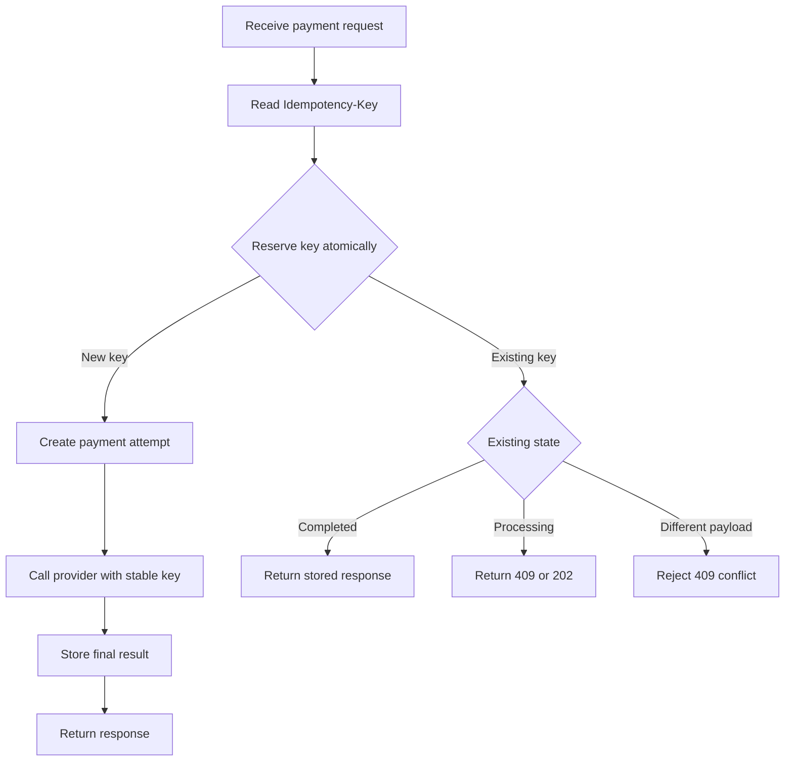
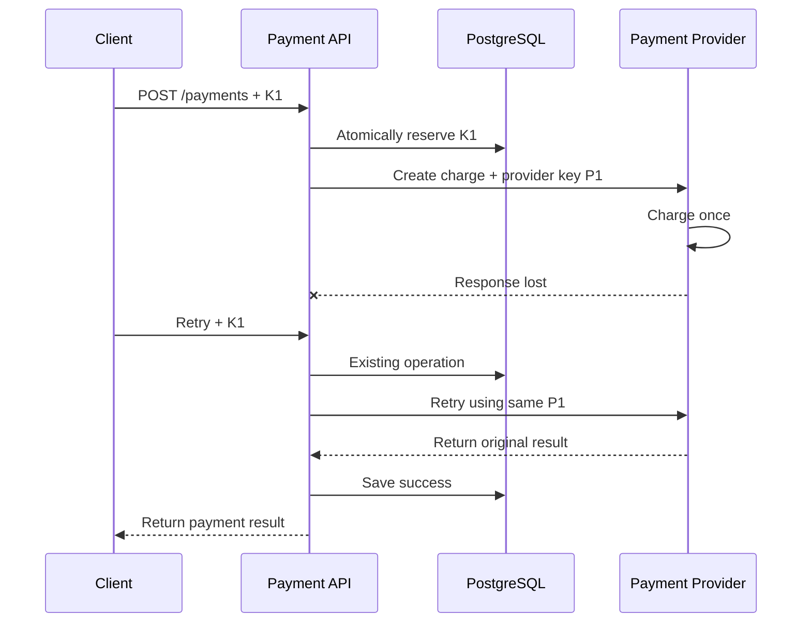
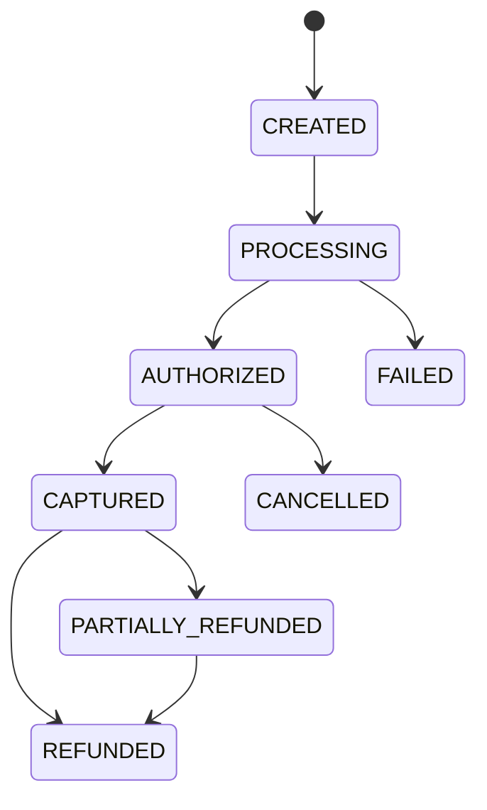

# Idempotency Keys in Payments

> Idempotency ensures that retrying the **same logical money-moving operation** does not charge, refund, capture, or transfer money twice.

## In Short

- One idempotency key represents **one logical operation**.
- Retries of that operation must reuse the **same key**.
- A new payment, capture, refund, or payout needs a **new key**.
- Store the key with a **request fingerprint, processing state, and final response**.
- Use a **database unique constraint** to make the first reservation atomic.
- If the same key arrives with a different payload, reject it as a conflict.
- Propagate a **stable idempotency key to the payment provider**.
- Idempotency prevents duplicate commands; payment state machines, webhook deduplication, and reconciliation solve different problems.
- In distributed systems, the practical goal is **exactly-once financial effect**, even when messages are delivered more than once.



---

# 1. Why Idempotency Matters

Payment systems operate across browsers, APIs, databases, queues, banks, and payment providers. Any network call can time out even though the operation succeeded.

Example:

1. Customer clicks **Pay ₹1,000**.
2. Your backend asks the payment provider to charge the customer.
3. The provider successfully charges the card.
4. The network connection fails before your backend receives the response.
5. Your backend does not know whether the charge succeeded.
6. The request is retried.

Without idempotency, the retry can create a second charge.

Idempotency gives the backend a reliable answer to:

> “Have I already processed this exact logical operation?”

Common uses include:

- Create payment
- Capture authorization
- Refund payment
- Create payout
- Transfer funds
- Reverse payment
- Apply wallet credit

---

# 2. How an Idempotency Key Works

A client generates a unique value and sends it with a mutating request.

```http
POST /payments
Idempotency-Key: 7ee53e58-fc90-4e2e-a8f8-c8a49d11660a
```

The server stores something conceptually like:

| Field | Example |
|---|---|
| Tenant | `merchant-42` |
| Operation | `CREATE_PAYMENT` |
| Idempotency key | `7ee53e58-...` |
| Request fingerprint | `sha256(...)` |
| State | `PROCESSING` / `SUCCEEDED` / `FAILED_FINAL` |
| Response status | `201` |
| Response body | Stored payment result |
| Provider reference | `pay_123` |

The key should normally be scoped by:

```text
tenant/account + operation + idempotency_key
```

This prevents the same raw key from colliding across merchants or different operations.

## 2.1 One Key = One Business Command

Do not reuse one key for the full payment lifecycle.

```text
Create payment  -> key K1
Capture payment -> key K2
Refund #1       -> key K3
Refund #2       -> key K4
```

Each command can move money independently, so each needs its own identity.

---

# 3. Atomic Reservation Is the Correctness Mechanism

A common implementation error is:

```text
1. SELECT key
2. If not found:
3.     INSERT key
4.     Process payment
```

Two application instances can execute the `SELECT` at the same time, both see no record, and both continue.

The database must decide who owns the operation.

```sql
CREATE UNIQUE INDEX uq_idempotency_scope
ON idempotency_records (
    tenant_id,
    operation,
    idempotency_key
);
```

Then reserve using an atomic insert such as PostgreSQL `INSERT ... ON CONFLICT`.

```sql
INSERT INTO idempotency_records (
    tenant_id,
    operation,
    idempotency_key,
    request_fingerprint,
    status
)
VALUES (
    :tenant_id,
    'CREATE_PAYMENT',
    :key,
    :fingerprint,
    'PROCESSING'
)
ON CONFLICT DO NOTHING;
```

If the insert succeeds, this request owns the operation.

If it conflicts, load the existing record and decide whether to replay, reject, or report that processing is still in progress.

> The **unique constraint**, not an application-level lookup, is the concurrency guard.

---

# 4. Request Fingerprinting

The idempotency key alone is not enough.

Suppose the client sends:

```text
K1 + ₹1,000 INR
```

and later accidentally sends:

```text
K1 + ₹2,000 INR
```

Returning the old ₹1,000 response would hide a client bug. Processing ₹2,000 would violate the meaning of K1.

The correct behavior is to reject the second request, commonly with `409 Conflict`.

A fingerprint should contain stable fields that define the financial effect, for example:

```text
tenant_id
operation
order_id
amount_minor
currency
destination/reference
```

Do not include unstable transport metadata such as:

```text
timestamp
trace_id
request_id
access token
```

Example:

```python
import hashlib
import json

def command_fingerprint(payload: dict) -> str:
    canonical = json.dumps(
        payload,
        sort_keys=True,
        separators=(",", ":"),
    )
    return hashlib.sha256(canonical.encode()).hexdigest()
```

Do not put PAN, CVV, bank credentials, email addresses, phone numbers, or other sensitive information inside the key.

---

# 5. Preserve Idempotency Across the Payment Provider

Making your own API idempotent is not enough.

If your service retries the provider call with a **new provider key**, the provider can still create a duplicate charge.



A provider key can be derived from a stable internal operation identifier:

```python
provider_key = f"create-payment:{payment_attempt_id}"
```

It must remain the same for every retry of that provider operation.

## 5.1 Avoid Long Database Transactions

Do not keep a database transaction open while waiting for an external payment provider.

Prefer:

```text
Transaction 1
  Reserve idempotency key
  Create payment attempt
Commit

Call provider using stable provider key

Transaction 2
  Store provider result
  Mark payment complete
Commit
```

This reduces lock duration, connection-pool pressure, and deadlock risk.

---

# 6. Handling Retries and Failure States

Idempotency makes retries safe, but retry policy still matters.

| Failure | Retry? | Key |
|---|---|---|
| Client/network timeout | Yes | Same key |
| Connection reset | Yes | Same key |
| Provider `429` | Usually yes, after delay | Same key |
| Provider `5xx` | Usually yes, provider policy permitting | Same key |
| Validation error | No until corrected | Usually new logical request |
| Card declined | Usually no automatic retry | New user-authorized attempt |
| Insufficient funds | Usually no automatic retry | New user-authorized attempt |
| Same key, different payload | No | Reject |
| Auth/authz failure | No until corrected | Do not loop |

Use capped exponential backoff with jitter for retryable failures.

A useful internal state model is:

```text
PROCESSING
SUCCEEDED
FAILED_FINAL
FAILED_RETRYABLE
```

Typical behavior:

- `SUCCEEDED` → return stored successful response.
- `FAILED_FINAL` → return stored permanent failure.
- `PROCESSING` → do not start a second operation; return `409` or `202`.
- `FAILED_RETRYABLE` → controlled continuation using the same logical operation identity.

---

# 7. Payment State Machine vs Idempotency

These concepts are related but not interchangeable.



| Mechanism | Responsibility |
|---|---|
| Idempotency key | Prevent duplicate execution of the same command |
| State machine | Prevent invalid state transitions |
| DB transaction | Keep local changes atomic |
| Provider idempotency | Prevent duplicate external side effects |
| Webhook deduplication | Prevent duplicate event processing |
| Reconciliation | Repair uncertain or inconsistent state |

Example:

- Repeating the same **capture** with the same key should not capture twice.
- Sending a new capture key for an already fully captured payment must still be rejected by the payment state machine.

---

# 8. Webhooks, Queues, and Exactly-Once Effect

Payment providers and message queues commonly use **at-least-once delivery**.

That means your application must assume that the same event can arrive more than once.

For provider webhooks, deduplicate using the provider's event ID.

```sql
CREATE TABLE processed_webhook_events (
    provider VARCHAR(50) NOT NULL,
    provider_event_id VARCHAR(255) NOT NULL,
    processed_at TIMESTAMPTZ NOT NULL DEFAULT NOW(),
    PRIMARY KEY (provider, provider_event_id)
);
```

A safe webhook flow is:

```text
Verify signature
    ↓
Insert provider event ID
    ↓
Duplicate?
 ┌──┴──┐
Yes    No
 ↓      ↓
2xx   Apply state change
        ↓
      Commit
        ↓
       2xx
```

The event insert and related local state update should normally happen in the same transaction.

For internal queues, carry stable IDs such as:

```text
HTTP request     -> idempotency key
Internal command -> command ID
Queue message    -> message/command ID
Provider call    -> provider idempotency key
Domain event     -> event ID
Webhook          -> provider event ID
Ledger posting   -> unique posting reference
```

The realistic distributed-systems goal is:

> A message may be delivered more than once, but the **financial effect happens once**.

---

# 9. Practical FastAPI + PostgreSQL Example

This example focuses on the essential request flow rather than full production infrastructure.

```python
from typing import Annotated
from fastapi import FastAPI, Header, HTTPException
from pydantic import BaseModel, Field

app = FastAPI()


class CreatePaymentRequest(BaseModel):
    order_id: str
    amount: int = Field(gt=0)  # minor units, e.g. paise
    currency: str


@app.post("/payments")
async def create_payment(
    payload: CreatePaymentRequest,
    idempotency_key: Annotated[
        str,
        Header(alias="Idempotency-Key"),
    ],
):
    fingerprint = command_fingerprint(payload.model_dump())

    reservation = await idempotency_repo.reserve(
        tenant_id=current_tenant.id,
        operation="CREATE_PAYMENT",
        key=idempotency_key,
        fingerprint=fingerprint,
    )

    if not reservation.created:
        existing = reservation.record

        if existing.fingerprint != fingerprint:
            raise HTTPException(
                status_code=409,
                detail="Idempotency key reused with different payload",
            )

        if existing.status in {"SUCCEEDED", "FAILED_FINAL"}:
            return existing.response_body

        if existing.status == "PROCESSING":
            raise HTTPException(
                status_code=409,
                detail="Request already processing",
            )

    payment = await payment_repo.get_or_create_attempt(
        tenant_id=current_tenant.id,
        order_id=payload.order_id,
        amount=payload.amount,
        currency=payload.currency,
    )

    provider_key = f"create-payment:{payment.id}"

    result = await payment_provider.create_payment(
        amount=payload.amount,
        currency=payload.currency,
        idempotency_key=provider_key,
    )

    response = {
        "payment_id": str(payment.id),
        "status": "SUCCEEDED",
        "provider_reference": result.reference,
    }

    await idempotency_repo.complete(
        key=idempotency_key,
        status="SUCCEEDED",
        response_body=response,
    )

    return response
```

Important production additions include authentication, authorization, provider-specific error mapping, metrics, tracing, webhook handling, and reconciliation.

---

# 10. Failure Window and Reconciliation

The hardest case is:

```text
Provider charged successfully
        ↓
Your process crashes
        ↓
Local database still says PROCESSING
```

Never interpret missing local success as proof that the customer was not charged.

Recovery strategies:

1. Retry the provider call using the **same provider idempotency key**.
2. Query the provider using your merchant/payment reference.
3. Process the provider webhook.
4. Reconcile stale `PROCESSING` records in a background worker.

A reconciliation worker can periodically:

```text
Find stale PROCESSING payments
        ↓
Query provider
        ↓
 ┌──────┼─────────┐
Success Failure  Unknown
  ↓       ↓        ↓
Update   Final    Keep pending
local    state    / alert
state
```

This is one reason payment systems need both idempotency and reconciliation.

---

# 11. Provider Behavior to Know

Provider behavior is not identical, so always verify the exact endpoint during implementation.

| Provider | Key/Header | Important behavior |
|---|---|---|
| Stripe | `Idempotency-Key` | All `POST` requests accept idempotency keys. Stripe stores the first result, including `500` responses. Keys can be removed after they are at least 24 hours old, and reused keys are checked against the original parameters. |
| Adyen | `idempotency-key` | Supports idempotency on `POST`. Keys are limited to 64 characters, UUIDs are recommended, and keys are valid for at least 7 days. Duplicate checking is scoped to the company account and does not extend across regional endpoints. |
| PayPal | `PayPal-Request-Id` | Supported REST `POST` APIs use a client-generated request ID. Retention is API-specific. A repeated request returns the latest status of the previous request, and simultaneous calls with the same ID can cause the later request to fail. |

Provider-specific behavior should stay behind an adapter so that your domain logic does not depend directly on one provider's rules.

---

# 12. Testing and Production Focus

The highest-value tests are:

### Sequential retry

```text
Request K1 -> provider called once -> 201
Retry K1   -> provider not called again -> same result
```

### Same key, different payload

```text
K1 + ₹1,000 -> success
K1 + ₹2,000 -> 409 conflict
```

### Concurrent duplicate requests

Send many requests using the same key and verify that only one logical payment operation reaches the provider.

### Provider succeeds but response is lost

Simulate a provider success followed by a timeout. Retrying with the same provider key must return the original provider operation, not create another charge.

### Duplicate webhook

Send the same provider event ID multiple times and confirm that the payment state and ledger effect change once.

Useful operational metrics include:

- Idempotency replay rate
- Payload-conflict count
- In-progress conflict count
- Provider retry/timeout count
- Stale `PROCESSING` records
- Duplicate webhook count
- Reconciliation corrections

---

# 13. Best Practices

- Require idempotency keys for important money-moving `POST` operations.
- Use high-entropy opaque values such as UUIDs.
- Scope keys by tenant/account and operation.
- Enforce uniqueness in the database.
- Compare a stable request fingerprint on replay.
- Store enough result data to return a consistent response.
- Reuse the same downstream provider key during retries.
- Do not hold database locks across provider network calls.
- Deduplicate provider webhooks by provider event ID.
- Use unique references for ledger postings.
- Reconcile uncertain payment states.
- Keep authorization checks in place when replaying stored responses.
- Retain keys longer than the supported retry window.
- Avoid sensitive information inside keys and logs.

---

# 14. Key Takeaway

Idempotency is not simply “store a request ID.”

A robust payment implementation combines:

```text
Idempotency key
      +
Atomic DB reservation
      +
Request fingerprint
      +
Stable provider key
      +
Payment state machine
      +
Webhook deduplication
      +
Reconciliation
```

Together, these mechanisms allow retries and duplicate delivery while keeping the **financial side effect effectively once**.

---

# 15. References

Official documentation checked for this guide:

- Stripe — Idempotent requests: https://docs.stripe.com/api/idempotent_requests
- Adyen — API idempotency: https://docs.adyen.com/development-resources/api-idempotency
- PayPal — Idempotency: https://developer.paypal.com/reference/guidelines/idempotency/
- AWS Well-Architected Framework — Make mutating operations idempotent: https://docs.aws.amazon.com/wellarchitected/latest/framework/rel_prevent_interaction_failure_idempotent.html

---

*Prepared for Payments & Fintech interview preparation and practical backend development.*
