# Mandates and Recurring Payments

> How customer consent becomes a reusable payment mandate, and how backend systems safely execute, retry, reconcile, and audit recurring payments.

## In Short

- A **mandate** is permission to attempt future debits. It does not mean a payment has succeeded.
- A **subscription** defines what and when to bill; an **invoice** represents what is owed; a **payment** represents collection; a **payment attempt** represents one provider request.
- The initial customer-approved transaction or setup is normally **on-session / customer-initiated (CIT)**. Later renewals are commonly **off-session / merchant-initiated (MIT)**.
- Before every recurring charge, validate mandate status, validity, currency, and amount limit.
- Use deterministic **idempotency keys** and database unique constraints so retries cannot create duplicate charges.
- Treat provider API responses as provisional when the payment rail is asynchronous; **webhooks and reconciliation** confirm final state.
- Retry only recoverable failures. A revoked mandate, invalid payment method, or amount above the mandate limit needs customer action rather than blind retrying.
- In India, the RBI's **Digital Payments – E-mandate Framework, 2026** applies to recurring payments through cards, PPIs, and UPI. General recurring transactions can be processed without fresh AFA up to ₹15,000, while insurance premiums, mutual-fund subscriptions, and credit-card bill payments have a ₹1,00,000 limit.

---

# Index

1. Overview
2. Core Terminology
3. Recurring Payment Models
4. On-Session, Off-Session, CIT, and MIT
5. End-to-End Recurring Payment Flow
6. Mandate and Payment Lifecycles
7. Recommended Domain Model
8. Reliable Billing and Payment Execution
9. Retries and Dunning
10. Cancellation, Plan Changes, and Payment-Method Updates
11. Reconciliation, Security, and Audit
12. India-Specific Recurring Payments
13. Practical Example
14. Testing, Observability, and Production Practices
15. References

---

# 1. Overview

A **recurring payment** is a payment collected repeatedly using instructions that the customer approved earlier.

Common use cases include:

- SaaS and OTT subscriptions
- Insurance premiums
- Loan or EMI repayments
- Utility bills
- Mutual-fund SIPs
- Membership fees
- Automatic wallet or transit-card replenishment

The important design principle is:

> Storing a payment method is not the same as having permission to debit it repeatedly.

A production system should separate customer consent, billing, payment execution, and settlement.

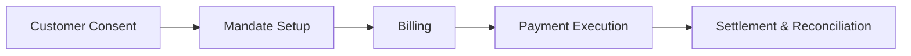

This separation makes retries, refunds, payment-method changes, reconciliation, and auditing much easier.

---

# 2. Core Terminology

## 2.1 Mandate

A **mandate** is the customer's authorization allowing future payment attempts.

Typical mandate data includes:

- Customer
- Merchant
- Payment method
- Fixed or variable amount
- Maximum amount
- Currency
- Frequency or trigger
- Valid-from and expiry time
- Consent evidence
- Provider mandate reference
- Revocation status

A mandate answers:

> **Are we allowed to attempt this debit?**

It does not answer whether the debit succeeded.

## 2.2 Subscription

A **subscription** is the commercial agreement describing:

- Plan
- Price
- Billing frequency
- Trial
- Renewal
- Tax
- Cancellation

It answers:

> **What should the customer be billed for, and when?**

## 2.3 Invoice

An **invoice** represents money owed for one billing period or event.

An invoice can exist even when automatic collection is unavailable or fails.

## 2.4 Payment and Payment Attempt

A **payment** represents collection for an invoice.

A **payment attempt** represents one request to a PSP, bank, card network, or payment rail.

One payment can have multiple attempts.

```text
Invoice
  └── Payment
       ├── Attempt 1 -> failed
       ├── Attempt 2 -> failed
       └── Attempt 3 -> succeeded
```

Each attempt should keep its own:

- Attempt number
- Idempotency key
- Provider payment ID
- Status
- Failure category
- Timestamps
- Sanitized provider response

## 2.5 Settlement

**Payment success** and **settlement** are separate concepts.

A payment may be authorized or marked successful before funds are finally settled to the merchant. Some rails can also return or reverse a payment later.

Therefore, payment status and settlement status should be tracked separately.

---

# 3. Recurring Payment Models

Recurring arrangements usually vary across two dimensions: **amount** and **schedule**.

| Model | Amount | Timing | Typical use |
|---|---|---|---|
| Fixed / Fixed | Fixed | Fixed | SaaS, gym, EMI |
| Variable / Fixed | Variable | Fixed | Utility bill |
| Fixed / Variable | Fixed | Event-driven | Auto-replenishment |
| Variable / Variable | Variable | Event-driven | Usage-based billing |

For variable payments, the mandate should usually include a customer-approved maximum amount.

Installments are related but different from open-ended subscriptions:

| Installment | Subscription |
|---|---|
| Usually has a fixed total | May continue indefinitely |
| Has a defined number of payments | Continues until cancelled or expired |
| Often linked to a purchase or loan | Linked to continued service |

---

# 4. On-Session, Off-Session, CIT, and MIT

## 4.1 On-Session Payment

The customer is actively present and can authenticate the transaction.

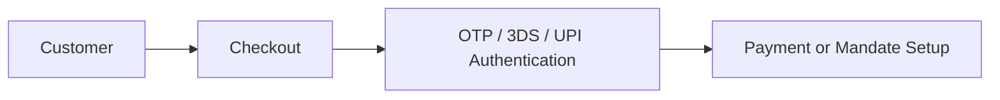

Typical examples:

- First subscription payment
- Mandate registration
- Manual payment of an overdue invoice
- Payment-method update

## 4.2 Off-Session Payment

The merchant initiates the charge later when the customer is not actively using the application.

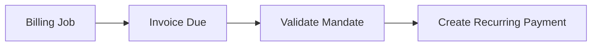

Off-session charging usually requires:

- Previously collected consent
- Reusable payment token or mandate reference
- Active mandate
- Correct recurring-payment indicators
- Recovery flow when fresh authentication is required

## 4.3 CIT and MIT

A **Customer-Initiated Transaction (CIT)** occurs while the customer participates.

A **Merchant-Initiated Transaction (MIT)** is initiated later by the merchant under an existing customer agreement.

Typical relationship:

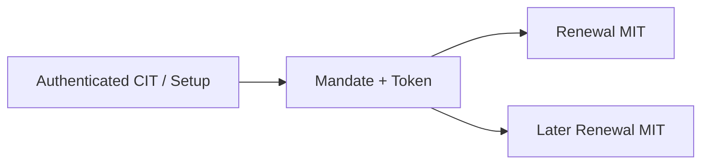

The initial authenticated setup establishes the permission that later recurring transactions rely on.

---

# 5. End-to-End Recurring Payment Flow

A clean recurring-payment flow has five stages.

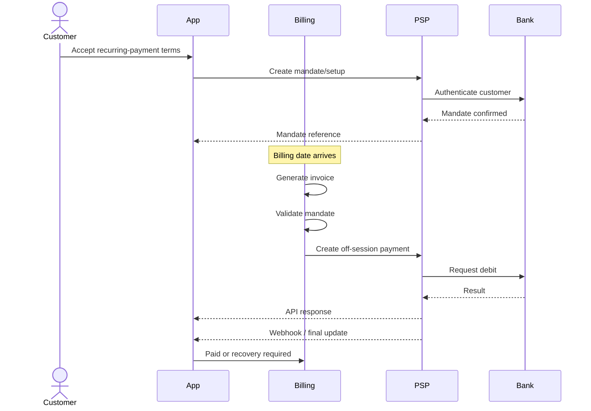

## 5.1 Consent and Setup

Capture:

- Amount or amount-calculation rule
- Maximum amount when relevant
- Frequency or trigger
- Validity period
- Cancellation/revocation policy
- Authentication result
- Consent version and timestamp

Activate the mandate only after the provider confirms successful registration.

## 5.2 Billing

The billing layer should:

1. Find obligations that are due.
2. Calculate subtotal, tax, discount, credit, and proration.
3. Create an invoice.
4. Freeze the invoice amount.
5. Trigger collection separately.

## 5.3 Payment Execution

Before contacting the provider:

1. Confirm the mandate is active.
2. Check validity dates.
3. Check currency.
4. Check maximum amount.
5. Create or reuse the correct payment attempt.
6. Send a deterministic idempotency key.
7. Persist provider references.

## 5.4 Recovery

When collection fails:

- Classify the failure.
- Retry only recoverable failures.
- Bring the customer on-session if authentication is required.
- Request a new payment method when necessary.
- Apply grace-period or suspension rules.

## 5.5 Reconciliation

Later, match internal records against provider and bank data to catch missed webhooks, returns, manual changes, or settlement mismatches.

---

# 6. Mandate and Payment Lifecycles

## 6.1 Mandate Lifecycle

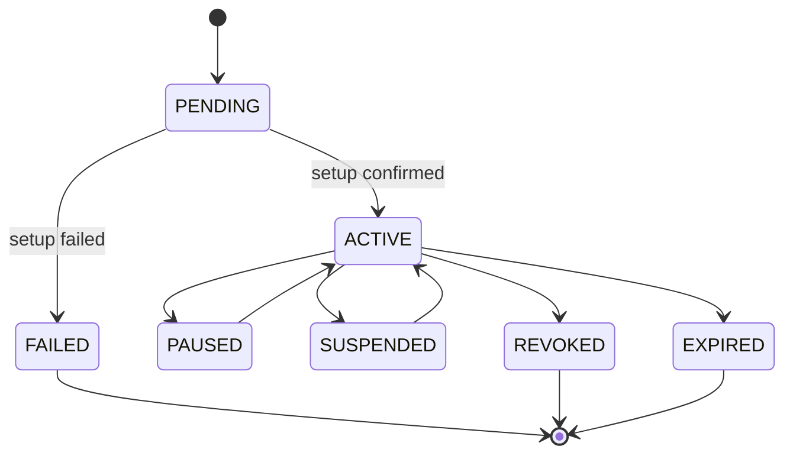

Useful states:

| Status | Meaning |
|---|---|
| `pending` | Registration started but not confirmed |
| `active` | Eligible for permitted recurring debits |
| `paused` | Temporarily disabled |
| `suspended` | Disabled by provider, risk, or compliance control |
| `revoked` | Customer permission withdrawn |
| `expired` | Validity ended |
| `failed` | Setup failed |

Important rules:

- Never debit under a `pending` mandate.
- Revocation must stop new recurring attempts.
- Do not silently reactivate expired or revoked mandates.
- Preserve old mandate versions for audit.

## 6.2 Payment Lifecycle

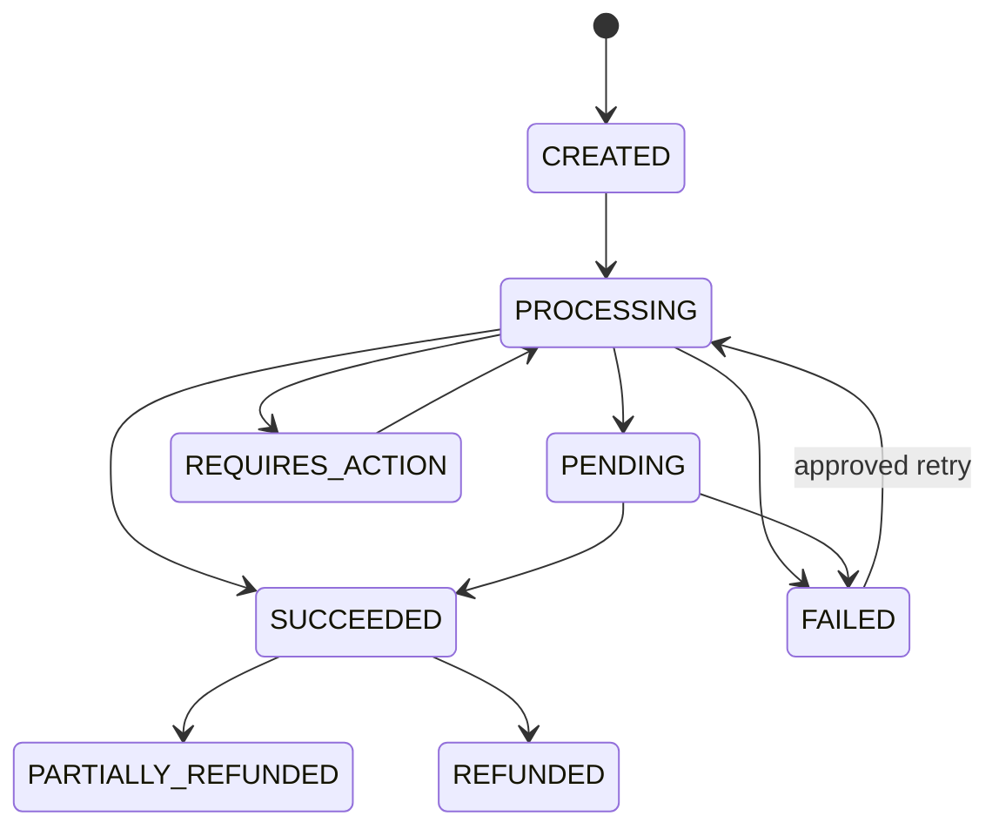

Avoid a simple `is_paid` Boolean. It cannot represent pending payments, authentication requirements, multiple attempts, returns, disputes, or partial refunds.

---

# 7. Recommended Domain Model

Keep the important business concepts separate.

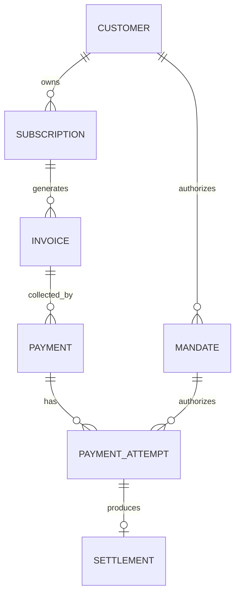

Typical entities:

```text
Customer
Subscription
Mandate
PaymentMethod
Invoice
Payment
PaymentAttempt
Refund
Dispute
Settlement
WebhookEvent
LedgerEntry
```

## 7.1 Important Database Constraints

Examples:

```sql
CREATE UNIQUE INDEX uq_payment_attempt_idempotency
ON payment_attempts(idempotency_key);
```

```sql
ALTER TABLE invoices
ADD CONSTRAINT uq_subscription_billing_period
UNIQUE (
    subscription_id,
    billing_period_start,
    billing_period_end
);
```

These constraints protect against concurrent workers and duplicate retries.

## 7.2 Store Money Safely

Store money in integer minor units, not floating point.

```text
₹499.50 -> 49,950 paise
$12.99  -> 1,299 cents
```

Keep explicit currency metadata because currencies do not all use the same number of minor units.

---

# 8. Reliable Billing and Payment Execution

## 8.1 Scheduler Design

Avoid one large midnight cron job that charges every customer in one process.

A scalable design is:

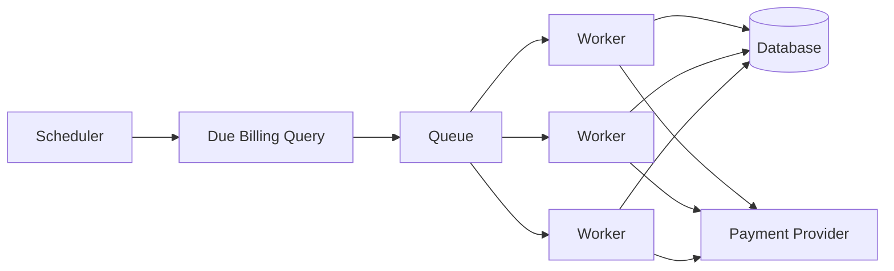

With PostgreSQL, workers can safely claim work:

```sql
SELECT id
FROM subscriptions
WHERE next_billing_at <= NOW()
  AND status = 'active'
ORDER BY next_billing_at
FOR UPDATE SKIP LOCKED
LIMIT 100;
```

Use the database transaction to claim/update work, then perform slow provider calls outside the long-running transaction.

## 8.2 Idempotency

A payment provider call can succeed even when your application times out before receiving the response.

Use one deterministic idempotency key per logical attempt:

```text
recurring-payment:{payment_id}:attempt:{attempt_number}
```

Rules:

- Retrying the **same attempt** must reuse the same key.
- A deliberate **new attempt** gets a new attempt number and key.
- Back the key with a database unique constraint.

## 8.3 Webhooks

The immediate API response may only say:

```text
processing
pending
submitted
requires_action
```

The final state may arrive later.

A safe webhook pipeline is:

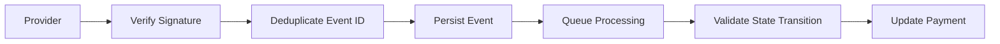

Webhook processing should:

- Verify the signature against the raw body.
- Deduplicate provider event IDs.
- Persist the event before business processing.
- Return HTTP success quickly.
- Process business logic asynchronously.
- Validate allowed state transitions.

Events can arrive out of order, so never blindly replace the current status with the newest-delivered webhook.

---

# 9. Retries and Dunning

Not every failure is retryable.

| Failure | Typical action |
|---|---|
| Issuer/service temporarily unavailable | Retry later |
| Insufficient funds | Retry according to dunning policy |
| Authentication required | Bring customer on-session |
| Expired/invalid payment method | Request update |
| Mandate revoked | Stop |
| Amount above mandate limit | Obtain new/updated consent |
| Fraud/risk block | Stop and review |
| Duplicate operation | Retrieve existing result |

**Dunning** is the recovery process after failed recurring collection.

It can include:

- Retry schedule
- Email/SMS/in-app notification
- Payment-method update
- Authentication recovery
- Grace period
- Service suspension
- Final cancellation

Example recovery states:

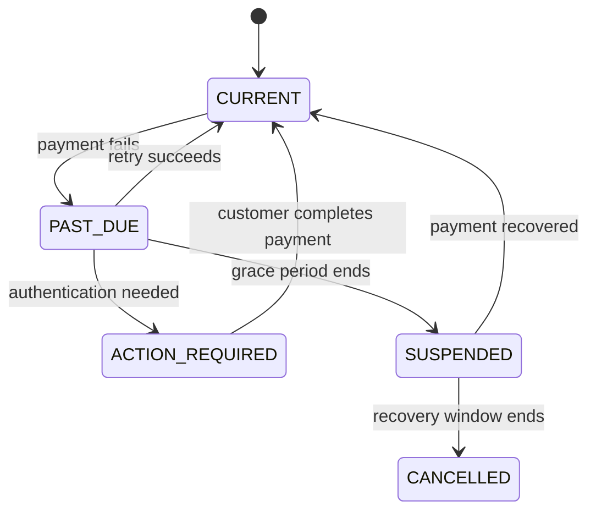

Keep subscription status separate from payment status. A payment can fail while the subscription remains active during a grace period.

---

# 10. Cancellation, Plan Changes, and Payment-Method Updates

## 10.1 Subscription Cancellation vs Mandate Revocation

They are different operations.

**Subscription cancellation**
- Stops future commercial renewal.

**Mandate revocation**
- Withdraws permission for future automatic debits.

A cancelled subscription can remain active until period end, while the mandate may still exist for outstanding obligations depending on the consent and business rules.

Use timestamps such as:

```text
cancel_requested_at
cancel_effective_at
mandate_revoked_at
```

rather than only Boolean flags.

## 10.2 Amount and Plan Changes

A new invoice must remain within the mandate's permitted amount.

```text
Invoice amount:   ₹799
Mandate maximum: ₹1,000
Result: eligible

Invoice amount: ₹1,099
Mandate maximum: ₹1,000
Result: new/updated authorization required
```

For fixed-amount mandates, increasing the charge may require fresh customer approval or a new mandate.

## 10.3 Payment-Method Update

Do not replace the current payment method before the new setup succeeds.

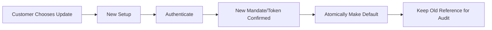

Some card-network/provider account-updater services can refresh reissued-card credentials, but the application should still support a customer-driven update flow.

---

# 11. Reconciliation, Security, and Audit

## 11.1 Reconciliation

Internal state can differ from provider state because of:

- Lost API responses
- Missed webhooks
- Duplicate events
- Provider-dashboard changes
- Refunds
- Returns
- Chargebacks
- Settlement timing
- Fees

Use three-way reconciliation where relevant:

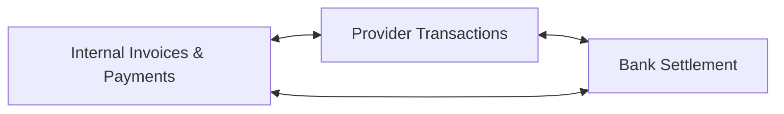

Prefer stable matching references:

- Provider payment ID
- Provider mandate ID
- Invoice number
- Merchant order ID
- Settlement batch ID
- Bank/rail reference

Do not reconcile only by amount and date.

## 11.2 Security

Do not store:

- Full card PAN
- CVV
- OTP
- Raw banking credentials
- Sensitive authentication secrets

Prefer:

- Hosted payment pages
- Provider SDKs
- Tokenized payment methods
- Masked display values
- Provider payment-method references

Mandates are security-sensitive because they represent permission to move money. Protect them using least-privilege access, encryption at rest, audit logging, and strict administrative authorization.

## 11.3 Consent Evidence

Keep enough information to prove what the customer accepted:

```text
customer_id
mandate_reference
consent_text_version
accepted_at
amount_rule
maximum_amount
frequency_rule
validity_period
cancellation_policy_version
authentication_reference
```

Avoid collecting unnecessary personal data.

---

# 12. India-Specific Recurring Payments

## 12.1 Common Payment Rails

### UPI AutoPay

UPI AutoPay allows customers to create recurring e-mandates through supported UPI applications.

Common uses include:

- Utility bills
- OTT subscriptions
- EMI payments
- Insurance
- Mutual funds

NPCI supports customer controls such as pause, unpause, modify, and revoke.

### NACH / e-NACH

NACH is designed for high-volume repetitive interbank transactions.

Common debit use cases include:

- Loan repayments
- Insurance premiums
- Mutual-fund SIPs
- Utility collections

Compared with instant payment methods, NACH processing can involve clearing cycles, returns, and settlement files, so asynchronous status handling and reconciliation are important.

### Card E-Mandates

Card e-mandates support recurring card transactions after an authenticated setup.

Applications should use tokenized card references and the recurring-payment capabilities provided by the PSP/acquirer.

## 12.2 RBI Digital Payments – E-mandate Framework, 2026

The RBI issued the **Digital Payments – E-mandate Framework, 2026** on **21 April 2026**. It consolidates earlier e-mandate instructions and applies to recurring domestic and cross-border transactions using:

- Cards
- Prepaid Payment Instruments (PPIs)
- UPI

### Registration and Authentication

The framework requires authenticated mandate registration.

The mandate should capture items such as:

- Validity period
- Fixed or variable amount
- Maximum amount for variable mandates
- Customer notification preference

The first transaction requires AFA, with combined registration/first-transaction authentication possible when processed together.

### Pre-Transaction Notification

The issuer normally sends a pre-debit notification at least **24 hours before** the charge.

The customer should be able to opt out of the transaction or revoke the mandate.

Auto-replenishment mandates for **FASTag** and **NCMC** are exempt from the normal pre-debit notification requirement.

### AFA Limits

As of **20 August 2026**:

| Category | Recurring amount allowed without fresh AFA |
|---|---:|
| General recurring transactions | Up to ₹15,000 per transaction |
| Insurance premium | Up to ₹1,00,000 per transaction |
| Mutual-fund subscription | Up to ₹1,00,000 per transaction |
| Credit-card bill payment | Up to ₹1,00,000 per transaction |

Transactions above the applicable threshold require AFA.

These are regulatory ceilings. A provider, issuer, merchant, or customer mandate can impose a lower limit.

### Backend Design Impact

Do not scatter hard-coded regulatory amounts across services.

Use versioned configuration:

```python
AFA_LIMITS = {
    "effective_from": "2026-04-21",
    "currency": "INR",
    "general_minor": 1_500_000,
    "insurance_minor": 10_000_000,
    "mutual_fund_minor": 10_000_000,
    "credit_card_bill_minor": 10_000_000,
}
```

A production system should also support:

- Mandate validity
- Customer-defined maximum amount
- Pre-debit scheduling
- Transaction-level opt-out
- Mandate revocation
- AFA-required recovery
- Domestic/cross-border classification
- Notification references
- Dispute and grievance references

---

# 13. Practical Example

Consider a SaaS plan costing **₹799 per month**.

The customer approves a variable UPI AutoPay mandate with a maximum of **₹1,000 per month**.

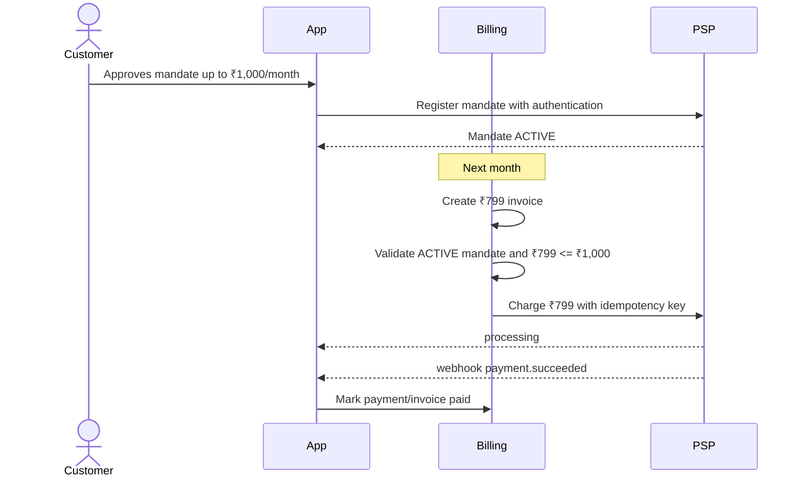

Later, the plan price becomes **₹1,099**.

The subscription may allow the commercial price change, but the payment system must still compare the invoice against the mandate:

```text
Invoice: ₹1,099
Mandate maximum: ₹1,000
```

The system should **not** blindly attempt the debit. It should move the customer into an authorization/update flow first.

This example shows why subscription rules and mandate rules must remain separate.

---

# 14. Testing, Observability, and Production Practices

## 14.1 Testing

### Unit Tests

Focus on business rules:

- Mandate state
- Validity dates
- Currency match
- Maximum amount
- Retry eligibility
- State transitions
- Proration
- Next billing date
- Regulatory-limit selection

### Integration Tests

Cover:

- Database unique constraints
- `FOR UPDATE SKIP LOCKED`
- Outbox publishing
- Provider adapter
- Webhook signature verification
- Duplicate webhook handling
- Transaction rollback
- Reconciliation import

### End-to-End Scenarios

Important flows include:

```text
Mandate registration succeeds
Recurring renewal succeeds
Authentication is required
Insufficient funds -> retry -> success
Mandate revoked before debit
Amount exceeds mandate limit
Webhook delivered twice
Webhook arrives out of order
API times out after provider success
Payment stays pending
Payment succeeds and is later returned
Payment method is updated
Subscription cancels at period end
```

Use a controllable clock for month-end, trial expiry, mandate expiry, and retry-schedule tests.

## 14.2 Observability

Useful metrics:

```text
Mandate registration success rate
Recurring payment success rate
First-attempt success rate
Recovery success rate
Authentication-required rate
Issuer decline rate
Webhook processing latency
Duplicate webhook count
Pending-payment duration
Settlement delay
Reconciliation mismatch count
Refund/dispute rate
```

Break metrics down by provider, payment method, issuer/bank, currency, amount bucket, retry number, and error code.

## 14.3 Production Practices

Keep these rules in mind:

1. **Separate billing from collection.** Billing decides what is owed; payment decides how to collect it.
2. **Use an outbox or durable workflow.** Do not rely on a database commit and queue publish succeeding independently.
3. **Keep provider-specific states at the integration boundary.** Map them into stable internal statuses.
4. **Prefer explicit state transitions.** Use operations such as `activate_mandate()` and `schedule_retry()` rather than arbitrary status assignment.
5. **Preserve financial history.** Do not rewrite failed attempts into successful ones; create a new attempt.
6. **Keep regulatory rules configurable and versioned.**
7. **Design for provider downtime.** Use timeouts, circuit breakers, bounded retries, queue back-pressure, and reconciliation after recovery.
8. **Provide audited operations tools.** Support safe webhook replay, provider resync, eligible retry, mandate inspection, and reconciliation.

---

# 15. References

Official/current references used for this topic:

1. Reserve Bank of India — **Digital Payments – E-mandate Framework, 2026**, issued 21 April 2026  
   https://www.rbi.org.in/Scripts/BS_ViewMasDirections.aspx?id=13374

2. Reserve Bank of India — **Processing of e-mandates for recurring transactions**, 22 August 2024  
   https://www.rbi.org.in/scripts/bs_circularindexdisplay.aspx/Scripts/BS_CircularIndexDisplay.aspx?Id=12722

3. NPCI — **UPI AutoPay**  
   https://www.npci.org.in/product/autopay

4. NPCI — **NACH**  
   https://www.npci.org.in/product/nach/about-nach

> Payment and regulatory requirements change over time. Production integrations should always be checked against the current RBI, NPCI, acquirer, issuer, PSP, and card-network documentation.
