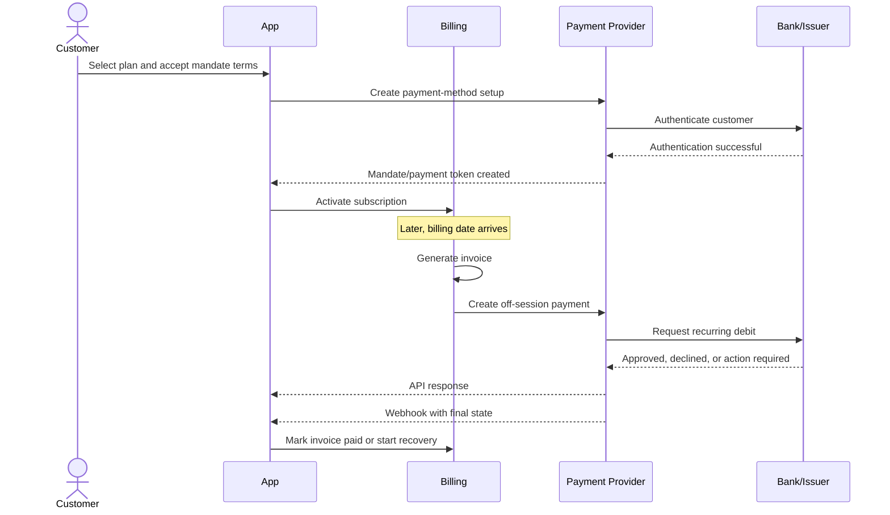
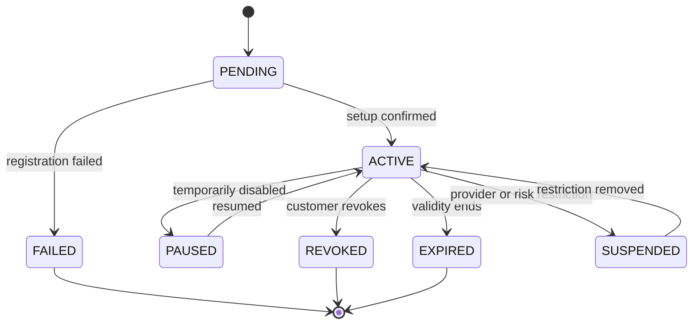
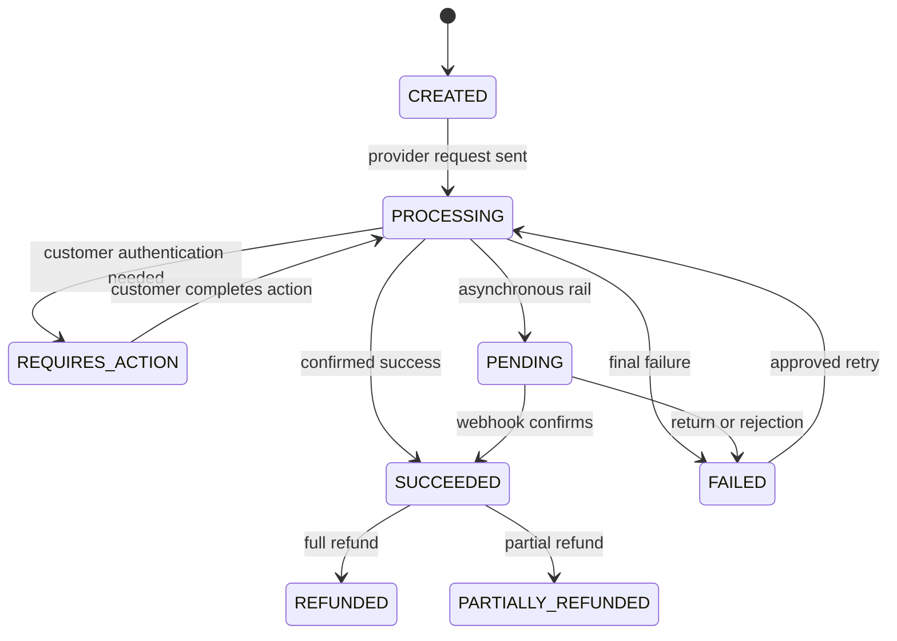
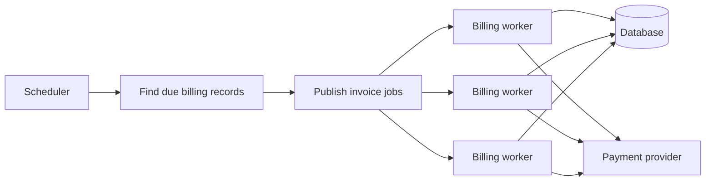
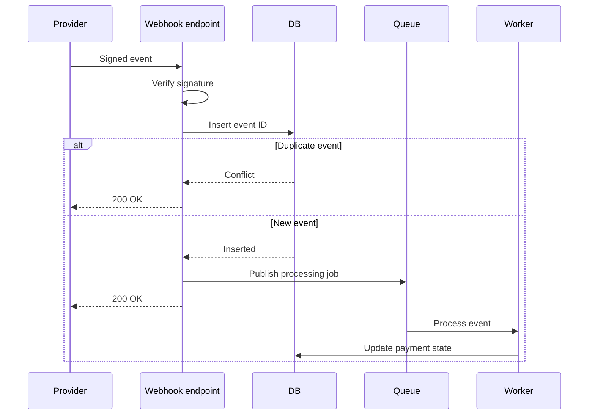
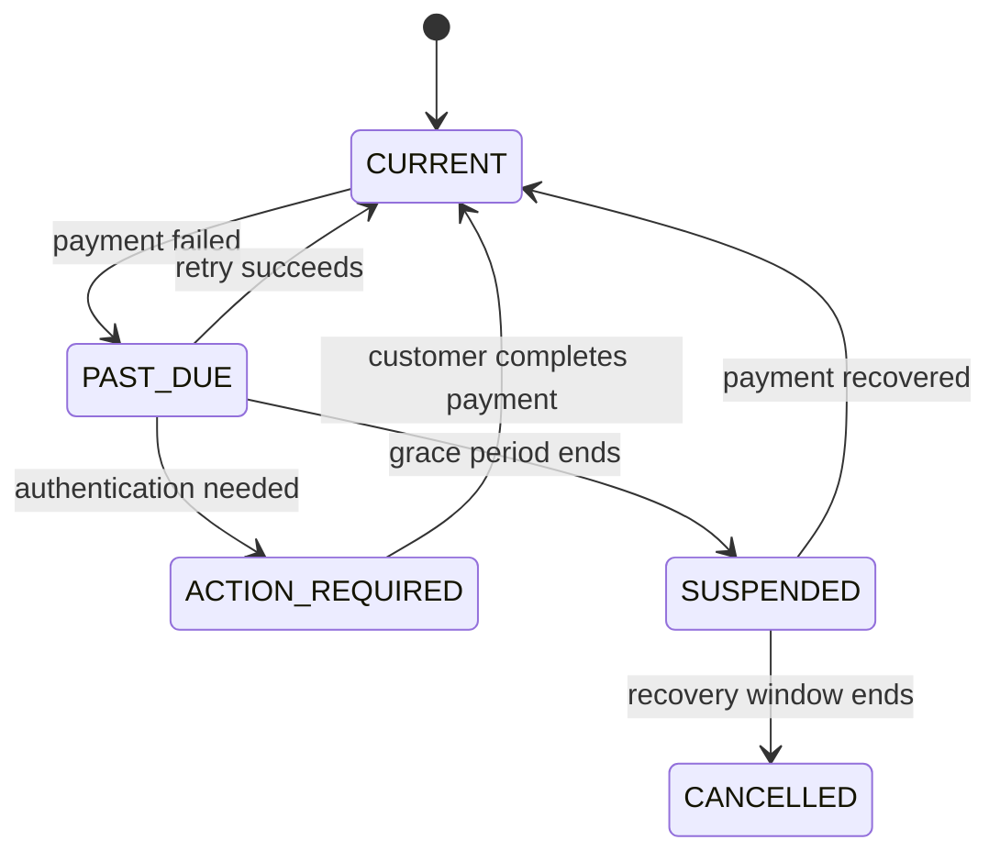
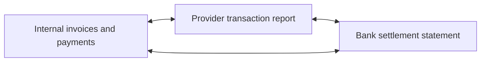
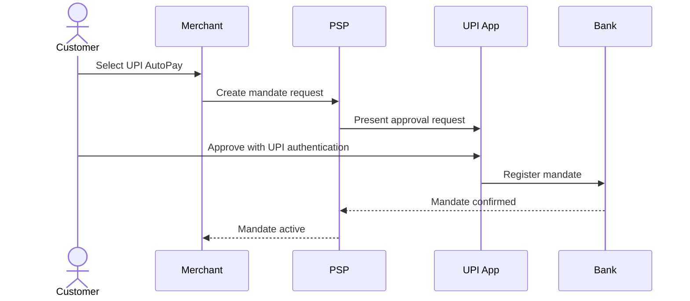

# Mandates and Recurring Payments

> **Category:** Payments & Fintech  
> **Audience:** Backend developers with 3+ years of experience  
> **Last reviewed:** 3 August 2026

---

## Table of Contents

1. [Overview](#1-overview)
2. [Core Terminology](#2-core-terminology)
3. [Mandate vs Subscription vs Payment](#3-mandate-vs-subscription-vs-payment)
4. [Types of Recurring Payment Arrangements](#4-types-of-recurring-payment-arrangements)
5. [On-Session and Off-Session Payments](#5-on-session-and-off-session-payments)
6. [Customer-Initiated and Merchant-Initiated Transactions](#6-customer-initiated-and-merchant-initiated-transactions)
7. [End-to-End Recurring Payment Flow](#7-end-to-end-recurring-payment-flow)
8. [Mandate Lifecycle](#8-mandate-lifecycle)
9. [Recurring Payment Lifecycle](#9-recurring-payment-lifecycle)
10. [Recommended Domain Model](#10-recommended-domain-model)
11. [Scheduling and Invoice Generation](#11-scheduling-and-invoice-generation)
12. [Idempotency and Duplicate Prevention](#12-idempotency-and-duplicate-prevention)
13. [Webhooks and Asynchronous Processing](#13-webhooks-and-asynchronous-processing)
14. [Retries, Dunning, and Recovery](#14-retries-dunning-and-recovery)
15. [Amount Changes, Plan Changes, and Proration](#15-amount-changes-plan-changes-and-proration)
16. [Cancellation and Revocation](#16-cancellation-and-revocation)
17. [Payment Method Updates](#17-payment-method-updates)
18. [Reconciliation and Settlement](#18-reconciliation-and-settlement)
19. [Security and Compliance](#19-security-and-compliance)
20. [India-Specific Mandate Systems](#20-india-specific-mandate-systems)
21. [RBI E-Mandate Framework 2026](#21-rbi-e-mandate-framework-2026)
22. [API Design Example](#22-api-design-example)
23. [Backend Implementation Example](#23-backend-implementation-example)
24. [Observability and Operational Metrics](#24-observability-and-operational-metrics)
25. [Testing Strategy](#25-testing-strategy)
26. [Production Best Practices](#26-production-best-practices)
27. [Key Takeaways](#27-key-takeaways)
28. [References](#28-references)

---

# 1. Overview

A **recurring payment** is a payment collected repeatedly using previously approved customer instructions.

Common examples include:

- Monthly software subscriptions
- Insurance premiums
- Loan or EMI repayments
- Utility bills
- Mutual fund SIPs
- Membership fees
- Automatic wallet or transit-card top-ups

The most important idea is:

> A business should not repeatedly debit a customer merely because it has stored a payment method. It needs valid customer consent, represented by a mandate or equivalent agreement.

A reliable recurring-payment system usually contains four separate concerns:

```text
Customer consent
      ↓
Mandate or payment-method setup
      ↓
Billing or obligation calculation
      ↓
Payment execution and settlement
```

These concerns should remain separate in the data model and application code.

---

# 2. Core Terminology

## 2.1 Mandate

A **mandate** is the customer's authorization allowing a merchant or payment provider to initiate future payments.

A mandate normally defines:

- Customer or payer
- Merchant or beneficiary
- Payment method
- Fixed or variable amount
- Maximum permitted amount
- Frequency or payment conditions
- Start and expiry dates
- Purpose of the debit
- Customer consent evidence
- Cancellation or revocation rules

A mandate is permission to attempt a payment. It is **not** proof that a payment succeeded.

---

## 2.2 Recurring Payment

A recurring payment is an individual debit performed under an active mandate or payment agreement.

For example:

```text
Mandate:
"Allow StreamBox to debit up to ₹999 monthly until cancelled."

Recurring payments:
1 January  → ₹499
1 February → ₹499
1 March    → ₹599 after plan upgrade
```

One mandate can therefore be associated with many payment attempts.

---

## 2.3 Subscription

A **subscription** is a commercial agreement for continued access to a product or service.

It may contain:

- Plan
- Billing frequency
- Quantity
- Price
- Trial period
- Renewal rules
- Tax rules
- Cancellation policy

A subscription creates billing obligations. The mandate authorizes collection of those obligations.

---

## 2.4 Invoice

An **invoice** represents money owed for a billing period or event.

An invoice can exist even when:

- No mandate is available
- The payment method has expired
- Automatic collection fails
- The customer must pay manually

---

## 2.5 Payment Attempt

A payment attempt is one request sent to a payment provider, bank, card network, or payment rail.

A single invoice may have multiple attempts:

```text
Invoice INV-1007: ₹999

Attempt 1 → insufficient funds
Attempt 2 → issuer unavailable
Attempt 3 → succeeded
```

Each attempt needs its own identifier, status, timestamps, and provider response.

---

## 2.6 Settlement

**Payment success** and **settlement** are not always the same moment.

- A card authorization may succeed immediately.
- Capture may happen later.
- Bank debit methods may remain pending.
- A settled debit can sometimes be returned later.
- Funds may reach the merchant after fees and settlement delays.

A production system should track payment status and settlement status separately.

---

# 3. Mandate vs Subscription vs Payment

| Concept | Main responsibility | Typical lifetime |
|---|---|---|
| Subscription | Defines what and when to bill | Months or years |
| Mandate | Provides permission to collect | Until expiry or revocation |
| Invoice | Represents an amount due | One billing cycle |
| Payment | Transfers money for an invoice | One transaction |
| Payment attempt | Records one execution attempt | Seconds to days |
| Settlement | Records movement of funds to merchant | Days |

## Relationship Diagram


A common design error is to store everything in a single `subscriptions` table. That makes retries, multiple payment methods, refunds, reconciliation, and auditing difficult.

---

# 4. Types of Recurring Payment Arrangements

Recurring arrangements can be classified by amount and timing.

## 4.1 Fixed Amount and Fixed Schedule

Example:

```text
₹499 on the first day of every month
```

Typical use cases:

- OTT subscription
- Gym membership
- Fixed EMI

This is the simplest model.

---

## 4.2 Variable Amount and Fixed Schedule

Example:

```text
Electricity bill collected monthly, up to ₹10,000
```

The date is predictable, but the amount changes.

The mandate should usually contain a maximum amount.

---

## 4.3 Fixed Amount and Variable Schedule

Example:

```text
Top up ₹500 whenever FASTag balance falls below ₹200
```

The amount is known, but the execution date depends on an event.

This is sometimes called:

- Event-triggered payment
- Unscheduled recurring payment
- Automatic replenishment

---

## 4.4 Variable Amount and Variable Schedule

Example:

```text
Charge actual cloud usage whenever outstanding usage reaches ₹5,000
```

This model needs the strongest controls because neither date nor amount is completely fixed.

The consent text should clearly explain:

- How the amount is calculated
- Maximum amount
- Trigger conditions
- Notification rules
- Cancellation process

---

## 4.5 Installment Payments

Installments have a known total and usually a fixed number of debits.

Example:

```text
Purchase total: ₹60,000
Schedule: 6 monthly payments of ₹10,000
```

Installments differ from open-ended subscriptions:

| Installment | Subscription |
|---|---|
| Usually has a fixed total | May continue indefinitely |
| Has a defined number of payments | Ends when cancelled or expired |
| Often linked to a loan or purchase | Linked to continued service |

---

# 5. On-Session and Off-Session Payments

## 5.1 On-Session Payment

The customer is actively using the application and can complete authentication.

Example:

```text
Customer opens checkout
→ selects a card
→ enters OTP or completes 3DS
→ confirms payment
```

---

## 5.2 Off-Session Payment

The customer is not actively present when the payment is initiated.

Example:

```text
01:00 AM subscription job
→ invoice becomes due
→ backend initiates payment
→ customer is not in the application
```

Recurring payments are commonly off-session.

An off-session payment normally requires:

- Previously collected consent
- A reusable token or payment-method reference
- A valid mandate
- Correct recurring-payment indicators
- A recovery flow when authentication is required

---

## 5.3 Why the Difference Matters

Banks and networks treat an off-session charge differently because the customer cannot immediately authenticate it.

A properly configured mandate helps the issuer understand:

- The customer previously approved the arrangement
- The merchant is initiating a permitted recurring debit
- The payment belongs to an existing agreement

Even with a valid mandate, an issuer can still decline the payment or request fresh authentication.

---

# 6. Customer-Initiated and Merchant-Initiated Transactions

## 6.1 Customer-Initiated Transaction — CIT

A **CIT** is initiated while the customer is participating.

Examples:

- First subscription payment
- Mandate registration with authentication
- Customer manually pays an overdue invoice
- Customer updates and verifies a card

---

## 6.2 Merchant-Initiated Transaction — MIT

An **MIT** is initiated by the merchant based on a previous customer agreement.

Examples:

- Subscription renewal
- Delayed hotel charge
- Usage-based cloud bill
- Unscheduled top-up
- Installment collection

## Typical Relationship

```text
Initial authenticated CIT
          ↓
Payment method saved and mandate created
          ↓
Future MITs reference the previous agreement
```

The first transaction or setup flow should establish the consent and authentication required for later merchant-initiated payments.

---

# 7. End-to-End Recurring Payment Flow



## Main Phases

### Phase 1: Consent and Setup

1. Show amount or amount-calculation method.
2. Show frequency or trigger condition.
3. Show cancellation policy.
4. Collect explicit consent.
5. Complete required authentication.
6. Store provider references and consent evidence.
7. Activate the mandate only after confirmation.

### Phase 2: Billing

1. Determine which subscriptions or obligations are due.
2. Calculate subtotal, tax, discounts, credits, and proration.
3. Generate an immutable invoice.
4. Freeze the amount to be collected for that invoice.

### Phase 3: Payment Execution

1. Validate mandate status and limits.
2. Create a payment record.
3. send the provider request with an idempotency key.
4. Treat the immediate response as provisional when required.
5. Consume webhooks for authoritative updates.

### Phase 4: Recovery

1. Classify failures.
2. Retry only recoverable failures.
3. Ask the customer to authenticate when required.
4. Request a new payment method when necessary.
5. Suspend or cancel service according to business policy.

### Phase 5: Reconciliation

1. Match internal payments with provider transactions.
2. Match settlements, fees, refunds, disputes, and returns.
3. Investigate unmatched records.
4. Preserve an audit trail.

---

# 8. Mandate Lifecycle

A mandate should have an explicit state machine.



## Recommended Statuses

| Status | Meaning |
|---|---|
| `pending` | Registration started but not confirmed |
| `active` | Can authorize eligible recurring debits |
| `paused` | Temporarily disabled by customer or merchant |
| `suspended` | Disabled because of risk, compliance, or provider action |
| `revoked` | Consent permanently withdrawn |
| `expired` | Mandate validity has ended |
| `failed` | Setup did not complete |

## Important Rules

- Do not treat `pending` as permission to debit.
- Revocation should stop new payment initiation immediately.
- Expired mandates should never be silently reactivated.
- A new consent event should create a new mandate version.
- Preserve old mandates for audit rather than overwriting history.

---

# 9. Recurring Payment Lifecycle



Do not use only a Boolean such as `is_paid`.

A Boolean cannot represent:

- Pending bank debit
- Authentication required
- Partial refund
- Return after apparent success
- Multiple attempts
- Dispute
- Reversal

---

# 10. Recommended Domain Model

## 10.1 Main Entities

```text
Customer
Subscription
Mandate
PaymentMethod
Invoice
Payment
PaymentAttempt
Refund
Dispute
Settlement
WebhookEvent
LedgerEntry
```

## 10.2 Example Tables

### `mandates`

```sql
CREATE TABLE mandates (
    id UUID PRIMARY KEY,
    customer_id UUID NOT NULL,
    provider VARCHAR(50) NOT NULL,
    provider_mandate_id VARCHAR(255),
    payment_method_id UUID NOT NULL,

    mandate_type VARCHAR(30) NOT NULL,
    amount_type VARCHAR(20) NOT NULL,
    fixed_amount_minor BIGINT,
    maximum_amount_minor BIGINT,
    currency CHAR(3) NOT NULL,

    frequency VARCHAR(30),
    start_at TIMESTAMPTZ,
    expires_at TIMESTAMPTZ,

    status VARCHAR(20) NOT NULL,
    consent_text_version VARCHAR(50) NOT NULL,
    consent_captured_at TIMESTAMPTZ NOT NULL,
    consent_ip_hash VARCHAR(128),
    provider_payload JSONB,

    created_at TIMESTAMPTZ NOT NULL,
    updated_at TIMESTAMPTZ NOT NULL
);
```

### `invoices`

```sql
CREATE TABLE invoices (
    id UUID PRIMARY KEY,
    customer_id UUID NOT NULL,
    subscription_id UUID,
    invoice_number VARCHAR(50) UNIQUE NOT NULL,

    currency CHAR(3) NOT NULL,
    subtotal_minor BIGINT NOT NULL,
    tax_minor BIGINT NOT NULL DEFAULT 0,
    discount_minor BIGINT NOT NULL DEFAULT 0,
    total_minor BIGINT NOT NULL,

    due_at TIMESTAMPTZ NOT NULL,
    status VARCHAR(30) NOT NULL,
    billing_period_start TIMESTAMPTZ,
    billing_period_end TIMESTAMPTZ,

    created_at TIMESTAMPTZ NOT NULL,
    finalized_at TIMESTAMPTZ,
    paid_at TIMESTAMPTZ
);
```

### `payment_attempts`

```sql
CREATE TABLE payment_attempts (
    id UUID PRIMARY KEY,
    payment_id UUID NOT NULL,
    attempt_number INTEGER NOT NULL,

    provider VARCHAR(50) NOT NULL,
    provider_payment_id VARCHAR(255),
    idempotency_key VARCHAR(255) UNIQUE NOT NULL,

    amount_minor BIGINT NOT NULL,
    currency CHAR(3) NOT NULL,
    status VARCHAR(30) NOT NULL,

    failure_category VARCHAR(50),
    failure_code VARCHAR(100),
    failure_message TEXT,
    requires_customer_action BOOLEAN NOT NULL DEFAULT FALSE,

    requested_at TIMESTAMPTZ NOT NULL,
    completed_at TIMESTAMPTZ,
    provider_payload JSONB,

    UNIQUE (payment_id, attempt_number)
);
```

## 10.3 Store Money in Minor Units

Use integer minor units rather than floating-point numbers.

```text
₹499.50 → 49950 paise
$12.99  → 1299 cents
```

Avoid:

```python
amount = 499.50
```

Prefer:

```python
amount_minor = 49_950
currency = "INR"
```

The number of minor units depends on the currency, so maintain currency metadata.

---

# 11. Scheduling and Invoice Generation

## 11.1 Do Not Use a Single Large Cron Job

A simple implementation may begin as:

```text
Every midnight:
Find all due subscriptions
Charge all customers
```

This becomes risky at scale because:

- The job can time out.
- A restart can duplicate work.
- All traffic is concentrated at one time.
- Failed records can block the batch.
- Time-zone handling becomes difficult.

## 11.2 Recommended Design



## 11.3 Claim Work Safely

In PostgreSQL, multiple workers can claim due records using row locking:

```sql
SELECT id
FROM subscriptions
WHERE next_billing_at <= NOW()
  AND status = 'active'
ORDER BY next_billing_at
FOR UPDATE SKIP LOCKED
LIMIT 100;
```

Within the transaction:

1. Lock due subscriptions.
2. Advance `next_billing_at`.
3. Create invoice-generation jobs or invoice records.
4. Commit.
5. Process provider calls outside long database transactions.

## 11.4 Unique Billing Constraint

Prevent duplicate invoices using a business key:

```sql
ALTER TABLE invoices
ADD CONSTRAINT unique_subscription_period
UNIQUE (
    subscription_id,
    billing_period_start,
    billing_period_end
);
```

Even if the scheduler runs twice, only one invoice can be created for the same period.

## 11.5 Time-Zone Rules

Store timestamps in UTC but retain the customer's billing time zone.

Example:

```text
Customer billing rule: 09:00 Asia/Kolkata on the 5th
Stored execution timestamp: calculated UTC instant
```

Be explicit about:

- Month-end handling
- Leap years
- Daylight-saving changes
- Failed execution on holidays
- Billing date after a plan change

---

# 12. Idempotency and Duplicate Prevention

Recurring systems run in distributed environments where timeouts and retries are normal.

A request can succeed at the provider even if your application never receives the response.

## 12.1 Failure Scenario

```text
Backend → provider: charge ₹999
Provider: payment succeeds
Network: response lost
Backend: assumes failure
Backend retries without same idempotency key
Result: customer may be charged twice
```

## 12.2 Idempotency Key Design

Use a deterministic key for one logical operation.

```text
recurring-payment:{payment_id}:attempt:{attempt_number}
```

Example:

```text
recurring-payment:pay_7d19:attempt:1
```

The same attempt must always reuse the same key.

A new deliberate retry should normally have:

- A new attempt record
- A new attempt number
- A new idempotency key

## 12.3 Database Protection

Use unique constraints as the final safety layer:

```sql
CREATE UNIQUE INDEX uq_payment_attempt_idempotency
ON payment_attempts(idempotency_key);
```

Application checks alone are insufficient because concurrent requests can pass the check at the same time.

## 12.4 Idempotent Event Handling

Webhook events may be delivered more than once.

```sql
CREATE TABLE webhook_events (
    provider VARCHAR(50) NOT NULL,
    provider_event_id VARCHAR(255) NOT NULL,
    event_type VARCHAR(100) NOT NULL,
    payload JSONB NOT NULL,
    status VARCHAR(20) NOT NULL,
    received_at TIMESTAMPTZ NOT NULL,
    processed_at TIMESTAMPTZ,
    PRIMARY KEY (provider, provider_event_id)
);
```

Insert the provider event ID before processing. If the insert conflicts, the event has already been received.

---

# 13. Webhooks and Asynchronous Processing

## 13.1 Why Webhooks Matter

The synchronous API response is not always the final payment result.

A provider can respond:

```text
processing
pending
requires_action
submitted
```

The final state may arrive later through a webhook.

## 13.2 Safe Webhook Flow



## 13.3 Webhook Endpoint Responsibilities

The HTTP endpoint should:

1. Read the raw request body.
2. Verify the provider signature.
3. Reject invalid timestamps or signatures.
4. Store the event durably.
5. Return quickly.
6. Process business logic asynchronously.

Avoid making slow external calls before returning the HTTP response.

## 13.4 Events Can Arrive Out of Order

Example:

```text
payment.succeeded received at 10:00:02
payment.processing received at 10:00:04
```

Blindly applying the second event would move the payment backward.

Use one or more of:

- Provider event creation time
- State-transition validation
- Provider object version
- Current-state retrieval from provider
- Monotonic status rules

Example:

```python
ALLOWED_TRANSITIONS = {
    "created": {"processing", "failed"},
    "processing": {"pending", "succeeded", "failed", "requires_action"},
    "pending": {"succeeded", "failed"},
    "requires_action": {"processing", "failed"},
    "succeeded": {"partially_refunded", "refunded", "disputed"},
}
```

---

# 14. Retries, Dunning, and Recovery

## 14.1 Not Every Failure Should Be Retried

Classify failures.

| Failure category | Example | Typical action |
|---|---|---|
| Temporary issuer failure | Issuer unavailable | Retry later |
| Insufficient funds | Balance too low | Retry on a suitable date |
| Authentication required | OTP/3DS required | Bring customer on-session |
| Invalid payment method | Closed account | Request new method |
| Expired card | Card expired | Request update or network refresh |
| Mandate revoked | Consent withdrawn | Do not retry |
| Amount exceeds mandate | Above customer cap | Reduce amount or obtain new consent |
| Fraud or risk block | Provider rejection | Stop and review |
| Duplicate request | Existing idempotent operation | Retrieve original result |

## 14.2 Retry Schedule Example

```text
Attempt 1: Due date
Attempt 2: +1 day
Attempt 3: +3 days
Attempt 4: +5 days
Then: mark uncollectible or require manual payment
```

The correct schedule depends on:

- Payment rail
- Product type
- Customer expectations
- Legal requirements
- Provider rules
- Typical salary or balance patterns

## 14.3 Dunning

**Dunning** is the recovery process for failed recurring payments.

It may include:

- Email, SMS, or in-app notifications
- Smart retries
- Payment-method update link
- Authentication recovery
- Grace period
- Service restriction
- Final cancellation
- Manual collection

## 14.4 Use a Recovery State Machine



Keep subscription status separate from payment status.

A payment can fail while the subscription remains active during a grace period.

---

# 15. Amount Changes, Plan Changes, and Proration

## 15.1 Fixed Mandate Amount

If the mandate permits only a fixed amount, increasing the price may require:

- Fresh customer approval
- Mandate modification
- Additional authentication
- A new mandate

Do not assume that commercial acceptance of new pricing automatically updates payment authorization.

## 15.2 Variable Mandate with Maximum Limit

A variable mandate may allow different charges up to a customer-defined maximum.

Example:

```text
Current invoice: ₹799
Mandate maximum: ₹1,000
Result: eligible

New invoice: ₹1,099
Mandate maximum: ₹1,000
Result: not eligible without mandate update
```

Validate the limit before calling the provider.

## 15.3 Proration Example

A customer upgrades halfway through a 30-day cycle:

```text
Old plan: ₹600/month
New plan: ₹1,200/month
Remaining period: 15 days

Unused old-plan credit:
₹600 × 15/30 = ₹300

New-plan charge:
₹1,200 × 15/30 = ₹600

Prorated amount due:
₹600 - ₹300 = ₹300
```

Define a consistent policy for:

- Inclusive or exclusive dates
- Tax calculation
- Rounding
- Immediate vs next-cycle collection
- Credits after downgrade
- Refund vs account balance

---

# 16. Cancellation and Revocation

Cancellation has multiple meanings.

## 16.1 Subscription Cancellation

Stops future service renewals.

It can be:

- Immediate
- At period end
- After a notice period

## 16.2 Mandate Revocation

Withdraws permission for future automatic debits.

A revoked mandate must block new recurring-payment initiation.

## 16.3 Payment Cancellation

Attempts to cancel an individual payment before it reaches a final state.

This may not be possible after authorization, capture, or clearing.

## 16.4 Recommended Behavior

```text
Customer cancels subscription at period end
→ Keep subscription active until period end
→ Do not generate next renewal invoice
→ Revoke or detach mandate according to consent policy
→ Preserve historical payments and invoices
```

For immediate cancellation:

```text
Cancel service
→ Calculate refund or credit policy
→ Stop pending billing jobs
→ Revoke future collection permission
→ Record who performed the action and when
```

Use effective timestamps rather than only a Boolean:

```text
cancel_requested_at
cancel_effective_at
mandate_revoked_at
```

---

# 17. Payment Method Updates

A recurring system should handle:

- Expired cards
- Reissued cards
- Bank-account changes
- UPI handle changes
- Token rotation
- Provider migration
- Mandate re-authentication

## Recommended Update Flow

```text
Customer chooses "Update payment method"
→ create new setup session
→ authenticate new method
→ receive new mandate/token confirmation
→ atomically make new method default
→ retain old reference for audit
→ optionally cancel old mandate
```

Do not replace the current method before the new setup succeeds.

## Card Reissue Consideration

Some provider or network mechanisms can update card credentials or map mandates to reissued cards. Treat this as a provider capability, not a guarantee.

Your system should still support a customer-driven update flow.

---

# 18. Reconciliation and Settlement

## 18.1 Why Reconciliation Is Necessary

Internal state can differ from provider state because of:

- Lost API responses
- Missed webhooks
- Duplicate events
- Manual changes in provider dashboard
- Refunds
- Chargebacks
- Bank returns
- Settlement fees
- Timing differences

## 18.2 Three-Way Reconciliation



## 18.3 Typical Matching Keys

Use stable external references:

- Provider payment ID
- Provider mandate ID
- Merchant order ID
- Invoice number
- Settlement batch ID
- Bank reference number
- UTR or rail-specific reference

Do not match only by amount and date because multiple transactions can have identical values.

## 18.4 Reconciliation Outcomes

| Outcome | Meaning |
|---|---|
| Matched | Internal and external records agree |
| Missing internally | Provider has a transaction unknown to application |
| Missing externally | Internal record has no provider transaction |
| Amount mismatch | Values differ |
| Status mismatch | One side says successful, another says failed |
| Settlement mismatch | Net settlement or fee differs |
| Duplicate | More than one external transaction for one obligation |

## 18.5 Ledger Consideration

For a financial system, represent money movement using double-entry ledger records.

Example for a successful ₹1,000 charge with a ₹20 provider fee:

```text
Dr Processor receivable       ₹1,000
    Cr Customer collections revenue/payable  ₹1,000

Dr Payment processing expense   ₹20
    Cr Processor receivable      ₹20

Dr Bank                         ₹980
    Cr Processor receivable     ₹980
```

The exact accounts depend on whether the business is a merchant, marketplace, lender, insurer, or payment intermediary.

---

# 19. Security and Compliance

## 19.1 Do Not Store Raw Card Details

Avoid storing:

- Full PAN
- CVV
- Sensitive authentication data
- Raw bank credentials
- OTPs

Use:

- Hosted payment pages
- Provider SDKs
- Network or provider tokens
- Masked display values
- Provider payment-method identifiers

## 19.2 Tokenization

Tokenization replaces sensitive payment credentials with a reference.

```text
Raw card number
      ↓ tokenization
Provider token: pm_abcd1234
      ↓
Merchant stores token only
```

Tokens reduce exposure but still require access control because they can authorize payments through your provider account.

## 19.3 Protect Mandate Records

A mandate is security-sensitive because it represents permission to move money.

Protect:

- Provider mandate ID
- Maximum amount
- Validity period
- Customer identifier
- Consent evidence
- Revocation status
- Audit events

Use:

- Encryption at rest
- Least-privilege access
- Immutable audit logs
- Sensitive-field redaction
- Strong administrative authorization
- Alerting for unusual mandate changes

## 19.4 Webhook Security

Always verify:

- Signature
- Timestamp tolerance
- Correct provider endpoint secret
- Raw request body
- Event ID uniqueness

Do not trust a payment ID sent by an unauthenticated request.

## 19.5 Consent Evidence

Store enough evidence to show what the customer accepted:

```text
consent_text_version
accepted_at
customer_id
mandate_reference
amount rule
frequency rule
validity period
cancellation policy version
authentication result reference
```

Avoid storing unnecessary personal data.

---

# 20. India-Specific Mandate Systems

India commonly uses several mechanisms for recurring collection.

## 20.1 UPI AutoPay

UPI AutoPay allows customers to approve recurring e-mandates through supported UPI applications.

Common uses include:

- Mobile and electricity bills
- EMI payments
- OTT subscriptions
- Insurance
- Mutual funds

A simplified flow is:



The merchant normally integrates through a payment service provider rather than directly with every bank.

---

## 20.2 NACH and e-NACH

The National Automated Clearing House supports high-volume, repetitive interbank transactions.

Common debit use cases include:

- Loan repayments
- Insurance premiums
- Mutual fund SIPs
- Utility or institutional collections

NACH-based collections may involve:

- Mandate registration
- Sponsor bank
- Destination bank
- Batch or clearing cycles
- Return reason codes
- Settlement and reconciliation files

Compared with instant card or UPI experiences, bank-debit rails may have more asynchronous processing and return handling.

---

## 20.3 Card E-Mandates

A card e-mandate authorizes recurring card transactions.

Typical flow:

```text
Mandate registration with AFA
→ first transaction with AFA
→ later eligible recurring debits without repeated AFA
→ pre-transaction notification
→ customer opt-out or revocation facility
```

The merchant should use tokenized card references and the provider's recurring-payment integration.

---

## 20.4 Standing Instruction vs Mandate

The terms are sometimes used interchangeably, but the implementation can differ.

A standing instruction may be configured directly by a customer with a bank.

A merchant mandate is usually created through:

- Merchant
- Acquirer or payment aggregator
- Payment network
- Issuer bank

In system design, model the external authorization using a general `mandate` entity and store rail-specific details in provider metadata.

---

# 21. RBI E-Mandate Framework 2026

The **Digital Payments – E-mandate Framework, 2026**, issued on 21 April 2026, consolidates earlier RBI instructions.

It applies to recurring domestic and cross-border transactions using:

- Cards
- Prepaid Payment Instruments
- UPI

## 21.1 Registration

The customer must complete one-time registration with Additional Factor of Authentication.

A mandate should specify:

- Validity period
- Fixed or variable amount
- Maximum transaction amount for variable mandates
- Notification preference

Modification or withdrawal requires issuer-side AFA validation.

## 21.2 First and Subsequent Transactions

- The first transaction requires AFA.
- Registration and the first transaction can use combined authentication when processed together.
- Later eligible recurring transactions may be processed without repeated AFA, subject to applicable limits.

## 21.3 Pre-Transaction Notification

The issuer must normally send a notification at least 24 hours before debit.

It should include:

- Merchant name
- Amount
- Debit date and time
- Mandate reference
- Reason for debit

The customer should be able to opt out of:

- That particular transaction
- The complete mandate

Auto-replenishment mandates for FASTag and NCMC are exempt from the pre-transaction notification requirement.

## 21.4 Post-Transaction Notification

After the transaction, the issuer must send details including:

- Merchant
- Amount
- Date and time
- Transaction and mandate references
- Reason
- Grievance-redressal information

## 21.5 Current AFA Limits

As of 3 August 2026:

| Category | Recurring amount allowed without AFA |
|---|---:|
| General recurring transactions | Up to ₹15,000 per transaction |
| Insurance premium | Up to ₹1,00,000 per transaction |
| Mutual fund subscription | Up to ₹1,00,000 per transaction |
| Credit-card bill payment | Up to ₹1,00,000 per transaction |

Transactions above the applicable limit require AFA.

These are regulatory ceilings for eligible processing. The customer, issuer, provider, mandate, or merchant may impose lower limits.

## 21.6 Developer Impact

A backend serving Indian recurring payments should support:

```text
mandate validity
fixed or variable amount
customer-defined maximum amount
pre-debit scheduling
transaction-level opt-out
mandate revocation
AFA-required recovery
domestic and cross-border classification
post-payment notification references
grievance and dispute references
```

Do not hard-code the limits throughout the codebase.

Use versioned configuration:

```python
AFA_LIMITS = {
    "effective_from": "2026-04-21",
    "currency": "INR",
    "general_minor": 1_500_000,
    "insurance_minor": 10_000_000,
    "mutual_fund_minor": 10_000_000,
    "credit_card_bill_minor": 10_000_000,
}
```

For INR:

```text
₹15,000   = 1,500,000 paise
₹1,00,000 = 10,000,000 paise
```

Regulatory rules should be configurable and versioned because limits and categories can change.

---

# 22. API Design Example

## 22.1 Create Mandate Setup

```http
POST /v1/mandates/setup
Idempotency-Key: mandate-setup:customer-123:request-456
Content-Type: application/json
```

```json
{
  "customer_id": "cus_123",
  "payment_method_type": "upi",
  "amount_type": "variable",
  "maximum_amount_minor": 100000,
  "currency": "INR",
  "frequency": "monthly",
  "valid_from": "2026-08-03T00:00:00Z",
  "valid_until": "2027-08-02T23:59:59Z",
  "purpose": "Software subscription"
}
```

Response:

```json
{
  "mandate_id": "man_123",
  "status": "pending",
  "provider_redirect_url": "https://provider.example/approve/abc",
  "expires_at": "2026-08-03T12:30:00Z"
}
```

## 22.2 Get Mandate

```http
GET /v1/mandates/man_123
```

```json
{
  "id": "man_123",
  "status": "active",
  "amount_type": "variable",
  "maximum_amount_minor": 100000,
  "currency": "INR",
  "valid_until": "2027-08-02T23:59:59Z",
  "provider": "example_psp",
  "provider_mandate_id": "provider_man_987"
}
```

## 22.3 Revoke Mandate

```http
POST /v1/mandates/man_123/revoke
Idempotency-Key: revoke:man_123:req_789
```

Response:

```json
{
  "id": "man_123",
  "status": "revocation_pending"
}
```

When the provider confirms revocation, update it to `revoked`.

## 22.4 Retry Payment

```http
POST /v1/payments/pay_456/retry
Idempotency-Key: payment-retry:pay_456:attempt-2
```

The endpoint should not allow a retry when:

- Payment already succeeded
- Mandate is revoked or expired
- Invoice is void
- Maximum retry count is reached
- Failure is non-recoverable

---

# 23. Backend Implementation Example

The following Python example is provider-neutral.

```python
from dataclasses import dataclass
from datetime import datetime, timezone
from enum import Enum
from uuid import UUID


class MandateStatus(str, Enum):
    PENDING = "pending"
    ACTIVE = "active"
    PAUSED = "paused"
    REVOKED = "revoked"
    EXPIRED = "expired"
    SUSPENDED = "suspended"


class PaymentStatus(str, Enum):
    CREATED = "created"
    PROCESSING = "processing"
    PENDING = "pending"
    REQUIRES_ACTION = "requires_action"
    SUCCEEDED = "succeeded"
    FAILED = "failed"


@dataclass(frozen=True)
class Mandate:
    id: UUID
    status: MandateStatus
    currency: str
    maximum_amount_minor: int | None
    valid_from: datetime
    valid_until: datetime | None


def validate_mandate(
    mandate: Mandate,
    amount_minor: int,
    currency: str,
    now: datetime | None = None,
) -> None:
    current_time = now or datetime.now(timezone.utc)

    if mandate.status is not MandateStatus.ACTIVE:
        raise ValueError("Mandate is not active")

    if mandate.currency != currency:
        raise ValueError("Currency does not match mandate")

    if current_time < mandate.valid_from:
        raise ValueError("Mandate is not valid yet")

    if mandate.valid_until and current_time > mandate.valid_until:
        raise ValueError("Mandate has expired")

    if (
        mandate.maximum_amount_minor is not None
        and amount_minor > mandate.maximum_amount_minor
    ):
        raise ValueError("Amount exceeds mandate limit")
```

## Payment Execution Service

```python
from dataclasses import dataclass
from typing import Protocol


@dataclass(frozen=True)
class ProviderPaymentResult:
    provider_payment_id: str
    status: PaymentStatus
    failure_code: str | None = None
    action_url: str | None = None


class PaymentProvider(Protocol):
    def create_recurring_payment(
        self,
        *,
        idempotency_key: str,
        provider_mandate_id: str,
        amount_minor: int,
        currency: str,
        invoice_reference: str,
    ) -> ProviderPaymentResult:
        ...


class RecurringPaymentService:
    def __init__(
        self,
        provider: PaymentProvider,
        payment_repository,
        mandate_repository,
    ) -> None:
        self.provider = provider
        self.payment_repository = payment_repository
        self.mandate_repository = mandate_repository

    def execute(self, payment_id: UUID) -> None:
        payment = self.payment_repository.get_for_update(payment_id)

        if payment.status == PaymentStatus.SUCCEEDED:
            return

        mandate = self.mandate_repository.get(payment.mandate_id)

        validate_mandate(
            mandate=mandate,
            amount_minor=payment.amount_minor,
            currency=payment.currency,
        )

        attempt = self.payment_repository.get_or_create_attempt(
            payment_id=payment.id,
            attempt_number=payment.next_attempt_number,
            idempotency_key=(
                f"recurring-payment:{payment.id}:"
                f"attempt:{payment.next_attempt_number}"
            ),
        )

        if attempt.is_terminal:
            return

        self.payment_repository.mark_processing(attempt.id)

        result = self.provider.create_recurring_payment(
            idempotency_key=attempt.idempotency_key,
            provider_mandate_id=mandate.provider_mandate_id,
            amount_minor=payment.amount_minor,
            currency=payment.currency,
            invoice_reference=payment.invoice_number,
        )

        self.payment_repository.apply_provider_result(
            attempt_id=attempt.id,
            result=result,
        )
```

In a real system:

- Keep database transactions short.
- Do not hold row locks during slow provider calls.
- Use an outbox or workflow engine for reliable orchestration.
- Let webhooks confirm asynchronous final states.
- Record sanitized provider responses for support and audit.

---

# 24. Observability and Operational Metrics

Track metrics for each payment rail, provider, bank, and failure category.

## 24.1 Core Metrics

```text
Mandate registration success rate
Mandate activation latency
Recurring payment success rate
First-attempt success rate
Recovery success rate
Authentication-required rate
Issuer decline rate
Insufficient-funds rate
Webhook processing latency
Duplicate webhook count
Payment pending duration
Settlement delay
Refund and dispute rate
Reconciliation mismatch count
```

## 24.2 Useful Dimensions

Break metrics down by:

- Provider
- Payment method
- Issuer or bank
- Country
- Currency
- Merchant category
- Subscription plan
- Amount bucket
- Retry attempt number
- Error code
- App version or integration version

## 24.3 Structured Logging

Example:

```json
{
  "event": "recurring_payment_attempted",
  "payment_id": "pay_456",
  "attempt_id": "att_002",
  "invoice_id": "inv_789",
  "mandate_id": "man_123",
  "provider": "example_psp",
  "amount_minor": 99900,
  "currency": "INR",
  "status": "processing",
  "idempotency_key_hash": "sha256:...",
  "request_id": "req_abc"
}
```

Do not log:

- Full card number
- CVV
- OTP
- Bank credentials
- Raw authorization secrets
- Unredacted webhook secrets

---

# 25. Testing Strategy

## 25.1 Unit Tests

Test pure business rules:

- Mandate is active
- Validity period
- Currency match
- Maximum amount
- Retry eligibility
- Proration
- Next billing date
- State transitions
- AFA threshold selection

Example:

```python
def test_rejects_amount_above_mandate_limit():
    mandate = active_mandate(maximum_amount_minor=100_000)

    with pytest.raises(ValueError, match="exceeds"):
        validate_mandate(
            mandate=mandate,
            amount_minor=100_001,
            currency="INR",
        )
```

## 25.2 Integration Tests

Test:

- Database constraints
- Worker locking
- Outbox publishing
- Provider adapters
- Webhook signature verification
- Duplicate webhook handling
- Transaction rollback
- Reconciliation import

## 25.3 Contract Tests

Verify assumptions against the provider sandbox:

- Request fields
- Status mapping
- Error-code mapping
- Webhook payload shape
- Signature implementation
- Idempotency behavior

## 25.4 End-to-End Scenarios

Cover at least:

```text
Mandate setup succeeds
Mandate setup fails
First payment succeeds
Off-session renewal succeeds
Renewal requires authentication
Insufficient funds and retry
Mandate revoked before scheduled debit
Amount exceeds mandate limit
Webhook delivered twice
Webhook delivered out of order
API timeout after provider success
Payment remains pending
Payment succeeds and is later returned
Card or account is updated
Subscription cancellation at period end
Refund and reconciliation
```

## 25.5 Time-Based Tests

Use a controllable clock rather than real sleeping.

```python
clock.freeze("2026-08-03T00:00:00Z")
run_billing_scheduler()
```

This makes tests deterministic for:

- Month-end
- Leap year
- Grace period
- Trial expiry
- Retry schedule
- Mandate expiry

---

# 26. Production Best Practices

## 26.1 Separate Billing from Collection

The billing service should determine what is owed.

The payment service should determine how to collect it.

```text
Billing:
"Customer owes ₹999 for August."

Payments:
"Collect ₹999 through mandate man_123."
```

This supports manual payments, multiple providers, credits, and payment-method fallback.

## 26.2 Treat Provider Responses as External State

Do not expose provider-specific statuses everywhere.

Map them to internal states:

```python
PROVIDER_STATUS_MAP = {
    "requires_confirmation": "created",
    "processing": "processing",
    "requires_action": "requires_action",
    "succeeded": "succeeded",
    "canceled": "failed",
}
```

Keep the raw provider status for diagnostics.

## 26.3 Use an Outbox Pattern

When invoice creation must trigger a payment job:

```text
Database transaction:
1. Create invoice
2. Insert outbox event
3. Commit

Publisher:
4. Read unpublished outbox events
5. Publish to queue
6. Mark event published
```

This prevents the database commit and queue publication from becoming inconsistent.

## 26.4 Make Regulatory Rules Configurable

Store rules by:

- Jurisdiction
- Payment rail
- Category
- Effective date
- Currency
- Transaction limit

Avoid scattered conditions such as:

```python
if amount <= 15000:
    ...
```

## 26.5 Build Manual Operations

Operations teams need safe tools to:

- Inspect mandate state
- Replay a webhook
- Resync provider state
- Retry eligible payments
- Cancel scheduled attempts
- View consent evidence
- Start reconciliation
- Add an internal note

Every manual action should be authorized and audited.

## 26.6 Prefer Explicit State Transitions

Use commands such as:

```text
activate_mandate()
revoke_mandate()
finalize_invoice()
mark_payment_succeeded()
schedule_retry()
```

Avoid arbitrary status updates:

```python
record.status = request.data["status"]
```

## 26.7 Preserve History

Financial records should be append-oriented.

Do not rewrite a failed attempt into a successful attempt. Create a new attempt.

Do not delete revoked mandates. Mark them revoked and keep audit data.

## 26.8 Design for Provider Downtime

Use:

- Timeouts
- Circuit breakers
- Bounded retries
- Queue back-pressure
- Provider health metrics
- Safe failover rules
- Reconciliation after recovery

Failing over to another provider may require compatible payment tokens and mandates. It is not always possible to route an existing mandate to a different provider.

---

# 27. Key Takeaways

1. A **mandate** is customer permission; a **subscription** is the commercial agreement; an **invoice** is the amount owed; a **payment** is the collection attempt.

2. Model mandates, invoices, payments, payment attempts, and settlements as separate entities.

3. Recurring payments are usually off-session and must use previously approved customer consent.

4. Treat provider calls, webhooks, and settlement as asynchronous and potentially duplicated.

5. Use deterministic idempotency keys and database unique constraints to prevent duplicate charges.

6. Classify failures before retrying. Revoked mandates and invalid payment methods should not be retried blindly.

7. Keep billing status, subscription status, payment status, and settlement status separate.

8. Make mandate limits, authentication rules, and regulatory conditions configurable and versioned.

9. Reconcile internal records against provider reports and bank settlements.

10. For India, implement the RBI Digital Payments – E-mandate Framework, 2026 requirements, including AFA, mandate validity, notification, opt-out, revocation, and transaction limits.

---

# 28. References

The following official resources were used to validate the current concepts and India-specific rules:

1. Reserve Bank of India — Digital Payments – E-mandate Framework, 2026  
   https://www.rbi.org.in/Scripts/BS_ViewMasDirections.aspx?id=13374

2. Reserve Bank of India — Processing of e-mandates for recurring transactions, August 22, 2024  
   https://www.rbi.org.in/scripts/bs_circularindexdisplay.aspx/Scripts/BS_CircularIndexDisplay.aspx?Id=12722

3. NPCI — UPI AutoPay  
   https://www.npci.org.in/product/autopay

4. NPCI — National Automated Clearing House  
   https://www.npci.org.in/product/nach

5. Stripe Documentation — Setup Intents  
   https://docs.stripe.com/payments/setup-intents

6. Stripe Documentation — Off-session payments  
   https://docs.stripe.com/payments/off-session-payments

7. Stripe Documentation — Subscription lifecycle  
   https://docs.stripe.com/billing/subscriptions/overview

> Regulatory and payment-network requirements can change. Validate production behavior against the latest RBI, NPCI, provider, acquirer, issuer, and card-network documentation applicable to your business.
