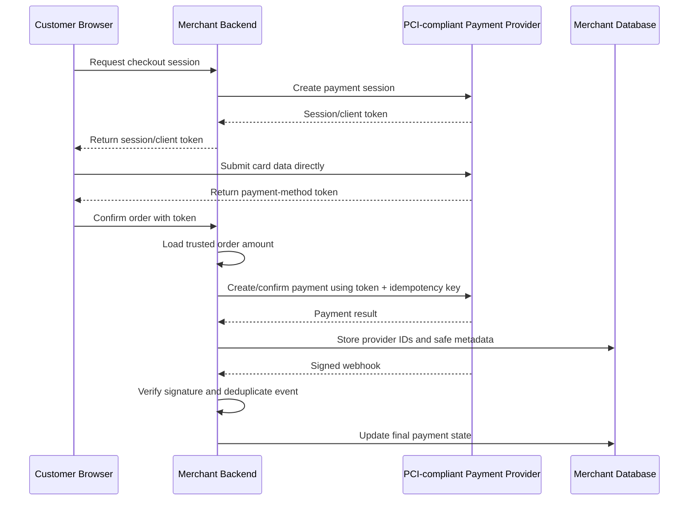
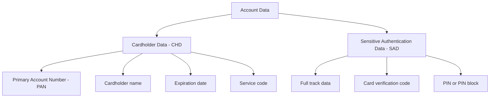
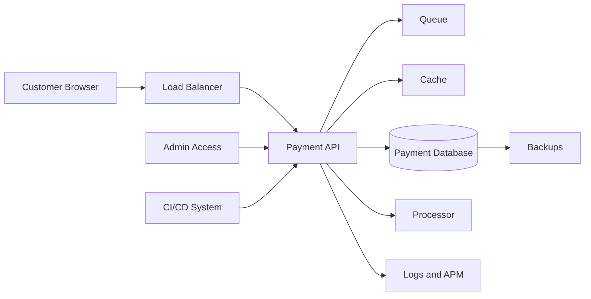
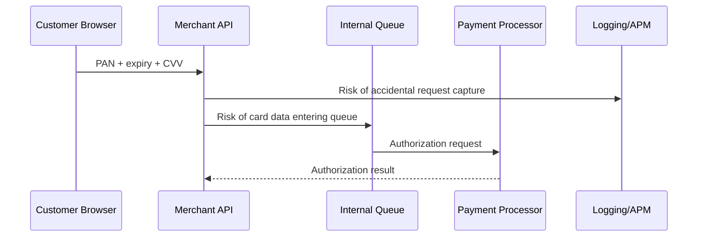
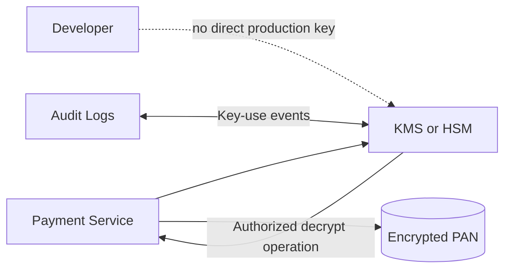
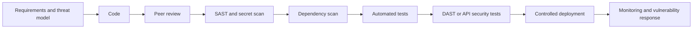
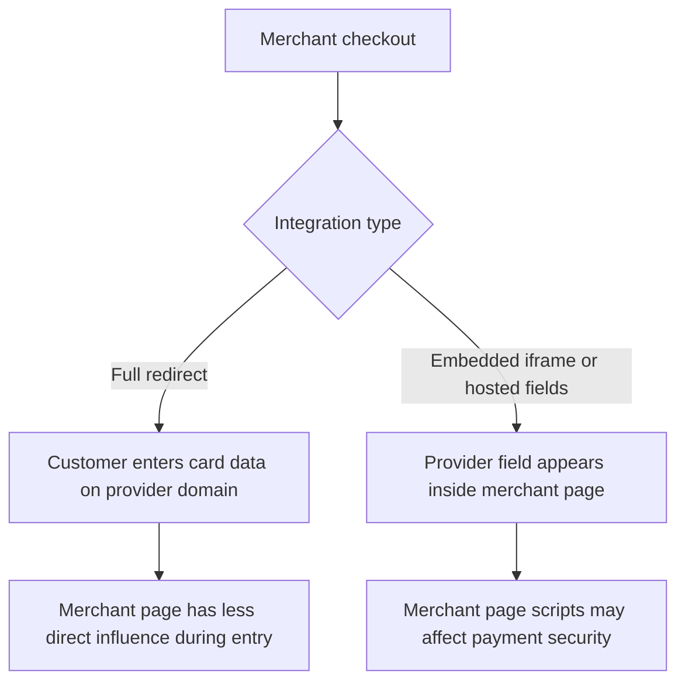
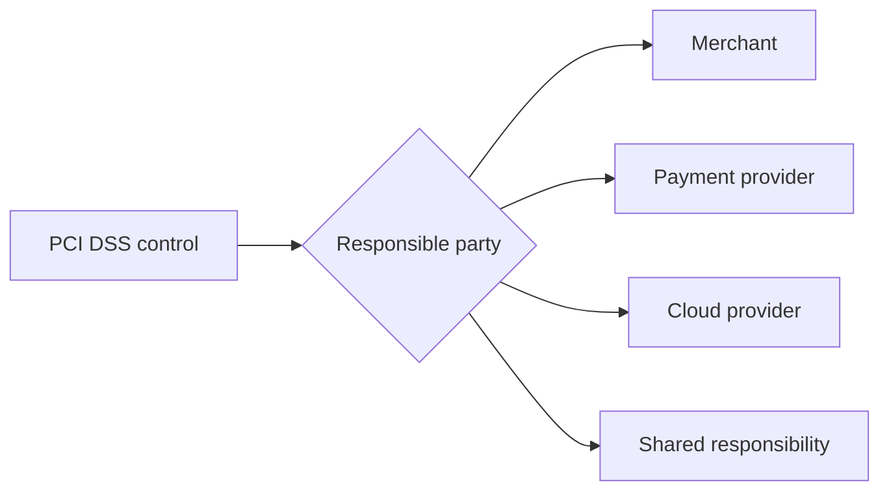
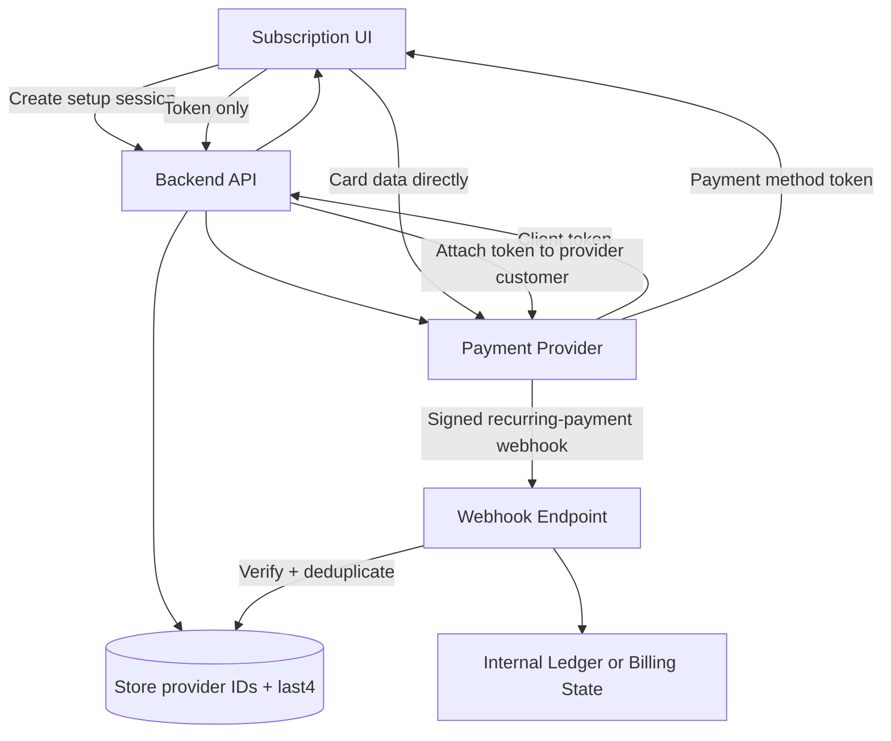

# PCI DSS Basics for Backend Engineers

> What PCI DSS actually requires of backend engineers, how tokenization shrinks the compliance scope, and which card data must never be stored.
>
> **Standard covered:** PCI DSS v4.0.1

## In short

- PCI DSS (Payment Card Industry Data Security Standard, currently v4.0.1) is an environment-level standard — it covers networks, APIs, access control, and logging, not just "is the database encrypted."
- **Cardholder Data (CHD)** — PAN, cardholder name, expiration date, service code — may be stored if protected; **Sensitive Authentication Data (SAD)** — full track data, CVV/CVC/CID, PIN — must never be stored after authorization, even encrypted.
- Scope is the **Cardholder Data Environment (CDE)**: any system that stores, processes, or transmits CHD/SAD, plus any system that can affect CDE security (CI/CD, secrets manager, DNS, identity provider, jump servers).
- The strongest scope-reduction move is keeping raw card data off your backend entirely — hosted checkout redirects, provider-hosted iframes/hosted fields, and client-side tokenization all hand the PAN straight to the provider.
- The 12 PCI DSS requirements span network security, secure configuration, encryption, access control, logging, testing, and organizational policy.
- Compliance is validated, not assumed: an **SAQ** (self-assessment) or a QSA-run **ROC** produces an **AOC** — and a payment provider's AOC never covers your own insecure integration.

The recommended flow keeps raw card data off the merchant backend entirely:



**Interview answer:** Never let raw PAN or CVV touch your backend — use a hosted checkout page, hosted fields, or client-side tokenization so the browser sends card data straight to a PCI-compliant provider, and your server only ever sees an opaque payment token plus the provider's ID, amount, currency, and status. That keeps your Cardholder Data Environment small, keeps you out of Sensitive Authentication Data storage entirely, and typically qualifies you for a much shorter SAQ than if you handled card data directly.

**Gotcha:** Storing the CVV/CVC/CID (or full track data / PIN) anywhere after authorization — even encrypted, even just in a log line, cache entry, queue message, or backup — is the classic violation; SAD must be discarded the moment authorization completes, with no exceptions for encryption.

---

# 1. What PCI DSS Is

**PCI DSS** stands for **Payment Card Industry Data Security Standard**. It is a set of technical and operational security requirements for organizations that store, process, transmit, or can affect the security of payment-card account data.[^1]

It applies across the payment ecosystem, including:

- Merchants accepting card payments
- Payment gateways and processors
- Acquirers and issuers
- Fintech platforms
- Payment-related service providers
- Cloud, hosting, support, or software systems that can affect a Cardholder Data Environment

PCI DSS is not only about database encryption. It covers the complete environment around payment data: networks, APIs, applications, access control, logging, vulnerability management, incident response, third parties, and operational policies.

> **Interview perspective:** PCI DSS is an environment-level security standard. A single encrypted database or a PCI-compliant payment provider does not automatically make the merchant's full implementation compliant.

## 1.1 Why backend engineers should care

Backend systems commonly handle:

- Payment initiation
- Payment-provider tokens
- Authorization, capture, refund, and cancellation requests
- Payment webhooks
- Customer and order references
- Audit logs
- Reconciliation data
- Admin and support operations

A backend design decision can greatly increase or reduce PCI DSS scope. For example, accepting a raw card number through your API brings far more systems into scope than accepting an opaque token created by a payment provider.

## 1.2 Current standard status

As of August 2026:

- **PCI DSS v4.0.1** is the active version of PCI DSS.
- PCI DSS v4.0 was retired on **31 December 2024**.
- The future-dated PCI DSS v4.x requirements became effective on **31 March 2025**.
- PCI DSS v4.0.1 was a limited revision; it did not add or delete requirements from v4.0.[^2]

This matters because controls such as automated log review, stronger e-commerce payment-page protections, targeted risk analyses, and several other v4.x requirements are no longer optional future practices.

---

# 2. Payment Data You Must Recognize

PCI DSS separates payment account data into **Cardholder Data** and **Sensitive Authentication Data**.



## 2.1 Cardholder Data (CHD)

Cardholder Data includes:

| Data element | Example | Backend relevance |
|---|---|---|
| Primary Account Number | `411111******1111` | The central data element for PCI DSS scope |
| Cardholder name | `Asha Patel` | CHD when stored with the PAN |
| Expiration date | `08/29` | Often returned as payment-method metadata |
| Service code | Track-data field | Usually handled by terminals or processors |

The **Primary Account Number**, commonly called the card number, is the main factor used to determine whether an environment stores, processes, or transmits cardholder data.

## 2.2 Sensitive Authentication Data (SAD)

Sensitive Authentication Data includes:

| Data element | Examples | Storage rule after authorization |
|---|---|---|
| Full track data | Magnetic-stripe or equivalent chip data | Must not be stored |
| Card verification code | CVV, CVC, CID | Must not be stored |
| PIN or PIN block | ATM or card PIN data | Must not be stored |

### The most important backend rule

> **Never store CVV/CVC/CID after authorization—even when encrypted.**

This includes storage in:

- Application databases
- Logs and exception traces
- Message queues
- Cache entries
- Analytics tools
- Support tickets
- Request replay systems
- Backups
- Data lakes

## 2.3 Storage rules at a glance

| Data | May be stored? | Required treatment |
|---|---:|---|
| PAN | Yes, only when necessary | Minimize retention and render it unreadable |
| Cardholder name | Yes | Protect it when stored with PAN |
| Expiration date | Yes | Protect it when stored with PAN |
| Service code | Yes | Protect it when stored with PAN |
| Full track data | No, after authorization | Make unrecoverable after authorization |
| CVV/CVC/CID | No, after authorization | Never retain, including encrypted form |
| PIN/PIN block | No, after authorization | Never retain |
| Provider token | Usually | Scope depends on token design and surrounding systems |
| Last four digits | Usually | Still treat as sensitive payment metadata |

Tokenization can reduce the number of systems containing PAN, but it does not automatically make every connected system out of scope. Token reversibility, token-vault access, network connections, administrative access, and the ability to affect payment security must still be evaluated.[^3]

---

# 3. Understanding PCI DSS Scope

PCI DSS scope determines which people, processes, applications, infrastructure, and service providers must meet applicable requirements.

## 3.1 Cardholder Data Environment (CDE)

The **Cardholder Data Environment** includes systems, people, and processes that:

- Store cardholder data
- Process cardholder data
- Transmit cardholder data
- Handle sensitive authentication data

A direct-card-data backend might place all of the following in scope:



Even if only the API receives PAN, connected systems may become in scope because they receive the data, can access it, or can affect the security of the API.

## 3.2 Systems that can affect CDE security

A system does not need to contain a card number to be relevant to PCI DSS. It may still be in scope when it can affect CDE security.

Examples include:

- Identity provider used by CDE administrators
- CI/CD pipeline that deploys the payment API
- Secrets manager containing payment credentials
- DNS or reverse proxy serving a payment page
- Monitoring system with privileged agents on CDE hosts
- Jump server used to access production
- Source-code repository controlling payment code
- Web application capable of changing embedded payment scripts

This is why PCI DSS scoping is broader than running a database search for card numbers.

## 3.3 Scope reduction

The most effective backend strategy is to avoid handling raw card data.

Useful scope-reduction techniques include:

1. **Hosted checkout redirect**  
   The customer leaves the merchant page and enters card data on the payment provider's hosted page.

2. **Provider-hosted iframe or hosted fields**  
   Card fields are delivered and controlled by the payment provider rather than the merchant backend.

3. **Client-side tokenization**  
   The browser sends card data directly to the provider and receives an opaque token.

4. **Network segmentation**  
   The CDE is isolated from unrelated business systems using enforced and tested controls.

5. **Data minimization**  
   Store only the provider reference, amount, currency, status, brand, and last four digits needed for operations.

6. **No PAN in internal events**  
   Queues, analytics events, emails, traces, and logs carry payment identifiers rather than card data.

> **Important:** Segmentation and outsourcing can reduce scope, but the organization must prove that the controls are correctly designed, operating, and tested.

---

# 4. Recommended Payment Architecture

## 4.1 Low-scope tokenized flow

In a preferred design, the merchant backend never receives raw card data.

The merchant stores values such as:

```text
order_id              = ord_82391
provider_payment_id   = pay_7fd91...
payment_method_token  = pm_6a82...
amount_minor          = 499900
currency              = INR
status                = authorized
brand                 = visa
last4                 = 1111
```

The merchant does **not** store:

```text
pan                    = 4111111111111111
cvv                    = 123
full_track_data        = ...
pin                    = ...
```

## 4.2 Direct card-data flow

A direct flow sends the raw PAN and CVV through the merchant application.



This design increases scope because the application server, network path, middleware, observability stack, deployment process, and supporting infrastructure may all need to be assessed.

Use it only when the business has a strong requirement and the organization is prepared to operate a properly controlled CDE.

---

# 5. The 12 PCI DSS Requirements

PCI DSS groups its controls into 12 main requirements.[^4]

| No. | PCI DSS requirement | Meaning for a backend engineer |
|---:|---|---|
| 1 | Install and maintain network security controls | Restrict traffic, isolate the CDE, document connections, and avoid unrestricted inbound or outbound access |
| 2 | Apply secure configurations to all system components | Remove defaults, harden containers/hosts, disable unnecessary services, and maintain configuration standards |
| 3 | Protect stored account data | Minimize storage, never retain prohibited SAD, encrypt or tokenize PAN, and manage retention/deletion |
| 4 | Protect cardholder data with strong cryptography during transmission over open, public networks | Use correctly configured TLS and never send PAN over insecure channels |
| 5 | Protect all systems and networks from malicious software | Use anti-malware or equivalent controls where applicable and protect users from phishing |
| 6 | Develop and maintain secure systems and software | Secure SDLC, dependency management, code review, patching, change control, and web-application protection |
| 7 | Restrict access by business need to know | Use least privilege and deny access by default |
| 8 | Identify users and authenticate access | Unique identities, strong authentication, MFA, controlled service accounts, and credential lifecycle management |
| 9 | Restrict physical access to cardholder data | Protect data centers, offices, media, printed records, and payment devices |
| 10 | Log and monitor access to systems and cardholder data | Centralize audit logs, review security events, alert on anomalies, and retain evidence |
| 11 | Test security of systems and networks regularly | Vulnerability scans, penetration tests, intrusion detection, file integrity, and payment-page tamper detection |
| 12 | Support information security with organizational policies and programs | Policies, risk analysis, awareness, scope review, third-party management, and incident response |

The 12 requirements are not isolated tasks. For example, protecting a payment endpoint may involve:

- Requirement 1 for network restrictions
- Requirement 6 for secure code and WAF controls
- Requirement 7 for authorization
- Requirement 8 for administrator MFA
- Requirement 10 for logging
- Requirement 11 for security testing
- Requirement 12 for incident response and third-party management

---

# 6. Backend Engineering Controls

## 6.1 Data minimization

The safest card data is the card data your application never receives.

A backend payment service should normally retain only what the business needs for:

- Reconciliation
- Refunds
- Chargebacks
- Customer support
- Payment-status reporting
- Fraud investigation

Prefer storing:

- Internal order and payment IDs
- Provider payment/customer/payment-method IDs
- Amount in minor units
- Currency
- Payment status
- Payment method type
- Card brand and last four digits, when needed
- Timestamps and business audit information

Avoid collecting a field merely because the payment provider returns it.

### Retention design

A retention policy should answer:

1. What payment data is stored?
2. Why is each field required?
3. Where is it stored, including backups and logs?
4. How long is it retained?
5. How is it securely deleted?
6. How is deletion verified?

Deletion should cover primary databases, replicas, caches, exports, archives, object storage, and expired backups according to the organization's documented process.

## 6.2 Encryption and key management

### Data in transit

Use strong cryptography for:

- Browser-to-API communication
- Service-to-service traffic that carries CHD
- API-to-processor connections
- Administrative access
- Data replication and backup transfer

The engineering focus is not simply “HTTPS is enabled.” Verify:

- Certificates are valid and automatically renewed
- Weak protocols and cipher suites are disabled
- Certificate verification is not bypassed
- Private keys are protected
- Internal services do not silently downgrade to plaintext
- Debug settings do not disable TLS checks

### Data at rest

When PAN storage is necessary, render it unreadable using an approved approach such as:

- Strong data-level encryption
- Tokenization
- Truncation
- One-way cryptographic hashing when the business use case does not require recovery

Full-disk encryption is useful, but it may not be sufficient by itself for PAN stored on non-removable systems. Application- or data-level protection is commonly required so that database files, exports, and application access do not expose readable PAN.

### Key management

Encryption is only as strong as its key management.

Use a dedicated KMS or HSM-backed system where appropriate, with:

- Restricted key access
- Separation between encrypted data and key-encrypting keys
- Rotation and replacement procedures
- Versioned keys
- Audit logging
- Revocation and compromise response
- Separate keys across environments
- No keys committed to source code or container images



## 6.3 Authentication and authorization

Use separate controls for customers, employees, administrators, and machine identities.

### Human access

- Give every person a unique identity
- Require MFA for applicable CDE access
- Use role-based access and least privilege
- Remove access promptly when roles change
- Review privileged access regularly
- Avoid shared administrator accounts
- Record privileged actions

### Service accounts

- Give each workload its own identity
- Avoid one shared credential across many services
- Restrict permissions to the exact API, queue, database, or key required
- Rotate secrets or use short-lived credentials
- Prevent interactive login unless explicitly required
- Monitor unusual use

### Application authorization

A valid login is not sufficient. The backend must still enforce object-level and action-level authorization.

```text
Customer A must not be able to:
- refund Customer B's payment
- retrieve another merchant's transaction
- change the amount after server-side order calculation
- call an internal capture endpoint
```

## 6.4 Secure software development

PCI DSS expects a secure development lifecycle, not only a penetration test before an audit.

A practical development pipeline includes:



Engineering controls should include:

- Threat modeling for payment flows
- Secure coding standards
- Peer review by someone other than the code author where required
- Input validation and output encoding
- Protection against injection, broken access control, SSRF, insecure deserialization, and other common attacks
- Dependency and container-image scanning
- Secrets scanning
- Change approvals and deployment traceability
- Separation between development, test, and production
- No production PAN in lower environments
- Timely remediation of vulnerabilities and security patches
- Protection for public-facing web applications, commonly through an effective WAF or equivalent automated solution

### Never use production card data for testing

Use:

- Provider test mode
- Provider-supplied test card numbers
- Synthetic transaction data
- Masked fixtures
- Separate test credentials and webhook secrets

## 6.5 Logging and monitoring

Logs are essential for detection and investigation, but they are also a common route for accidental card-data storage.

### Events worth recording

- Authentication success and failure
- Administrator actions
- Permission changes
- Payment creation, capture, cancellation, and refund transitions
- Webhook verification failure
- Duplicate or replayed webhook events
- Access to protected payment information
- Changes to security settings
- Deployment and configuration changes
- KMS/key-use events

### Values that should not appear in logs

- Full PAN
- CVV/CVC/CID
- PIN or track data
- Raw payment request bodies
- Authorization headers
- Session cookies
- Payment-provider secret keys
- Decryption keys
- Unfiltered exception objects containing request data

### PCI DSS log expectations

PCI DSS requires audit logs to support detection and forensic analysis. Important logs for in-scope and critical systems are reviewed at least daily, normally with automated mechanisms. Audit log history is retained for at least **12 months**, with at least the most recent **three months** immediately available for analysis.[^5]

The logging system should protect logs from unauthorized modification and alert when logging, monitoring, segmentation, or other critical security controls fail.

## 6.6 Payment-page security

Modern e-commerce attacks often target browser-side scripts rather than the backend database. Malicious JavaScript can steal card data before it reaches a payment provider.

PCI DSS Requirements **6.4.3** and **11.6.1** focus on payment-page script authorization, integrity, inventory, justification, and detection of unauthorized changes to payment pages and security-impacting HTTP headers.[^6]

For backend and platform teams, this means:

- Maintain an inventory of scripts on payment pages
- Authorize every script
- Document why each script is necessary
- Apply integrity controls where appropriate
- Restrict third-party scripts
- Use a strong Content Security Policy where suitable
- Monitor payment-page content and security headers for tampering
- Alert and respond to unexpected changes
- Protect the deployment pipeline that controls payment-page assets

These concerns can still apply when a merchant page embeds a provider-controlled payment form in an iframe. PCI SSC's SAQ A guidance distinguishes embedded payment forms from full redirects and requires merchants using embedded forms to address script-attack eligibility criteria.[^7]

### Redirect versus embedded form



## 6.7 Vulnerability management

Backend teams should have a defined process to:

1. Discover vulnerabilities
2. Rank risk
3. Assign ownership
4. Remediate within policy timelines
5. Verify the fix
6. Retain evidence

Typical activities include:

- Continuous dependency monitoring
- Operating-system and container scanning
- Internal vulnerability scans
- External ASV scans when applicable
- Annual internal and external penetration testing
- Additional testing after significant changes
- Retesting after remediation
- Segmentation testing when segmentation is used to reduce scope

A “significant change” may include:

- New payment processor
- New payment API or checkout architecture
- Major framework upgrade
- Cloud-network redesign
- New authentication system
- New CDE network segment
- Migration to a different container platform

---

# 7. Practical Backend Patterns

The following examples demonstrate safer engineering patterns. They do not, by themselves, prove PCI DSS compliance.

## 7.1 Safe payment API

This example accepts a provider token, not a card number. The trusted amount is loaded from the server-side order.

```python
from __future__ import annotations

from typing import Protocol

from fastapi import Depends, FastAPI, Header, HTTPException, status
from pydantic import BaseModel, Field

app = FastAPI()

class ConfirmPaymentRequest(BaseModel):
    order_id: str = Field(min_length=1, max_length=64)
    payment_method_token: str = Field(min_length=8, max_length=256)

class PaymentResponse(BaseModel):
    payment_id: str
    status: str

class PaymentProvider(Protocol):
    async def confirm_payment(
        self,
        *,
        amount_minor: int,
        currency: str,
        payment_method_token: str,
        idempotency_key: str,
    ) -> dict: ...

async def get_payment_provider() -> PaymentProvider:
    # Resolve a configured provider client from application dependencies.
    raise NotImplementedError

async def load_payable_order(order_id: str) -> dict:
    # The amount must come from a trusted server-side order record.
    return {
        "id": order_id,
        "amount_minor": 499900,
        "currency": "INR",
        "status": "pending",
    }

@app.post("/payments/confirm", response_model=PaymentResponse)
async def confirm_payment(
    payload: ConfirmPaymentRequest,
    idempotency_key: str = Header(alias="Idempotency-Key", min_length=8, max_length=128),
    provider: PaymentProvider = Depends(get_payment_provider),
) -> PaymentResponse:
    order = await load_payable_order(payload.order_id)

    if order["status"] != "pending":
        raise HTTPException(
            status_code=status.HTTP_409_CONFLICT,
            detail="Order is not payable",
        )

    result = await provider.confirm_payment(
        amount_minor=order["amount_minor"],
        currency=order["currency"],
        payment_method_token=payload.payment_method_token,
        idempotency_key=idempotency_key,
    )

    # Persist only provider identifiers and required operational metadata.
    return PaymentResponse(
        payment_id=result["payment_id"],
        status=result["status"],
    )
```

### Why this pattern is useful

- Raw PAN and CVV do not enter the endpoint
- The client cannot decide the payable amount
- An idempotency key protects against duplicate payment attempts
- The response returns an internal/provider payment identifier
- Payment-provider code is isolated behind an interface

## 7.2 Structured logging with an allowlist

Redacting known sensitive fields is helpful, but an allowlist is safer because newly added request fields are not logged automatically.

```python
from __future__ import annotations

import logging
from typing import Any

logger = logging.getLogger("payments")

ALLOWED_LOG_FIELDS = {
    "request_id",
    "merchant_id",
    "order_id",
    "payment_id",
    "provider_event_id",
    "status",
    "amount_minor",
    "currency",
    "error_code",
}

def payment_log(event: str, **context: Any) -> None:
    safe_context = {
        key: value
        for key, value in context.items()
        if key in ALLOWED_LOG_FIELDS
    }

    logger.info(event, extra={"payment_context": safe_context})

payment_log(
    "payment_authorized",
    request_id="req_83f1",
    order_id="ord_82391",
    payment_id="pay_7fd91",
    status="authorized",
    amount_minor=499900,
    currency="INR",
    # A field such as `card_number` would not be included.
)
```

Also configure your framework, reverse proxy, APM agent, and exception reporter so they do not capture full request bodies or secret headers on payment routes.

## 7.3 Webhook signature verification

A payment webhook must be authenticated before it changes payment state: verify the HMAC-SHA256 signature over the raw, unmodified body with a constant-time comparison, reject stale timestamps, and deduplicate by provider event ID before applying any state transition. Store only the minimum event data required and avoid logging the full webhook body.

Full detail: [Webhooks](../api-design/webhooks.md)

## 7.4 Payment data model

A practical merchant-side model can avoid raw card data:

```text
Payment
├── id: UUID
├── merchant_id: UUID
├── order_id: UUID
├── provider: string
├── provider_payment_id: string
├── provider_customer_id: string | null
├── provider_payment_method_id: string | null
├── amount_minor: integer
├── currency: char(3)
├── status: enum
├── card_brand: string | null
├── card_last4: char(4) | null
├── idempotency_key_hash: string
├── failure_code: string | null
├── authorized_at: timestamp | null
├── captured_at: timestamp | null
├── created_at: timestamp
└── updated_at: timestamp
```

Do not add `pan`, `cvv`, `track_data`, or `pin` columns.

If a product genuinely requires PAN storage, use a separately designed and assessed vault or processor capability rather than casually adding encrypted columns to the main application database.

---

# 8. Operational Evidence

PCI DSS assessment is evidence-driven. A secure design must be supported by records showing that controls operate over time.

Backend and platform teams may need to provide:

| Area | Example evidence |
|---|---|
| Scope | Data-flow diagrams, network diagrams, asset inventory, service inventory |
| Secure configuration | Hardened baseline, infrastructure-as-code, configuration review |
| Access control | Role definitions, access approvals, periodic access reviews, termination records |
| Authentication | MFA configuration, identity-provider policies, service-account inventory |
| Code security | Pull requests, reviews, secure coding standard, SAST/SCA reports |
| Vulnerabilities | Scan reports, remediation tickets, patch records, retest results |
| Penetration testing | Scope, methodology, findings, fixes, verification |
| Logging | Log sources, review alerts, retention configuration, incident investigations |
| Encryption | Key architecture, KMS policies, key rotation evidence, certificate inventory |
| Change management | Change tickets, approvals, deployment records, rollback plans |
| Incident response | Incident plan, contact list, annual exercise results, lessons learned |
| Third parties | Provider responsibility matrix, current AOC, annual compliance review |
| Data retention | Data inventory, retention schedule, deletion jobs, verification records |

### Responsibility matrix

When using a payment provider or cloud service, document who is responsible for each control.



A provider's PCI DSS Attestation of Compliance does not automatically cover insecure merchant integration, merchant code, access control, or payment-page scripts.

---

# 9. Validation: SAQ, ROC, AOC, QSA, and ASV

## SAQ — Self-Assessment Questionnaire

An SAQ is a PCI DSS validation tool for eligible organizations. Different SAQs apply to different payment channels and architectures.

Examples of factors that affect SAQ eligibility include:

- Hosted redirect versus embedded iframe
- Whether payment data is handled electronically
- Card-present versus card-not-present transactions
- Use of validated point-to-point encryption
- Whether the entity is a merchant or service provider

Do not select an SAQ only because it has fewer questions. The organization must meet every eligibility criterion for that SAQ and should confirm the required validation method with its acquirer, payment brand, or compliance-accepting entity.[^8]

## ROC — Report on Compliance

A ROC is a detailed assessment report, generally used by larger organizations or where required by the applicable compliance program.

## AOC — Attestation of Compliance

An AOC is the formal attestation associated with an SAQ or ROC. Organizations often request a payment provider's current AOC as part of third-party due diligence.

## QSA — Qualified Security Assessor

A QSA is an independent assessor qualified by PCI SSC to conduct PCI DSS assessments.

## ASV — Approved Scanning Vendor

An ASV is qualified to perform external vulnerability scanning required by applicable PCI DSS validation programs.

> The payment brands and acquirers manage compliance programs and determine validation obligations. PCI SSC develops standards and qualification programs but does not decide every organization's exact reporting obligation.[^1]

---

# 10. Practical E-commerce Scenario

Consider a subscription platform that accepts card payments through a payment provider.

## Business requirements

- Customer adds a card
- Platform charges the card monthly
- Customer can replace the card
- Support can view the card brand and last four digits
- Backend receives payment success and failure webhooks

## Recommended design



## Stored merchant data

```json
{
  "customer_id": "cus_internal_742",
  "provider_customer_id": "cus_provider_A82",
  "provider_payment_method_id": "pm_provider_F91",
  "brand": "visa",
  "last4": "1111",
  "status": "active"
}
```

## Engineering controls

- Card entry is provider-hosted
- Merchant backend receives only provider tokens
- Monthly amount comes from the subscription plan stored server-side
- Webhooks are verified and deduplicated
- Support sees only brand and last four digits
- Refund permissions are separate from view permissions
- Production secrets are stored in a secrets manager
- Payment events use an allowlisted logging schema
- Provider compliance status and responsibilities are reviewed at least annually
- Payment-page scripts and headers are monitored when the merchant page can affect embedded payment forms

This design reduces the merchant's exposure while preserving normal billing and support features.

---

# 11. Implementation Checklist

Keep raw card data out of your systems whenever possible; where a system must handle payment data or can affect its security, minimize access, protect every path, monitor continuously, test regularly, and retain evidence that the controls work. Start from the data itself — identify exactly what each component touches (PAN, CVV, track data, PIN, a provider token, or only a payment ID) and trace it end to end through the browser, API gateway, queues, cache, database, logs, analytics, backups, and third parties — then use the checklist below to verify each area.

## Payment flow

- [ ] Card data is submitted directly to a PCI-compliant payment provider where possible
- [ ] The backend accepts provider tokens instead of PAN/CVV
- [ ] Amount and currency come from trusted server-side records
- [ ] Payment creation, capture, and refund operations are idempotent
- [ ] Webhooks are signature-verified and deduplicated
- [ ] Payment-state transitions are validated

## Data protection

- [ ] CVV, track data, and PIN data are never retained after authorization
- [ ] Stored payment data has a documented business purpose
- [ ] Retention and secure-deletion processes cover databases, logs, caches, exports, and backups
- [ ] PAN is tokenized or rendered unreadable when storage is required
- [ ] Keys are managed outside source code and application configuration files

## Application security

- [ ] Payment endpoints use strict authentication and authorization
- [ ] Administrative access uses unique identities and MFA
- [ ] Public-facing payment applications have effective automated attack protection
- [ ] Dependencies, containers, and hosts are continuously assessed
- [ ] Security patches and vulnerabilities have defined remediation timelines
- [ ] Production card data is not used in development or test environments

## Logging and monitoring

- [ ] Payment logs use an allowlist of approved fields
- [ ] Request bodies and secret headers are not captured on sensitive routes
- [ ] Privileged access and payment-state changes are auditable
- [ ] Important logs are reviewed through automated mechanisms
- [ ] Logs are protected from unauthorized modification
- [ ] Required log history is retained and available

## E-commerce pages

- [ ] Payment-page scripts are inventoried, authorized, justified, and integrity-protected
- [ ] Third-party JavaScript is minimized
- [ ] Payment-page content and security headers are monitored for unauthorized change
- [ ] Embedded payment forms are reviewed against current SAQ A eligibility guidance

## Operations

- [ ] Current CDE data-flow and network diagrams exist
- [ ] In-scope assets and service accounts are inventoried
- [ ] Segmentation controls are tested
- [ ] Incident response is documented and exercised
- [ ] Payment providers and other TPSPs have a documented responsibility matrix
- [ ] Current third-party AOCs and compliance status are reviewed
- [ ] The required SAQ or ROC path is confirmed with the compliance-accepting entity

---

# 12. Official References

The references below are official PCI Security Standards Council resources.

1. [PCI Data Security Standard overview](https://www.pcisecuritystandards.org/standards/pci-dss/)
2. [PCI SSC Document Library](https://www.pcisecuritystandards.org/document_library/)
3. [PCI DSS v4.0.1 publication announcement](https://blog.pcisecuritystandards.org/just-published-pci-dss-v4-0-1)
4. [Maintaining Payment Security — 12 PCI DSS requirements](https://www.pcisecuritystandards.org/merchants/process/)
5. [PCI DSS v4.x Resource Hub](https://blog.pcisecuritystandards.org/pci-dss-v4-0-resource-hub)
6. [Payment Page Security and Preventing E-Skimming](https://blog.pcisecuritystandards.org/new-information-supplement-payment-page-security-and-preventing-e-skimming)
7. [FAQ 1588 — SAQ A eligibility criteria for scripts](https://www.pcisecuritystandards.org/faqs/1588/)
8. [PCI DSS v4.0.1 SAQs bulletin](https://www.pcisecuritystandards.org/wp-content/uploads/2024/10/SAQs_for_PCI_DSS_v4.0.1_Bulletin.pdf)
9. [PCI DSS Tokenization Guidelines](https://www.pcisecuritystandards.org/documents/Tokenization_Guidelines_Info_Supplement.pdf)
10. [PCI SSC Glossary](https://www.pcisecuritystandards.org/glossary/)

---

[^1]: PCI SSC, *PCI Data Security Standard overview*.
[^2]: PCI SSC, *Just Published: PCI DSS v4.0.1*.
[^3]: PCI SSC, *PCI DSS Tokenization Guidelines Information Supplement*.
[^4]: PCI SSC, *Maintaining Payment Security*.
[^5]: PCI DSS Requirement 10, including audit-log review and retention expectations.
[^6]: PCI SSC, *Payment Page Security and Preventing E-Skimming*.
[^7]: PCI SSC FAQ 1588, *How does an e-commerce merchant meet the SAQ A eligibility criteria for scripts?*
[^8]: PCI SSC, *SAQs for PCI DSS v4.0.1 Now Available*.
