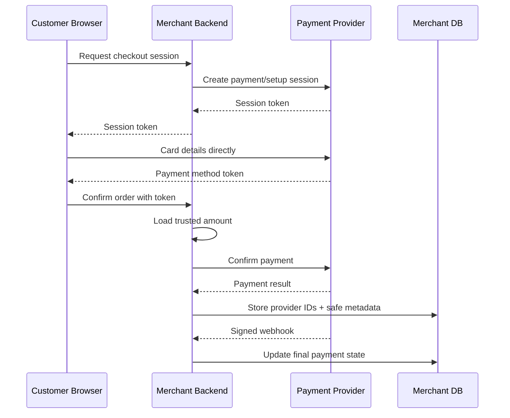
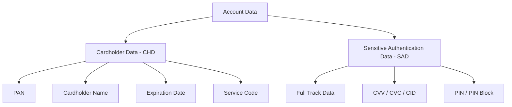
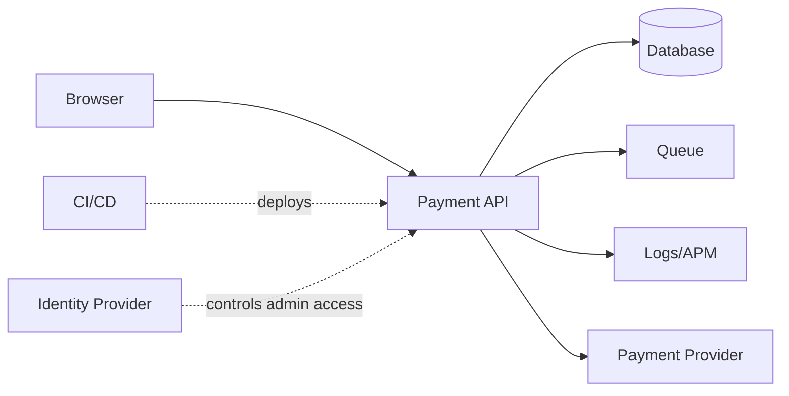
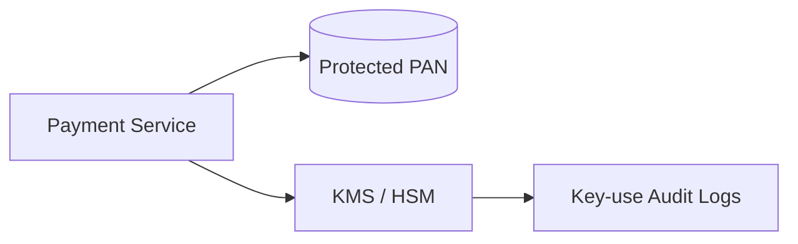
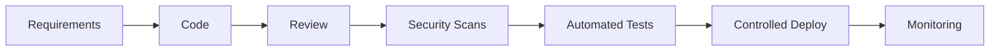
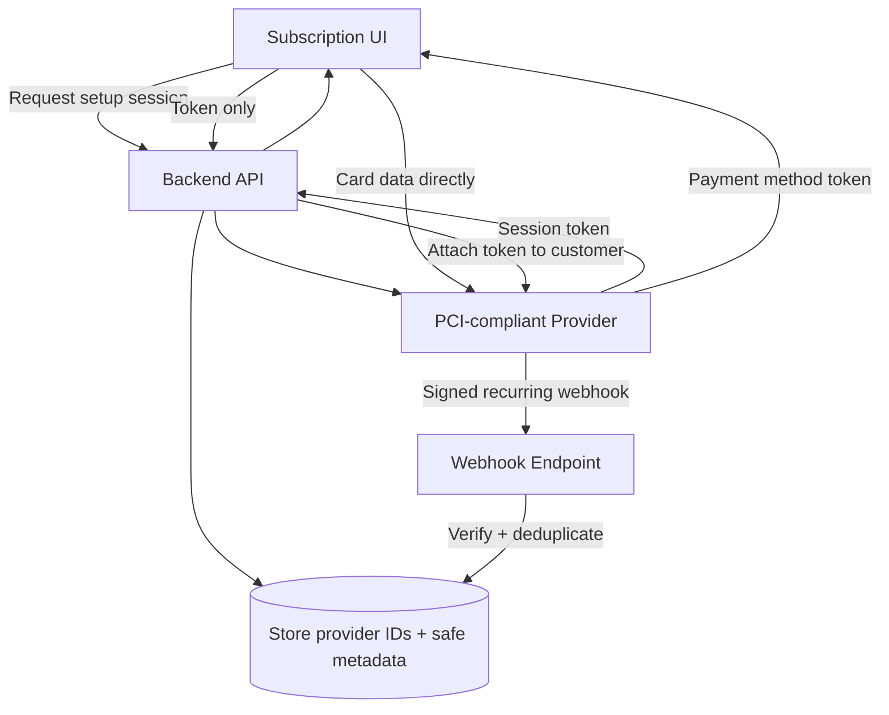

# PCI DSS Basics for Backend Engineers

> A practical, interview-focused guide to PCI DSS scope, payment-card data, tokenization, backend controls, and safe payment architecture.

> **Standard covered:** PCI DSS v4.0.1

## Index

1. [What PCI DSS Is](#1-what-pci-dss-is)
2. [Payment Data: CHD vs SAD](#2-payment-data-chd-vs-sad)
3. [PCI DSS Scope and Tokenization](#3-pci-dss-scope-and-tokenization)
4. [The 12 PCI DSS Requirements](#4-the-12-pci-dss-requirements)
5. [Backend Engineering Controls](#5-backend-engineering-controls)
6. [Practical Payment Example](#6-practical-payment-example)
7. [Validation Terms](#7-validation-terms)
8. [Quick Revision](#8-quick-revision)

---

## In Short

- **PCI DSS** is a security standard for environments that store, process, transmit, or can affect the security of payment-card account data.
- **Cardholder Data (CHD)** includes PAN and, when present with it, cardholder name, expiration date, and service code.
- **Sensitive Authentication Data (SAD)** includes full track data, CVV/CVC/CID, and PIN/PIN block.
- **SAD must not be stored after authorization, even if encrypted.**
- The safest backend design is to keep raw PAN and CVV away from your API by using a PCI-compliant provider's hosted checkout, hosted fields, iframe, or tokenization flow.
- PCI DSS v4.0.1 is the active version. The future-dated v4.x requirements became effective on **31 March 2025**.
- A payment provider's PCI compliance does **not** automatically make the merchant application compliant.



---

## 1. What PCI DSS Is

**PCI DSS** stands for **Payment Card Industry Data Security Standard**.

It applies to organizations involved in payment-card processing, including merchants, gateways, processors, fintech platforms, and service providers that can affect payment security.

### 1.1 Why Backend Engineers Should Care

A backend may handle:

- Payment creation and confirmation
- Provider payment tokens
- Capture, refund, and cancellation operations
- Webhooks
- Customer and order references
- Reconciliation data
- Audit logs
- Admin/support actions

The architecture determines how much of your system becomes part of the **Cardholder Data Environment (CDE)**.

For example:

```text
Raw PAN enters backend
        ↓
API + network + logs + queues + DB + backups may enter scope

Provider token enters backend
        ↓
Raw card data stays with provider
        ↓
Merchant PCI scope can be much smaller
```

### 1.2 Current Version

As of **August 2026**:

- **PCI DSS v4.0.1** is the active version.
- PCI DSS v4.0 was retired on **31 December 2024**.
- Future-dated PCI DSS v4.x requirements became effective on **31 March 2025**.
- PCI DSS v4.0.1 is a limited revision of v4.0 rather than a completely new standard.

---

## 2. Payment Data: CHD vs SAD

PCI DSS separates payment account data into two important categories.



### 2.1 Cardholder Data (CHD)

| Data | Can it be stored? | Main rule |
|---|---:|---|
| PAN | Yes, when necessary | Stored PAN must be rendered unreadable |
| Cardholder name | Yes | Protect when part of the CDE |
| Expiration date | Yes | Protect when part of the CDE |
| Service code | Yes | Protect when part of the CDE |

The **PAN (Primary Account Number)** is the full card number and is the key data element for PCI DSS applicability.

> Only PAN specifically needs to be rendered unreadable under the stored-account-data requirement. Other CHD fields still need normal PCI DSS protection when they are in the CDE.

### 2.2 Sensitive Authentication Data (SAD)

| Data | Storage after authorization |
|---|---|
| Full track data | **Not allowed** |
| CVV / CVC / CID | **Not allowed** |
| PIN / PIN block | **Not allowed** |

### Most Important Rule

> **Never store CVV/CVC/CID after authorization — even encrypted.**

This includes accidental storage in:

- Logs
- Request/response traces
- Queues
- Caches
- Analytics systems
- Backups
- Support tickets
- Error-reporting tools

A recurring-payment system should store the provider's reusable payment-method token, **not the CVV**.

---

## 3. PCI DSS Scope and Tokenization

### 3.1 Cardholder Data Environment (CDE)

The CDE includes systems, people, and processes that store, process, or transmit CHD/SAD.

Connected or security-impacting systems can also become relevant to scope, for example:

- Payment APIs
- Databases containing PAN
- Reverse proxies and network controls
- CI/CD systems deploying payment code
- Secrets managers
- Identity providers used for privileged access
- Monitoring systems with privileged access
- Jump/bastion hosts



### 3.2 Best Scope-Reduction Strategy

The strongest approach is:

> **Do not let raw PAN or CVV reach your backend unless the business truly requires it.**

Common approaches:

1. **Hosted checkout redirect**  
   Customer enters card details on the provider's page.

2. **Provider-hosted iframe / hosted fields**  
   Card fields are controlled by the provider even though they appear inside the merchant UI.

3. **Client-side tokenization**  
   Browser sends card data directly to the provider and receives an opaque token.

4. **Network segmentation**  
   Isolate systems that genuinely belong to the CDE.

5. **Data minimization**  
   Store only what your business needs.

### 3.3 Tokenization Does Not Mean "Automatically Out of Scope"

A token can reduce exposure, but scope still depends on:

- Whether the token can be reversed
- Who can access the token vault
- Network connectivity
- Administrative access
- Whether a system can affect payment security

Think of tokenization as **scope reduction**, not a universal compliance bypass.

---

## 4. The 12 PCI DSS Requirements

For interviews, understand what each requirement means in engineering terms rather than memorizing every sub-requirement.

| # | Requirement Area | Backend Meaning |
|---:|---|---|
| 1 | Network security controls | Restrict traffic and isolate the CDE |
| 2 | Secure configurations | Remove defaults and harden systems |
| 3 | Protect stored account data | Minimize data and protect stored PAN |
| 4 | Protect data in transit | Use strong cryptography such as correctly configured TLS |
| 5 | Protect against malware | Use appropriate anti-malware and threat controls |
| 6 | Secure systems and software | Secure SDLC, patching, code review, dependency security |
| 7 | Restrict access | Least privilege and need-to-know |
| 8 | Identify and authenticate users | Unique IDs, MFA, secure service identities |
| 9 | Physical access | Protect physical systems and media |
| 10 | Logging and monitoring | Audit security-relevant access and activity |
| 11 | Security testing | Scans, penetration tests, detection, integrity checks |
| 12 | Security policies/programs | Risk, incident response, training, third-party management |

A single payment API usually touches several requirements at once: secure coding, authentication, authorization, logging, network controls, vulnerability management, and incident response.

---

## 5. Backend Engineering Controls

### 5.1 Data Minimization

A merchant backend should normally store values such as:

```text
order_id
provider_payment_id
provider_customer_id
provider_payment_method_id
amount_minor
currency
payment_status
card_brand
card_last4
timestamps
```

Avoid storing:

```text
full_pan
cvv
track_data
pin
```

If PAN storage is genuinely necessary, design a dedicated, assessed solution rather than adding an encrypted `pan` column casually to the main application database.

### 5.2 Encryption and Key Management

For data in transit:

- Use TLS correctly.
- Validate certificates.
- Do not disable TLS verification.
- Protect private keys.
- Avoid plaintext internal paths for CHD.

For stored PAN:

- Use approved strong cryptography, tokenization, truncation, or another permitted approach.
- Keep encryption keys separate from encrypted data.
- Prefer KMS/HSM-backed key management.
- Restrict and audit key use.
- Rotate/revoke keys using documented procedures.



### 5.3 Authentication and Authorization

Use:

- Unique user identities
- MFA for applicable CDE access
- Least privilege
- Separate service identities
- Short-lived credentials where possible
- Regular privileged-access reviews

Authentication is not enough. The API must still validate **who can perform which payment action**.

Example:

```text
Customer A must not be able to:
- read Customer B's payment
- refund another merchant's transaction
- call an internal capture endpoint
```

### 5.4 Logging

Useful events:

- Login failures
- Privileged actions
- Payment state changes
- Refund/capture operations
- Webhook verification failures
- Permission changes
- KMS/key use
- Deployment/configuration changes

Do **not** log:

- Full PAN
- CVV/CVC/CID
- PIN or track data
- Raw payment request bodies
- Authorization headers
- Session cookies
- Provider secret keys

Prefer an **allowlist** of safe logging fields instead of trying to redact every possible sensitive field later.

### 5.5 Secure Development and Vulnerability Management

A practical payment SDLC includes:



Common controls:

- Threat modeling
- Peer review
- SAST and secret scanning
- Dependency/container scanning
- Secure configuration
- Patch management
- DAST/API security testing where appropriate
- Penetration testing
- No production card data in development/test

### 5.6 Webhooks and Idempotency

Payment webhooks should:

- Verify the provider signature using the **raw request body**
- Reject invalid or stale requests
- Deduplicate using the provider event ID
- Validate state transitions
- Avoid logging complete webhook payloads unnecessarily

Payment creation/capture/refund operations should also use **idempotency keys** so retries do not create duplicate financial operations.

### 5.7 E-commerce Payment-Page Security

Browser-side scripts matter because malicious JavaScript can steal card data before it reaches the payment provider.

Important controls include:

- Minimize third-party scripts
- Inventory and authorize payment-page scripts
- Protect script integrity where appropriate
- Use a strong Content Security Policy when suitable
- Detect unauthorized changes to payment pages and security-relevant headers
- Protect the deployment pipeline that controls payment-page assets

**Current SAQ A point:** for an embedded provider payment form, merchants must confirm their site is not susceptible to script attacks that could affect the e-commerce system. Full redirects are treated differently for this specific eligibility criterion.

Also, PCI SSC clarified in **June 2026** that SAQ A e-commerce merchants can still have **ASV external scanning** requirements for merchant webpages, including redirect and iframe implementations.

---

## 6. Practical Payment Example

Consider a subscription platform where customers save a card for monthly billing.

### 6.1 Recommended Flow



### 6.2 Merchant Database

```json
{
  "customer_id": "cus_internal_742",
  "provider_customer_id": "cus_provider_A82",
  "provider_payment_method_id": "pm_provider_F91",
  "brand": "visa",
  "last4": "1111",
  "status": "active"
}
```

The backend does **not** store the PAN or CVV.

### 6.3 Minimal FastAPI Pattern

```python
from fastapi import FastAPI, Header
from pydantic import BaseModel

app = FastAPI()


class ConfirmPaymentRequest(BaseModel):
    order_id: str
    payment_method_token: str


@app.post("/payments/confirm")
async def confirm_payment(
    payload: ConfirmPaymentRequest,
    idempotency_key: str = Header(alias="Idempotency-Key"),
):
    order = await load_order(payload.order_id)

    # Never trust a client-supplied amount.
    result = await payment_provider.confirm(
        amount_minor=order.amount_minor,
        currency=order.currency,
        payment_method_token=payload.payment_method_token,
        idempotency_key=idempotency_key,
    )

    return {
        "payment_id": result.payment_id,
        "status": result.status,
    }
```

Why this is a good backend pattern:

- Raw card data never enters the API.
- The amount comes from a trusted server-side order.
- Idempotency protects against duplicate payment attempts.
- The application stores provider identifiers instead of card credentials.

---

## 7. Validation Terms

### 7.1 SAQ — Self-Assessment Questionnaire

A validation questionnaire for eligible organizations.

The correct SAQ depends on the payment architecture. Do not choose an SAQ simply because it has fewer requirements; all eligibility criteria must be met.

### 7.2 ROC — Report on Compliance

A detailed PCI DSS assessment report, generally used when required by the applicable compliance program.

### 7.3 AOC — Attestation of Compliance

The formal attestation associated with an SAQ or ROC.

A payment provider's AOC confirms the provider's assessed status. It does **not** cover insecure code or configuration in your merchant application.

### 7.4 QSA — Qualified Security Assessor

An assessor qualified by PCI SSC to perform PCI DSS assessments.

### 7.5 ASV — Approved Scanning Vendor

A PCI SSC-approved vendor that performs required external vulnerability scanning.

---

## 8. Quick Revision

Remember these points for interviews and real backend work:

- **Keep raw card data off your backend whenever possible.**
- **Never store CVV/CVC/CID, full track data, or PIN data after authorization.**
- **Stored PAN must be rendered unreadable.**
- **Tokenization reduces scope but does not automatically eliminate PCI responsibilities.**
- **Use trusted server-side amounts for payments.**
- **Use idempotency for payment operations.**
- **Verify and deduplicate payment webhooks.**
- **Never log card credentials or raw sensitive payment payloads.**
- **Use least privilege, MFA, secure secrets management, and auditable access.**
- **Treat browser-side payment scripts as part of payment security.**
- **A provider's PCI compliance does not automatically make your integration compliant.**

> **Interview-ready summary:**  
> A backend engineer should design payment flows so the browser sends card details directly to a PCI-compliant payment provider and the backend receives only provider tokens. This reduces PCI DSS scope, prevents accidental PAN/CVV storage, and makes the system easier to secure. The backend still needs strong authorization, secure logging, idempotency, webhook verification, vulnerability management, and evidence that the controls are operating correctly.

---

## Official References

- PCI SSC — PCI DSS v4.0.1 publication and transition:  
  https://blog.pcisecuritystandards.org/just-published-pci-dss-v4-0-1
- PCI SSC — PCI DSS glossary (CHD, SAD, CDE):  
  https://www.pcisecuritystandards.org/glossary/
- PCI SSC — CVV/CVC storage after authorization:  
  https://www.pcisecuritystandards.org/faqs/1280/
- PCI SSC — SAQ A script-attack eligibility guidance:  
  https://www.pcisecuritystandards.org/faqs/1588/
- PCI SSC — June 2026 SAQ A ASV scanning clarification:  
  https://www.pcisecuritystandards.org/faqs/1604/
