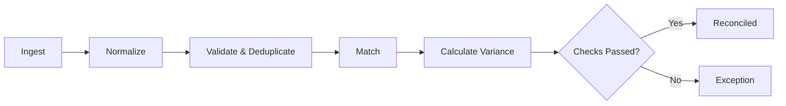
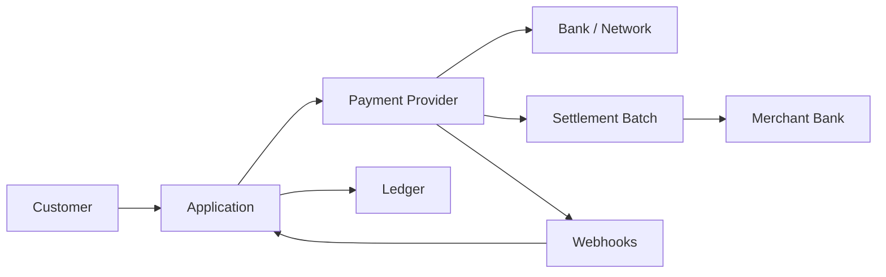
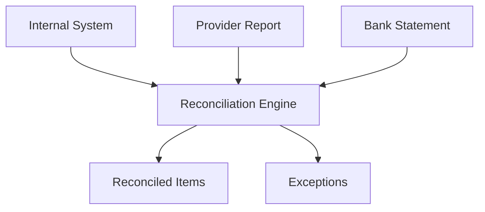
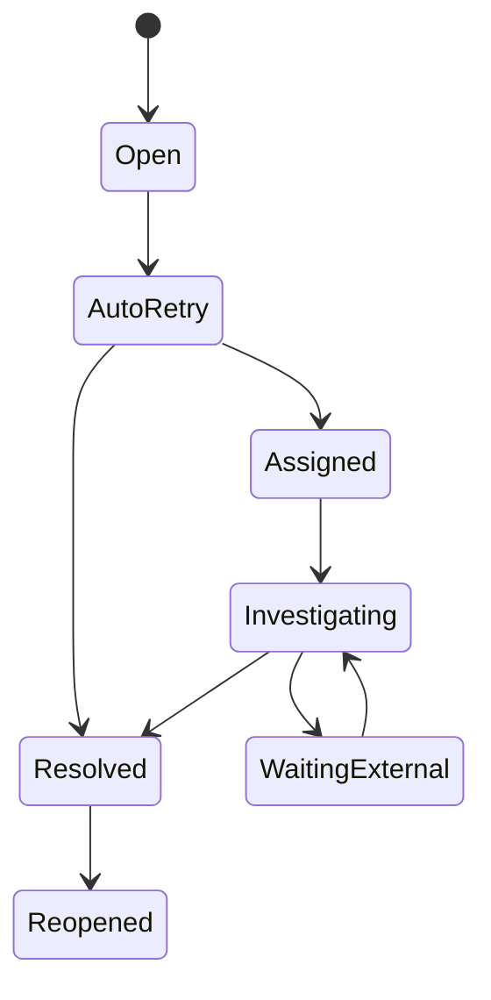
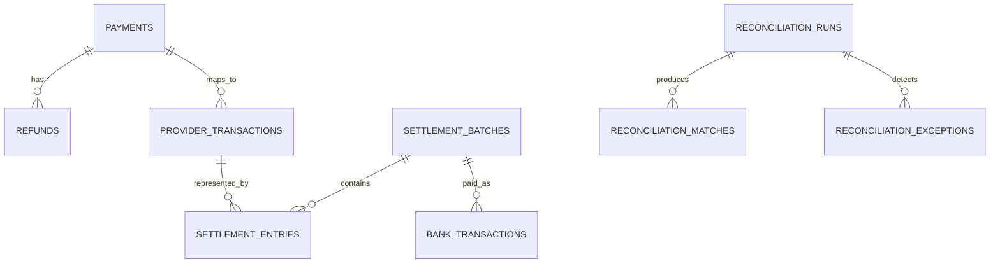
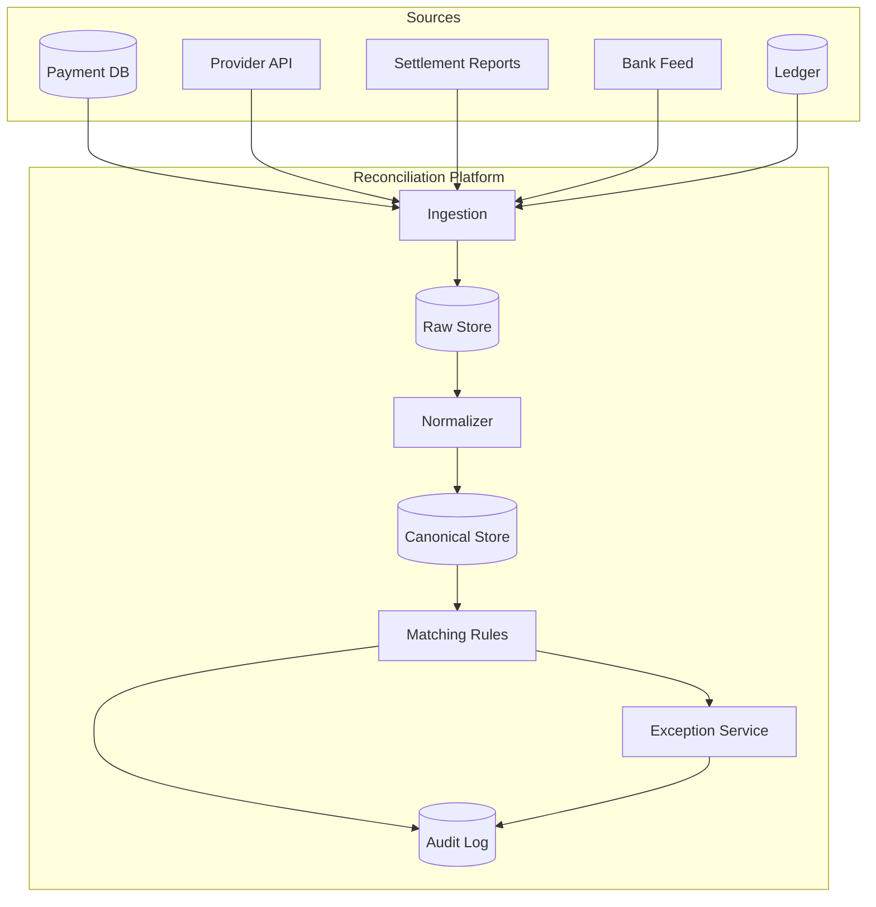

# Reconciliation in Payments & Fintech

> A practical, developer-focused guide to matching payment records, provider settlements, bank movements, and ledger balances.

## In short

Reconciliation verifies that the same money movement is represented correctly across your internal system, payment provider, settlement data, bank account, and ledger.

A payment being `CAPTURED` or a webhook being received does **not** prove that the money reached the bank. Reconciliation adds that financial verification layer.


The usual pipeline is:



For interviews, remember four ideas:

- Match using the **strongest reference first**: provider transaction ID, settlement ID, bank reference, UTR, or trace number.
- Track **gross, fee, tax, refund, adjustment, and net** separately.
- Keep reconciliation status separate from payment status.
- Make imports and matching **idempotent and safely re-runnable**.

---

# Index

1. [What Reconciliation Means](#1-what-reconciliation-means)
2. [Why It Is Needed](#2-why-it-is-needed)
3. [Core Reconciliation Layers](#3-core-reconciliation-layers)
4. [Important Money and Reference Fields](#4-important-money-and-reference-fields)
5. [End-to-End Reconciliation Flow](#5-end-to-end-reconciliation-flow)
6. [Matching Strategy](#6-matching-strategy)
7. [Status and Exception Model](#7-status-and-exception-model)
8. [Data Model and Architecture](#8-data-model-and-architecture)
9. [Idempotency and Late Data](#9-idempotency-and-late-data)
10. [Worked Example](#10-worked-example)
11. [Observability and Financial Controls](#11-observability-and-financial-controls)
12. [Practical Interview Summary](#12-practical-interview-summary)

---

# 1. What Reconciliation Means

Reconciliation is the process of comparing records from two or more systems to confirm that the expected financial movement matches the actual financial movement.

Example:

- Customer pays `₹1,000`.
- Payment provider captures `₹1,000`.
- Provider deducts `₹20` fee and `₹3.60` tax.
- Merchant bank receives `₹976.40`.
- Internal ledger records the corresponding receivable, expense, and cash entries.

The basic check is:

```text
Variance = Expected Amount - Actual Amount
```

A zero variance normally means the financial amount matches. A non-zero variance needs investigation.

## 1.1 Settlement vs Reconciliation

| Term | Meaning |
|---|---|
| Authorization | Issuer confirms funds or credit are available |
| Capture | Merchant requests collection of an authorized amount |
| Settlement / Payout | Provider transfers net funds toward the merchant bank |
| Reconciliation | Records are compared to prove that expected and actual financial movements agree |

**Settlement moves money. Reconciliation verifies the movement.**

## 1.2 Match vs Reconciled

These states should not be treated as the same thing.

```text
MATCHED
The system found corresponding records.

RECONCILED
The corresponding records were found and all required financial checks passed.
```

Example: a payment ID matches the provider record, but the internal amount is `₹1,000` and provider amount is `₹999`.

Result:

```text
Relationship: MATCHED
Financial result: EXCEPTION
```

---

# 2. Why It Is Needed

Payment systems are distributed systems. The same transaction can move through several components at different times.



Differences can appear because of:

- Delayed or duplicated webhooks
- API timeouts after the provider already processed a transaction
- Partial captures or refunds
- Fees and tax deductions
- Chargebacks and reversals
- Rolling reserves
- Settlement cut-off times and holidays
- Foreign exchange conversion
- Provider adjustments
- Many transactions being grouped into one bank payout
- Bank posting delays

Without reconciliation, your application can show a successful payment even when the final cash movement is missing or incorrect.

## 2.1 Business value

A good reconciliation system helps teams:

- Detect missing and duplicate movements
- Verify fees and settlements
- Find delayed refunds and payouts
- Validate merchant or partner payouts
- Keep ledger balances accurate
- Reduce spreadsheet-based manual work
- Support accounting close and audits
- Investigate customer and merchant disputes

---

# 3. Core Reconciliation Layers

A mature payment platform normally reconciles money at several levels.

## 3.1 Transaction reconciliation

Compares your payment record with the provider transaction.

```text
Internal payment ↔ Provider payment / capture
```

Typical checks:

- Same provider transaction ID
- Same amount
- Same currency
- Compatible final status
- No duplicate capture

## 3.2 Refund reconciliation

A refund should be followed beyond the initial API response.


A provider saying the refund succeeded proves the provider-side state. Financial reconciliation additionally verifies its balance, settlement, or bank effect.

## 3.3 Settlement or payout reconciliation

Providers commonly group many payment-related entries into one payout.

```text
Payments
- Refunds
- Fees
- Tax
- Chargebacks
± Adjustments
± Reserve movements
= Net settlement / payout
```

This is why one customer payment usually cannot be matched directly to one bank credit.

## 3.4 Bank reconciliation

Compares the provider payout with the actual bank deposit or debit.

```text
Provider payout ↔ Bank transaction
```

Strong matching fields usually include:

- Settlement or payout ID
- Bank reference
- UTR / trace number
- Amount
- Currency
- Posting or value date window

## 3.5 Ledger reconciliation

Compares externally reported balances with your accounting representation.

```text
Internal ledger balance ↔ Provider / bank reported balance
```

A common control-account equation is:

```text
Opening processor receivable
+ Captures
- Refunds
- Chargebacks
- Fees
- Settlements
± Adjustments
= Closing processor receivable
```

## 3.6 Three-way reconciliation

A common production approach compares three evidence sources:



The ledger can be added as a fourth control layer when accounting accuracy is in scope.

---

# 4. Important Money and Reference Fields

## 4.1 Gross, fee, tax, and net

Do not store only one generic `amount` for settlement reconciliation.

Example:

```text
Gross amount     ₹1,000.00
Processing fee      ₹20.00
Tax on fee           ₹3.60
Net amount          ₹976.40
```

Formula:

```text
Net = Gross - Fees - Tax - Refunds - Chargebacks ± Adjustments
```

Store each material component separately so the payout can be explained.

## 4.2 Money representation

Prefer integer minor units or exact decimal types.

```json
{
  "gross_amount_minor": 100000,
  "fee_amount_minor": 2000,
  "fee_tax_minor": 360,
  "net_amount_minor": 97640,
  "currency": "INR"
}
```

For INR, `100000` minor units means `₹1,000.00`.

Avoid binary floating-point for financial calculations.

```python
from decimal import Decimal

expected = Decimal("1000.00")
actual = Decimal("976.40")
variance = expected - actual
```

## 4.3 References

Useful identifiers include:

- Provider payment or charge ID
- Capture ID
- Refund ID
- Settlement or payout ID
- Merchant reference / order ID
- Acquirer reference
- Bank UTR / trace number

Do not assume an external ID is globally unique. A safer uniqueness scope is often:

```text
provider + merchant_account + record_type + external_id
```

## 4.4 Dates

Payment systems expose several different dates:

| Date | Meaning |
|---|---|
| Created time | Internal transaction creation |
| Authorized time | Authorization approval |
| Captured time | Funds captured |
| Provider processed time | Provider processing timestamp |
| Settlement date | Provider payout/batch date |
| Bank posting date | Bank statement posting time |
| Value date | Financial effective date |

Do not match only on date. Dates can legitimately differ because of processing windows, holidays, and time zones.

---

# 5. End-to-End Reconciliation Flow

## 5.1 Ingest

Collect records from sources such as:

- Internal payment database
- Provider APIs
- Webhooks
- Provider settlement reports
- Bank statement APIs or files
- Ledger or accounting system

Keep raw source records before normalization.

## 5.2 Normalize

Convert provider-specific data into one canonical model.

Normalize:

- Event type
- Status
- Currency
- Amount units
- Sign convention
- Timestamp / time zone
- Reference fields
- Fee categories

Example:

```text
Provider A: charge
Provider B: payment
Provider C: transaction
            ↓
Canonical type: PAYMENT_CAPTURE
```

## 5.3 Validate and deduplicate

Before matching, check:

- Required fields
- Currency
- Numeric amounts
- Record count and control totals
- Complete pagination / file ingestion
- File checksum or signature where available
- Duplicate external records

Example deduplication key:

```text
provider + merchant_account + record_type + external_id
```

For imported files, also keep a file checksum and source-row identity.

## 5.4 Match

Run deterministic rules from strongest to weakest.

Do not continue to lower-confidence rules after a unique strong match is found.

## 5.5 Calculate variance

Calculate both overall and component-level differences.

```text
amount_variance
fee_variance
tax_variance
refund_variance
net_variance
```

## 5.6 Reconcile or create exception

If every required check passes, mark the relationship `RECONCILED`.

Otherwise, create a structured exception with:

- Reason code
- Expected value
- Actual value
- Variance
- Related records
- Detection rule
- Owner
- Age
- Evidence
- Resolution history

---

# 6. Matching Strategy

## 6.1 Rule priority

Use exact identifiers before heuristics.

| Priority | Rule | Typical confidence |
|---:|---|---|
| 1 | Exact provider transaction ID | Very high |
| 2 | Exact settlement ID / bank reference / UTR | Very high |
| 3 | Merchant reference + amount + currency | High |
| 4 | Order ID + amount + date window | Medium-high |
| 5 | Amount + currency + narrow date window | Medium |
| 6 | Grouped amount combinations | Lower; controlled use only |

## 6.2 Example deterministic rule

```text
Rule: PAYMENT_BY_PROVIDER_ID

Conditions:
- same provider
- same merchant account
- internal.provider_payment_id == external.transaction_id
- same currency

Then:
- 1 candidate  -> validate amount and status
- 0 candidates -> try next rule
- >1 candidate -> create duplicate/ambiguous exception
```

## 6.3 Amount tolerance

Exact amount matching is preferred.

Small explicit tolerances may be required for:

- FX rounding
- Tax rounding
- Percentage-based fees
- Interest calculations

Store the tolerance and the rule version that produced the result. Never silently apply a large tolerance.

## 6.4 Date window

A provider transaction may settle one or more days after capture.

Example configurable rule:

```text
capture_time - 1 day
<= provider_time <=
capture_time + 3 days
```

The real window should depend on the payment rail, provider, country, holidays, and contractual SLA.

## 6.5 One-to-one and grouped matching

Reconciliation relationships can be:

```text
1 ↔ 1     one payment to one provider transaction
1 ↔ many  one order captured in multiple parts
many ↔ 1  many provider transactions in one settlement
many ↔ many  bulk/netted movements; use strict controls
```

Many-to-one is especially common for provider payouts.

---

# 7. Status and Exception Model

Keep payment status and reconciliation status separate.

A payment may be:

```text
Payment status: CAPTURED
Reconciliation status: UNMATCHED
```

## 7.1 Recommended reconciliation states

| Status | Meaning |
|---|---|
| `NOT_READY` | Expected external evidence is not available yet |
| `UNMATCHED` | Matching ran but no candidate was found |
| `PARTIALLY_MATCHED` | Only part of the expected relationship matched |
| `MATCHED` | Relationship was found; financial validation may still be pending |
| `RECONCILED` | Required relationships and amount checks passed |
| `EXCEPTION` | Mismatch or invalid condition detected |
| `MANUAL_REVIEW` | Human investigation is required |
| `RESOLVED` | Exception was closed with a recorded outcome |
| `REVERSED` | Earlier reconciliation was undone because source data changed |

## 7.2 Common exception codes

| Code | Meaning |
|---|---|
| `INTERNAL_ONLY` | Internal record exists but provider record is missing |
| `PROVIDER_ONLY` | Provider record exists without corresponding internal record |
| `AMOUNT_MISMATCH` | Matching reference but different amount |
| `CURRENCY_MISMATCH` | Matching reference but different currency |
| `DUPLICATE_PROVIDER` | Duplicate external records detected |
| `MISSING_SETTLEMENT` | Eligible transaction not found in expected payout |
| `MISSING_BANK_CREDIT` | Provider payout exists but bank entry is missing |
| `UNBALANCED_BATCH` | Settlement components do not equal batch net amount |
| `REFUND_MISMATCH` | Refund status or amount differs |
| `LATE_POSTING` | Movement arrived outside expected timing |

## 7.3 Exception lifecycle



Keep structured resolution codes and audit history. A free-text comment alone is not enough for financial controls.

---

# 8. Data Model and Architecture

A production design usually preserves five things separately:

1. Raw source data
2. Normalized canonical data
3. Match relationships
4. Exceptions
5. Audit history

## 8.1 Core tables

```text
payments
refunds
provider_transactions
settlement_batches
settlement_entries
bank_transactions
ledger_transactions
reconciliation_runs
reconciliation_matches
reconciliation_exceptions
imported_files
```

## 8.2 Simplified relationship model



## 8.3 High-level architecture



## 8.4 Reconciliation run metadata

Every run should be reproducible.

Store fields such as:

```json
{
  "run_id": "recon_2026_08_20_provider_a",
  "provider": "provider_a",
  "period_start": "2026-08-19T00:00:00Z",
  "period_end": "2026-08-20T00:00:00Z",
  "rule_version": "v7",
  "input_count": 100000,
  "reconciled_count": 99820,
  "exception_count": 180,
  "status": "COMPLETED_WITH_EXCEPTIONS"
}
```

This makes rule changes, backfills, and audits much easier to explain.

---

# 9. Idempotency and Late Data

## 9.1 Idempotent imports

Re-importing the same provider report must not create duplicate financial records.

A possible import identity is:

```text
SHA256(provider + merchant_account + file_checksum)
```

The exact key can vary, but the result should be deterministic.

## 9.2 Idempotent matching

Running reconciliation again against the same source data and same rule version should produce the same relationships and result.

Store:

- Rule version
- Source-data version
- Run ID
- Previous match relationship
- Reason for rematch

## 9.3 Overlapping retrieval windows

Late-arriving provider records are normal.

A daily job can intentionally fetch the previous few days again:

```text
Today: 20 Aug
Fetch: 17 Aug → 20 Aug
```

Deduplication keeps repeated ingestion safe while the overlap catches late records.

## 9.4 Event-driven plus batch

Use different sources for different jobs:

```text
Webhooks        -> fast operational updates
Provider API    -> status verification
Settlement file -> financial completeness
Bank feed       -> actual cash confirmation
Ledger          -> accounting control
```

Webhooks are useful, but they should not be the only reconciliation source.

---

# 10. Worked Example

Assume the merchant has three captured payments.

## 10.1 Internal payments

| Payment | Gross |
|---|---:|
| P1 | ₹1,000.00 |
| P2 | ₹2,000.00 |
| P3 | ₹500.00 |
| **Total** | **₹3,500.00** |

## 10.2 Provider activity

| Entry | Gross | Fee | Tax | Net |
|---|---:|---:|---:|---:|
| P1 capture | ₹1,000.00 | ₹20.00 | ₹3.60 | ₹976.40 |
| P2 capture | ₹2,000.00 | ₹40.00 | ₹7.20 | ₹1,952.80 |
| P3 capture | ₹500.00 | ₹10.00 | ₹1.80 | ₹488.20 |
| P2 partial refund | -₹500.00 | ₹0.00 | ₹0.00 | -₹500.00 |

Settlement calculation:

```text
Gross captures       ₹3,500.00
Less refund           -₹500.00
Less fees              -₹70.00
Less tax               -₹12.60
--------------------------------
Expected settlement  ₹2,917.40
```

## 10.3 Provider settlement

```text
Settlement ID: set_20260820_001
Net amount:    ₹2,917.40
Bank UTR:      UTR123456789
```

## 10.4 Bank statement

```text
20-Aug-2026 | UTR123456789 | PROVIDER SETTLEMENT | +₹2,917.40
```

## 10.5 Reconciliation result

```text
P1 internal ↔ provider capture     RECONCILED
P2 internal ↔ provider capture     RECONCILED
P3 internal ↔ provider capture     RECONCILED
P2 refund   ↔ provider refund      RECONCILED

Expected settlement: ₹2,917.40
Provider settlement: ₹2,917.40
Settlement variance: ₹0.00

Provider payout:      ₹2,917.40
Bank credit:          ₹2,917.40
UTR:                  MATCH
Bank variance:        ₹0.00
```

Final state:

```text
Transaction reconciliation  RECONCILED
Settlement reconciliation   RECONCILED
Bank reconciliation         RECONCILED
```

If the bank received `₹2,900.00` instead, the system should create an `AMOUNT_MISMATCH` or `MISSING_ADJUSTMENT` style exception for the `₹17.40` variance. It should **not** silently change the expected settlement amount.

---

# 11. Observability and Financial Controls

## 11.1 Useful metrics

```text
reconciliation_match_rate
reconciliation_auto_reconcile_rate
reconciliation_exception_rate
unmatched_amount_total
variance_amount_total
exceptions_open_total
exceptions_by_age
average_resolution_time
settlements_missing_in_bank
report_import_delay
reconciliation_run_duration
```

Track both record count and amount.

```text
Count match rate
= reconciled records / eligible records × 100

Amount match rate
= reconciled amount / eligible amount × 100
```

Amount-weighted metrics matter because one large unmatched payment may be more important than hundreds of tiny matched payments.

## 11.2 Alerts

Useful alerts include:

- Settlement expected but not received by SLA
- Bank payout variance above threshold
- Sudden increase in provider-only records
- Duplicate transaction spike
- Settlement report not received
- File control total mismatch
- Reconciliation job failure
- Match rate suddenly drops after a rule change

## 11.3 Audit and access controls

Financial reconciliation needs strong auditability.

Keep:

- Who performed an action
- Previous and new values
- Timestamp
- Reason
- Evidence
- Approval details

High-risk actions such as write-offs, manual adjustments, and match overrides may require maker-checker approval.

Use least privilege and keep raw evidence immutable where possible.

---

# 12. Practical Interview Summary

A strong reconciliation design can be explained in this order:

```text
1. Ingest records from internal systems, provider APIs/reports, bank feeds, and ledger.
2. Preserve raw data and normalize everything into a canonical model.
3. Validate and deduplicate before matching.
4. Match using the strongest reference first.
5. Support one-to-one and grouped settlement relationships.
6. Compare gross, fee, tax, refund, adjustment, and net amounts.
7. Keep MATCHED separate from RECONCILED.
8. Send mismatches into a structured exception workflow.
9. Make imports and matching idempotent and safely re-runnable.
10. Track run versions, metrics, audit history, and late-arriving data.
```

The most important architectural idea is this:

> **Operational payment state tells you what the system believes happened. Reconciliation proves what financially happened across independent sources.**

---

# References

Official documentation checked for current terminology and reconciliation patterns on 20 August 2026:

1. Stripe — Payout reconciliation  
   https://docs.stripe.com/payouts/reconciliation

2. Stripe — Payout reconciliation report  
   https://docs.stripe.com/reports/payout-reconciliation

3. Stripe — Bank reconciliation  
   https://docs.stripe.com/bank-reconciliation

4. Adyen — Settlement details report  
   https://docs.adyen.com/reporting/settlement-reconciliation/transaction-level/settlement-details-report

5. Adyen — Aggregate settlement details report  
   https://docs.adyen.com/reporting/settlement-reconciliation/batch-level/aggregate-settlement-details-report

6. Razorpay — Settlements  
   https://razorpay.com/docs/payments/settlements/

7. Razorpay — Settlement FAQs / reconciliation reports  
   https://razorpay.com/docs/payments/settlements/faqs/

8. Modern Treasury — Account Reconciliation  
   https://docs.moderntreasury.com/ledgers/docs/account-reconciliation
