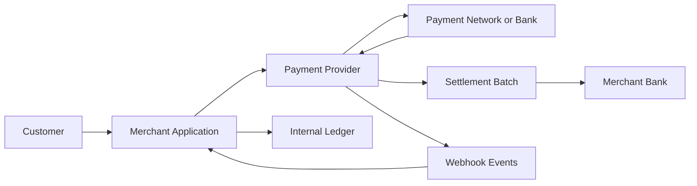
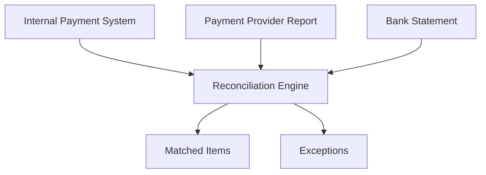
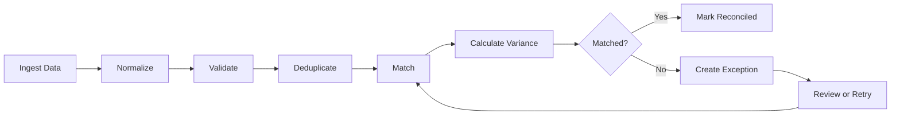
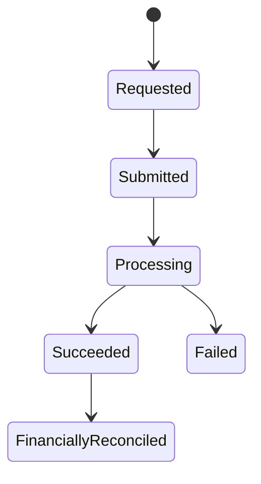
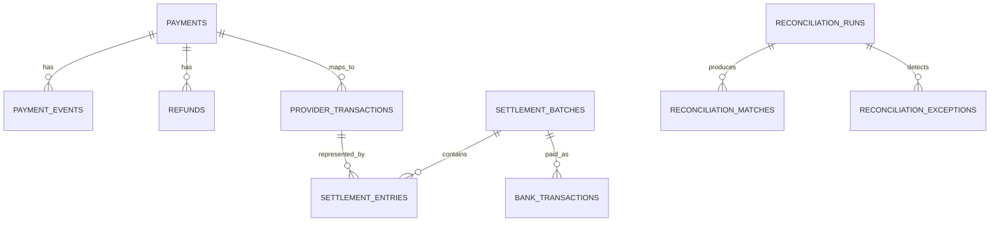
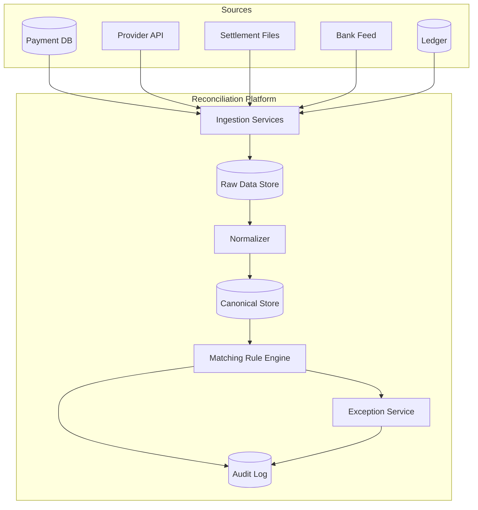
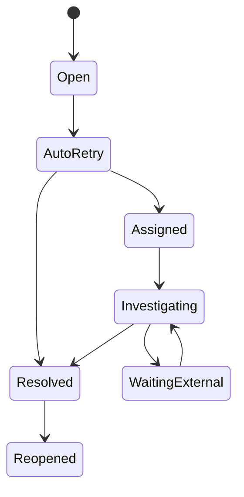

# Reconciliation in Payments & Fintech

> A practical, developer-focused guide to matching payment records, settlement reports, bank movements, and ledger balances.

**Audience:** Backend engineers and fintech developers with 3+ years of experience  
**Focus:** Real-world payment systems, system design, data modelling, automation, operational controls, and interview-relevant concepts  
**Last reviewed:** August 2026

---

# 1. What Is Reconciliation?

Reconciliation is the process of comparing records from two or more systems to confirm that the same financial activity is represented correctly everywhere.

In a payment flow, your application may say:

- A customer paid ₹1,000.
- The payment gateway captured ₹1,000.
- The gateway deducted ₹25 in fees.
- The bank received a net settlement of ₹975.
- Your internal ledger recorded the correct debit and credit entries.

Reconciliation verifies that all these records agree.

```text
Business expectation
        ↓
Payment provider activity
        ↓
Settlement report
        ↓
Bank statement
        ↓
Internal accounting ledger
```

A simple reconciliation equation is:

```text
Expected amount - Actual amount = Variance
```

A variance of zero usually means the records match. A non-zero variance becomes an exception that must be investigated.

## 1.1 Reconciliation Is Not the Same as Settlement

These terms are related but different:

| Term | Meaning |
|---|---|
| Payment | The customer's attempt to transfer money |
| Authorization | The issuer confirms that funds or credit are available |
| Capture | The merchant confirms that the authorized amount should be collected |
| Clearing | Payment participants exchange transaction information |
| Settlement | Funds are transferred between financial participants or into the merchant's bank account |
| Reconciliation | Records are compared to verify that the expected movement matches the actual movement |

**Settlement moves money. Reconciliation proves that the money movement is correct.**

---

# 2. Why Reconciliation Is Necessary

Payment systems are distributed systems. A single transaction may pass through your frontend, backend, payment service provider, card network, bank, webhook system, settlement process, and accounting platform.

Each component may process the same event at a different time.



Common causes of differences include:

- Delayed webhooks
- Duplicate events
- Network timeouts
- Payment status changing after the API response
- Partial captures
- Partial refunds
- Processing fees
- Tax on fees
- Chargebacks and reversals
- Rolling reserves
- Foreign exchange conversion
- Settlement holidays and cut-off times
- A provider grouping many transactions into one payout
- A bank combining or splitting credits
- Manual operational adjustments

Without reconciliation, an application can show a successful payment even when the expected funds never reach the bank.

## 2.1 Business Value

A strong reconciliation process helps a fintech business:

- Detect missing or duplicate money movement
- Confirm provider fees
- Identify delayed settlements
- Find unprocessed refunds
- Verify merchant or partner payouts
- Produce reliable financial reports
- Close accounting periods faster
- Reduce manual spreadsheet work
- Maintain an audit trail
- Investigate customer and merchant disputes

---

# 3. Important Payment Terms

## 3.1 Gross Amount

The full amount paid by the customer before deductions.

```text
Gross amount = ₹1,000
```

## 3.2 Fee

The amount charged by a gateway, acquiring bank, network, or payment processor.

```text
Processing fee = ₹20
Tax on fee     = ₹3.60
```

## 3.3 Net Amount

The amount expected after deductions and adjustments.

```text
Net amount = Gross amount - Fee - Tax - Refunds - Chargebacks ± Adjustments
```

For the example:

```text
₹1,000 - ₹20 - ₹3.60 = ₹976.40
```

## 3.4 Settlement Batch or Payout

Providers commonly combine multiple payment-related entries into a single bank transfer.

```text
Payment A   +₹1,000
Payment B   +₹2,000
Refund C      -₹500
Fees           -₹60
Tax            -₹10.80
----------------------
Bank payout  +₹2,429.20
```

The bank may contain only the final ₹2,429.20 credit. Therefore, matching every payment directly to a bank line is not always possible. The reconciliation process must understand the settlement batch.

## 3.5 Provider Reference

An identifier created by the payment provider, such as:

- Payment ID
- Charge ID
- Capture ID
- Refund ID
- Payout or settlement ID
- Provider transaction reference
- Acquirer reference
- Bank UTR or trace number

Do not assume every reference is globally unique. Store the provider name and merchant account together with the reference.

## 3.6 Value Date and Processing Date

| Date | Description |
|---|---|
| Created time | When your system created the payment |
| Authorized time | When authorization was approved |
| Captured time | When funds were captured |
| Provider processed time | When the provider processed the entry |
| Settlement date | Date assigned to the payout or batch |
| Bank posting date | When the bank posted the movement |
| Value date | Date on which the movement financially takes effect |

Matching only by date is unreliable because these dates can differ.

---

# 4. Types of Reconciliation

Reconciliation is not one comparison. Mature systems perform it at multiple layers.

## 4.1 Payment or Transaction Reconciliation

Compares your application's payment records with provider transaction records.

```text
Internal payment record ↔ Provider payment/capture record
```

Typical questions:

- Does every internal success have a successful provider transaction?
- Did the provider capture the same amount and currency?
- Is an internal pending payment actually successful at the provider?
- Did duplicate captures occur?

## 4.2 Refund Reconciliation

Compares internal refund requests with provider refunds and eventual financial deductions.

```text
Refund request ↔ Provider refund ↔ Settlement deduction or bank debit
```

A refund can be accepted by an API but fail or remain pending later. Reconciliation must use the final provider state rather than assuming the initial response is final.

## 4.3 Settlement or Payout Reconciliation

Compares provider transactions and adjustments with the provider's settlement batch.

```text
Payments + refunds + fees + adjustments = Settlement net amount
```

This answers:

- Which payments are included in a settlement?
- Are all deductions explained?
- Is the provider's net payout mathematically correct?

## 4.4 Bank Reconciliation

Compares provider payouts with bank statement entries.

```text
Provider payout ↔ Bank credit or debit
```

The strongest keys are normally settlement IDs, bank references, UTRs, trace numbers, amounts, currencies, and date windows.

## 4.5 Ledger Reconciliation

Compares the internal accounting ledger with provider or bank-reported balances.

```text
Internal ledger balance ↔ Provider balance ↔ Bank balance
```

This ensures that the system's accounting representation matches external reality.

## 4.6 Partner, Merchant, or Marketplace Reconciliation

Platforms frequently split customer money among merchants, sellers, drivers, vendors, brokers, or connected accounts.

```text
Customer collection
    ↓
Platform fee
    ↓
Tax / reserve / adjustment
    ↓
Partner payable
    ↓
Partner payout
```

The platform must reconcile both sides:

1. Money collected from the customer
2. Money owed and paid to the partner

## 4.7 Three-Way Reconciliation

A common production model compares three sources:



Example:

| Source | Amount | Reference | Status |
|---|---:|---|---|
| Internal system | ₹5,000 | order_123 | Paid |
| Provider | ₹5,000 | pay_789 | Captured |
| Bank settlement | Included in ₹48,250 payout | set_456 | Credited |

The payment is fully reconciled only after each expected stage is verified.

---

# 5. End-to-End Reconciliation Flow

A practical reconciliation pipeline usually follows these stages.



## 5.1 Ingest

Collect records from:

- Internal payment database
- Provider APIs
- Provider webhooks
- Settlement reports
- SFTP or object storage files
- Bank statement APIs
- CAMT, BAI2, MT940, CSV, XLSX, or custom files
- Internal ledger
- Accounting or ERP system

## 5.2 Normalize

Convert external records into a canonical internal format.

For example, providers may use different names:

```text
Provider A: charge
Provider B: payment
Provider C: transaction
Internal canonical type: PAYMENT_CAPTURE
```

Normalization should standardize:

- Currency format
- Amount units
- Time zone
- Event type
- Status
- Reference fields
- Fee categories
- Sign convention

## 5.3 Validate

Before matching, verify:

- Required fields are present
- Currency is supported
- Amount is numeric
- File totals match control totals
- Records are not malformed
- Report date range is correct
- File or API page is complete
- Signature or checksum is valid when provided

## 5.4 Deduplicate

Provider reports and webhooks may be delivered more than once. Use stable identifiers and import fingerprints.

```text
Deduplication key = provider + merchant_account + record_type + external_id
```

For files, also store:

```text
file_hash + row_number + normalized_row_hash
```

## 5.5 Match

Apply deterministic rules first. Use increasingly flexible rules only when safe.

## 5.6 Calculate Variance

```text
amount_variance = expected_amount - actual_amount
```

Also calculate component-level variance:

```text
gross_variance
fee_variance
tax_variance
refund_variance
net_variance
```

## 5.7 Resolve or Escalate

Matched items are finalized. Unmatched items enter an exception workflow with an owner, reason, evidence, and resolution history.

---

# 6. The Three Main Sources of Truth

A useful design does not declare one system as the source of truth for everything.

## 6.1 Internal Business System

Best source for:

- Order identity
- Customer intent
- Merchant or partner ownership
- Expected amount
- Business status
- Product or invoice mapping

It is not sufficient to prove that money moved.

## 6.2 Payment Provider

Best source for:

- Authorization and capture state
- Provider fees
- Refund and chargeback state
- Settlement grouping
- Provider-side references

It does not by itself prove that the bank received the payout.

## 6.3 Bank Statement

Best source for:

- Actual bank credits and debits
- Posting and value dates
- Bank references
- Closing cash balance

It may not contain enough transaction-level detail to identify every customer payment.

## 6.4 Internal Ledger

Best source for:

- Financial obligations
- Account-level balances
- Revenue, cash, fees, refunds, receivables, and payables
- Historical accounting audit trail

The ledger should represent external events, but it still requires reconciliation against provider and bank evidence.

---

# 7. Matching Models

The relationship between internal and external records is not always one-to-one.

## 7.1 One-to-One

One internal record matches one external record.

```text
Internal payment ₹1,000 ↔ Provider capture ₹1,000
```

## 7.2 One-to-Many

One expected item matches several actual items.

Example: one ₹1,000 order is captured in two parts.

```text
Expected order: ₹1,000
Actual capture A: ₹600
Actual capture B: ₹400
```

## 7.3 Many-to-One

Several transactions match one settlement or bank credit.

```text
Payment A ₹1,000 ┐
Payment B ₹2,000 ├── Settlement ₹3,500 before deductions
Payment C   ₹500 ┘
```

## 7.4 Many-to-Many

Multiple expected records match multiple external records.

This can happen when:

- A bulk payment is split by the bank
- Several invoices are paid in multiple instalments
- Aggregated marketplace settlements are reallocated
- Netting combines receivables and payables

Many-to-many matching should be tightly controlled because incorrect combinations can produce false matches.

## 7.5 Balance-Based Reconciliation

Instead of matching individual records, compare opening balance, period activity, and closing balance.

```text
Opening balance
+ Credits
- Debits
= Expected closing balance
```

Then compare:

```text
Expected closing balance ↔ Reported closing balance
```

This is useful for provider wallet balances, reserve accounts, clearing accounts, and general ledger control accounts.

---

# 8. Matching Strategy and Rules

## 8.1 Rule Priority

Use the safest rule first.

| Priority | Rule | Confidence |
|---:|---|---|
| 1 | Exact provider transaction ID | Very high |
| 2 | Exact settlement ID or bank reference | Very high |
| 3 | Merchant reference + amount + currency | High |
| 4 | Order ID + amount + date window | Medium to high |
| 5 | Amount + currency + narrow time window | Medium |
| 6 | Aggregated amount combinations | Lower; requires controls |

A rule engine should stop after a unique high-confidence match. It should not continue searching and accidentally link the record again.

## 8.2 Example Matching Rule

```text
Rule: PAYMENT_BY_PROVIDER_ID

Conditions:
- internal.provider = external.provider
- internal.provider_payment_id = external.transaction_id
- internal.currency = external.currency
- internal.captured_amount = external.gross_amount

Result:
- Match when exactly one external record is found
- Raise DUPLICATE_EXTERNAL_RECORD when more than one is found
- Continue to the next rule when none is found
```

## 8.3 Date Tolerance

Date tolerance handles asynchronous posting.

```text
Internal capture time: 03 Aug, 22:58 IST
Provider report date: 04 Aug
Bank posting date:     05 Aug
```

A matching rule may use a configurable window:

```text
capture_time - 1 day <= provider_time <= capture_time + 3 days
```

Do not hardcode one window for every rail. Card, UPI, ACH, wire, wallet, and cross-border transactions have different timing behaviour.

## 8.4 Amount Tolerance

Exact amounts should be preferred. Tolerance may be appropriate for:

- Foreign exchange rounding
- Percentage-based fees
- Minor-unit conversion
- Tax rounding
- Interest calculations

Example:

```text
Absolute tolerance: ₹0.01
Percentage tolerance: 0.001%
```

Never apply a broad tolerance silently. Store the rule and tolerance that produced the match.

## 8.5 Currency Must Be Explicit

`100 USD` must never match `100 INR`.

Store money as:

```text
amount_minor = 10000
currency = "INR"
```

Here, `10000` means ₹100.00 when INR uses two decimal places.

Avoid binary floating-point for financial calculations.

```python
from decimal import Decimal

expected = Decimal("100.00")
actual = Decimal("99.99")
variance = expected - actual
```

## 8.6 Signed Amount Convention

Choose one convention and use it everywhere.

Example from the merchant's perspective:

| Entry | Sign |
|---|---:|
| Customer payment | Positive |
| Refund | Negative |
| Processing fee | Negative |
| Tax on fee | Negative |
| Chargeback | Negative |
| Chargeback reversal | Positive |
| Reserve hold | Negative |
| Reserve release | Positive |

## 8.7 Confidence Score

When fuzzy or multi-field matching is unavoidable, compute a confidence score.

```text
Exact provider ID       +60
Exact amount            +20
Exact currency          +10
Date within 1 day        +5
Matching merchant ref    +5
--------------------------------
Total                   100
```

Suggested policy:

```text
95-100  Auto-match
80-94   Review queue
<80     Remain unmatched
```

The score should support deterministic decisions, not replace strong identifiers.

---

# 9. Handling Fees, Refunds, Chargebacks, and Reserves

## 9.1 Fees

Providers may deduct:

- Gateway fee
- Network fee
- Acquirer fee
- Platform fee
- Payout fee
- Instant settlement fee
- Cross-border fee
- Foreign exchange fee
- Tax on fees

Do not store one generic `fee` field if the provider exposes fee components that matter for accounting or reporting.

```json
{
  "gross_amount_minor": 100000,
  "fee_amount_minor": 2000,
  "fee_tax_minor": 360,
  "net_amount_minor": 97640,
  "currency": "INR"
}
```

Validation:

```text
100000 - 2000 - 360 = 97640
```

## 9.2 Refunds

A refund has multiple stages:



`Succeeded` may mean the provider processed the refund. `FinanciallyReconciled` means the refund's financial effect was also found in provider balance activity or settlement data.

Partial refunds require cumulative checks:

```text
Total successful refunds <= Captured amount
```

## 9.3 Chargebacks and Disputes

A chargeback may occur weeks or months after the original payment. Keep the original transaction link.

```text
Original payment
    ↓
Dispute opened
    ↓
Provisional debit
    ↓
Won / lost
    ↓
Reversal or final debit
```

Reconciliation must handle both the dispute event and the related balance movement.

## 9.4 Reserves and Holds

A provider may hold part of the merchant balance for risk management.

```text
Available amount
- Reserve hold
= Current payout amount
```

Later:

```text
Reserve release → Future settlement
```

A reserve hold is not necessarily a fee. It is generally a movement between available and reserved balances and should be modelled separately.

## 9.5 Adjustments

Manual or provider-generated adjustments need explicit reason codes.

Examples:

- Fee correction
- Rounding adjustment
- Provider compensation
- Settlement correction
- Negative balance recovery
- Manual operational credit

Never modify the original transaction to absorb an unexplained adjustment.

## 9.6 Foreign Exchange

Cross-currency reconciliation may require both source and settlement amounts.

```text
Customer charge:      USD 100.00
Provider FX rate:     83.1200
Converted amount:     INR 8,312.00
FX fee:               INR    83.12
Net before other fee: INR 8,228.88
```

Store:

- Source amount and currency
- Settlement amount and currency
- Applied FX rate
- FX fee
- Provider conversion reference
- Rate timestamp or rate date when available

---

# 10. Reconciliation Status Model

Do not overload the payment status with reconciliation state.

A payment can be `CAPTURED` but still `UNRECONCILED`.

## 10.1 Suggested Statuses

```text
NOT_READY
UNMATCHED
PARTIALLY_MATCHED
MATCHED
RECONCILED
EXCEPTION
MANUAL_REVIEW
RESOLVED
REVERSED
```

## 10.2 Meaning

| Status | Meaning |
|---|---|
| NOT_READY | The expected external data is not available yet |
| UNMATCHED | Matching was attempted but no candidate was found |
| PARTIALLY_MATCHED | Some, but not all, expected components matched |
| MATCHED | Record relationships were found |
| RECONCILED | Relationships and financial totals were validated |
| EXCEPTION | A mismatch or invalid condition was detected |
| MANUAL_REVIEW | Human action is required |
| RESOLVED | Exception was closed with a documented resolution |
| REVERSED | A prior reconciliation was undone because source data changed |

## 10.3 Match vs Reconciled

```text
Matched:
The system found corresponding records.

Reconciled:
The records correspond and all required financial checks passed.
```

Example:

```text
Payment ID matches, but provider amount is ₹999 instead of ₹1,000.
Result: MATCHED relationship, EXCEPTION financial state.
```

---

# 11. Recommended Data Model

A production design should preserve raw data, normalized data, matches, exceptions, and audit history.

## 11.1 Core Tables

```text
payments
payment_events
refunds
provider_transactions
settlement_batches
settlement_entries
bank_transactions
ledger_transactions
reconciliation_runs
reconciliation_matches
reconciliation_exceptions
reconciliation_actions
imported_files
```

## 11.2 Simplified Relationship Diagram



## 11.3 Example SQL Schema

```sql
CREATE TABLE provider_transactions (
    id UUID PRIMARY KEY,
    provider VARCHAR(50) NOT NULL,
    merchant_account_id VARCHAR(100) NOT NULL,
    external_transaction_id VARCHAR(150) NOT NULL,
    transaction_type VARCHAR(50) NOT NULL,
    status VARCHAR(50) NOT NULL,
    amount_minor BIGINT NOT NULL,
    fee_minor BIGINT NOT NULL DEFAULT 0,
    tax_minor BIGINT NOT NULL DEFAULT 0,
    net_amount_minor BIGINT NOT NULL,
    currency CHAR(3) NOT NULL,
    occurred_at TIMESTAMPTZ NOT NULL,
    settlement_id VARCHAR(150),
    source_file_id UUID,
    raw_payload JSONB NOT NULL,
    created_at TIMESTAMPTZ NOT NULL DEFAULT NOW(),
    UNIQUE (
        provider,
        merchant_account_id,
        external_transaction_id,
        transaction_type
    )
);
```

```sql
CREATE TABLE reconciliation_matches (
    id UUID PRIMARY KEY,
    reconciliation_run_id UUID NOT NULL,
    left_entity_type VARCHAR(50) NOT NULL,
    left_entity_id UUID NOT NULL,
    right_entity_type VARCHAR(50) NOT NULL,
    right_entity_id UUID NOT NULL,
    match_rule VARCHAR(100) NOT NULL,
    confidence_score NUMERIC(5, 2) NOT NULL,
    expected_amount_minor BIGINT NOT NULL,
    actual_amount_minor BIGINT NOT NULL,
    variance_minor BIGINT NOT NULL,
    currency CHAR(3) NOT NULL,
    status VARCHAR(30) NOT NULL,
    matched_at TIMESTAMPTZ NOT NULL DEFAULT NOW(),
    UNIQUE (
        left_entity_type,
        left_entity_id,
        right_entity_type,
        right_entity_id,
        match_rule
    )
);
```

## 11.4 Raw Payload Retention

Store the original provider record before normalization.

Benefits:

- Reprocessing after parser changes
- Audit evidence
- Provider support investigations
- Detection of mapping errors
- Backfilling newly introduced fields

Prefer immutable raw records. Corrections should create a new version or adjustment rather than silently overwriting evidence.

## 11.5 Import Metadata

Store:

```text
provider
source type
file name or API endpoint
report period
file checksum
record count
control totals
import started time
import completed time
parser version
import status
```

---

# 12. Reconciliation Engine Design

## 12.1 High-Level Architecture



## 12.2 Components

### Ingestion Service

Responsible for:

- API pagination
- File retrieval
- Signature or checksum verification
- Schema validation
- Raw storage
- Import deduplication
- Retry handling

### Normalization Service

Responsible for:

- Provider-specific field mapping
- Time-zone conversion
- Money conversion to minor units
- Status mapping
- Event-type mapping
- Reference extraction

### Matching Rule Engine

Responsible for:

- Ordered rule execution
- Candidate generation
- One-to-one and grouped matching
- Amount and date tolerance
- Confidence scoring
- Prevention of double matching

### Exception Service

Responsible for:

- Reason classification
- Queue assignment
- Evidence display
- Comments and attachments
- Resolution action
- Re-run or re-open behaviour

### Reporting Service

Responsible for:

- Reconciliation summaries
- Ageing reports
- Variance trends
- Provider-level dashboards
- Period-close exports

## 12.3 Rule Engine Pseudocode

```python
from dataclasses import dataclass
from decimal import Decimal
from typing import Iterable


@dataclass(frozen=True)
class Candidate:
    external_id: str
    amount: Decimal
    currency: str


@dataclass(frozen=True)
class MatchResult:
    status: str
    rule: str | None
    candidate_id: str | None
    variance: Decimal | None


def reconcile_payment(payment, candidates: Iterable[Candidate]) -> MatchResult:
    exact_id_matches = [
        candidate
        for candidate in candidates
        if candidate.external_id == payment.provider_payment_id
    ]

    if len(exact_id_matches) > 1:
        return MatchResult(
            status="EXCEPTION",
            rule="EXACT_PROVIDER_ID",
            candidate_id=None,
            variance=None,
        )

    if len(exact_id_matches) == 1:
        candidate = exact_id_matches[0]

        if candidate.currency != payment.currency:
            return MatchResult(
                status="EXCEPTION",
                rule="EXACT_PROVIDER_ID",
                candidate_id=candidate.external_id,
                variance=None,
            )

        variance = payment.amount - candidate.amount
        status = "RECONCILED" if variance == Decimal("0") else "EXCEPTION"

        return MatchResult(
            status=status,
            rule="EXACT_PROVIDER_ID",
            candidate_id=candidate.external_id,
            variance=variance,
        )

    return MatchResult(
        status="UNMATCHED",
        rule=None,
        candidate_id=None,
        variance=None,
    )
```

## 12.4 Reconciliation Run

Every execution should have a run record.

```json
{
  "run_id": "recon_2026_08_03_provider_a",
  "provider": "provider_a",
  "period_start": "2026-08-02T00:00:00Z",
  "period_end": "2026-08-03T00:00:00Z",
  "rule_version": "v7",
  "status": "COMPLETED_WITH_EXCEPTIONS",
  "input_count": 100000,
  "matched_count": 99820,
  "exception_count": 180
}
```

This makes results reproducible and supports comparison after a rule change.

---

# 13. Worked Example

Assume a merchant receives three payments.

## 13.1 Internal Records

| Payment | Gross amount | Status |
|---|---:|---|
| P1 | ₹1,000.00 | Captured |
| P2 | ₹2,000.00 | Captured |
| P3 | ₹500.00 | Captured |

Total gross:

```text
₹1,000 + ₹2,000 + ₹500 = ₹3,500
```

## 13.2 Provider Activity

| Entry | Gross | Fee | Tax | Net |
|---|---:|---:|---:|---:|
| P1 capture | ₹1,000.00 | ₹20.00 | ₹3.60 | ₹976.40 |
| P2 capture | ₹2,000.00 | ₹40.00 | ₹7.20 | ₹1,952.80 |
| P3 capture | ₹500.00 | ₹10.00 | ₹1.80 | ₹488.20 |
| P2 partial refund | -₹500.00 | ₹0.00 | ₹0.00 | -₹500.00 |

Calculation:

```text
Gross captures             ₹3,500.00
Less refund                  ₹500.00
Less fees                     ₹70.00
Less tax                      ₹12.60
------------------------------------
Expected settlement         ₹2,917.40
```

## 13.3 Provider Settlement Report

```text
Settlement ID: set_20260803_001
Net amount:    ₹2,917.40
Bank ref:      UTR123456789
```

## 13.4 Bank Statement

```text
03-Aug-2026 | UTR123456789 | PROVIDER SETTLEMENT | +₹2,917.40
```

## 13.5 Reconciliation Result

### Transaction Level

```text
P1 internal ↔ P1 provider capture: MATCH
P2 internal ↔ P2 provider capture: MATCH
P3 internal ↔ P3 provider capture: MATCH
P2 refund   ↔ Provider refund:     MATCH
```

### Settlement Level

```text
Expected net: ₹2,917.40
Provider net: ₹2,917.40
Variance:     ₹0.00
```

### Bank Level

```text
Provider payout: ₹2,917.40
Bank credit:     ₹2,917.40
Reference match: UTR123456789
Variance:        ₹0.00
```

### Final State

```text
Transaction reconciliation: RECONCILED
Settlement reconciliation:  RECONCILED
Bank reconciliation:        RECONCILED
```

## 13.6 Example Exception

Suppose the bank received ₹2,900.00 instead.

```text
Expected bank credit: ₹2,917.40
Actual bank credit:   ₹2,900.00
Variance:                ₹17.40
```

Possible causes:

- Extra payout fee
- Bank charge
- Provider adjustment missing from the report
- Incorrect bank line selected
- Partial settlement
- Report generated before the final adjustment

The system should create an exception rather than changing the expected value automatically.

---

# 14. Exception Management

Exceptions are normal in payment operations. The goal is not to hide them; it is to detect and resolve them quickly.

## 14.1 Common Exception Types

| Code | Meaning |
|---|---|
| INTERNAL_ONLY | Internal record exists but provider record is missing |
| PROVIDER_ONLY | Provider record exists but internal record is missing |
| AMOUNT_MISMATCH | Matching references but different amounts |
| CURRENCY_MISMATCH | Matching references but different currencies |
| DUPLICATE_INTERNAL | Duplicate internal records |
| DUPLICATE_PROVIDER | Duplicate provider records |
| MISSING_SETTLEMENT | Transaction is eligible but not found in settlement |
| MISSING_BANK_CREDIT | Provider payout exists but no matching bank entry |
| UNEXPLAINED_FEE | Fee does not match configured or reported components |
| REFUND_MISMATCH | Refund state or amount differs |
| LATE_POSTING | Expected movement arrived outside the normal time window |
| UNBALANCED_BATCH | Settlement components do not add up to the payout total |
| PARSER_ERROR | Source record could not be normalized |

## 14.2 Exception Lifecycle



## 14.3 Exception Record

Store:

- Exception type
- Severity
- Related records
- Expected and actual values
- Variance
- Detection rule
- First detected time
- Last attempted time
- Age
- Assigned owner or team
- Comments
- Evidence
- Resolution code
- Resolution timestamp
- Approver when required

## 14.4 Ageing Buckets

```text
0-1 day
2-3 days
4-7 days
8-30 days
More than 30 days
```

Ageing helps teams separate normal settlement timing from operational risk.

## 14.5 Resolution Codes

Use standardized outcomes:

```text
LATE_SETTLEMENT_RECEIVED
PROVIDER_REPORT_CORRECTED
BANK_REFERENCE_CORRECTED
DUPLICATE_REMOVED
FEE_CONFIRMED
MANUAL_ADJUSTMENT_POSTED
FALSE_POSITIVE_RULE_UPDATED
WRITTEN_OFF_WITH_APPROVAL
```

Free-text comments are useful, but they should not replace structured resolution codes.

---

# 15. Accounting and Ledger Reconciliation

A payment database records operational state. A ledger records financial state.

## 15.1 Double-Entry Example: Customer Payment Captured

For a ₹1,000 customer payment that is still held by the provider:

```text
Debit:  Payment processor receivable  ₹1,000
Credit: Customer revenue/payable       ₹1,000
```

The exact credit account depends on the business model. For a marketplace, the platform may owe most of the amount to a seller rather than recognize all of it as revenue.

## 15.2 Provider Fee

```text
Debit:  Payment processing expense  ₹23.60
Credit: Payment processor receivable ₹23.60
```

## 15.3 Settlement Received

```text
Debit:  Bank cash account             ₹976.40
Credit: Payment processor receivable  ₹976.40
```

The processor receivable should now be zero for this transaction.

## 15.4 Control Account Equation

```text
Opening processor receivable
+ Captures
- Refunds
- Chargebacks
- Fees
- Settlements
± Adjustments
= Closing processor receivable
```

Compare the calculated closing balance with the provider's reported balance.

## 15.5 Why a Ledger Helps

A proper ledger makes it easier to:

- Explain every balance
- Track pending and available funds
- Separate company money from customer or merchant money
- Reverse entries safely
- Rebuild balances from transaction history
- Reconcile provider and bank accounts
- Produce audit-ready reports

Ledger entries should be immutable. Corrections should be recorded as reversals and new entries.

---

# 16. Automation, Scheduling, and Idempotency

## 16.1 Reconciliation Cadence

Different checks can run at different frequencies.

| Check | Typical cadence |
|---|---|
| Webhook-to-API status check | Near real time or frequent polling |
| Internal-to-provider transaction reconciliation | Hourly or daily |
| Settlement batch reconciliation | When a settlement report is available |
| Bank reconciliation | Daily or when bank transactions arrive |
| Ledger balance reconciliation | Daily and at accounting close |
| Historical backfill | On demand |

Use provider-specific availability and business risk to choose the actual cadence.

## 16.2 Idempotent Imports

Reprocessing the same report must not create duplicate financial records.

```text
Same input + same parser version = same normalized records
```

Possible import idempotency key:

```text
SHA256(provider + merchant_account + file_checksum)
```

## 16.3 Idempotent Matching

A repeated reconciliation run should produce the same result unless input data or rules changed.

Store:

- Rule version
- Source data version
- Run ID
- Previous match relationship
- Reason for rematch

## 16.4 Late-Arriving Data

Do not mark an item as a permanent exception immediately.

Example policy:

```text
0-2 days: NOT_READY or PENDING_EXTERNAL_DATA
3-5 days: LATE_POSTING warning
After configured SLA: EXCEPTION
```

The exact thresholds depend on payment rail, provider, country, holidays, risk level, and merchant agreement.

## 16.5 Reconciliation Windows

Use overlapping fetch windows to protect against delayed records.

```text
Today's run fetches the previous 3 days again.
```

Deduplication makes repeated ingestion safe.

## 16.6 Event-Driven Plus Batch

A strong design combines:

- Webhooks for fast state updates
- Provider API retrieval for verification
- Daily reports for financial completeness
- Bank feeds for cash confirmation

Webhooks alone are not a complete reconciliation strategy because they can be delayed, duplicated, missing, or represent operational state rather than final settlement totals.

---

# 17. Observability and Operational Metrics

## 17.1 Core Metrics

```text
reconciliation_match_rate
reconciliation_auto_match_rate
reconciliation_exception_rate
unmatched_amount_total
variance_amount_total
exceptions_open_total
exceptions_by_age
average_resolution_time
settlements_missing_in_bank
provider_records_missing_internally
internal_records_missing_at_provider
report_import_delay
reconciliation_run_duration
```

## 17.2 Match Rate

```text
Match rate = Matched records / Eligible records × 100
```

## 17.3 Straight-Through Reconciliation Rate

```text
Auto-reconciled records / Total reconciled records × 100
```

This shows how much work is resolved without human intervention.

## 17.4 Amount-Weighted Match Rate

Record count can be misleading. One unmatched high-value transaction may matter more than many low-value items.

```text
Amount match rate = Reconciled amount / Eligible amount × 100
```

Track both count-based and amount-based rates.

## 17.5 Alerts

Useful alerts include:

- Settlement expected but not found by SLA
- Bank payout variance above threshold
- Sudden increase in provider-only records
- Duplicate transaction spike
- Report not received
- File control total mismatch
- Negative provider balance
- Reconciliation job failure
- Rule match rate suddenly drops

Alerts should include provider, merchant account, period, affected amount, and run ID.

---

# 18. Security, Auditability, and Controls

Reconciliation data often contains sensitive financial and customer information.

## 18.1 Access Control

Apply least privilege.

Example roles:

```text
Reconciliation Viewer
Operations Analyst
Exception Resolver
Approver
Finance Administrator
System Service Account
```

High-risk actions such as write-offs, manual adjustments, and match overrides may require maker-checker approval.

## 18.2 Audit Trail

Record:

- Who performed the action
- What changed
- Previous and new values
- When it changed
- Why it changed
- Related evidence
- Approval details

## 18.3 Data Integrity

Use:

- Checksums for imported files
- Unique constraints
- Immutable raw records
- Versioned parsing and matching rules
- Database transactions
- Reversal entries instead of destructive edits
- Control totals

## 18.4 Segregation of Duties

A person who creates a manual adjustment should not always be able to approve it.

```text
Analyst creates adjustment
        ↓
Finance approver reviews evidence
        ↓
System posts approved ledger entry
```

## 18.5 Sensitive Data

Avoid storing unnecessary cardholder data. Mask bank account identifiers in operational screens and logs. Encrypt sensitive fields at rest and in transit, and apply retention policies to reports and raw payloads.

---

# 19. Scaling Reconciliation Systems

## 19.1 Partitioning

Common partition keys:

- Provider
- Merchant account
- Settlement date
- Transaction date
- Currency
- Region

Avoid partitioning only by status because unmatched records can create a hot partition.

## 19.2 Batch Processing

For high volume:

```text
Read input in chunks
Normalize in parallel
Generate candidate keys
Match using indexed lookups
Write results in batches
Aggregate control totals
```

## 19.3 Database Indexes

Useful indexes may include:

```sql
CREATE INDEX idx_provider_transaction_lookup
ON provider_transactions (
    provider,
    merchant_account_id,
    external_transaction_id
);

CREATE INDEX idx_unreconciled_provider_date
ON provider_transactions (provider, occurred_at)
WHERE reconciliation_status IN ('UNMATCHED', 'EXCEPTION');
```

## 19.4 Candidate Search

Do not compare every internal row with every provider row.

Bad complexity:

```text
O(n × m)
```

Generate indexed candidate keys:

```text
provider + merchant account + external ID
merchant reference + amount + currency
settlement ID
bank reference + amount
```

## 19.5 Reprocessing

Support scoped reprocessing:

```text
One transaction
One settlement
One report file
One merchant account
One date range
One provider
```

Full historical reprocessing should not be required to resolve one exception.

## 19.6 Rule Versioning

A rule change can affect historical results.

Store:

```text
rule_name
rule_version
effective_from
configuration
created_by
approval status
```

Do not silently run a new rule version over closed accounting periods without governance.

---

# 20. Practical Implementation Checklist

## 20.1 Data Ingestion

- Preserve original provider and bank records
- Deduplicate files, pages, and events
- Validate record counts and control totals
- Handle pagination and partial API failures
- Record source and parser versions
- Normalize timestamps to a standard time zone while retaining source timestamps

## 20.2 Money Handling

- Use integer minor units or decimal types
- Store currency with every amount
- Define a consistent sign convention
- Separate gross, fee, tax, refund, reserve, and net components
- Validate component equations
- Support zero-decimal and multi-decimal currencies when applicable

## 20.3 Matching

- Prefer provider-generated unique references
- Run deterministic rules before fuzzy rules
- Detect ambiguous candidates
- Support one-to-one, one-to-many, and many-to-one relationships
- Record the rule and confidence behind every match
- Prevent records from being matched twice unintentionally

## 20.4 Exceptions

- Use structured reason and resolution codes
- Track ageing and ownership
- Retain evidence and comments
- Support retry, reassignment, escalation, resolution, and reopening
- Require approvals for material write-offs or manual adjustments

## 20.5 Reliability

- Make ingestion and matching idempotent
- Use overlapping retrieval windows
- Support late-arriving and corrected data
- Track each run and its rule version
- Allow safe scoped reprocessing
- Monitor report delivery and run completeness

## 20.6 Financial Controls

- Reconcile transaction, settlement, bank, and ledger levels
- Compare both record counts and amounts
- Validate opening and closing balances
- Preserve immutable audit history
- Separate operational status from reconciliation status
- Close accounting periods only after material exceptions are reviewed

---

# 21. Key Takeaways

1. **Reconciliation verifies money movement across independent systems.** A successful API response is not enough.

2. **Use multiple reconciliation layers.** Internal-to-provider, provider-to-settlement, settlement-to-bank, and ledger-to-external balance checks solve different problems.

3. **Model gross, fees, taxes, refunds, chargebacks, reserves, adjustments, and net amounts separately.** A single amount field cannot explain a settlement.

4. **Match by strong references before using amount and date heuristics.** Flexible matching can help, but it also creates false-match risk.

5. **Keep reconciliation status separate from payment status.** A captured payment may remain financially unreconciled.

6. **Preserve raw external records and immutable audit history.** Reconciliation results must be reproducible and explainable.

7. **Treat exceptions as a managed workflow.** Every mismatch needs a reason, owner, age, evidence, and resolution.

8. **Use both event-driven updates and scheduled financial reports.** Webhooks provide speed; reports and bank feeds provide completeness.

9. **Reconciliation should connect to a double-entry ledger.** Operational records explain what happened; ledger entries explain the financial impact.

10. **Design for reprocessing, versioned rules, and late data from the beginning.** These are normal requirements in real payment systems.

---

# 22. References

The following official documentation was reviewed for current reconciliation patterns and provider terminology:

1. **Stripe — Payout reconciliation**  
   https://docs.stripe.com/payouts/reconciliation

2. **Stripe — Payout reconciliation report**  
   https://docs.stripe.com/reports/payout-reconciliation

3. **Stripe — Bank reconciliation**  
   https://docs.stripe.com/bank-reconciliation

4. **Stripe API — Balance transactions**  
   https://docs.stripe.com/api/balance_transactions/list

5. **Adyen — Settlement reconciliation**  
   https://docs.adyen.com/reporting/settlement-reconciliation

6. **Adyen — Settlement details report**  
   https://docs.adyen.com/reporting/settlement-reconciliation/transaction-level/settlement-details-report

7. **Adyen — Batch-level reconciliation**  
   https://docs.adyen.com/reporting/settlement-reconciliation/batch-level/

8. **Razorpay — Settlements**  
   https://razorpay.com/docs/payments/settlements/

9. **Razorpay — Settlement reconciliation reports**  
   https://razorpay.com/docs/payments/settlements/faqs/

10. **Modern Treasury — Account reconciliation**  
    https://docs.moderntreasury.com/ledgers/docs/account-reconciliation

11. **Modern Treasury — Reconciling received payments**  
    https://docs.moderntreasury.com/payments/docs/managing-externally-originated-payments

12. **Modern Treasury — Manual reconciliation and exception handling**  
    https://docs.moderntreasury.com/payments/docs/exception-handling-manual-reconciliation

---

## Final Mental Model

```text
Order says what the customer intended.
Payment provider says what it processed.
Settlement report explains the payout calculation.
Bank statement proves the cash movement.
Ledger explains the financial position.
Reconciliation proves that all five agree.
```
