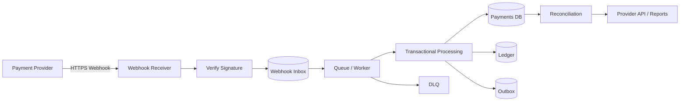
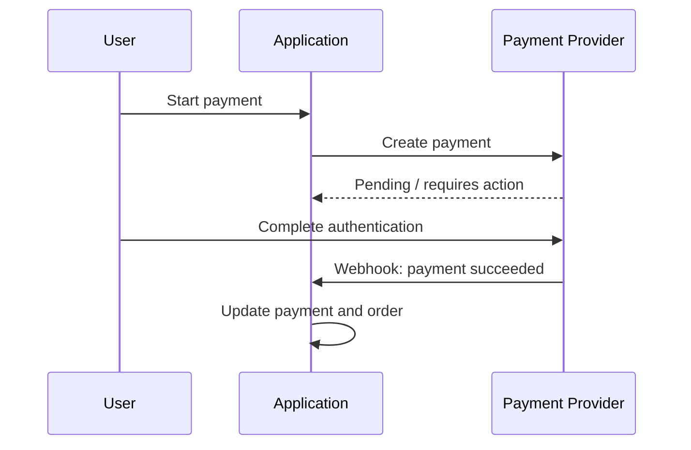
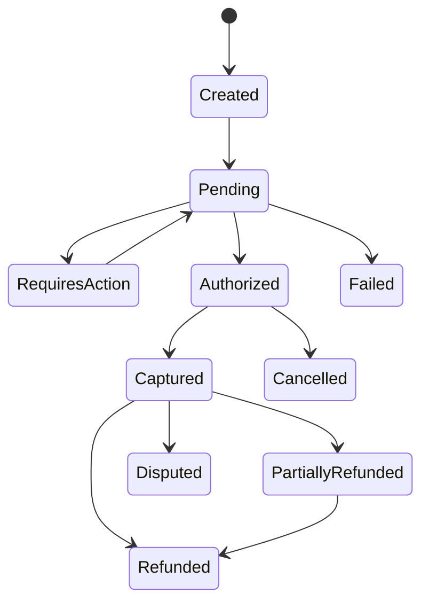
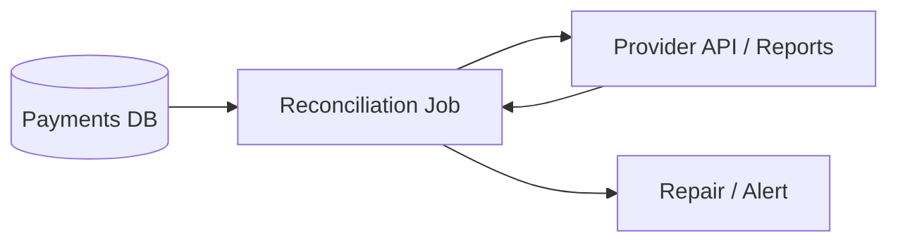

# Payment Webhooks and Reliable Delivery

> Payment webhooks are asynchronous server-to-server notifications from a payment provider. A reliable design assumes events can be duplicated, delayed, retried, or delivered out of order.

## In short

- Treat every webhook as an **untrusted, repeatable, asynchronous message**.
- The authenticated server-to-server webhook should drive the final payment state, not the browser redirect alone.
- Verify the provider signature using the **exact raw request body**.
- Persist the event to a durable inbox or queue **before returning `2xx`**.
- Use **event-level idempotency** and **business-level idempotency**.
- Never use "last webhook wins"; apply an explicit payment state machine.
- Retry temporary failures with backoff and jitter, then move repeated failures to a DLQ.
- Reconcile your database with the provider API or reports because webhook delivery is not the only safety net.



---

# 1. Why Payment Webhooks Matter

A payment request and the final payment result do not always happen at the same time.

The final outcome may depend on:

- 3-D Secure or bank authentication.
- Delayed capture.
- Asynchronous payment methods.
- Fraud checks.
- Refund processing.
- Disputes or chargebacks.
- Subscription renewals.
- Settlement or payout processing.

So the response from `POST /payments` may only mean:

```text
created
pending
requires_action
authorized
```

The final result may arrive later through a webhook such as:

```text
payment.succeeded
payment.failed
payment.captured
refund.succeeded
dispute.created
```

## Browser redirect vs webhook

A redirect is useful for the user experience, but it is not a reliable final source of truth.

The customer can close the browser, lose connectivity, or replay a client-side request.

A verified webhook is sent directly from the payment provider to your backend.



---

# 2. Correct Mental Model

A payment webhook is not a normal one-time API request.

Assume that an event can be:

- Delivered more than once.
- Delivered late.
- Delivered out of order.
- Retried after a timeout.
- Manually redelivered.
- Processed concurrently by multiple workers.
- Valid but already obsolete because a newer state exists.

The practical delivery model is usually:

> **At-least-once delivery with effectively-once business processing.**

## Delivery and processing are separate

There are two different facts:

1. **Delivery:** your endpoint received and durably accepted the event.
2. **Processing:** your application successfully applied the business change.

Returning `200` or `202` only confirms acceptance to the provider. It does not prove that order fulfilment, ledger posting, email delivery, or other business work has completed.

---

# 3. Recommended Production Flow

The safest common design is:

```text
Receive
  ↓
Verify signature
  ↓
Persist event
  ↓
Return 2xx
  ↓
Process asynchronously
  ↓
Apply idempotent business transaction
  ↓
Mark processed
```

## Webhook receiver

The HTTP endpoint should do only the work needed for secure and durable acceptance:

1. Read raw request bytes.
2. Verify the provider signature.
3. Parse the minimum event envelope.
4. Extract provider event ID and type.
5. Insert the event into a durable inbox or queue.
6. Return `200` or `202`.

Do not perform slow fulfilment, PDF generation, email sending, or multiple external API calls inside the webhook request.

## Worker

The worker should:

- Load the internal payment.
- Validate provider account, amount, currency, and tenant.
- Apply a legal state transition.
- Create idempotent financial/business actions.
- Write ledger entries if needed.
- Create an outbox event for downstream work.
- Mark the webhook processed in the same transaction.

---

# 4. Signature Verification and Security

A webhook URL is publicly reachable, so payload data must never be trusted by default.

## Verify the exact raw body

Most payment providers sign the original request body.

The safe order is:

```text
Raw bytes
  ↓
Signature verification
  ↓
JSON parsing
  ↓
Business processing
```

Do not parse and re-serialize JSON before signature verification because whitespace, key order, or encoding changes can invalidate the signature.

Prefer the provider's official SDK because signature formats can include timestamps, multiple signatures, certificates, or provider-specific rules.

## Secret handling

Webhook secrets should be:

- Stored in a secret manager.
- Different for test and production.
- Different per provider or endpoint where practical.
- Rotated safely.
- Never logged.

During rotation, allow an overlap period when the provider supports it because older webhook retries may still use the previous secret.

## Validate business ownership too

A valid signature proves that the request came from the provider. It does **not** mean every field should be blindly trusted for authorization.

Before changing business state, verify:

```text
provider_payment_id belongs to this merchant
order exists
amount matches
currency matches
tenant/account matches
payment belongs to the expected order
```

For ambiguous or high-value events, fetch the latest payment object from the provider API before final fulfilment.

---

# 5. Idempotency and Duplicate Handling

Payment webhooks need two levels of idempotency.

## 5.1 Event-level idempotency

The same provider event may be delivered repeatedly.

Use a unique database key such as:

```text
(provider, provider_account_id, provider_event_id)
```

Example:

```sql
CREATE UNIQUE INDEX uq_webhook_event
ON webhook_events (
    provider,
    provider_account_id,
    provider_event_id
);
```

Then insert with conflict handling:

```sql
INSERT INTO webhook_events (
    provider,
    provider_account_id,
    provider_event_id,
    event_type,
    payload
)
VALUES (...)
ON CONFLICT DO NOTHING;
```

If the row already exists, return success and do not process the same event again.

A separate `SELECT` followed by `INSERT` is not enough because concurrent requests can race.

## 5.2 Business-level idempotency

Different event IDs can describe the same business result.

For example, provider-specific integrations may emit multiple event types related to one successful payment.

Therefore also protect actions such as:

```text
payment:pay_789:mark_paid
payment:pay_789:ledger_capture
order:ord_123:fulfil
refund:ref_456:ledger_refund
```

Use a unique constraint around that business key.

This prevents duplicate:

- Order fulfilment.
- Wallet credit.
- Ledger postings.
- Commission postings.
- Inventory release.
- Downstream commands.

---

# 6. Fast Acknowledgement and Retries

## When to return `2xx`

Return success only after:

1. The signature is valid.
2. The event is durably stored or durably queued.

Typical responses:

| Situation | Response |
|---|---:|
| Valid and durably accepted | `200` / `202` |
| Known duplicate | `200` / `202` |
| Invalid signature | `400` or provider-recommended code |
| Malformed event | `400` |
| DB/queue unavailable before durable receipt | `500` / `503` |
| Worker fails after durable receipt | Keep HTTP success; retry internally |

## Retry only temporary failures

Retry examples:

```text
database timeout
network timeout
provider API 429
provider API 502/503/504
temporary queue failure
lock timeout
```

Do not retry forever for permanent problems such as:

```text
wrong tenant
unsupported currency
missing required mapping
permanent schema incompatibility
invalid business relationship
```

Use exponential backoff plus jitter.

```text
attempt 1 → ~5s
attempt 2 → ~15s
attempt 3 → ~1m
attempt 4 → ~5m
...
```

The exact schedule is system-specific.

## Dead-letter queue

After the configured attempt limit, move the event to a DLQ or permanent-failure state.

Preserve:

- Provider.
- Event ID.
- Event type.
- Original payload.
- Attempt count.
- First and last attempt time.
- Last error.
- Correlation/trace ID.

Replay must still go through the normal idempotency and validation rules.

---

# 7. Out-of-Order Events and State Machines

Do not implement:

```python
payment.status = event["status"]
```

This is unsafe.

Example:

```text
10:00:00 provider creates "processing"
10:00:02 provider creates "succeeded"

10:00:03 webhook "succeeded" arrives
10:00:05 old webhook "processing" arrives
```

If the last received event always wins, the payment moves backwards.

## Use legal state transitions



Example rules:

| Current state | Incoming event | Result |
|---|---|---|
| `pending` | success | `succeeded` |
| `pending` | failure | `failed` |
| `authorized` | capture | `captured` |
| `captured` | refund | `partially_refunded` / `refunded` |
| `succeeded` | old processing event | no change |
| `refunded` | duplicate success | no change |

Use this decision order:

1. Deduplicate provider event.
2. Validate legal state transition.
3. Use provider sequence/version when available.
4. Fetch authoritative provider state when ambiguous.
5. Use timestamps only as an additional signal.

---

# 8. Transaction and Concurrency Safety

Two duplicate events or two different event types can be processed at the same time.

## Use database constraints as the final guard

Protect unique values such as:

```text
provider event ID
provider payment ID
ledger external reference
refund reference
fulfilment action
commission posting
```

## Lock the payment during transition

```sql
SELECT *
FROM payments
WHERE id = :payment_id
FOR UPDATE;
```

Then perform the important work in one transaction:

```text
Validate transition
Create ledger transaction
Create debit/credit entries
Update payment
Record business action
Mark webhook processed
Insert outbox event
COMMIT
```

Never mark a webhook processed before the financial transaction commits.

## Transactional outbox

If processing must publish an internal event:

```text
payment DB update
+
ledger write
+
outbox row
+
webhook processed
```

should commit together.

A separate outbox publisher can later send:

```text
order.paid
payment.succeeded
refund.succeeded
```

to Kafka, SQS, RabbitMQ, SNS, or another service.

This avoids the database/message-broker dual-write problem.

---

# 9. Minimal FastAPI Example

This example focuses on the receiver layer.

In real integrations, replace the generic verification logic with the provider's official SDK when available.

```python
import hashlib
import hmac
import json
from uuid import uuid4

from fastapi import APIRouter, Header, HTTPException, Request, status
from sqlalchemy import text

router = APIRouter(prefix="/webhooks")


def verify_signature(raw_body: bytes, signature: str, secret: str) -> bool:
    expected = hmac.new(
        secret.encode(),
        raw_body,
        hashlib.sha256,
    ).hexdigest()

    return hmac.compare_digest(expected, signature)


@router.post("/provider-a", status_code=status.HTTP_202_ACCEPTED)
async def receive_webhook(
    request: Request,
    x_webhook_signature: str = Header(alias="X-Webhook-Signature"),
):
    db = request.state.db
    secret = request.app.state.provider_webhook_secret

    # 1. Read exact raw bytes.
    raw_body = await request.body()

    # 2. Verify before parsing.
    if not verify_signature(raw_body, x_webhook_signature, secret):
        raise HTTPException(status_code=400, detail="Invalid signature")

    try:
        payload = json.loads(raw_body)
        event_id = payload["id"]
        event_type = payload["type"]
    except (json.JSONDecodeError, KeyError):
        raise HTTPException(status_code=400, detail="Invalid event")

    # 3. Durable, idempotent inbox insert.
    result = await db.execute(
        text("""
            INSERT INTO webhook_events (
                id,
                provider,
                provider_event_id,
                event_type,
                payload,
                status
            )
            VALUES (
                :id,
                'provider-a',
                :event_id,
                :event_type,
                CAST(:payload AS JSONB),
                'received'
            )
            ON CONFLICT (provider, provider_event_id)
            DO NOTHING
            RETURNING id
        """),
        {
            "id": str(uuid4()),
            "event_id": event_id,
            "event_type": event_type,
            "payload": json.dumps(payload),
        },
    )

    inserted_id = result.scalar_one_or_none()
    await db.commit()

    if inserted_id is None:
        return {"status": "already_received"}

    # A durable worker/poller processes the inbox row asynchronously.
    return {"status": "accepted"}
```

## Important implementation detail

Do not depend only on in-memory background tasks:

```python
background_tasks.add_task(process_payment_event, payload)
return {"ok": True}
```

The application can restart after returning success but before the background task finishes.

For critical payment work, use a durable inbox, durable queue, or both.

---

# 10. Reconciliation

Webhooks are reliable notification mechanisms, but they are not a complete financial correctness strategy.

A reconciliation job should periodically compare:

```text
Your payment state
vs
Provider API / settlement reports
```

Typical mismatches:

```text
provider = succeeded, local = pending
provider = refunded, local refund missing
provider capture exists, ledger posting missing
provider dispute exists, local dispute missing
```

Reconciliation repairs failures that may remain after provider retries stop.



For payment systems, webhooks provide fast updates; reconciliation provides eventual financial correctness.

---

# 11. Observability and Testing

## Metrics worth monitoring

```text
webhook_requests_total
webhook_signature_failures_total
webhook_duplicates_total
webhook_ack_latency
webhook_processing_latency
webhook_processing_failures_total
webhook_retry_attempts_total
webhook_dlq_depth
webhook_oldest_pending_age
reconciliation_mismatches_total
```

Important alerts include:

- Signature failures suddenly increase.
- Inbox backlog keeps growing.
- Oldest unprocessed event exceeds a threshold.
- New DLQ events appear.
- Provider says payment succeeded but the order remains unpaid.
- Captured payment has no ledger posting.

## Failure scenarios to test

At minimum test:

1. Same event delivered repeatedly.
2. Same event delivered concurrently.
3. Database unavailable before inbox commit.
4. Response lost after inbox commit.
5. Worker crashes before transaction commit.
6. Worker crashes after commit but before queue acknowledgement.
7. Success arrives before an older pending event.
8. Provider API returns `429` during verification/fetch.
9. Old webhook secret is still used during retry after rotation.
10. Poison event reaches the DLQ.

Expected duplicate behavior:

```text
Webhook inbox rows          = 1
Payment success transition  = 1
Ledger capture              = 1
Order fulfilment            = 1
Duplicate HTTP deliveries   = accepted safely
```

---

# 12. Current Provider Behaviour to Remember

Provider details change, so always re-check official documentation during implementation.

| Provider | Important current behaviour |
|---|---|
| **Stripe** | Live-mode deliveries are automatically retried for up to **3 days** with exponential backoff. Event ordering is **not guaranteed**. Stripe requires the **raw request body** for signature verification and recommends duplicate-event handling plus asynchronous processing. |
| **Razorpay** | Uses **at-least-once** delivery. A request that does not successfully complete within about **5 seconds** can be redelivered. Failed webhooks are retried with exponential backoff for **24 hours**. `x-razorpay-event-id` can be used for duplicate detection, and signature verification uses the raw body. |
| **Adyen** | Requires successful acknowledgement such as `200`/`202` within **10 seconds**. Failed webhooks enter retry handling; Adyen documents automatic retry from its retry queue for up to **30 days**. |
| **PayPal** | Non-`2xx` delivery can be retried up to **25 times over 3 days**. Webhook authenticity should be verified using PayPal's supported verification mechanisms and webhook ID. |

---

# 13. Practical Example

Consider an order for **₹2,500**.

```text
Order              = ord_1001
Internal payment   = pay_2001
Provider payment   = psp_pay_9001
Expected amount    = 250000 paise
Currency           = INR
Initial state      = pending
```

The provider sends:

```json
{
  "id": "evt_7001",
  "type": "payment.succeeded",
  "data": {
    "payment": {
      "id": "psp_pay_9001",
      "amount_minor": 250000,
      "currency": "INR"
    }
  }
}
```

## Receiver

```text
1. Read raw body
2. Verify signature
3. Insert evt_7001 into webhook inbox
4. Commit
5. Return 202
```

## Worker

Inside one database transaction:

```text
1. Lock pay_2001
2. Validate provider payment ID
3. Validate 250000 INR
4. Confirm pending → succeeded is legal
5. Update payment
6. Create ledger posting
7. Record unique "order paid" business action
8. Insert order.paid into outbox
9. Mark evt_7001 processed
10. Commit
```

If `evt_7001` arrives again, the inbox unique constraint detects it and no business action repeats.

If another event with a different event ID describes the same payment success, business-level idempotency still prevents duplicate ledger posting or fulfilment.

That is the key design principle:

> **Duplicate delivery is acceptable; duplicate financial effect is not.**

---

# 14. Production Checklist

## Endpoint

- [ ] HTTPS endpoint is publicly reachable.
- [ ] Raw request body is preserved.
- [ ] Official signature verification is used where available.
- [ ] Test and production secrets are separate.
- [ ] Secret rotation is supported.

## Durable receipt

- [ ] Event is durably stored before returning success.
- [ ] Provider event ID has a database unique constraint.
- [ ] Duplicate receipt returns success.
- [ ] Original payload is retained securely.

## Processing

- [ ] Business logic runs asynchronously.
- [ ] Payment state transitions are explicit.
- [ ] Amount, currency, account, and tenant are validated.
- [ ] Business actions use idempotency keys.
- [ ] Ledger writes are transactionally consistent.
- [ ] Outbox is used for downstream events where needed.

## Failure handling

- [ ] Temporary and permanent failures are separated.
- [ ] Retry uses backoff and jitter.
- [ ] Maximum attempts are configured.
- [ ] DLQ or permanent-failure storage exists.
- [ ] Replay remains idempotent.

## Operations

- [ ] Acknowledgement latency is monitored separately from processing latency.
- [ ] Pending-event age and backlog are monitored.
- [ ] DLQ additions generate alerts.
- [ ] Reconciliation runs independently of webhook processing.
- [ ] Provider event, payment, order, and ledger transaction can be traced together.

---

# References

Provider-specific details verified against official documentation in August 2026:

- Stripe Webhooks: https://docs.stripe.com/webhooks
- Stripe Signature Verification: https://docs.stripe.com/webhooks/signature
- Razorpay Webhook Best Practices: https://razorpay.com/docs/webhooks/best-practices/
- Razorpay Validate and Test Webhooks: https://razorpay.com/docs/webhooks/validate-test/
- Adyen Configure and Manage Webhooks: https://docs.adyen.com/development-resources/webhooks/configure-and-manage
- Adyen Troubleshoot Webhooks: https://docs.adyen.com/development-resources/webhooks/troubleshoot/
- PayPal Webhooks Overview: https://developer.paypal.com/api/rest/webhooks
- PayPal Integrate Webhooks: https://developer.paypal.com/api/rest/webhooks/rest/
