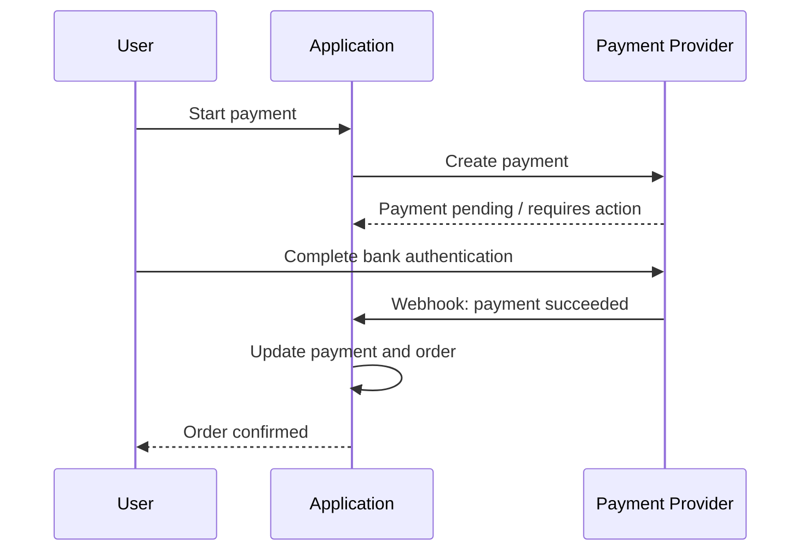
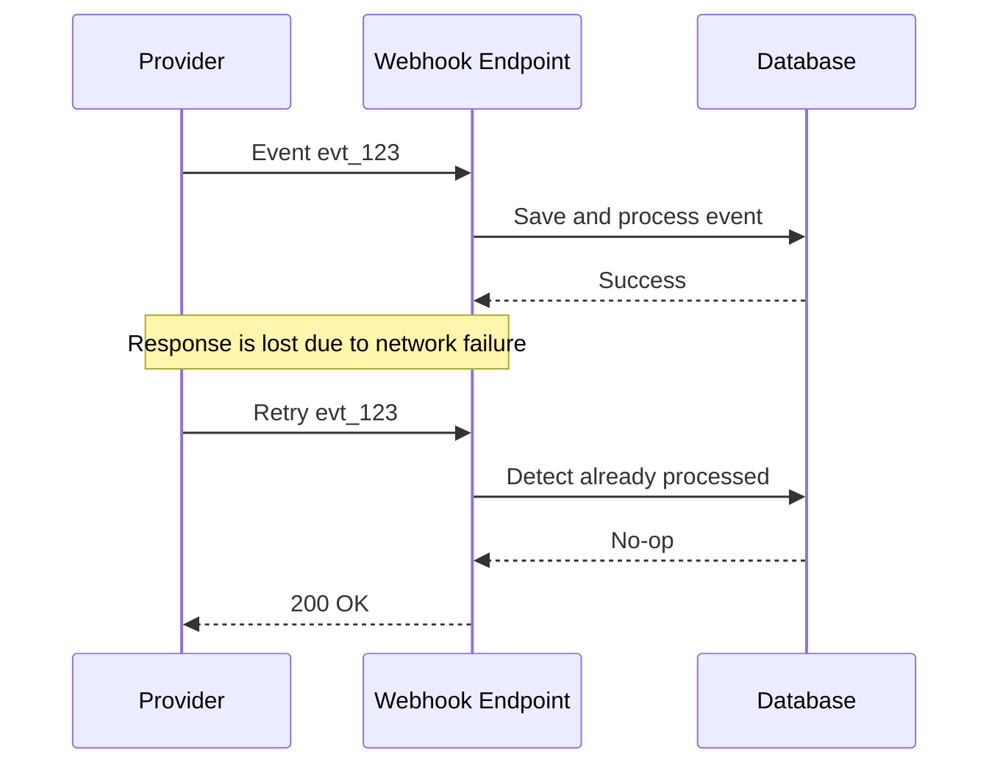
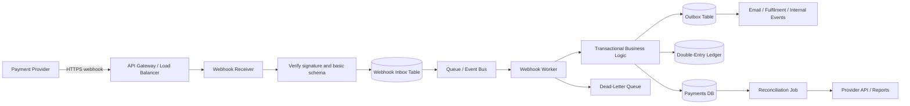
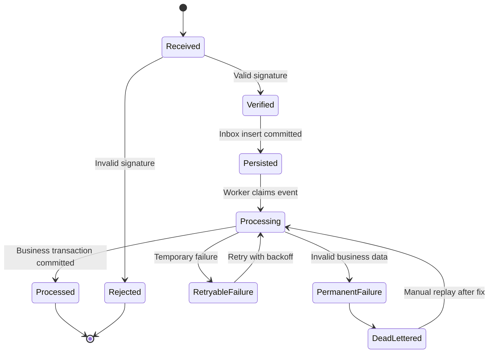
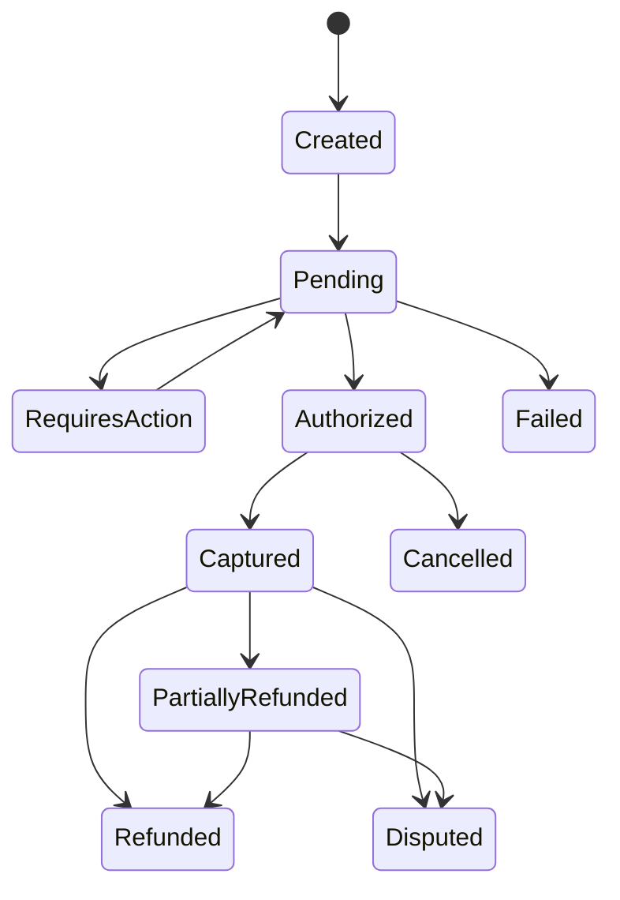

# Payment Webhooks and Reliable Delivery

> **Category:** Payments & Fintech  
> **Level:** Intermediate developer (3+ years)  
> **Last reviewed:** August 2026  
> **Goal:** Understand how to receive, verify, process, retry, and reconcile payment webhooks without creating duplicate charges, duplicate fulfilment, or incorrect payment states.

---

## Table of Contents

1. [Why Payment Webhooks Matter](#1-why-payment-webhooks-matter)
2. [The Correct Mental Model](#2-the-correct-mental-model)
3. [Delivery Guarantees and Failure Modes](#3-delivery-guarantees-and-failure-modes)
4. [Recommended Production Architecture](#4-recommended-production-architecture)
5. [Webhook Processing Lifecycle](#5-webhook-processing-lifecycle)
6. [Authenticity and Security](#6-authenticity-and-security)
7. [Idempotency and Duplicate Handling](#7-idempotency-and-duplicate-handling)
8. [Fast Acknowledgement and HTTP Responses](#8-fast-acknowledgement-and-http-responses)
9. [Retries, Backoff, and Dead-Letter Queues](#9-retries-backoff-and-dead-letter-queues)
10. [Out-of-Order Events and Payment State Machines](#10-out-of-order-events-and-payment-state-machines)
11. [Database Design](#11-database-design)
12. [FastAPI Implementation Example](#12-fastapi-implementation-example)
13. [Worker Processing Example](#13-worker-processing-example)
14. [Concurrency and Transaction Safety](#14-concurrency-and-transaction-safety)
15. [Observability and Operations](#15-observability-and-operations)
16. [Testing Strategy](#16-testing-strategy)
17. [Provider Behaviour Comparison](#17-provider-behaviour-comparison)
18. [Practical Payment Flow](#18-practical-payment-flow)
19. [Design Checklist](#19-design-checklist)
20. [Key Takeaways](#20-key-takeaways)
21. [References](#21-references)

---

# 1. Why Payment Webhooks Matter

A payment API request and a payment result do not always happen at the same time.

A user may submit a payment, but the final result can depend on:

- Bank authentication or 3-D Secure.
- An asynchronous payment method.
- Fraud or risk checks.
- Delayed capture.
- Settlement processing.
- Refund processing.
- Chargebacks or disputes raised days later.
- Subscription renewals performed by the payment provider.

Because of this, the response returned by `POST /payments` is not always the final source of truth.

A **webhook** is an HTTPS request sent by a payment provider to your backend when a payment-related event occurs.

Common examples include:

```text
payment.authorized
payment.succeeded
payment.failed
payment.captured
refund.created
refund.succeeded
dispute.created
subscription.renewed
payout.paid
```

## Simple flow



The important point is:

> The browser redirect is mainly a user-experience mechanism. The authenticated server-to-server webhook should normally drive the final payment state.

A customer may close the browser before returning to your success page. A redirect can also be forged or replayed. The webhook is delivered directly to your backend and can be cryptographically verified.

---

# 2. The Correct Mental Model

Treat every webhook as an **untrusted, repeatable, asynchronous message**.

A production webhook handler must assume that an event can be:

- Delivered more than once.
- Delivered late.
- Delivered out of order.
- Delivered while your service is temporarily unavailable.
- Delivered while another worker is processing the same payment.
- Replayed intentionally by an attacker.
- Redelivered manually from the provider dashboard.
- Valid but no longer relevant because your system already has a newer state.

Therefore, a reliable webhook consumer should provide:

```text
Authentication
    + Durable receipt
    + Idempotent processing
    + Transaction safety
    + Retry handling
    + Ordering protection
    + Monitoring
    + Reconciliation
```

## Delivery is not processing

These are two different facts:

1. **Delivery fact:** Your endpoint received an event.
2. **Business fact:** Your application successfully applied the event.

Returning HTTP `200` only tells the provider that delivery was accepted. It does not automatically prove that your order, ledger, notification, or fulfilment logic completed correctly.

That is why reliable systems persist or enqueue the event before acknowledging it.

---

# 3. Delivery Guarantees and Failure Modes

## 3.1 Most payment webhooks use at-least-once delivery

With **at-least-once delivery**, the provider keeps retrying until it receives a successful response or reaches its retry limit.

This improves delivery reliability but means duplicate delivery is expected.



The first attempt may have completed successfully even though the provider did not receive your response. The provider correctly retries because it cannot distinguish between:

- “The server never processed the request.”
- “The server processed the request, but the response was lost.”

This is why **exactly-once network delivery is not a realistic assumption**.

The practical goal is:

> At-least-once delivery with effectively-once business processing.

## 3.2 Common failure scenarios

### Network timeout

Your service processes the event but takes longer than the provider timeout. The provider retries, producing a duplicate.

### Application crash

The process crashes after updating one table but before completing all side effects.

### Database outage

The endpoint receives the webhook but cannot store it.

### Queue outage

The endpoint verifies the event but cannot enqueue it for asynchronous processing.

### Invalid signature

The body was changed by middleware, the wrong secret was used, or the request is not from the provider.

### Out-of-order delivery

A `payment.failed` event arrives after `payment.succeeded`, even though the success event represents the newer authoritative state.

### Poison event

A valid event repeatedly fails because of malformed internal data, unsupported schema, or a permanent business-rule problem.

### Duplicate business action

The same event causes fulfilment, wallet credit, commission posting, or email delivery twice.

---

# 4. Recommended Production Architecture

A strong default architecture is:



## Responsibilities of each component

### Webhook receiver

- Read the **raw request body**.
- Verify provider signature.
- Validate only the minimum required envelope fields.
- Persist the event or place it in a durable queue.
- Return a successful response quickly.

### Webhook inbox

- Records every accepted provider event.
- Enforces uniqueness using provider and event ID.
- Tracks processing status and attempts.
- Preserves the original payload for replay and investigation.

### Queue

- Decouples HTTP reception from business processing.
- Absorbs traffic spikes.
- Supports retries and dead-letter handling.
- Allows independent worker scaling.

### Worker

- Loads the payment or provider object.
- Applies state-transition rules.
- Updates payment, order, ledger, and audit records transactionally.
- Emits internal events using an outbox when needed.

### Reconciliation job

- Finds payments where your state differs from provider records.
- Repairs events that were never received or permanently failed.
- Provides a safety net beyond webhook delivery.

---

# 5. Webhook Processing Lifecycle

A reliable event should move through explicit stages.



## Recommended steps

1. Receive the HTTPS request.
2. Read the raw bytes before JSON middleware changes them.
3. Select the correct webhook secret for the endpoint and environment.
4. Verify the signature and timestamp where supported.
5. Parse the event envelope.
6. Extract the provider event ID and event type.
7. Insert the event into a durable inbox table using a unique constraint.
8. Enqueue or signal the worker.
9. Return `200` or `202` after durable acceptance.
10. Process the event asynchronously.
11. Update business state in a database transaction.
12. Mark the inbox event as processed.
13. Retry temporary failures.
14. Move repeated permanent failures to a DLQ or failure state.
15. Alert operations when backlog, failure rate, or event age crosses a threshold.

---

# 6. Authenticity and Security

A public webhook URL can receive requests from anyone. Never trust an event only because it contains a familiar JSON structure.

## 6.1 Verify the provider signature

Most payment providers sign the request using one of these approaches:

- HMAC with a shared webhook secret.
- Asymmetric signature with a public certificate or key.
- A provider API endpoint that verifies the received signature.

A generic HMAC pattern looks like this:

```python
import hashlib
import hmac


def verify_hmac_sha256(raw_body: bytes, received_signature: str, secret: str) -> bool:
    expected = hmac.new(
        key=secret.encode("utf-8"),
        msg=raw_body,
        digestmod=hashlib.sha256,
    ).hexdigest()

    return hmac.compare_digest(expected, received_signature)
```

Always prefer the official provider SDK when it offers signature verification. Providers may include timestamps, versioned signatures, special encodings, or certificate validation rules that a basic helper does not cover.

## 6.2 Use the raw request body

Signature verification usually applies to the exact bytes sent by the provider.

This can fail if middleware:

- Parses JSON and serializes it again.
- Changes whitespace.
- Reorders fields.
- Changes character encoding.
- Converts numeric values.

Correct sequence:

```text
Read raw bytes
    → Verify signature
        → Parse JSON
```

Incorrect sequence:

```text
Parse JSON
    → Re-serialize body
        → Verify signature
```

Stripe explicitly requires the unmodified raw request body for signature verification.[^stripe-signature]

## 6.3 Protect against replay attacks

Where the provider includes a signed timestamp:

- Verify that the timestamp is inside an acceptable tolerance.
- Deduplicate using the event ID.
- Store when the event was first received.
- Reject signatures outside the allowed window unless performing a controlled replay.

Do not rely only on timestamp checking. A valid duplicate can still be redelivered within the allowed window, so event-ID deduplication remains necessary.

## 6.4 Secret management

Webhook secrets should be:

- Stored in a secret manager, not source code.
- Different between test and production.
- Different per provider and preferably per endpoint.
- Rotated using an overlap period.
- Restricted to the webhook service.
- Never written to logs.

During rotation, keep both the old and new secret available temporarily because providers may retry an older event that was originally signed with the old secret. Razorpay specifically notes that retries of older requests may require the previous secret.[^razorpay-validation]

## 6.5 Additional security controls

Use these as defence in depth:

- HTTPS only.
- Current TLS configuration.
- Request-size limits.
- Rate limiting that allows provider retry bursts.
- Web application firewall rules.
- IP allowlisting only when the provider publishes stable ranges.
- Separate webhook path per provider or account.
- Minimal endpoint permissions.
- Encrypted payload storage.
- Redaction of cardholder and personal data in logs.

IP allowlisting should not replace signature verification. Provider infrastructure can change, proxies can complicate source addresses, and trusted networks do not prove message integrity.

## 6.6 Never trust payload fields for authorization

A webhook saying `payment.succeeded` should not be allowed to update any arbitrary order ID supplied in metadata.

Before applying the event, confirm that:

- The provider payment belongs to your merchant account.
- The internal order exists.
- Currency and amount match expectations.
- The provider customer or merchant reference matches your records.
- The event object is associated with the expected tenant.

For high-value operations, fetch the latest payment object from the provider API before final fulfilment. This is especially useful when events are thin, incomplete, suspicious, or out of order.

---

# 7. Idempotency and Duplicate Handling

Idempotency means that processing the same logical operation multiple times produces the same final result as processing it once.

Payment webhook handling requires **two levels of idempotency**.

## 7.1 Event-level deduplication

Prevent the same provider event from being processed twice.

A typical key is:

```text
(provider, merchant_account, event_id)
```

Example:

```text
("stripe", "acct_live_001", "evt_123")
```

The database must enforce uniqueness. A prior `SELECT` followed by an `INSERT` is not enough because two concurrent requests can both pass the `SELECT`.

Use:

```sql
UNIQUE (provider, provider_account_id, provider_event_id)
```

Then insert with conflict handling.

## 7.2 Business-level idempotency

Different webhook events can represent the same business outcome.

For example:

```text
payment_intent.succeeded
charge.succeeded
checkout_session.completed
```

Depending on the provider integration, multiple event types may refer to the same successful payment.

Even if all event IDs are unique, your system must not:

- Mark the order paid multiple times.
- Credit a wallet multiple times.
- Create duplicate ledger postings.
- Release inventory multiple times.
- Send the same fulfilment command multiple times.

A business-level key might be:

```text
payment_id + action
```

Examples:

```text
pay_789:mark_paid
pay_789:ledger_capture
pay_789:fulfil_order
refund_456:ledger_refund
```

## 7.3 Inbox pattern

The inbox pattern stores incoming messages before applying them.

```sql
INSERT INTO webhook_events (
    provider,
    provider_account_id,
    provider_event_id,
    event_type,
    payload,
    status
)
VALUES (...)
ON CONFLICT (provider, provider_account_id, provider_event_id)
DO NOTHING;
```

If no row is inserted, the event is already known. Return success and do not repeat the business action.

## 7.4 Idempotent business update

Instead of blindly performing an action, use guarded updates.

```sql
UPDATE payments
SET status = 'succeeded',
    succeeded_at = COALESCE(succeeded_at, NOW()),
    updated_at = NOW()
WHERE id = :payment_id
  AND status IN ('created', 'pending', 'authorized');
```

The number of affected rows tells you whether a transition occurred.

For financial postings, use a unique business reference:

```sql
UNIQUE (ledger_transaction_type, external_reference)
```

Example:

```text
ledger_transaction_type = "payment_capture"
external_reference       = "provider_payment:pay_789"
```

## 7.5 Idempotency does not mean “ignore every repeated notification”

A duplicate delivery of the same event can be ignored after successful processing.

However, a new event for the same payment may contain a valid state change. For example:

```text
payment.succeeded
refund.succeeded
dispute.created
```

Deduplicate by event ID, but evaluate every distinct event according to its business meaning.

---

# 8. Fast Acknowledgement and HTTP Responses

Webhook endpoints should perform only the work required for secure, durable acceptance.

## 8.1 Recommended acknowledgement rule

Return `2xx` only after:

1. Signature verification succeeds.
2. The event is durably written to an inbox or queue.

Do not wait for:

- Email delivery.
- PDF generation.
- Inventory fulfilment.
- Third-party API calls.
- Complex reporting.
- Long database workflows.

## 8.2 Why fast acknowledgement matters

Providers impose response deadlines. If your handler is slow, the provider may assume delivery failed and retry, even if your application later finishes processing.

Adyen advises acknowledging with a successful response within 10 seconds and recommends processing after acceptance.[^adyen-handle] Razorpay documents a 5-second timeout scenario that can cause redelivery.[^razorpay-best-practices]

A sensible internal target is much lower than the provider limit, for example:

```text
P95 acknowledgement latency < 500 ms
P99 acknowledgement latency < 1 second
```

These are engineering targets, not universal provider requirements.

## 8.3 Response-code guidance

| Situation | Typical response | Reason |
|---|---:|---|
| Signature valid and event durably accepted | `200` or `202` | Stop provider retry |
| Known duplicate already stored | `200` or `202` | Duplicate is safely handled |
| Invalid signature | `400` or provider-recommended code | Do not accept unauthenticated data |
| Malformed request envelope | `400` | Permanent request problem |
| Temporary database or queue failure before durable acceptance | `500` or `503` | Ask provider to retry |
| Unsupported event type but safely stored/ignored | `200` or `202` | Retrying will not add value |
| Internal worker failure after durable acceptance | Keep HTTP success; retry internally | Provider delivery already succeeded |

Provider-specific documentation takes precedence because some providers interpret status codes differently.

## 8.4 Acknowledge unknown event types safely

Providers add new event types and fields over time.

Your handler should generally:

- Accept unknown JSON fields.
- Persist the original payload.
- Log unknown event types at a controlled level.
- Return success if the event is authentic and safely stored.
- Avoid failing the entire endpoint because a new optional field appeared.

Adyen explicitly recommends allowing event types and values beyond the currently documented list.[^adyen-types]

---

# 9. Retries, Backoff, and Dead-Letter Queues

Retries are required for temporary failures, but uncontrolled retries can overload an already failing service.

## 9.1 Retry only transient failures

Retry examples:

- Database connection timeout.
- Temporary provider API failure.
- Queue throttling.
- Network error.
- Lock timeout.
- Dependency returning `429`, `502`, `503`, or `504`.

Do not automatically retry forever for:

- Invalid internal mapping.
- Missing mandatory merchant configuration.
- Unsupported currency caused by configuration.
- Permanent schema incompatibility.
- A payment belonging to the wrong tenant.

These require investigation or correction.

## 9.2 Exponential backoff with jitter

A common delay formula is:

```text
base_delay × 2^attempt + random_jitter
```

Example schedule:

```text
Attempt 1: 5 seconds
Attempt 2: 15 seconds
Attempt 3: 45 seconds
Attempt 4: 2 minutes
Attempt 5: 5 minutes
Attempt 6: 15 minutes
Attempt 7: 1 hour
```

Jitter prevents many failed events from retrying at exactly the same moment.

```python
import random


def retry_delay(attempt: int, base: float = 2.0, cap: float = 3600.0) -> float:
    exponential = min(cap, base * (2 ** attempt))
    return random.uniform(0, exponential)
```

## 9.3 Dead-letter queue

After a configured number of failures, move the event to a DLQ or mark it permanently failed.

The DLQ should preserve:

- Provider.
- Provider account.
- Event ID.
- Event type.
- Original payload.
- First received time.
- Last attempted time.
- Attempt count.
- Last error class and message.
- Correlation IDs.
- Worker version.

A DLQ is not a trash bin. It needs:

- Alerts.
- An investigation view.
- A replay command.
- Access control.
- Audit history.
- Retention policy.

AWS EventBridge and SQS both support dead-letter patterns for events that exhaust retry handling.[^aws-dlq]

## 9.4 Controlled replay

A replay mechanism should:

1. Load the original immutable event.
2. Re-run the latest compatible processor.
3. Preserve idempotency checks.
4. Record who or what initiated the replay.
5. Increment replay count.
6. Avoid bypassing signature history or tenant checks.

Replaying should be safe because business operations are idempotent.

---

# 10. Out-of-Order Events and Payment State Machines

Providers do not always guarantee event order. Stripe explicitly states that event ordering is not guaranteed.[^stripe-webhooks]

A later-delivered event is not necessarily a newer event.

## 10.1 Avoid simple “last webhook wins” logic

This is unsafe:

```python
payment.status = event["status"]
```

Suppose events are generated in this order:

```text
10:00:00 payment.processing
10:00:02 payment.succeeded
```

But delivered in this order:

```text
10:00:03 payment.succeeded
10:00:05 payment.processing
```

Blindly applying the second delivery would incorrectly move a successful payment back to processing.

## 10.2 Use an explicit state machine



Not every provider uses the same states, but your internal model should define legal transitions.

Example transition table:

| Current state | Incoming outcome | Allowed result |
|---|---|---|
| `pending` | success | `succeeded` |
| `pending` | failure | `failed` |
| `authorized` | capture | `captured` |
| `captured` | refund | `partially_refunded` or `refunded` |
| `succeeded` | old processing event | no change |
| `refunded` | duplicate success event | no change; investigate only if inconsistent |

## 10.3 Use provider timestamps carefully

An event may contain:

- Event creation time.
- Resource update time.
- Payment completion time.
- Provider processing time.

These values can be useful but should not be treated as perfectly synchronized clocks across systems.

Prefer this decision order:

1. Event-level deduplication.
2. Legal internal state transitions.
3. Provider resource version or sequence number, when available.
4. Authoritative provider API fetch for ambiguous cases.
5. Event timestamp as an additional signal.

## 10.4 Fetch the authoritative object

For thin events or ordering-sensitive updates:

```text
Webhook says payment changed
    → Verify and persist event
        → Worker fetches payment from provider API
            → Apply current provider state idempotently
```

This reduces dependence on event order, but introduces API rate limits and temporary network failures. Use it selectively or cache the result within the event-processing transaction boundary.

## 10.5 Model related concepts separately

Do not overload one status column to represent everything.

A payment can have separate dimensions:

```text
authorization_status
capture_status
refund_status
dispute_status
settlement_status
payout_status
```

For example, a payment can be:

```text
capture_status    = captured
refund_status     = partially_refunded
dispute_status    = open
settlement_status = settled
```

A single value such as `payment.status = disputed` may hide important financial facts.

---

# 11. Database Design

## 11.1 Webhook inbox table

```sql
CREATE TABLE webhook_events (
    id UUID PRIMARY KEY,
    provider VARCHAR(40) NOT NULL,
    provider_account_id VARCHAR(120) NOT NULL,
    provider_event_id VARCHAR(255) NOT NULL,
    event_type VARCHAR(160) NOT NULL,
    provider_created_at TIMESTAMPTZ,
    received_at TIMESTAMPTZ NOT NULL DEFAULT NOW(),
    signature_verified BOOLEAN NOT NULL DEFAULT FALSE,
    payload JSONB NOT NULL,
    headers JSONB,
    status VARCHAR(30) NOT NULL DEFAULT 'received',
    attempt_count INTEGER NOT NULL DEFAULT 0,
    next_attempt_at TIMESTAMPTZ,
    processing_started_at TIMESTAMPTZ,
    processed_at TIMESTAMPTZ,
    last_error_code VARCHAR(120),
    last_error_message TEXT,
    locked_by VARCHAR(120),
    created_at TIMESTAMPTZ NOT NULL DEFAULT NOW(),
    updated_at TIMESTAMPTZ NOT NULL DEFAULT NOW(),

    CONSTRAINT uq_webhook_provider_event
        UNIQUE (provider, provider_account_id, provider_event_id)
);

CREATE INDEX idx_webhook_events_pending
ON webhook_events (status, next_attempt_at, received_at);

CREATE INDEX idx_webhook_events_payment_lookup
ON webhook_events (provider, event_type, received_at DESC);
```

## 11.2 Payment table fields

```sql
CREATE TABLE payments (
    id UUID PRIMARY KEY,
    order_id UUID NOT NULL,
    provider VARCHAR(40) NOT NULL,
    provider_account_id VARCHAR(120) NOT NULL,
    provider_payment_id VARCHAR(255) NOT NULL,
    status VARCHAR(40) NOT NULL,
    amount_minor BIGINT NOT NULL,
    currency CHAR(3) NOT NULL,
    authorized_amount_minor BIGINT NOT NULL DEFAULT 0,
    captured_amount_minor BIGINT NOT NULL DEFAULT 0,
    refunded_amount_minor BIGINT NOT NULL DEFAULT 0,
    provider_version VARCHAR(120),
    provider_updated_at TIMESTAMPTZ,
    succeeded_at TIMESTAMPTZ,
    failed_at TIMESTAMPTZ,
    created_at TIMESTAMPTZ NOT NULL DEFAULT NOW(),
    updated_at TIMESTAMPTZ NOT NULL DEFAULT NOW(),

    CONSTRAINT uq_provider_payment
        UNIQUE (provider, provider_account_id, provider_payment_id)
);
```

Use integer minor units rather than floating-point amounts.

Examples:

```text
₹499.00  → 49900 paise
$19.95   → 1995 cents
```

Be aware that not every currency uses two decimal places. Use currency metadata instead of hard-coding `× 100` globally.

## 11.3 Business action table

```sql
CREATE TABLE processed_business_actions (
    id UUID PRIMARY KEY,
    action_type VARCHAR(80) NOT NULL,
    idempotency_key VARCHAR(255) NOT NULL,
    webhook_event_id UUID REFERENCES webhook_events(id),
    result_reference VARCHAR(255),
    created_at TIMESTAMPTZ NOT NULL DEFAULT NOW(),

    CONSTRAINT uq_business_action
        UNIQUE (action_type, idempotency_key)
);
```

Examples:

```text
action_type     = order_fulfilment
idempotency_key = order:ord_123:paid

action_type     = ledger_capture
idempotency_key = payment:pay_789:capture:10000:INR
```

## 11.4 Outbox table

Use the transactional outbox pattern when processing a webhook must publish an internal event.

```sql
CREATE TABLE outbox_events (
    id UUID PRIMARY KEY,
    aggregate_type VARCHAR(80) NOT NULL,
    aggregate_id UUID NOT NULL,
    event_type VARCHAR(160) NOT NULL,
    payload JSONB NOT NULL,
    created_at TIMESTAMPTZ NOT NULL DEFAULT NOW(),
    published_at TIMESTAMPTZ,
    publish_attempts INTEGER NOT NULL DEFAULT 0
);
```

Inside one database transaction:

```text
Update payment
Create ledger transaction
Mark webhook processed
Insert order.paid into outbox
COMMIT
```

A separate publisher sends the outbox event to Kafka, SQS, RabbitMQ, SNS, or another service.

This avoids the dual-write problem:

```text
Database commit succeeds
Message publish fails
```

---

# 12. FastAPI Implementation Example

The following example demonstrates the receiver layer. Provider SDK verification should replace the generic HMAC logic where available.

```python
from __future__ import annotations

import hashlib
import hmac
import json
from dataclasses import dataclass
from datetime import UTC, datetime
from typing import Any
from uuid import uuid4

from fastapi import APIRouter, Header, HTTPException, Request, Response, status
from sqlalchemy import text
from sqlalchemy.exc import IntegrityError
from sqlalchemy.ext.asyncio import AsyncSession

router = APIRouter(prefix="/webhooks", tags=["webhooks"])


@dataclass(frozen=True)
class WebhookEnvelope:
    event_id: str
    event_type: str
    created_at: datetime | None
    payload: dict[str, Any]


def verify_signature(raw_body: bytes, signature: str, secret: str) -> bool:
    expected = hmac.new(
        secret.encode("utf-8"),
        raw_body,
        hashlib.sha256,
    ).hexdigest()
    return hmac.compare_digest(expected, signature)


def parse_envelope(payload: dict[str, Any]) -> WebhookEnvelope:
    event_id = payload.get("id")
    event_type = payload.get("type")

    if not isinstance(event_id, str) or not event_id:
        raise ValueError("Missing event id")

    if not isinstance(event_type, str) or not event_type:
        raise ValueError("Missing event type")

    created_at: datetime | None = None
    raw_created_at = payload.get("created_at")
    if isinstance(raw_created_at, str):
        created_at = datetime.fromisoformat(raw_created_at.replace("Z", "+00:00"))

    return WebhookEnvelope(
        event_id=event_id,
        event_type=event_type,
        created_at=created_at,
        payload=payload,
    )


@router.post("/provider-a", status_code=status.HTTP_202_ACCEPTED)
async def receive_provider_a_webhook(
    request: Request,
    response: Response,
    x_webhook_signature: str = Header(alias="X-Webhook-Signature"),
) -> dict[str, str]:
    # Obtain these dependencies through FastAPI dependency injection in a real app.
    db: AsyncSession = request.state.db
    webhook_secret: str = request.app.state.provider_a_webhook_secret
    provider_account_id = "merchant_live_001"

    # Important: read raw bytes before normal JSON parsing changes the body.
    raw_body = await request.body()

    if not verify_signature(raw_body, x_webhook_signature, webhook_secret):
        raise HTTPException(
            status_code=status.HTTP_400_BAD_REQUEST,
            detail="Invalid webhook signature",
        )

    try:
        payload = json.loads(raw_body)
        envelope = parse_envelope(payload)
    except (json.JSONDecodeError, ValueError) as exc:
        raise HTTPException(
            status_code=status.HTTP_400_BAD_REQUEST,
            detail=str(exc),
        ) from exc

    query = text("""
        INSERT INTO webhook_events (
            id,
            provider,
            provider_account_id,
            provider_event_id,
            event_type,
            provider_created_at,
            signature_verified,
            payload,
            headers,
            status
        )
        VALUES (
            :id,
            :provider,
            :provider_account_id,
            :provider_event_id,
            :event_type,
            :provider_created_at,
            TRUE,
            CAST(:payload AS JSONB),
            CAST(:headers AS JSONB),
            'received'
        )
        ON CONFLICT (
            provider,
            provider_account_id,
            provider_event_id
        ) DO NOTHING
        RETURNING id
    """)

    try:
        result = await db.execute(
            query,
            {
                "id": str(uuid4()),
                "provider": "provider_a",
                "provider_account_id": provider_account_id,
                "provider_event_id": envelope.event_id,
                "event_type": envelope.event_type,
                "provider_created_at": envelope.created_at,
                "payload": json.dumps(envelope.payload),
                "headers": json.dumps(dict(request.headers)),
            },
        )
        inserted_id = result.scalar_one_or_none()
        await db.commit()
    except Exception:
        await db.rollback()
        # No durable acceptance occurred, so returning 503 permits provider retry.
        raise HTTPException(
            status_code=status.HTTP_503_SERVICE_UNAVAILABLE,
            detail="Webhook storage temporarily unavailable",
        )

    if inserted_id is None:
        # Known duplicate. Return success so the provider stops retrying.
        response.status_code = status.HTTP_200_OK
        return {"status": "already_received"}

    # A polling worker can discover the committed inbox row.
    # Alternatively, publish a lightweight wake-up signal after commit.
    return {"status": "accepted"}
```

## Important implementation notes

### Do not use in-memory background tasks as the only durability mechanism

This is not enough for critical payment processing:

```python
background_tasks.add_task(process_payment_event, payload)
return {"ok": True}
```

The API process can restart after returning success but before the task finishes. Use a durable database inbox or queue.

### Commit before acknowledgement

Do not return success before the inbox transaction commits.

### Queue publication can create another dual-write problem

This sequence is unsafe:

```text
Insert inbox row
Publish queue message
Commit database
```

The queue message may be processed before the database commit.

This sequence is also incomplete:

```text
Commit inbox row
Publish queue message
```

The process may crash between commit and publish.

Reliable options include:

- Polling committed inbox rows.
- Transactional outbox or change-data capture.
- A queue that is itself the durable source of receipt.
- Provider event destination directly connected to managed event infrastructure, where supported.

---

# 13. Worker Processing Example

The worker claims events and performs business updates transactionally.

```python
from __future__ import annotations

from datetime import UTC, datetime, timedelta
from typing import Any

from sqlalchemy import text
from sqlalchemy.ext.asyncio import AsyncSession


RETRYABLE_EXCEPTIONS = (
    TimeoutError,
    ConnectionError,
)


async def claim_next_event(db: AsyncSession, worker_id: str) -> dict[str, Any] | None:
    result = await db.execute(
        text("""
            WITH candidate AS (
                SELECT id
                FROM webhook_events
                WHERE status IN ('received', 'retryable_failure')
                  AND (next_attempt_at IS NULL OR next_attempt_at <= NOW())
                ORDER BY received_at
                FOR UPDATE SKIP LOCKED
                LIMIT 1
            )
            UPDATE webhook_events AS w
            SET status = 'processing',
                processing_started_at = NOW(),
                locked_by = :worker_id,
                attempt_count = attempt_count + 1,
                updated_at = NOW()
            FROM candidate
            WHERE w.id = candidate.id
            RETURNING w.*
        """),
        {"worker_id": worker_id},
    )
    row = result.mappings().one_or_none()
    await db.commit()
    return dict(row) if row else None


async def process_event(db: AsyncSession, event: dict[str, Any]) -> None:
    event_type = event["event_type"]
    payload = event["payload"]

    try:
        async with db.begin():
            if event_type == "payment.succeeded":
                await apply_payment_succeeded(db, event, payload)
            elif event_type == "payment.failed":
                await apply_payment_failed(db, event, payload)
            elif event_type == "refund.succeeded":
                await apply_refund_succeeded(db, event, payload)
            else:
                # Authentic but irrelevant event type.
                pass

            await db.execute(
                text("""
                    UPDATE webhook_events
                    SET status = 'processed',
                        processed_at = NOW(),
                        last_error_code = NULL,
                        last_error_message = NULL,
                        updated_at = NOW()
                    WHERE id = :event_id
                """),
                {"event_id": event["id"]},
            )

    except RETRYABLE_EXCEPTIONS as exc:
        await mark_retryable(db, event, exc)
    except Exception as exc:
        await mark_failed(db, event, exc)
        raise
```

## Payment success handler

```python
async def apply_payment_succeeded(
    db: AsyncSession,
    webhook_event: dict[str, Any],
    payload: dict[str, Any],
) -> None:
    provider_payment_id = payload["data"]["payment"]["id"]
    amount_minor = int(payload["data"]["payment"]["amount_minor"])
    currency = payload["data"]["payment"]["currency"]

    payment_result = await db.execute(
        text("""
            SELECT *
            FROM payments
            WHERE provider = :provider
              AND provider_account_id = :provider_account_id
              AND provider_payment_id = :provider_payment_id
            FOR UPDATE
        """),
        {
            "provider": webhook_event["provider"],
            "provider_account_id": webhook_event["provider_account_id"],
            "provider_payment_id": provider_payment_id,
        },
    )
    payment = payment_result.mappings().one()

    if payment["amount_minor"] != amount_minor or payment["currency"] != currency:
        raise ValueError("Provider amount or currency does not match internal payment")

    # Terminal or newer state: do not move backwards.
    if payment["status"] in {"succeeded", "partially_refunded", "refunded"}:
        return

    if payment["status"] not in {"created", "pending", "authorized"}:
        raise ValueError(f"Illegal payment transition from {payment['status']}")

    await db.execute(
        text("""
            UPDATE payments
            SET status = 'succeeded',
                captured_amount_minor = :amount_minor,
                succeeded_at = COALESCE(succeeded_at, NOW()),
                updated_at = NOW()
            WHERE id = :payment_id
        """),
        {
            "payment_id": payment["id"],
            "amount_minor": amount_minor,
        },
    )

    # Unique business key prevents duplicate financial posting.
    await db.execute(
        text("""
            INSERT INTO processed_business_actions (
                id,
                action_type,
                idempotency_key,
                webhook_event_id
            )
            VALUES (
                gen_random_uuid(),
                'ledger_capture',
                :idempotency_key,
                :webhook_event_id
            )
            ON CONFLICT (action_type, idempotency_key) DO NOTHING
        """),
        {
            "idempotency_key": f"payment:{payment['id']}:capture:{amount_minor}:{currency}",
            "webhook_event_id": webhook_event["id"],
        },
    )

    # In a real system, create balanced ledger entries in this same transaction.
    await db.execute(
        text("""
            INSERT INTO outbox_events (
                id,
                aggregate_type,
                aggregate_id,
                event_type,
                payload
            )
            VALUES (
                gen_random_uuid(),
                'payment',
                :payment_id,
                'payment.succeeded',
                jsonb_build_object(
                    'payment_id', :payment_id,
                    'order_id', :order_id
                )
            )
        """),
        {
            "payment_id": payment["id"],
            "order_id": payment["order_id"],
        },
    )
```

The example is intentionally simplified. Production code should also handle tenant isolation, provider object fetching, structured errors, trace IDs, and ledger balancing.

---

# 14. Concurrency and Transaction Safety

Duplicates can arrive simultaneously, and different event types for the same payment can be processed by different workers.

## 14.1 Use database constraints as the final guard

Application-level checks are helpful, but constraints are the authoritative protection against races.

Use unique constraints for:

- Provider event IDs.
- Provider payment IDs.
- Ledger transaction references.
- Fulfilment commands.
- Refund references.
- Commission postings.

## 14.2 Lock the business entity

When applying an event:

```sql
SELECT *
FROM payments
WHERE id = :payment_id
FOR UPDATE;
```

This serializes concurrent state transitions for the same payment inside one database.

For high-volume systems, alternatives include:

- Queue partitioning by payment ID.
- Advisory locks.
- Optimistic locking using a version column.
- Compare-and-swap updates.

## 14.3 Optimistic locking

```sql
UPDATE payments
SET status = :new_status,
    version = version + 1
WHERE id = :payment_id
  AND version = :expected_version;
```

If zero rows are updated, another worker changed the payment. Reload and re-evaluate the transition.

## 14.4 Queue partitioning

Use a partition or message-group key such as:

```text
provider_account_id + provider_payment_id
```

This can preserve processing order for one payment while allowing unrelated payments to process concurrently.

Do not rely on queue ordering alone. Redelivery, replay, multiple event sources, or manual operations can still create ordering differences, so state-transition validation remains necessary.

## 14.5 Keep ledger writes atomic

When a webhook causes a financial posting, perform these operations in one database transaction where possible:

```text
Validate payment transition
Create ledger transaction header
Create balanced debit and credit entries
Update payment state
Record idempotent business action
Mark webhook processed
Create outbox event
COMMIT
```

Never mark the webhook processed before the financial transaction commits.

---

# 15. Observability and Operations

Reliable delivery requires operational visibility, not only correct code.

## 15.1 Structured logs

Useful fields include:

```json
{
  "message": "webhook_processed",
  "provider": "stripe",
  "provider_account_id": "acct_123",
  "provider_event_id": "evt_123",
  "event_type": "payment_intent.succeeded",
  "payment_id": "pay_internal_456",
  "order_id": "ord_789",
  "attempt": 1,
  "processing_ms": 84,
  "result": "processed",
  "trace_id": "..."
}
```

Do not log:

- Webhook secrets.
- Full authorization headers.
- Card numbers.
- CVV.
- Bank-account details.
- Unnecessary personal information.
- Entire payloads in general application logs.

Store raw payloads in a protected audit store with controlled access and retention.

## 15.2 Metrics

Track at least:

```text
webhook_requests_total{provider,event_type,http_status}
webhook_signature_failures_total{provider}
webhook_duplicates_total{provider,event_type}
webhook_ack_latency_seconds
webhook_processing_latency_seconds
webhook_processing_failures_total{provider,event_type,error_class}
webhook_retry_attempts_total{provider}
webhook_dlq_depth{provider}
webhook_pending_count{provider}
webhook_oldest_pending_age_seconds{provider}
webhook_unknown_event_types_total{provider,event_type}
reconciliation_mismatches_total{provider,mismatch_type}
```

## 15.3 Important alerts

Alert on symptoms that indicate business impact:

- Signature failures suddenly increase.
- Provider delivery failure notifications appear.
- Oldest unprocessed event exceeds an acceptable age.
- Inbox backlog grows continuously.
- DLQ receives new events.
- Processing success rate falls.
- Duplicate rate changes sharply.
- Reconciliation mismatches exceed a threshold.
- Payment succeeded at provider but order remains unpaid.
- Ledger posting is missing for a captured payment.

## 15.4 Audit trail

For each state change, keep:

- Previous state.
- New state.
- Source event ID.
- Source provider.
- Provider object ID.
- Processing timestamp.
- Code or processor version.
- Manual actor for replays or corrections.
- Related ledger transaction ID.

This is essential for support, compliance, dispute investigation, and financial reconciliation.

## 15.5 Operational dashboard

A practical dashboard should show:

```text
Received today
Processed successfully
Duplicates
Signature failures
Pending events
Retrying events
DLQ events
Oldest pending age
P50 / P95 / P99 acknowledgement latency
P50 / P95 / P99 processing latency
Provider-specific failure rate
Top failing event types
```

---

# 16. Testing Strategy

Webhook reliability must be tested under failure, not only the happy path.

## 16.1 Unit tests

Test:

- Valid signature.
- Invalid signature.
- Raw-body changes causing verification failure.
- Event envelope parsing.
- State-transition rules.
- Retry classification.
- Idempotency-key generation.
- Amount and currency validation.

## 16.2 Integration tests

Use a real test database and queue.

Test:

- Duplicate inserts under concurrency.
- Transaction rollback.
- `FOR UPDATE SKIP LOCKED` worker claiming.
- Unique ledger reference.
- Outbox creation in the same transaction.
- Retry scheduling.
- DLQ transition.

## 16.3 Provider sandbox and CLI tests

Provider tools can generate realistic signed events. Examples include Stripe CLI, Razorpay test mode, PayPal webhook simulator, and Adyen test webhooks.

Validate:

- Correct endpoint secret.
- Test and live environment separation.
- Headers through your load balancer or API gateway.
- Raw body preservation.
- Response time.
- Provider dashboard delivery status.
- Manual redelivery.

## 16.4 Failure-injection scenarios

Simulate:

1. Database unavailable before inbox insert.
2. Database commit succeeds but response is lost.
3. Same event arrives 20 times concurrently.
4. Worker crashes after payment update but before commit.
5. Worker crashes after commit but before acknowledging the queue message.
6. Queue message is delivered twice.
7. Success arrives before pending.
8. Refund arrives before your local success event is processed.
9. Secret rotates while old events are retrying.
10. Provider API returns `429` during authoritative fetch.
11. Poison event repeatedly fails.
12. Two webhook endpoints receive overlapping event types.

## 16.5 Expected duplicate test

Send one event multiple times and verify:

```text
Webhook inbox rows        = 1
Payment success transition = 1
Ledger capture transaction = 1
Order fulfilment command   = 1
HTTP responses             = all successful after durable receipt
```

## 16.6 Contract tests

Keep representative payload fixtures for important event types.

Avoid strict parsing that fails when an optional unknown field is added. Validate required fields and preserve unknown fields.

---

# 17. Provider Behaviour Comparison

The exact behaviour is provider-specific and can change. Always verify the current provider documentation when implementing or reviewing an integration.

| Provider | Delivery and retry behaviour | Security and handling notes |
|---|---|---|
| **Stripe** | Live-mode delivery is retried for up to three days using exponential backoff. Event ordering is not guaranteed. | Verify `Stripe-Signature` using the unmodified raw body and endpoint secret. Duplicate events must be handled idempotently.[^stripe-webhooks][^stripe-signature] |
| **Razorpay** | Documents at-least-once delivery. A request can be resent when the endpoint does not respond successfully within five seconds. | Use `x-razorpay-event-id` for duplicate detection and verify `X-Razorpay-Signature` using HMAC-SHA256.[^razorpay-best-practices][^razorpay-validation] |
| **Adyen** | Expects successful acknowledgement within 10 seconds. It performs initial retries and can continue automatic retry from its queue for up to 30 days. | HMAC verification is strongly recommended. Adyen advises accepting first and processing asynchronously.[^adyen-handle][^adyen-retry][^adyen-hmac] |
| **PayPal** | Non-`2xx` delivery can be retried up to 25 times over three days. Failed events can be resent manually. | Verify the message using PayPal's supported signature-verification approach and the webhook ID.[^paypal-webhooks][^paypal-integrate] |

The engineering design should not depend on one provider's retry window. Your own inbox, queue, DLQ, replay, and reconciliation controls should protect the business even after provider retries stop.

---

# 18. Practical Payment Flow

Consider an e-commerce order for ₹2,500.

## 18.1 Initial payment creation

```text
Internal order: ord_1001
Internal payment: pay_2001
Provider payment: psp_pay_9001
Expected amount: 250000 paise
Currency: INR
Initial status: pending
```

Your backend creates the provider payment with an API idempotency key such as:

```text
merchant_01:order:ord_1001:create_payment:v1
```

API idempotency protects the outbound create-payment request. Webhook idempotency protects inbound event processing. These are related but separate mechanisms.

## 18.2 Provider sends success event

```json
{
  "id": "evt_7001",
  "type": "payment.succeeded",
  "created_at": "2026-08-03T05:40:12Z",
  "data": {
    "payment": {
      "id": "psp_pay_9001",
      "amount_minor": 250000,
      "currency": "INR",
      "status": "succeeded"
    }
  }
}
```

## 18.3 Receiver actions

```text
1. Read raw body.
2. Verify signature.
3. Insert evt_7001 into webhook_events.
4. Commit.
5. Return 202.
```

## 18.4 Worker actions

Inside one transaction:

```text
1. Lock pay_2001.
2. Confirm provider payment ID.
3. Confirm amount = 250000.
4. Confirm currency = INR.
5. Confirm pending → succeeded is legal.
6. Update payment state.
7. Create balanced ledger posting.
8. Insert idempotent order-paid action.
9. Insert order.paid into outbox.
10. Mark evt_7001 processed.
11. Commit.
```

## 18.5 Duplicate delivery

The provider retries `evt_7001` because the first HTTP response was lost.

The inbox unique constraint detects the event. Your endpoint returns success without repeating the business action.

## 18.6 Related but distinct event

The provider later sends:

```text
evt_7002: charge.succeeded
```

This is a new event ID, but it may describe the same payment success. Event-level deduplication accepts it as new. Business-level idempotency prevents a second ledger capture or fulfilment.

## 18.7 Refund

Later:

```text
evt_8001: refund.succeeded for 50000 paise
```

The worker:

- Confirms the refund belongs to `psp_pay_9001`.
- Ensures cumulative refund does not exceed captured amount.
- Creates a unique refund ledger transaction.
- Updates `refunded_amount_minor` to `50000`.
- Changes refund status to `partially_refunded`.
- Emits an internal refund event.

It does not erase the historical fact that the original payment succeeded.

---

# 19. Design Checklist

## Endpoint

- [ ] HTTPS endpoint is publicly reachable by the provider.
- [ ] Raw request body is available.
- [ ] Official signature verification is implemented.
- [ ] Test and live secrets are separate.
- [ ] Secret rotation supports an overlap period.
- [ ] Request size and timeout limits are configured.
- [ ] Only required event types are subscribed where practical.

## Durable receipt

- [ ] Event is stored or durably queued before returning success.
- [ ] Provider, account, and event ID have a unique constraint.
- [ ] Original payload and key headers are preserved securely.
- [ ] Duplicate receipt returns success.
- [ ] Unknown authentic event types do not crash the endpoint.

## Processing

- [ ] Business processing is asynchronous.
- [ ] Legal state transitions are explicitly defined.
- [ ] Amount, currency, tenant, and provider references are validated.
- [ ] Payment row is locked or uses optimistic concurrency.
- [ ] Business actions have their own idempotency keys.
- [ ] Ledger entries have unique external references.
- [ ] Payment, ledger, event status, and outbox writes are transactional.

## Failure handling

- [ ] Transient and permanent failures are classified separately.
- [ ] Retry uses exponential backoff and jitter.
- [ ] Maximum attempts are configured.
- [ ] DLQ or permanent-failure storage exists.
- [ ] Controlled replay is available.
- [ ] Poison events cannot block all later events.

## Operations

- [ ] Acknowledgement and processing latency are measured separately.
- [ ] Backlog age is monitored.
- [ ] Signature failures are alerted.
- [ ] Provider delivery dashboards are reviewed.
- [ ] DLQ additions trigger alerts.
- [ ] Audit trail connects provider event, payment, order, and ledger transaction.
- [ ] Reconciliation runs independently of webhooks.

## Testing

- [ ] Duplicate events are tested.
- [ ] Concurrent duplicates are tested.
- [ ] Out-of-order events are tested.
- [ ] Database and queue outages are tested.
- [ ] Worker crash and redelivery are tested.
- [ ] Secret rotation is tested.
- [ ] Manual replay is tested.
- [ ] Provider sandbox events are tested through production-like infrastructure.

---

# 20. Key Takeaways

1. **A webhook is an asynchronous notification, not a one-time function call.** Expect duplicates, delays, retries, and reordering.

2. **Verify the signature using the exact raw request body.** Never trust JSON fields without authenticating the request.

3. **Persist or durably queue before returning `2xx`.** Fast acknowledgement and durable acceptance are more important than completing all business work inside the HTTP request.

4. **Use two levels of idempotency.** Deduplicate provider events and independently protect business actions such as fulfilment, ledger posting, wallet credit, and refund processing.

5. **Use explicit state transitions.** Never let an old or out-of-order event move a payment backwards.

6. **Keep financial updates transactional.** Payment state, ledger entries, processed-event status, and outbox messages should commit together where possible.

7. **Retries need backoff, jitter, limits, and a DLQ.** A failed event must remain visible and replayable.

8. **Ordering mechanisms are helpful but insufficient.** Database constraints and business state validation remain the final protection.

9. **Monitoring is part of reliability.** Track signature failures, duplicate rates, backlog age, retry counts, DLQ depth, and reconciliation mismatches.

10. **Webhooks are not the only safety net.** Financial systems also need reconciliation against provider APIs, balance reports, settlement files, and ledger records.

---

# 21. References

The provider-specific details in this guide were checked against official documentation in August 2026.

[^stripe-webhooks]: Stripe, **Receive Stripe events in your webhook endpoint** — https://docs.stripe.com/webhooks

[^stripe-signature]: Stripe, **Resolve webhook signature verification errors** — https://docs.stripe.com/webhooks/signature

[^razorpay-best-practices]: Razorpay, **Webhooks: Best Practices** — https://razorpay.com/docs/webhooks/best-practices/

[^razorpay-validation]: Razorpay, **Validate and Test Webhooks** — https://razorpay.com/docs/webhooks/validate-test/

[^adyen-handle]: Adyen, **Handle webhook events** — https://docs.adyen.com/development-resources/webhooks/handle-webhook-events

[^adyen-retry]: Adyen, **Troubleshoot webhooks: Retry queue** — https://docs.adyen.com/development-resources/webhooks/troubleshoot

[^adyen-hmac]: Adyen, **Verify HMAC signatures** — https://docs.adyen.com/development-resources/webhooks/secure-webhooks/verify-hmac-signatures

[^adyen-types]: Adyen, **Webhook structure and types** — https://docs.adyen.com/development-resources/webhooks/webhook-types/

[^paypal-webhooks]: PayPal, **Webhooks overview** — https://developer.paypal.com/api/rest/webhooks

[^paypal-integrate]: PayPal, **Integrate webhooks** — https://developer.paypal.com/api/rest/webhooks/rest/

[^aws-dlq]: AWS, **Using dead-letter queues to process undelivered events in EventBridge** — https://docs.aws.amazon.com/eventbridge/latest/userguide/eb-rule-dlq.html
