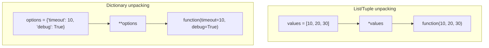
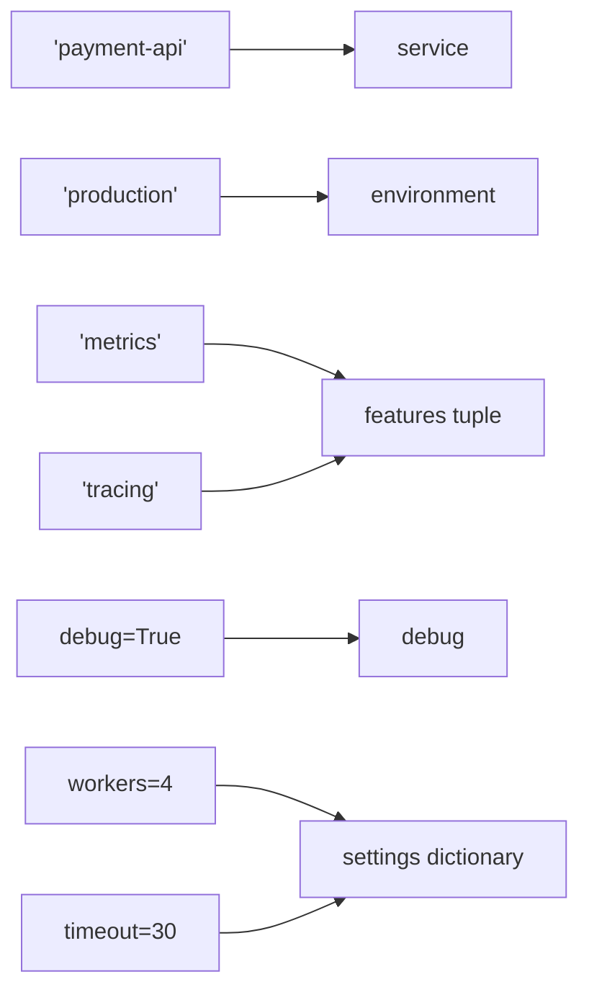
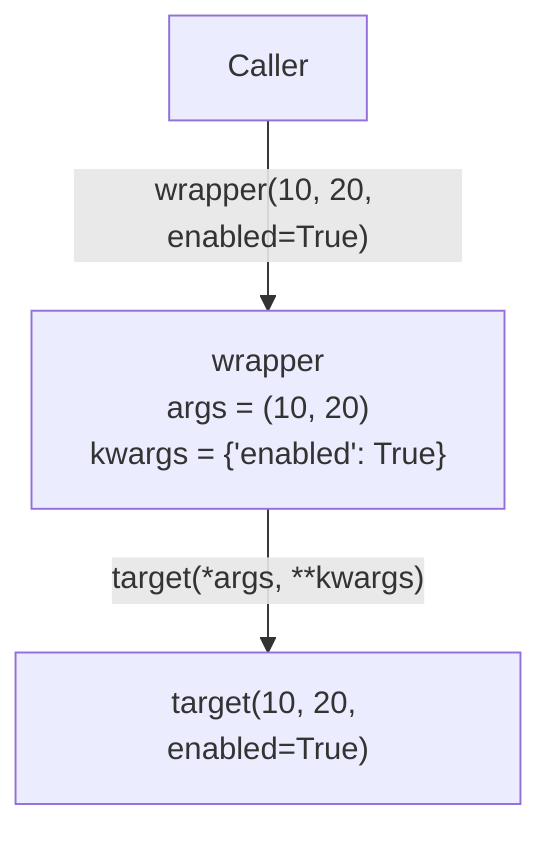

# Python `*args` and `**kwargs`

> `*args` collects extra positional arguments into a tuple, while `**kwargs` collects extra keyword arguments into a dictionary. The same `*` and `**` symbols are also used to unpack values when calling a function.

---

# 1. Why `*args` and `**kwargs` Exist

A normal function has a fixed number of parameters:

```python
def add(a, b):
    return a + b
```

This works only when the caller provides exactly two required values:

```python
add(10, 20)
```

Sometimes a function needs to accept a flexible number of values.

Examples:

- A logging function may receive any number of messages.
- A wrapper may need to pass unknown arguments to another function.
- A framework callback may receive optional configuration values.
- A class constructor may forward arguments to its parent class.
- A reusable helper may support future options without changing every caller.

Python provides:

```python
*args
```

for additional **positional arguments**, and:

```python
**kwargs
```

for additional **keyword arguments**.

---

# 2. Arguments vs Parameters

These terms are related but not identical.

## Parameters

Parameters are the names written in the function definition:

```python
def greet(name, message):
    ...
```

Here, `name` and `message` are parameters.

## Arguments

Arguments are the actual values supplied during the function call:

```python
greet("Avadh", "Welcome")
```

Here, `"Avadh"` and `"Welcome"` are arguments.

```text
Function definition                       Function call
-------------------                       -------------
def greet(name, message):                 greet("Avadh", "Welcome")
          └──── parameters ────┘                 └── arguments ──┘
```

---

# 3. `*args`: Variable Positional Arguments

`*args` allows a function to accept zero or more additional positional arguments.

```python
def show_values(*args):
    print(args)
    print(type(args))
```

```python
show_values(10, 20, 30)
```

Output:

```text
(10, 20, 30)
<class 'tuple'>
```

Python packs the positional arguments into a tuple.

```text
show_values(10, 20, 30)
            │   │   │
            └───┴───┴──────┐
                            ▼
                  args = (10, 20, 30)
```

## Iterating over `args`

Because `args` is a tuple, it can be iterated over:

```python
def calculate_total(*args):
    total = 0

    for value in args:
        total += value

    return total


print(calculate_total(10, 20, 30))
```

Output:

```text
60
```

A shorter implementation can use `sum()`:

```python
def calculate_total(*args):
    return sum(args)
```

## Required parameters before `*args`

Normal parameters may appear before `*args`:

```python
def create_message(prefix, *messages):
    return [f"{prefix}: {message}" for message in messages]


result = create_message(
    "INFO",
    "Server started",
    "Database connected",
)
```

The values are assigned as follows:

```text
prefix   = "INFO"
messages = ("Server started", "Database connected")
```

## Zero extra positional arguments

`*args` does not require the caller to pass extra values:

```python
def inspect_args(*args):
    return args


print(inspect_args())
```

Output:

```text
()
```

Python creates an empty tuple when no extra positional arguments are provided.

> `args` is only a conventional name. Python recognizes the `*`, not the word `args`.

This is valid, but less readable:

```python
def calculate(*numbers):
    return sum(numbers)
```

Use meaningful names when they improve clarity:

```python
def publish_events(*events):
    ...
```

---

# 4. `**kwargs`: Variable Keyword Arguments

`**kwargs` allows a function to accept zero or more additional keyword arguments.

```python
def show_options(**kwargs):
    print(kwargs)
    print(type(kwargs))
```

```python
show_options(timeout=30, retries=3, debug=True)
```

Output:

```text
{'timeout': 30, 'retries': 3, 'debug': True}
<class 'dict'>
```

Python packs the keyword arguments into a dictionary.

```text
show_options(timeout=30, retries=3, debug=True)
                  │           │          │
                  └───────────┴──────────┴──────┐
                                                ▼
kwargs = {
    "timeout": 30,
    "retries": 3,
    "debug": True,
}
```

## Reading values from `kwargs`

All normal dictionary operations are available:

```python
def connect(**kwargs):
    host = kwargs.get("host", "localhost")
    port = kwargs.get("port", 5432)
    timeout = kwargs.get("timeout", 10)

    return f"Connecting to {host}:{port}, timeout={timeout}s"
```

```python
print(connect(host="db.example.com", timeout=20))
```

Output:

```text
Connecting to db.example.com:5432, timeout=20s
```

## Required parameters before `**kwargs`

```python
def create_user(username, **profile):
    return {
        "username": username,
        "profile": profile,
    }
```

```python
user = create_user(
    "avadh",
    email="avadh@example.com",
    active=True,
)
```

The values are assigned as follows:

```text
username = "avadh"

profile = {
    "email": "avadh@example.com",
    "active": True,
}
```

## Zero keyword arguments

```python
def inspect_kwargs(**kwargs):
    return kwargs


print(inspect_kwargs())
```

Output:

```text
{}
```

Python creates a new empty dictionary when no additional keyword arguments are provided.

> `kwargs` is also only a naming convention. The `**` syntax gives it special meaning.

A domain-specific name may be clearer:

```python
def build_query(**filters):
    ...
```

---

# 5. Using `*args` and `**kwargs` Together

A function can accept both variable positional and variable keyword arguments:

```python
def process_request(*args, **kwargs):
    print("Positional:", args)
    print("Keyword:", kwargs)
```

```python
process_request(
    "create",
    101,
    urgent=True,
    source="api",
)
```

Output:

```text
Positional: ('create', 101)
Keyword: {'urgent': True, 'source': 'api'}
```

## Data flow

```text
process_request("create", 101, urgent=True, source="api")
                 │       │       │             │
                 └──┬────┘       └──────┬──────┘
                    ▼                   ▼
         args = ("create", 101)   kwargs = {
                                      "urgent": True,
                                      "source": "api",
                                  }
```

## With normal parameters

```python
def execute(command, *values, dry_run=False, **options):
    print("command:", command)
    print("values:", values)
    print("dry_run:", dry_run)
    print("options:", options)
```

```python
execute(
    "deploy",
    "api",
    "worker",
    dry_run=True,
    region="ap-south-1",
)
```

Binding result:

```text
command = "deploy"
values  = ("api", "worker")
dry_run = True
options = {"region": "ap-south-1"}
```

Notice that `dry_run` appears after `*values`. It is therefore keyword-only.

---

# 6. Packing vs Unpacking

The same symbols perform different jobs depending on where they appear.

## Packing in a function definition

In a definition, `*` and `**` collect values:

```python
def collect(*args, **kwargs):
    ...
```

```text
Many positional values ──*──▶ one tuple
Many keyword values    ──**─▶ one dictionary
```

## Unpacking in a function call

In a call, `*` and `**` expand collections into separate arguments.

### Unpacking a list or tuple with `*`

```python
def add(a, b, c):
    return a + b + c


numbers = [10, 20, 30]

result = add(*numbers)
print(result)
```

This call:

```python
add(*numbers)
```

is equivalent to:

```python
add(10, 20, 30)
```

### Unpacking a dictionary with `**`

```python
def create_account(username, email, active):
    return {
        "username": username,
        "email": email,
        "active": active,
    }


account_data = {
    "username": "avadh",
    "email": "avadh@example.com",
    "active": True,
}

account = create_account(**account_data)
```

This call:

```python
create_account(**account_data)
```

is equivalent to:

```python
create_account(
    username="avadh",
    email="avadh@example.com",
    active=True,
)
```

## Unpacking diagram



## Multiple unpackings

Modern Python allows multiple iterable and mapping unpackings in a call:

```python
def display(a, b, c, d, *, enabled, retries):
    print(a, b, c, d, enabled, retries)


first = [1, 2]
second = [3, 4]

base_options = {"enabled": True}
retry_options = {"retries": 3}

display(
    *first,
    *second,
    **base_options,
    **retry_options,
)
```

---

# 7. Function Parameter Order

Python parameters follow a defined order.

A practical complete signature looks like this:

```python
def example(
    positional_only,
    /,
    positional_or_keyword,
    default_value=10,
    *args,
    keyword_only,
    optional_keyword_only=True,
    **kwargs,
):
    ...
```

## General order

| Order | Parameter kind | Marker |
|---|---|---|
| 1 | Positional-only parameters | Before `/` |
| 2 | Positional-or-keyword parameters | — |
| 3 | Default parameters | — |
| 4 | `*args` | — |
| 5 | Keyword-only parameters | After `*args` |
| 6 | `**kwargs` | — |

A commonly used form is:

```python
def function(required, optional=None, *args, flag=False, **kwargs):
    ...
```

## Why `*args` must appear before `**kwargs`

`*args` collects remaining positional values.

`**kwargs` collects remaining keyword values.

Therefore, this is valid:

```python
def valid(*args, **kwargs):
    ...
```

This is invalid syntax:

```python
# SyntaxError
def invalid(**kwargs, *args):
    ...
```

---

# 8. Positional-Only and Keyword-Only Parameters

Understanding `/` and `*` makes function signatures much clearer.

## Positional-only parameters: `/`

Parameters before `/` can only be supplied by position:

```python
def divide(value, divisor, /):
    return value / divisor
```

Valid:

```python
divide(10, 2)
```

Invalid:

```python
divide(value=10, divisor=2)
```

Positional-only parameters are useful when:

- Parameter names are implementation details.
- Argument order is natural and obvious.
- Renaming a parameter should not break callers.
- An API must allow the same name inside `**kwargs`.

## Keyword-only parameters: `*`

Parameters after a bare `*` must be supplied by name:

```python
def fetch_data(url, *, timeout=10, verify_ssl=True):
    ...
```

Valid:

```python
fetch_data(
    "https://api.example.com",
    timeout=30,
    verify_ssl=False,
)
```

Invalid:

```python
fetch_data("https://api.example.com", 30, False)
```

Keyword-only parameters improve readability for flags and configuration values.

Compare:

```python
send_email("user@example.com", True, False)
```

with:

```python
send_email(
    "user@example.com",
    track_delivery=True,
    high_priority=False,
)
```

The second call explains itself.

## `*args` also creates keyword-only parameters

Any named parameters after `*args` are keyword-only:

```python
def export(*records, format="json", compress=False):
    ...
```

```python
export(record_1, record_2, format="csv", compress=True)
```

## Complete parameter model

```python
def function(
    pos_only,
    /,
    normal,
    *args,
    kw_only,
    **kwargs,
):
    ...
```

```text
function(1, 2, 3, 4, kw_only=5, extra=6)
         │  │  └─┴─ args       │          │
         │  │                  │          └─ kwargs
         │  └─ normal          └─ keyword-only
         └─ positional-only
```

---

# 9. How Python Binds Arguments

Consider this function:

```python
def configure(
    service,
    environment="development",
    *features,
    debug=False,
    **settings,
):
    return service, environment, features, debug, settings
```

Call:

```python
result = configure(
    "payment-api",
    "production",
    "metrics",
    "tracing",
    debug=True,
    workers=4,
    timeout=30,
)
```

Python binds values in this order:



Result:

```python
(
    "payment-api",
    "production",
    ("metrics", "tracing"),
    True,
    {"workers": 4, "timeout": 30},
)
```

## Binding rule summary

Python conceptually performs these steps:

1. Bind positional arguments to available positional parameters.
2. Put excess positional arguments into `*args`, when present.
3. Match keyword arguments to eligible named parameters.
4. Put unmatched keyword arguments into `**kwargs`, when present.
5. Apply default values to parameters that remain unfilled.
6. Raise `TypeError` when required values are missing, duplicated, or unexpected.

---

# 10. Practical Development Use Cases

## 10.1 Flexible logging helper

```python
from datetime import datetime
from typing import Any


def log_event(event: str, *details: Any, **context: Any) -> None:
    timestamp = datetime.now().isoformat(timespec="seconds")

    print(f"[{timestamp}] {event}")

    for detail in details:
        print(f"  - {detail}")

    for key, value in context.items():
        print(f"  {key}={value}")
```

```python
log_event(
    "PAYMENT_FAILED",
    "Card declined",
    "Retry allowed",
    user_id=101,
    order_id="ORD-9001",
)
```

This pattern is useful when a function has:

- A stable required part.
- Optional positional details.
- Optional named context.

---

## 10.2 Building database-style filters

```python
from typing import Any


def build_filters(**filters: Any) -> list[str]:
    conditions = []

    for field, value in filters.items():
        conditions.append(f"{field} = {value!r}")

    return conditions
```

```python
conditions = build_filters(
    status="active",
    country="India",
    verified=True,
)
```

Result:

```python
[
    "status = 'active'",
    "country = 'India'",
    "verified = True",
]
```

In production code, use parameterized queries or an ORM rather than manually inserting values into SQL.

---

## 10.3 Configuration override pattern

```python
from typing import Any


DEFAULT_CONFIG: dict[str, Any] = {
    "timeout": 10,
    "retries": 2,
    "verify_ssl": True,
}


def create_config(**overrides: Any) -> dict[str, Any]:
    return {
        **DEFAULT_CONFIG,
        **overrides,
    }
```

```python
config = create_config(timeout=30, retries=5)
```

Result:

```python
{
    "timeout": 30,
    "retries": 5,
    "verify_ssl": True,
}
```

Later dictionary values override earlier values when dictionaries are merged in a dictionary display.

---

## 10.4 Calling a service method with structured data

```python
from typing import Any


def create_order(
    customer_id: int,
    product_ids: list[int],
    *,
    priority: bool = False,
    **metadata: Any,
) -> dict[str, Any]:
    return {
        "customer_id": customer_id,
        "product_ids": product_ids,
        "priority": priority,
        "metadata": metadata,
    }
```

```python
order = create_order(
    101,
    [501, 502],
    priority=True,
    source="mobile",
    campaign="summer-sale",
)
```

Here:

- Core business inputs are explicit.
- A meaningful flag is keyword-only.
- Open-ended metadata is collected separately.

---

## 10.5 Adapter around a third-party client

```python
from typing import Any


class ApiClient:
    def request(
        self,
        method: str,
        path: str,
        **options: Any,
    ) -> dict[str, Any]:
        return {
            "method": method,
            "path": path,
            "options": options,
        }


def fetch_user(
    client: ApiClient,
    user_id: int,
    **request_options: Any,
) -> dict[str, Any]:
    return client.request(
        "GET",
        f"/users/{user_id}",
        **request_options,
    )
```

```python
response = fetch_user(
    ApiClient(),
    101,
    timeout=20,
    headers={"X-Request-ID": "req-123"},
)
```

This is argument forwarding: one function receives options and passes them to another function.

---

# 11. Forwarding Arguments

A forwarding function accepts arguments without needing to know their complete structure:

```python
def target(a, b, *, enabled=False):
    return a, b, enabled


def wrapper(*args, **kwargs):
    print("Before target")
    result = target(*args, **kwargs)
    print("After target")
    return result
```

```python
wrapper(10, 20, enabled=True)
```

## Forwarding flow



This pattern appears frequently in:

- Decorators
- Middleware
- Framework hooks
- Proxy objects
- Adapter layers
- Inheritance
- Test helpers

## Prefer explicit parameters for stable business APIs

This is flexible:

```python
def create_payment(**kwargs):
    ...
```

But the caller cannot easily discover which values are required.

This is clearer:

```python
def create_payment(
    amount: float,
    currency: str,
    *,
    customer_id: int,
    description: str | None = None,
):
    ...
```

Use `**kwargs` mainly for genuinely open-ended options, metadata, compatibility layers, or forwarding.

---

# 12. Decorators and Signature Preservation

Decorators commonly use `*args` and `**kwargs` because the wrapped function may accept any signature.

```python
from functools import wraps
from typing import Any, Callable


def audit(func: Callable[..., Any]) -> Callable[..., Any]:
    @wraps(func)
    def wrapper(*args: Any, **kwargs: Any) -> Any:
        print(f"Calling {func.__name__}")
        result = func(*args, **kwargs)
        print(f"Completed {func.__name__}")
        return result

    return wrapper
```

```python
@audit
def calculate_price(
    amount: float,
    tax_rate: float,
    *,
    discount: float = 0,
) -> float:
    subtotal = amount + (amount * tax_rate)
    return subtotal - discount
```

```python
price = calculate_price(
    100,
    0.18,
    discount=10,
)
```

## Why `functools.wraps` matters

Without `@wraps(func)`, metadata such as the original function name and documentation may be hidden by the wrapper.

```python
print(calculate_price.__name__)
```

With `@wraps(func)`, the result is:

```text
calculate_price
```

## Stronger typing with `ParamSpec`

`Callable[..., Any]` is flexible, but it does not preserve the exact parameter types for static type checkers.

For reusable typed decorators, use `ParamSpec`:

```python
from collections.abc import Callable
from functools import wraps
from typing import ParamSpec, TypeVar


P = ParamSpec("P")
R = TypeVar("R")


def audit(func: Callable[P, R]) -> Callable[P, R]:
    @wraps(func)
    def wrapper(*args: P.args, **kwargs: P.kwargs) -> R:
        print(f"Calling {func.__name__}")
        return func(*args, **kwargs)

    return wrapper
```

`P.args` and `P.kwargs` represent the original function's positional and keyword parameter types.

---

# 13. Using Them with Classes and `super()`

`*args` and `**kwargs` are often used to forward constructor arguments.

```python
from typing import Any


class BaseService:
    def __init__(self, name: str, *, enabled: bool = True) -> None:
        self.name = name
        self.enabled = enabled


class CachedService(BaseService):
    def __init__(
        self,
        *args: Any,
        cache_ttl: int = 300,
        **kwargs: Any,
    ) -> None:
        super().__init__(*args, **kwargs)
        self.cache_ttl = cache_ttl
```

```python
service = CachedService(
    "product-service",
    enabled=True,
    cache_ttl=600,
)
```

Binding:

```text
CachedService receives:
args   = ("product-service",)
kwargs = {"enabled": True}
cache_ttl = 600

Then it calls:
BaseService("product-service", enabled=True)
```

This is especially useful in cooperative inheritance, where each class consumes the arguments it owns and forwards the rest.

For public classes with stable constructors, explicit parameters usually provide better readability and type checking than completely generic `*args` and `**kwargs`.

---

# 14. Type Hints

## Homogeneous `*args`

This function accepts any number of integers:

```python
def total(*values: int) -> int:
    return sum(values)
```

The annotation applies to each individual positional value, not to the tuple as a whole.

Inside the function, type checkers understand approximately:

```python
values: tuple[int, ...]
```

## Homogeneous `**kwargs`

```python
def create_labels(**labels: str) -> dict[str, str]:
    return labels
```

Each keyword value must be a string.

Inside the function, type checkers understand approximately:

```python
labels: dict[str, str]
```

## Mixed values with `Any`

```python
from typing import Any


def collect_metadata(**metadata: Any) -> dict[str, Any]:
    return metadata
```

Use `Any` only when values are intentionally unrestricted.

## Structured keyword arguments with `TypedDict` and `Unpack`

When the accepted keyword names are known, a typed structure is more precise:

```python
from typing import NotRequired, TypedDict, Unpack


class RequestOptions(TypedDict):
    timeout: NotRequired[int]
    retries: NotRequired[int]
    verify_ssl: NotRequired[bool]


def request(
    url: str,
    **options: Unpack[RequestOptions],
) -> None:
    print(url, options)
```

This lets static type checkers understand the supported keyword names and their value types.

```python
request(
    "https://api.example.com",
    timeout=20,
    retries=3,
)
```

This pattern provides the runtime flexibility of `**kwargs` with stronger editor support.

---

# 15. Important Runtime Behaviors

## 15.1 Duplicate argument values raise `TypeError`

```python
def greet(name):
    return f"Hello, {name}"


data = {"name": "Avadh"}

greet("Avadh", **data)
```

The parameter `name` receives a value twice:

- Once positionally
- Once through `**data`

Python raises `TypeError`.

A similar conflict occurs with multiple dictionary unpackings in a function call when the same keyword is supplied more than once.

---

## 15.2 `*` requires an iterable during a call

Valid:

```python
values = [1, 2, 3]
print(*values)
```

Invalid:

```python
value = 10
print(*value)
```

An integer is not iterable, so it cannot be expanded into separate positional arguments.

---

## 15.3 `**` requires a mapping with string keys during a call

Valid:

```python
def display(name):
    print(name)


display(**{"name": "Avadh"})
```

Invalid:

```python
display(**{1: "Avadh"})
```

Keyword names must be strings.

---

## 15.4 `args` and `kwargs` containers are newly created

For each function call:

- `args` is a tuple representing collected positional arguments.
- `kwargs` is a new dictionary representing collected keyword arguments.

However, the objects inside them are still references to the original objects.

```python
def update_first(*args):
    args[0].append("updated")


items = ["original"]

update_first(items)

print(items)
```

Output:

```text
['original', 'updated']
```

The `args` tuple cannot be structurally modified, but a mutable object referenced inside it can still be modified.

---

## 15.5 Keyword order is preserved

Keyword arguments collected into `**kwargs` preserve the order in which they were provided:

```python
def inspect_order(**kwargs):
    return list(kwargs)


print(inspect_order(first=1, second=2, third=3))
```

Output:

```text
['first', 'second', 'third']
```

Do not use keyword order to represent essential business meaning when explicit data structures would be clearer.

---

## 15.6 `kwargs.get()` and `kwargs.pop()` have different purposes

Use `get()` when you want to read an optional value without removing it:

```python
timeout = kwargs.get("timeout", 10)
```

Use `pop()` when the current layer consumes an option and should not forward it:

```python
timeout = kwargs.pop("timeout", 10)
result = another_function(**kwargs)
```

This is common in wrappers and inheritance.

---

# 16. Best Practices

## 16.1 Keep required business inputs explicit

Prefer:

```python
def create_invoice(
    customer_id: int,
    amount: float,
    *,
    due_date: str,
    **metadata,
):
    ...
```

over:

```python
def create_invoice(**kwargs):
    ...
```

The explicit version clearly communicates the contract.

## 16.2 Use keyword-only parameters for flags

Prefer:

```python
def delete_user(user_id: int, *, hard_delete: bool = False):
    ...
```

Call:

```python
delete_user(101, hard_delete=True)
```

This is clearer than:

```python
delete_user(101, True)
```

## 16.3 Validate open-ended keyword options

When only a limited set of keys is supported, validate them:

```python
from typing import Any


ALLOWED_OPTIONS = {"timeout", "retries", "verify_ssl"}


def request(url: str, **options: Any) -> None:
    unknown = options.keys() - ALLOWED_OPTIONS

    if unknown:
        names = ", ".join(sorted(unknown))
        raise TypeError(f"Unsupported options: {names}")

    print(url, options)
```

Without validation, a typo can be silently collected:

```python
request(
    "https://api.example.com",
    timout=30,  # Typo: timeout
)
```

## 16.4 Avoid forwarding everything automatically

Forward only options that the downstream function should receive.

Less controlled:

```python
def wrapper(**kwargs):
    return target(**kwargs)
```

More controlled:

```python
def wrapper(**kwargs):
    timeout = kwargs.pop("timeout", 10)
    validate_options(kwargs)

    return target(timeout=timeout, **kwargs)
```

## 16.5 Document accepted keyword options

When `**kwargs` is part of a public API, explain supported keys in the docstring:

```python
from typing import Any


def export_records(*records: dict[str, Any], **options: Any) -> bytes:
    """Export records.

    Supported options:
        format: Output format such as "json" or "csv".
        compress: Whether to compress the generated output.
        include_header: Whether to include column headers.
    """
    ...
```

## 16.6 Use meaningful collector names when appropriate

These are often clearer than generic names:

```python
def search(*terms, **filters):
    ...
```

```python
def publish(*events, **metadata):
    ...
```

```python
def configure(*plugins, **settings):
    ...
```

## 16.7 Do not use flexibility without a reason

A fixed signature is usually easier to:

- Read
- Test
- Document
- Autocomplete
- Refactor
- Validate
- Type-check

Use `*args` and `**kwargs` when the function genuinely needs extensibility or forwarding.

---

# 17. Quick Comparison

| Feature | `*args` | `**kwargs` |
|---|---|---|
| Accepts | Extra positional arguments | Extra keyword arguments |
| Stored as | Tuple | Dictionary |
| Definition example | `def f(*args):` | `def f(**kwargs):` |
| Call unpacking | `f(*values)` | `f(**options)` |
| Input required during unpacking | Iterable | Mapping with string keys |
| Typical use | Variable values, forwarding | Options, metadata, forwarding |
| Empty value | `()` | `{}` |
| Conventional name | `args` | `kwargs` |

## Definition vs call

| Context | `*` meaning | `**` meaning |
|---|---|---|
| Function definition | Pack positional arguments | Pack keyword arguments |
| Function call | Unpack an iterable | Unpack a mapping |
| Collection display | Unpack iterable items | Unpack mapping entries into a dictionary |

---

# 18. Mental Model and Summary

Use this simple mental model:

```text
FUNCTION DEFINITION: collect

def function(*args, **kwargs):
             │       │
             │       └── collect keywords into a dictionary
             └────────── collect positions into a tuple


FUNCTION CALL: expand

function(*values, **options)
          │          │
          │          └── expand mapping into keyword arguments
          └───────────── expand iterable into positional arguments
```

## Final recap

```python
def example(required, *args, option=False, **kwargs):
    ...
```

- `required` receives the first required argument.
- `args` receives remaining positional arguments as a tuple.
- `option` is keyword-only because it follows `*args`.
- `kwargs` receives remaining keyword arguments as a dictionary.

Call:

```python
example(
    "main",
    10,
    20,
    option=True,
    source="api",
)
```

Binding:

```text
required = "main"
args     = (10, 20)
option   = True
kwargs   = {"source": "api"}
```

The most important design principle is:

> Use explicit parameters for the stable contract of a function, and use `*args` or `**kwargs` only for genuinely variable inputs, forwarding, metadata, or extension points.

---

## Official References

- Python Tutorial — More on Defining Functions:  
  <https://docs.python.org/3/tutorial/controlflow.html#more-on-defining-functions>
- Python Language Reference — Calls:  
  <https://docs.python.org/3/reference/expressions.html#calls>
- Python `typing` documentation:  
  <https://docs.python.org/3/library/typing.html>
