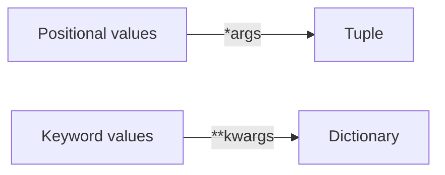
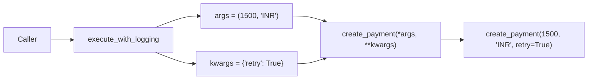

# Python `*args` and `**kwargs`

`*args` and `**kwargs` let a Python function work with a variable number of arguments.

- `*args` collects extra **positional arguments** into a tuple.
- `**kwargs` collects extra **keyword arguments** into a dictionary.
- In a function call, the same `*` and `**` symbols do the opposite: they **unpack** values.
- `args` and `kwargs` are naming conventions. Python gives special meaning to `*` and `**`, not to those names.

This pattern is commonly used in decorators, wrappers, framework hooks, middleware, reusable helpers, and constructor forwarding.

---

# 1. Core Idea

Consider a normal function:

```python
def add(a, b):
    return a + b
```

Its signature expects a fixed number of arguments. When the number of inputs is flexible, Python provides `*args` and `**kwargs`.

| Syntax | Accepts | Available inside function as |
|---|---|---|
| `*args` | Extra positional arguments | `tuple` |
| `**kwargs` | Extra keyword arguments | `dict` |



---

# 2. `*args` — Variable Positional Arguments

Use `*args` when a function may receive zero or more additional positional values.

```python
def calculate_total(*numbers):
    return sum(numbers)

print(calculate_total(10, 20, 30))  # 60
```

Inside the function:

```text
numbers = (10, 20, 30)
```

Because the collected value is a tuple, it can be iterated over, indexed, or passed to another function.

A function can also have normal parameters before `*args`:

```python
def log_messages(level, *messages):
    print(level, messages)

log_messages("INFO", "Server started", "Database connected")
```

Here:

```text
level    = "INFO"
messages = ("Server started", "Database connected")
```

If no extra positional arguments are supplied, the collected value is an empty tuple: `()`.

---

# 3. `**kwargs` — Variable Keyword Arguments

Use `**kwargs` when a function may receive zero or more additional named arguments.

```python
def connect(**options):
    host = options.get("host", "localhost")
    port = options.get("port", 5432)
    return f"{host}:{port}"

print(connect(host="db.example.com", port=5433))
```

Inside the function:

```python
options == {
    "host": "db.example.com",
    "port": 5433,
}
```

A normal parameter can appear before `**kwargs`:

```python
def create_user(username, **profile):
    return {"username": username, "profile": profile}
```

If no extra keyword arguments are supplied, the collected value is an empty dictionary: `{}`.

A meaningful collector name is often clearer than the generic name `kwargs`:

```python
def search(**filters):
    ...
```

---

# 4. Using `*args` and `**kwargs` Together

Both collectors can be used in the same function:

```python
def process(*args, **kwargs):
    print("Positional:", args)
    print("Keyword:", kwargs)

process("create", 101, urgent=True, source="api")
```

Python binds the values as:

```text
args   = ("create", 101)
kwargs = {"urgent": True, "source": "api"}
```

The important rule is that `*args` must appear before `**kwargs` in a function definition.

```python
def valid(*args, **kwargs):
    ...
```

This is invalid:

```python
def invalid(**kwargs, *args):
    ...
```

---

# 5. Packing vs Unpacking

The meaning of `*` and `**` depends on where they are used.

## 5.1 Packing in a Function Definition

In a function definition, they collect values:

```python
def function(*args, **kwargs):
    ...
```

```text
Positional arguments ──*──▶ tuple
Keyword arguments    ──**─▶ dictionary
```

## 5.2 Unpacking in a Function Call

In a function call, they expand existing collections into separate arguments.

### Unpacking with `*`

```python
def add(a, b, c):
    return a + b + c

values = [10, 20, 30]
result = add(*values)
```

This is equivalent to:

```python
add(10, 20, 30)
```

### Unpacking with `**`

```python
def create_account(username, active):
    return username, active

account = {
    "username": "avadh",
    "active": True,
}

create_account(**account)
```

This is equivalent to:

```python
create_account(username="avadh", active=True)
```

For call-time unpacking, `*` needs an iterable. `**` needs a mapping whose keys are strings because those keys become keyword argument names.

---

# 6. Positional-Only and Keyword-Only Parameters

`*args` becomes easier to understand when you also know Python's `/` and `*` parameter markers.

```python
def example(
    positional_only,
    /,
    normal,
    *args,
    keyword_only=False,
    **kwargs,
):
    ...
```

The signature can be read from left to right:

```text
positional_only | normal | extra positional | keyword-only | extra keywords
       /                      *args                 **kwargs
```

## 6.1 Positional-Only: `/`

Parameters before `/` must be passed by position.

```python
def divide(value, divisor, /):
    return value / divisor

divide(10, 2)  # valid
```

Passing `value=10` or `divisor=2` by name is not allowed for this signature.

## 6.2 Keyword-Only: `*`

Parameters after a bare `*`, or after `*args`, must be passed by name.

```python
def fetch(url, *, timeout=10, verify_ssl=True):
    ...

fetch("https://api.example.com", timeout=30, verify_ssl=False)
```

Keyword-only parameters are especially useful for flags and configuration because the call is easier to read than passing several booleans or numbers positionally.

---

# 7. One Practical Example — Forwarding Arguments

A common real-world use of `*args` and `**kwargs` is a wrapper that does not know the wrapped function's complete signature.

```python
def execute_with_logging(func, *args, **kwargs):
    print(f"Calling {func.__name__}")
    result = func(*args, **kwargs)
    print("Completed")
    return result


def create_payment(amount, currency, *, retry=False):
    return {
        "amount": amount,
        "currency": currency,
        "retry": retry,
    }


payment = execute_with_logging(
    create_payment,
    1500,
    "INR",
    retry=True,
)
```

The flow is:



This same forwarding idea appears frequently in:

- Decorators
- Middleware
- Framework callbacks and hooks
- Adapter or proxy functions
- `super().__init__(*args, **kwargs)`
- Test helpers

---

# 8. Important Runtime Rules

## 8.1 A Parameter Cannot Receive Two Values

If the same parameter is supplied more than once, Python raises `TypeError`.

```python
def greet(name):
    return name

data = {"name": "Avadh"}

greet("Avadh", **data)  # TypeError
```

`name` is being supplied once positionally and once through `**data`.

## 8.2 `kwargs.get()` vs `kwargs.pop()`

Use `get()` when you only need to read an option:

```python
timeout = kwargs.get("timeout", 10)
```

Use `pop()` when the current layer consumes the option and should not forward it further:

```python
timeout = kwargs.pop("timeout", 10)
return target(**kwargs)
```

This is particularly useful in wrappers and inheritance.

## 8.3 Collected Containers Are New, Their Objects Are Not Copied

Python creates a tuple for collected positional arguments and a dictionary for collected keyword arguments, but the objects inside them are still references to the original objects.

So mutating a mutable object received through `args` or `kwargs` can still affect the caller's object.

---

# 9. Type Hints

Type annotations on `*args` and `**kwargs` describe each collected value.

```python
def total(*values: int) -> int:
    return sum(values)


def build_labels(**labels: str) -> dict[str, str]:
    return labels
```

Inside these functions, type checkers understand the values approximately as:

```text
values -> tuple[int, ...]
labels -> dict[str, str]
```

For reusable decorators, `ParamSpec` can preserve the wrapped function's parameter types instead of falling back to `Callable[..., Any]`.

When a `**kwargs` API has a known set of keyword names, `TypedDict` together with `Unpack` provides more precise static typing than `**kwargs: Any`.

These typing features improve editor autocomplete and static checking without changing the runtime behavior of `*args` or `**kwargs`.

---

# 10. Best Practices

## Keep Stable Parameters Explicit

Prefer an explicit public API when the accepted values are known:

```python
def create_invoice(
    customer_id: int,
    amount: float,
    *,
    due_date: str,
    **metadata,
):
    ...
```

This is clearer than hiding every input inside `**kwargs`.

## Use `*args` and `**kwargs` for Genuine Flexibility

They are most useful for:

- Forwarding arguments
- Optional metadata
- Framework extension points
- Generic wrappers
- Variable-length input

Avoid using them only to make a function look flexible. Overusing `**kwargs` makes APIs harder to discover, document, validate, autocomplete, and type-check.

## Validate Open-Ended Keyword Options

If only a limited set of keyword options is supported, validate unexpected keys instead of silently accepting a typo.

## Prefer Meaningful Names When Helpful

These are completely valid and often easier to understand:

```python
def calculate(*numbers):
    ...


def search(**filters):
    ...


def publish(*events, **metadata):
    ...
```

---

# 11. Quick Revision

| Concept | `*args` | `**kwargs` |
|---|---|---|
| Function definition | Collects positional arguments | Collects keyword arguments |
| Stored as | Tuple | Dictionary |
| Function call | Unpacks an iterable | Unpacks a mapping |
| Empty collected value | `()` | `{}` |
| Common use | Variable values, forwarding | Options, metadata, forwarding |

```text
FUNCTION DEFINITION

def function(*args, **kwargs):
             │       │
             │       └── extra keywords -> dictionary
             └────────── extra positional values -> tuple

FUNCTION CALL

function(*values, **options)
          │          │
          │          └── mapping -> keyword arguments
          └───────────── iterable -> positional arguments
```

The simplest way to remember the topic is:

> In a function definition, `*args` and `**kwargs` **collect** arguments. In a function call, `*` and `**` **expand** arguments.
