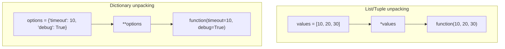
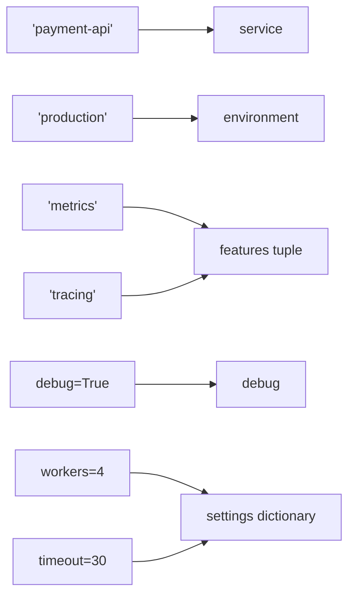
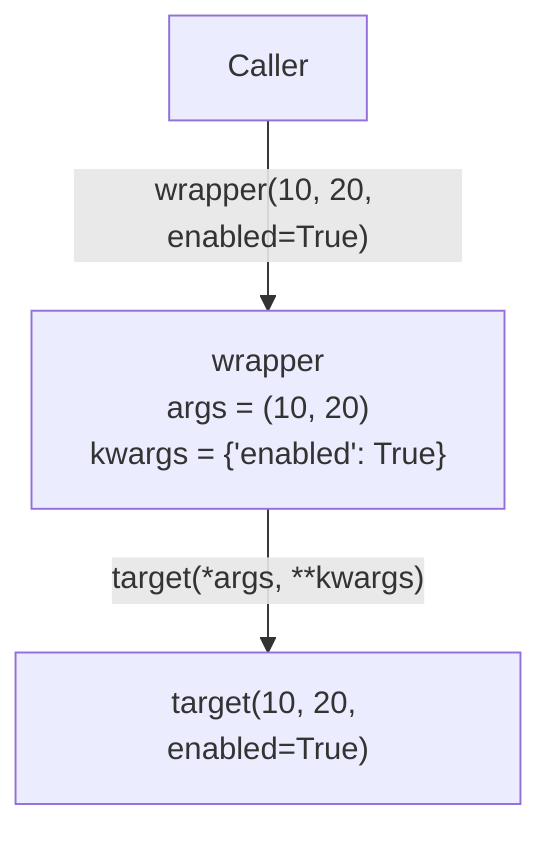

# Python `*args` and `**kwargs`

> `*args` collects extra positional arguments into a tuple, while `**kwargs` collects extra keyword arguments into a dictionary. The same `*` and `**` symbols are also used to unpack values when calling a function.

## In short

- In a definition, `*args` packs extra positional arguments into a tuple and `**kwargs` packs extra keyword arguments into a dictionary; with nothing extra passed they are `()` and `{}`.
- In a call the same symbols do the opposite: `*` expands an iterable into positional arguments and `**` expands a mapping with string keys into keyword arguments.
- Parameter order is fixed: positional-only before `/`, positional-or-keyword, defaults, `*args`, keyword-only, `**kwargs` last — `def invalid(**kwargs, *args)` is a `SyntaxError`.
- Anything named after `*args` or after a bare `*` is keyword-only; anything before `/` is positional-only.
- `def wrapper(*args, **kwargs)` calling `target(*args, **kwargs)` is how decorators, `super().__init__()`, middleware, and adapters forward a signature they do not know.
- Type each collected value, not the container: `*values: int`, `**labels: str`, `ParamSpec` for decorators, `TypedDict` with `Unpack` when the keyword names are known.
- Keep the stable contract explicit and use `*args` or `**kwargs` only for genuinely variable input, forwarding, metadata, or extension points.



**Interview answer:** `*args` collects any extra positional arguments into a tuple and `**kwargs` collects any extra keyword arguments into a dictionary, so one function can accept a variable number of values. At the call site the same `*` and `**` mean the opposite — they expand an iterable and a mapping back into separate arguments — which is why a wrapper can accept `*args, **kwargs` and forward them to a function whose signature it does not know. Python recognizes the `*` and `**`, not the names: `args` and `kwargs` are only conventions.

**Gotcha:** Supplying the same parameter twice, once positionally and once through an unpacked dictionary, as in `greet("Avadh", **{"name": "Avadh"})`, binds `name` twice and raises `TypeError`.

---

# 1. Why `*args` and `**kwargs` Exist

A normal function has a fixed number of parameters:

```python
def add(a, b):
    return a + b
```

This works only when the caller provides exactly two required values, as in `add(10, 20)`.

Sometimes a function needs to accept a flexible number of values.

Examples:

- A logging function may receive any number of messages.
- A wrapper may need to pass unknown arguments to another function.
- A framework callback may receive optional configuration values.
- A class constructor may forward arguments to its parent class.
- A reusable helper may support future options without changing every caller.

Python provides `*args` for additional **positional arguments** and `**kwargs` for additional **keyword arguments**.

---

# 2. Arguments vs Parameters

These terms are related but not identical. Parameters are the names written in the function definition; arguments are the actual values supplied during the function call.

```text
Function definition                       Function call
-------------------                       -------------
def greet(name, message):                 greet("Avadh", "Welcome")
          └──── parameters ────┘                 └── arguments ──┘
```

---

# 3. `*args`: Variable Positional Arguments

`*args` allows a function to accept zero or more additional positional arguments.

```python
def show_values(*args):
    print(args)
    print(type(args))

show_values(10, 20, 30)
```

Output:

```text
(10, 20, 30)
<class 'tuple'>
```

Python packs the positional arguments into a tuple.

```text
show_values(10, 20, 30)
            │   │   │
            └───┴───┴──────┐
                            ▼
                  args = (10, 20, 30)
```

## Iterating over `args`

Because `args` is a tuple, it can be iterated over:

```python
def calculate_total(*args):
    total = 0

    for value in args:
        total += value

    return total

print(calculate_total(10, 20, 30))   # 60
```

A shorter implementation is `return sum(args)`.

## Required parameters before `*args`

Normal parameters may appear before `*args`:

```python
def create_message(prefix, *messages):
    return [f"{prefix}: {message}" for message in messages]

result = create_message(
    "INFO",
    "Server started",
    "Database connected",
)
```

Here `prefix` receives `"INFO"` and `messages` receives `("Server started", "Database connected")`.

## Zero extra positional arguments

`*args` does not require the caller to pass extra values: given `def inspect_args(*args): return args`, the call `inspect_args()` returns `()`. Python creates an empty tuple when no extra positional arguments are provided.

> `args` is only a conventional name. Python recognizes the `*`, not the word `args`.

Use meaningful names when they improve clarity, such as `def calculate(*numbers)` or `def publish_events(*events)`.

---

# 4. `**kwargs`: Variable Keyword Arguments

`**kwargs` allows a function to accept zero or more additional keyword arguments.

```python
def show_options(**kwargs):
    print(kwargs)
    print(type(kwargs))

show_options(timeout=30, retries=3, debug=True)
```

Output:

```text
{'timeout': 30, 'retries': 3, 'debug': True}
<class 'dict'>
```

Python packs the keyword arguments into a dictionary.

```text
show_options(timeout=30, retries=3, debug=True)
                  │           │          │
                  └───────────┴──────────┴──────┐
                                                ▼
kwargs = {
    "timeout": 30,
    "retries": 3,
    "debug": True,
}
```

## Reading values from `kwargs`

All normal dictionary operations are available:

```python
def connect(**kwargs):
    host = kwargs.get("host", "localhost")
    port = kwargs.get("port", 5432)
    timeout = kwargs.get("timeout", 10)

    return f"Connecting to {host}:{port}, timeout={timeout}s"

print(connect(host="db.example.com", timeout=20))
# Connecting to db.example.com:5432, timeout=20s
```

## Required parameters before `**kwargs`

```python
def create_user(username, **profile):
    return {
        "username": username,
        "profile": profile,
    }

user = create_user(
    "avadh",
    email="avadh@example.com",
    active=True,
)
```

Here `username` receives `"avadh"` and `profile` receives `{"email": "avadh@example.com", "active": True}`.

## Zero keyword arguments

Given `def inspect_kwargs(**kwargs): return kwargs`, the call `inspect_kwargs()` returns `{}`. Python creates a new empty dictionary when no additional keyword arguments are provided.

> `kwargs` is also only a naming convention. The `**` syntax gives it special meaning.

A domain-specific name may be clearer, such as `def build_query(**filters)`.

---

# 5. Using `*args` and `**kwargs` Together

A function can accept both variable positional and variable keyword arguments:

```python
def process_request(*args, **kwargs):
    print("Positional:", args)
    print("Keyword:", kwargs)

process_request(
    "create",
    101,
    urgent=True,
    source="api",
)
```

Output:

```text
Positional: ('create', 101)
Keyword: {'urgent': True, 'source': 'api'}
```

## Data flow

```text
process_request("create", 101, urgent=True, source="api")
                 │       │       │             │
                 └──┬────┘       └──────┬──────┘
                    ▼                   ▼
         args = ("create", 101)   kwargs = {
                                      "urgent": True,
                                      "source": "api",
                                  }
```

Normal parameters may sit either side of the collectors, as in `def execute(command, *values, dry_run=False, **options)`. Notice that `dry_run` appears after `*values`, so it is keyword-only. Section 9 walks through how Python binds a call to a signature of that shape.

---

# 6. Packing vs Unpacking

The same symbols perform different jobs depending on where they appear.

## Packing in a function definition

In a definition, `*` and `**` collect values:

```python
def collect(*args, **kwargs):
    ...
```

```text
Many positional values ──*──▶ one tuple
Many keyword values    ──**─▶ one dictionary
```

## Unpacking in a function call

In a call, `*` and `**` expand collections into separate arguments.

### Unpacking a list or tuple with `*`

```python
def add(a, b, c):
    return a + b + c

numbers = [10, 20, 30]

result = add(*numbers)   # same as add(10, 20, 30)
```

### Unpacking a dictionary with `**`

```python
def create_account(username, email, active):
    return {"username": username, "email": email, "active": active}

account_data = {
    "username": "avadh",
    "email": "avadh@example.com",
    "active": True,
}

account = create_account(**account_data)
```

That call is equivalent to `create_account(username="avadh", email="avadh@example.com", active=True)`.

## Multiple unpackings

Modern Python allows multiple iterable and mapping unpackings in a call:

```python
def display(a, b, c, d, *, enabled, retries):
    print(a, b, c, d, enabled, retries)

first = [1, 2]
second = [3, 4]

base_options = {"enabled": True}
retry_options = {"retries": 3}

display(*first, *second, **base_options, **retry_options)
```

---

# 7. Function Parameter Order

Python parameters follow a defined order.

A practical complete signature looks like this:

```python
def example(
    positional_only,
    /,
    positional_or_keyword,
    default_value=10,
    *args,
    keyword_only,
    optional_keyword_only=True,
    **kwargs,
):
    ...
```

## General order

| Order | Parameter kind | Marker |
|---|---|---|
| 1 | Positional-only parameters | Before `/` |
| 2 | Positional-or-keyword parameters | — |
| 3 | Default parameters | — |
| 4 | `*args` | — |
| 5 | Keyword-only parameters | After `*args` |
| 6 | `**kwargs` | — |

A commonly used form is `def function(required, optional=None, *args, flag=False, **kwargs):`.

## Why `*args` must appear before `**kwargs`

`*args` collects the remaining positional values and `**kwargs` collects the remaining keyword values, so `def valid(*args, **kwargs):` is correct while `def invalid(**kwargs, *args):` is a `SyntaxError`.

---

# 8. Positional-Only and Keyword-Only Parameters

Understanding `/` and `*` makes function signatures much clearer.

## Positional-only parameters: `/`

Parameters before `/` can only be supplied by position:

```python
def divide(value, divisor, /):
    return value / divisor
```

`divide(10, 2)` is valid; `divide(value=10, divisor=2)` raises `TypeError`.

Positional-only parameters are useful when:

- Parameter names are implementation details.
- Argument order is natural and obvious.
- Renaming a parameter should not break callers.
- An API must allow the same name inside `**kwargs`.

## Keyword-only parameters: `*`

Parameters after a bare `*` must be supplied by name:

```python
def fetch_data(url, *, timeout=10, verify_ssl=True):
    ...
```

`fetch_data("https://api.example.com", timeout=30, verify_ssl=False)` is valid; `fetch_data("https://api.example.com", 30, False)` raises `TypeError`.

Keyword-only parameters improve readability for flags and configuration values: `send_email("user@example.com", track_delivery=True, high_priority=False)` explains itself, while `send_email("user@example.com", True, False)` does not.

## `*args` also creates keyword-only parameters

Any named parameters after `*args` are keyword-only:

```python
def export(*records, format="json", compress=False):
    ...

export(record_1, record_2, format="csv", compress=True)
```

## Complete parameter model

```python
def function(
    pos_only,
    /,
    normal,
    *args,
    kw_only,
    **kwargs,
):
    ...
```

```text
function(1, 2, 3, 4, kw_only=5, extra=6)
         │  │  └─┴─ args       │          │
         │  │                  │          └─ kwargs
         │  └─ normal          └─ keyword-only
         └─ positional-only
```

---

# 9. How Python Binds Arguments

Consider this function:

```python
def configure(
    service,
    environment="development",
    *features,
    debug=False,
    **settings,
):
    return service, environment, features, debug, settings

result = configure(
    "payment-api",
    "production",
    "metrics",
    "tracing",
    debug=True,
    workers=4,
    timeout=30,
)
```

Python binds values in this order:



The result is `("payment-api", "production", ("metrics", "tracing"), True, {"workers": 4, "timeout": 30})`.

## Binding rule summary

Python conceptually performs these steps:

1. Bind positional arguments to available positional parameters.
2. Put excess positional arguments into `*args`, when present.
3. Match keyword arguments to eligible named parameters.
4. Put unmatched keyword arguments into `**kwargs`, when present.
5. Apply default values to parameters that remain unfilled.
6. Raise `TypeError` when required values are missing, duplicated, or unexpected.

---

# 10. Practical Development Use Cases

## 10.1 Flexible logging helper

```python
from datetime import datetime
from typing import Any

def log_event(event: str, *details: Any, **context: Any) -> None:
    timestamp = datetime.now().isoformat(timespec="seconds")

    print(f"[{timestamp}] {event}")

    for detail in details:
        print(f"  - {detail}")

    for key, value in context.items():
        print(f"  {key}={value}")

log_event(
    "PAYMENT_FAILED",
    "Card declined",
    "Retry allowed",
    user_id=101,
    order_id="ORD-9001",
)
```

This pattern is useful when a function has a stable required part, optional positional details, and optional named context.

---

## 10.2 Configuration override pattern

```python
from typing import Any

DEFAULT_CONFIG: dict[str, Any] = {
    "timeout": 10,
    "retries": 2,
    "verify_ssl": True,
}

def create_config(**overrides: Any) -> dict[str, Any]:
    return {
        **DEFAULT_CONFIG,
        **overrides,
    }

config = create_config(timeout=30, retries=5)
# {"timeout": 30, "retries": 5, "verify_ssl": True}
```

Later dictionary values override earlier values when dictionaries are merged in a dictionary display.

---

# 11. Forwarding Arguments

A forwarding function accepts arguments without needing to know their complete structure:

```python
def target(a, b, *, enabled=False):
    return a, b, enabled

def wrapper(*args, **kwargs):
    print("Before target")
    result = target(*args, **kwargs)
    print("After target")
    return result

wrapper(10, 20, enabled=True)
```

## Forwarding flow



This pattern appears frequently in decorators, middleware, framework hooks, proxy objects, adapter layers, inheritance, and test helpers.

`def create_payment(**kwargs)` is flexible, but the caller cannot discover which values are required; `def create_payment(amount: float, currency: str, *, customer_id: int, description: str | None = None)` is clearer. Use `**kwargs` mainly for genuinely open-ended options, metadata, compatibility layers, or forwarding.

---

# 12. Decorators and Signature Preservation

Decorators commonly use `*args` and `**kwargs` because the wrapped function may accept any signature.

```python
from functools import wraps
from typing import Any, Callable

def audit(func: Callable[..., Any]) -> Callable[..., Any]:
    @wraps(func)
    def wrapper(*args: Any, **kwargs: Any) -> Any:
        print(f"Calling {func.__name__}")
        result = func(*args, **kwargs)
        print(f"Completed {func.__name__}")
        return result

    return wrapper
```

```python
@audit
def calculate_price(
    amount: float,
    tax_rate: float,
    *,
    discount: float = 0,
) -> float:
    subtotal = amount + (amount * tax_rate)
    return subtotal - discount

price = calculate_price(100, 0.18, discount=10)
```

## Why `functools.wraps` matters

Without `@wraps(func)`, metadata such as the original function name and documentation is hidden by the wrapper. With it, `calculate_price.__name__` still prints `calculate_price` rather than `wrapper`.

## Stronger typing with `ParamSpec`

`Callable[..., Any]` is flexible, but it does not preserve the exact parameter types for static type checkers.

For reusable typed decorators, use `ParamSpec`:

```python
from collections.abc import Callable
from functools import wraps
from typing import ParamSpec, TypeVar

P = ParamSpec("P")
R = TypeVar("R")

def audit(func: Callable[P, R]) -> Callable[P, R]:
    @wraps(func)
    def wrapper(*args: P.args, **kwargs: P.kwargs) -> R:
        print(f"Calling {func.__name__}")
        return func(*args, **kwargs)

    return wrapper
```

`P.args` and `P.kwargs` represent the original function's positional and keyword parameter types.

---

# 13. Using Them with Classes and `super()`

`*args` and `**kwargs` are often used to forward constructor arguments.

```python
from typing import Any

class BaseService:
    def __init__(self, name: str, *, enabled: bool = True) -> None:
        self.name = name
        self.enabled = enabled

class CachedService(BaseService):
    def __init__(
        self,
        *args: Any,
        cache_ttl: int = 300,
        **kwargs: Any,
    ) -> None:
        super().__init__(*args, **kwargs)
        self.cache_ttl = cache_ttl

service = CachedService(
    "product-service",
    enabled=True,
    cache_ttl=600,
)
```

Binding:

```text
CachedService receives:
args   = ("product-service",)
kwargs = {"enabled": True}
cache_ttl = 600

Then it calls:
BaseService("product-service", enabled=True)
```

This is especially useful in cooperative inheritance, where each class consumes the arguments it owns and forwards the rest.

For public classes with stable constructors, explicit parameters usually provide better readability and type checking than completely generic `*args` and `**kwargs`.

---

# 14. Type Hints

## The annotation applies to each value

The annotation on a collector describes one collected value, not the container:

```python
def total(*values: int) -> int:
    return sum(values)

def create_labels(**labels: str) -> dict[str, str]:
    return labels
```

`total` accepts any number of integers and `create_labels` requires every keyword value to be a string. Inside the functions, type checkers understand approximately `values: tuple[int, ...]` and `labels: dict[str, str]`. Use `**metadata: Any` only when values are intentionally unrestricted.

## Structured keyword arguments with `TypedDict` and `Unpack`

When the accepted keyword names are known, a typed structure is more precise:

```python
from typing import NotRequired, TypedDict, Unpack

class RequestOptions(TypedDict):
    timeout: NotRequired[int]
    retries: NotRequired[int]
    verify_ssl: NotRequired[bool]

def request(
    url: str,
    **options: Unpack[RequestOptions],
) -> None:
    print(url, options)
```

This lets static type checkers understand the supported keyword names and their value types.

```python
request(
    "https://api.example.com",
    timeout=20,
    retries=3,
)
```

This pattern provides the runtime flexibility of `**kwargs` with stronger editor support.

---

# 15. Important Runtime Behaviors

Three call-time rules cover most errors:

- A parameter that receives a value twice raises `TypeError`. For `def greet(name)` and `data = {"name": "Avadh"}`, the call `greet("Avadh", **data)` binds `name` once positionally and once through `**data`. The same conflict occurs when two dictionary unpackings in one call supply the same keyword.
- `*` requires an iterable during a call: `print(*[1, 2, 3])` works, `print(*10)` fails because an integer cannot be expanded into separate positional arguments.
- `**` requires a mapping with string keys during a call: for `def display(name)`, `display(**{"name": "Avadh"})` works and `display(**{1: "Avadh"})` fails, because keyword names must be strings.

Keyword arguments collected into `**kwargs` also preserve the order in which they were provided, so `inspect_order(first=1, second=2, third=3)` on `def inspect_order(**kwargs): return list(kwargs)` returns `['first', 'second', 'third']`. Do not use keyword order to represent essential business meaning when explicit data structures would be clearer.

## 15.1 `args` and `kwargs` containers are newly created

For each function call:

- `args` is a tuple representing collected positional arguments.
- `kwargs` is a new dictionary representing collected keyword arguments.

However, the objects inside them are still references to the original objects.

```python
def update_first(*args):
    args[0].append("updated")

items = ["original"]

update_first(items)

print(items)   # ['original', 'updated']
```

The `args` tuple cannot be structurally modified, but a mutable object referenced inside it can still be modified.

---

## 15.2 `kwargs.get()` and `kwargs.pop()` have different purposes

Use `get()` when you want to read an optional value without removing it, and `pop()` when the current layer consumes an option and should not forward it:

```python
timeout = kwargs.get("timeout", 10)    # stays in kwargs

timeout = kwargs.pop("timeout", 10)    # removed before forwarding
result = another_function(**kwargs)
```

This is common in wrappers and inheritance.

---

# 16. Best Practices

## 16.1 Keep the contract explicit

Prefer:

```python
def create_invoice(
    customer_id: int,
    amount: float,
    *,
    due_date: str,
    **metadata,
):
    ...
```

over `def create_invoice(**kwargs)`: the explicit version communicates the contract. Make flags keyword-only for the same reason — `def delete_user(user_id: int, *, hard_delete: bool = False)` forces the call to read `delete_user(101, hard_delete=True)` instead of `delete_user(101, True)`.

A fixed signature is also easier to read, test, document, autocomplete, refactor, validate, and type-check. Use `*args` and `**kwargs` when the function genuinely needs extensibility or forwarding.

## 16.2 Validate open-ended options and forward deliberately

When only a limited set of keys is supported, validate them:

```python
from typing import Any

ALLOWED_OPTIONS = {"timeout", "retries", "verify_ssl"}

def request(url: str, **options: Any) -> None:
    unknown = options.keys() - ALLOWED_OPTIONS

    if unknown:
        names = ", ".join(sorted(unknown))
        raise TypeError(f"Unsupported options: {names}")

    print(url, options)
```

Without validation, a typo such as `request("https://api.example.com", timout=30)` is silently collected.

Forward only options that the downstream function should receive. `def wrapper(**kwargs): return target(**kwargs)` passes everything through blindly; consuming what this layer owns first is more controlled:

```python
def wrapper(**kwargs):
    timeout = kwargs.pop("timeout", 10)
    validate_options(kwargs)

    return target(timeout=timeout, **kwargs)
```

## 16.3 Document accepted keyword options

When `**kwargs` is part of a public API, explain supported keys in the docstring:

```python
from typing import Any

def export_records(*records: dict[str, Any], **options: Any) -> bytes:
    """Export records.

    Supported options:
        format: Output format such as "json" or "csv".
        compress: Whether to compress the generated output.
        include_header: Whether to include column headers.
    """
    ...
```

Domain-specific collector names are often clearer than the generic ones: `def search(*terms, **filters)`, `def publish(*events, **metadata)`, `def configure(*plugins, **settings)`.

---

# 17. Quick Comparison

| Feature | `*args` | `**kwargs` |
|---|---|---|
| Accepts | Extra positional arguments | Extra keyword arguments |
| Stored as | Tuple | Dictionary |
| Definition example | `def f(*args):` | `def f(**kwargs):` |
| Call unpacking | `f(*values)` | `f(**options)` |
| Input required during unpacking | Iterable | Mapping with string keys |
| Typical use | Variable values, forwarding | Options, metadata, forwarding |
| Empty value | `()` | `{}` |
| Conventional name | `args` | `kwargs` |

## Definition vs call

| Context | `*` meaning | `**` meaning |
|---|---|---|
| Function definition | Pack positional arguments | Pack keyword arguments |
| Function call | Unpack an iterable | Unpack a mapping |
| Collection display | Unpack iterable items | Unpack mapping entries into a dictionary |

## Packing and unpacking at a glance

```text
FUNCTION DEFINITION: collect

def function(*args, **kwargs):
             │       │
             │       └── collect keywords into a dictionary
             └────────── collect positions into a tuple

FUNCTION CALL: expand

function(*values, **options)
          │          │
          │          └── expand mapping into keyword arguments
          └───────────── expand iterable into positional arguments
```

---

## Official References

- Python Tutorial — More on Defining Functions:  
  <https://docs.python.org/3/tutorial/controlflow.html#more-on-defining-functions>
- Python Language Reference — Calls:  
  <https://docs.python.org/3/reference/expressions.html#calls>
- Python `typing` documentation:  
  <https://docs.python.org/3/library/typing.html>
