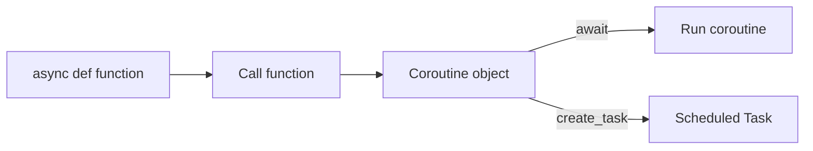
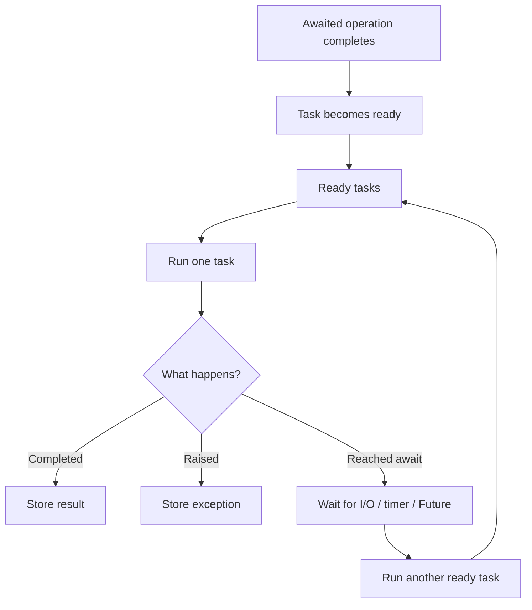
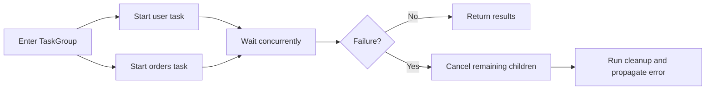
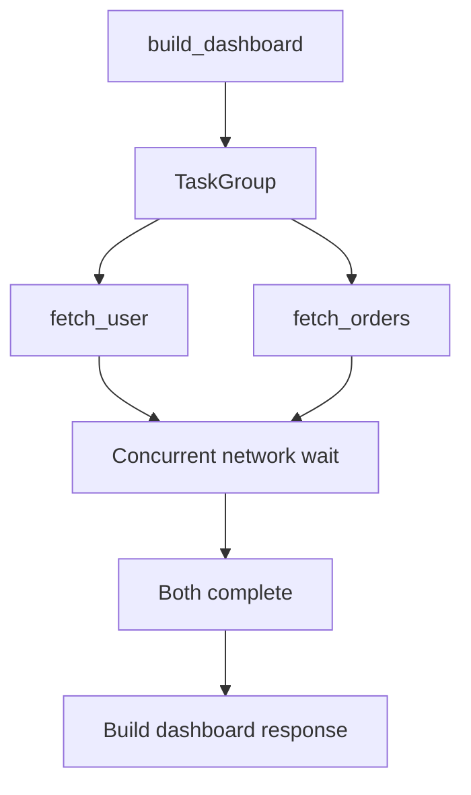

# Python `async` / `await`, Event Loop, and Coroutines

Python's `asyncio` model is designed for **concurrent I/O**. Instead of keeping a thread blocked while waiting for a database, HTTP API, Redis, socket, or message broker, a coroutine can pause at `await` and let the event loop run other ready work.

> `await` does not make an operation faster. It lets the event-loop thread do other useful work while that operation is waiting.

## Index

1. [The Core Mental Model](#1-the-core-mental-model)
2. [Coroutine, Task, and Future](#2-coroutine-task-and-future)
3. [How the Event Loop Works](#3-how-the-event-loop-works)
4. [Sequential vs Concurrent `await`](#4-sequential-vs-concurrent-await)
5. [Tasks and `TaskGroup`](#5-tasks-and-taskgroup)
6. [Timeouts and Cancellation](#6-timeouts-and-cancellation)
7. [Blocking Code Inside Async Applications](#7-blocking-code-inside-async-applications)
8. [Controlling Concurrency](#8-controlling-concurrency)
9. [Practical Backend Example](#9-practical-backend-example)
10. [When Async Is the Right Choice](#10-when-async-is-the-right-choice)
11. [Production Best Practices](#11-production-best-practices)
12. [Interview-Focused Summary](#12-interview-focused-summary)

---

# 1. The Core Mental Model

A normal synchronous function keeps control of its thread until it returns. An asynchronous coroutine can **pause** when it reaches an operation that must wait.

```python
user = await fetch_user()
```

If `fetch_user()` is waiting for network or database I/O, the current coroutine is suspended. The event loop can then run another ready task. When the awaited operation completes, the coroutine becomes ready again and continues from the same point.

```text
Synchronous

Task A: [request -------- waiting -------- response]
Task B:                                         [start]

Asynchronous

Task A: [request][........ waiting ........][resume]
Task B:          [request][... waiting ...][resume]
Task C:                    [useful work]
```

This is why async is useful for backend systems that spend significant time waiting on external resources.

---

# 2. Coroutine, Task, and Future

These three terms are closely related but mean different things.

| Concept | Meaning |
|---|---|
| **Coroutine function** | A function declared with `async def` |
| **Coroutine object** | The object created when a coroutine function is called |
| **Task** | A coroutine scheduled to run on the event loop |
| **Future** | A lower-level placeholder for a result that will be available later |

## 2.1 Coroutine function and coroutine object

```python
async def fetch_user() -> dict[str, object]:
    return {"id": 1, "name": "Aarav"}

coroutine = fetch_user()
```

Calling `fetch_user()` does **not** immediately run the function body. It creates a coroutine object.

The coroutine starts when it is awaited or scheduled:

```python
user = await fetch_user()
```

or:

```python
task = asyncio.create_task(fetch_user())
```



## 2.2 What `await` really means

`await` pauses the **current coroutine**, not the whole program.

The event loop can switch to another ready task only when the running coroutine reaches a suspension point such as an async network call, timer, queue operation, or another awaitable.

---

# 3. How the Event Loop Works

The event loop is the scheduler that coordinates async tasks.

At a high level it repeatedly:

1. Takes a ready task.
2. Runs it until it finishes, raises an exception, or reaches an `await` that suspends.
3. Tracks the pending I/O, timer, or Future.
4. Runs another ready task.
5. Resumes the suspended task when its awaited operation becomes ready.



## 3.1 Cooperative scheduling

`asyncio` uses **cooperative scheduling**. A coroutine must reach a point where it can yield control.

This means synchronous work can still block the event loop:

```python
async def bad_handler() -> None:
    for _ in range(1_000_000_000):
        pass  # Event loop cannot run other tasks during this work
```

One slow synchronous section can therefore delay many unrelated requests handled by the same event loop.

---

# 4. Sequential vs Concurrent `await`

This distinction is one of the most important async concepts.

## 4.1 Sequential async execution

```python
user = await fetch_user()
orders = await fetch_orders()
```

Even though both functions are asynchronous, `fetch_orders()` does not start until `fetch_user()` completes.

```text
fetch_user:   [------ 2s ------]
fetch_orders:                   [------ 2s ------]
Total:        [-------------- about 4s --------------]
```

## 4.2 Concurrent async execution

If the two operations are independent, schedule both before waiting for their results:

```python
user_task = asyncio.create_task(fetch_user())
orders_task = asyncio.create_task(fetch_orders())

user = await user_task
orders = await orders_task
```

```text
fetch_user:   [------ 2s ------]
fetch_orders: [------ 2s ------]
Total:        [------ about 2s ------]
```

The key rule is simple:

> Multiple `await` statements do not automatically mean concurrent execution.

---

# 5. Tasks and `TaskGroup`

A **Task** schedules a coroutine on the event loop.

```python
task = asyncio.create_task(fetch_user())
user = await task
```

Use individual tasks when you need explicit control over their lifetime or result.

## 5.1 Structured concurrency with `TaskGroup`

For a group of related operations, modern Python provides `asyncio.TaskGroup`.

```python
async with asyncio.TaskGroup() as group:
    user_task = group.create_task(fetch_user())
    orders_task = group.create_task(fetch_orders())

user = user_task.result()
orders = orders_task.result()
```

The `TaskGroup` does not exit until its child tasks finish.

If one child fails with a normal exception, the group cancels the remaining children, waits for their cleanup, and reports failures using exception-group semantics.



For related child operations, this lifecycle is usually easier to reason about than manually creating detached tasks.

## 5.2 `gather()` vs `TaskGroup`

`asyncio.gather()` is still useful when you simply want several awaitables to run concurrently and want results in input order:

```python
users = await asyncio.gather(
    fetch_user(1),
    fetch_user(2),
    fetch_user(3),
)
```

For a set of child tasks that should behave as one unit, prefer `TaskGroup` because its failure and cancellation behavior is more structured.

---

# 6. Timeouts and Cancellation

In production systems, async work should not wait forever.

## 6.1 Timeout a block of work

```python
try:
    async with asyncio.timeout(3):
        result = await call_service()
except TimeoutError:
    result = None
```

`asyncio.timeout()` is convenient when a deadline applies to several async operations inside one block.

For a single awaitable, `asyncio.wait_for()` is also available:

```python
result = await asyncio.wait_for(call_service(), timeout=3)
```

## 6.2 Cancellation

Cancellation is normal async control flow. It is used during timeouts, shutdowns, and `TaskGroup` failure handling.

```python
async def worker() -> None:
    try:
        await process_messages()
    except asyncio.CancelledError:
        await release_resources()
        raise
```

Do cleanup, then re-raise `CancelledError` unless you have a very specific reason to suppress cancellation.

Use `finally` or async context managers for resources that must always be closed:

```python
async def consume() -> None:
    connection = await open_connection()
    try:
        await connection.consume()
    finally:
        await connection.close()
```

---

# 7. Blocking Code Inside Async Applications

An async function can still block the event loop if it calls slow synchronous code.

```python
import time

async def bad_handler() -> None:
    time.sleep(5)  # Blocks the event-loop thread
```

Use the asynchronous equivalent when available:

```python
await asyncio.sleep(5)
```

## 7.1 Blocking I/O with `to_thread()`

If a library only provides a synchronous I/O API, move that call to a worker thread:

```python
result = await asyncio.to_thread(blocking_sdk_call, payload)
```

Good use cases include legacy SDKs, synchronous file operations, or synchronous HTTP/database clients during migration.

## 7.2 CPU-heavy work

A single `asyncio` event loop should not be used for heavy CPU work. In normal backend applications, move CPU-heavy work away from the event-loop thread.

For heavy CPU-bound work, use a process-based approach or a separate worker system, for example:

- `ProcessPoolExecutor`
- `multiprocessing`
- Celery or another worker queue
- A dedicated compute service

Python 3.14 also supports free-threaded builds where multiple event loops in different threads can execute in parallel, but that is a more advanced deployment model. The normal async design rule remains the same: do not keep CPU-heavy work on the event-loop thread.

See [Multithreading vs Multiprocessing vs Asyncio](threading-multiprocessing-asyncio.md) for the broader concurrency comparison.

---

# 8. Controlling Concurrency

Async makes it easy to start many operations, but unlimited concurrency can overload your own service or a dependency.

## 8.1 Semaphore

Use a semaphore when only a fixed number of operations should run at once:

```python
semaphore = asyncio.Semaphore(10)

async def fetch_item(item_id: int) -> dict:
    async with semaphore:
        return await client.get_item(item_id)
```

This is useful when protecting:

- Database connection pools
- External API rate limits
- Memory and socket limits
- Downstream service capacity

## 8.2 Queue and backpressure

A bounded `asyncio.Queue` is useful for producer-consumer workflows.

```python
queue: asyncio.Queue[int] = asyncio.Queue(maxsize=100)
```

When the queue is full, producers must wait. That creates **backpressure** instead of allowing memory usage to grow without control.

## 8.3 Shared mutable state

Single-threaded async code can still have race conditions if a coroutine suspends between reading and writing shared state.

Use `asyncio.Lock` when several coroutines must update the same in-memory state safely.

---

# 9. Practical Backend Example

A common backend requirement is building a dashboard from two independent downstream APIs.

```python
import asyncio
import httpx

async def fetch_user(client: httpx.AsyncClient, user_id: int) -> dict:
    response = await client.get(f"/users/{user_id}")
    response.raise_for_status()
    return response.json()


async def fetch_orders(client: httpx.AsyncClient, user_id: int) -> list[dict]:
    response = await client.get("/orders", params={"user_id": user_id})
    response.raise_for_status()
    return response.json()


async def build_dashboard(user_id: int) -> dict:
    async with httpx.AsyncClient(
        base_url="https://api.example.com",
        timeout=5.0,
    ) as client:
        async with asyncio.timeout(6):
            async with asyncio.TaskGroup() as group:
                user_task = group.create_task(
                    fetch_user(client, user_id),
                    name=f"user-{user_id}",
                )
                orders_task = group.create_task(
                    fetch_orders(client, user_id),
                    name=f"orders-{user_id}",
                )

        return {
            "user": user_task.result(),
            "orders": orders_task.result(),
        }
```

## Why this design works



The important design decisions are:

- The HTTP client is asynchronous.
- Independent requests run concurrently.
- `TaskGroup` keeps the child-task lifecycle bounded.
- Both client-level and operation-level timeouts exist.
- Timeout or downstream exceptions propagate to the caller, which can translate them at the API/service boundary.

This is a pattern you will commonly see in FastAPI, Starlette, async service layers, and integration-heavy backend systems.

---

# 10. When Async Is the Right Choice

## Use async when

- A service handles many concurrent HTTP requests.
- Most work is waiting on databases, Redis, APIs, sockets, or brokers.
- You maintain WebSocket or streaming connections.
- Your framework and dependencies already provide async APIs.
- Several independent I/O operations can overlap.

## Prefer synchronous code when

- The program performs little concurrent I/O.
- Most work is CPU-heavy.
- Dependencies are synchronous and async adds no measurable benefit.
- A simple script executes one operation at a time.

Async does **not** automatically improve database query efficiency, external API latency, algorithm speed, or CPU performance. It mainly improves how efficiently the application uses time that would otherwise be spent waiting.

---

# 11. Production Best Practices

## 11.1 Keep the async path async end-to-end

An `async def` endpoint still blocks if it calls a synchronous database driver or HTTP client directly.

Prefer async-compatible libraries where the surrounding application is asynchronous.

## 11.2 Define deadlines

Every external dependency can become slow or unavailable. Configure client timeouts and, where useful, an overall operation deadline.

## 11.3 Bound concurrency

More tasks are not always better. Match concurrency to database pools, rate limits, memory, sockets, and downstream capacity.

## 11.4 Treat cancellation as part of normal design

Write cleanup logic so deployments, request cancellation, and timeouts do not leak connections, locks, or partially completed resources.

## 11.5 Do not use in-process tasks for durable jobs

A task created with `asyncio.create_task()` disappears if the process crashes or restarts.

For work that must survive failures or deployments, use a durable queue or worker system such as Celery, RQ, Dramatiq, Kafka consumers, or a cloud queue.

## 11.6 Observe async systems

Useful production signals include:

- Request and downstream latency
- Timeout rate
- Active task count
- Queue depth
- Connection-pool utilization
- Cancellation rate
- Event-loop lag

Async increases concurrency; it does not remove downstream bottlenecks.

---

# 12. Interview-Focused Summary

```text
async def
   │
   └── creates a coroutine function
          │
          └── calling it creates a coroutine object
                    │
                    ├── await ───────────────► run and wait for result
                    │
                    └── create_task() ──────► schedule as Task
                                                   │
                                                   ▼
                                             Event Loop
                                                   │
                                  ┌────────────────┴───────────────┐
                                  │                                │
                              ready task                      waiting task
                                  │                                │
                                  ▼                                ▼
                           run until await                 I/O / timer / Future
                                  │                                │
                                  └────────── becomes ready ◄──────┘
```

Remember these points:

- `async def` defines a coroutine function.
- Calling it creates a coroutine object; it does not run immediately.
- `await` suspends the current coroutine when the awaited operation needs to wait.
- The event loop cooperatively schedules ready tasks.
- Consecutive `await` calls are usually sequential.
- Use tasks, `TaskGroup`, or `gather()` when independent I/O should overlap.
- Prefer `TaskGroup` for related child operations that should have one clear lifetime.
- Never block the event loop with slow synchronous I/O or heavy CPU work.
- Use `asyncio.to_thread()` for blocking synchronous I/O when no async API exists.
- Use timeouts, cancellation-safe cleanup, and bounded concurrency in production.
- Async is mainly an **I/O-concurrency tool**, not a CPU-performance shortcut.
