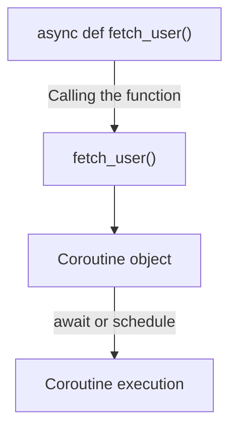
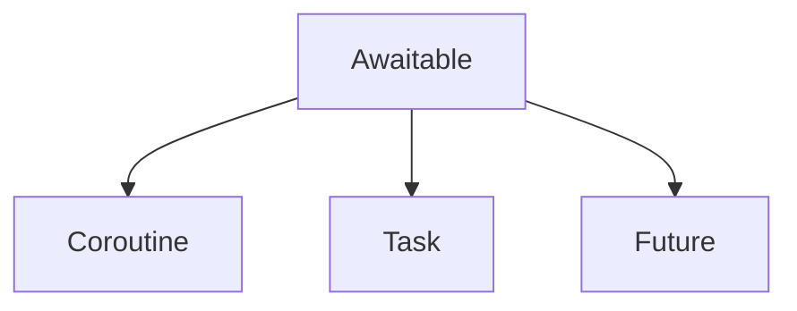
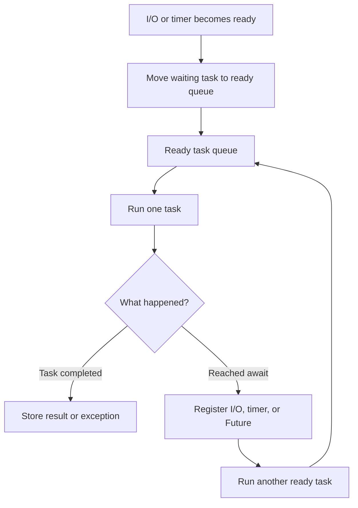
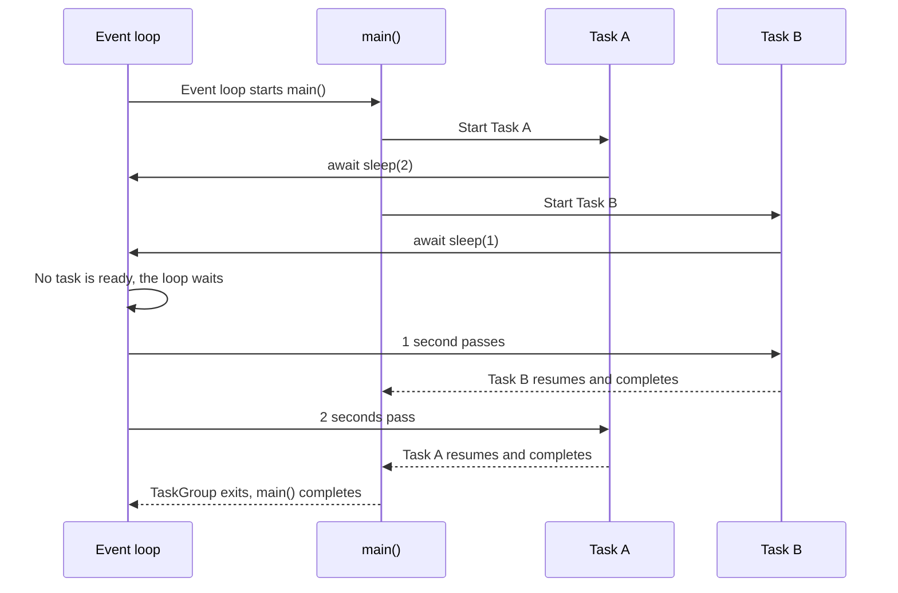
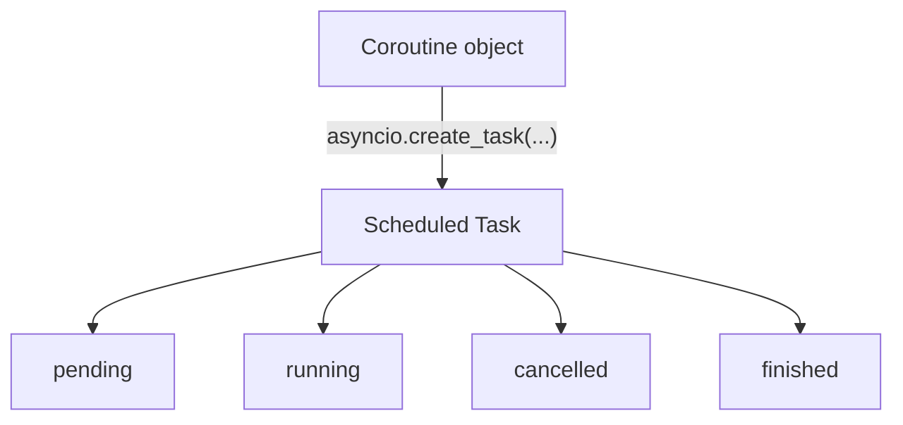
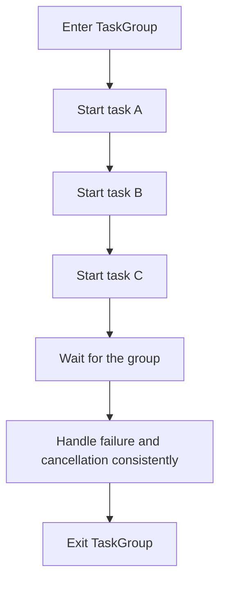
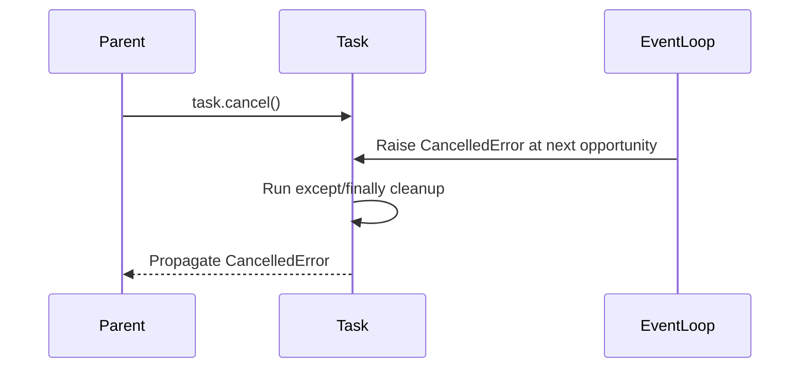
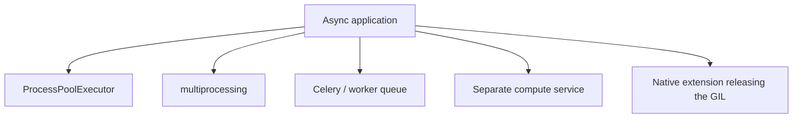
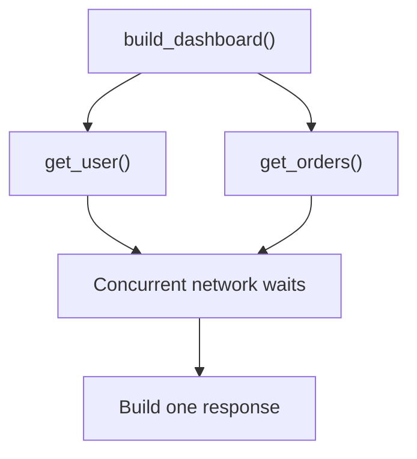
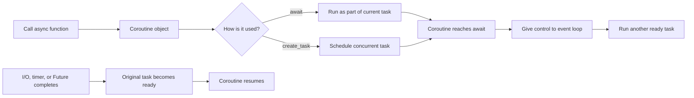

# Python `async` / `await`, Event Loop, and Coroutines

> Python's asynchronous model lets one thread manage many waiting I/O operations efficiently. A coroutine runs until it reaches an `await`, temporarily gives control back to the event loop, and resumes when the awaited operation is ready.

---

# 1. Why Asynchronous Programming Exists

Many backend applications spend more time **waiting** than computing:

- Waiting for an HTTP API
- Waiting for a database query
- Waiting for Redis
- Waiting for a message broker
- Waiting for a socket
- Waiting for a file or subprocess

A normal synchronous function blocks while it waits:

```python
response = call_external_api()  # Thread waits here
process(response)
```

An asynchronous function can pause during that waiting period and allow another coroutine to run:

```python
response = await call_external_api()  # Current coroutine pauses
process(response)
```

The important idea is:

> `await` does not make an operation faster. It lets the thread do other useful work while that operation is waiting.

## Basic comparison

```text
Synchronous execution
──────────────────────────────────────────────>

Task A: [Request........waiting........Response]
Task B:                                  [Start...]

Asynchronous execution
──────────────────────────────────────────────>

Task A: [Request][waiting................][Resume]
Task B:          [Request][waiting...][Resume]
Task C:                   [Useful work........]
```

Async programming is especially valuable when an application must handle many independent I/O operations concurrently.

---

# 2. Core Terminology

## 2.1 Synchronous

Operations run one after another. The next operation cannot proceed until the current operation finishes.

```python
result_a = fetch_a()
result_b = fetch_b()
```

## 2.2 Asynchronous

An operation can pause while waiting, allowing another operation to make progress.

```python
result_a = await fetch_a()
result_b = await fetch_b()
```

This code is asynchronous, but it is still **sequential** because the second call starts only after the first one finishes.

## 2.3 Concurrency

Multiple operations make progress during overlapping periods.

```text
Task A: running → waiting → running
Task B:          running → waiting → running
```

Concurrency is about managing multiple in-progress tasks.

## 2.4 Parallelism

Multiple operations execute at exactly the same time, usually on different CPU cores.

```text
CPU Core 1: Task A executing
CPU Core 2: Task B executing
```

`asyncio` mainly provides **concurrency**, not CPU parallelism.

## 2.5 I/O-bound work

Work dominated by waiting for external systems:

- Network requests
- Database calls
- Redis operations
- Socket communication
- File operations

Async programming is commonly useful here.

## 2.6 CPU-bound work

Work dominated by computation:

- Image processing
- Video encoding
- Data compression
- Large mathematical calculations
- Machine-learning inference

CPU-bound work usually needs processes, native code that releases the GIL, or a separate worker system rather than only `asyncio`.

---

# 3. Coroutines

A coroutine is a function that can pause and resume.

## 3.1 Coroutine function

A function declared with `async def` is a **coroutine function**:

```python
async def fetch_user() -> dict[str, object]:
    return {"id": 1, "name": "Aarav"}
```

## 3.2 Coroutine object

Calling a coroutine function does not immediately execute its body. It creates a **coroutine object**:

```python
coroutine = fetch_user()

print(coroutine)
# <coroutine object fetch_user at ...>
```

The coroutine runs only when it is:

- Awaited
- Wrapped in a task
- Passed to an API that schedules it
- Executed through an event-loop entry point

```python
user = await fetch_user()
```

## 3.3 Function vs object



## 3.4 A coroutine may not contain `await`

This is valid:

```python
async def get_constant() -> int:
    return 42
```

However, it gains no practical concurrency benefit because it never suspends.

Use a normal `def` when a function performs only synchronous work:

```python
def get_constant() -> int:
    return 42
```

---

# 4. `await` and Awaitable Objects

`await` pauses the current coroutine until an awaitable produces a result.

```python
result = await some_operation()
```

While the coroutine is paused, the event loop can run another ready task.

## 4.1 Main awaitable types

Python's async model commonly works with three awaitable types:

| Awaitable | Meaning |
|---|---|
| Coroutine | A suspendable computation created by calling an `async def` function |
| Task | A scheduled coroutine managed by the event loop |
| Future | A low-level placeholder for a result that will become available later |



Application code mostly works with **coroutines** and **tasks**. Futures are usually created and managed by frameworks and lower-level libraries.

## 4.2 `await` returns a value

```python
async def calculate() -> int:
    return 10

async def main() -> None:
    value = await calculate()
    print(value)  # 10
```

## 4.3 `await` propagates exceptions

```python
async def load_user() -> dict[str, object]:
    raise ConnectionError("Database unavailable")

async def main() -> None:
    try:
        await load_user()
    except ConnectionError as exc:
        print(f"Request failed: {exc}")
```

## 4.4 `await` is not a background-job instruction

This:

```python
result = await fetch_data()
```

means:

1. Start or continue `fetch_data()`.
2. Pause the current coroutine when `fetch_data()` suspends.
3. Resume the current coroutine after `fetch_data()` completes.
4. Assign its result.

It does not automatically mean "run this in parallel."

---

# 5. The Event Loop

The event loop is the scheduler at the center of an `asyncio` application.

It repeatedly:

1. Finds tasks that are ready to run.
2. Executes each task until it completes, raises, or reaches an `await`.
3. Watches pending I/O operations, timers, and callbacks.
4. Resumes tasks whose awaited operations are ready.
5. Repeats until the program finishes.

## Event-loop diagram



## Simplified pseudocode

```python
while there_is_work:
    ready_tasks = get_ready_tasks()

    for task in ready_tasks:
        run_until_next_await_or_completion(task)

    wait_for_io_or_timer_events()
```

Real event-loop implementations are more sophisticated, but this model is enough to understand normal application behavior.

## 5.1 Cooperative scheduling

`asyncio` uses cooperative scheduling.

A task gives other tasks a chance to run when it reaches a suspension point, normally an `await`.

```python
async def task_a() -> None:
    print("A1")
    await asyncio.sleep(1)
    print("A2")
```

If a coroutine performs long synchronous computation without awaiting, it can block the entire event loop.

```python
async def bad_coroutine() -> None:
    # No suspension point during this loop.
    for _ in range(1_000_000_000):
        pass
```

---

# 6. How Coroutine Execution Works

Consider two coroutines:

```python
import asyncio


async def download(name: str, delay: float) -> None:
    print(f"{name}: started")
    await asyncio.sleep(delay)
    print(f"{name}: completed")


async def main() -> None:
    async with asyncio.TaskGroup() as task_group:
        task_group.create_task(download("A", 2))
        task_group.create_task(download("B", 1))


asyncio.run(main())
```

## Execution timeline



The thread is not sleeping separately for each task. The event loop tracks both timers and resumes each task when appropriate.

---

# 7. Starting an Async Program

Use `asyncio.run()` as the normal entry point for a standalone async program:

```python
import asyncio


async def main() -> None:
    print("Application started")
    await asyncio.sleep(0.5)
    print("Application finished")


if __name__ == "__main__":
    asyncio.run(main())
```

`asyncio.run()`:

- Creates an event loop
- Runs the supplied coroutine
- Finalizes asynchronous generators
- Shuts down the default executor
- Closes the event loop

## 7.1 One top-level entry point

Prefer one top-level call:

```python
asyncio.run(main())
```

Do not repeatedly call `asyncio.run()` inside normal application logic.

## 7.2 Already-running event loops

Frameworks such as FastAPI, Starlette, Jupyter, and async test runners may already manage the event loop.

Inside an existing async function, use `await`:

```python
async def endpoint() -> dict[str, object]:
    return await load_data()
```

Do not call `asyncio.run()` from inside a running event loop:

```python
async def endpoint() -> None:
    asyncio.run(load_data())  # RuntimeError
```

---

# 8. Sequential vs Concurrent Execution

This distinction is one of the most important async concepts.

## 8.1 Sequential async execution

```python
import asyncio
import time


async def operation(name: str, delay: float) -> str:
    await asyncio.sleep(delay)
    return name


async def main() -> None:
    started = time.perf_counter()

    first = await operation("first", 2)
    second = await operation("second", 2)

    elapsed = time.perf_counter() - started
    print(first, second, round(elapsed, 2))


asyncio.run(main())
```

Approximate duration: **4 seconds**

```text
operation 1: [──────── 2s ────────]
operation 2:                         [──────── 2s ────────]
total:      [────────────────────── 4s ──────────────────]
```

## 8.2 Concurrent async execution

```python
import asyncio
import time


async def operation(name: str, delay: float) -> str:
    await asyncio.sleep(delay)
    return name


async def main() -> None:
    started = time.perf_counter()

    first_task = asyncio.create_task(operation("first", 2))
    second_task = asyncio.create_task(operation("second", 2))

    first = await first_task
    second = await second_task

    elapsed = time.perf_counter() - started
    print(first, second, round(elapsed, 2))


asyncio.run(main())
```

Approximate duration: **2 seconds**

```text
operation 1: [──────── 2s ────────]
operation 2: [──────── 2s ────────]
total:       [──────── 2s ────────]
```

## Key rule

```python
result_a = await fetch_a()
result_b = await fetch_b()
```

is normally sequential.

To overlap independent operations, schedule them before awaiting their results:

```python
task_a = asyncio.create_task(fetch_a())
task_b = asyncio.create_task(fetch_b())

result_a = await task_a
result_b = await task_b
```

---

# 9. Tasks and Structured Concurrency

A task schedules a coroutine to run concurrently on the event loop.

```python
task = asyncio.create_task(fetch_user())
user = await task
```

## 9.1 Why tasks exist

A coroutine object describes work. A task actively schedules and tracks that work.



## 9.2 Naming tasks

Task names improve logs and debugging:

```python
task = asyncio.create_task(
    fetch_user(),
    name="fetch-user-42",
)
```

## 9.3 Prefer `TaskGroup` for related tasks

`TaskGroup` provides structured concurrency:

```python
import asyncio


async def fetch_profile() -> dict[str, str]:
    await asyncio.sleep(0.5)
    return {"name": "Aarav"}


async def fetch_permissions() -> list[str]:
    await asyncio.sleep(0.5)
    return ["read", "write"]


async def main() -> None:
    async with asyncio.TaskGroup() as task_group:
        profile_task = task_group.create_task(fetch_profile())
        permissions_task = task_group.create_task(fetch_permissions())

    # The context exits only after both tasks finish.
    profile = profile_task.result()
    permissions = permissions_task.result()

    print(profile, permissions)


asyncio.run(main())
```

## 9.4 Why structured concurrency matters

A `TaskGroup` creates a clear lifetime boundary:



No child task should silently outlive the scope that created it unless that behavior is explicitly designed.

## 9.5 Failure behavior

When a child task fails with a non-cancellation exception, `TaskGroup` cancels the remaining child tasks and waits for them to finish cleanup. Multiple failures can be reported through an `ExceptionGroup`.

```python
import asyncio


async def successful_job() -> None:
    try:
        await asyncio.sleep(5)
    finally:
        print("successful_job cleanup")


async def failing_job() -> None:
    await asyncio.sleep(0.2)
    raise RuntimeError("Job failed")


async def main() -> None:
    try:
        async with asyncio.TaskGroup() as task_group:
            task_group.create_task(successful_job())
            task_group.create_task(failing_job())
    except* RuntimeError as group:
        for error in group.exceptions:
            print(error)


asyncio.run(main())
```

---

# 10. Collecting Concurrent Results

Different APIs solve different result-collection problems.

## 10.1 `asyncio.gather()`

Use `gather()` when you want results in input order:

```python
import asyncio


async def fetch(item_id: int) -> str:
    await asyncio.sleep(0.1)
    return f"item-{item_id}"


async def main() -> None:
    results = await asyncio.gather(
        fetch(1),
        fetch(2),
        fetch(3),
    )

    print(results)
    # ['item-1', 'item-2', 'item-3']


asyncio.run(main())
```

The operations run concurrently, but returned results correspond to the original argument order.

### Exception behavior

By default, the first propagated exception is raised to the caller:

```python
results = await asyncio.gather(task_a(), task_b())
```

`gather()` and `TaskGroup` do not have identical failure semantics. For a group of related child operations that should succeed or fail as one unit, `TaskGroup` is generally easier to reason about.

## 10.2 `asyncio.as_completed()`

Use `as_completed()` when you want results as soon as each operation finishes:

```python
import asyncio


async def fetch(name: str, delay: float) -> str:
    await asyncio.sleep(delay)
    return name


async def main() -> None:
    tasks = [
        asyncio.create_task(fetch("slow", 2)),
        asyncio.create_task(fetch("fast", 0.5)),
        asyncio.create_task(fetch("medium", 1)),
    ]

    async for completed_task in asyncio.as_completed(tasks):
        result = await completed_task
        print(result)


asyncio.run(main())
```

Expected completion order:

```text
fast
medium
slow
```

This is useful for:

- Streaming partial results
- Racing multiple services
- Processing responses immediately
- Progress reporting

## 10.3 `asyncio.wait()`

Use `wait()` when you need explicit `done` and `pending` task sets:

```python
done, pending = await asyncio.wait(
    tasks,
    timeout=2,
    return_when=asyncio.FIRST_COMPLETED,
)
```

Unlike `wait_for()`, a timeout in `wait()` does not automatically cancel pending tasks.

---

# 11. Timeouts and Cancellation

Timeouts and cancellation are normal control-flow mechanisms in asynchronous systems.

## 11.1 Timeout context manager

Use `asyncio.timeout()` to limit a block of async work:

```python
import asyncio


async def slow_operation() -> str:
    await asyncio.sleep(5)
    return "done"


async def main() -> None:
    try:
        async with asyncio.timeout(1):
            result = await slow_operation()
            print(result)
    except TimeoutError:
        print("Operation exceeded its time limit")


asyncio.run(main())
```

## 11.2 `asyncio.wait_for()`

Use `wait_for()` to limit one awaitable:

```python
result = await asyncio.wait_for(
    slow_operation(),
    timeout=1.0,
)
```

When the timeout expires, the awaited task is cancelled and `TimeoutError` is raised.

## 11.3 Explicit cancellation

```python
import asyncio


async def worker() -> None:
    try:
        while True:
            print("working")
            await asyncio.sleep(1)
    except asyncio.CancelledError:
        print("worker received cancellation")
        raise
    finally:
        print("worker cleanup completed")


async def main() -> None:
    task = asyncio.create_task(worker())

    await asyncio.sleep(2.5)
    task.cancel()

    try:
        await task
    except asyncio.CancelledError:
        print("worker was cancelled")


asyncio.run(main())
```

## 11.4 Cancellation flow



## 11.5 Cleanup with `finally`

Always place resource cleanup in `finally` or use an async context manager:

```python
async def process_connection(connection) -> None:
    try:
        await connection.process()
    finally:
        await connection.close()
```

## 11.6 Do not silently swallow `CancelledError`

Cancellation is how timeouts, shutdowns, and `TaskGroup` failure handling stop work.

```python
async def worker() -> None:
    try:
        await do_work()
    except asyncio.CancelledError:
        await cleanup()
        raise
```

Catching it without re-raising may break expected cancellation behavior.

## 11.7 Shielding

`asyncio.shield()` prevents cancellation of a specific inner awaitable when its caller is cancelled:

```python
task = asyncio.create_task(save_audit_record())
result = await asyncio.shield(task)
```

Use shielding carefully. It can make operation lifetimes harder to manage, and the caller still receives `CancelledError`.

---

# 12. Blocking Code Inside Async Applications

The event loop must not be blocked by ordinary slow synchronous code.

## 12.1 Blocking example

```python
import time


async def bad_handler() -> None:
    time.sleep(5)  # Blocks the event-loop thread
```

During those five seconds, unrelated coroutines on that event loop cannot progress.

Use async-compatible operations:

```python
import asyncio


async def good_handler() -> None:
    await asyncio.sleep(5)
```

## 12.2 Running synchronous I/O in a thread

Use `asyncio.to_thread()` for blocking I/O functions that do not have an async API:

```python
import asyncio
from pathlib import Path


def read_large_file(path: Path) -> str:
    return path.read_text(encoding="utf-8")


async def main() -> None:
    content = await asyncio.to_thread(
        read_large_file,
        Path("data.txt"),
    )
    print(len(content))


asyncio.run(main())
```

Common use cases:

- Legacy SDK calls
- Synchronous filesystem operations
- Synchronous database drivers during migration
- Blocking third-party clients

## 12.3 `to_thread()` is not the normal CPU solution

For heavy CPU work, use one of these designs:



A CPU-heavy function running in the event-loop thread delays every other task.

---

# 13. Limiting Concurrency and Protecting Shared State

Unlimited task creation can overload your own application or a downstream service.

## 13.1 Semaphore for bounded concurrency

```python
import asyncio


async def fetch_item(
    item_id: int,
    semaphore: asyncio.Semaphore,
) -> str:
    async with semaphore:
        print(f"Starting {item_id}")
        await asyncio.sleep(0.5)
        return f"item-{item_id}"


async def main() -> None:
    semaphore = asyncio.Semaphore(3)

    results = await asyncio.gather(
        *(fetch_item(item_id, semaphore) for item_id in range(10))
    )

    print(results)


asyncio.run(main())
```

At most three `fetch_item()` calls execute inside the protected section at one time.

Use bounded concurrency to respect:

- API rate limits
- Database connection-pool size
- Memory limits
- Socket limits
- Downstream service capacity

## 13.2 Lock for shared mutable state

```python
import asyncio


class Counter:
    def __init__(self) -> None:
        self.value = 0
        self._lock = asyncio.Lock()

    async def increment(self) -> None:
        async with self._lock:
            current = self.value
            await asyncio.sleep(0)
            self.value = current + 1
```

Even though `asyncio` normally runs in one thread, race conditions can still happen when a coroutine suspends between reading and writing shared state.

## 13.3 Queue for producer-consumer workflows

```python
import asyncio


async def producer(queue: asyncio.Queue[int]) -> None:
    for item in range(5):
        await queue.put(item)

    await queue.put(-1)  # Sentinel


async def consumer(queue: asyncio.Queue[int]) -> None:
    while True:
        item = await queue.get()

        try:
            if item == -1:
                return

            print(f"Processing {item}")
            await asyncio.sleep(0.2)
        finally:
            queue.task_done()


async def main() -> None:
    queue: asyncio.Queue[int] = asyncio.Queue(maxsize=10)

    producer_task = asyncio.create_task(producer(queue))
    consumer_task = asyncio.create_task(consumer(queue))

    await producer_task
    await queue.join()
    await consumer_task


asyncio.run(main())
```

A bounded queue provides backpressure: when the queue is full, the producer must wait.

---

# 14. Async Context Managers and Iterators

Async syntax extends beyond function calls.

## 14.1 Async context manager

An async context manager performs asynchronous setup and cleanup:

```python
async with database.transaction():
    await database.execute(...)
```

Its class implements:

```python
class AsyncResource:
    async def __aenter__(self):
        print("open resource")
        return self

    async def __aexit__(self, exc_type, exc, traceback):
        print("close resource")
```

Usage:

```python
async with AsyncResource() as resource:
    print(resource)
```

Typical examples:

- Database transactions
- HTTP client sessions
- WebSocket connections
- Distributed locks
- Async file-like resources

## 14.2 Async iterator

An async iterator can wait between produced values:

```python
import asyncio
from collections.abc import AsyncIterator


async def stream_events() -> AsyncIterator[str]:
    for event_id in range(3):
        await asyncio.sleep(0.5)
        yield f"event-{event_id}"


async def main() -> None:
    async for event in stream_events():
        print(event)


asyncio.run(main())
```

Typical examples:

- Streaming API responses
- WebSocket messages
- Database cursor pagination
- Message-broker consumption
- Server-sent events

---

# 15. Practical Service-Layer Example

The following example shows a common backend pattern using an async HTTP client.

> `httpx` is a third-party package. Install it with `pip install httpx`.

```python
from dataclasses import dataclass

import asyncio
import httpx


@dataclass(frozen=True)
class UserDashboard:
    user: dict[str, object]
    orders: list[dict[str, object]]


class DashboardService:
    def __init__(self, client: httpx.AsyncClient) -> None:
        self._client = client

    async def get_user(self, user_id: int) -> dict[str, object]:
        response = await self._client.get(f"/users/{user_id}")
        response.raise_for_status()
        return response.json()

    async def get_orders(
        self,
        user_id: int,
    ) -> list[dict[str, object]]:
        response = await self._client.get(
            "/orders",
            params={"user_id": user_id},
        )
        response.raise_for_status()
        return response.json()

    async def build_dashboard(self, user_id: int) -> UserDashboard:
        async with asyncio.TaskGroup() as task_group:
            user_task = task_group.create_task(
                self.get_user(user_id),
                name=f"user-{user_id}",
            )
            orders_task = task_group.create_task(
                self.get_orders(user_id),
                name=f"orders-{user_id}",
            )

        return UserDashboard(
            user=user_task.result(),
            orders=orders_task.result(),
        )


async def main() -> None:
    timeout = httpx.Timeout(5.0)

    async with httpx.AsyncClient(
        base_url="https://api.example.com",
        timeout=timeout,
    ) as client:
        service = DashboardService(client)

        try:
            async with asyncio.timeout(6):
                dashboard = await service.build_dashboard(user_id=42)
        except TimeoutError:
            print("Dashboard request timed out")
            return
        except httpx.HTTPError as exc:
            print(f"Downstream request failed: {exc}")
            return

        print(dashboard)


if __name__ == "__main__":
    asyncio.run(main())
```

## Why this design is useful



The two calls are independent, so they can run concurrently. Their lifecycle remains inside one `TaskGroup`.

---

# 16. Error Handling Patterns

## 16.1 Handle errors at the correct boundary

A low-level function should add context or raise a domain-specific exception:

```python
class UserServiceUnavailableError(RuntimeError):
    pass


async def load_user(user_id: int) -> dict[str, object]:
    try:
        return await repository.fetch_user(user_id)
    except ConnectionError as exc:
        raise UserServiceUnavailableError(
            f"Could not load user {user_id}"
        ) from exc
```

A higher layer decides how to respond:

```python
async def handle_request(user_id: int) -> dict[str, object]:
    try:
        return await load_user(user_id)
    except UserServiceUnavailableError:
        return {"error": "Service temporarily unavailable"}
```

## 16.2 Preserve cancellation

```python
async def run_job() -> None:
    try:
        await execute_job()
    except asyncio.CancelledError:
        await release_job_lease()
        raise
    except Exception:
        await mark_job_failed()
        raise
```

## 16.3 Use `finally` for guaranteed cleanup

```python
async def consume() -> None:
    connection = await open_connection()

    try:
        await connection.consume()
    finally:
        await connection.close()
```

## 16.4 Partial failure strategy

Decide explicitly whether operations are:

- **All-or-nothing**: use a `TaskGroup` and treat one failure as group failure.
- **Independent**: capture errors per operation and continue.
- **Best effort**: return successful results plus error metadata.
- **First-success wins**: process completions as they arrive and cancel the rest.

Example of independent result capture:

```python
from dataclasses import dataclass
from typing import Generic, TypeVar

T = TypeVar("T")


@dataclass(frozen=True)
class OperationResult(Generic[T]):
    value: T | None = None
    error: Exception | None = None


async def capture(awaitable) -> OperationResult:
    try:
        return OperationResult(value=await awaitable)
    except Exception as exc:
        return OperationResult(error=exc)
```

Do not catch `BaseException` for ordinary operation failures because that would also catch cancellation and system-exit exceptions.

---

# 17. Debugging, Testing, and Observability

## 17.1 Enable asyncio debug mode

```python
asyncio.run(main(), debug=True)
```

Or set:

```bash
PYTHONASYNCIODEBUG=1 python app.py
```

Debug mode can help identify:

- Slow callbacks
- Wrong-thread event-loop API calls
- Coroutines that were created but never awaited
- Resource warnings

## 17.2 Inspect active tasks

```python
for task in asyncio.all_tasks():
    print(task.get_name(), task.done())
```

Current task:

```python
current = asyncio.current_task()
```

## 17.3 Add meaningful task names

```python
asyncio.create_task(
    process_order(order_id),
    name=f"process-order-{order_id}",
)
```

This improves task dumps, logs, and debugging output.

## 17.4 Log operation boundaries

Useful log fields include:

- Request ID
- User or tenant ID
- Task name
- Downstream service
- Timeout value
- Attempt number
- Duration
- Cancellation status

```python
import time


async def timed_operation() -> None:
    started = time.perf_counter()

    try:
        await perform_operation()
    finally:
        duration = time.perf_counter() - started
        logger.info("operation_finished", extra={"duration": duration})
```

## 17.5 Testing async functions

With `pytest` and `pytest-asyncio`:

```python
import pytest


@pytest.mark.asyncio
async def test_fetch_user() -> None:
    user = await fetch_user(1)

    assert user["id"] == 1
```

Test important behaviors, not only successful results:

- Timeout handling
- Cancellation cleanup
- Partial failures
- Concurrency limits
- Resource closure
- Backpressure behavior

---

# 18. When to Use and Avoid Async

## Use async when

- A service handles many concurrent network requests.
- It calls async database, Redis, HTTP, or message-broker clients.
- It maintains many open sockets or WebSocket connections.
- Most operation time is spent waiting for I/O.
- The framework is already asynchronous, such as FastAPI or Starlette.
- Streaming or event-driven behavior is required.

## Prefer synchronous code when

- The application is small and performs little concurrent I/O.
- Available third-party libraries are synchronous only.
- The work is mainly CPU-bound.
- Async complexity would not provide measurable value.
- A straightforward script performs one operation at a time.

## Async does not automatically improve

- CPU execution speed
- Algorithmic complexity
- Database query efficiency
- External API latency
- Poor connection-pool configuration
- Unlimited downstream capacity

Async improves how waiting time is utilized.

---

# 19. Production Best Practices

## 19.1 Use async libraries end to end

An async endpoint with a blocking database driver still blocks its event-loop thread.

| Dependency used inside an async web handler | Verdict |
|---|---|
| Async HTTP client | Safe as-is |
| Async DB driver | Safe as-is |
| Async Redis client | Safe as-is |
| Blocking SDK call | Use `to_thread` or replace it |

## 19.2 Always define timeouts

External operations should not wait forever:

```python
async with asyncio.timeout(5):
    result = await call_service()
```

Also configure timeouts in the client library itself.

## 19.3 Bound concurrency

Do not create hundreds of thousands of tasks without a capacity plan.

Use:

- `asyncio.Semaphore`
- Bounded `asyncio.Queue`
- Connection-pool limits
- Worker pools
- Batch processing

## 19.4 Keep strong references to background tasks

The event loop keeps weak references to tasks. If an application intentionally creates background tasks, retain them and observe their results:

```python
background_tasks: set[asyncio.Task[object]] = set()


def start_background_task(coroutine) -> None:
    task = asyncio.create_task(coroutine)
    background_tasks.add(task)
    task.add_done_callback(background_tasks.discard)
```

A framework-managed background-job system is often better for durable work.

## 19.5 Do not use in-process tasks for durable jobs

A task disappears if the process crashes or restarts.

For work that must survive deployment or failure, use:

- Celery
- Dramatiq
- RQ
- Cloud queues
- Kafka consumers
- Dedicated worker services

## 19.6 Design graceful shutdown

A service shutdown should:

1. Stop accepting new work.
2. Signal running tasks to cancel.
3. Allow cleanup.
4. Close clients and connection pools.
5. Apply a maximum shutdown timeout.
6. Log unfinished operations.

## 19.7 Avoid unnecessary async wrappers

This adds no value:

```python
async def add(a: int, b: int) -> int:
    return a + b
```

Prefer:

```python
def add(a: int, b: int) -> int:
    return a + b
```

Use `async def` when the function needs asynchronous operations or must satisfy an async interface.

## 19.8 Measure real performance

Track:

- Event-loop lag
- Request latency
- Downstream latency
- Active task count
- Queue depth
- Timeout rate
- Cancellation rate
- Connection-pool utilization
- Error rate

High concurrency can expose downstream bottlenecks rather than remove them.

---

# 20. Final Mental Model



Remember these points:

1. `async def` defines a coroutine function.
2. Calling it creates a coroutine object; it does not necessarily run immediately.
3. `await` pauses the current coroutine and allows the event loop to run other ready tasks.
4. Multiple `await` statements can still be sequential.
5. `asyncio.create_task()` schedules concurrent work.
6. `TaskGroup` gives related tasks a clear, structured lifetime.
7. Async is most effective for high-concurrency I/O-bound workloads.
8. Blocking synchronous work can freeze the event loop.
9. Timeouts, cancellation, cleanup, and concurrency limits are core design concerns.
10. Async improves resource utilization while waiting; it does not make computation inherently faster.

---

## Compact Reference

```python
import asyncio


async def operation(name: str, delay: float) -> str:
    await asyncio.sleep(delay)
    return name


async def main() -> None:
    try:
        async with asyncio.timeout(5):
            async with asyncio.TaskGroup() as task_group:
                task_a = task_group.create_task(
                    operation("A", 1),
                    name="operation-a",
                )
                task_b = task_group.create_task(
                    operation("B", 2),
                    name="operation-b",
                )

        print(task_a.result(), task_b.result())

    except TimeoutError:
        print("Timed out")

    except asyncio.CancelledError:
        print("Main task cancelled")
        raise


if __name__ == "__main__":
    asyncio.run(main())
```

---

## Official References

- Python `asyncio` documentation: <https://docs.python.org/3/library/asyncio.html>
- Coroutines and tasks: <https://docs.python.org/3/library/asyncio-task.html>
- Developing with `asyncio`: <https://docs.python.org/3/library/asyncio-dev.html>
- Python expression reference for `await`: <https://docs.python.org/3/reference/expressions.html>
- Python data model for coroutine and awaitable objects: <https://docs.python.org/3/reference/datamodel.html>
