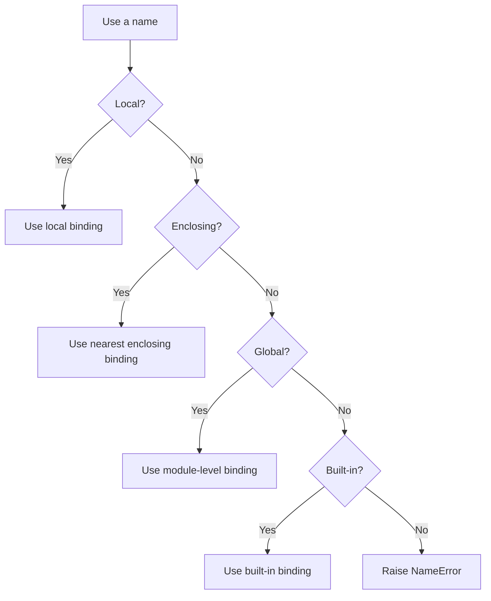
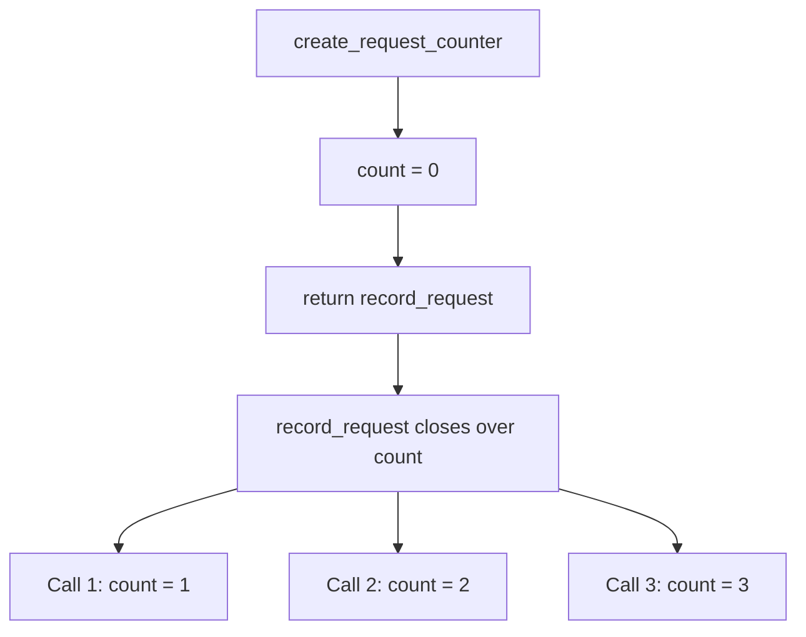

# Closures and Scope (LEGB Rule)

Python does not treat variables as boxes that permanently hold values. A **name is bound to an object**, and Python decides which binding to use based on scope.

For normal unqualified name lookup inside functions, the key mental model is **LEGB**:

**Local → Enclosing → Global → Built-ins**

Closures build on this idea. A nested function can use variables from an enclosing function, and those bindings remain available even after the outer function has returned.

## Index

1. Core Mental Model
2. LEGB Name Resolution
3. Assignment and `UnboundLocalError`
4. `global` and `nonlocal`
5. Closures
6. Late Binding
7. Practical Example
8. Closure vs Class
9. Best Practices and Quick Reference

---

# 1. Core Mental Model

## 1.1 Name

A **name** is an identifier bound to an object.

```python
request_count = 10
```

Conceptually:

```text
request_count ─────────► int object: 10
```

`request_count` is the name; `10` is the object.

## 1.2 Namespace

A **namespace** is a mapping of names to objects. Common namespaces include:

- Function-local namespaces
- Enclosing function namespaces
- A module's global namespace
- Python's built-in namespace
- Class namespaces

## 1.3 Scope

A **scope** is the region of code where a name can be resolved directly.

The important distinction is:

```text
Namespace = where names are stored
Scope     = where those names are directly visible
```

---

# 2. LEGB Name Resolution

When Python evaluates an unqualified name inside a function, it searches the available scopes in this order:



Python stops at the **first matching binding**.

## 2.1 Local Scope

Function parameters and names assigned inside the current function are normally local.

```python
def calculate_total(quantity: int, price: float) -> float:
    subtotal = quantity * price
    return subtotal
```

Here, `quantity`, `price`, and `subtotal` are local names.

## 2.2 Enclosing Scope

A nested function can read names from its nearest enclosing function scope.

```python
def outer() -> None:
    environment = "production"

    def inner() -> None:
        print(environment)

    inner()

outer()  # production
```

If several enclosing scopes contain the same name, Python uses the nearest one.

## 2.3 Global Scope

A global name belongs to the **current module's namespace**.

```python
DEFAULT_TIMEOUT = 30


def get_timeout() -> int:
    return DEFAULT_TIMEOUT
```

`global` does **not** mean automatically shared across every Python module. Other modules access the binding through imports.

## 2.4 Built-in Scope

Names such as `len`, `print`, `range`, and `Exception` come from Python's built-in namespace when no nearer scope shadows them.

Avoid shadowing built-ins:

```python
# Avoid
list = [1, 2, 3]

# Better
items = [1, 2, 3]
```

---

# 3. Assignment and `UnboundLocalError`

One of the most important scope rules is:

> If a name is assigned anywhere in a function body, Python normally treats that name as local to that function unless it is declared `global` or `nonlocal`.

Consider:

```python
counter = 10


def increment() -> None:
    print(counter)
    counter += 1
```

Calling `increment()` raises `UnboundLocalError`.

Why?

```text
counter += 1
↓
roughly means
↓
counter = counter + 1
```

Because the function assigns to `counter`, Python treats `counter` as local. The earlier `print(counter)` therefore tries to read that local name before it has a value.

## 3.1 Mutation vs Rebinding

This distinction is very important with globals and closures.

### Mutation

```python
settings = {"debug": False}


def enable_debug() -> None:
    settings["debug"] = True
```

No `global` is required because the name `settings` is only **read**; the dictionary object is mutated.

### Rebinding

```python
settings = {"debug": False}


def replace_settings() -> None:
    settings = {"debug": True}
```

This creates a new **local** binding named `settings`. It does not replace the module-level binding.

```text
Mutation  = change the existing object
Rebinding = make the name point to another object
```

---

# 4. `global` and `nonlocal`

Both statements change where assignment is performed.

| Statement | Assignment targets | Existing binding required? | Typical purpose |
|---|---|---:|---|
| `global` | Current module's global namespace | No | Rebind module-level state |
| `nonlocal` | Nearest enclosing function scope | Yes | Rebind closure state |

## 4.1 `global`

```python
request_count = 0


def record_request() -> None:
    global request_count
    request_count += 1
```

The assignment now updates the module-level `request_count`.

Use mutable global state carefully because it increases coupling and makes testing harder.

## 4.2 `nonlocal`

```python
def create_counter():
    count = 0

    def increment() -> int:
        nonlocal count
        count += 1
        return count

    return increment
```

`nonlocal count` means: **rebind the nearest `count` from an enclosing function scope**.

Important rules:

- `nonlocal` requires a matching binding in an enclosing function scope.
- It does not target the module-level global scope.
- Reading an enclosing value needs no `nonlocal`; rebinding it does.

---

# 5. Closures

A **closure** is a nested function that uses one or more **free variables** from an enclosing scope. Python keeps those bindings available for the nested function even after the outer function has finished.

```python
def create_multiplier(factor: int):
    def multiply(value: int) -> int:
        return value * factor

    return multiply


double = create_multiplier(2)
triple = create_multiplier(3)

print(double(10))  # 20
print(triple(10))  # 30
```

From the perspective of `multiply()`:

- `value` is local.
- `factor` is a free variable from the enclosing scope.
- The returned function closes over `factor`.

```mermaid
flowchart LR
    O1[create_multiplier(2)] --> D[double]
    D --> F1[factor = 2]

    O2[create_multiplier(3)] --> T[triple]
    T --> F2[factor = 3]
```

## 5.1 Closure Introspection

For debugging or learning, Python exposes captured variables through function metadata.

```python
print(double.__code__.co_freevars)          # ('factor',)
print(double.__closure__[0].cell_contents)  # 2
```

A higher-level standard-library option is:

```python
from inspect import getclosurevars

print(getclosurevars(double).nonlocals)
# {'factor': 2}
```

These APIs are useful for introspection and frameworks, but ordinary business logic should not depend on closure internals.

---

# 6. Late Binding

Closures normally capture **variables**, not frozen copies of their values. The value is read when the function executes.

This becomes visible when callbacks are created in a loop.

```python
functions = [lambda: number for number in range(3)]

print([function() for function in functions])
# [2, 2, 2]
```

All lambdas refer to the same `number` variable. By the time they run, the loop has finished and its final value is `2`.

## 6.1 Snapshot the Current Value

A common solution is a default argument:

```python
functions = [lambda number=number: number for number in range(3)]

print([function() for function in functions])
# [0, 1, 2]
```

Default argument expressions are evaluated when each function is created, so each lambda receives its own stored value.

For larger callbacks, a small factory function or `functools.partial` is often clearer.

---

# 7. Practical Example: Stateful Closure

A closure is useful when a function needs a **small amount of private state** without introducing a full class.

```python
from collections.abc import Callable


def create_request_counter(start: int = 0) -> Callable[[], int]:
    count = start

    def record_request() -> int:
        nonlocal count
        count += 1
        return count

    return record_request


api_counter = create_request_counter()

print(api_counter())  # 1
print(api_counter())  # 2
print(api_counter())  # 3
```

What happens here:



Why `nonlocal` is required:

- `count += 1` rebinds `count`.
- Without `nonlocal`, Python would treat `count` as a new local name inside `record_request()`.

This same closure pattern appears frequently in:

- Decorators
- Callback factories
- Small configuration wrappers
- Lightweight stateful utilities

Decorators are a common real-world example because the wrapper function closes over the original function.

---

# 8. Closure vs Class

Both closures and objects can retain state.

| Prefer a closure when | Prefer a class when |
|---|---|
| State is small | State has several related fields |
| One main operation is exposed | Multiple public operations are needed |
| Function-style composition is natural | Explicit object identity is useful |
| Building decorators or callbacks | Lifecycle/configuration is becoming complex |

A closure is not automatically better because it is shorter. Choose the structure that makes state ownership easiest to understand.

---

# 9. Best Practices and Quick Reference

## 9.1 Best Practices

- Keep state in the narrowest practical scope.
- Prefer explicit state passing over frequently mutated globals.
- Use `nonlocal` only for small, clearly owned closure state.
- Avoid shadowing built-ins such as `list`, `dict`, `set`, `str`, `id`, `type`, `sum`, `min`, and `max`.
- Handle loop-created callbacks deliberately to avoid late-binding surprises.
- Use `functools.wraps` when implementing decorators so function metadata is preserved.
- In normal method bodies, use explicit attribute access such as `self.timeout` or `type(self).timeout`; class-body names are not ordinary enclosing function variables for methods.
- Treat `locals()`, `globals()`, `__closure__`, and `co_freevars` mainly as debugging or introspection tools.

## 9.2 Assignment Reference

| Operation | Declaration normally needed? |
|---|---:|
| Read a global name | No |
| Rebind a global name | `global` |
| Read an enclosing name | No |
| Rebind an enclosing name | `nonlocal` |
| Mutate a captured list/dict | No |
| Replace a captured list/dict | `nonlocal` |

## 9.3 Error Reference

| Error | Typical reason |
|---|---|
| `NameError` | Name cannot be resolved in applicable scopes |
| `UnboundLocalError` | A local name is read before it has been bound |
| `SyntaxError` with `nonlocal` | No matching enclosing function binding exists |

## 9.4 Final Mental Model

```text
Name lookup:
Local → Enclosing → Global → Built-ins

Assignment inside a function:
Normally creates/rebinds Local

Need to rebind module state:
global

Need to rebind enclosing function state:
nonlocal

Closure:
Nested function + free variable from enclosing scope

Loop callbacks:
Remember late binding; snapshot when needed
```

The main idea to remember is that **LEGB explains where Python reads a name from, while `global` and `nonlocal` control where specific assignments are rebound. Closures are the practical result of nested functions retaining access to enclosing bindings.**
