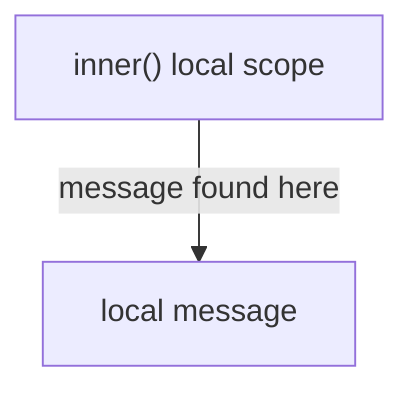
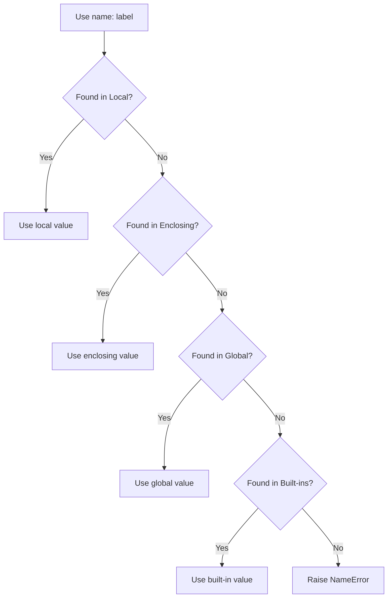
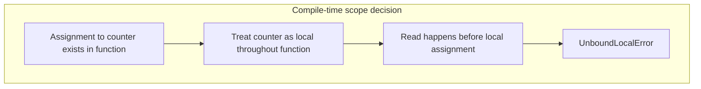
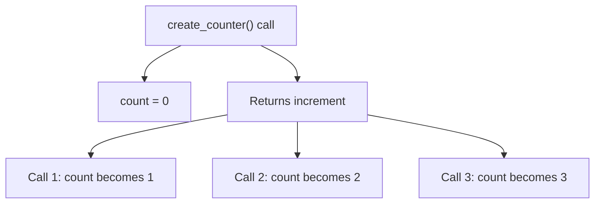
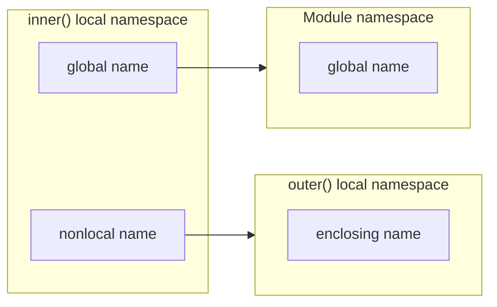
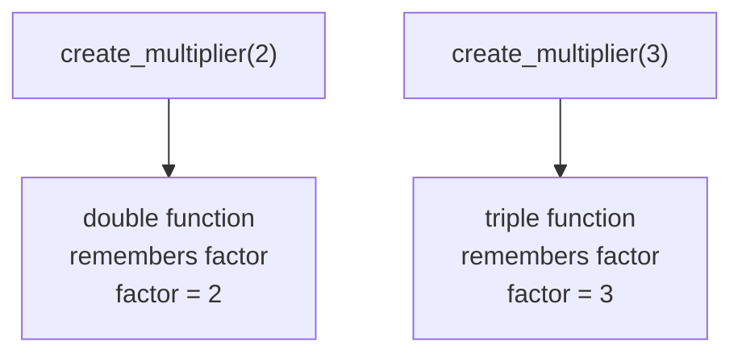
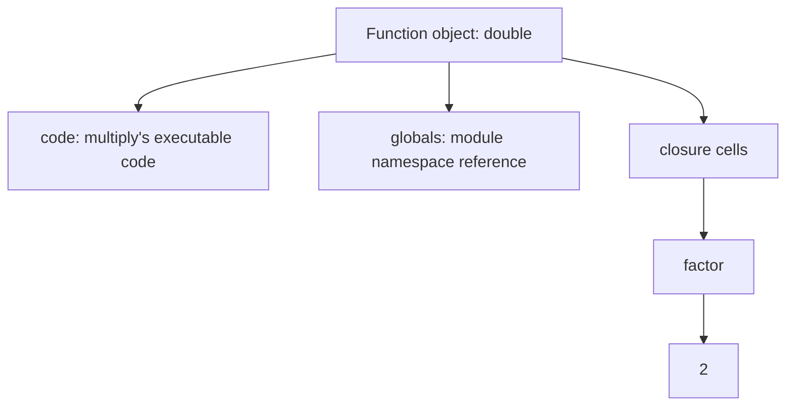
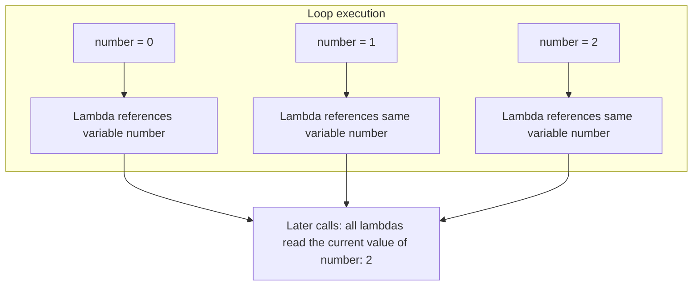
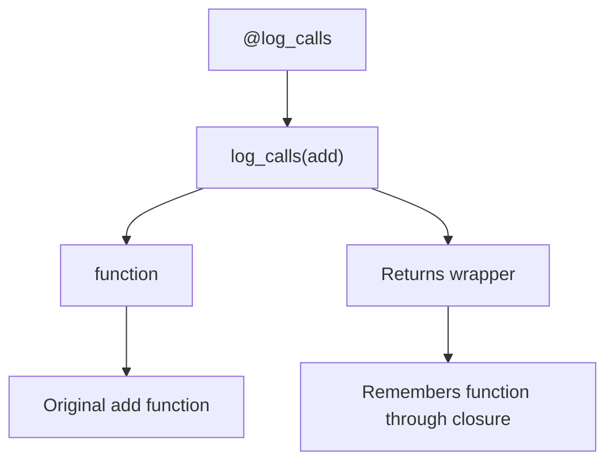

# Closures and Scope (LEGB Rule)

> Python resolves a name by searching available namespaces in a defined order. Closures build on this rule by allowing an inner function to remember variables from its enclosing function even after the outer function has completed.

---

# 1. Core Idea

Consider the following code:

```python
message = "global message"


def outer() -> None:
    message = "enclosing message"

    def inner() -> None:
        message = "local message"
        print(message)

    inner()


outer()
```

Output:

```text
local message
```

The name `message` exists in several scopes. Python uses the nearest available binding, so the local value wins.



Enclosing and global scopes are not searched further.

This nearest-binding behavior is summarized by the **LEGB rule**.

---

# 2. Names, Namespaces, and Scopes

These three terms are closely related but are not identical.

## 2.1 Name

A **name** is an identifier used to refer to an object.

```python
user_count = 10
```

Here:

- `user_count` is a name.
- `10` is an integer object.
- The assignment binds the name `user_count` to that object.

Python variables are better understood as **names bound to objects**, not boxes that permanently contain values.

```text
user_count ─────────► integer object: 10
```

## 2.2 Namespace

A **namespace** is a mapping of names to objects.

Conceptually, it behaves like this:

```python
{
    "user_count": 10,
    "calculate_total": <function object>,
}
```

Common namespaces include:

- A function's local namespace
- An enclosing function's namespace
- A module's global namespace
- The built-in namespace
- A class namespace

You can inspect the current local and global namespaces with:

```python
print(locals())
print(globals())
```

These functions are mainly useful for debugging and introspection. Application code should not usually modify their returned mappings.

## 2.3 Scope

A **scope** is the region of code in which a namespace can be accessed directly.

```python
def process_order() -> None:
    status = "processing"
    print(status)
```

The name `status` belongs to the local scope of `process_order()` and normally cannot be accessed outside that function.

---

# 3. The LEGB Rule

LEGB represents the normal order Python uses to resolve an unqualified name.

```text
┌───────────────────────────────────────────────┐
│ L — Local                                    │
│ Current function or lambda                   │
├───────────────────────────────────────────────┤
│ E — Enclosing                                │
│ Outer functions around the current function  │
├───────────────────────────────────────────────┤
│ G — Global                                   │
│ Current module                               │
├───────────────────────────────────────────────┤
│ B — Built-ins                                │
│ Python's built-in namespace                  │
└───────────────────────────────────────────────┘

Search direction: L → E → G → B
```

Python stops as soon as it finds the name.

## 3.1 Local Scope

A local scope is created when a function is called.

```python
def calculate_price(quantity: int, unit_price: float) -> float:
    subtotal = quantity * unit_price
    return subtotal
```

The following names are local to `calculate_price()`:

- `quantity`
- `unit_price`
- `subtotal`

Each function call receives its own local namespace.

## 3.2 Enclosing Scope

An enclosing scope exists when one function is defined inside another function.

```python
def outer() -> None:
    environment = "production"

    def inner() -> None:
        print(environment)

    inner()


outer()
```

Output:

```text
production
```

`inner()` does not define `environment`, so Python finds it in the nearest enclosing function scope.

Multiple enclosing scopes can exist:

```python
def level_one() -> None:
    value = "level one"

    def level_two() -> None:
        value = "level two"

        def level_three() -> None:
            print(value)

        level_three()

    level_two()


level_one()
```

Output:

```text
level two
```

Python selects the **nearest** enclosing binding.

## 3.3 Global Scope

The global scope is the namespace of the current module.

```python
DEFAULT_TIMEOUT = 30


def get_timeout() -> int:
    return DEFAULT_TIMEOUT
```

`DEFAULT_TIMEOUT` is global to this module.

> `global` does not mean shared automatically across every Python module. It means the global namespace of the module where the function is defined.

A different module must access it through an import:

```python
import settings

print(settings.DEFAULT_TIMEOUT)
```

## 3.4 Built-in Scope

If a name is not found in local, enclosing, or global scope, Python searches its built-in namespace.

```python
numbers = [10, 20, 30]
print(len(numbers))
```

Both `print` and `len` are built-in names.

Avoid shadowing built-ins:

```python
# Avoid this
list = [1, 2, 3]

# Later, this fails because list now refers to an object,
# not the built-in list type.
values = list("abc")
```

Prefer a descriptive name:

```python
items = [1, 2, 3]
values = list("abc")
```

## 3.5 Complete LEGB Example

```python
label = "global"


def outer() -> None:
    label = "enclosing"

    def inner() -> None:
        label = "local"
        print(label)

    inner()


outer()
```

Resolution flow:



---

# 4. How Assignment Changes Scope

A major source of confusion is that Python decides whether many names are local by examining the function body before running it.

If a name is assigned anywhere in a function, Python normally treats that name as local throughout that function unless it is declared `global` or `nonlocal`.

## 4.1 `UnboundLocalError`

```python
counter = 10


def increment() -> None:
    print(counter)
    counter += 1
```

Calling `increment()` raises an error:

```text
UnboundLocalError: cannot access local variable 'counter'
where it is not associated with a value
```

Why?

```text
counter += 1

is effectively:

counter = counter + 1
```

Because the function assigns to `counter`, Python classifies `counter` as local. The earlier `print(counter)` therefore tries to read the local variable before it has received a value.



## 4.2 Mutation Is Different from Rebinding

Mutation changes an existing object. Rebinding makes a name point to another object.

```python
settings = {"debug": False}


def enable_debug() -> None:
    settings["debug"] = True
```

This works without `global` because the function does not rebind `settings`; it mutates the dictionary referenced by the global name.

By contrast:

```python
settings = {"debug": False}


def replace_settings() -> None:
    settings = {"debug": True}
```

This creates a new local `settings` name. It does not replace the global binding.

The same distinction matters inside closures:

```python
from collections.abc import Callable


def create_cart() -> tuple[Callable[[str], None], Callable[[], None]]:
    items: list[str] = []

    def add_item(item: str) -> None:
        items.append(item)  # Mutation: nonlocal is not required.

    def replace_items() -> None:
        nonlocal items
        items = []  # Rebinding: nonlocal is required.

    return add_item, replace_items
```

---

# 5. `global` and `nonlocal`

Both statements change where assignment occurs.

| Statement | Assignment targets | Existing binding required? | Typical use |
|---|---|---:|---|
| `global` | Current module's global namespace | No | Rebind a module-level name |
| `nonlocal` | Nearest enclosing function scope | Yes | Rebind state captured by a closure |

## 5.1 The `global` Statement

```python
request_count = 0


def record_request() -> None:
    global request_count
    request_count += 1
```

Without `global`, the assignment would create a local variable and produce `UnboundLocalError` when reading its previous value.

### Important behavior

```python
def create_value() -> None:
    global generated_value
    generated_value = 100


create_value()
print(generated_value)
```

A `global` declaration can create a binding in the module namespace if one does not already exist.

However, hidden global mutation makes code harder to test and reason about. Prefer explicit state passing, dependency injection, or a small state object when practical.

## 5.2 The `nonlocal` Statement

`nonlocal` allows an inner function to rebind a name in the nearest enclosing function scope.

```python
def create_counter():
    count = 0

    def increment() -> int:
        nonlocal count
        count += 1
        return count

    return increment


counter = create_counter()
print(counter())
print(counter())
print(counter())
```

Output:

```text
1
2
3
```

State flow:



### `nonlocal` requires an enclosing binding

This is invalid:

```python
def outer() -> None:
    def inner() -> None:
        nonlocal missing_name
        missing_name = 10
```

Python raises `SyntaxError` because `missing_name` is not already bound in an enclosing function scope.

### `nonlocal` does not target the module scope

```python
value = 10


def update() -> None:
    # nonlocal value  # Invalid: module scope is global, not nonlocal.
    global value
    value = 20
```

## 5.3 `global` vs `nonlocal` Resolution



---

# 6. What Is a Closure?

A **closure** is a function that retains access to one or more variables from an enclosing function scope after the enclosing function has finished executing.

A closure normally has three elements:

1. An outer function
2. An inner function
3. The inner function references a name from the outer function

```python
def create_multiplier(factor: int):
    def multiply(value: int) -> int:
        return value * factor

    return multiply
```

Create specialized functions:

```python
double = create_multiplier(2)
triple = create_multiplier(3)

print(double(10))
print(triple(10))
```

Output:

```text
20
30
```

Although each call to `create_multiplier()` has completed, the returned inner function still remembers its own `factor`.



## 6.1 Free Variables

In the following function, `factor` is a **free variable** from the perspective of `multiply()`:

```python
def create_multiplier(factor: int):
    def multiply(value: int) -> int:
        return value * factor

    return multiply
```

- `value` is local to `multiply()`.
- `factor` is defined in the enclosing function.
- `multiply()` closes over `factor`.

## 6.2 A Function Is Not Automatically a Closure

This nested function does not capture an enclosing variable:

```python
def outer():
    def inner() -> str:
        return "fixed value"

    return inner
```

`inner()` is nested, but it does not need any state from `outer()`. Therefore, it is not meaningfully acting as a closure over outer state.

---

# 7. How Closures Work Internally

Python stores captured values in closure cells associated with the function object.

```python
def create_multiplier(factor: int):
    def multiply(value: int) -> int:
        return value * factor

    return multiply


double = create_multiplier(2)
```

You can inspect the captured variable names:

```python
print(double.__code__.co_freevars)
```

Output:

```text
('factor',)
```

You can inspect the closure cells:

```python
print(double.__closure__)
print(double.__closure__[0].cell_contents)
```

The cell content is:

```text
2
```

A safer inspection approach uses the standard library:

```python
from inspect import getclosurevars

closure_variables = getclosurevars(double)
print(closure_variables.nonlocals)
```

Output:

```text
{'factor': 2}
```

Conceptually:



Direct access to attributes such as `__closure__` is useful for learning, debugging, frameworks, and tooling. Business logic should not normally depend on these implementation details.

---

# 8. Late Binding in Closures

Closures capture **variables**, not frozen copies of their values. The value is looked up when the closure is called.

This behavior is commonly called **late binding**.

## 8.1 Common Loop Problem

```python
def create_functions():
    functions = []

    for number in range(3):
        functions.append(lambda: number)

    return functions


functions = create_functions()
print([function() for function in functions])
```

A developer might expect:

```text
[0, 1, 2]
```

Actual result:

```text
[2, 2, 2]
```

All lambdas close over the same `number` variable. By the time they run, the loop has completed and `number` contains `2`.



## 8.2 Fix with a Default Argument

Default argument expressions are evaluated when the function is created, so they can snapshot the current loop value.

```python
def create_functions():
    functions = []

    for number in range(3):
        functions.append(lambda number=number: number)

    return functions


functions = create_functions()
print([function() for function in functions])
```

Output:

```text
[0, 1, 2]
```

Here, the right-side `number` is evaluated during each loop iteration and stored as the lambda's default argument.

## 8.3 Fix with a Factory Function

A factory function is often clearer when the callback contains real logic.

```python
from collections.abc import Callable


def create_reader(number: int) -> Callable[[], int]:
    def read_number() -> int:
        return number

    return read_number


def create_functions() -> list[Callable[[], int]]:
    return [create_reader(number) for number in range(3)]
```

Each call to `create_reader()` creates a separate enclosing scope and therefore a separate captured `number`.

## 8.4 Fix with `functools.partial`

For function argument binding, `partial` can express intent directly.

```python
from functools import partial


def identity(value: int) -> int:
    return value


functions = [partial(identity, number) for number in range(3)]
print([function() for function in functions])
```

Use:

- A default argument for short and obvious callbacks
- A factory function for richer closure behavior
- `partial` when pre-filling arguments of an existing function

---

# 9. Practical Closure Patterns

Closures are useful when a small amount of private state or configuration should travel with a function.

## 9.1 Function Factory

```python
from collections.abc import Callable


def create_discount_calculator(
    discount_rate: float,
) -> Callable[[float], float]:
    if not 0 <= discount_rate <= 1:
        raise ValueError("discount_rate must be between 0 and 1")

    def calculate(price: float) -> float:
        return price * (1 - discount_rate)

    return calculate


ten_percent_off = create_discount_calculator(0.10)
twenty_percent_off = create_discount_calculator(0.20)

print(ten_percent_off(100.0))
print(twenty_percent_off(100.0))
```

Each returned function carries its own configuration.

## 9.2 Stateful Counter

```python
from collections.abc import Callable


def create_counter(start: int = 0) -> Callable[[], int]:
    count = start

    def increment() -> int:
        nonlocal count
        count += 1
        return count

    return increment
```

This is useful for small, controlled state. For complex state with many operations, a class is often clearer.

## 9.3 Decorator

Decorators commonly rely on closures.

```python
from collections.abc import Callable
from functools import wraps
from typing import ParamSpec, TypeVar

P = ParamSpec("P")
R = TypeVar("R")


def log_calls(function: Callable[P, R]) -> Callable[P, R]:
    @wraps(function)
    def wrapper(*args: P.args, **kwargs: P.kwargs) -> R:
        print(f"Calling {function.__name__}")
        return function(*args, **kwargs)

    return wrapper


@log_calls
def add(left: int, right: int) -> int:
    return left + right
```

`wrapper()` closes over `function`, which allows it to call the original function later.

Closure structure:



## 9.4 Dependency Configuration

A closure can configure a dependency once and expose a focused function.

```python
from collections.abc import Callable


def create_url_builder(base_url: str) -> Callable[[str], str]:
    normalized_base = base_url.rstrip("/")

    def build(path: str) -> str:
        normalized_path = path.lstrip("/")
        return f"{normalized_base}/{normalized_path}"

    return build


build_api_url = create_url_builder("https://api.example.com/")
print(build_api_url("/users"))
```

Output:

```text
https://api.example.com/users
```

## 9.5 Encapsulated Cache

```python
from collections.abc import Callable


def create_square_calculator() -> Callable[[int], int]:
    cache: dict[int, int] = {}

    def square(number: int) -> int:
        if number not in cache:
            cache[number] = number * number
        return cache[number]

    return square
```

The cache is private to the returned function.

For production caching, prefer established tools such as `functools.cache`, `functools.lru_cache`, or an application-level cache unless custom closure behavior is required.

## 9.6 Independent Closure State

Each outer-function call creates independent state.

```python
counter_a = create_counter()
counter_b = create_counter(100)

print(counter_a())  # 1
print(counter_a())  # 2
print(counter_b())  # 101
print(counter_b())  # 102
```

| Closure | Captured `count` |
|---|---|
| `counter_a` | 2 |
| `counter_b` | 102 |

The state is not shared.

---

# 10. Scope in Comprehensions, Classes, and Exceptions

LEGB is the main mental model, but several Python constructs have scope details worth knowing.

## 10.1 Comprehension Variables

In Python 3, a comprehension's iteration variable has its own scope and does not leak into the surrounding scope.

```python
number = 100
squares = [number * number for number in range(3)]

print(number)
```

Output:

```text
100
```

The comprehension's `number` does not overwrite the outer `number`.

However, lambdas created inside the same comprehension can still demonstrate late binding:

```python
functions = [lambda: number for number in range(3)]
print([function() for function in functions])
```

Output:

```text
[2, 2, 2]
```

Use default argument binding when each function needs its own value:

```python
functions = [lambda number=number: number for number in range(3)]
```

## 10.2 Class Scope Is Special

A class body executes in its own namespace:

```python
class ServiceConfig:
    timeout = 30
    retries = timeout // 10
```

Both expressions execute while the class namespace is being built.

However, a method does not use the class namespace as an enclosing function scope:

```python
class ServiceConfig:
    timeout = 30

    def get_timeout(self) -> int:
        # return timeout  # NameError unless a global name exists.
        return self.timeout
```

Use one of these forms:

```python
return self.timeout
return ServiceConfig.timeout
return type(self).timeout
```

Conceptually:

```text
Method name lookup does not follow:
Local method → class namespace → global

Instead, an unqualified method name follows normal function lookup:
Local method → enclosing function scopes → module global → built-ins

Attribute lookup is explicit:
self.timeout → instance/class attribute lookup
```

This distinction between **name lookup** and **attribute lookup** is important.

## 10.3 Exception Variables Are Cleared

An exception target is cleared after the `except` block to avoid retaining exception-related reference cycles.

```python
try:
    raise ValueError("invalid value")
except ValueError as error:
    print(error)

# print(error)  # NameError
```

Do not depend on the exception variable after the handler. Save only the specific information you need:

```python
message = ""

try:
    raise ValueError("invalid value")
except ValueError as error:
    message = str(error)

print(message)
```

## 10.4 Module Imports and Global Names

Imported names are bindings in the importing module's global namespace.

```python
import math
from pathlib import Path
```

Here, `math` and `Path` are global names in the current module.

Reassigning them shadows the imported objects:

```python
math = "not the math module"
```

Use clear naming and avoid unnecessary rebinding of imported names.

---

# 11. Closures vs Classes

Both closures and callable objects can retain state.

## 11.1 Closure Version

```python
from collections.abc import Callable


def create_counter(start: int = 0) -> Callable[[], int]:
    count = start

    def increment() -> int:
        nonlocal count
        count += 1
        return count

    return increment
```

## 11.2 Class Version

```python
class Counter:
    def __init__(self, start: int = 0) -> None:
        self.count = start

    def __call__(self) -> int:
        self.count += 1
        return self.count
```

## 11.3 Choosing Between Them

| Choose a closure when | Choose a class when |
|---|---|
| State is small | State has several related fields |
| One primary operation is exposed | Multiple public operations are needed |
| Private implementation details are useful | State should be inspectable or configurable |
| A decorator or callback is being built | Inheritance or protocols are useful |
| Function-style composition is natural | Lifecycle and explicit identity matter |

A closure is not automatically better because it is shorter. Prefer the structure that makes state ownership and behavior easiest to understand.

---

# 12. Best Practices

## 12.1 Keep Scope as Narrow as Possible

Prefer local state when data does not need to be shared.

```python
def calculate_invoice_total(lines: list[float]) -> float:
    total = sum(lines)
    return total
```

Narrow scope reduces accidental coupling.

## 12.2 Avoid Unnecessary Global Mutation

Instead of:

```python
processed_count = 0


def process() -> None:
    global processed_count
    processed_count += 1
```

Prefer explicit state where practical:

```python
class ProcessorMetrics:
    def __init__(self) -> None:
        self.processed_count = 0

    def record_processed(self) -> None:
        self.processed_count += 1
```

Global constants are normal and useful. Frequently mutated global state is the main concern.

## 12.3 Use `nonlocal` for Small, Clearly Owned State

A closure counter is easy to understand. A closure managing users, retries, cache invalidation, network sessions, and error history is probably doing too much.

As closure state grows, consider a class or dedicated component.

## 12.4 Avoid Built-in Shadowing

Common built-in names to avoid using as variables include:

```text
list, dict, set, tuple, str, int, id, input, type, sum, min, max
```

Use descriptive alternatives such as `items`, `mapping`, `identifier`, or `total`.

## 12.5 Handle Late Binding Deliberately

When creating callbacks in a loop, decide whether each callback should read:

- The value at function creation time
- The latest value at function call time

Snapshot the value using a default argument, factory function, or `partial` when creation-time binding is intended.

## 12.6 Preserve Decorated Function Metadata

Always consider `functools.wraps` when writing decorators:

```python
from functools import wraps


def decorator(function):
    @wraps(function)
    def wrapper(*args, **kwargs):
        return function(*args, **kwargs)

    return wrapper
```

Without `wraps`, metadata such as `__name__`, `__doc__`, and `__wrapped__` can be lost or obscured.

## 12.7 Prefer Explicit Attribute Access in Methods

Inside methods, use `self.attribute`, `cls.attribute`, or `ClassName.attribute`. Do not expect class-body names to behave like enclosing function variables.

## 12.8 Do Not Overuse Introspection

`locals()`, `globals()`, `__closure__`, and `co_freevars` are useful for learning, debugging, and framework internals. Ordinary application logic should use direct, explicit references instead.

---

# 13. Quick Reference

## 13.1 LEGB Lookup Table

| Scope | Meaning | Example |
|---|---|---|
| Local | Current function's namespace | Parameters and variables assigned in the function |
| Enclosing | Nearest outer function scopes | Variables captured by nested functions |
| Global | Current module namespace | Module constants, imports, module functions |
| Built-ins | Python built-in namespace | `len`, `print`, `range`, `Exception` |

## 13.2 Assignment Rules

| Operation | Declaration usually required? | Reason |
|---|---:|---|
| Read a global name | No | LEGB finds it in global scope |
| Rebind a global name | `global` | Assignment otherwise creates a local binding |
| Read an enclosing name | No | LEGB finds it in enclosing scope |
| Rebind an enclosing name | `nonlocal` | Assignment otherwise creates a local binding |
| Mutate a captured list or dictionary | No | The name is read; the object is mutated |
| Replace a captured list or dictionary | `nonlocal` | The name itself is rebound |

## 13.3 Error Guide

| Error | Typical cause |
|---|---|
| `NameError` | Name is absent from all applicable scopes |
| `UnboundLocalError` | A local name is read before it receives a value |
| `SyntaxError` with `nonlocal` | No matching binding exists in an enclosing function scope |

## 13.4 Closure Checklist

A returned inner function is acting as a closure when:

- It is defined inside another function.
- It references one or more names from an enclosing function scope.
- It continues to use those names after the outer call has returned.

## 13.5 Mental Model

```text
When Python sees a name:

1. Is it assigned in this function?
   └── Usually local unless declared global/nonlocal.

2. When reading the name, search:
   Local → Enclosing → Global → Built-ins

3. If an inner function retains an enclosing variable:
   └── It forms a closure over that variable.

4. Remember:
   Closures capture variables, not automatic snapshots.
```

---

# 14. Key Takeaways

- Python resolves normal unqualified names using **Local → Enclosing → Global → Built-ins**.
- Assignment inside a function normally makes the assigned name local to that function.
- Reading such a local before assigning it raises `UnboundLocalError`.
- `global` redirects assignment to the current module's global namespace.
- `nonlocal` redirects assignment to the nearest matching enclosing function scope.
- A closure allows an inner function to retain access to enclosing variables after the outer function returns.
- Closures capture variable bindings, which explains late binding in loop-created callbacks.
- Use default arguments, factory functions, or `functools.partial` when callbacks need creation-time values.
- Methods should access class or instance state through explicit attributes such as `self.timeout`.
- Use closures for small, focused function state; move to a class when state or behavior becomes more complex.

---

# Official References

- [Python Language Reference — Execution model](https://docs.python.org/3/reference/executionmodel.html)
- [Python Language Reference — `global` and `nonlocal` statements](https://docs.python.org/3/reference/simple_stmts.html#the-global-statement)
- [Python Tutorial — Python scopes and namespaces](https://docs.python.org/3/tutorial/classes.html#python-scopes-and-namespaces)
- [Python Programming FAQ — Local and global variable rules](https://docs.python.org/3/faq/programming.html#what-are-the-rules-for-local-and-global-variables-in-python)
- [Python Programming FAQ — Lambdas defined in a loop](https://docs.python.org/3/faq/programming.html#why-do-lambdas-defined-in-a-loop-with-different-values-all-return-the-same-result)
- [Python Glossary — Closure variables and free variables](https://docs.python.org/3/glossary.html)
