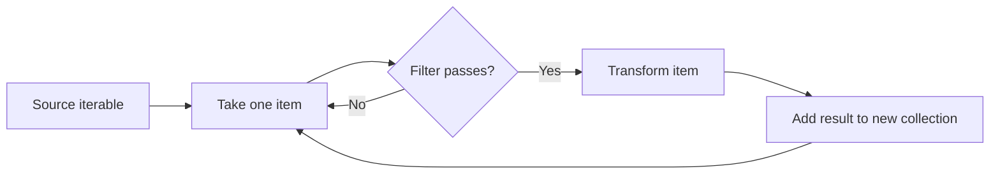
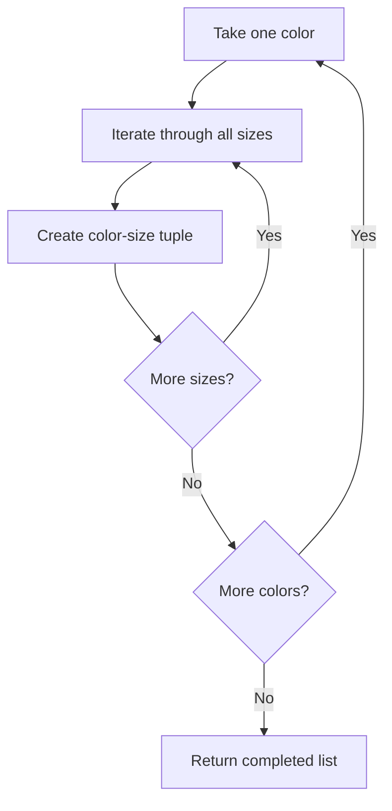
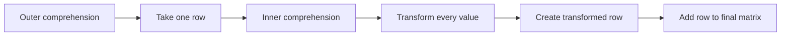
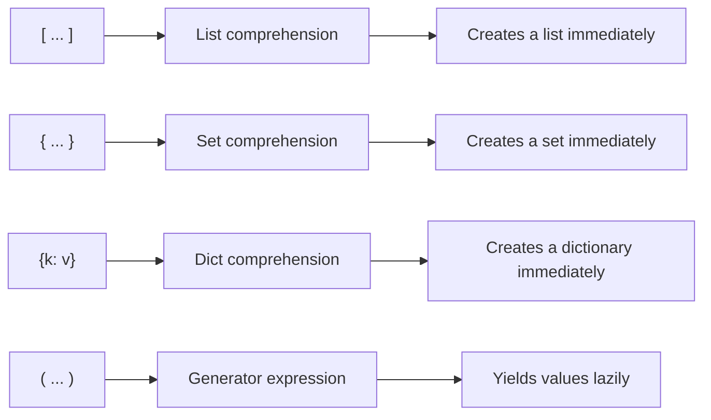
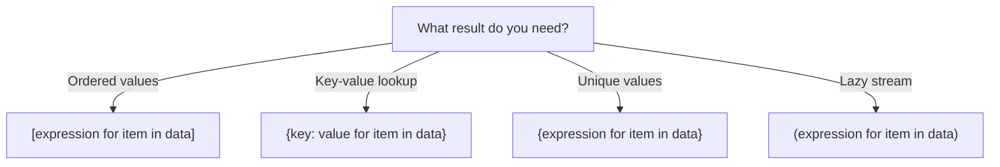

# List, Dictionary, and Set Comprehensions

> Comprehensions are a concise Python syntax for creating a new collection by **transforming**, **filtering**, or **combining** values from one or more iterables.

## In short

- A comprehension builds a new collection from one or more iterables: result expression, iteration, and optional filtering.
- `[...]` produces a list, `{key: value ...}` a dictionary, `{...}` a set, and `(...)` a generator expression that yields lazily.
- A trailing `if` filters input items; an `if ... else ...` placed **before** `for` chooses between output values instead.
- A dictionary cannot hold the same key twice, so a later duplicate key replaces the earlier value.
- Set elements must be hashable, and set order should not be treated as a stable business order.
- Multiple `for` clauses follow the same order as nested loops, and the outermost iterable is evaluated first.
- Comprehension iteration variables do not leak into the surrounding scope.



**Interview answer:** A comprehension creates a new collection in a single expression made of a result expression, an iteration clause, and an optional filter, so a loop whose only job is appending to a fresh collection becomes one readable line. The bracket type decides the result: `[...]` a list, `{...}` a set or dictionary, and `(...)` a generator expression that produces values lazily instead of storing them all. When the logic stops being simple, a named function or a normal loop communicates it better.

**Gotcha:** Confusing the filtering `if` with the conditional expression. `[number for number in numbers if number % 2 == 0]` excludes items that fail, while `[number if number % 2 == 0 else 0 for number in numbers]` produces one output for every input — and that `if ... else ...` form only works **before** the `for`, never after it.

---

# 1. Why Comprehensions Matter

In day-to-day Python development, we often need to:

- Transform every item in a collection.
- Keep only items that satisfy a condition.
- Build a lookup dictionary.
- Remove duplicate transformed values.
- Flatten nested data.
- Convert API or database results into another structure.

A normal loop can perform all these operations. A comprehension expresses the same intent more directly when the logic is simple.

## Normal loop

```python
numbers = [1, 2, 3, 4, 5]

squares = []

for number in numbers:
    squares.append(number**2)

print(squares)
# [1, 4, 9, 16, 25]
```

## List comprehension

```python
numbers = [1, 2, 3, 4, 5]

squares = [number**2 for number in numbers]

print(squares)
# [1, 4, 9, 16, 25]
```

Both versions produce the same result. The comprehension keeps the complete operation in one readable expression.

---

# 2. The Core Mental Model

A comprehension normally contains three conceptual parts: `result expression  +  iteration  +  optional filtering`

## General syntax

```python
[expression for item in iterable if condition]                        # list
{key_expression: value_expression for item in iterable if condition}  # dictionary
{expression for item in iterable if condition}                        # set
```

## How to read a comprehension

Read `[number**2 for number in numbers if number % 2 == 0]` as:

> For every `number` in `numbers`, if the number is even, add its square to the new list.

Equivalent loop:

```python
result = []

for number in numbers:
    if number % 2 == 0:
        result.append(number**2)
```

---

# 3. List Comprehensions

A list comprehension creates a **new list**.

## 3.1 Basic syntax

```python
[expression for item in iterable]
```

Example:

```python
prices = [100, 250, 400]

prices_with_tax = [price * 1.18 for price in prices]

print(prices_with_tax)
# [118.0, 295.0, 472.0]
```

The original list is unchanged: `prices` is still `[100, 250, 400]`.

## 3.2 Calling a function

```python
def normalize_email(email: str) -> str:
    return email.strip().lower()

emails = [" ALICE@example.com ", "Bob@Example.com"]

normalized_emails = [normalize_email(email) for email in emails]

print(normalized_emails)
# ['alice@example.com', 'bob@example.com']
```

Use helper functions when the transformation is too detailed to remain readable inline.

## 3.3 Extracting values from objects

```python
class User:
    def __init__(self, user_id: int, name: str) -> None:
        self.user_id = user_id
        self.name = name

users = [User(1, "Alice"), User(2, "Bob")]

user_names = [user.name for user in users]

print(user_names)
# ['Alice', 'Bob']
```

## 3.4 Extracting values from dictionaries

```python
users = [{"id": 1, "name": "Alice"}, {"id": 2, "name": "Bob"}]

user_ids = [user["id"] for user in users]

print(user_ids)
# [1, 2]
```

For optional keys, use `dict.get()` when an absent key is valid: `nicknames = [user.get("nickname") for user in users]`.

---

# 4. Dictionary Comprehensions

A dictionary comprehension creates a **new dictionary** containing key-value pairs.

## 4.1 Basic syntax

The result expression becomes a `key: value` pair: `{key_expression: value_expression for item in iterable}`

```python
numbers = [1, 2, 3, 4]

square_by_number = {number: number**2 for number in numbers}

print(square_by_number)
# {1: 1, 2: 4, 3: 9, 4: 16}
```

## 4.2 Building a lookup dictionary

This is one of the most common real-world uses.

```python
users = [{"id": 101, "name": "Alice"}, {"id": 102, "name": "Bob"}]

users_by_id = {user["id"]: user for user in users}

print(users_by_id[102])
# {'id': 102, 'name': 'Bob'}
```

Lookup changes from scanning a list to direct dictionary access: `user = users_by_id.get(102)`.

## 4.3 Transforming both keys and values

```python
environment = {"database_host": "localhost", "debug_mode": "true"}

normalized_environment = {
    key.upper(): value.strip()
    for key, value in environment.items()
}

print(normalized_environment)
# {'DATABASE_HOST': 'localhost', 'DEBUG_MODE': 'true'}
```

## 4.4 Reversing a dictionary

```python
status_codes = {"created": 201, "not_found": 404}

status_names = {code: name for name, code in status_codes.items()}

print(status_names)
# {201: 'created', 404: 'not_found'}
```

This is safe only when the original values are unique and hashable.

## 4.5 Duplicate keys

A dictionary cannot hold the same key more than once. If a comprehension produces a duplicate key, the later value replaces the earlier value.

```python
words = ["cat", "car", "dog"]

last_word_by_first_letter = {word[0]: word for word in words}

print(last_word_by_first_letter)
# {'c': 'car', 'd': 'dog'}
```

Both `"cat"` and `"car"` produce the key `"c"`, so `"car"` becomes the final value.

When one key must map to multiple values, use grouping logic instead of a simple dictionary comprehension.

```python
from collections import defaultdict

words_by_first_letter: defaultdict[str, list[str]] = defaultdict(list)

for word in words:
    words_by_first_letter[word[0]].append(word)
```

---

# 5. Set Comprehensions

A set comprehension creates a **new set**.

Sets automatically remove duplicate values.

## 5.1 Basic syntax

Braces with a single result expression instead of a `key: value` pair: `{expression for item in iterable}`

```python
names = ["Alice", "alice", "BOB", "Bob"]

unique_names = {name.lower() for name in names}

print(unique_names)
# {'alice', 'bob'}
```

Set order should not be treated as a stable business order.

## 5.2 Empty set syntax

`empty_value = {}` creates an empty dictionary, and `empty_set = set()` creates an empty set. There is no empty-set literal using braces because `{}` is already dictionary syntax.

## 5.3 Set elements must be hashable

Valid set values include `unique_values = {1, "active", (10, 20)}`.

Mutable values such as lists and dictionaries cannot be set elements:

```python
# Raises TypeError because a list is unhashable
invalid = {[1, 2] for _ in range(3)}
```

---

# 6. Filtering with `if`

An `if` clause placed **after** the `for` filters items.

## 6.1 List filtering

```python
numbers = range(1, 11)

even_numbers = [number for number in numbers if number % 2 == 0]

print(even_numbers)
# [2, 4, 6, 8, 10]
```

## 6.2 Transform and filter together

```python
even_squares = [number**2 for number in numbers if number % 2 == 0]

print(even_squares)
# [4, 16, 36, 64, 100]
```

The filter runs before a value is added to the result.

## 6.3 Dictionary filtering

```python
inventory = {"keyboard": 12, "monitor": 0, "mouse": 8}

available_inventory = {
    product: quantity
    for product, quantity in inventory.items()
    if quantity > 0
}

print(available_inventory)
# {'keyboard': 12, 'mouse': 8}
```

## 6.4 Set filtering

```python
emails = ["alice@example.com", "bob@company.com", "carol@example.com"]

domains = {
    email.split("@", maxsplit=1)[1]
    for email in emails
    if "@" in email
}

print(domains)
# {'example.com', 'company.com'}
```

## 6.5 Multiple filters

Multiple `if` clauses behave like logical `and`.

```python
numbers = range(1, 31)

values = [number for number in numbers if number % 2 == 0 if number % 3 == 0]

print(values)
# [6, 12, 18, 24, 30]
```

Equivalent condition: `[number for number in numbers if number % 2 == 0 and number % 3 == 0]`.

Use whichever form is clearer for the condition.

---

# 7. Conditional Expressions

A conditional expression chooses **which value to produce**. Its syntax is `value_if_true if condition else value_if_false`.

## 7.1 Conditional transformation

```python
numbers = [1, 2, 3, 4, 5]

labels = ["even" if number % 2 == 0 else "odd" for number in numbers]

print(labels)
# ['odd', 'even', 'odd', 'even', 'odd']
```

Notice that the conditional expression appears **before** `for`.

## 7.2 Filtering versus conditional output

```python
# Filtering: items that fail the condition are excluded
[number for number in numbers if number % 2 == 0]
# [2, 4]

# Conditional output: every input item produces an output
[number if number % 2 == 0 else 0 for number in numbers]
# [0, 2, 0, 4, 0]
```

## Position rule

```text
Filter:
expression for item in iterable if condition

Conditional output:
true_value if condition else false_value for item in iterable
```

## 7.3 Practical status mapping

```python
response_times_ms = [120, 950, 2100]

health_labels = [
    "healthy" if duration < 500 else "slow"
    for duration in response_times_ms
]

print(health_labels)
# ['healthy', 'slow', 'slow']
```

For more than two complex branches, use a normal loop or helper function.

---

# 8. Multiple `for` Clauses

A comprehension can iterate through more than one iterable.

## 8.1 Cartesian combinations

```python
colors = ["red", "blue"]
sizes = ["S", "M", "L"]

variants = [(color, size) for color in colors for size in sizes]

print(variants)
# [('red', 'S'), ('red', 'M'), ('red', 'L'), ('blue', 'S'), ('blue', 'M'), ('blue', 'L')]
```

Equivalent loop:

```python
variants = []

for color in colors:
    for size in sizes:
        variants.append((color, size))
```

The order of the `for` clauses matches the order of nested loops.

## Execution diagram



## 8.2 Combining iteration and filtering

```python
numbers = [1, 2, 3, 4]

pairs = [(left, right) for left in numbers for right in numbers if left < right]

print(pairs)
# [(1, 2), (1, 3), (1, 4), (2, 3), (2, 4), (3, 4)]
```

---

# 9. Nested Comprehensions

Nested comprehensions are useful for nested collections, but readability becomes important.

## 9.1 Flattening a list of lists

```python
matrix = [[1, 2, 3], [4, 5, 6]]

flattened = [value for row in matrix for value in row]

print(flattened)
# [1, 2, 3, 4, 5, 6]
```

Read it in the same order as nested loops:

```python
flattened = []

for row in matrix:
    for value in row:
        flattened.append(value)
```

## 9.2 Transforming each nested row

```python
matrix = [[1, 2], [3, 4]]

squared_matrix = [[value**2 for value in row] for row in matrix]

print(squared_matrix)
# [[1, 4], [9, 16]]
```

Here, the outer comprehension creates rows, and the inner comprehension creates values inside each row.

## Structure diagram



## 9.3 Matrix transpose

```python
matrix = [[1, 2, 3], [4, 5, 6]]

transposed = [
    [row[column_index] for row in matrix]
    for column_index in range(len(matrix[0]))
]

print(transposed)
# [[1, 4], [2, 5], [3, 6]]
```

In production code, `zip()` is usually clearer: `transposed = [list(column) for column in zip(*matrix)]`.

## 9.4 Readability limit

This is valid Python:

```python
result = [
    transformed
    for group in groups
    if group.is_active
    for item in group.items
    if item.is_valid
    for transformed in transform(item)
]
```

However, a normal loop may communicate the workflow more clearly.

A useful rule:

> If a comprehension needs careful decoding, it is no longer improving the code.

---

# 10. Practical Development Examples

# 10.1 Build an ID-based lookup

```python
products = [{"id": "P-101", "name": "Keyboard"}, {"id": "P-102", "name": "Mouse"}]

products_by_id = {product["id"]: product for product in products}

# Usage
product = products_by_id.get("P-102")
```

# 10.2 Remove duplicate tags

```python
articles = [{"tags": ["python", "backend"]}, {"tags": ["api", "python"]}]

unique_tags = {tag for article in articles for tag in article["tags"]}

print(unique_tags)
# {'python', 'backend', 'api'}
```

# 10.3 Grouping is usually not a comprehension task

Suppose orders must be grouped by customer:

```python
orders = [
    {"customer_id": 1, "id": "O-1"},
    {"customer_id": 2, "id": "O-2"},
    {"customer_id": 1, "id": "O-3"},
]
```

A regular loop is clearer:

```python
from collections import defaultdict

orders_by_customer: defaultdict[int, list[dict[str, object]]] = defaultdict(list)

for order in orders:
    customer_id = int(order["customer_id"])
    orders_by_customer[customer_id].append(order)
```

A comprehension is best for producing one result per iteration. Stateful accumulation or grouping often needs a loop.

---

# 11. Scope and Evaluation Behavior

## 11.1 Comprehension variables do not leak

In modern Python, the iteration variable belongs to the comprehension's own logical scope.

```python
number = 100

squares = [number**2 for number in range(3)]

print(number)
# 100
```

The outer `number` remains unchanged.

The comprehension variable is also unavailable afterward when no outer variable exists:

```python
values = [item * 2 for item in range(3)]

# NameError: name 'item' is not defined
print(item)
```

Python 3.12 and later inline list, dictionary, and set comprehensions as a CPython optimization, but their iteration variables remain isolated from the surrounding scope.

## 11.2 The outermost iterable is evaluated first

In a comprehension such as `[result(item) for item in get_items()]`, `get_items()` is evaluated before iteration begins.

This matters when the iterable expression has side effects or can raise an exception.

## 11.3 Expressions may have side effects, but avoid them

Technically possible:

```python
logs: list[str] = []

result = [logs.append(str(number)) for number in range(3)]

# list.append() returns None
print(result)
# [None, None, None]
```

A normal loop is clearer:

```python
logs = []

for number in range(3):
    logs.append(str(number))
```

Use comprehensions to **construct values**, not merely to execute side effects.

## 11.4 Dictionary key and value evaluation

A dictionary comprehension evaluates the key and value expressions for every produced entry, as in `mapping = {item.key(): item.value() for item in items}`.

Avoid calling the same expensive function multiple times:

```python
# Repeats normalize(user) twice
mapping = {
    normalize(user).id: normalize(user)
    for user in users
}
```

Prefer a loop:

```python
mapping = {}

for user in users:
    normalized_user = normalize(user)
    mapping[normalized_user.id] = normalized_user
```

Or introduce a suitable helper that returns both the key and value.

---

# 12. Comprehensions vs Generator Expressions

A list comprehension creates all values immediately.

```python
squares = [number**2 for number in range(1_000_000)]
```

A generator expression produces values lazily: `squares = (number**2 for number in range(1_000_000))`

The bracket type changes the behavior:



## Example

```python
total = sum(
    number**2
    for number in range(1_000_000)
)
```

`sum()` consumes the generator without first storing a million squared values in a list.

## Comparison

| Feature | List comprehension | Generator expression |
|---|---|---|
| Syntax | `[expression for ...]` | `(expression for ...)` |
| Evaluation | Immediate | Lazy |
| Stores all values | Yes | No |
| Reusable | Yes | Usually consumed once |
| Indexing | Supported | Not supported |
| Best for | Final list needed | Streaming or aggregation |

## Choosing between them

Use a comprehension when the completed collection is required: `usernames = [user.username for user in users]`

Use a generator expression when another operation can consume values one at a time:

```python
has_inactive_user = any(
    not user.is_active
    for user in users
)
```

```python
total_amount = sum(
    order.amount
    for order in orders
)
```

```python
first_match = next(
    (
        user
        for user in users
        if user.email == target_email
    ),
    None,
)
```

---

# 13. Performance and Memory

## 13.1 Comprehensions are commonly efficient

For straightforward transformations and filters, comprehensions such as `squares = [number**2 for number in numbers]` are usually compact and efficient because the looping and collection construction follow an optimized language pattern.

However, performance should not be the only reason to use one. Readability matters more in most application code.

## 13.2 Python 3.12+ comprehension inlining

Starting with Python 3.12, CPython inlines list, dictionary, and set comprehensions instead of creating a separate temporary function object for each execution.

Important practical effects:

- Comprehension variables remain isolated.
- Tracebacks no longer show a separate comprehension frame in the same way.
- Some comprehensions execute faster than in earlier CPython versions.

This is an implementation improvement, not a reason to compress complex business logic into one expression.

## 13.3 Time complexity

A simple comprehension that processes `n` items, such as `[value * 2 for value in values]`, is generally: `Time: O(n)`

A comprehension with two independent nested loops of sizes `n` and `m`, such as `[(left, right) for left in left_values for right in right_values]`, is generally: `Time: O(n × m)`

The syntax is short, but the amount of work is still potentially large.

## 13.4 Memory complexity

List, dictionary, and set comprehensions materialize their complete results.

```text
Additional memory: usually O(number of produced elements)
```

For large datasets, consider a generator expression or iterator pipeline.

```python
processed_items = (
    transform(item)
    for item in large_source
    if is_valid(item)
)
```

## 13.5 Avoid hidden repeated work

Less efficient:

```python
normalized = [
    expensive_transform(item)
    for item in items
    if expensive_transform(item).is_valid
]
```

`expensive_transform(item)` may run twice for accepted items.

Clearer and more efficient:

```python
normalized = []

for item in items:
    transformed = expensive_transform(item)

    if transformed.is_valid:
        normalized.append(transformed)
```

Modern Python also supports assignment expressions, but use them only when they remain readable:

```python
normalized = [
    transformed
    for item in items
    if (transformed := expensive_transform(item)).is_valid
]
```

The loop is often easier for a team to maintain.

---

# 14. Readability and Best Practices

## 14.1 Use comprehensions for simple transformations

Good:

```python
active_user_ids = [
    user.id
    for user in users
    if user.is_active
]
```

The input, condition, and output are immediately visible.

## 14.2 Break long comprehensions across lines

Prefer:

```python
normalized_emails = [
    user.email.strip().lower()
    for user in users
    if user.email
]
```

Instead of `normalized_emails = [user.email.strip().lower() for user in users if user.email]`.

Both are valid, but the multiline form is easier to scan when expressions are not trivial.

## 14.3 Extract complex logic into named functions

Hard to read:

```python
eligible_users = [
    user
    for user in users
    if user.is_active
    and user.age >= 18
    and not user.is_blocked
    and user.country in supported_countries
]
```

Better when this rule is reused or represents business meaning:

```python
def is_eligible_user(user: User) -> bool:
    return (
        user.is_active
        and user.age >= 18
        and not user.is_blocked
        and user.country in supported_countries
    )

eligible_users = [
    user
    for user in users
    if is_eligible_user(user)
]
```

The function name explains **why** the filter exists.

## 14.4 Avoid comprehensions for side effects

Avoid `[send_email(user) for user in users]`, which creates an unnecessary list of return values.

Use:

```python
for user in users:
    send_email(user)
```

## 14.5 Avoid excessive nesting

Potentially difficult:

```python
result = [
    [
        transform(value)
        for value in row
        if is_valid(value)
    ]
    for row in matrix
    if row
]
```

This may still be acceptable, but once more conditions or calls are added, use loops or helper functions.

## 14.6 Choose the output collection intentionally

Do not automatically use a list.

Use a:

- **List** when order and duplicates matter.
- **Dictionary** when values should be accessed by a unique key.
- **Set** when uniqueness and membership checks matter.
- **Generator expression** when values can be consumed lazily.

## 14.7 Do not rely on a set for presentation order

A set such as `{name.lower() for name in names}` is appropriate for uniqueness and fast membership checks. Convert or sort explicitly when output order matters:

```python
sorted_unique_names = sorted({
    name.lower()
    for name in names
})
```

## 14.8 Be careful with dictionary collisions

```python
users_by_email = {
    user.email.lower(): user
    for user in users
}
```

If two users normalize to the same email, one will replace the other. Confirm that the key is truly unique or detect collisions explicitly.

## 14.9 Prefer explicit code around exceptions

Comprehensions do not provide a clean place for `try`/`except`.

Instead of forcing exception logic into helper calls:

```python
parsed_values = []

for raw_value in raw_values:
    try:
        parsed_values.append(int(raw_value))
    except ValueError:
        continue
```

This clearly expresses expected failure handling.

---

# 15. Quick Comparison

| Type | Syntax | Produces | Duplicates | Key access | Common use |
|---|---|---|---|---|---|
| List comprehension | `[expr for item in data]` | `list` | Preserved | By numeric index | Ordered transformations |
| Dictionary comprehension | `{key: value for item in data}` | `dict` | Duplicate keys overwrite | By key | Lookup tables and mappings |
| Set comprehension | `{expr for item in data}` | `set` | Removed | No indexing | Unique values and membership |
| Generator expression | `(expr for item in data)` | Generator | Produced as encountered | No indexing | Lazy processing and aggregation |

## Clause rules

- A trailing `if` filters input items.
- An `if ... else ...` before `for` chooses between output values.
- Multiple `for` clauses follow the same order as nested loops.
- Comprehension iteration variables do not leak into the surrounding scope.

## Syntax map



## Equivalent forms

### List

```python
result = [transform(item) for item in items]
```

```python
result = []

for item in items:
    result.append(transform(item))
```

### Dictionary

```python
result = {item.id: item for item in items}
```

```python
result = {}

for item in items:
    result[item.id] = item
```

### Set

```python
result = {normalize(item) for item in items}
```

```python
result = set()

for item in items:
    result.add(normalize(item))
```

---

# References

- [Python 3.14 Expressions — list, set, and dictionary displays](https://docs.python.org/3/reference/expressions.html#displays-for-lists-sets-and-dictionaries)
- [Python Tutorial — Data Structures and List Comprehensions](https://docs.python.org/3/tutorial/datastructures.html#list-comprehensions)
- [Python Functional Programming HOWTO — Generator Expressions and List Comprehensions](https://docs.python.org/3/howto/functional.html#generator-expressions-and-list-comprehensions)
- [What’s New in Python 3.12 — PEP 709 Comprehension Inlining](https://docs.python.org/3/whatsnew/3.12.html#pep-709-comprehension-inlining)
- [Python 3.14.6 Release](https://www.python.org/downloads/release/python-3146/)
