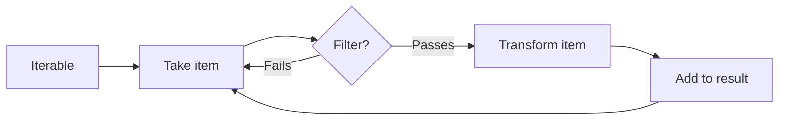
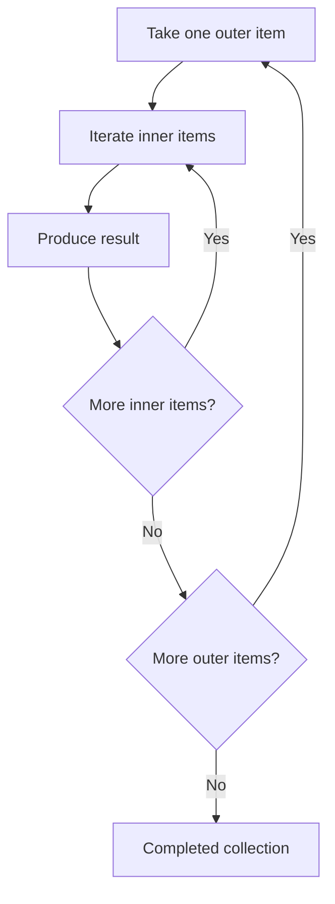
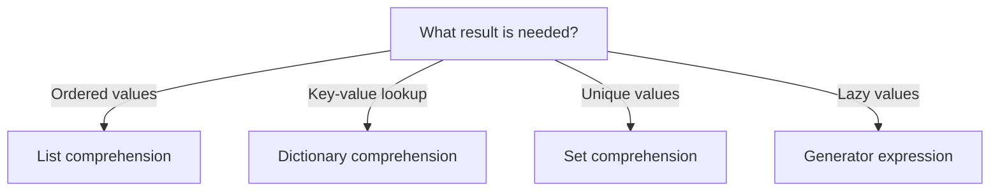

# List, Dictionary, and Set Comprehensions

> A **comprehension** is a compact Python syntax for building a new collection by transforming, filtering, or combining values from one or more iterables.

Comprehensions are common in normal Python development because they make simple collection-processing code shorter without hiding its intent.

> **Version note:** This topic is aligned with Python **3.14.7**, the current stable Python release as of August 18, 2026. Python 3.15 is still in release-candidate stage. The core comprehension syntax remains unchanged.

## In Short

- `[expression for item in data]` creates a **list**.
- `{key: value for item in data}` creates a **dictionary**.
- `{expression for item in data}` creates a **set**.
- `(expression for item in data)` creates a **generator expression** and evaluates values lazily.
- A trailing `if` **filters items**.
- `value_if_true if condition else value_if_false` **chooses the output value** and appears before `for`.
- Multiple `for` clauses behave like nested loops from left to right.
- Comprehension loop variables do not leak into the surrounding scope.
- Prefer a normal loop when the logic becomes difficult to read.



---

# 1. Core Mental Model

A comprehension normally contains three parts:

```text
output expression + iteration + optional filtering
```

## Basic Syntax

```python
# List
[expression for item in iterable if condition]

# Dictionary
{key_expression: value_expression for item in iterable if condition}

# Set
{expression for item in iterable if condition}
```

Read this:

```python
[number ** 2 for number in numbers if number % 2 == 0]
```

as:

> For each `number` in `numbers`, keep it if it is even, then add its square to the new list.

The equivalent normal loop is:

```python
result = []

for number in numbers:
    if number % 2 == 0:
        result.append(number ** 2)
```

The comprehension is useful because the **input, condition, and output** are visible together.

---

# 2. List Comprehensions

A list comprehension creates a **new list** and preserves the order in which values are produced.

## Basic Transformation

```python
prices = [100, 250, 400]

prices_with_tax = [price * 1.18 for price in prices]

print(prices_with_tax)
# [118.0, 295.0, 472.0]
```

The original `prices` list is unchanged.

## Filtering

Place `if` after the `for` when an item should be included only if it satisfies a condition.

```python
numbers = range(1, 11)

even_numbers = [
    number
    for number in numbers
    if number % 2 == 0
]

# [2, 4, 6, 8, 10]
```

This is one of the most common comprehension patterns in application code.

---

# 3. Dictionary Comprehensions

A dictionary comprehension builds a new dictionary from `key: value` expressions.

## Building a Lookup

```python
users = [
    {"id": 101, "name": "Alice"},
    {"id": 102, "name": "Bob"},
]

users_by_id = {
    user["id"]: user
    for user in users
}

print(users_by_id[102])
# {'id': 102, 'name': 'Bob'}
```

This pattern is frequently used to turn API or database results into an ID-based lookup.

## Duplicate Keys

Dictionary keys must be unique. If multiple generated entries use the same key, the later value replaces the earlier one.

```python
words = ["cat", "car", "dog"]

last_word_by_letter = {
    word[0]: word
    for word in words
}

# {'c': 'car', 'd': 'dog'}
```

If one key needs to hold multiple values, use explicit grouping logic such as `defaultdict(list)` instead of forcing it into a dictionary comprehension.

---

# 4. Set Comprehensions

A set comprehension creates a new **set**, which is useful when uniqueness matters.

```python
names = ["Alice", "alice", "BOB", "Bob"]

unique_names = {
    name.lower()
    for name in names
}

# {'alice', 'bob'}
```

## Important Set Rules

- Duplicate values are removed automatically.
- Set elements must be **hashable**.
- Lists and dictionaries cannot be set elements because they are mutable and unhashable.
- Do not rely on set iteration order for business or presentation logic.
- `{}` creates an empty dictionary; use `set()` for an empty set.

---

# 5. Filtering vs Conditional Output

This distinction is especially important because both forms use `if`, but they do different jobs.

## Filter Items

A trailing `if` decides **whether an item is included**.

```python
numbers = [1, 2, 3, 4, 5]

even_numbers = [
    number
    for number in numbers
    if number % 2 == 0
]

# [2, 4]
```

## Choose the Output Value

An `if ... else ...` expression before `for` decides **what value to produce** for every input item.

```python
labels = [
    "even" if number % 2 == 0 else "odd"
    for number in numbers
]

# ['odd', 'even', 'odd', 'even', 'odd']
```

### Position Rule

```text
Filtering:
expression for item in iterable if condition

Conditional output:
true_value if condition else false_value for item in iterable
```

A trailing filter can omit items. A conditional expression produces an output for every iterated item.

---

# 6. Multiple `for` Clauses and Nested Data

Multiple `for` clauses behave exactly like nested loops in the same left-to-right order.

## Flattening Nested Data

```python
matrix = [[1, 2, 3], [4, 5, 6]]

flattened = [
    value
    for row in matrix
    for value in row
]

# [1, 2, 3, 4, 5, 6]
```

Equivalent loop:

```python
flattened = []

for row in matrix:
    for value in row:
        flattened.append(value)
```

## Execution Model



Nested comprehensions are fine when the structure remains obvious. If several loops, conditions, or transformations must be mentally decoded, a normal loop is usually clearer.

---

# 7. One Practical Development Example

Suppose an API returns users:

```python
users = [
    {
        "id": 101,
        "name": "Alice",
        "email": " Alice@Example.com ",
        "active": True,
        "roles": ["admin", "editor"],
    },
    {
        "id": 102,
        "name": "Bob",
        "email": "bob@company.com",
        "active": False,
        "roles": ["viewer"],
    },
    {
        "id": 103,
        "name": "Carol",
        "email": "carol@example.com",
        "active": True,
        "roles": ["editor"],
    },
]
```

## List: Select Active User Names

```python
active_names = [
    user["name"]
    for user in users
    if user["active"]
]

# ['Alice', 'Carol']
```

## Dictionary: Build an ID Lookup

```python
users_by_id = {
    user["id"]: user
    for user in users
}
```

Now a user can be accessed directly:

```python
user = users_by_id.get(103)
```

## Set: Collect Unique Roles

```python
unique_roles = {
    role
    for user in users
    for role in user["roles"]
}

# {'admin', 'editor', 'viewer'}
```

## Conditional Output: Build Status Labels

```python
statuses = [
    "active" if user["active"] else "inactive"
    for user in users
]

# ['active', 'inactive', 'active']
```

This example covers the patterns most often seen in backend services: **filtering results, building lookups, deduplicating values, flattening nested data, and mapping values into another representation**.

---

# 8. Comprehensions vs Generator Expressions

A list, set, or dictionary comprehension materializes its result immediately.

```python
squares = [number ** 2 for number in range(1_000_000)]
```

A generator expression produces values lazily:

```python
squares = (number ** 2 for number in range(1_000_000))
```

This is useful when another operation can consume values one at a time.

```python
has_inactive_user = any(
    not user["active"]
    for user in users
)
```

## Comparison

| Feature | Comprehension | Generator expression |
|---|---|---|
| Example | `[x * 2 for x in data]` | `(x * 2 for x in data)` |
| Evaluation | Immediate | Lazy |
| Stores all results | Yes | No |
| Indexing | Depends on collection | No |
| Typical use | Final collection is required | Streaming, `sum()`, `any()`, `all()`, `next()` |

Use a generator expression when you do not need the complete collection in memory.

---

# 9. Scope and Evaluation Behavior

## Comprehension Variables Do Not Leak

The iteration variable belongs to the comprehension's own scope.

```python
number = 100

squares = [number ** 2 for number in range(3)]

print(number)
# 100
```

If there is no outer `number`, the comprehension's loop variable is not available afterward.

## Leftmost Iterable Is Evaluated First

In:

```python
[result(item) for item in get_items()]
```

`get_items()` is evaluated before comprehension iteration begins. Later loops and filters are evaluated as their dependent values become available.

This behavior matters mainly when the iterable expression has side effects or can raise an exception.

## Python 3.12+ Implementation Note

Since Python 3.12, CPython implements list, set, and dictionary comprehensions using **PEP 709 comprehension inlining**. This reduces comprehension execution overhead while preserving the isolated behavior of comprehension variables.

For normal development, treat this as a performance implementation detail rather than a reason to write more complex comprehensions.

---

# 10. Performance and Readability

## Time Complexity

A simple comprehension processing `n` values is generally:

```text
O(n)
```

Two independent nested loops of sizes `n` and `m` are generally:

```text
O(n × m)
```

Short syntax does not reduce the amount of underlying work.

## Memory

List, dictionary, and set comprehensions materialize their output, so additional memory is generally proportional to the number of produced elements.

For large streams of data, prefer a generator expression when possible.

## Avoid Repeated Expensive Work

Avoid this pattern:

```python
normalized = [
    expensive_transform(item)
    for item in items
    if expensive_transform(item).is_valid
]
```

`expensive_transform()` can run twice for accepted items.

A normal loop is clearer:

```python
normalized = []

for item in items:
    transformed = expensive_transform(item)

    if transformed.is_valid:
        normalized.append(transformed)
```

---

# 11. Best Practices

## Use Comprehensions When the Intent Is Simple

Good:

```python
active_user_ids = [
    user["id"]
    for user in users
    if user["active"]
]
```

The transformation and condition are immediately visible.

## Extract Business Logic into a Function

When a condition represents meaningful business logic, name it instead of placing several rules inline.

```python
def is_eligible(user: User) -> bool:
    return (
        user.is_active
        and user.age >= 18
        and not user.is_blocked
    )

eligible_users = [
    user
    for user in users
    if is_eligible(user)
]
```

## Do Not Use Comprehensions Only for Side Effects

Avoid:

```python
[send_email(user) for user in users]
```

Use a normal loop:

```python
for user in users:
    send_email(user)
```

A comprehension should normally **construct a value**, not just execute actions.

## Prefer Explicit Code for Exceptions or Stateful Grouping

Comprehensions are not a good fit when the workflow needs:

- `try` / `except`
- multiple state updates
- logging at several steps
- grouping several values under the same key
- complex branching

In these cases, a normal loop usually communicates the intent better.

---

# 12. Quick Reference

| Type | Syntax | Main purpose |
|---|---|---|
| List comprehension | `[expr for item in data]` | Ordered transformed values |
| Dictionary comprehension | `{key: value for item in data}` | Lookup or mapping |
| Set comprehension | `{expr for item in data}` | Unique values |
| Generator expression | `(expr for item in data)` | Lazy processing |

## Key Rules to Remember

```text
Transform:
[transform(item) for item in items]

Filter:
[item for item in items if condition]

Transform + filter:
[transform(item) for item in items if condition]

Conditional output:
[value_a if condition else value_b for item in items]

Nested iteration:
[result for outer in outer_items for inner in inner_items]
```



The main engineering rule is simple:

> **Use a comprehension when it makes the transformation easier to understand. Use a normal loop when the comprehension makes the reader decode the code.**

---

# References

- [Python 3.14.7 Expression Reference — Comprehensions](https://docs.python.org/3/reference/expressions.html#displays-for-lists-sets-and-dictionaries)
- [Python Tutorial — List Comprehensions](https://docs.python.org/3/tutorial/datastructures.html#list-comprehensions)
- [Python Functional Programming HOWTO — Generator Expressions](https://docs.python.org/3/howto/functional.html#generator-expressions-and-list-comprehensions)
- [Python 3.12 — PEP 709 Comprehension Inlining](https://docs.python.org/3/whatsnew/3.12.html#pep-709-comprehension-inlining)
- [Python Downloads — Current Stable Release](https://www.python.org/downloads/)
