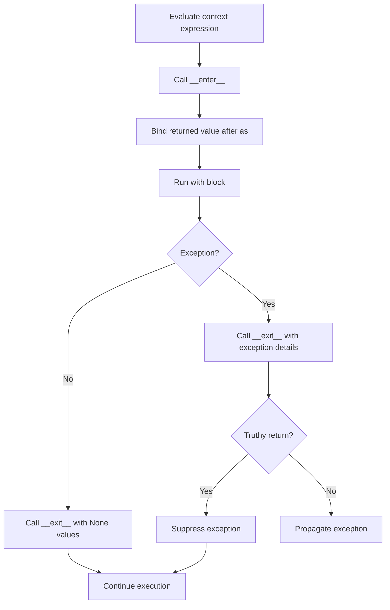
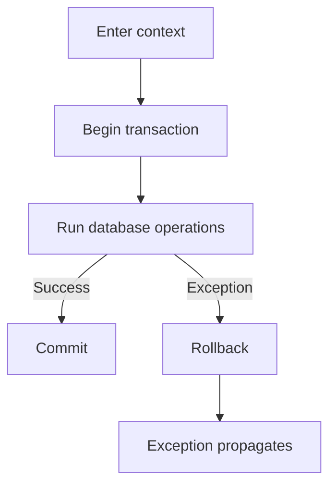

# Python Context Managers: `with`, `__enter__()`, and `__exit__()`

> A **context manager** controls what happens when a block starts and when it finishes. Its main purpose is to make resource setup and cleanup reliable, even when an exception occurs.

## In short

- `with` is Python's standard way to manage a resource or temporary runtime state.
- `__enter__()` runs before the `with` block and its return value becomes the value after `as`.
- `__exit__()` runs when the block finishes and receives exception information when the block fails.
- Returning a truthy value from `__exit__()` suppresses the exception; returning `False` or `None` lets it propagate.
- If `__enter__()` finishes successfully, Python guarantees that `__exit__()` is called when the context is left.
- `@contextmanager` is usually the simplest choice for small setup/cleanup logic.
- `ExitStack` is useful when the number of managed resources is dynamic.
- `async with` uses `__aenter__()` and `__aexit__()` when setup or cleanup needs `await`.



---

# 1. Why Context Managers Exist

Many operations follow the same lifecycle:

```text
Acquire or configure resource
        ↓
Run application logic
        ↓
Release, restore, or clean up
```

Common development use cases include:

- Files and streams
- Database connections and transactions
- Thread or process locks
- HTTP client sessions
- Temporary files and directories
- Tracing and timing scopes
- Temporarily changing application state

Without a context manager, this normally requires `try` / `finally` so cleanup cannot be skipped.

The `with` statement packages that pattern into a reusable and readable API.

---

# 2. How the `with` Statement Works

Basic syntax:

```python
with context_expression as value:
    # Work inside the managed context
    ...
```

The lifecycle is approximately:

```text
1. Evaluate context_expression
2. Call __enter__()
3. Assign its result to value
4. Execute the block
5. Call __exit__()
```

## 2.1 `__enter__()`

`__enter__()` prepares the context.

It may:

- Acquire a resource
- Start a transaction
- Acquire a lock
- Save existing state
- Start timing or tracing

Its return value is assigned to the target after `as`.

```python
def __enter__(self):
    return managed_resource
```

The method may return `self`, the underlying resource, or another useful value.

## 2.2 `__exit__()`

`__exit__()` performs cleanup when the block is left.

```python
def __exit__(self, exc_type, exc_value, traceback):
    ...
```

When the block succeeds:

```text
exc_type     = None
exc_value    = None
traceback    = None
```

When the block raises an exception, those arguments describe the exception.

The return value is important:

| `__exit__()` result | Behavior |
|---|---|
| `False` / `None` | Exception continues normally |
| Truthy value | Exception is suppressed |

For most application code, returning `False` or `None` is the safest default.

## 2.3 Important guarantee

If `__enter__()` completes successfully, Python guarantees that `__exit__()` is called when the context is left, including when the body exits through an exception, `return`, `break`, or `continue`.

If `__enter__()` itself fails, that manager's `__exit__()` is not called because the context was never entered successfully.

---

# 3. Practical Example: Database Transaction Context

A database transaction is a good real-world example because it needs different cleanup behavior for success and failure.

```python
from types import TracebackType


class Transaction:
    def __init__(self, connection) -> None:
        self.connection = connection

    def __enter__(self):
        self.connection.begin()
        return self.connection

    def __exit__(
        self,
        exc_type: type[BaseException] | None,
        exc_value: BaseException | None,
        traceback: TracebackType | None,
    ) -> bool:
        if exc_type is None:
            self.connection.commit()
        else:
            self.connection.rollback()

        return False
```

Usage:

```python
with Transaction(connection) as db:
    db.execute("UPDATE accounts SET balance = balance - 100 WHERE id = 1")
    db.execute("UPDATE accounts SET balance = balance + 100 WHERE id = 2")
```

### What happens



The important design point is that transaction ownership is centralized. Callers do not need to remember to commit, roll back, and clean up correctly in every code path.

---

# 4. Exception Handling and Suppression

A context manager can inspect exceptions raised inside its block.

This enables behavior such as:

- Roll back a failed transaction
- Log a failed operation
- Translate a low-level exception into a domain exception
- Suppress a narrowly defined expected exception

The critical rule is:

```text
truthy __exit__ return  → suppress exception
falsy __exit__ return   → propagate exception
```

Avoid returning `True` unconditionally. It can hide real bugs such as `TypeError`, `KeyError`, `AttributeError`, and unexpected runtime failures.

When suppression is genuinely intended, keep it narrow. The standard library also provides `contextlib.suppress()` for this purpose.

---

# 5. `@contextmanager`

For small setup/cleanup logic, creating a full class is often unnecessary.

`contextlib.contextmanager` converts a generator function into a context manager.

```python
from contextlib import contextmanager


@contextmanager
def managed_resource():
    resource = acquire_resource()
    try:
        yield resource
    finally:
        release_resource(resource)
```

Think of it as:

```text
Code before yield  → enter/setup
Yielded value       → value after as
Code after yield    → exit/cleanup
```

The generator must yield exactly once.

If the `with` block raises an exception, that exception is raised back at the `yield` point. If you catch it only to log or inspect it, re-raise it unless suppression is intentionally part of the API.

## Class or `@contextmanager`?

| Use a class when... | Use `@contextmanager` when... |
|---|---|
| The manager has meaningful state | Logic is mainly setup + cleanup |
| Extra public methods are needed | The context is small and local |
| Lifecycle logic is complex | A separate class adds unnecessary boilerplate |
| Inheritance is useful | Local variables are enough for state |

---

# 6. Multiple and Dynamic Context Managers

## Multiple managers

Python can manage several contexts in one statement:

```python
with (
    first_resource() as first,
    second_resource() as second,
):
    process(first, second)
```

They are entered left to right and exited right to left.

```text
Enter A
  Enter B
    Run body
  Exit B
Exit A
```

This reverse cleanup order is useful when later resources depend on earlier ones.

## `ExitStack`

Use `contextlib.ExitStack` when the number of resources is not known until runtime or some contexts are optional.

```python
from contextlib import ExitStack

with ExitStack() as stack:
    resources = [
        stack.enter_context(resource)
        for resource in dynamic_resources
    ]
    process(resources)
```

Registered cleanup operations are executed in reverse order, just like nested `with` statements.

---

# 7. Asynchronous Context Managers

Use `async with` when entering or leaving a context requires asynchronous I/O.

The protocol uses:

```python
async def __aenter__(self):
    ...

async def __aexit__(self, exc_type, exc_value, traceback):
    ...
```

Typical uses include:

- Async database sessions or transactions
- Async HTTP clients
- Async locks
- Async streams

Generator-style async contexts can be created with `@asynccontextmanager`.

```python
from contextlib import asynccontextmanager


@asynccontextmanager
async def managed_connection(pool):
    connection = await pool.acquire()
    try:
        yield connection
    finally:
        await pool.release(connection)
```

If cleanup needs `await`, prefer an asynchronous context manager instead of performing blocking cleanup inside `__exit__()`.

---

# 8. Useful `contextlib` Tools

These utilities cover most common cases without writing a custom manager.

| Utility | Typical use |
|---|---|
| `contextmanager` | Build a context manager from a generator |
| `asynccontextmanager` | Async generator-based context manager |
| `suppress()` | Ignore specific expected exceptions |
| `nullcontext()` | Optional/no-op context |
| `closing()` | Call `close()` on objects without context-manager support |
| `ExitStack` | Dynamic synchronous resources |
| `AsyncExitStack` | Dynamic synchronous + asynchronous resources |

Prefer an existing context manager or `contextlib` helper before creating custom lifecycle code.

---

# 9. Development Best Practices

## Keep ownership clear

The code that creates or acquires a resource should normally define who is responsible for releasing it. Avoid unexpectedly closing resources supplied by callers.

## Keep managed scopes small

Hold locks, connections, and transactions only for the code that actually needs them. Smaller scopes reduce contention and resource usage.

## Make `__enter__()` failure-safe

If `__enter__()` acquires several resources and a later acquisition fails, clean up earlier resources inside `__enter__()` itself. Python will not call that manager's `__exit__()` after a failed `__enter__()`.

`ExitStack` is especially useful for this kind of multi-step acquisition.

## Avoid broad exception suppression

Treat suppression as part of the public contract of the context manager. Most managers should allow unexpected exceptions to propagate.

## Prefer deterministic cleanup

Do not rely on garbage collection to release important external resources such as files, sockets, locks, or database connections. Use `with`, explicit closing, or another deterministic lifecycle mechanism.

---

# 10. What to Remember for Interviews

A context manager is Python's reusable abstraction for **setup → use → cleanup**.

The key points are:

```text
with
 ├── calls __enter__()
 ├── uses its return value after "as"
 ├── executes the block
 └── calls __exit__()
       ├── success   → receives None, None, None
       └── exception → receives exception details
```

Remember these distinctions:

- `__enter__()` prepares the context and provides the managed value.
- `__exit__()` performs cleanup and controls exception suppression.
- `@contextmanager` is ideal for simple generator-based lifecycle code.
- `ExitStack` handles dynamic resources.
- `async with` is the equivalent pattern when setup or cleanup must be awaited.

For normal backend development, the most important mental model is simple: **use context managers whenever an operation must reliably undo, release, restore, commit, or roll back something when a block ends.**
