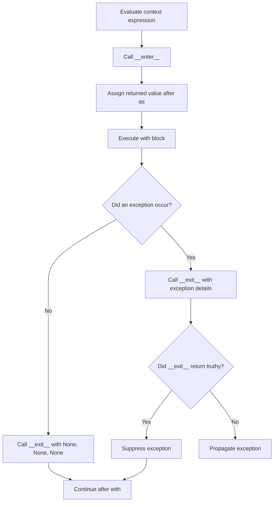
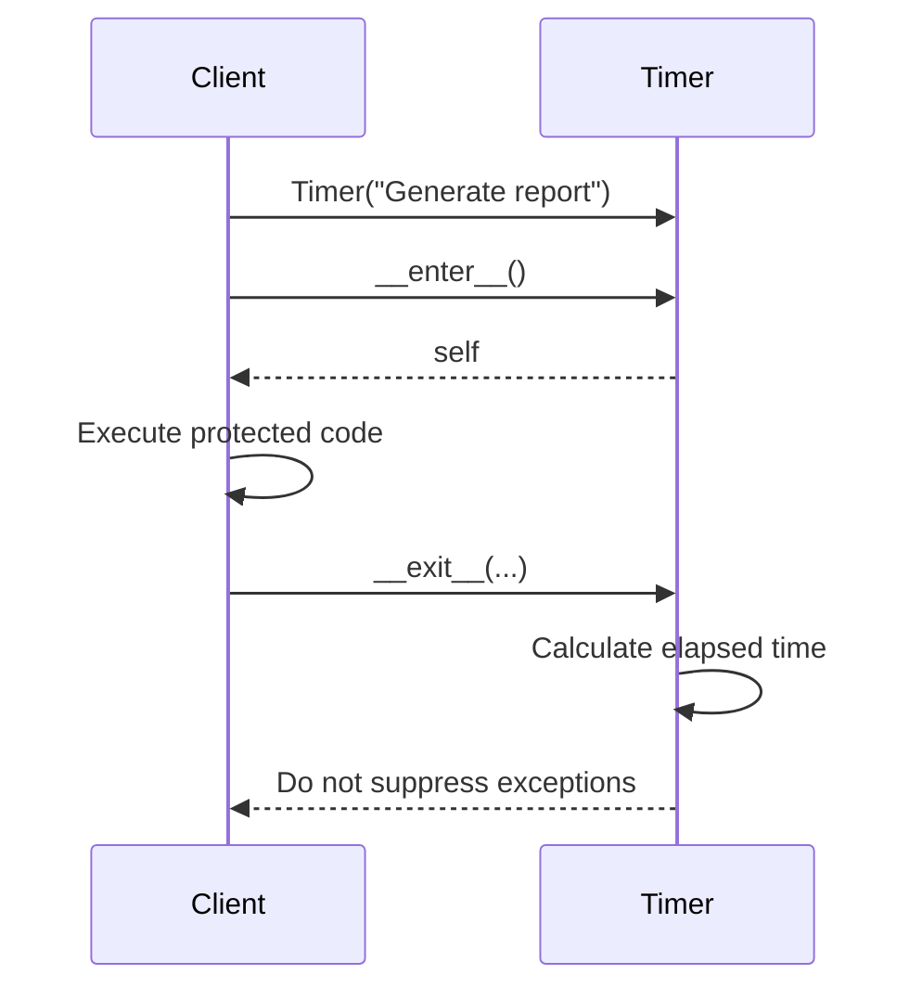
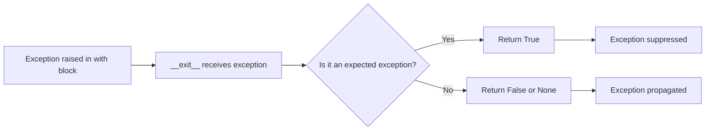
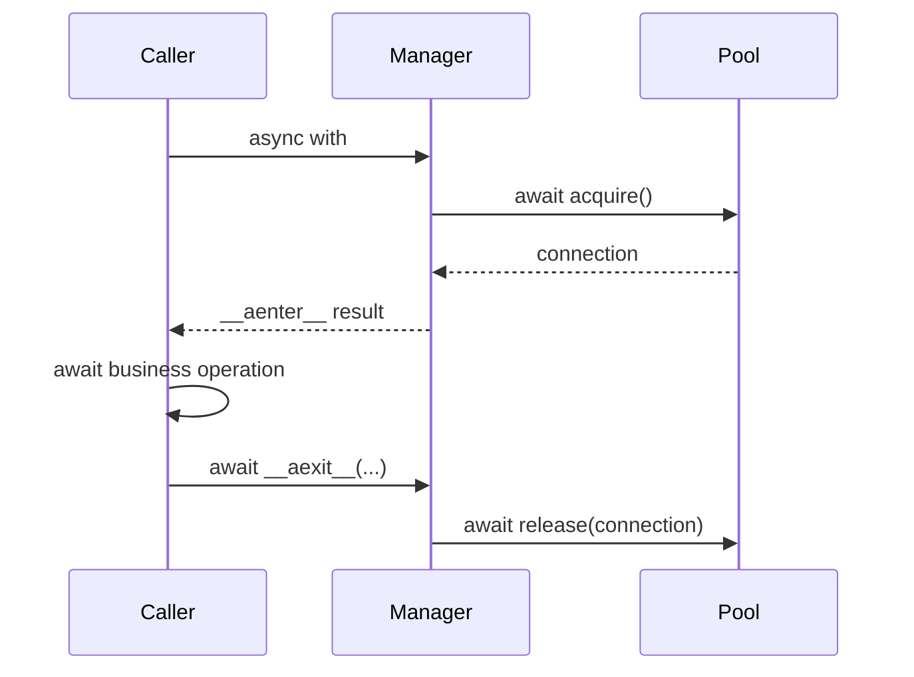

# Python Context Managers: `with`, `__enter__()`, and `__exit__()`

> A **context manager** controls what happens before and after a block of code. It is commonly used to acquire a resource, use it safely, and release it automatically—even when an exception occurs.

---

## Index

1. [Why Context Managers Exist](#1-why-context-managers-exist)
2. [The `with` Statement](#2-the-with-statement)
3. [How `with` Works Internally](#3-how-with-works-internally)
4. [`__enter__()` and `__exit__()`](#4-__enter__-and-__exit__)
5. [Creating a Class-Based Context Manager](#5-creating-a-class-based-context-manager)
6. [Exception Handling and Suppression](#6-exception-handling-and-suppression)
7. [Creating a Context Manager with `@contextmanager`](#7-creating-a-context-manager-with-contextmanager)
8. [Class-Based vs Generator-Based Context Managers](#8-class-based-vs-generator-based-context-managers)
9. [Using Multiple Context Managers](#9-using-multiple-context-managers)
10. [Useful Tools from `contextlib`](#10-useful-tools-from-contextlib)
11. [Dynamic Resource Management with `ExitStack`](#11-dynamic-resource-management-with-exitstack)
12. [Asynchronous Context Managers](#12-asynchronous-context-managers)
13. [Real-World Development Examples](#13-real-world-development-examples)
14. [Testing Context Managers](#14-testing-context-managers)
15. [Design and Best Practices](#15-design-and-best-practices)
16. [Interview-Focused Summary](#16-interview-focused-summary)
17. [Official References](#17-official-references)

---

# 1. Why Context Managers Exist

Many operations follow the same three-step pattern:

```text
1. Acquire or configure something
2. Execute business logic
3. Release, restore, or clean up
```

Common examples include:

- Opening and closing files
- Acquiring and releasing locks
- Starting and committing database transactions
- Opening and returning database connections
- Creating and removing temporary resources
- Temporarily changing application state
- Measuring execution time
- Redirecting output
- Starting and stopping tracing or logging scopes

Without a context manager, cleanup is normally written with `try` and `finally`.

```python
file = open("report.txt", "r", encoding="utf-8")

try:
    content = file.read()
finally:
    file.close()
```

This works, but the setup and cleanup logic must be repeated everywhere.

A context manager moves that responsibility into a reusable object:

```python
with open("report.txt", "r", encoding="utf-8") as file:
    content = file.read()
```

The file is closed automatically when the block finishes.

That cleanup happens when the block exits because of:

- Normal completion
- `return`
- `break`
- `continue`
- An exception

## Core idea

```text
Context manager = setup logic + cleanup logic
```

---

# 2. The `with` Statement

The basic syntax is:

```python
with context_expression as value:
    # Code executed inside the managed context
    ...
```

Example:

```python
with open("users.txt", "w", encoding="utf-8") as file:
    file.write("Alice\n")
    file.write("Bob\n")
```

Here:

- `open(...)` creates a file object.
- The file object acts as a context manager.
- Its `__enter__()` result is assigned to `file`.
- The body executes.
- Its `__exit__()` method closes the file.

## Execution flow



## Important distinction

The object after `as` is the value returned by `__enter__()`.

It is not required to be the context manager object itself.

```python
class DemoContext:
    def __enter__(self) -> str:
        return "value returned by __enter__"

    def __exit__(self, exc_type, exc_value, traceback) -> None:
        return None


with DemoContext() as value:
    print(value)
```

Output:

```text
value returned by __enter__
```

---

# 3. How `with` Works Internally

Consider this code:

```python
with ResourceManager() as resource:
    resource.process()
```

Conceptually, Python performs logic similar to:

```python
manager = ResourceManager()
resource = manager.__enter__()

try:
    resource.process()
except BaseException as error:
    suppress = manager.__exit__(
        type(error),
        error,
        error.__traceback__,
    )

    if not suppress:
        raise
else:
    manager.__exit__(None, None, None)
```

This is a simplified explanation. The Python language specification includes more precise handling for special-method lookup and every possible control-flow path.

## Main guarantee

Once `__enter__()` completes successfully, Python guarantees that `__exit__()` will be called when the `with` block is left.

However, if `__enter__()` itself raises an exception, that context manager's `__exit__()` is not called because the context was never entered successfully.

## Call sequence

```text
Create manager
      |
      v
Call __enter__()
      |
      v
Execute block
      |
      v
Call __exit__()
      |
      v
Continue or propagate exception
```

---

# 4. `__enter__()` and `__exit__()`

A synchronous context manager implements two methods:

```python
class ContextManager:
    def __enter__(self):
        ...

    def __exit__(self, exc_type, exc_value, traceback):
        ...
```

## 4.1 `__enter__()`

`__enter__()` runs before the body of the `with` statement.

It normally performs setup such as:

- Opening a connection
- Acquiring a lock
- Starting a transaction
- Creating a temporary object
- Saving previous state
- Starting a timer

Its return value becomes the value after `as`.

```python
class ConnectionContext:
    def __enter__(self):
        self.connection = create_connection()
        return self.connection
```

Usage:

```python
with ConnectionContext() as connection:
    connection.execute("SELECT 1")
```

The variable `connection` receives the value returned by `__enter__()`.

### Returning `self`

Return `self` when the context manager object provides the operations needed inside the block.

```python
class ManagedFile:
    def __enter__(self):
        self.file = open("data.txt", "r", encoding="utf-8")
        return self

    def read(self) -> str:
        return self.file.read()
```

Usage:

```python
with ManagedFile() as managed_file:
    content = managed_file.read()
```

### Returning the managed resource

Return the actual resource when callers should interact directly with that resource.

```python
class ManagedFile:
    def __enter__(self):
        self.file = open("data.txt", "r", encoding="utf-8")
        return self.file
```

Usage:

```python
with ManagedFile() as file:
    content = file.read()
```

Both designs are valid. The choice depends on the public API you want to expose.

---

## 4.2 `__exit__()`

`__exit__()` runs when execution leaves the `with` block.

Its signature is:

```python
def __exit__(self, exc_type, exc_value, traceback):
    ...
```

The arguments describe an exception raised inside the block.

| Argument | Value when no exception occurs | Value when an exception occurs |
|---|---:|---|
| `exc_type` | `None` | Exception class |
| `exc_value` | `None` | Exception instance |
| `traceback` | `None` | Traceback object |

Example:

```python
class DebugContext:
    def __enter__(self):
        print("Entering")
        return self

    def __exit__(self, exc_type, exc_value, traceback):
        print(f"Exception type: {exc_type}")
        print(f"Exception value: {exc_value}")
        return False
```

Normal execution:

```python
with DebugContext():
    print("Processing")
```

Output:

```text
Entering
Processing
Exception type: None
Exception value: None
```

Exceptional execution:

```python
with DebugContext():
    raise ValueError("Invalid input")
```

The method receives approximately:

```text
exc_type  = ValueError
exc_value = ValueError("Invalid input")
traceback = traceback object
```

## The return value of `__exit__()`

The return value controls exception propagation.

```text
Falsy return value  -> propagate the exception
Truthy return value -> suppress the exception
```

Typical implementations return `False` or `None`.

```python
def __exit__(self, exc_type, exc_value, traceback) -> bool:
    self.cleanup()
    return False
```

A method without an explicit return statement returns `None`, which is falsy.

```python
def __exit__(self, exc_type, exc_value, traceback) -> None:
    self.cleanup()
```

Both implementations allow exceptions to continue normally.

---

# 5. Creating a Class-Based Context Manager

A class-based context manager is useful when:

- The manager maintains state.
- Setup and cleanup require several methods.
- The object has a meaningful reusable API.
- Inheritance or configuration is useful.
- You want explicit control over the context-management protocol.

## Example: execution timer

```python
from time import perf_counter
from types import TracebackType
from typing import Self


class Timer:
    def __init__(self, label: str) -> None:
        self.label = label
        self.started_at: float | None = None
        self.elapsed: float | None = None

    def __enter__(self) -> Self:
        self.started_at = perf_counter()
        return self

    def __exit__(
        self,
        exc_type: type[BaseException] | None,
        exc_value: BaseException | None,
        traceback: TracebackType | None,
    ) -> None:
        if self.started_at is None:
            raise RuntimeError("Timer was not started")

        self.elapsed = perf_counter() - self.started_at
        print(f"{self.label}: {self.elapsed:.4f} seconds")
```

Usage:

```python
with Timer("Generate report") as timer:
    result = sum(number * number for number in range(1_000_000))

print(timer.elapsed)
```

## Lifecycle



## Example: managed service connection

```python
from types import TracebackType


class ServiceClient:
    def connect(self) -> None:
        print("Connected")

    def send(self, payload: dict[str, object]) -> None:
        print(f"Sending: {payload}")

    def close(self) -> None:
        print("Closed")


class ManagedServiceClient:
    def __init__(self) -> None:
        self.client: ServiceClient | None = None

    def __enter__(self) -> ServiceClient:
        client = ServiceClient()
        client.connect()
        self.client = client
        return client

    def __exit__(
        self,
        exc_type: type[BaseException] | None,
        exc_value: BaseException | None,
        traceback: TracebackType | None,
    ) -> None:
        if self.client is not None:
            self.client.close()
```

Usage:

```python
with ManagedServiceClient() as client:
    client.send({"event": "user.created"})
```

---

# 6. Exception Handling and Suppression

A context manager can inspect exceptions raised inside its block.

This is useful for:

- Transaction commit or rollback
- Converting low-level exceptions into domain exceptions
- Logging failures
- Retrying or compensating for operations
- Suppressing a narrowly defined and expected exception

## 6.1 Cleanup without suppression

Most context managers should clean up and allow the original exception to propagate.

```python
class Resource:
    def __enter__(self):
        print("Acquire resource")
        return self

    def __exit__(self, exc_type, exc_value, traceback):
        print("Release resource")
        return False
```

```python
with Resource():
    raise RuntimeError("Processing failed")
```

Output:

```text
Acquire resource
Release resource
```

The `RuntimeError` still propagates.

---

## 6.2 Selective exception suppression

Suppress only exceptions that the context manager is explicitly designed to handle.

```python
class IgnoreMissingFile:
    def __enter__(self):
        return self

    def __exit__(self, exc_type, exc_value, traceback) -> bool:
        return exc_type is FileNotFoundError
```

Usage:

```python
with IgnoreMissingFile():
    with open("optional-config.json", encoding="utf-8") as file:
        config = file.read()

print("Application continues")
```

A `FileNotFoundError` is suppressed. Other exceptions continue normally.

## Exception decision flow



## Why broad suppression is risky

This implementation is dangerous:

```python
def __exit__(self, exc_type, exc_value, traceback):
    return True
```

It suppresses every exception, including programming errors such as:

- `TypeError`
- `AttributeError`
- `KeyError`
- `AssertionError`
- Unexpected runtime failures

Prefer narrow checks:

```python
def __exit__(self, exc_type, exc_value, traceback) -> bool:
    return exc_type is ExpectedError
```

Or:

```python
def __exit__(self, exc_type, exc_value, traceback) -> bool:
    return exc_type is not None and issubclass(exc_type, ExpectedError)
```

Use the second form when subclasses of `ExpectedError` should also be handled.

---

## 6.3 Transaction-style behavior

Context managers map naturally to transaction boundaries.

```python
class Transaction:
    def __init__(self, connection) -> None:
        self.connection = connection

    def __enter__(self):
        self.connection.begin()
        return self.connection

    def __exit__(self, exc_type, exc_value, traceback) -> None:
        if exc_type is None:
            self.connection.commit()
        else:
            self.connection.rollback()
```

Flow:

```text
Enter context
    |
    v
Begin transaction
    |
    v
Run database operations
    |
    +---- success ----> commit
    |
    +---- failure ----> rollback ----> re-raise original exception
```

Because `__exit__()` returns `None`, a failure is not suppressed.

---

## 6.4 Raising a new exception from `__exit__()`

An `__exit__()` method can raise a different exception, but this changes what the caller sees.

```python
class TranslateDatabaseError:
    def __enter__(self):
        return self

    def __exit__(self, exc_type, exc_value, traceback):
        if exc_type is DatabaseDriverError:
            raise RepositoryError("Repository operation failed") from exc_value

        return False
```

Use explicit exception chaining with `raise ... from ...` so debugging information is preserved.

---

# 7. Creating a Context Manager with `@contextmanager`

The `contextlib.contextmanager` decorator lets you create a context manager from a generator function.

```python
from contextlib import contextmanager


@contextmanager
def managed_resource():
    resource = acquire_resource()

    try:
        yield resource
    finally:
        release_resource(resource)
```

Usage:

```python
with managed_resource() as resource:
    resource.process()
```

## Meaning of `yield`

The code is divided into three parts:

```python
@contextmanager
def example():
    # 1. Equivalent to __enter__ setup
    setup()

    try:
        # 2. Value after "as"
        yield value
    finally:
        # 3. Equivalent to __exit__ cleanup
        cleanup()
```

Execution:

```text
Code before yield
      |
      v
with block executes
      |
      v
Code after yield
```

## Important rule: yield exactly once

A function decorated with `@contextmanager` must yield exactly one time.

Invalid:

```python
@contextmanager
def invalid_manager():
    return
    yield
```

Invalid:

```python
@contextmanager
def invalid_manager():
    yield "first"
    yield "second"
```

The context-manager protocol expects one entry point and one exit path.

---

## Example: temporary environment variable

```python
import os
from collections.abc import Iterator
from contextlib import contextmanager


@contextmanager
def temporary_environment(
    name: str,
    value: str,
) -> Iterator[None]:
    previous_value = os.environ.get(name)
    os.environ[name] = value

    try:
        yield
    finally:
        if previous_value is None:
            os.environ.pop(name, None)
        else:
            os.environ[name] = previous_value
```

Usage:

```python
with temporary_environment("APP_MODE", "test"):
    print(os.environ["APP_MODE"])

print(os.environ.get("APP_MODE"))
```

The previous environment state is restored even if the block raises an exception.

---

## Example: temporary application setting

```python
from collections.abc import Iterator
from contextlib import contextmanager


@contextmanager
def override_setting(
    settings: dict[str, object],
    key: str,
    value: object,
) -> Iterator[None]:
    marker = object()
    previous_value = settings.get(key, marker)
    settings[key] = value

    try:
        yield
    finally:
        if previous_value is marker:
            settings.pop(key, None)
        else:
            settings[key] = previous_value
```

Usage:

```python
settings = {"debug": False}

with override_setting(settings, "debug", True):
    assert settings["debug"] is True

assert settings["debug"] is False
```

---

## Handling exceptions inside `@contextmanager`

An exception from the `with` block is raised again at the `yield` expression.

```python
from collections.abc import Iterator
from contextlib import contextmanager


@contextmanager
def log_failure() -> Iterator[None]:
    try:
        yield
    except Exception:
        print("Operation failed")
        raise
```

Usage:

```python
with log_failure():
    raise ValueError("Invalid input")
```

The exception is logged and then re-raised.

To intentionally suppress a specific exception:

```python
@contextmanager
def ignore_lookup_error() -> Iterator[None]:
    try:
        yield
    except LookupError:
        pass
```

Use this behavior only when suppression is an intentional part of the API.

---

# 8. Class-Based vs Generator-Based Context Managers

| Area | Class-based | `@contextmanager` |
|---|---|---|
| Main methods | `__enter__`, `__exit__` | Code before and after `yield` |
| Boilerplate | More | Less |
| State management | Natural | Possible through local variables |
| Extra public methods | Easy | Not the main design |
| Inheritance | Supported | Not applicable in the same way |
| Simple setup/cleanup | More verbose | Usually ideal |
| Complex lifecycle | Usually clearer | Can become difficult to follow |
| Reuse as decorator | Use `ContextDecorator` | Supported automatically |

## Choose a class when

- The manager has multiple operations.
- State must remain available after the block.
- The object represents a meaningful domain abstraction.
- The lifecycle is complex.
- You need inheritance or an abstract base class.

```python
with UnitOfWork() as unit_of_work:
    unit_of_work.orders.add(order)
    unit_of_work.commit()
```

## Choose `@contextmanager` when

- The logic is mainly setup, yield, and cleanup.
- The manager is small and local.
- A separate class would add unnecessary ceremony.

```python
with temporary_environment("MODE", "test"):
    run_tests()
```

---

# 9. Using Multiple Context Managers

Python can enter multiple context managers in one `with` statement.

```python
with open("source.txt", encoding="utf-8") as source, \
     open("target.txt", "w", encoding="utf-8") as target:
    target.write(source.read())
```

For better readability, modern Python supports parentheses:

```python
with (
    open("source.txt", encoding="utf-8") as source,
    open("target.txt", "w", encoding="utf-8") as target,
):
    target.write(source.read())
```

This is conceptually equivalent to nesting:

```python
with open("source.txt", encoding="utf-8") as source:
    with open("target.txt", "w", encoding="utf-8") as target:
        target.write(source.read())
```

## Entry and exit order

Context managers are entered from left to right and exited from right to left.

```text
Enter A
  Enter B
    Execute body
  Exit B
Exit A
```

Example:

```python
class Trace:
    def __init__(self, name: str) -> None:
        self.name = name

    def __enter__(self):
        print(f"Enter {self.name}")
        return self

    def __exit__(self, exc_type, exc_value, traceback):
        print(f"Exit {self.name}")


with Trace("A"), Trace("B"):
    print("Body")
```

Output:

```text
Enter A
Enter B
Body
Exit B
Exit A
```

The reverse cleanup order is important because later resources may depend on earlier resources.

---

# 10. Useful Tools from `contextlib`

The standard-library `contextlib` module provides reusable context-management utilities.

## 10.1 `contextmanager`

Creates a synchronous context manager from a generator function.

```python
from contextlib import contextmanager
```

Use it for simple setup and cleanup flows.

---

## 10.2 `closing`

Calls an object's `close()` method when the block finishes.

```python
from contextlib import closing


with closing(create_legacy_client()) as client:
    client.send_request()
```

Use `closing()` for third-party or legacy objects that:

- Have a `close()` method
- Do not implement `__enter__()` and `__exit__()`

Most modern resource objects already support `with` directly.

---

## 10.3 `suppress`

Suppresses specifically listed exception types.

```python
import os
from contextlib import suppress


with suppress(FileNotFoundError):
    os.remove("temporary-file.txt")
```

This is equivalent to:

```python
try:
    os.remove("temporary-file.txt")
except FileNotFoundError:
    pass
```

Keep the protected block small so it is clear which operation may raise the expected exception.

---

## 10.4 `nullcontext`

Provides a context manager that performs no setup or cleanup.

It is useful when context management is optional.

```python
from contextlib import nullcontext
from pathlib import Path
from typing import TextIO


def process_text(source: str | Path | TextIO) -> str:
    if isinstance(source, (str, Path)):
        context = open(source, encoding="utf-8")
    else:
        context = nullcontext(source)

    with context as file:
        return file.read()
```

Behavior:

- A path is opened and closed by this function.
- An existing file object is used but not closed by this function.

This preserves clear ownership of resources.

---

## 10.5 `redirect_stdout` and `redirect_stderr`

Temporarily redirect Python-level standard output or error streams.

```python
from contextlib import redirect_stdout
from io import StringIO


buffer = StringIO()

with redirect_stdout(buffer):
    print("Captured output")

captured = buffer.getvalue()
```

These utilities change global process state. They are useful in scripts and tests, but require care in threaded applications.

---

## 10.6 `chdir`

Temporarily changes the current working directory and restores it afterward.

```python
from contextlib import chdir


with chdir("/tmp"):
    run_local_command()
```

The current working directory is process-wide state, so this context manager is not suitable for most concurrent threaded or asynchronous code.

---

## 10.7 `AbstractContextManager`

`AbstractContextManager` can be used as a base class for custom context managers.

```python
from contextlib import AbstractContextManager
from types import TracebackType
from typing import Self


class ManagedResource(AbstractContextManager["ManagedResource"]):
    def __enter__(self) -> Self:
        self.open()
        return self

    def __exit__(
        self,
        exc_type: type[BaseException] | None,
        exc_value: BaseException | None,
        traceback: TracebackType | None,
    ) -> None:
        self.close()

    def open(self) -> None:
        print("Opened")

    def close(self) -> None:
        print("Closed")
```

`AbstractContextManager` provides a default `__enter__()` implementation that returns `self`, but defining it explicitly can make lifecycle behavior easier to understand.

---

# 11. Dynamic Resource Management with `ExitStack`

A normal `with` statement works best when the number of context managers is known while writing the code.

`contextlib.ExitStack` is useful when resources are dynamic:

- The number of files comes from user input.
- Some resources are optional.
- Context managers are created inside a loop.
- Cleanup callbacks must be registered programmatically.
- A sequence of setup steps must behave like one managed operation.

## Example: open a dynamic list of files

```python
from contextlib import ExitStack
from pathlib import Path


def read_files(paths: list[Path]) -> list[str]:
    with ExitStack() as stack:
        files = [
            stack.enter_context(path.open(encoding="utf-8"))
            for path in paths
        ]

        return [file.read() for file in files]
```

If opening a later file fails, all previously opened files are still closed.

## Internal model

`ExitStack` maintains a stack of cleanup operations.

```text
Register cleanup A
Register cleanup B
Register cleanup C

On exit:

Run cleanup C
Run cleanup B
Run cleanup A
```

This matches nested `with` behavior.

---

## Registering a plain cleanup callback

```python
from contextlib import ExitStack


def release_token(token: str) -> None:
    print(f"Released token: {token}")


with ExitStack() as stack:
    token = "resource-token"
    stack.callback(release_token, token)

    print("Use resource")
```

`stack.callback(...)` registers an ordinary function to be called when the stack exits.

Callbacks registered this way do not receive exception information and cannot suppress exceptions.

---

## Optional context managers

```python
from contextlib import ExitStack


def run_job(use_lock: bool, use_trace: bool) -> None:
    with ExitStack() as stack:
        if use_lock:
            stack.enter_context(distributed_lock("job-lock"))

        if use_trace:
            stack.enter_context(trace_span("run-job"))

        execute_job()
```

This avoids deeply nested conditional `with` statements.

---

## Resource acquisition as an all-or-nothing operation

```python
from contextlib import ExitStack


def acquire_all(resources):
    stack = ExitStack()

    try:
        acquired = [
            stack.enter_context(resource)
            for resource in resources
        ]
    except Exception:
        stack.close()
        raise

    return acquired, stack
```

The caller owns the returned stack and must close it.

A safer API can expose the entire operation as another context manager instead of returning cleanup responsibility manually.

---

# 12. Asynchronous Context Managers

A synchronous context manager uses:

```python
__enter__()
__exit__()
```

An asynchronous context manager uses:

```python
__aenter__()
__aexit__()
```

It is consumed with `async with`.

Use asynchronous context managers when setup or cleanup must await asynchronous work, such as:

- Acquiring a connection from an async database pool
- Opening an async HTTP client session
- Starting an async transaction
- Acquiring an async lock
- Closing async streams
- Starting or ending asynchronous tracing scopes

## 12.1 Class-based async context manager

```python
from types import TracebackType


class AsyncConnection:
    async def execute(self, query: str) -> None:
        print(f"Executing: {query}")


class ConnectionPool:
    async def acquire(self) -> AsyncConnection:
        print("Acquire connection")
        return AsyncConnection()

    async def release(self, connection: AsyncConnection) -> None:
        print("Release connection")


class ManagedConnection:
    def __init__(self, pool: ConnectionPool) -> None:
        self.pool = pool
        self.connection: AsyncConnection | None = None

    async def __aenter__(self) -> AsyncConnection:
        self.connection = await self.pool.acquire()
        return self.connection

    async def __aexit__(
        self,
        exc_type: type[BaseException] | None,
        exc_value: BaseException | None,
        traceback: TracebackType | None,
    ) -> None:
        if self.connection is not None:
            await self.pool.release(self.connection)
```

Usage:

```python
async def fetch_users(pool: ConnectionPool) -> None:
    async with ManagedConnection(pool) as connection:
        await connection.execute("SELECT * FROM users")
```

## Async lifecycle



---

## 12.2 `@asynccontextmanager`

`contextlib.asynccontextmanager` provides a generator-style async context manager.

```python
from collections.abc import AsyncIterator
from contextlib import asynccontextmanager


@asynccontextmanager
async def managed_connection(
    pool: ConnectionPool,
) -> AsyncIterator[AsyncConnection]:
    connection = await pool.acquire()

    try:
        yield connection
    finally:
        await pool.release(connection)
```

Usage:

```python
async def fetch_users(pool: ConnectionPool) -> None:
    async with managed_connection(pool) as connection:
        await connection.execute("SELECT * FROM users")
```

---

## 12.3 Async transaction example

```python
from collections.abc import AsyncIterator
from contextlib import asynccontextmanager


@asynccontextmanager
async def transaction(connection) -> AsyncIterator[None]:
    await connection.begin()

    try:
        yield
    except Exception:
        await connection.rollback()
        raise
    else:
        await connection.commit()
```

Usage:

```python
async with transaction(connection):
    await connection.execute("UPDATE accounts SET balance = balance - 100")
    await connection.execute("UPDATE accounts SET balance = balance + 100")
```

---

## 12.4 `AsyncExitStack`

`AsyncExitStack` manages a dynamic collection of synchronous and asynchronous cleanup operations.

```python
from contextlib import AsyncExitStack


async def process_services(services) -> None:
    async with AsyncExitStack() as stack:
        clients = [
            await stack.enter_async_context(service.client())
            for service in services
        ]

        await execute_requests(clients)
```

It unwinds registered resources in reverse order, similar to `ExitStack`.

---

# 13. Real-World Development Examples

## 13.1 File processing

```python
from pathlib import Path


def count_lines(path: Path) -> int:
    with path.open(encoding="utf-8") as file:
        return sum(1 for _ in file)
```

The file is closed before the function returns.

---

## 13.2 Thread lock

Locks support the context-management protocol.

```python
from threading import Lock


cache_lock = Lock()
cache: dict[str, object] = {}


def update_cache(key: str, value: object) -> None:
    with cache_lock:
        cache[key] = value
```

Conceptually:

```python
cache_lock.acquire()

try:
    cache[key] = value
finally:
    cache_lock.release()
```

---

## 13.3 Decimal arithmetic configuration

Some standard-library APIs use context managers to temporarily change behavior.

```python
from decimal import Decimal, localcontext


with localcontext() as context:
    context.prec = 6
    result = Decimal("1") / Decimal("7")
    print(result)
```

The previous decimal context is restored afterward.

---

## 13.4 Temporary directory

```python
from pathlib import Path
from tempfile import TemporaryDirectory


with TemporaryDirectory() as directory:
    temp_path = Path(directory)
    output_file = temp_path / "result.json"
    output_file.write_text('{"status": "ok"}', encoding="utf-8")

# The temporary directory and its contents are removed here.
```

---

## 13.5 Database unit of work

A unit-of-work context manager can centralize transaction behavior.

```python
from types import TracebackType
from typing import Self


class UnitOfWork:
    def __init__(self, session_factory) -> None:
        self.session_factory = session_factory
        self.session = None

    def __enter__(self) -> Self:
        self.session = self.session_factory()
        return self

    def commit(self) -> None:
        if self.session is None:
            raise RuntimeError("Unit of work is not active")

        self.session.commit()

    def __exit__(
        self,
        exc_type: type[BaseException] | None,
        exc_value: BaseException | None,
        traceback: TracebackType | None,
    ) -> None:
        if self.session is None:
            return

        try:
            if exc_type is not None:
                self.session.rollback()
        finally:
            self.session.close()
```

Usage:

```python
with UnitOfWork(session_factory) as unit_of_work:
    unit_of_work.session.add(order)
    unit_of_work.commit()
```

The context manager ensures that the session is closed and that failed operations are rolled back.

---

## 13.6 Request tracing scope

```python
from collections.abc import Iterator
from contextlib import contextmanager
from time import perf_counter


@contextmanager
def trace_operation(name: str) -> Iterator[None]:
    started_at = perf_counter()
    print(f"Start: {name}")

    try:
        yield
    except Exception as error:
        print(f"Failed: {name}: {error}")
        raise
    finally:
        elapsed = perf_counter() - started_at
        print(f"End: {name}; elapsed={elapsed:.4f}s")
```

Usage:

```python
with trace_operation("generate-invoice"):
    generate_invoice()
```

---

## 13.7 Web-framework dependency lifecycle

A generator-based context manager is useful for application resources such as sessions.

```python
from collections.abc import Iterator
from contextlib import contextmanager


@contextmanager
def database_session(session_factory) -> Iterator[object]:
    session = session_factory()

    try:
        yield session
    except Exception:
        session.rollback()
        raise
    finally:
        session.close()
```

The application can reuse this lifecycle in services, scripts, jobs, and tests.

---

# 14. Testing Context Managers

Context managers should be tested across both success and failure paths.

## 14.1 Test normal lifecycle order

```python
class RecordedContext:
    def __init__(self, events: list[str]) -> None:
        self.events = events

    def __enter__(self):
        self.events.append("enter")
        return "resource"

    def __exit__(self, exc_type, exc_value, traceback):
        self.events.append("exit")
```

Test:

```python
def test_context_lifecycle() -> None:
    events: list[str] = []

    with RecordedContext(events) as resource:
        events.append("body")
        assert resource == "resource"

    assert events == ["enter", "body", "exit"]
```

---

## 14.2 Test cleanup after an exception

```python
import pytest


def test_cleanup_runs_after_failure() -> None:
    events: list[str] = []

    with pytest.raises(ValueError, match="invalid"):
        with RecordedContext(events):
            events.append("body")
            raise ValueError("invalid")

    assert events == ["enter", "body", "exit"]
```

---

## 14.3 Test selective suppression

```python
class SuppressMissingKey:
    def __enter__(self):
        return self

    def __exit__(self, exc_type, exc_value, traceback) -> bool:
        return exc_type is KeyError
```

Test:

```python
def test_expected_exception_is_suppressed() -> None:
    with SuppressMissingKey():
        raise KeyError("optional")


def test_unexpected_exception_propagates() -> None:
    with pytest.raises(ValueError):
        with SuppressMissingKey():
            raise ValueError("unexpected")
```

---

## 14.4 Test cleanup order

```python
class NamedContext:
    def __init__(self, name: str, events: list[str]) -> None:
        self.name = name
        self.events = events

    def __enter__(self):
        self.events.append(f"enter:{self.name}")
        return self

    def __exit__(self, exc_type, exc_value, traceback):
        self.events.append(f"exit:{self.name}")
```

Test:

```python
def test_nested_cleanup_order() -> None:
    events: list[str] = []

    with NamedContext("A", events), NamedContext("B", events):
        events.append("body")

    assert events == [
        "enter:A",
        "enter:B",
        "body",
        "exit:B",
        "exit:A",
    ]
```

---

# 15. Design and Best Practices

## 15.1 Keep ownership clear

The code that creates a resource should usually be responsible for closing it.

```python
def read_data(path: str) -> str:
    with open(path, encoding="utf-8") as file:
        return file.read()
```

When a caller passes an already-open resource, avoid closing it unless the API explicitly transfers ownership.

`nullcontext()` can help represent this distinction.

---

## 15.2 Keep the managed scope focused

Acquire the resource as late as practical and release it as early as practical.

Less focused:

```python
with database_connection() as connection:
    parse_large_file()
    validate_unrelated_data()
    save_result(connection)
```

More focused:

```python
parsed_data = parse_large_file()
validated_data = validate_data(parsed_data)

with database_connection() as connection:
    save_result(connection, validated_data)
```

A smaller scope reduces lock duration, connection usage, and transaction time.

---

## 15.3 Put cleanup in `finally`

For generator-based context managers, cleanup normally belongs in `finally`.

```python
@contextmanager
def managed_client():
    client = create_client()

    try:
        yield client
    finally:
        client.close()
```

This ensures cleanup runs on both success and failure.

---

## 15.4 Do not hide unexpected failures

Most custom `__exit__()` implementations should return `False` or `None`.

```python
def __exit__(self, exc_type, exc_value, traceback) -> None:
    self.close()
```

Return a truthy value only when suppressing an exception is a documented feature.

---

## 15.5 Keep `__enter__()` failure-safe

If `__enter__()` acquires several resources and a later step fails, earlier resources must still be cleaned up.

Python does not call a context manager's `__exit__()` when its own `__enter__()` fails. Therefore, partial setup must be protected inside `__enter__()`.

```python
from contextlib import ExitStack
from types import TracebackType


class ComplexManager:
    def __init__(self) -> None:
        self._stack = ExitStack()

    def __enter__(self):
        with ExitStack() as setup_stack:
            resource_a = setup_stack.enter_context(open_resource_a())
            resource_b = setup_stack.enter_context(open_resource_b())

            # Transfer successful cleanup registrations to the instance.
            self._stack = setup_stack.pop_all()

        return resource_a, resource_b

    def __exit__(
        self,
        exc_type: type[BaseException] | None,
        exc_value: BaseException | None,
        traceback: TracebackType | None,
    ):
        return self._stack.__exit__(exc_type, exc_value, traceback)
```

If acquiring `resource_b` fails, the local `setup_stack` immediately cleans up `resource_a`. If every acquisition succeeds, `pop_all()` transfers the cleanup callbacks to `self._stack` for normal cleanup in `__exit__()`.

---

## 15.6 Avoid long blocking work in synchronous cleanup

`__exit__()` blocks the current thread until it finishes.

When cleanup requires asynchronous I/O, use an asynchronous context manager:

```python
async with managed_connection(pool) as connection:
    await use_connection(connection)
```

---

## 15.7 Document suppression behavior

A caller should be able to understand whether the manager:

- Propagates every exception
- Suppresses a specific exception
- Translates exceptions
- Commits or rolls back based on failure
- Retries an operation

Exception behavior is part of the context manager's public contract.

---

## 15.8 Understand reuse behavior

Context managers can have different reuse characteristics.

### Single-use

A specific instance can be entered once.

Examples commonly include:

- File objects after they have been closed
- Generator-based managers created by `@contextmanager`

```python
manager = temporary_environment("MODE", "test")

with manager:
    pass

# Do not reuse the same generator-based manager instance.
```

Create a new instance each time:

```python
with temporary_environment("MODE", "test"):
    pass

with temporary_environment("MODE", "test"):
    pass
```

### Reusable but not reentrant

The same instance may be used again after the previous block finishes, but it cannot safely be entered again while already active.

A regular `threading.Lock` is a familiar example.

### Reentrant

The same context manager instance can be nested within itself safely.

Whether a custom manager is reentrant depends on how it stores and restores state.

---

## 15.9 Prefer existing context managers

Before writing a custom implementation, check whether the resource already supports `with`.

Common examples:

```python
with open(...):
    ...

with lock:
    ...

with connection:
    ...

with TemporaryDirectory():
    ...

with decimal.localcontext():
    ...
```

Use `contextlib` utilities when they already express the intended behavior.

---

# 16. Interview-Focused Summary

## Essential mental model

```text
__enter__() = setup and value production
with block  = protected business logic
__exit__()  = cleanup and exception decision
```

## Protocol

```python
class ContextManager:
    def __enter__(self):
        return resource

    def __exit__(self, exc_type, exc_value, traceback):
        cleanup()
        return False
```

## Key points to remember

- A context manager manages a runtime scope.
- `with` is reusable syntax around setup and cleanup behavior.
- `__enter__()` runs before the body.
- The value returned by `__enter__()` is assigned after `as`.
- `__exit__()` runs when the block is left after a successful entry.
- `__exit__()` receives exception details when the body fails.
- A truthy `__exit__()` result suppresses the exception.
- A falsy result allows the exception to propagate.
- Multiple managers enter left to right and exit right to left.
- `@contextmanager` is ideal for straightforward setup/yield/cleanup logic.
- `ExitStack` handles dynamic or optional groups of resources.
- Async resources use `async with`, `__aenter__()`, and `__aexit__()`.
- Context managers are not limited to cleanup; they can also restore state, control transactions, acquire locks, and define tracing scopes.

## Compact comparison

```text
Synchronous:
    with manager() as resource:
        use(resource)

    __enter__()
    __exit__()

Asynchronous:
    async with manager() as resource:
        await use(resource)

    __aenter__()
    __aexit__()
```

## Practical design rule

Use a context manager whenever an operation has a clear boundary:

```text
start / stop
open / close
acquire / release
begin / commit-or-rollback
set / restore
connect / disconnect
```

---

# 17. Official References

This guide follows the modern Python context-management protocol documented for Python 3.14.

- [Python Language Reference: The `with` statement](https://docs.python.org/3/reference/compound_stmts.html#the-with-statement)
- [Python Data Model: Context managers](https://docs.python.org/3/reference/datamodel.html#context-managers)
- [Python Standard Library: `contextlib`](https://docs.python.org/3/library/contextlib.html)
- [PEP 343: The `with` Statement](https://peps.python.org/pep-0343/)
