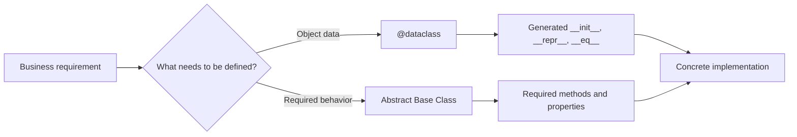
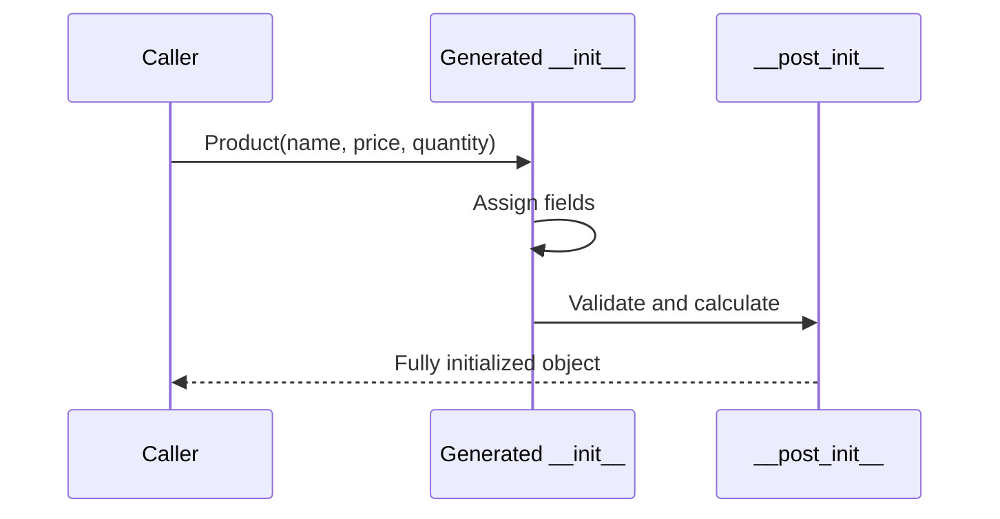
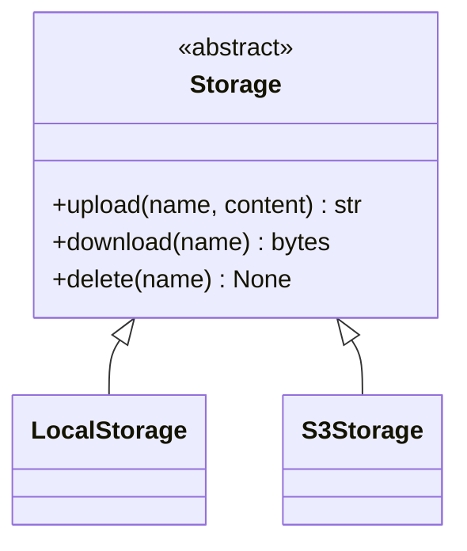
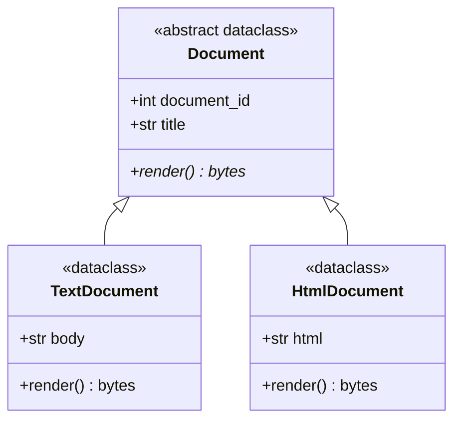
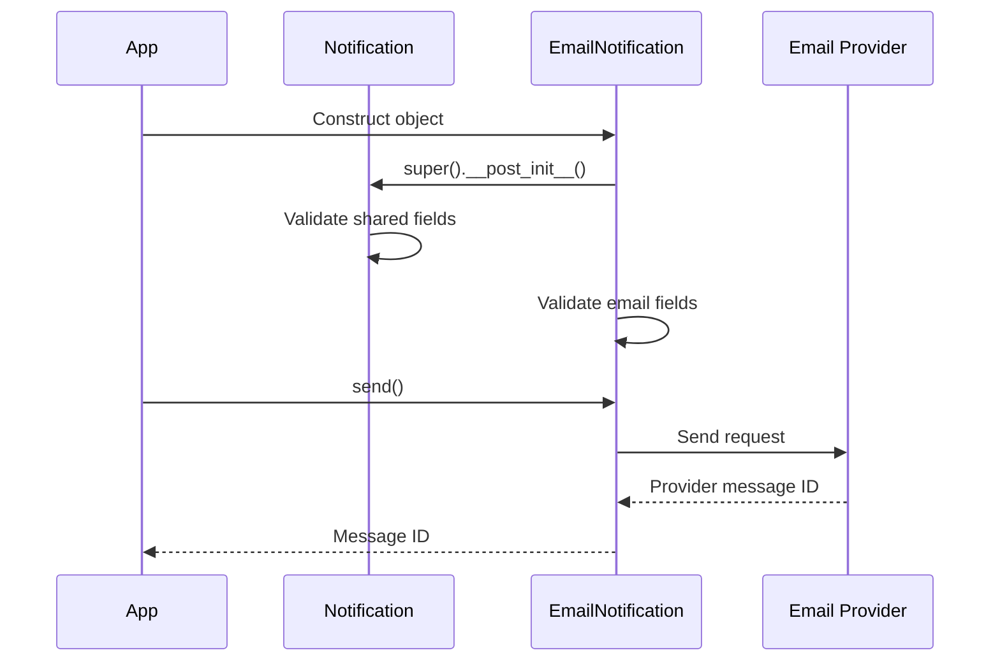
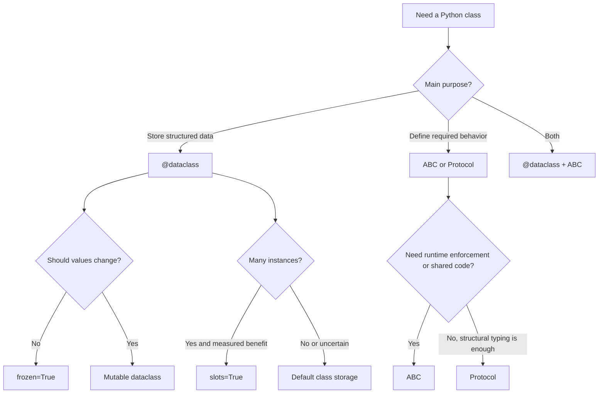

# Python `@dataclass` and Abstract Base Classes

> `@dataclass` reduces repetitive code for data-focused classes, while an **Abstract Base Class (ABC)** defines a contract that related classes must follow.

---

# 1. Big Picture

A normal Python class can contain both:

- **Data** — values stored on an object.
- **Behavior** — methods that operate on those values.

`@dataclass` and ABCs solve two different design problems.

| Feature | Main Purpose |
|---|---|
| `@dataclass` | Reduce repetitive code in data-focused classes |
| Abstract Base Class | Define a common interface and enforce required behavior |
| Both together | Build structured objects that follow a shared contract |

## Mental Model



A useful way to remember the difference:

```text
@dataclass answers:
"What data does this object contain?"

ABC answers:
"What must this object be able to do?"
```

---

# 2. `@dataclass`

The `dataclasses` module was added to Python in version 3.7.

A data class is still a normal Python class. The `@dataclass` decorator examines annotated fields and generates common methods such as `__init__()`, `__repr__()`, and `__eq__()`.

## 2.1 Why Data Classes Exist

Consider a regular class:

```python
class Employee:
    def __init__(self, employee_id: int, name: str, department: str) -> None:
        self.employee_id = employee_id
        self.name = name
        self.department = department

    def __repr__(self) -> str:
        return (
            f"Employee(employee_id={self.employee_id!r}, "
            f"name={self.name!r}, department={self.department!r})"
        )

    def __eq__(self, other: object) -> bool:
        if not isinstance(other, Employee):
            return NotImplemented

        return (
            self.employee_id == other.employee_id
            and self.name == other.name
            and self.department == other.department
        )
```

This class contains a lot of repeated setup code.

The data-class version is much smaller:

```python
from dataclasses import dataclass


@dataclass
class Employee:
    employee_id: int
    name: str
    department: str
```

Usage:

```python
employee = Employee(
    employee_id=101,
    name="Aarav",
    department="Engineering",
)

print(employee)
# Employee(employee_id=101, name='Aarav', department='Engineering')
```

The decorator creates the common methods automatically.

---

## 2.2 Basic Syntax

```python
from dataclasses import dataclass


@dataclass
class Product:
    product_id: int
    name: str
    price: float
    in_stock: bool = True
```

The fields are identified mainly through type annotations:

```python
product_id: int
name: str
price: float
in_stock: bool = True
```

Equivalent generated constructor:

```python
def __init__(
    self,
    product_id: int,
    name: str,
    price: float,
    in_stock: bool = True,
) -> None:
    self.product_id = product_id
    self.name = name
    self.price = price
    self.in_stock = in_stock
```

> Type annotations describe the expected types, but standard data classes do not automatically validate values at runtime.

For example, this runs unless you add validation:

```python
product = Product(
    product_id="incorrect type",
    name=100,
    price="free",
)
```

Static type checkers such as `mypy` or `pyright` can detect these mismatches, but `@dataclass` itself normally does not reject them.

---

## 2.3 Generated Methods

The default decorator behaves approximately like this:

```python
@dataclass(
    init=True,
    repr=True,
    eq=True,
    order=False,
    unsafe_hash=False,
    frozen=False,
    match_args=True,
    kw_only=False,
    slots=False,
    weakref_slot=False,
)
class Example:
    ...
```

## Important Parameters

| Parameter | Default | Purpose |
|---|---:|---|
| `init` | `True` | Generates `__init__()` |
| `repr` | `True` | Generates readable `__repr__()` |
| `eq` | `True` | Generates value-based `__eq__()` |
| `order` | `False` | Generates ordering methods |
| `unsafe_hash` | `False` | Forces generation of `__hash__()` |
| `frozen` | `False` | Prevents normal field reassignment |
| `match_args` | `True` | Supports positional structural pattern matching |
| `kw_only` | `False` | Makes generated constructor fields keyword-only |
| `slots` | `False` | Generates `__slots__` |
| `weakref_slot` | `False` | Adds a weak-reference slot when slots are enabled |

### Equality Is Based on Fields

```python
from dataclasses import dataclass


@dataclass
class Coordinate:
    x: int
    y: int


first = Coordinate(10, 20)
second = Coordinate(10, 20)

print(first == second)
# True
```

With a normal class that does not define `__eq__()`, equality usually compares object identity.

A generated data-class equality check compares the declared fields. It also expects both objects to be the same concrete class.

```python
@dataclass
class SpecialCoordinate(Coordinate):
    label: str = "special"


print(Coordinate(10, 20) == SpecialCoordinate(10, 20))
# False
```

---

## 2.4 Default Values and `default_factory`

Simple immutable defaults can be assigned directly:

```python
from dataclasses import dataclass


@dataclass
class UserSettings:
    language: str = "en"
    notifications_enabled: bool = True
    retry_count: int = 3
```

Mutable values such as lists, dictionaries, and sets require special care.

## Incorrect Mental Model

```python
# Do not use a shared mutable object as the default.
items: list[str] = []
```

A mutable default could be shared by multiple instances. Data classes protect against common unhashable defaults, but the correct design is still to create a fresh value for every instance.

## Correct Approach

```python
from dataclasses import dataclass, field


@dataclass
class ShoppingCart:
    customer_id: int
    items: list[str] = field(default_factory=list)
```

Each object receives its own list:

```python
first_cart = ShoppingCart(customer_id=1)
second_cart = ShoppingCart(customer_id=2)

first_cart.items.append("Keyboard")

print(first_cart.items)
# ['Keyboard']

print(second_cart.items)
# []
```

## How `default_factory` Works

```text
ShoppingCart(customer_id=1)
             |
             v
default_factory=list
             |
             v
Creates a new [] for this instance
```

You can also use custom factory functions:

```python
from dataclasses import dataclass, field
from datetime import UTC, datetime


def current_utc_time() -> datetime:
    return datetime.now(UTC)


@dataclass
class AuditRecord:
    action: str
    created_at: datetime = field(default_factory=current_utc_time)
```

Pass the function itself:

```python
default_factory=current_utc_time
```

Do not call it:

```python
# Incorrect
default_factory=current_utc_time()
```

---

## 2.5 Validation with `__post_init__`

A generated `__init__()` assigns the fields first. It then calls `__post_init__()` when that method exists.

This is useful for:

- Cross-field validation.
- Normalizing values.
- Calculating derived fields.
- Calling initialization logic from a non-data-class base class.



## Validation Example

```python
from dataclasses import dataclass


@dataclass
class BankAccount:
    account_number: str
    balance: float = 0.0

    def __post_init__(self) -> None:
        self.account_number = self.account_number.strip()

        if not self.account_number:
            raise ValueError("Account number cannot be empty")

        if self.balance < 0:
            raise ValueError("Opening balance cannot be negative")
```

Usage:

```python
account = BankAccount(
    account_number="  ACC-1001  ",
    balance=500.0,
)

print(account.account_number)
# ACC-1001
```

## Derived Field Example

```python
from dataclasses import dataclass, field


@dataclass
class OrderLine:
    unit_price: float
    quantity: int
    total: float = field(init=False)

    def __post_init__(self) -> None:
        if self.unit_price < 0:
            raise ValueError("Unit price cannot be negative")

        if self.quantity <= 0:
            raise ValueError("Quantity must be greater than zero")

        self.total = self.unit_price * self.quantity
```

Because `total` uses `init=False`, callers cannot pass it directly:

```python
line = OrderLine(unit_price=25.0, quantity=4)

print(line.total)
# 100.0
```

> Use `__post_init__()` for lightweight object invariants. For complex parsing, external I/O, database access, or heavy business workflows, prefer a service or a named constructor.

---

## 2.6 Field Configuration

Use `field()` to control how an individual field participates in generated methods.

```python
from dataclasses import dataclass, field


@dataclass
class ApiCredential:
    client_id: str
    secret: str = field(repr=False)
    last_error: str | None = field(
        default=None,
        compare=False,
    )
```

Output:

```python
credential = ApiCredential(
    client_id="client-101",
    secret="very-sensitive-value",
)

print(credential)
# ApiCredential(client_id='client-101', last_error=None)
```

The secret is excluded from `repr`, reducing accidental exposure in logs.

## Common `field()` Parameters

| Parameter | Purpose |
|---|---|
| `default` | Sets a direct default value |
| `default_factory` | Creates a fresh default value |
| `init=False` | Excludes the field from the generated constructor |
| `repr=False` | Excludes the field from generated representation |
| `compare=False` | Excludes the field from equality and ordering |
| `hash=False` | Excludes the field from generated hash |
| `kw_only=True` | Makes this specific field keyword-only |
| `metadata={...}` | Stores read-only extension metadata |
| `doc="..."` | Adds a field docstring in Python 3.14+ |

Example using field documentation:

```python
from dataclasses import dataclass, field


@dataclass
class RetryPolicy:
    max_attempts: int = field(
        default=3,
        doc="Maximum number of execution attempts.",
    )
```

`doc` is available in Python 3.14 and later.

---

## 2.7 Immutability, Equality, Ordering, and Hashing

These options are related and should be selected deliberately.

## Frozen Data Classes

```python
from dataclasses import dataclass


@dataclass(frozen=True)
class Money:
    amount: int
    currency: str
```

Usage:

```python
price = Money(amount=100, currency="USD")

# Raises dataclasses.FrozenInstanceError
price.amount = 200
```

`frozen=True` emulates immutability by blocking normal reassignment and deletion.

It does not automatically make nested mutable values immutable:

```python
from dataclasses import dataclass


@dataclass(frozen=True)
class FrozenContainer:
    values: list[int]


container = FrozenContainer(values=[1, 2])

# The field cannot be replaced, but the existing list is still mutable.
container.values.append(3)
```

For stronger immutability, use immutable field types:

```python
@dataclass(frozen=True)
class SaferContainer:
    values: tuple[int, ...]
```

## Ordering

```python
from dataclasses import dataclass


@dataclass(order=True)
class BuildVersion:
    major: int
    minor: int
    patch: int
```

Usage:

```python
print(BuildVersion(2, 0, 0) > BuildVersion(1, 9, 9))
# True
```

The order follows the field declaration order:

```text
major -> minor -> patch
```

Only enable `order=True` when tuple-style field ordering matches the real domain meaning.

## Hashing Rules

Hashing matters when instances are used as:

- Dictionary keys.
- Set members.
- Cached-function arguments.

A simplified model:

| `eq` | `frozen` | Typical Result |
|---:|---:|---|
| `True` | `True` | A safe generated hash is normally created |
| `True` | `False` | Object is normally unhashable |
| `False` | Any | Superclass hash behavior is retained |

Example:

```python
from dataclasses import dataclass


@dataclass(frozen=True)
class CacheKey:
    tenant_id: int
    resource_id: int


cache: dict[CacheKey, str] = {
    CacheKey(tenant_id=10, resource_id=501): "cached value",
}
```

Avoid `unsafe_hash=True` unless you fully understand the mutation and equality behavior. A mutable object whose hash changes after insertion can break dictionaries and sets.

---

## 2.8 Keyword-Only Fields and Slots

## Keyword-Only Constructor

```python
from dataclasses import dataclass


@dataclass(kw_only=True)
class DatabaseConfig:
    host: str
    port: int
    username: str
    timeout_seconds: int = 30
```

Usage:

```python
config = DatabaseConfig(
    host="localhost",
    port=5432,
    username="app_user",
)
```

This is rejected:

```python
# TypeError
DatabaseConfig("localhost", 5432, "app_user")
```

Keyword-only fields improve readability when:

- A class has many parameters.
- Several parameters have the same type.
- Boolean arguments would otherwise be unclear.
- Constructor compatibility matters.

You can make only selected fields keyword-only:

```python
from dataclasses import dataclass, field


@dataclass
class HttpRequest:
    method: str
    path: str
    timeout_seconds: float = field(
        default=30.0,
        kw_only=True,
    )
```

## Slots

```python
from dataclasses import dataclass


@dataclass(slots=True)
class Coordinate:
    x: float
    y: float
```

Benefits can include:

- Reduced per-instance memory usage.
- Prevention of arbitrary new attributes.
- Potentially faster attribute access in some cases.

```python
point = Coordinate(10.0, 20.0)

# AttributeError because it is not a declared slot.
point.label = "office"
```

Use `slots=True` for large numbers of small, stable objects when the restrictions are acceptable.

Avoid choosing slots only because they appear to be an optimization. Measure actual memory and performance first.

---

## 2.9 `ClassVar` and `InitVar`

## `ClassVar`

A `ClassVar` describes class-level data rather than an instance field.

```python
from dataclasses import dataclass
from typing import ClassVar


@dataclass
class User:
    table_name: ClassVar[str] = "users"

    user_id: int
    username: str
```

`table_name` is not included in the generated constructor:

```python
user = User(
    user_id=1,
    username="aarav",
)
```

It is also excluded from normal data-class field handling.

Use `ClassVar` for:

- Constants.
- Registry names.
- Shared configuration.
- Class-wide counters, with appropriate synchronization.

## `InitVar`

An `InitVar` is accepted by the constructor and passed to `__post_init__()`, but is not stored as a normal data-class field.

```python
from dataclasses import InitVar, dataclass, field


@dataclass
class UserRegistration:
    email: str
    password: InitVar[str]

    password_hash: str = field(init=False)

    def __post_init__(self, password: str) -> None:
        if len(password) < 8:
            raise ValueError("Password must contain at least 8 characters")

        # Simplified example only.
        self.password_hash = f"hashed::{password}"
```

Usage:

```python
registration = UserRegistration(
    email="user@example.com",
    password="secure-password",
)

print(registration.password_hash)
# hashed::secure-password

print(hasattr(registration, "password"))
# False
```

In production, use a secure password-hashing library. The example only demonstrates `InitVar`.

---

## 2.10 Data-Class Inheritance

A data class can inherit from another data class.

```python
from dataclasses import dataclass


@dataclass
class Person:
    name: str
    email: str


@dataclass
class Employee(Person):
    employee_id: int
    department: str
```

Usage:

```python
employee = Employee(
    name="Aarav",
    email="aarav@example.com",
    employee_id=101,
    department="Engineering",
)
```

The generated constructor includes inherited fields.

## Field Ordering Rule

Non-default fields cannot follow default fields in the final combined constructor.

This can cause a problem:

```python
from dataclasses import dataclass


@dataclass
class BaseConfig:
    timeout: int = 30


# This design raises a TypeError because a required field follows
# an inherited default field.
@dataclass
class ServiceConfig(BaseConfig):
    service_name: str
```

One solution is keyword-only fields:

```python
from dataclasses import dataclass


@dataclass(kw_only=True)
class BaseConfig:
    timeout: int = 30


@dataclass(kw_only=True)
class ServiceConfig(BaseConfig):
    service_name: str
```

## Non-Data-Class Base Initialization

The generated data-class constructor does not automatically call the `__init__()` method of a normal base class.

```python
class Timestamped:
    def __init__(self) -> None:
        self.created_by_framework = True


from dataclasses import dataclass


@dataclass
class Event(Timestamped):
    event_name: str

    def __post_init__(self) -> None:
        super().__init__()
```

---

## 2.11 Helper Functions

The `dataclasses` module provides useful helper functions.

## `asdict()`

```python
from dataclasses import asdict, dataclass


@dataclass
class Address:
    city: str
    country: str


@dataclass
class Customer:
    customer_id: int
    address: Address


customer = Customer(
    customer_id=1,
    address=Address(
        city="Ahmedabad",
        country="India",
    ),
)

print(asdict(customer))
# {
#     'customer_id': 1,
#     'address': {
#         'city': 'Ahmedabad',
#         'country': 'India',
#     },
# }
```

`asdict()` recursively processes nested data classes and deep-copies other supported nested values.

For a shallow mapping:

```python
from dataclasses import fields


shallow = {
    item.name: getattr(customer, item.name)
    for item in fields(customer)
}
```

## `astuple()`

```python
from dataclasses import astuple


print(astuple(customer))
# (1, ('Ahmedabad', 'India'))
```

## `replace()`

`replace()` creates a new instance with selected field changes:

```python
from dataclasses import dataclass, replace


@dataclass(frozen=True)
class AppConfig:
    environment: str
    debug: bool


production = AppConfig(
    environment="production",
    debug=False,
)

staging = replace(
    production,
    environment="staging",
    debug=True,
)
```

This is especially useful with frozen data classes.

## `fields()` and `is_dataclass()`

```python
from dataclasses import fields, is_dataclass


print(is_dataclass(AppConfig))
# True

for item in fields(AppConfig):
    print(item.name, item.type)
```

---

## 2.12 When to Use a Data Class

Use a data class when an object primarily represents structured data.

Common examples:

- Configuration objects.
- Domain value objects.
- Command and event payloads.
- Internal DTOs.
- Coordinates, money, date ranges, and identifiers.
- Results returned between application layers.
- Immutable cache keys.
- Test fixtures.

Example:

```python
from dataclasses import dataclass


@dataclass(frozen=True, slots=True)
class UserId:
    value: int
```

A data class may not be the best choice when:

- The object is mostly behavior with very little stored state.
- Runtime parsing and validation are the main requirements.
- The external API must behave exactly like a tuple or dictionary.
- The class has a highly customized construction lifecycle.
- Data must be validated from untrusted JSON using schema-driven tools.

`@dataclass` is not a replacement for serializers or validation frameworks. It is a clean way to define normal Python objects.

---

# 3. Abstract Base Classes

An Abstract Base Class defines a common contract for a family of classes.

It communicates:

```text
Every concrete subclass must provide these operations.
```

Python provides ABC support through the `abc` module.

---

## 3.1 Why ABCs Exist

Imagine an application supports multiple storage systems:

- Local file storage.
- Amazon S3.
- Azure Blob Storage.
- Google Cloud Storage.

Every storage implementation should support operations such as:

```python
upload()
download()
delete()
```

Without a shared contract, a class might accidentally omit one of these methods. The failure may only appear later when the application tries to use it.

An ABC makes this expectation explicit.



---

## 3.2 Basic Syntax

```python
from abc import ABC, abstractmethod


class Storage(ABC):
    @abstractmethod
    def upload(self, name: str, content: bytes) -> str:
        """Upload content and return its location."""
        raise NotImplementedError

    @abstractmethod
    def download(self, name: str) -> bytes:
        """Download content by name."""
        raise NotImplementedError
```

A concrete implementation:

```python
class LocalStorage(Storage):
    def upload(self, name: str, content: bytes) -> str:
        path = f"/tmp/{name}"

        with open(path, "wb") as file:
            file.write(content)

        return path

    def download(self, name: str) -> bytes:
        path = f"/tmp/{name}"

        with open(path, "rb") as file:
            return file.read()
```

Instantiation:

```python
storage = LocalStorage()
```

Trying to instantiate the incomplete base class fails:

```python
# TypeError:
# Can't instantiate abstract class Storage
Storage()
```

An incomplete subclass also remains abstract:

```python
class UploadOnlyStorage(Storage):
    def upload(self, name: str, content: bytes) -> str:
        return name


# TypeError because download() is still abstract.
UploadOnlyStorage()
```

---

## 3.3 Abstract and Concrete Methods

An ABC can contain both:

- Abstract methods that subclasses must override.
- Concrete methods that subclasses inherit.

```python
from abc import ABC, abstractmethod


class NotificationSender(ABC):
    @abstractmethod
    def send(self, recipient: str, message: str) -> None:
        """Send one notification."""
        raise NotImplementedError

    def send_bulk(
        self,
        recipients: list[str],
        message: str,
    ) -> None:
        for recipient in recipients:
            self.send(recipient, message)
```

Concrete subclass:

```python
class EmailSender(NotificationSender):
    def send(self, recipient: str, message: str) -> None:
        print(f"Email sent to {recipient}: {message}")
```

Usage:

```python
sender = EmailSender()

sender.send_bulk(
    recipients=[
        "first@example.com",
        "second@example.com",
    ],
    message="Deployment completed",
)
```

The base class provides the shared bulk algorithm. Each subclass only implements the transport-specific operation.

This follows the Template Method design pattern:

```text
Base class:
Defines the common workflow.

Subclass:
Supplies the variable step.
```

## Abstract Methods Can Have an Implementation

An abstract method does not have to contain only `pass` or `...`.

```python
from abc import ABC, abstractmethod


class Parser(ABC):
    @abstractmethod
    def parse(self, raw_value: str) -> dict[str, object]:
        raw_value = raw_value.strip()

        if not raw_value:
            raise ValueError("Input cannot be empty")

        return {"raw": raw_value}
```

A subclass can call it:

```python
class JsonLikeParser(Parser):
    def parse(self, raw_value: str) -> dict[str, object]:
        result = super().parse(raw_value)
        result["format"] = "json-like"
        return result
```

The method is still abstract because subclasses must explicitly complete or override the behavior.

---

## 3.4 Abstract Properties, Class Methods, and Static Methods

## Abstract Property

```python
from abc import ABC, abstractmethod


class PaymentGateway(ABC):
    @property
    @abstractmethod
    def provider_name(self) -> str:
        """Return the payment provider name."""
        raise NotImplementedError

    @abstractmethod
    def charge(self, amount: int) -> str:
        """Charge an amount and return a transaction ID."""
        raise NotImplementedError
```

Implementation:

```python
class DemoGateway(PaymentGateway):
    @property
    def provider_name(self) -> str:
        return "DemoPay"

    def charge(self, amount: int) -> str:
        return f"txn-{amount}"
```

## Abstract Class Method

```python
from abc import ABC, abstractmethod
from typing import Self


class Message(ABC):
    @classmethod
    @abstractmethod
    def from_dict(cls, data: dict[str, object]) -> Self:
        """Create a message from dictionary data."""
        raise NotImplementedError
```

## Abstract Static Method

```python
from abc import ABC, abstractmethod


class Identifier(ABC):
    @staticmethod
    @abstractmethod
    def is_valid(value: str) -> bool:
        """Return whether the identifier is valid."""
        raise NotImplementedError
```

## Decorator Order

`@abstractmethod` should be closest to the function:

```python
class CorrectExample(ABC):
    @classmethod
    @abstractmethod
    def build(cls) -> "CorrectExample":
        raise NotImplementedError

    @property
    @abstractmethod
    def name(self) -> str:
        raise NotImplementedError
```

Think of it as:

```text
Outer behavior decorator
    -> @classmethod / @staticmethod / @property

Inner abstract marker
    -> @abstractmethod
```

---

## 3.5 Runtime Enforcement

ABCs are enforced when a class is instantiated.

```python
from abc import ABC, abstractmethod


class ReportExporter(ABC):
    @abstractmethod
    def export(self, data: dict[str, object]) -> bytes:
        raise NotImplementedError
```

This is incomplete:

```python
class PdfExporter(ReportExporter):
    pass
```

The class definition itself is allowed:

```python
print(PdfExporter)
# <class '__main__.PdfExporter'>
```

Instantiation is rejected:

```python
PdfExporter()
# TypeError
```

This means ABC enforcement is different from static type checking:

| Check | When It Happens |
|---|---|
| ABC abstract-method enforcement | At runtime when instantiating |
| Type checker validation | Before runtime during static analysis |
| Unit/integration tests | During test execution |

ABCs do not guarantee that a method's implementation is logically correct. They mainly ensure that required abstract attributes have been overridden.

---

## 3.6 Virtual Subclasses

An ABC can register an unrelated class as a virtual subclass.

```python
from abc import ABC


class Plugin(ABC):
    pass


class LegacyPlugin:
    def run(self) -> None:
        print("Running legacy plugin")


Plugin.register(LegacyPlugin)
```

Checks:

```python
print(issubclass(LegacyPlugin, Plugin))
# True

print(isinstance(LegacyPlugin(), Plugin))
# True
```

However, registration does not change normal inheritance:

```python
print(Plugin in LegacyPlugin.__mro__)
# False
```

Methods defined on `Plugin` are not automatically inherited by `LegacyPlugin`.

Use virtual subclasses carefully. Explicit inheritance is usually easier to understand and maintain.

## `__subclasshook__`

An ABC can customize structural subclass checks:

```python
from abc import ABC


class Runnable(ABC):
    @classmethod
    def __subclasshook__(cls, candidate: type) -> bool:
        if cls is Runnable:
            has_run = any(
                "run" in base.__dict__
                for base in candidate.__mro__
            )

            if has_run:
                return True

        return NotImplemented
```

Now a class with a `run()` method may be considered a `Runnable`:

```python
class Job:
    def run(self) -> None:
        print("Job running")


print(issubclass(Job, Runnable))
# True
```

This is an advanced feature. Prefer straightforward inheritance or `Protocol` for most structural-typing requirements.

---

## 3.7 `collections.abc`

Python provides many standard ABCs in `collections.abc`.

Common examples:

| ABC | Expected Capability |
|---|---|
| `Iterable` | Can produce an iterator |
| `Iterator` | Supports iteration and next-item retrieval |
| `Sequence` | Ordered, indexable collection |
| `MutableSequence` | Mutable sequence operations |
| `Mapping` | Read-only mapping interface |
| `MutableMapping` | Mutable mapping operations |
| `Set` | Set-like operations |
| `Callable` | Can be called |
| `Hashable` | Provides a valid hash |

Example:

```python
from collections.abc import Iterable, Mapping


print(isinstance([1, 2, 3], Iterable))
# True

print(isinstance({"name": "Aarav"}, Mapping))
# True
```

For type annotations, import collection interfaces from `collections.abc`:

```python
from collections.abc import Iterable


def total(values: Iterable[int]) -> int:
    return sum(values)
```

This accepts lists, tuples, generators, sets, and other integer iterables.

Use the narrowest interface required by the function.

Prefer:

```python
def process(values: Iterable[str]) -> None:
    ...
```

Over:

```python
def process(values: list[str]) -> None:
    ...
```

when the function only needs iteration.

---

## 3.8 ABC vs Duck Typing vs Protocol

Python supports several ways to express an interface.

## Duck Typing

```python
def execute(job: object) -> None:
    job.run()
```

The function assumes the object has `run()`.

```text
"If it behaves like a job, use it like a job."
```

Advantages:

- Very flexible.
- Minimal setup.
- Natural in small Python programs.

Limitations:

- Missing methods fail only when executed.
- The contract may not be obvious.
- Static tools have less information without annotations.

## Abstract Base Class

```python
from abc import ABC, abstractmethod


class Job(ABC):
    @abstractmethod
    def run(self) -> None:
        raise NotImplementedError
```

Advantages:

- Explicit runtime contract.
- Shared implementation can be placed in the base class.
- Useful for framework and plugin architectures.
- `isinstance()` and `issubclass()` checks are available.

Limitations:

- Requires inheritance or virtual registration.
- Can create tighter coupling.
- Multiple metaclasses may conflict in advanced inheritance designs.

## `typing.Protocol`

```python
from typing import Protocol


class Runnable(Protocol):
    def run(self) -> None:
        ...
```

A class does not need to inherit from `Runnable`. A type checker accepts any compatible object.

Advantages:

- Structural typing.
- Low coupling.
- Excellent for dependency injection and testing.
- Existing third-party classes can satisfy the contract.

Limitations:

- Mainly enforced by static type checkers.
- Does not normally block object construction at runtime.
- Shared implementation is not the main purpose.

## Comparison

| Requirement | Best Starting Choice |
|---|---|
| Small dynamic code | Duck typing |
| Runtime-enforced inheritance contract | ABC |
| Shared base behavior | ABC |
| Static structural interface | `Protocol` |
| Existing unrelated objects should match | `Protocol` |
| Data-focused object | `@dataclass` |
| Data-focused object plus required behavior | `@dataclass` + ABC |

A practical rule:

```text
Use ABC when implementation inheritance and runtime enforcement matter.

Use Protocol when compatibility matters more than inheritance.
```

---

# 4. Using `@dataclass` with ABCs

A data class can also be abstract.

```python
from abc import ABC, abstractmethod
from dataclasses import dataclass


@dataclass
class Document(ABC):
    document_id: int
    title: str

    @abstractmethod
    def render(self) -> bytes:
        """Render the document."""
        raise NotImplementedError
```

This class cannot be instantiated because `render()` is abstract:

```python
Document(document_id=1, title="Report")
# TypeError
```

A concrete data-class subclass can implement the method:

```python
from dataclasses import dataclass


@dataclass
class TextDocument(Document):
    body: str

    def render(self) -> bytes:
        content = f"{self.title}\n\n{self.body}"
        return content.encode("utf-8")
```

Usage:

```python
document = TextDocument(
    document_id=1,
    title="Deployment Report",
    body="Deployment completed successfully.",
)

print(document.render().decode("utf-8"))
```

## Combined Mental Model



The base class defines:

- Shared data: `document_id`, `title`.
- Required behavior: `render()`.

The concrete class defines:

- Specialized data: `body`.
- Concrete behavior: implementation of `render()`.

---

# 5. Practical Application Example

The following example models a notification system.

Requirements:

- Every notification must have an ID and recipient.
- Every notification must implement `send()`.
- Shared validation should run during construction.
- Different notification types can store different data.

## Step 1: Define the Abstract Data-Class Contract

```python
from abc import ABC, abstractmethod
from dataclasses import dataclass
from datetime import UTC, datetime
from typing import ClassVar


@dataclass(kw_only=True, slots=True)
class Notification(ABC):
    provider_type: ClassVar[str] = "base"

    notification_id: str
    recipient: str
    created_at: datetime

    def __post_init__(self) -> None:
        self.notification_id = self.notification_id.strip()
        self.recipient = self.recipient.strip()

        if not self.notification_id:
            raise ValueError("Notification ID cannot be empty")

        if not self.recipient:
            raise ValueError("Recipient cannot be empty")

        if self.created_at.tzinfo is None:
            raise ValueError("created_at must be timezone-aware")

    @abstractmethod
    def send(self) -> str:
        """Send the notification and return a provider message ID."""
        raise NotImplementedError

    def audit_message(self) -> str:
        return (
            f"{self.provider_type} notification "
            f"{self.notification_id} for {self.recipient}"
        )
```

## Step 2: Implement Email Notification

```python
from dataclasses import dataclass, field


@dataclass(kw_only=True, slots=True)
class EmailNotification(Notification):
    provider_type: ClassVar[str] = "email"

    subject: str
    body: str
    headers: dict[str, str] = field(default_factory=dict)

    def __post_init__(self) -> None:
        super().__post_init__()

        self.subject = self.subject.strip()

        if "@" not in self.recipient:
            raise ValueError("Email recipient is invalid")

        if not self.subject:
            raise ValueError("Email subject cannot be empty")

    def send(self) -> str:
        # Real implementation would call an email provider.
        return f"email-{self.notification_id}"
```

## Step 3: Implement SMS Notification

```python
@dataclass(kw_only=True, slots=True)
class SmsNotification(Notification):
    provider_type: ClassVar[str] = "sms"

    message: str

    def __post_init__(self) -> None:
        super().__post_init__()

        self.message = self.message.strip()

        if not self.recipient.startswith("+"):
            raise ValueError("Phone number must include a country code")

        if not self.message:
            raise ValueError("SMS message cannot be empty")

    def send(self) -> str:
        # Real implementation would call an SMS provider.
        return f"sms-{self.notification_id}"
```

## Step 4: Use Polymorphism

```python
from collections.abc import Iterable


def send_all(
    notifications: Iterable[Notification],
) -> list[str]:
    return [
        notification.send()
        for notification in notifications
    ]
```

Usage:

```python
now = datetime.now(UTC)

notifications: list[Notification] = [
    EmailNotification(
        notification_id="N-1001",
        recipient="user@example.com",
        created_at=now,
        subject="Deployment complete",
        body="Version 2.0 is live.",
    ),
    SmsNotification(
        notification_id="N-1002",
        recipient="+919876543210",
        created_at=now,
        message="Version 2.0 is live.",
    ),
]

message_ids = send_all(notifications)

print(message_ids)
# ['email-N-1001', 'sms-N-1002']
```

## Execution Flow



## Why This Design Works

| Concern | Responsible Component |
|---|---|
| Shared notification data | `Notification` data-class fields |
| Shared validation | `Notification.__post_init__()` |
| Required operation | Abstract `send()` method |
| Email-specific fields | `EmailNotification` |
| SMS-specific fields | `SmsNotification` |
| Polymorphic execution | `send_all()` accepts `Notification` |

---

# 6. Design Guidelines

## 6.1 Keep Data Classes Focused

A data class can have methods, but avoid turning it into a container for unrelated workflows.

Good responsibility:

```python
@dataclass(frozen=True)
class DateRange:
    start: date
    end: date

    def contains(self, value: date) -> bool:
        return self.start <= value <= self.end
```

Less suitable responsibility:

```python
@dataclass
class DateRange:
    start: date
    end: date

    def connect_to_database(self) -> None:
        ...

    def send_email(self) -> None:
        ...
```

Keep behavior close to the data it directly protects or interprets.

## 6.2 Protect Sensitive Fields

Use `repr=False` for secrets:

```python
api_key: str = field(repr=False)
```

Remember that this only affects the generated representation. It does not encrypt or securely store the value.

## 6.3 Prefer `default_factory` for Mutable Values

```python
tags: list[str] = field(default_factory=list)
metadata: dict[str, str] = field(default_factory=dict)
```

## 6.4 Use Frozen Value Objects

Good candidates for `frozen=True` include:

- Identifiers.
- Coordinates.
- Money values.
- Date ranges.
- Cache keys.
- Version values.

```python
@dataclass(frozen=True, slots=True)
class TenantId:
    value: int
```

## 6.5 Make Constructors Readable

Use keyword-only fields when argument meaning would be unclear:

```python
@dataclass(kw_only=True)
class RetryConfig:
    max_attempts: int
    initial_delay: float
    multiplier: float
    maximum_delay: float
```

## 6.6 Keep ABCs Small

Prefer focused contracts:

```python
class Reader(ABC):
    @abstractmethod
    def read(self) -> bytes:
        ...
```

Avoid a large interface that forces every implementation to provide many irrelevant methods.

This follows the Interface Segregation Principle:

```text
A class should not depend on methods it does not use.
```

## 6.7 Depend on Abstractions at Boundaries

Application services should normally depend on an interface:

```python
class FileService:
    def __init__(self, storage: Storage) -> None:
        self.storage = storage
```

Instead of constructing a concrete dependency internally:

```python
class FileService:
    def __init__(self) -> None:
        self.storage = S3Storage()
```

Dependency injection improves:

- Testing.
- Replacement of providers.
- Separation of concerns.
- Configuration flexibility.

## 6.8 Do Not Use an ABC Only for Type Hints

When no shared implementation or runtime enforcement is needed, a `Protocol` may be a better fit.

```python
from typing import Protocol


class Clock(Protocol):
    def now(self) -> datetime:
        ...
```

## 6.9 Avoid Deep Inheritance Trees

Prefer shallow hierarchies:

```text
Notification
├── EmailNotification
└── SmsNotification
```

Avoid designs such as:

```text
Object
└── BaseEntity
    └── AuditableEntity
        └── CommunicationEntity
            └── Notification
                └── ExternalNotification
                    └── EmailNotification
```

Deep inheritance makes construction, method resolution, and change impact harder to understand.

Composition is often simpler.

## 6.10 Test the Contract

An ABC ensures methods exist, but tests should verify behavior.

```python
def test_email_notification_send_returns_message_id() -> None:
    notification = EmailNotification(
        notification_id="N-1",
        recipient="user@example.com",
        created_at=datetime.now(UTC),
        subject="Test",
        body="Hello",
    )

    result = notification.send()

    assert result == "email-N-1"
```

---

# 7. Quick Reference

## Data-Class Syntax

```python
from dataclasses import dataclass, field


@dataclass(
    frozen=True,
    slots=True,
    kw_only=True,
)
class Example:
    required_value: str
    items: list[str] = field(default_factory=list)
    secret: str = field(repr=False, default="")
    calculated: int = field(init=False)

    def __post_init__(self) -> None:
        object.__setattr__(
            self,
            "calculated",
            len(self.items),
        )
```

For a frozen data class, use `object.__setattr__()` inside `__post_init__()` when initializing a derived field.

## ABC Syntax

```python
from abc import ABC, abstractmethod


class Service(ABC):
    @property
    @abstractmethod
    def name(self) -> str:
        raise NotImplementedError

    @abstractmethod
    def execute(self) -> None:
        raise NotImplementedError

    def log_start(self) -> None:
        print(f"Starting {self.name}")
```

## Combined Syntax

```python
from abc import ABC, abstractmethod
from dataclasses import dataclass


@dataclass
class Command(ABC):
    command_id: str

    @abstractmethod
    def execute(self) -> None:
        raise NotImplementedError


@dataclass
class CreateUserCommand(Command):
    username: str

    def execute(self) -> None:
        print(f"Creating {self.username}")
```

## Decision Map



## Core Takeaways

```text
1. @dataclass generates repetitive object methods.
2. Type annotations do not automatically validate runtime values.
3. Use default_factory for mutable default values.
4. Use __post_init__ for lightweight validation and derived fields.
5. frozen=True provides read-only-style instances, not deep immutability.
6. An ABC defines methods or properties concrete subclasses must implement.
7. ABC enforcement occurs when an incomplete class is instantiated.
8. ABCs may contain reusable concrete behavior.
9. Use Protocol for structural typing without forced inheritance.
10. Combine @dataclass and ABC when objects need both structured data
    and a required behavioral contract.
```

---

# 8. Official References

- Python `dataclasses` documentation:  
  <https://docs.python.org/3/library/dataclasses.html>

- Python `abc` documentation:  
  <https://docs.python.org/3/library/abc.html>

- Python `collections.abc` documentation:  
  <https://docs.python.org/3/library/collections.abc.html>

- PEP 557 — Data Classes:  
  <https://peps.python.org/pep-0557/>

- PEP 3119 — Introducing Abstract Base Classes:  
  <https://peps.python.org/pep-3119/>

- Python `typing.Protocol` documentation:  
  <https://docs.python.org/3/library/typing.html#typing.Protocol>
