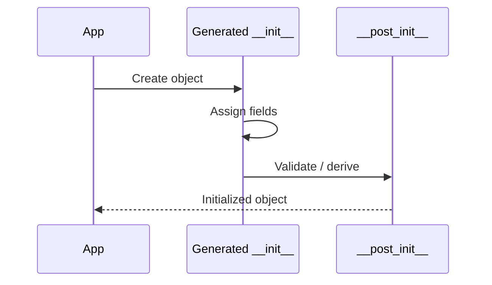
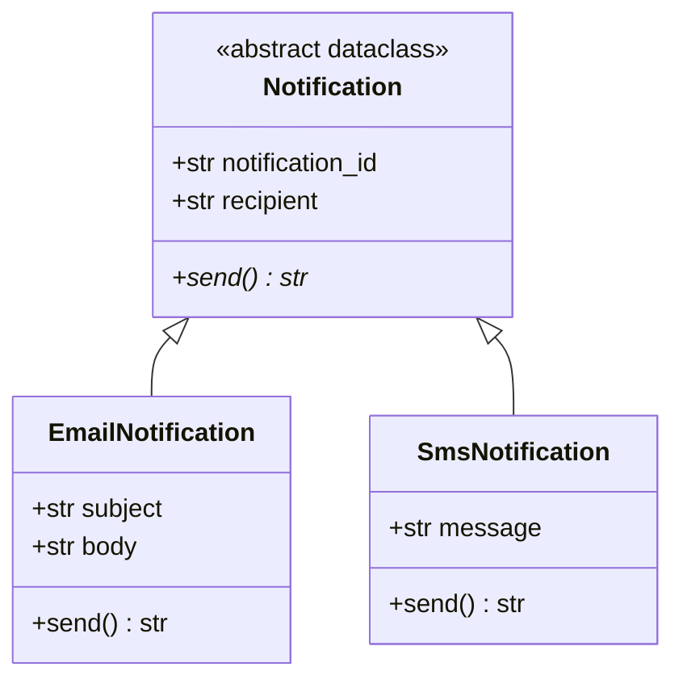
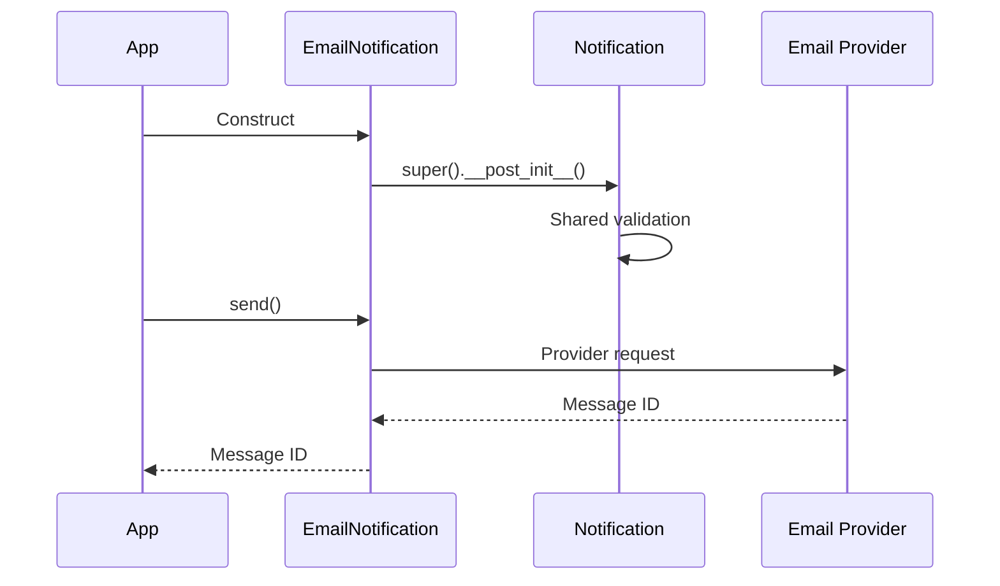
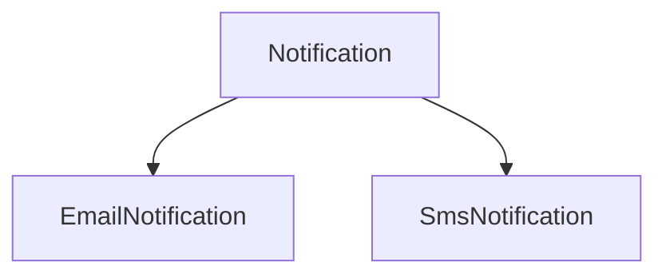

# Python `@dataclass` and Abstract Base Classes

> `@dataclass` mainly describes **what data an object holds**, while an **Abstract Base Class (ABC)** describes **what behavior subclasses must provide**.

## In short

- `@dataclass` generates common methods such as `__init__()`, `__repr__()`, and `__eq__()` from annotated fields.
- Type annotations describe expected types, but a standard data class does **not** validate them at runtime.
- Use `field(default_factory=...)` for mutable defaults such as lists and dictionaries.
- Use `__post_init__()` for lightweight validation, normalization, or derived fields.
- `frozen=True` blocks normal field reassignment, `kw_only=True` improves constructor readability, and `slots=True` gives instances a fixed attribute layout.
- An ABC uses `@abstractmethod` to define required behavior. A subclass cannot be instantiated until all abstract members are implemented.
- Use an ABC when runtime enforcement or shared base behavior matters; use `Protocol` when structural typing and loose coupling are enough.
- A class can be both a data class and an ABC when related implementations share state but provide different behavior.

```mermaid
flowchart LR
    A[Class design] --> B{Main requirement}
    B -->|Structured data| C[@dataclass]
    B -->|Required behavior| D[ABC]
    B -->|Both| E[@dataclass + ABC]
```

---

# 1. Big Picture

A normal Python class can contain both **state** and **behavior**. `@dataclass` and ABCs solve different parts of that design.

| Feature | Main Purpose | Common Use |
|---|---|---|
| `@dataclass` | Reduce boilerplate for structured objects | DTOs, configs, value objects |
| ABC | Define a required interface | Providers, gateways, exporters |
| Both | Share data and enforce behavior | Notifications, jobs, documents |

```text
@dataclass -> "What data does this object contain?"
ABC        -> "What must this object be able to do?"
```

---

# 2. `@dataclass`

The `dataclasses` module is part of the Python standard library. A data class is still a normal Python class; the decorator simply generates common methods from its annotated fields.

## 2.1 Basic Usage

```python
from dataclasses import dataclass


@dataclass
class Employee:
    employee_id: int
    name: str
    department: str


employee = Employee(101, "Aarav", "Engineering")
print(employee)
# Employee(employee_id=101, name='Aarav', department='Engineering')
```

By default, `@dataclass` commonly generates:

- `__init__()`
- `__repr__()`
- `__eq__()`

It can also generate ordering and hashing behavior when configured.

> **Important:** `employee_id: int` is only a type annotation. `@dataclass` itself normally does not reject a string passed to that field. Runtime validation must be added separately when required.

---

## 2.2 Important Data-Class Options

| Option | Default | Purpose |
|---|---:|---|
| `init` | `True` | Generate `__init__()` |
| `repr` | `True` | Generate `__repr__()` |
| `eq` | `True` | Generate field-based equality |
| `order` | `False` | Generate ordering methods |
| `frozen` | `False` | Block normal field reassignment/deletion |
| `kw_only` | `False` | Make generated constructor fields keyword-only |
| `slots` | `False` | Generate `__slots__` |
| `unsafe_hash` | `False` | Force hash generation in specialized cases |

A common value-object pattern is:

```python
@dataclass(frozen=True, slots=True)
class CacheKey:
    tenant_id: int
    resource_id: int
```

### `frozen=True`

Useful for values that should not normally change after creation, such as IDs, money values, coordinates, versions, and cache keys.

`frozen=True` is **shallow**. A list or dictionary stored inside the object can still be mutated even though the field itself cannot be reassigned.

### Hashing

A useful simplified rule is:

| `eq` | `frozen` | Typical Result |
|---:|---:|---|
| `True` | `True` | Hash normally generated |
| `True` | `False` | Normally unhashable |
| `False` | Any | Superclass hash behavior retained |

Avoid `unsafe_hash=True` unless you understand the consequences of hashing mutable state.

### `kw_only=True`

Useful when a class has many arguments, several values of the same type, or boolean flags.

```python
@dataclass(kw_only=True)
class DatabaseConfig:
    host: str
    port: int
    username: str
    timeout_seconds: int = 30


config = DatabaseConfig(
    host="localhost",
    port=5432,
    username="app_user",
)
```

### `slots=True`

Useful for large numbers of small, stable objects. It prevents arbitrary attributes by default and can reduce per-instance memory usage.

Treat slots as a design/performance choice, not something every data class needs.

---

## 2.3 `field()` and Mutable Defaults

Use `field()` when a particular field needs custom behavior.

The most common case is a mutable default:

```python
from dataclasses import dataclass, field


@dataclass
class RequestContext:
    tags: list[str] = field(default_factory=list)
```

`default_factory=list` creates a fresh list for every instance.

Common `field()` options:

| Option | Purpose |
|---|---|
| `default_factory=...` | Create a fresh default value |
| `init=False` | Exclude a derived/internal field from `__init__()` |
| `repr=False` | Hide a field from generated representation |
| `compare=False` | Exclude a field from equality/ordering |
| `kw_only=True` | Make only this field keyword-only |

For example, `secret: str = field(repr=False)` reduces accidental secret exposure in logs, although it does not encrypt or secure the value.

---

## 2.4 `__post_init__()`

When `@dataclass` generates `__init__()`, it calls `__post_init__()` after assigning the fields.

Use it for:

- Lightweight validation.
- Normalization.
- Derived values.
- Calling a required non-data-class base `__init__()`.



```python
from dataclasses import dataclass, field


@dataclass
class OrderLine:
    unit_price: float
    quantity: int
    total: float = field(init=False)

    def __post_init__(self) -> None:
        if self.unit_price < 0 or self.quantity <= 0:
            raise ValueError("Invalid order line")

        self.total = self.unit_price * self.quantity
```

Keep `__post_init__()` small. Database access, network calls, and larger workflows usually belong in services or explicit factory methods.

---

## 2.5 `ClassVar`, `InitVar`, and Helpers

### `ClassVar`

A `ClassVar` represents class-level data and is excluded from normal data-class field handling.

```python
from typing import ClassVar


@dataclass
class User:
    table_name: ClassVar[str] = "users"
    user_id: int
    username: str
```

### `InitVar`

An `InitVar` is accepted by the generated constructor and passed to `__post_init__()`, but is not stored as a normal data-class field.

It is useful for temporary construction inputs such as raw passwords, initialization context, or configuration needed only during setup.

### Common Helpers

| Function | Purpose |
|---|---|
| `asdict(obj)` | Recursively convert a data class to dictionaries |
| `astuple(obj)` | Recursively convert to tuples |
| `replace(obj, **changes)` | Create another instance with selected changes |
| `fields(obj)` | Inspect defined fields |
| `is_dataclass(obj)` | Check whether something is a data class |

`asdict()` recursively processes nested data classes and deep-copies other nested values, which is useful but can be heavier than a shallow conversion.

---

## 2.6 When to Use a Data Class

Good use cases:

- Configuration objects.
- Internal DTOs.
- Domain value objects.
- Commands and events.
- Cache keys.
- Test fixtures.
- Structured results passed between application layers.

A standard data class is usually not the best choice when runtime schema validation, parsing of untrusted JSON, or heavy construction workflows are the main requirement. In those cases, a validation/serialization framework may be a better fit.

---

# 3. Abstract Base Classes

An Abstract Base Class defines a common contract for related implementations. Python provides ABC support through the `abc` module.

## 3.1 Basic ABC

```python
from abc import ABC, abstractmethod


class Storage(ABC):
    @abstractmethod
    def upload(self, name: str, content: bytes) -> str:
        ...

    @abstractmethod
    def download(self, name: str) -> bytes:
        ...
```

A concrete subclass must implement all abstract members:

```python
class LocalStorage(Storage):
    def upload(self, name: str, content: bytes) -> str:
        return f"/tmp/{name}"

    def download(self, name: str) -> bytes:
        return b"example"
```

An incomplete subclass may be defined, but Python raises `TypeError` when you try to instantiate it.

That is the important distinction: **ABC enforcement happens at runtime during instantiation**.

---

## 3.2 Abstract and Concrete Behavior

An ABC can also contain shared concrete methods.

```python
class NotificationSender(ABC):
    @abstractmethod
    def send(self, recipient: str, message: str) -> None:
        ...

    def send_bulk(self, recipients: list[str], message: str) -> None:
        for recipient in recipients:
            self.send(recipient, message)
```

The base class defines the common workflow, while subclasses implement the varying step. This is a common form of the **Template Method** pattern.

An abstract method may even contain an implementation that a subclass calls with `super()`. It is still abstract because the subclass must explicitly override it before becoming concrete.

---

## 3.3 Abstract Properties and Decorator Order

ABCs can require instance methods, properties, class methods, and static methods.

```python
class PaymentGateway(ABC):
    @property
    @abstractmethod
    def provider_name(self) -> str:
        ...

    @classmethod
    @abstractmethod
    def from_config(cls, config: dict[str, object]) -> "PaymentGateway":
        ...
```

When combining decorators, `@abstractmethod` should be the **innermost** decorator.

```text
@property
@abstractmethod

def provider_name(...): ...
```

ABCs can also register unrelated classes as virtual subclasses with `register()`, but those classes do not inherit the ABC's implementation or normal abstract-method enforcement. In application code, explicit inheritance is usually easier to understand.

---

# 4. ABC vs Duck Typing vs `Protocol`

Python supports several ways to express a contract.

| Approach | Contract | Runtime Enforcement | Inheritance Required | Shared Base Logic |
|---|---|---:|---:|---:|
| Duck typing | Implicit | No | No | No |
| ABC | Explicit, inheritance-based | Yes | Usually yes | Yes |
| `Protocol` | Structural | Mainly static | No | Not the main purpose |

## Duck Typing

```python
def execute(job) -> None:
    job.run()
```

The object works as long as it provides the expected behavior.

## ABC

Use an ABC when:

- Missing required behavior should block concrete instantiation.
- You want a clear inheritance contract.
- Shared base implementation is useful.
- Runtime `isinstance()` / `issubclass()` behavior matters.

## `Protocol`

```python
from typing import Protocol


class Runnable(Protocol):
    def run(self) -> None:
        ...
```

A class can satisfy this protocol without inheriting from `Runnable`, as long as its structure matches what the type checker expects.

A practical rule:

> **ABC:** runtime contract + shared implementation.  
> **Protocol:** structural compatibility + loose coupling.

---

# 5. Practical Example: `@dataclass` + ABC

Suppose an application supports email and SMS notifications.

Requirements:

- Every notification has an ID and recipient.
- Shared construction validation should run automatically.
- Every notification type must implement `send()`.
- Each channel can have its own fields and sending logic.



## 5.1 Abstract Data-Class Contract

```python
from abc import ABC, abstractmethod
from dataclasses import dataclass


@dataclass(kw_only=True, slots=True)
class Notification(ABC):
    notification_id: str
    recipient: str

    def __post_init__(self) -> None:
        self.notification_id = self.notification_id.strip()
        self.recipient = self.recipient.strip()

        if not self.notification_id or not self.recipient:
            raise ValueError("Notification ID and recipient are required")

    @abstractmethod
    def send(self) -> str:
        ...
```

The data class provides the shared fields and generated constructor. The ABC provides the required `send()` contract.

## 5.2 Concrete Implementations

```python
@dataclass(kw_only=True, slots=True)
class EmailNotification(Notification):
    subject: str
    body: str

    def __post_init__(self) -> None:
        super().__post_init__()

        if "@" not in self.recipient:
            raise ValueError("Invalid email recipient")

    def send(self) -> str:
        # Real code would call an email provider.
        return f"email-{self.notification_id}"


@dataclass(kw_only=True, slots=True)
class SmsNotification(Notification):
    message: str

    def __post_init__(self) -> None:
        super().__post_init__()

        if not self.recipient.startswith("+"):
            raise ValueError("Phone number must include country code")

    def send(self) -> str:
        # Real code would call an SMS provider.
        return f"sms-{self.notification_id}"
```

## 5.3 Polymorphic Usage

```python
from collections.abc import Iterable


def send_all(notifications: Iterable[Notification]) -> list[str]:
    return [notification.send() for notification in notifications]
```

The caller depends on `Notification`, not on a concrete provider. That makes adding another implementation, such as push notification, much easier.



---

# 6. Design Guidelines

## 6.1 Keep Data Classes Focused

Data-class methods should usually operate directly on the object's state. Database calls, email delivery, and larger workflows belong in services.

## 6.2 Use `default_factory` for Mutable Fields

```python
metadata: dict[str, str] = field(default_factory=dict)
tags: list[str] = field(default_factory=list)
```

This gives each instance its own container.

## 6.3 Use Frozen Data Classes for Value Objects

IDs, money, coordinates, date ranges, versions, and cache keys are common candidates.

## 6.4 Keep ABC Contracts Small

Prefer focused interfaces instead of one large base class that forces every implementation to support unrelated operations. This aligns with the Interface Segregation Principle.

## 6.5 Depend on Abstractions at Boundaries

Prefer dependency injection:

```python
class FileService:
    def __init__(self, storage: Storage) -> None:
        self.storage = storage
```

instead of constructing a specific provider inside the service. This improves testing and provider replacement.

## 6.6 Prefer `Protocol` When Inheritance Is Not Needed

If you only need static structural compatibility, `Protocol` usually gives looser coupling than an ABC.

## 6.7 Avoid Deep Inheritance

Prefer shallow hierarchies:



Composition is often simpler than a long chain of base classes.

---

# 7. Interview-Focused Summary

```text
@dataclass
  -> models structured state with less boilerplate
  -> __init__, __repr__, __eq__ generated by default
  -> default_factory for mutable defaults
  -> __post_init__ for lightweight validation/derived values
  -> frozen for read-only-style value objects
  -> kw_only for readable constructors
  -> slots for fixed, potentially smaller instances

ABC
  -> defines required behavior with @abstractmethod
  -> incomplete subclasses cannot be instantiated
  -> may also contain reusable concrete behavior

Protocol
  -> structural typing without requiring inheritance
  -> useful when loose coupling and static checking are enough

@dataclass + ABC
  -> shared state + shared validation + required polymorphic behavior
```

The key distinction is: **a data class models state cleanly; an ABC models a behavioral contract.** Use them together only when the design genuinely needs both.

---

## Current Python Note

This content is aligned with Python 3.14 standard-library behavior. Python 3.14 also adds `doc=` to `dataclasses.field()` for field documentation, but the features covered above are the ones used far more often in everyday development and interviews.
