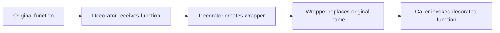
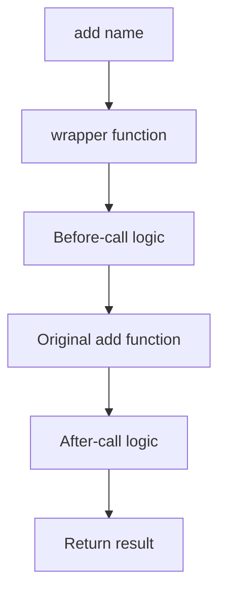
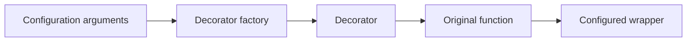
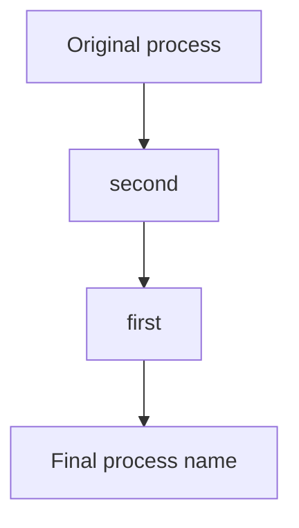

# Python Decorators: Function-Level and Class-Level

> A **decorator** takes a function or class, adds or changes behavior, and returns the object that should be used in its place.

Decorators are commonly used for:

- Logging and monitoring
- Authentication and authorization
- Validation
- Caching
- Retry and timeout logic
- Database transactions
- Framework registration
- Converting methods into properties, class methods, or static methods
- Generating or modifying classes

---

# 1. Decorator Mental Model

A decorator is usually a callable that:

1. Receives a function or class.
2. Creates or configures another callable.
3. Returns the replacement object.

```python
def decorator(target):
    # Add or modify behavior
    return target
```

The `@` syntax is only cleaner syntax for reassignment.

```python
@decorator
def process():
    pass
```

The above code is approximately equivalent to:

```python
def process():
    pass

process = decorator(process)
```

## Execution Flow



## Important Timing Rule

The decorator expression executes when Python executes the function or class definition, usually while importing the module.

The wrapper body normally executes later, whenever the decorated function is called.

```python
def register(func):
    print(f"Registering {func.__name__}")  # Runs at definition/import time
    return func


@register
def create_user():
    print("Creating user")  # Runs when create_user() is called
```

Possible output:

```text
Registering create_user
```

Later:

```python
create_user()
```

Output:

```text
Creating user
```

This distinction matters because decorators can perform registration during application startup.

---

# 2. Functions as First-Class Objects

Decorators work because Python treats functions as objects.

A function can be:

- Assigned to a variable
- Passed as an argument
- Returned from another function
- Stored in a collection
- Given attributes

```python
def greet(name: str) -> str:
    return f"Hello, {name}"


another_name = greet

print(another_name("Avadh"))
```

## Returning a Function

```python
from collections.abc import Callable


def choose_operation(operation: str) -> Callable[[int, int], int]:
    def add(a: int, b: int) -> int:
        return a + b

    def multiply(a: int, b: int) -> int:
        return a * b

    if operation == "add":
        return add

    return multiply
```

## Closures

A closure is an inner function that remembers values from its enclosing scope.

```python
from collections.abc import Callable


def multiplier(factor: int) -> Callable[[int], int]:
    def multiply(value: int) -> int:
        return value * factor

    return multiply


double = multiplier(2)
print(double(10))  # 20
```

Decorators with configuration use this same closure concept.

---

# 3. Function-Level Decorators

A function decorator commonly returns a wrapper function.

## Basic Example

```python
from collections.abc import Callable
from typing import Any


def log_call(func: Callable[..., Any]) -> Callable[..., Any]:
    def wrapper(*args: Any, **kwargs: Any) -> Any:
        print(f"Calling {func.__name__}")
        result = func(*args, **kwargs)
        print(f"Finished {func.__name__}")
        return result

    return wrapper


@log_call
def add(a: int, b: int) -> int:
    return a + b


print(add(2, 3))
```

Output:

```text
Calling add
Finished add
5
```

## What Happens Internally?

```python
add = log_call(add)
```

After decoration, the name `add` refers to `wrapper`, not directly to the original function.

The wrapper still reaches the original function through its closure.



## Why `*args` and `**kwargs` Are Used

A reusable decorator usually does not know the decorated function's exact parameters.

```python
def wrapper(*args, **kwargs):
    return func(*args, **kwargs)
```

- `*args` collects positional arguments.
- `**kwargs` collects keyword arguments.
- Forwarding both allows the wrapper to support many function signatures.

## Practical Timing Decorator

```python
from collections.abc import Callable
from functools import wraps
from time import perf_counter
from typing import Any, TypeVar

R = TypeVar("R")


def measure_time(func: Callable[..., R]) -> Callable[..., R]:
    @wraps(func)
    def wrapper(*args: Any, **kwargs: Any) -> R:
        started_at = perf_counter()

        try:
            return func(*args, **kwargs)
        finally:
            duration = perf_counter() - started_at
            print(f"{func.__name__} took {duration:.4f} seconds")

    return wrapper


@measure_time
def generate_report() -> str:
    return "report-ready"
```

Using `finally` ensures that timing is recorded even when the function raises an exception.

## Validation Decorator

```python
from collections.abc import Callable
from functools import wraps


def require_positive(func: Callable[[int], int]) -> Callable[[int], int]:
    @wraps(func)
    def wrapper(value: int) -> int:
        if value <= 0:
            raise ValueError("value must be positive")

        return func(value)

    return wrapper


@require_positive
def square(value: int) -> int:
    return value * value
```

---

# 4. Decorators with Arguments

A decorator such as `@retry(max_attempts=3)` needs an extra function level.

```python
@retry(max_attempts=3)
def fetch_data():
    ...
```

Think of it in three layers:

```text
retry(max_attempts=3)
        ↓
actual decorator
        ↓
wrapper
```

## General Structure

```python
def decorator_factory(configuration):
    def decorator(func):
        def wrapper(*args, **kwargs):
            # Use configuration
            return func(*args, **kwargs)

        return wrapper

    return decorator
```

## Retry Example

```python
from collections.abc import Callable
from functools import wraps
from typing import Any, TypeVar

R = TypeVar("R")


def retry(
    max_attempts: int = 3,
    exceptions: tuple[type[Exception], ...] = (Exception,),
) -> Callable[[Callable[..., R]], Callable[..., R]]:
    if max_attempts < 1:
        raise ValueError("max_attempts must be at least 1")

    def decorator(func: Callable[..., R]) -> Callable[..., R]:
        @wraps(func)
        def wrapper(*args: Any, **kwargs: Any) -> R:
            last_error: Exception | None = None

            for attempt in range(1, max_attempts + 1):
                try:
                    return func(*args, **kwargs)
                except exceptions as exc:
                    last_error = exc
                    print(
                        f"{func.__name__} failed "
                        f"on attempt {attempt}/{max_attempts}"
                    )

            if last_error is None:
                raise RuntimeError("Retry loop completed without a result")

            raise last_error

        return wrapper

    return decorator
```

Usage:

```python
@retry(max_attempts=3, exceptions=(ConnectionError, TimeoutError))
def call_external_service() -> str:
    raise ConnectionError("Service unavailable")
```

## Equivalent Manual Form

```python
call_external_service = retry(
    max_attempts=3,
    exceptions=(ConnectionError, TimeoutError),
)(call_external_service)
```

## Decorator Factory Flow



## Supporting Both `@decorator` and `@decorator(...)`

Some standard decorators support both forms:

```python
@cache_result
def first():
    ...
```

```python
@cache_result(max_size=100)
def second():
    ...
```

This is possible, but it increases implementation complexity. Prefer one clear API unless supporting both forms provides real value.

---

# 5. Preserving Function Metadata

A wrapper is a different function object. Without special handling, metadata belongs to the wrapper.

```python
def audit(func):
    def wrapper(*args, **kwargs):
        return func(*args, **kwargs)

    return wrapper


@audit
def calculate_total() -> int:
    """Calculate the final total."""
    return 100
```

Without metadata preservation:

```python
print(calculate_total.__name__)  # wrapper
print(calculate_total.__doc__)   # None
```

This can affect:

- Debugging
- Logging
- API documentation generation
- Dependency injection
- Runtime inspection
- Test utilities
- Framework routing
- Type-aware tooling

## Use `functools.wraps`

```python
from functools import wraps


def audit(func):
    @wraps(func)
    def wrapper(*args, **kwargs):
        return func(*args, **kwargs)

    return wrapper
```

`@wraps(func)` preserves important information such as:

- `__name__`
- `__qualname__`
- `__doc__`
- `__module__`
- `__annotations__`
- `__type_params__` in modern Python
- `__wrapped__`

## Accessing the Original Function

```python
original = calculate_total.__wrapped__
```

The `__wrapped__` chain also helps `inspect.signature()` recover the original signature.

```python
from inspect import signature

print(signature(calculate_total))
```

> **Rule:** Use `@functools.wraps` in almost every decorator that returns a wrapper function.

---

# 6. Stacking Multiple Decorators

Decorators are applied from the bottom upward.

```python
@first
@second
def process():
    pass
```

This is approximately equivalent to:

```python
process = first(second(process))
```

## Visual Order



## Call-Time Order

Assume each decorator adds logic before and after the wrapped call:

```text
first: before
    second: before
        original function
    second: after
first: after
```

## Example

```python
from collections.abc import Callable
from functools import wraps
from typing import Any, TypeVar

R = TypeVar("R")


def trace(label: str):
    def decorator(func: Callable[..., R]) -> Callable[..., R]:
        @wraps(func)
        def wrapper(*args: Any, **kwargs: Any) -> R:
            print(f"{label}: before")
            try:
                return func(*args, **kwargs)
            finally:
                print(f"{label}: after")

        return wrapper

    return decorator


@trace("outer")
@trace("inner")
def run() -> None:
    print("function body")
```

Output:

```text
outer: before
inner: before
function body
inner: after
outer: after
```

## Why Order Matters

These two declarations may behave differently:

```python
@authenticate
@transaction
def update_account():
    ...
```

```python
@transaction
@authenticate
def update_account():
    ...
```

In the first version, authentication happens before opening the transaction. That may be preferable because unauthorized requests should not consume transaction resources.

---

# 7. Stateful Decorators

A decorator may maintain state across calls.

## State Stored in a Closure

```python
from collections.abc import Callable
from functools import wraps
from typing import Any, TypeVar

R = TypeVar("R")


def count_calls(func: Callable[..., R]) -> Callable[..., R]:
    call_count = 0

    @wraps(func)
    def wrapper(*args: Any, **kwargs: Any) -> R:
        nonlocal call_count
        call_count += 1
        print(f"{func.__name__} call count: {call_count}")
        return func(*args, **kwargs)

    return wrapper
```

## Exposing State Deliberately

```python
from collections.abc import Callable
from functools import wraps
from typing import Any, Protocol, TypeVar, cast

R = TypeVar("R")


class CountedCallable(Protocol[R]):
    calls: int

    def __call__(self, *args: Any, **kwargs: Any) -> R:
        ...


def count_calls(func: Callable[..., R]) -> CountedCallable[R]:
    @wraps(func)
    def wrapper(*args: Any, **kwargs: Any) -> R:
        wrapper.calls += 1
        return func(*args, **kwargs)

    wrapper.calls = 0
    return cast(CountedCallable[R], wrapper)
```

## Concurrency Consideration

Mutable state inside a decorator may be shared across:

- Threads
- Async tasks
- Requests
- Test cases
- Application users

A plain counter increment is not a complete thread-safety strategy. For request-specific data, prefer:

- Function-local state
- Explicit context objects
- `contextvars.ContextVar` for async request context
- Proper synchronization where shared state is required

---

# 8. Decorating Instance, Class, and Static Methods

Method decorators require attention to how Python binds methods.

## Instance Method

```python
class UserService:
    def get_user(self, user_id: int) -> dict[str, int]:
        return {"id": user_id}
```

When called through an instance, Python automatically passes `self`.

```python
service = UserService()
service.get_user(10)
```

A normal reusable wrapper using `*args` and `**kwargs` naturally receives `self` as the first positional argument.

```python
from functools import wraps


def log_method(func):
    @wraps(func)
    def wrapper(*args, **kwargs):
        instance = args[0]
        print(f"Class: {type(instance).__name__}")
        return func(*args, **kwargs)

    return wrapper
```

## `@classmethod`

A class method receives `cls` rather than `self`.

```python
class User:
    def __init__(self, name: str) -> None:
        self.name = name

    @classmethod
    def anonymous(cls) -> "User":
        return cls(name="Anonymous")
```

Use a class method when logic:

- Needs the class object
- Creates alternative constructors
- Should work correctly for subclasses

```python
class AdminUser(User):
    pass


admin = AdminUser.anonymous()
print(type(admin).__name__)  # AdminUser
```

## `@staticmethod`

A static method receives neither `self` nor `cls`.

```python
class PriceCalculator:
    @staticmethod
    def add_tax(amount: float, tax_rate: float) -> float:
        return amount * (1 + tax_rate)
```

Use a static method when the function:

- Logically belongs to the class namespace
- Does not require instance state
- Does not require class state

A module-level function may still be simpler when there is no strong class relationship.

## Decorator Order with `classmethod` and `staticmethod`

For custom function decorators, the custom decorator is commonly placed closest to `def`, while `@classmethod` or `@staticmethod` is placed above it.

```python
class UserService:
    @classmethod
    @log_call
    def build_default(cls):
        return cls()
```

Transformation:

```python
build_default = classmethod(log_call(build_default))
```

`log_call` receives the original function, and `classmethod` performs method binding afterward.

This ordering is generally easier for ordinary function decorators.

## `@property`

`property` lets a method be accessed like an attribute.

```python
class Rectangle:
    def __init__(self, width: float, height: float) -> None:
        self.width = width
        self.height = height

    @property
    def area(self) -> float:
        return self.width * self.height
```

Usage:

```python
rectangle = Rectangle(4, 5)
print(rectangle.area)  # No parentheses
```

### Property Setter

```python
class Product:
    def __init__(self, price: float) -> None:
        self.price = price

    @property
    def price(self) -> float:
        return self._price

    @price.setter
    def price(self, value: float) -> None:
        if value < 0:
            raise ValueError("price cannot be negative")

        self._price = value
```

The getter must be defined before `@price.setter`.

## Binding Overview

| Method type | Implicit argument | Typical use |
|---|---:|---|
| Instance method | `self` | Work with instance state |
| `@classmethod` | `cls` | Alternative constructors and class-aware behavior |
| `@staticmethod` | None | Utility logically grouped with the class |
| `@property` | `self` during attribute access | Managed or computed attributes |

---

# 9. Common Built-in Function Decorators

## `functools.cache`

Caches every distinct call result.

```python
from functools import cache


@cache
def fibonacci(number: int) -> int:
    if number < 2:
        return number

    return fibonacci(number - 1) + fibonacci(number - 2)
```

Use it when:

- Arguments are hashable
- The function is deterministic
- Unbounded cache growth is acceptable

Avoid caching functions whose result depends on changing external state unless cache invalidation is explicitly handled.

## `functools.lru_cache`

Caches a limited number of recent results.

```python
from functools import lru_cache


@lru_cache(maxsize=256)
def load_configuration(tenant_id: str) -> dict[str, str]:
    ...
```

Useful inspection methods:

```python
load_configuration.cache_info()
load_configuration.cache_clear()
load_configuration.cache_parameters()
```

Important points:

- Arguments must be hashable.
- Cache keys depend on how arguments are passed.
- Method caches include `self` in the key.
- Cached values can become stale.
- Cache entries keep references to arguments and return values.

## `functools.cached_property`

Computes a property once and stores the result on the instance.

```python
from functools import cached_property


class Report:
    def __init__(self, rows: list[int]) -> None:
        self.rows = rows

    @cached_property
    def total(self) -> int:
        print("Calculating total")
        return sum(self.rows)
```

```python
report = Report([10, 20, 30])

print(report.total)  # Calculates
print(report.total)  # Uses stored value
```

To force recalculation:

```python
del report.total
```

Considerations:

- The object generally needs a writable `__dict__`.
- The calculated value can become stale if dependent state changes.
- Concurrent access may calculate the value more than once; make the calculation safe to repeat or add synchronization.

## `functools.singledispatch`

Selects an implementation based on the type of the first argument.

```python
from functools import singledispatch
from typing import Any


@singledispatch
def serialize(value: Any) -> str:
    raise TypeError(f"Unsupported type: {type(value).__name__}")


@serialize.register
def _(value: int) -> str:
    return str(value)


@serialize.register
def _(value: list) -> str:
    return ",".join(map(str, value))
```

This is runtime type-based dispatch, not static typing overload resolution.

## `contextlib.contextmanager`

Converts a generator function into a context manager.

```python
from contextlib import contextmanager
from collections.abc import Iterator


@contextmanager
def managed_resource() -> Iterator[str]:
    resource = "connected"
    try:
        yield resource
    finally:
        print("Resource released")
```

## `abc.abstractmethod`

Marks a method that concrete subclasses must implement.

```python
from abc import ABC, abstractmethod


class PaymentGateway(ABC):
    @abstractmethod
    def charge(self, amount: float) -> str:
        ...
```

---

# 10. Class-Level Decorators

A class decorator receives a class and returns the class object that should replace it.

```python
def class_decorator(cls):
    return cls
```

Usage:

```python
@class_decorator
class Service:
    pass
```

Equivalent form:

```python
class Service:
    pass


Service = class_decorator(Service)
```

## Adding a Class Attribute

```python
from typing import TypeVar

T = TypeVar("T", bound=type)


def versioned(version: str):
    def decorator(cls: T) -> T:
        cls.api_version = version
        return cls

    return decorator


@versioned("v2")
class UserAPI:
    pass
```

A type checker may need a more advanced protocol or cast when dynamically added attributes are accessed.

## Class Registration

Frameworks often use class decorators to register handlers, plugins, commands, or serializers.

```python
from typing import Any

HANDLERS: dict[str, type[Any]] = {}


def handler(event_name: str):
    def decorator(cls: type[Any]) -> type[Any]:
        if event_name in HANDLERS:
            raise ValueError(f"Handler already registered: {event_name}")

        HANDLERS[event_name] = cls
        return cls

    return decorator


@handler("user.created")
class UserCreatedHandler:
    def handle(self, payload: dict[str, Any]) -> None:
        print(payload)
```

The class is registered when its module is imported.


## Wrapping a Class

A class decorator can return a subclass or another callable instead of the original class.

```python
from typing import Any


def trace_creation(cls: type[Any]):
    class TracedClass(cls):
        def __init__(self, *args: Any, **kwargs: Any) -> None:
            print(f"Creating {cls.__name__}")
            super().__init__(*args, **kwargs)

    TracedClass.__name__ = cls.__name__
    TracedClass.__qualname__ = cls.__qualname__
    return TracedClass
```

However, replacing the class can affect:

- `isinstance()` behavior
- Pickling
- Introspection
- Type checking
- ORM and framework metadata
- Dataclass behavior
- Multiple inheritance

Prefer modifying and returning the original class when that is sufficient.

## Validating Class Structure

```python
from typing import TypeVar

T = TypeVar("T", bound=type)


def require_method(method_name: str):
    def decorator(cls: T) -> T:
        method = getattr(cls, method_name, None)

        if not callable(method):
            raise TypeError(
                f"{cls.__name__} must define callable {method_name!r}"
            )

        return cls

    return decorator


@require_method("execute")
class Command:
    def execute(self) -> None:
        print("Executed")
```

The validation runs at class definition/import time.

## `@dataclass`

`dataclasses.dataclass` is a standard class decorator that can generate methods such as:

- `__init__`
- `__repr__`
- `__eq__`
- Ordering methods when enabled
- Hash behavior under configured rules

```python
from dataclasses import dataclass


@dataclass(slots=True, frozen=True)
class Coordinate:
    latitude: float
    longitude: float
```

The class decorator examines annotated fields and modifies the class accordingly.

---

# 11. Class-Based Decorators

A decorator itself can be implemented as a class.

The decorator instance must be callable through `__call__`.

## Decorating a Plain Function

```python
from collections.abc import Callable
from functools import update_wrapper
from typing import Any, Generic, TypeVar

R = TypeVar("R")


class CountCalls(Generic[R]):
    def __init__(self, func: Callable[..., R]) -> None:
        self.func = func
        self.calls = 0
        update_wrapper(self, func)

    def __call__(self, *args: Any, **kwargs: Any) -> R:
        self.calls += 1
        print(f"Call number: {self.calls}")
        return self.func(*args, **kwargs)


@CountCalls
def send_notification(message: str) -> str:
    return f"Sent: {message}"
```

## Important Method-Binding Issue

Functions defined in classes implement the descriptor protocol, which is why Python automatically binds `self`.

A plain callable decorator instance does not automatically behave exactly like a function descriptor.

This can break instance methods:

```python
class Service:
    @CountCalls
    def execute(self) -> None:
        ...
```

A robust class-based method decorator needs `__get__`.

```python
from collections.abc import Callable
from functools import update_wrapper
from types import MethodType
from typing import Any, Generic, TypeVar

R = TypeVar("R")


class CountCalls(Generic[R]):
    def __init__(self, func: Callable[..., R]) -> None:
        self.func = func
        self.calls = 0
        update_wrapper(self, func)

    def __call__(self, *args: Any, **kwargs: Any) -> R:
        self.calls += 1
        return self.func(*args, **kwargs)

    def __get__(self, instance: Any, owner: type[Any]) -> Any:
        if instance is None:
            return self

        return MethodType(self, instance)
```

For most decorators, a closure-based function implementation is simpler and less error-prone.

## When Class-Based Decorators Are Useful

Use a class-based decorator when:

- Significant state must be maintained.
- Several helper methods make the implementation clearer.
- The wrapper has a meaningful object-oriented lifecycle.
- Configuration and runtime state need structured separation.

---

# 12. Function Decorator vs Class Decorator vs Metaclass

These concepts operate at different levels.

| Mechanism | Receives | Applies to | Typical purpose |
|---|---|---|---|
| Function decorator | Function/callable | One function or method | Logging, validation, caching |
| Class decorator | Class object | One specific class | Registration, validation, class modification |
| `__init_subclass__` | New subclass | Future subclasses | Enforce or configure subclass behavior |
| Metaclass | Class name, bases, namespace | Class creation process | Framework-level class construction control |

## Class Decorator

```python
@register
class Plugin:
    pass
```

Only the decorated class is directly affected.

## `__init_subclass__`

```python
class Plugin:
    registry: list[type["Plugin"]] = []

    def __init_subclass__(cls, **kwargs) -> None:
        super().__init_subclass__(**kwargs)
        Plugin.registry.append(cls)


class EmailPlugin(Plugin):
    pass
```

Every future subclass triggers `Plugin.__init_subclass__`.

## Metaclass

```python
class ModelMeta(type):
    def __new__(mcls, name, bases, namespace):
        namespace["model_name"] = name.lower()
        return super().__new__(mcls, name, bases, namespace)


class Model(metaclass=ModelMeta):
    pass
```

Metaclasses are powerful but introduce more complexity and possible conflicts. Prefer:

1. A normal function
2. A function decorator
3. A class decorator
4. `__init_subclass__`
5. A metaclass only when class-creation control genuinely requires it

---

# 13. Decorators with Async and Generator Functions

A decorator must preserve the execution model of the wrapped callable.

## Async Function Decorator

Do not wrap an async function with an ordinary synchronous wrapper that forgets to await it.

Correct pattern:

```python
from collections.abc import Awaitable, Callable
from functools import wraps
from typing import Any, TypeVar

R = TypeVar("R")


def log_async(
    func: Callable[..., Awaitable[R]],
) -> Callable[..., Awaitable[R]]:
    @wraps(func)
    async def wrapper(*args: Any, **kwargs: Any) -> R:
        print(f"Starting {func.__name__}")
        try:
            return await func(*args, **kwargs)
        finally:
            print(f"Finished {func.__name__}")

    return wrapper
```

Usage:

```python
@log_async
async def fetch_user(user_id: int) -> dict[str, int]:
    return {"id": user_id}
```

## Supporting Sync and Async Functions

```python
import inspect
from functools import wraps
from typing import Any


def log_call(func):
    if inspect.iscoroutinefunction(func):
        @wraps(func)
        async def async_wrapper(*args: Any, **kwargs: Any):
            print(f"Calling async {func.__name__}")
            return await func(*args, **kwargs)

        return async_wrapper

    @wraps(func)
    def sync_wrapper(*args: Any, **kwargs: Any):
        print(f"Calling sync {func.__name__}")
        return func(*args, **kwargs)

    return sync_wrapper
```

Keeping separate `sync` and `async` decorators can still provide clearer typing and behavior.

## Generator Function Decorator

Calling a generator function returns a generator; its body executes during iteration.

```python
from collections.abc import Callable, Iterator
from functools import wraps
from typing import TypeVar

T = TypeVar("T")


def trace_items(
    func: Callable[..., Iterator[T]],
) -> Callable[..., Iterator[T]]:
    @wraps(func)
    def wrapper(*args, **kwargs) -> Iterator[T]:
        for item in func(*args, **kwargs):
            print(f"Yielding: {item!r}")
            yield item

    return wrapper
```

Be clear whether timing should measure:

- Generator object creation
- Full iteration
- Time between yielded values

---

# 14. Typing Decorators

Some decorators guide static type checkers rather than enforcing runtime behavior.

## `@typing.override`

Marks a method that is intended to override a base-class method.

```python
from typing import override


class BaseRepository:
    def save(self, value: object) -> None:
        ...


class UserRepository(BaseRepository):
    @override
    def save(self, value: object) -> None:
        print("Saving user")
```

A type checker can report an error when:

- The base method was renamed.
- The method name is misspelled.
- No matching base member exists.

Python does not enforce the override relationship at runtime.

## `@typing.final`

Indicates that a method should not be overridden or a class should not be subclassed.

```python
from typing import final


class BaseService:
    @final
    def validate_security(self) -> None:
        ...


@final
class SecurityConfiguration:
    ...
```

This is primarily a static type-checking contract, not runtime enforcement.

## Preserving Type Signatures with `ParamSpec`

`Callable[..., R]` preserves the return type but loses precise parameter information.

`ParamSpec` can preserve the complete callable signature.

```python
from collections.abc import Callable
from functools import wraps
from typing import ParamSpec, TypeVar

P = ParamSpec("P")
R = TypeVar("R")


def logged(func: Callable[P, R]) -> Callable[P, R]:
    @wraps(func)
    def wrapper(*args: P.args, **kwargs: P.kwargs) -> R:
        print(f"Calling {func.__name__}")
        return func(*args, **kwargs)

    return wrapper
```

For decorators that add or remove parameters, consider `Concatenate` or a protocol.

---

# 15. Production Patterns

## Authentication and Authorization

```python
from collections.abc import Callable
from functools import wraps
from typing import Any, ParamSpec, TypeVar

P = ParamSpec("P")
R = TypeVar("R")


class PermissionDenied(Exception):
    pass


def require_role(role: str):
    def decorator(func: Callable[P, R]) -> Callable[P, R]:
        @wraps(func)
        def wrapper(*args: P.args, **kwargs: P.kwargs) -> R:
            current_user = kwargs.get("current_user")

            if current_user is None:
                raise PermissionDenied("Authentication required")

            if role not in current_user.roles:
                raise PermissionDenied(f"Required role: {role}")

            return func(*args, **kwargs)

        return wrapper

    return decorator
```

In a web application, request context should normally come from the framework or an explicit dependency rather than hidden global state.

## Transaction Boundary

Conceptual pattern:

```python
from functools import wraps


def transactional(func):
    @wraps(func)
    def wrapper(*args, **kwargs):
        with database.transaction():
            return func(*args, **kwargs)

    return wrapper
```

Keep transaction ownership clear. Nested transaction decorators and broad transaction scopes can create performance or rollback surprises.

## Structured Logging

```python
from functools import wraps
from time import perf_counter


def observed(operation: str):
    def decorator(func):
        @wraps(func)
        def wrapper(*args, **kwargs):
            started_at = perf_counter()

            try:
                result = func(*args, **kwargs)
            except Exception:
                logger.exception(
                    "operation_failed",
                    extra={"operation": operation},
                )
                raise
            else:
                logger.info(
                    "operation_succeeded",
                    extra={"operation": operation},
                )
                return result
            finally:
                logger.info(
                    "operation_duration",
                    extra={
                        "operation": operation,
                        "duration_seconds": perf_counter() - started_at,
                    },
                )

        return wrapper

    return decorator
```

Do not log passwords, tokens, personal data, or complete request payloads without explicit redaction.

## Registration

```python
COMMANDS: dict[str, callable] = {}


def command(name: str):
    def decorator(func):
        if name in COMMANDS:
            raise ValueError(f"Duplicate command: {name}")

        COMMANDS[name] = func
        return func

    return decorator
```

Registries are simple and useful, but import order determines when registrations become available.

## Caching

Use caching decorators only when the function behaves like:

```text
same valid inputs + same relevant state = same result
```

Always define:

- Cache key
- Maximum size
- Expiration strategy, when needed
- Invalidation strategy
- Whether errors are cached
- Whether user-specific data can leak across requests

Standard `functools.cache` and `lru_cache` do not provide time-based expiration.

## Retry

Retry only errors that may succeed later, such as temporary network failures.

Avoid retrying:

- Validation errors
- Permission errors
- Deterministic programming errors
- Non-idempotent operations without an idempotency strategy

Production retry logic commonly adds:

- Exponential backoff
- Jitter
- A maximum total duration
- Error filtering
- Cancellation support
- Metrics and structured logs

---

# 16. Testing Decorated Code

## Test Observable Behavior

```python
def test_require_positive_rejects_zero() -> None:
    @require_positive
    def identity(value: int) -> int:
        return value

    try:
        identity(0)
    except ValueError as exc:
        assert str(exc) == "value must be positive"
    else:
        raise AssertionError("ValueError was not raised")
```

With `pytest`:

```python
import pytest


def test_require_positive_rejects_zero() -> None:
    @require_positive
    def identity(value: int) -> int:
        return value

    with pytest.raises(ValueError, match="must be positive"):
        identity(0)
```

## Test That the Original Function Is Called

```python
def test_decorator_forwards_arguments() -> None:
    received: list[tuple[int, int]] = []

    @log_call
    def add(a: int, b: int) -> int:
        received.append((a, b))
        return a + b

    assert add(2, 3) == 5
    assert received == [(2, 3)]
```

## Test Metadata

```python
def test_metadata_is_preserved() -> None:
    @log_call
    def process(value: int) -> int:
        """Process a value."""
        return value

    assert process.__name__ == "process"
    assert process.__doc__ == "Process a value."
    assert process.__wrapped__ is not None
```

## Test the Undecorated Function

When `@wraps` is used:

```python
original = process.__wrapped__
```

This can help isolate:

- Core business logic tests
- Wrapper policy tests
- Integration tests for the combined behavior

Do not make every test bypass the decorator. Important policies such as authorization and transactions must also be tested through the decorated entry point.

## Dependency Injection Improves Testing

Instead of hard-coding a dependency inside a decorator:

```python
def audited(logger):
    def decorator(func):
        ...
```

Tests can pass a fake logger and assert emitted events.

---

# 17. Best Practices

## Keep Decorators Focused

A decorator should represent one clear cross-cutting concern.

Good examples:

- `@require_permission("invoice.read")`
- `@measure_time`
- `@transactional`
- `@retry(...)`

A decorator that handles authentication, caching, retries, validation, and response formatting becomes difficult to understand and test.

## Always Preserve Metadata

```python
@wraps(func)
def wrapper(*args, **kwargs):
    return func(*args, **kwargs)
```

Use `functools.update_wrapper` for callable objects.

## Return the Original Result

Unless transformation is intentional:

```python
def wrapper(*args, **kwargs):
    result = func(*args, **kwargs)
    return result
```

Forgetting `return` silently changes the decorated function's result to `None`.

## Forward Arguments Correctly

```python
def wrapper(*args, **kwargs):
    return func(*args, **kwargs)
```

Do not accidentally drop positional or keyword arguments.

## Re-Raise Exceptions Correctly

Use:

```python
try:
    result = func(*args, **kwargs)
except Exception:
    logger.exception("Operation failed")
    raise
```

A bare `raise` preserves the original traceback.

## Avoid Catching `BaseException`

Normally catch `Exception`, not `BaseException`.

`BaseException` also includes control-flow exceptions such as:

- `KeyboardInterrupt`
- `SystemExit`
- `GeneratorExit`

## Make Side Effects Visible

Registration at import time may be appropriate, but developers should be able to discover it easily.

Use clear names and keep module import behavior predictable.

## Document Decorator Order

When multiple decorators are stacked, explain required ordering near the implementation or API documentation.

## Avoid Hidden Global Context

A decorator that silently depends on mutable globals becomes difficult to test and unsafe under concurrency.

Prefer explicit inputs, dependency injection, framework-supported context, or `ContextVar` where appropriate.

## Handle Async Functions Explicitly

An async function normally needs an `async def` wrapper with `await`.

## Use Standard Decorators First

Before implementing custom logic, check whether the standard library already provides the needed behavior:

- `functools.cache`
- `functools.lru_cache`
- `functools.cached_property`
- `functools.singledispatch`
- `contextlib.contextmanager`
- `dataclasses.dataclass`
- `abc.abstractmethod`
- `typing.override`
- `typing.final`

## Prefer Readability Over Decorator Density

This is difficult to reason about:

```python
@one
@two
@three
@four
@five
def process():
    ...
```

When ordering and behavior are not obvious, use an explicit service layer, middleware pipeline, or composed function.

---

# 18. Quick Revision

## Core Transformation

```python
@decorator
def func():
    pass
```

Equivalent idea:

```python
func = decorator(func)
```

## Decorator with Configuration

```python
@decorator_factory(config)
def func():
    pass
```

Equivalent idea:

```python
func = decorator_factory(config)(func)
```

## Stacked Decorators

```python
@outer
@inner
def func():
    pass
```

Equivalent idea:

```python
func = outer(inner(func))
```

## Class Decorator

```python
@decorate_class
class Service:
    pass
```

Equivalent idea:

```python
Service = decorate_class(Service)
```

## Standard Function Decorator Template

```python
from collections.abc import Callable
from functools import wraps
from typing import ParamSpec, TypeVar

P = ParamSpec("P")
R = TypeVar("R")


def decorator(func: Callable[P, R]) -> Callable[P, R]:
    @wraps(func)
    def wrapper(*args: P.args, **kwargs: P.kwargs) -> R:
        # Before
        result = func(*args, **kwargs)
        # After
        return result

    return wrapper
```

## Standard Configurable Decorator Template

```python
from collections.abc import Callable
from functools import wraps
from typing import ParamSpec, TypeVar

P = ParamSpec("P")
R = TypeVar("R")


def decorator_factory(option: str):
    def decorator(func: Callable[P, R]) -> Callable[P, R]:
        @wraps(func)
        def wrapper(*args: P.args, **kwargs: P.kwargs) -> R:
            print(option)
            return func(*args, **kwargs)

        return wrapper

    return decorator
```

## Standard Class Decorator Template

```python
from typing import TypeVar

T = TypeVar("T", bound=type)


def class_decorator(cls: T) -> T:
    # Validate or modify cls
    return cls
```

## Final Mental Model

```text
Function decorator:
    function -> decorator -> wrapped/replacement function

Class decorator:
    class -> decorator -> modified/replacement class

Decorator factory:
    configuration -> decorator -> target -> replacement

Stacked decorators:
    apply bottom-up, execute wrappers outside-in
```

The main idea is not the `@` symbol. The main idea is **callable transformation and reassignment**.

---

# References

- [Python Language Reference — Function and class definitions](https://docs.python.org/3/reference/compound_stmts.html)
- [Python Standard Library — functools](https://docs.python.org/3/library/functools.html)
- [Python Built-in Functions — classmethod, staticmethod, property](https://docs.python.org/3/library/functions.html)
- [Python Standard Library — dataclasses](https://docs.python.org/3/library/dataclasses.html)
- [Python Standard Library — typing](https://docs.python.org/3/library/typing.html)
- [Python Descriptor Guide](https://docs.python.org/3/howto/descriptor.html)
