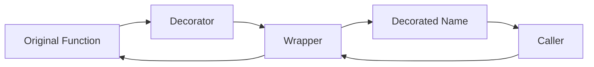
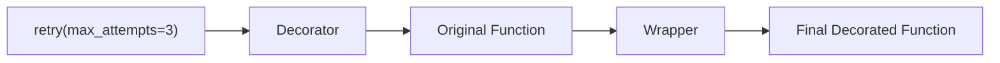
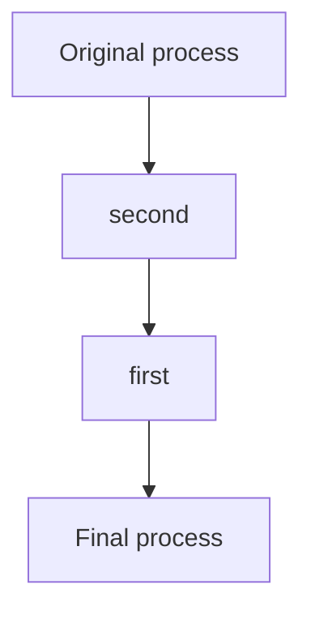

# Python Decorators: Function-Level and Class-Level

> A **decorator** is a callable that receives a function or class and returns the object that should be used in its place. It is mainly used to add reusable behavior without changing the original business logic.

## In Short

- `@decorator` is syntax sugar for reassignment: `func = decorator(func)`.
- Decorators are commonly used for **logging, authorization, caching, retries, validation, transactions, metrics, and registration**.
- The decorator itself runs when Python executes the definition, usually during module import.
- The returned wrapper runs later whenever the decorated function is called.
- Reusable wrappers normally forward `*args` and `**kwargs`.
- Use `@functools.wraps(func)` when returning a wrapper function.
- A configurable decorator such as `@retry(max_attempts=3)` needs an extra factory layer.
- Multiple decorators are applied **bottom-up**, while wrapper execution is typically **outside-in**.
- Async functions need async-aware decorators that `await` the original coroutine.
- `ParamSpec` is the preferred typing tool when a decorator preserves a callable's parameter signature.



---

# 1. How Decorators Work

Python decorators are possible because **functions are first-class objects**. A function can be assigned to a variable, passed to another function, returned from a function, or stored in a collection.

The basic idea is:

```python
def decorator(func):
    def wrapper(*args, **kwargs):
        return func(*args, **kwargs)

    return wrapper
```

Using it with `@`:

```python
@decorator
def process():
    ...
```

is approximately equivalent to:

```python
def process():
    ...

process = decorator(process)
```

The name `process` now points to the object returned by `decorator`.

## Decoration Time vs Call Time

This distinction is important in frameworks.

```text
Module import / definition time
        |
        v
decorator(original_function)
        |
        v
wrapper stored under original name
        |
        | later
        v
wrapper(...)
        |
        v
original_function(...)
```

A registration decorator can therefore add a function or class to a registry while the module is being imported, while a logging decorator normally performs its logging when the wrapper is called.

---

# 2. Closures: The Core Mechanism

Most function decorators use a **closure**.

A closure is an inner function that remembers values from the surrounding function even after the surrounding function has finished.

In a decorator:

```text
decorator receives func
        |
        v
wrapper captures func
        |
        v
decorator returns wrapper
        |
        v
wrapper can still call func later
```

That captured reference is what lets the wrapper add behavior before or after the original call.

---

# 3. Practical Example: A Configurable Retry Decorator

This single example covers the most important decorator concepts used in real applications:

- Decorator factory
- Closure
- `*args` and `**kwargs`
- `functools.wraps`
- Exception handling
- Return-value preservation
- Type-safe signatures with `ParamSpec`

```python
from collections.abc import Callable
from functools import wraps
from typing import ParamSpec, TypeVar

P = ParamSpec("P")
R = TypeVar("R")


def retry(
    max_attempts: int = 3,
    exceptions: tuple[type[Exception], ...] = (Exception,),
) -> Callable[[Callable[P, R]], Callable[P, R]]:

    if max_attempts < 1:
        raise ValueError("max_attempts must be at least 1")

    def decorator(func: Callable[P, R]) -> Callable[P, R]:

        @wraps(func)
        def wrapper(*args: P.args, **kwargs: P.kwargs) -> R:
            last_error: Exception | None = None

            for attempt in range(1, max_attempts + 1):
                try:
                    return func(*args, **kwargs)
                except exceptions as exc:
                    last_error = exc
                    print(
                        f"{func.__name__} failed "
                        f"({attempt}/{max_attempts})"
                    )

            assert last_error is not None
            raise last_error

        return wrapper

    return decorator


@retry(
    max_attempts=3,
    exceptions=(ConnectionError, TimeoutError),
)
def fetch_payment_status(payment_id: str) -> str:
    # External API call would happen here.
    return f"status-for-{payment_id}"
```

## What Happens Internally?

The declaration:

```python
@retry(max_attempts=3)
def fetch_payment_status(...):
    ...
```

is conceptually:

```python
fetch_payment_status = retry(
    max_attempts=3
)(fetch_payment_status)
```

The layers are:



## Why `*args` and `**kwargs` Matter

A reusable decorator usually does not know the exact signature of the function it will receive.

- `*args` forwards positional arguments.
- `**kwargs` forwards keyword arguments.
- `ParamSpec` lets static type checkers preserve the original parameter types.

Without correct forwarding, a decorator may work for one function but fail when applied to another.

---

# 4. Why `functools.wraps` Matters

The wrapper is a different function object. Without `@wraps(func)`, metadata from the original function is hidden by the wrapper.

This can affect:

- `__name__`
- `__qualname__`
- `__doc__`
- `__module__`
- annotations
- runtime inspection
- generated API documentation
- debugging and logging

Recommended pattern:

```python
from functools import wraps

def decorator(func):
    @wraps(func)
    def wrapper(*args, **kwargs):
        return func(*args, **kwargs)

    return wrapper
```

`wraps` also exposes the original callable through `__wrapped__`, which is useful for introspection and tooling.

> **Rule:** If your decorator returns a wrapper function, use `@wraps(func)` unless you intentionally want to replace the original metadata.

---

# 5. Decorators With and Without Arguments

## Simple Decorator

A normal decorator receives the function directly:

```text
@decorator
    |
    v
decorator(function)
    |
    v
wrapper
```

It therefore needs two conceptual layers:

```text
decorator -> wrapper
```

## Configurable Decorator

A configurable decorator is called before it receives the target function:

```text
@retry(max_attempts=3)
```

It needs three conceptual layers:

```text
factory -> decorator -> wrapper
```

This is one of the most important decorator patterns to recognize in code reviews and interviews.

---

# 6. Stacking Multiple Decorators

Decorators are applied from the bottom upward.

```python
@first
@second
def process():
    ...
```

is approximately:

```python
process = first(second(process))
```

## Application Order



If both wrappers execute logic before and after the wrapped call, runtime flow usually looks like:

```text
first: before
    second: before
        original function
    second: after
first: after
```

This matters when combining concerns such as:

```text
authentication
transaction
caching
logging
rate limiting
```

For example, authentication is often better placed outside a transaction so unauthorized requests do not open unnecessary database transactions.

---

# 7. Decorating Methods

Instance methods, class methods, and static methods behave differently because Python's descriptor protocol controls method binding.

| Method type | Implicit argument | Typical use |
|---|---|---|
| Instance method | `self` | Work with instance state |
| `@classmethod` | `cls` | Alternative constructors or class-aware behavior |
| `@staticmethod` | None | Utility logically grouped with a class |
| `@property` | `self` on attribute access | Managed or computed attributes |

A normal wrapper using `*args` and `**kwargs` works naturally with instance methods because `self` is simply the first positional argument.

For custom decorators with `@classmethod`, this order is commonly the simplest:

```python
class Service:
    @classmethod
    @custom_decorator
    def build(cls):
        ...
```

Conceptually:

```text
classmethod(custom_decorator(original_function))
```

The custom decorator receives a normal function, and `classmethod` handles class binding afterward.

---

# 8. Function Decorator vs Class Decorator

A **function decorator** receives a function or callable. A **class decorator** receives a class object.

## Function Decorator

Typical uses:

- Logging
- Validation
- Authorization
- Retry
- Caching
- Metrics
- Transaction boundaries

## Class Decorator

Basic shape:

```python
def class_decorator(cls):
    # validate, register, or modify cls
    return cls
```

Typical uses:

- Registering handlers or plugins
- Validating class structure
- Adding class metadata
- Generating behavior

`@dataclass` is a well-known standard-library class decorator.

## Class Decorator vs `__init_subclass__` vs Metaclass

| Mechanism | Best suited for |
|---|---|
| Function decorator | Behavior around one function/method |
| Class decorator | Modify or register one decorated class |
| `__init_subclass__` | Automatically react to future subclasses |
| Metaclass | Control the class-creation process itself |

Prefer the simplest mechanism that solves the problem. Metaclasses are powerful, but most application-level cases are clearer with decorators or `__init_subclass__`.

---

# 9. Async Decorators

A decorator should preserve the execution model of the wrapped function.

For an `async def` function, the wrapper normally must also be asynchronous:

```python
from functools import wraps

def log_async(func):
    @wraps(func)
    async def wrapper(*args, **kwargs):
        print(f"Calling {func.__name__}")
        return await func(*args, **kwargs)

    return wrapper
```

If a synchronous wrapper simply returns `func(...)` without awaiting it, the caller receives a coroutine object rather than the final result unless the surrounding API intentionally expects that behavior.

For production code, using separate sync and async decorators is often clearer than trying to make one decorator handle every callable type.

---

# 10. Common Standard-Library Decorators

These are especially useful to recognize in normal Python development.

| Decorator | Purpose | Important point |
|---|---|---|
| `@functools.cache` | Unbounded memoization | Arguments must be hashable |
| `@functools.lru_cache` | Size-limited memoization | Supports `cache_info()` and `cache_clear()` |
| `@functools.cached_property` | Cache an instance property | Cached value may become stale |
| `@functools.singledispatch` | Runtime dispatch by first-argument type | Different from static overloads |
| `@contextlib.contextmanager` | Turn a generator into a context manager | `yield` separates setup and cleanup |
| `@dataclasses.dataclass` | Generate common class methods | Class-level decorator |
| `@abc.abstractmethod` | Mark required subclass methods | Used with abstract base classes |
| `@typing.override` | Mark an intended override | Mainly checked by type checkers |
| `@typing.final` | Prevent overriding/subclassing in type checking | Not normal runtime enforcement |
| `@property` | Expose method logic through attribute access | Descriptor-backed behavior |
| `@classmethod` | Bind the class as the first argument | Receives `cls` |
| `@staticmethod` | Disable instance/class binding | Receives no implicit first argument |

### Current `cached_property` behavior

In modern Python, `cached_property` does not guarantee that its getter runs only once under concurrent access. The getter should therefore be safe to execute more than once, or the application should provide synchronization when that matters.

---

# 11. Typing Decorators Correctly

For a decorator that keeps the same callable signature, prefer `ParamSpec` and a return `TypeVar`.

```python
from collections.abc import Callable
from typing import ParamSpec, TypeVar

P = ParamSpec("P")
R = TypeVar("R")

def decorator(
    func: Callable[P, R],
) -> Callable[P, R]:
    ...
```

Why this is better than:

```python
Callable[..., R]
```

`Callable[..., R]` preserves the return type but loses the exact parameter information.

`ParamSpec` preserves both positional and keyword parameter types, improving IDE completion and static type checking.

If a decorator intentionally adds or removes parameters, `typing.Concatenate` can model that relationship.

---

# 12. Production Use Cases

Decorators are most useful for **cross-cutting concerns**: behavior needed across many functions but not part of the function's core business logic.

Common examples:

### Authentication and Authorization

```text
@require_permission("invoice.read")
```

Keep the authorization rule separate from the invoice business logic.

### Transactions

```text
@transactional
```

Useful when transaction ownership is clear and the scope is not unnecessarily broad.

### Logging and Metrics

```text
@observed("payment.capture")
```

Useful for consistent timing, success/failure metrics, and structured logs.

### Retries

```text
@retry(...)
```

Retry only failures that may succeed later. Non-idempotent operations need an idempotency strategy before automatic retries are safe.

### Caching

```text
@lru_cache(...)
```

Good when equivalent valid inputs produce equivalent results for the relevant state. Always think about cache size and invalidation.

### Registration

```text
@handler("user.created")
```

Useful in plugin, command, event-handler, serializer, and routing systems. Remember that registration normally happens when the defining module is imported.

---

# 13. Best Practices

## Preserve Metadata

Use `@wraps(func)` for wrapper functions and `functools.update_wrapper()` for callable wrapper objects where appropriate.

## Keep One Responsibility

A decorator should represent one clear policy or concern.

Prefer:

```text
@require_permission(...)
@transactional
```

over one large decorator that mixes authentication, transactions, logging, retries, validation, and formatting.

## Preserve the Original Result

Unless transformation is intentional:

```python
return func(*args, **kwargs)
```

Forgetting `return` silently changes the decorated function's result to `None`.

## Preserve Exceptions

When logging an exception and re-raising it, prefer:

```python
except Exception:
    logger.exception("Operation failed")
    raise
```

A bare `raise` preserves the original traceback.

## Avoid Catching `BaseException`

Normally catch `Exception`. `BaseException` also includes control-flow exceptions such as `KeyboardInterrupt`, `SystemExit`, and `GeneratorExit`.

## Make Side Effects Clear

Import-time registration can be useful, but it should be easy for developers to discover and reason about.

## Be Careful With Mutable Decorator State

State stored in a closure or callable decorator object may be shared across threads, requests, async tasks, or users.

Use explicit request context, `ContextVar`, or synchronization when shared state is necessary.

## Document Decorator Order

When stacked decorators depend on order, make that requirement visible near the API or implementation.

## Prefer Standard-Library Tools

Before creating a custom decorator, check whether `functools`, `contextlib`, `dataclasses`, `abc`, or `typing` already provides the behavior.

---

# 14. Decorator Mental Model

Use this mental model when reading unfamiliar code:

```text
1. Evaluate decorator expressions
            |
            v
2. Create function/class object
            |
            v
3. Apply decorators bottom-up
            |
            v
4. Bind returned object to original name
            |
            v
5. Later, caller uses decorated object
```

For a configurable function decorator:

```text
configuration
    |
    v
factory
    |
    v
decorator(original function)
    |
    v
wrapper
    |
    v
call wrapper
    |
    v
original function
```

---

# 15. Key Takeaways

- A decorator is a callable transformation applied to a function or class.
- `@decorator` is essentially reassignment syntax.
- Most function decorators rely on closures.
- `@wraps` preserves metadata and the `__wrapped__` link.
- `*args` and `**kwargs` allow general argument forwarding.
- `ParamSpec` preserves callable signatures for type checking.
- Decorators with arguments use **factory → decorator → wrapper**.
- Stacked decorators apply bottom-up, and order can change behavior.
- Method decorators interact with Python's descriptor-based binding.
- Class decorators operate on class objects; `@dataclass` is a common example.
- Async functions need async-aware wrappers.
- Decorators are best for focused cross-cutting concerns, not hidden business logic.
- Prefer standard-library decorators when they already solve the problem.

---

# References

- [Python Language Reference — Function and Class Definitions](https://docs.python.org/3/reference/compound_stmts.html)
- [Python Standard Library — functools](https://docs.python.org/3/library/functools.html)
- [Python Standard Library — typing](https://docs.python.org/3/library/typing.html)
- [Python Descriptor Guide](https://docs.python.org/3/howto/descriptor.html)
- [Python Standard Library — dataclasses](https://docs.python.org/3/library/dataclasses.html)
- [Python Built-in Functions — classmethod, staticmethod, property](https://docs.python.org/3/library/functions.html)
