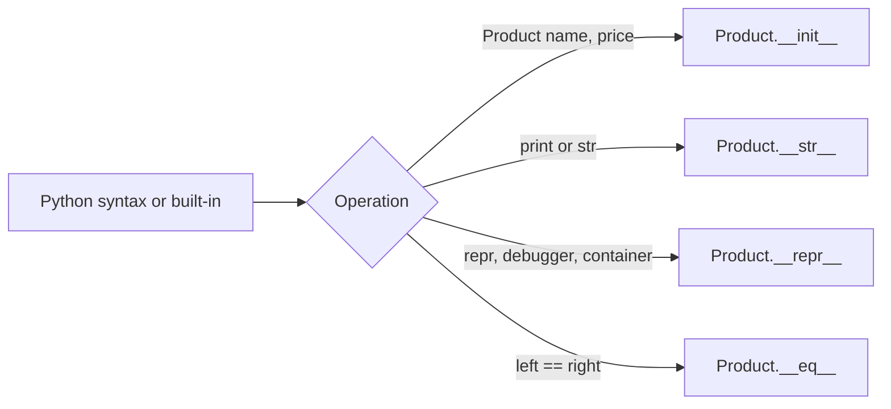
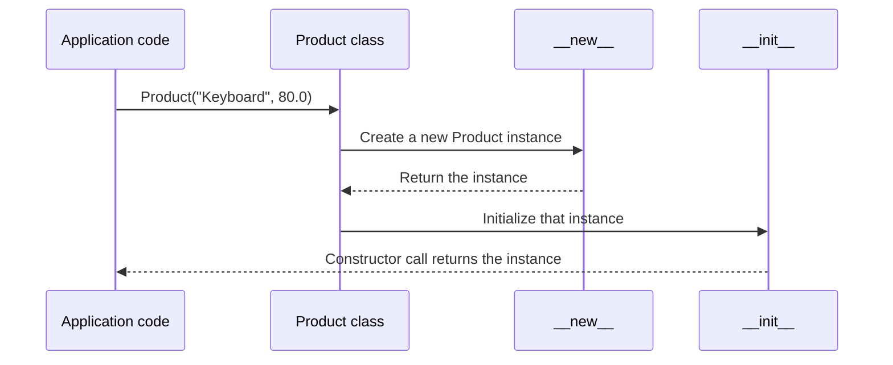
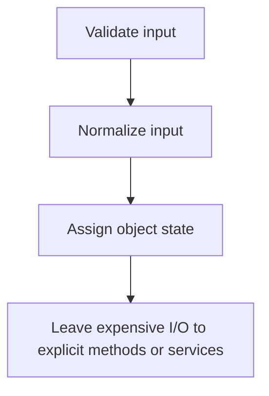
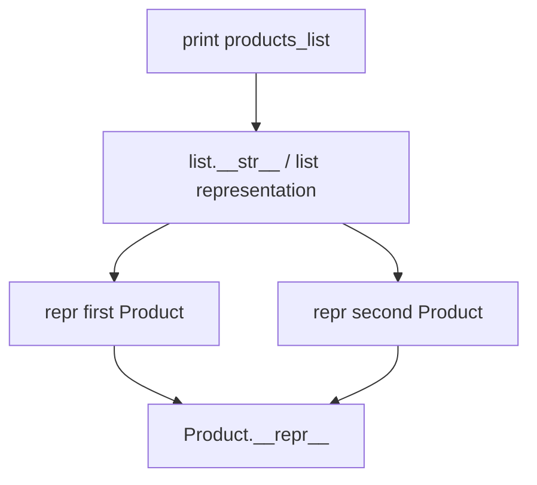
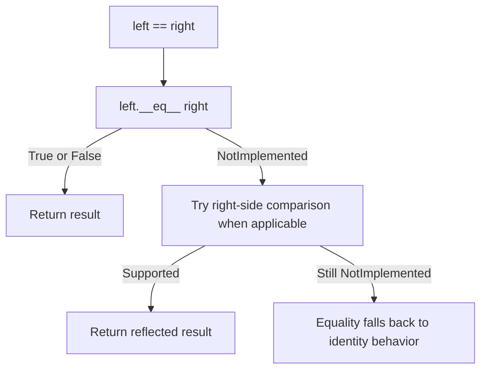
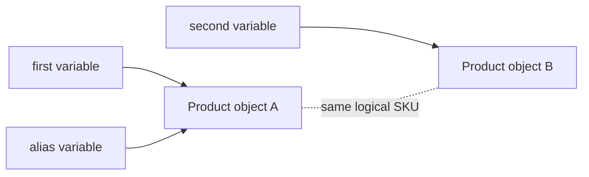
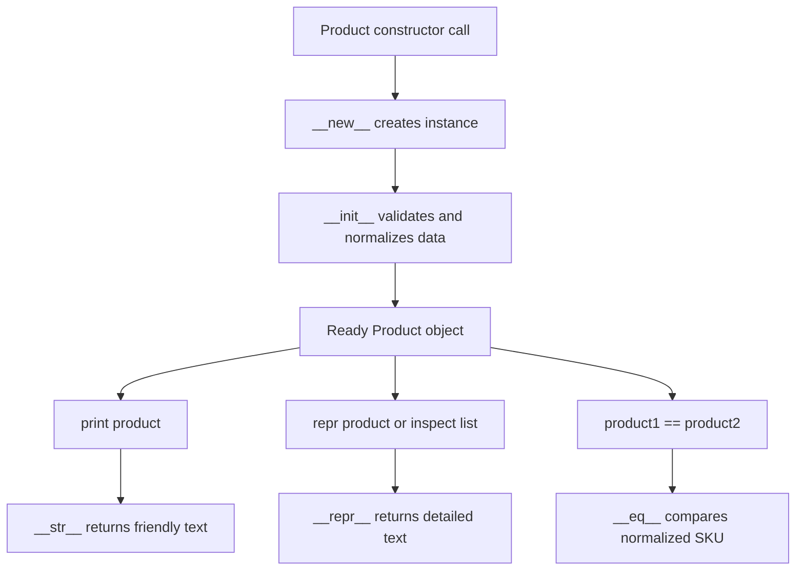
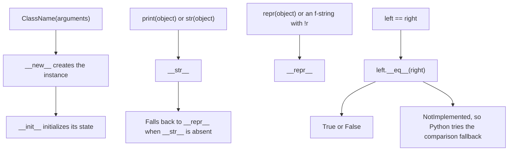
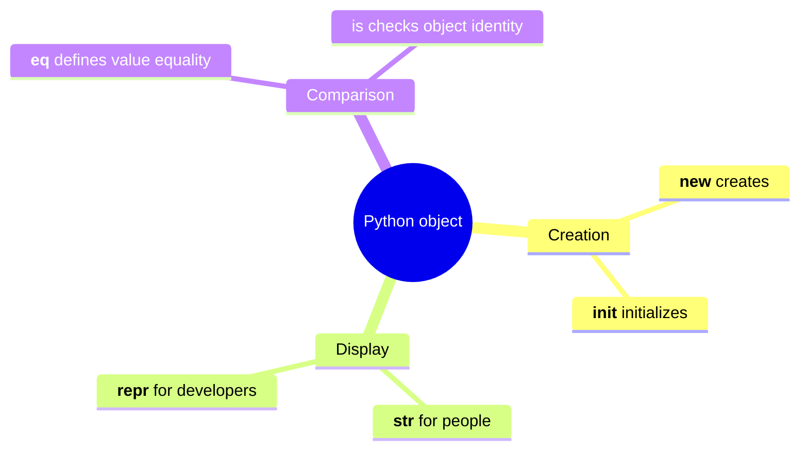

# Python Dunder Methods: `__init__`, `__str__`, `__repr__`, `__eq__`

> Dunder methods are special methods that connect custom Python classes to Python's built-in syntax and functions. They let an object initialize itself, display meaningful text, support debugging, and define value-based equality.

---

# 1. What Are Dunder Methods?

**Dunder** means **double underscore**. A dunder method has two leading and two trailing underscores:

```python
__init__
__str__
__repr__
__eq__
```

They are also called:

- **Special methods**
- **Magic methods**
- **Data model methods**

Dunder methods allow your classes to participate naturally in Python operations.

```python
product = Product("Keyboard", 80.0)

print(product)                  # Calls product.__str__()
repr(product)                   # Calls product.__repr__()
product == another_product      # Calls product.__eq__(another_product)
```

You normally use the public syntax—such as `print(product)` or `product1 == product2`—instead of calling dunder methods directly.

## Why They Matter

Without meaningful dunder methods, a custom object behaves like a basic object with limited readability and identity-based comparison.

```python
class Product:
    pass

product = Product()
print(product)
```

Possible output:

```text
<__main__.Product object at 0x1045A1F10>
```

This output identifies the object's type and runtime identity, but it does not explain the object's business data.

With dunder methods, the same object can become expressive:

```text
Keyboard — $80.00
```

---

# 2. How Python Calls Them

Dunder methods are hooks used by Python's object model.



## Method Mapping

| Python code | Method Python uses |
|---|---|
| `Product("Keyboard", 80.0)` | `Product.__new__()` followed by `Product.__init__()` |
| `str(product)` | `product.__str__()` |
| `print(product)` | Uses `str(product)`, which normally calls `__str__()` |
| `repr(product)` | `product.__repr__()` |
| `f"{product!r}"` | `product.__repr__()` |
| `product1 == product2` | `product1.__eq__(product2)` |

> [!IMPORTANT]
> Python looks up most special methods on the object's **class**, not through normal instance attribute lookup. Define them on the class rather than assigning them to one instance.

---

# 3. `__init__`: Initialize Object State

## Purpose

`__init__` initializes an object after Python has created it.

```python
class Product:
    def __init__(self, name: str, price: float) -> None:
        self.name = name
        self.price = price
```

Usage:

```python
product = Product("Keyboard", 80.0)

print(product.name)   # Keyboard
print(product.price)  # 80.0
```

## What Happens During Object Creation?



Conceptually:

```text
__new__  → creates and returns the instance
__init__ → configures the already-created instance
```

Therefore, `__init__` is technically an **initializer**, although developers often casually call it a constructor.

## `self` Refers to the Current Instance

```python
class User:
    def __init__(self, username: str) -> None:
        self.username = username
```

When Python executes:

```python
user = User("avadh")
```

It effectively initializes the new object using:

```python
User.__init__(user, "avadh")
```

You should let Python perform this call through `User("avadh")`.

## Initialize Instance Attributes

Attributes assigned through `self` belong to that particular object.

```python
class BankAccount:
    def __init__(self, account_number: str, balance: float = 0.0) -> None:
        self.account_number = account_number
        self.balance = balance
```

```python
first = BankAccount("ACC-101", 500.0)
second = BankAccount("ACC-102")

print(first.balance)   # 500.0
print(second.balance)  # 0.0
```

Each instance stores its own state.

## Validate Data During Initialization

`__init__` is a useful place to establish class invariants—conditions that should remain true for every valid object.

```python
class Product:
    def __init__(self, name: str, price: float) -> None:
        cleaned_name = name.strip()

        if not cleaned_name:
            raise ValueError("Product name cannot be empty")

        if price < 0:
            raise ValueError("Product price cannot be negative")

        self.name = cleaned_name
        self.price = float(price)
```

Now an invalid object cannot be created:

```python
Product("", 50)       # ValueError
Product("Mouse", -10) # ValueError
```

## `__init__` Must Return `None`

Do not return another value from `__init__`.

```python
class User:
    def __init__(self, name: str) -> None:
        self.name = name
        return self  # Incorrect
```

Python raises:

```text
TypeError: __init__() should return None, not 'User'
```

A normal `__init__` either:

- Reaches the end without an explicit `return`
- Uses `return` by itself for an early exit
- Raises an exception when initialization cannot continue

## Mutable Default Values

Avoid sharing one mutable default across multiple instances.

```python
class Team:
    def __init__(self, members: list[str] | None = None) -> None:
        self.members = [] if members is None else list(members)
```

The `None` sentinel gives every object its own list.

```python
backend = Team()
frontend = Team()

backend.members.append("Asha")

print(backend.members)   # ['Asha']
print(frontend.members)  # []
```

## Practical `__init__` Guideline

Keep initialization predictable:



For example, prefer this:

```python
class Report:
    def __init__(self, report_id: str) -> None:
        self.report_id = report_id
        self.content: str | None = None

    def load(self, repository: "ReportRepository") -> None:
        self.content = repository.fetch(self.report_id)
```

This design makes object creation fast and easier to test.

---

# 4. `__str__`: Human-Readable Representation

## Purpose

`__str__` returns a readable description for users, logs, command-line output, or UI-facing text.

```python
class Product:
    def __init__(self, name: str, price: float) -> None:
        self.name = name
        self.price = price

    def __str__(self) -> str:
        return f"{self.name} — ${self.price:.2f}"
```

```python
product = Product("Keyboard", 80.0)

print(str(product))
print(product)
```

Output:

```text
Keyboard — $80.00
Keyboard — $80.00
```

## Common Call Sites

```python
str(product)
print(product)
f"Selected item: {product}"
"{}".format(product)
```

All these normally use the object's informal string representation.

## `__str__` Must Return a String

```python
class Product:
    def __str__(self) -> str:
        return 100  # Incorrect
```

Calling `str(Product())` raises a `TypeError` because a string representation must be a `str` object.

## Design a Useful `__str__`

A good `__str__` is:

- Easy for a person to read
- Concise
- Stable enough for display
- Free from unnecessary implementation details

Example:

```python
class Order:
    def __init__(self, order_number: str, status: str, total: float) -> None:
        self.order_number = order_number
        self.status = status
        self.total = total

    def __str__(self) -> str:
        return (
            f"Order {self.order_number}: "
            f"{self.status} — ${self.total:.2f}"
        )
```

```python
order = Order("ORD-1042", "PAID", 249.50)
print(order)
```

Output:

```text
Order ORD-1042: PAID — $249.50
```

## Fallback Behavior

When a class defines `__repr__` but does not define `__str__`, Python uses `__repr__` as the fallback informal representation.

```python
class Product:
    def __init__(self, name: str) -> None:
        self.name = name

    def __repr__(self) -> str:
        return f"Product(name={self.name!r})"
```

```python
product = Product("Keyboard")

print(str(product))   # Product(name='Keyboard')
print(product)        # Product(name='Keyboard')
```

This is why implementing `__repr__` first is often a sensible default.

---

# 5. `__repr__`: Developer-Readable Representation

## Purpose

`__repr__` returns an unambiguous, information-rich representation intended mainly for developers, debugging, logs, and interactive sessions.

```python
class Product:
    def __init__(self, name: str, price: float) -> None:
        self.name = name
        self.price = price

    def __repr__(self) -> str:
        return f"Product(name={self.name!r}, price={self.price!r})"
```

```python
product = Product("Keyboard", 80.0)

print(repr(product))
```

Output:

```text
Product(name='Keyboard', price=80.0)
```

## Why Use `!r`?

Inside an f-string, `!r` applies `repr()` to a value.

```python
name = "Keyboard\nPro"

print(f"{name}")    # Uses str(name)
print(f"{name!r}")  # Uses repr(name)
```

Output:

```text
Keyboard
Pro
'Keyboard\nPro'
```

For `__repr__`, `!r` preserves quotes and escape sequences, making the output less ambiguous.

```python
def __repr__(self) -> str:
    return f"Product(name={self.name!r}, price={self.price!r})"
```

## Representation Convention

When practical, `__repr__` should resemble valid Python code that could recreate an equivalent object.

```python
product = Product("Keyboard", 80.0)
repr(product)
# "Product(name='Keyboard', price=80.0)"
```

This is a convention, not a requirement that every representation must be executable.

For objects that cannot be conveniently reconstructed, provide an informative angle-bracket representation:

```python
class DatabaseConnection:
    def __init__(self, host: str, connected: bool) -> None:
        self.host = host
        self.connected = connected

    def __repr__(self) -> str:
        return (
            f"<DatabaseConnection host={self.host!r} "
            f"connected={self.connected}>"
        )
```

## Containers Usually Display `repr()` of Their Items

```python
products = [
    Product("Keyboard", 80.0),
    Product("Mouse", 30.0),
]

print(products)
```

Output:

```text
[Product(name='Keyboard', price=80.0), Product(name='Mouse', price=30.0)]
```

Although `print(products)` displays a list, the list represents each element using its `repr()`.



This makes `__repr__` especially valuable when objects appear inside lists, dictionaries, sets, tracebacks, and debugger views.

## Protect Sensitive Data

Representations often appear in logs and monitoring systems. Do not expose passwords, tokens, secrets, or full payment details.

```python
class ApiCredential:
    def __init__(self, client_id: str, secret: str) -> None:
        self.client_id = client_id
        self.secret = secret

    def __repr__(self) -> str:
        return (
            f"ApiCredential(client_id={self.client_id!r}, "
            "secret='<redacted>')"
        )
```

---

# 6. `__str__` vs `__repr__`

| Aspect | `__str__` | `__repr__` |
|---|---|---|
| Audience | End user or operator | Developer |
| Goal | Readable and concise | Unambiguous and information-rich |
| Called by | `str()`, `print()`, normal f-strings | `repr()`, debugger, `!r`, many containers |
| Expected format | Friendly text | Often constructor-like text |
| Required return type | `str` | `str` |
| Fallback | Uses `__repr__` when `__str__` is absent | Uses `object.__repr__` when absent |

## Both Methods Together

```python
class Product:
    def __init__(self, sku: str, name: str, price: float) -> None:
        self.sku = sku
        self.name = name
        self.price = price

    def __str__(self) -> str:
        return f"{self.name} — ${self.price:.2f}"

    def __repr__(self) -> str:
        return (
            f"Product(sku={self.sku!r}, "
            f"name={self.name!r}, price={self.price!r})"
        )
```

```python
product = Product("KB-101", "Keyboard", 80.0)

print(product)
# Keyboard — $80.00

print(repr(product))
# Product(sku='KB-101', name='Keyboard', price=80.0)

print(f"{product}")
# Keyboard — $80.00

print(f"{product!r}")
# Product(sku='KB-101', name='Keyboard', price=80.0)
```

## Simple Mental Model

```text
__str__  → “How should a person see this object?”
__repr__ → “How should a developer inspect this object?”
```

---

# 7. `__eq__`: Define Value Equality

## Purpose

`__eq__` defines what `==` means for instances of your class.

Without a custom `__eq__`, normal user-defined objects compare by identity.

```python
class Product:
    def __init__(self, sku: str) -> None:
        self.sku = sku

first = Product("KB-101")
second = Product("KB-101")

print(first == second)  # False
```

The two objects contain the same SKU, but they are different instances.

## Implement Value-Based Equality

```python
class Product:
    def __init__(self, sku: str, name: str) -> None:
        self.sku = sku
        self.name = name

    def __eq__(self, other: object) -> bool:
        if not isinstance(other, Product):
            return NotImplemented

        return self.sku == other.sku
```

```python
first = Product("KB-101", "Keyboard")
second = Product("KB-101", "Mechanical Keyboard")
third = Product("MS-202", "Mouse")

print(first == second)  # True
print(first == third)   # False
```

Here, the class defines product equality by SKU because the SKU represents the business identity.

## Choosing Equality Fields

The fields used by `__eq__` should represent the object's logical value or domain identity.

Examples:

| Class | Possible equality definition |
|---|---|
| `Money` | Currency and amount |
| `Coordinate` | Latitude and longitude |
| `Product` | SKU |
| `User` | Stable user ID |
| `Version` | Major, minor, and patch numbers |

Example value object:

```python
class Money:
    def __init__(self, amount: int, currency: str) -> None:
        self.amount = amount
        self.currency = currency.upper()

    def __eq__(self, other: object) -> bool:
        if not isinstance(other, Money):
            return NotImplemented

        return (
            self.amount == other.amount
            and self.currency == other.currency
        )
```

```python
print(Money(100, "usd") == Money(100, "USD"))  # True
print(Money(100, "USD") == Money(100, "EUR"))  # False
```

## Why Return `NotImplemented`?

When the other operand has an unsupported type, return `NotImplemented` rather than immediately returning `False`.

```python
def __eq__(self, other: object) -> bool:
    if not isinstance(other, Product):
        return NotImplemented

    return self.sku == other.sku
```

`NotImplemented` tells Python:

> “This method does not know how to compare these two operand types.”

Python can then try the reflected comparison on the other operand or use the comparison fallback behavior.



> [!NOTE]
> `NotImplemented` is a special singleton value. It is different from raising `NotImplementedError`, which is an exception generally used for unimplemented abstract-style behavior.
> In Python 3.14, evaluating `NotImplemented` in a Boolean context raises `TypeError`. Return it to Python's operator machinery; do not use it as a truthy or falsy result.

## Type Hint for `other`

Use `object` for the `other` parameter:

```python
def __eq__(self, other: object) -> bool:
    ...
```

The expression `product == 10` is legal Python. Your method must therefore be prepared to receive any object, even if it supports comparison only with `Product`.

## Exact Type vs `isinstance`

### Polymorphic comparison

```python
if not isinstance(other, Product):
    return NotImplemented
```

This allows subclasses of `Product` to participate in the comparison.

### Exact-type comparison

```python
if type(other) is not type(self):
    return NotImplemented
```

This is useful when subclass instances should not automatically be considered equal to base-class instances.

Choose the policy according to the domain model. Equality should remain symmetric and unsurprising.

## Equality Properties

A well-designed equality relation should normally be:

1. **Reflexive**: `x == x`
2. **Symmetric**: if `x == y`, then `y == x`
3. **Transitive**: if `x == y` and `y == z`, then `x == z`
4. **Consistent**: repeated comparison gives the same result while relevant state is unchanged

These properties become important in collections, tests, caching, and domain logic.

---

# 8. `==` vs `is`

`==` and `is` answer different questions.

| Operator | Question | Controlled by |
|---|---|---|
| `==` | Do these objects have equal values? | `__eq__` |
| `is` | Are these references pointing to the exact same object? | Object identity; cannot be overloaded |

```python
first = Product("KB-101", "Keyboard")
second = Product("KB-101", "Keyboard")
alias = first

print(first == second)  # True, when __eq__ compares SKU
print(first is second)  # False, two different instances
print(first is alias)   # True, same instance
```



## Use `is` for Singleton Checks

The most common identity check is `None`:

```python
if result is None:
    print("No result found")
```

Prefer `is None` over `== None` because `None` is a singleton and custom equality should not affect this check.

---

# 9. `__eq__` and `__hash__`

Equality affects whether an object can safely be used in hashed collections such as:

- Dictionary keys
- Set members
- `frozenset` members

## The Hash Contract

When two objects compare equal, they must have the same hash:

```text
x == y  ⇒  hash(x) == hash(y)
```

The reverse is not required. Different objects may occasionally have the same hash due to collisions.

## What Python Does Automatically

When a class defines `__eq__` but does not define `__hash__`, Python normally marks its instances as unhashable.

```python
class Product:
    def __init__(self, sku: str) -> None:
        self.sku = sku

    def __eq__(self, other: object) -> bool:
        if not isinstance(other, Product):
            return NotImplemented
        return self.sku == other.sku
```

```python
product = Product("KB-101")
hash(product)
```

Result:

```text
TypeError: unhashable type: 'Product'
```

This protects hashed collections from objects whose equality-related state may change.

## Value Object with `__hash__`

```python
class Coordinate:
    def __init__(self, latitude: float, longitude: float) -> None:
        self.latitude = latitude
        self.longitude = longitude

    def __eq__(self, other: object) -> bool:
        if not isinstance(other, Coordinate):
            return NotImplemented

        return (
            self.latitude == other.latitude
            and self.longitude == other.longitude
        )

    def __hash__(self) -> int:
        return hash((self.latitude, self.longitude))
```

```python
first = Coordinate(23.0225, 72.5714)
second = Coordinate(23.0225, 72.5714)

print(first == second)        # True
print(hash(first) == hash(second))  # True

locations = {first, second}
print(len(locations))         # 1
```

Only implement a value-based `__hash__` when the fields used for hashing will not change while the object is being used in a hashed collection. Treat the `Coordinate` fields above as immutable after initialization; a frozen dataclass provides stronger enforcement.

A frozen dataclass is often a cleaner solution for immutable value objects.

---

# 10. Complete Real-World Example

The following `Product` class combines all four methods.

```python
from __future__ import annotations


class Product:
    def __init__(
        self,
        sku: str,
        name: str,
        price: float,
        *,
        active: bool = True,
    ) -> None:
        normalized_sku = sku.strip().upper()
        normalized_name = name.strip()

        if not normalized_sku:
            raise ValueError("SKU cannot be empty")

        if not normalized_name:
            raise ValueError("Product name cannot be empty")

        if price < 0:
            raise ValueError("Price cannot be negative")

        self.sku = normalized_sku
        self.name = normalized_name
        self.price = float(price)
        self.active = active

    def __str__(self) -> str:
        status = "active" if self.active else "inactive"
        return f"{self.name} ({self.sku}) — ${self.price:.2f}, {status}"

    def __repr__(self) -> str:
        return (
            f"{type(self).__name__}("
            f"sku={self.sku!r}, "
            f"name={self.name!r}, "
            f"price={self.price!r}, "
            f"active={self.active!r})"
        )

    def __eq__(self, other: object) -> bool:
        if not isinstance(other, Product):
            return NotImplemented

        return self.sku == other.sku
```

## Usage

```python
first = Product(
    sku=" kb-101 ",
    name="Mechanical Keyboard",
    price=80,
)

second = Product(
    sku="KB-101",
    name="Keyboard - New Packaging",
    price=85,
)

third = Product(
    sku="MS-202",
    name="Wireless Mouse",
    price=30,
)
```

### Initialization Result

```python
print(first.sku)    # KB-101
print(first.price)  # 80.0
```

### Human-Readable Output

```python
print(first)
```

```text
Mechanical Keyboard (KB-101) — $80.00, active
```

### Developer-Readable Output

```python
print(repr(first))
```

```text
Product(sku='KB-101', name='Mechanical Keyboard', price=80.0, active=True)
```

### Equality

```python
print(first == second)  # True: same normalized SKU
print(first == third)   # False: different SKU
print(first == "KB-101")  # False after Python's comparison fallback
```

## End-to-End Flow



---

# 11. Inheritance and `super()`

A subclass that defines its own `__init__` should explicitly cooperate with the base class when it needs the base initialization.

```python
class Product:
    def __init__(self, sku: str, name: str) -> None:
        self.sku = sku
        self.name = name


class DigitalProduct(Product):
    def __init__(self, sku: str, name: str, download_url: str) -> None:
        super().__init__(sku, name)
        self.download_url = download_url
```

```python
course = DigitalProduct(
    "PY-301",
    "Advanced Python",
    "https://example.com/download/PY-301",
)
```

## Reuse Base Representation Carefully

```python
class Product:
    def __init__(self, sku: str, name: str) -> None:
        self.sku = sku
        self.name = name

    def __str__(self) -> str:
        return f"{self.name} ({self.sku})"


class DigitalProduct(Product):
    def __init__(self, sku: str, name: str, file_format: str) -> None:
        super().__init__(sku, name)
        self.file_format = file_format

    def __str__(self) -> str:
        return f"{super().__str__()} [{self.file_format}]"
```

```python
ebook = DigitalProduct("BK-501", "Python Guide", "PDF")
print(ebook)
```

Output:

```text
Python Guide (BK-501) [PDF]
```

## Representation That Supports Subclasses

Using `type(self).__name__` prevents the base class name from being hard-coded:

```python
def __repr__(self) -> str:
    return (
        f"{type(self).__name__}("
        f"sku={self.sku!r}, name={self.name!r})"
    )
```

Whether base and subclass instances should compare equal requires an explicit domain decision. Use exact-type comparison when equality across subclasses could hide meaningful differences.

---

# 12. Dunder Methods with `dataclass`

Python's `@dataclass` can automatically generate `__init__`, `__repr__`, and `__eq__`.

```python
from dataclasses import dataclass


@dataclass
class Product:
    sku: str
    name: str
    price: float
```

Python generates behavior similar to:

```python
product = Product("KB-101", "Keyboard", 80.0)

print(repr(product))
# Product(sku='KB-101', name='Keyboard', price=80.0)

print(
    product
    == Product("KB-101", "Keyboard", 80.0)
)
# True
```

By default, dataclass equality compares the class and all fields in declaration order. It behaves as though the instance were compared using a tuple of its fields, while requiring both operands to have the identical class.

## Add a Custom `__str__`

```python
from dataclasses import dataclass


@dataclass
class Product:
    sku: str
    name: str
    price: float

    def __str__(self) -> str:
        return f"{self.name} — ${self.price:.2f}"
```

## Immutable, Hashable Value Object

```python
from dataclasses import dataclass


@dataclass(frozen=True)
class Coordinate:
    latitude: float
    longitude: float
```

```python
first = Coordinate(23.0225, 72.5714)
second = Coordinate(23.0225, 72.5714)

print(first == second)  # True
print(hash(first) == hash(second))  # True
```

Use a dataclass when a class primarily stores data. Write the methods manually when equality, validation, representation, inheritance, or lifecycle behavior follows richer domain rules.

---

# 13. Testing Dunder Methods

Dunder methods are part of your class's public behavior, so test their observable results.

## Example with `pytest`

```python
import pytest


def test_product_initialization_normalizes_values() -> None:
    product = Product(" kb-101 ", " Keyboard ", 80)

    assert product.sku == "KB-101"
    assert product.name == "Keyboard"
    assert product.price == 80.0


def test_product_rejects_negative_price() -> None:
    with pytest.raises(ValueError, match="Price cannot be negative"):
        Product("KB-101", "Keyboard", -1)


def test_product_str_is_human_readable() -> None:
    product = Product("KB-101", "Keyboard", 80)

    assert str(product) == "Keyboard (KB-101) — $80.00, active"


def test_product_repr_contains_debugging_state() -> None:
    product = Product("KB-101", "Keyboard", 80)

    assert repr(product) == (
        "Product(sku='KB-101', name='Keyboard', "
        "price=80.0, active=True)"
    )


def test_products_with_same_sku_are_equal() -> None:
    first = Product("KB-101", "Keyboard", 80)
    second = Product("KB-101", "Keyboard V2", 90)

    assert first == second


def test_product_comparison_with_unrelated_type() -> None:
    product = Product("KB-101", "Keyboard", 80)

    assert product != "KB-101"
```

## Test the Contract, Not Internal Calls

Prefer:

```python
assert str(product) == "Keyboard (KB-101) — $80.00, active"
assert first == second
```

Rather than directly testing:

```python
assert product.__str__() == "Keyboard (KB-101) — $80.00, active"
assert first.__eq__(second) is True
```

The first style verifies the same public syntax used by application code.

---

# 14. Best Practices

## For `__init__`

- Establish a valid initial state.
- Validate and normalize constructor input when it protects class invariants.
- Use `None` as a sentinel for optional mutable values.
- Call `super().__init__()` when the base class requires initialization.
- Avoid returning a value.
- Keep heavy network, file, and database work outside basic initialization when practical.

## For `__str__`

- Optimize for human readability.
- Keep the output concise.
- Return a string in every path.
- Avoid making application logic depend on display formatting.

## For `__repr__`

- Include fields that help diagnose the object's state.
- Prefer unambiguous formatting and use `!r` for nested values.
- Consider a constructor-like representation when practical.
- Never reveal secrets or sensitive personal data.
- Keep the method reliable; debugging output should not unexpectedly fail.

## For `__eq__`

- Compare fields that define logical equality.
- Accept `other: object`.
- Return `NotImplemented` for unsupported operand types.
- Preserve reflexivity, symmetry, transitivity, and consistency.
- Consider the `__hash__` contract before making objects hashable.
- Avoid equality rules based on unstable or frequently changing fields.

---

# 15. Quick Revision

## One-Line Definitions

| Method | Meaning |
|---|---|
| `__init__` | Initializes the state of an already-created object |
| `__str__` | Returns a friendly representation for people |
| `__repr__` | Returns a detailed representation for developers |
| `__eq__` | Defines value equality for the `==` operator |

## Call Flow Summary



## Compact Example

```python
class User:
    def __init__(self, user_id: int, name: str) -> None:
        self.user_id = user_id
        self.name = name

    def __str__(self) -> str:
        return self.name

    def __repr__(self) -> str:
        return f"User(user_id={self.user_id!r}, name={self.name!r})"

    def __eq__(self, other: object) -> bool:
        if not isinstance(other, User):
            return NotImplemented
        return self.user_id == other.user_id
```

```python
first = User(101, "Asha")
second = User(101, "Asha Patel")

print(first)          # Asha
print(repr(first))    # User(user_id=101, name='Asha')
print(first == second)  # True
print(first is second)  # False
```

## Final Mental Model



---

## Official References

- [Python Data Model — Basic Customization](https://docs.python.org/3/reference/datamodel.html#basic-customization)
- [Python Data Model — Rich Comparison Methods](https://docs.python.org/3/reference/datamodel.html#object.__eq__)
- [Python Built-in Functions — `repr`](https://docs.python.org/3/library/functions.html#repr)
- [Python `dataclasses`](https://docs.python.org/3/library/dataclasses.html)
