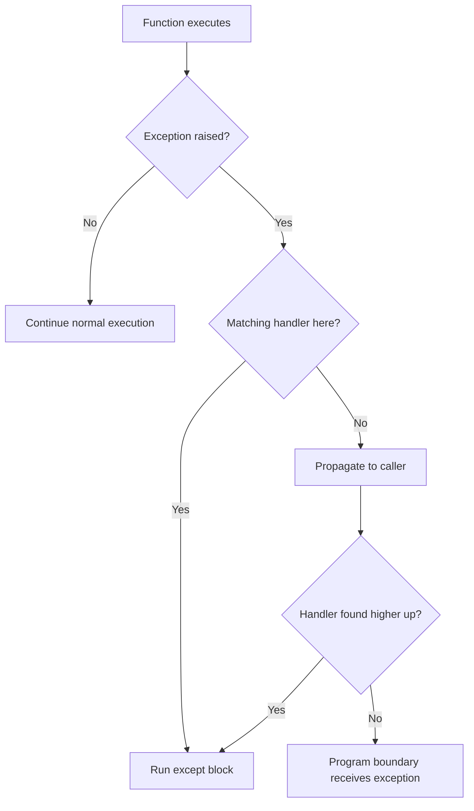
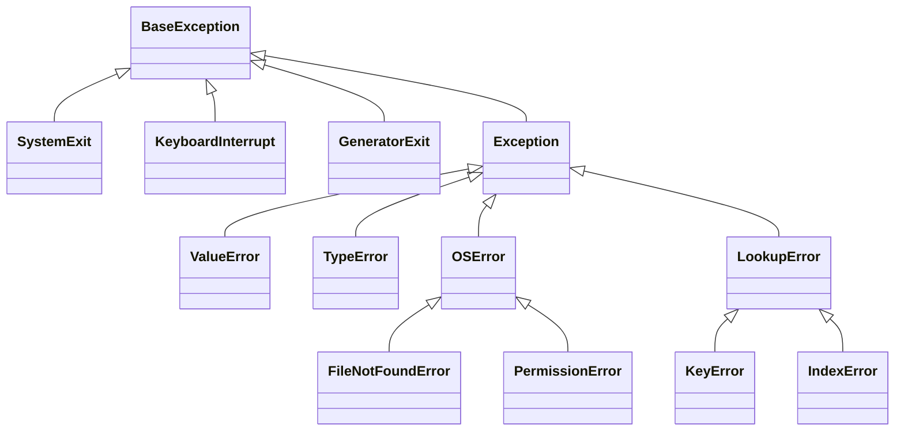
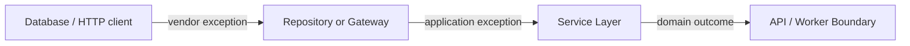

# Python: Exception Handling and Custom Exceptions

Exception handling is how Python represents and manages failures that happen while a program is running. The goal is not to catch every error. The goal is to handle expected failures at the correct layer, preserve useful debugging information, and keep normal application logic readable.

> **Version note:** This guide is aligned with Python **3.14.x** behavior, including the Python 3.14 warning for control-flow statements such as `return`, `break`, and `continue` inside `finally` blocks.

## In Short

- `try` contains code that may fail.
- `except` handles a matching exception.
- `else` runs only when the `try` block completes successfully.
- `finally` runs during cleanup whether the operation succeeds or fails.
- Exceptions propagate up the call stack until Python finds a matching handler.
- Catch the most specific exception you can actually handle.
- Use `raise ... from exc` when translating a low-level error into a higher-level application error.
- Prefer built-in exception types when they describe the problem; create custom exceptions for domain-specific failures.
- Use context managers such as `with` for resource cleanup whenever possible.

---

## Index

1. [Errors and Exceptions](#1-errors-and-exceptions)
   - Syntax errors
   - Runtime exceptions
2. [How Exception Handling Works](#2-how-exception-handling-works)
   - `try`, `except`, `else`, `finally`
   - Exception propagation
3. [Catching Exceptions Correctly](#3-catching-exceptions-correctly)
   - Multiple handlers
   - Exception hierarchy
4. [Raising and Chaining Exceptions](#4-raising-and-chaining-exceptions)
   - `raise`
   - Re-raising
   - `raise ... from ...`
5. [Custom Exceptions](#5-custom-exceptions)
   - Domain exceptions
   - Structured attributes
6. [Practical Application Example](#6-practical-application-example)
   - Repository, service, and API boundaries
7. [Modern Python Exception Features](#7-modern-python-exception-features)
   - `ExceptionGroup` and `except*`
   - `add_note()`
8. [Logging, Testing, and Best Practices](#8-logging-testing-and-best-practices)

---

# 1. Errors and Exceptions

## 1.1 Syntax Errors

A syntax error means Python cannot parse the source code.

```python
def calculate_total(items)  # SyntaxError: expected ':'
    return sum(items)
```

Because the source cannot be parsed correctly, normal runtime exception handling cannot recover from this error in the same file.

## 1.2 Runtime Exceptions

An exception happens after valid Python code starts running.

```python
quantity = 0
price_per_item = 100 / quantity
# ZeroDivisionError: division by zero
```

Frequently used built-in exceptions include:

| Exception | Typical meaning |
|---|---|
| `ValueError` | Correct type, invalid value |
| `TypeError` | Inappropriate object type |
| `KeyError` | Dictionary key is missing |
| `IndexError` | Sequence index is out of range |
| `AttributeError` | Object does not contain the requested attribute |
| `FileNotFoundError` | Requested file does not exist |
| `PermissionError` | Operation is not permitted |
| `TimeoutError` | Operation exceeded its allowed time |
| `ConnectionError` | Connection-related operation failed |
| `ZeroDivisionError` | Division by zero |

An exception is an object. Its class identifies the failure category, while its message and attributes provide additional context.

---

# 2. How Exception Handling Works

## 2.1 `try`, `except`, `else`, and `finally`

The complete structure looks like this:

```python
try:
    result = risky_operation()
except ExpectedError as exc:
    recover(exc)
else:
    use(result)
finally:
    cleanup()
```

| Block | Purpose |
|---|---|
| `try` | Runs code that may raise an exception |
| `except` | Handles a matching exception |
| `else` | Runs only if `try` completes without an exception |
| `finally` | Runs during cleanup whether the operation succeeds or fails |

Use `else` when code should run only after the protected operation succeeds. This keeps the `try` block small and prevents an `except` clause from accidentally handling errors from unrelated code.

```python
try:
    port = int(raw_port)
except ValueError as exc:
    raise ValueError("Port must be an integer") from exc
else:
    start_server(port)
```

## 2.2 Exception Propagation and Stack Unwinding

If the current function does not handle an exception, Python moves upward through the call stack looking for a matching `except` block.



This is commonly called **exception propagation** or **stack unwinding**.

A useful rule is:

> Handle an exception at the layer that has enough context to make a meaningful decision such as retrying, translating the error, returning an API response, or stopping the operation.

## 2.3 `finally` and Cleanup

`finally` is intended for cleanup that must happen when leaving the protected block.

```python
connection = open_connection()

try:
    process_data(connection)
finally:
    connection.close()
```

In normal development, prefer a context manager when one is available:

```python
with open("report.txt", "r", encoding="utf-8") as file:
    data = file.read()
```

The resource is released automatically even when an exception occurs.

### Python 3.14 behavior

Python 3.14 emits a `SyntaxWarning` when `return`, `break`, or `continue` appears inside a `finally` block. These statements can discard an active exception or replace a previous return value, so they should not be used there.

---

# 3. Catching Exceptions Correctly

## 3.1 Catch Specific Exceptions

Catch the failure you expect and know how to handle.

```python
try:
    user_id = int(raw_user_id)
except ValueError:
    return "Invalid user id"
```

A broad handler such as `except Exception:` is normally reserved for application boundaries where unexpected failures must be logged or converted into a final response.

## 3.2 Multiple Exceptions

Use separate handlers when each failure needs different behavior:

```python
try:
    configuration = load_configuration("settings.json")
except FileNotFoundError:
    configuration = create_default_configuration()
except PermissionError:
    raise RuntimeError("Configuration file cannot be read")
```

Use a tuple when several exceptions require the same response:

```python
try:
    value = int(user_input)
except (TypeError, ValueError):
    value = 0
```

## 3.3 Handler Order Matters

Python checks handlers from top to bottom. Put more specific subclasses before their parent classes.

```python
try:
    read_file(path)
except FileNotFoundError:
    handle_missing_file()
except OSError:
    handle_other_os_error()
```

`FileNotFoundError` inherits from `OSError`, so placing `OSError` first would also catch `FileNotFoundError`.

## 3.4 Exception Hierarchy



Most application exceptions inherit from `Exception`.

`SystemExit`, `KeyboardInterrupt`, and `GeneratorExit` inherit directly from `BaseException`. Application code normally should not catch `BaseException`, because doing so can interfere with interpreter shutdown or `Ctrl+C` handling.

---

# 4. Raising and Chaining Exceptions

## 4.1 Raising an Exception

Use `raise` when a function cannot fulfil its contract.

```python
def set_retry_count(count: int) -> None:
    if not isinstance(count, int):
        raise TypeError("count must be an integer")

    if count < 0:
        raise ValueError("count cannot be negative")
```

A useful distinction is:

- `TypeError`: the object is the wrong kind of type.
- `ValueError`: the type is acceptable, but the value is invalid.

## 4.2 Re-raising the Current Exception

Use a bare `raise` inside an exception handler when the same exception should continue upward with its existing traceback.

```python
try:
    process_payment()
except PaymentGatewayError:
    logger.exception("Payment processing failed")
    raise
```

## 4.3 Exception Chaining

When converting a low-level error into an application-level error, preserve the original cause with `from exc`.

```python
try:
    customer = database.fetch_customer(customer_id)
except ConnectionError as exc:
    raise CustomerRepositoryError(
        f"Could not load customer {customer_id}"
    ) from exc
```

The caller receives meaningful application context while the traceback still shows the underlying technical failure.

Python stores this explicit relationship in `exception.__cause__`.

Use `from None` only when hiding the lower-level context is intentional:

```python
try:
    return settings[key]
except KeyError:
    raise ConfigurationError(
        f"Required setting '{key}' is missing"
    ) from None
```

---

# 5. Custom Exceptions

Create a custom exception when a failure belongs to the application's domain and a built-in exception does not express the meaning clearly enough.

```python
class OrderServiceError(Exception):
    """Base exception for the order service."""


class InsufficientStockError(OrderServiceError):
    def __init__(
        self,
        *,
        product_id: str,
        requested: int,
        available: int,
    ) -> None:
        self.product_id = product_id
        self.requested = requested
        self.available = available

        super().__init__(
            f"Product {product_id}: requested {requested}, "
            f"available {available}"
        )
```

Structured attributes are better than forcing callers to parse a message:

```python
try:
    inventory.reserve("PROD-10", quantity=8)
except InsufficientStockError as exc:
    audit_log(
        product_id=exc.product_id,
        requested=exc.requested,
        available=exc.available,
    )
```

For larger packages, define one package-level base exception and derive more specific errors from it.

```text
Exception
└── OrderServiceError
    ├── OrderNotFoundError
    ├── InvalidOrderStateError
    └── PaymentError
        ├── PaymentDeclinedError
        └── PaymentGatewayUnavailableError
```

This lets callers choose how specific they want to be when handling failures.

---

# 6. Practical Application Example

A common backend pattern is to translate infrastructure-specific failures at the repository or gateway boundary and expose domain/application exceptions to the rest of the system.



Consider an order service calling a payment provider:

```python
class OrderServiceError(Exception):
    pass


class PaymentUnavailableError(OrderServiceError):
    pass


class PaymentDeclinedError(OrderServiceError):
    pass


class PaymentGateway:
    def charge(self, order_id: str, amount: float) -> None:
        try:
            provider.charge(order_id=order_id, amount=amount)
        except ProviderTimeoutError as exc:
            raise PaymentUnavailableError(
                f"Payment provider unavailable for order {order_id}"
            ) from exc
        except ProviderDeclinedError as exc:
            raise PaymentDeclinedError(
                f"Payment declined for order {order_id}"
            ) from exc
```

The service works with application-level errors instead of vendor-specific types:

```python
def checkout(order: Order) -> None:
    payment_gateway.charge(order.id, order.total)
    order_repository.mark_paid(order.id)
```

At the API boundary:

```python
try:
    checkout(order)
except PaymentDeclinedError as exc:
    return error_response(422, "PAYMENT_DECLINED", str(exc))
except PaymentUnavailableError:
    return error_response(
        503,
        "PAYMENT_UNAVAILABLE",
        "Payment service is temporarily unavailable.",
    )
```

### Why this design is useful

- Business code is independent of a specific payment SDK.
- The original technical cause is preserved for debugging.
- The API can return stable error codes without exposing internal details.
- Retryable and non-retryable failures can be represented by different exception types.

---

# 7. Modern Python Exception Features

These features are useful to know, but they are less common than normal `try`/`except` handling in everyday application code.

## 7.1 `ExceptionGroup` and `except*`

`ExceptionGroup` represents multiple unrelated failures as one exception. It is especially useful in concurrent or batch operations where several tasks may fail independently.

```python
errors = [
    FileNotFoundError("users.csv"),
    ValueError("Invalid row format"),
]

raise ExceptionGroup("Import failed", errors)
```

Handle matching subgroups with `except*`:

```python
try:
    import_all_files()
except* FileNotFoundError as group:
    handle_missing_files(group.exceptions)
except* ValueError as group:
    handle_invalid_files(group.exceptions)
```

Important behavior:

- Multiple `except*` clauses may run for different exceptions in the same group.
- A single `try` statement cannot mix normal `except` and `except*` clauses.
- Unmatched exceptions continue propagating.

## 7.2 Adding Diagnostic Notes

`BaseException.add_note()` can attach extra diagnostic information without changing the original exception type or message.

```python
try:
    process_import(file_path)
except ValueError as exc:
    exc.add_note(f"Import file: {file_path}")
    exc.add_note(f"Batch ID: {batch_id}")
    raise
```

This is useful when different layers can add context while preserving the original failure.

---

# 8. Logging, Testing, and Best Practices

## 8.1 Logging Exceptions

Inside an active exception handler, `logger.exception()` automatically records the traceback.

```python
try:
    process_job(job_id)
except JobProcessingError:
    logger.exception(
        "Job processing failed",
        extra={"job_id": job_id},
    )
    raise
```

Avoid logging and re-raising the same failure at every layer. A common pattern is to add context in lower layers and log the final unexpected failure once at an application boundary.

Do not expose internal tracebacks, credentials, tokens, SQL statements, private hostnames, or sensitive data in public API responses.

## 8.2 Testing Exception Behavior

Exceptions are part of a function's behavior and should be tested.

```python
import pytest


def test_insufficient_stock_error() -> None:
    with pytest.raises(InsufficientStockError) as captured:
        inventory.reserve("PROD-10", quantity=8)

    assert captured.value.product_id == "PROD-10"
    assert captured.value.requested == 8
```

Test meaningful exception types and structured attributes rather than depending on every word of a long error message.

## 8.3 Practical Best Practices

- Keep `try` blocks narrow.
- Catch specific exceptions whenever possible.
- Order child exceptions before parent exceptions.
- Use built-in exceptions when they already describe the failure.
- Use custom exceptions for meaningful domain failures.
- Preserve low-level causes with `raise ... from exc`.
- Use a bare `raise` when re-raising the current exception.
- Prefer context managers for resource cleanup.
- Avoid catching `BaseException` in normal application code.
- Catch broad `Exception` mainly at clear application boundaries.
- Do not silently suppress failures unless suppression is intentionally part of the contract.
- Keep public error responses stable and safe while logging technical details internally.

---

## Key Takeaway

Good exception handling is about **where**, **what**, and **why**:

- **Where:** handle the failure at the layer that can make a useful decision.
- **What:** catch or raise the most meaningful exception type.
- **Why:** preserve enough context for callers and developers to understand the failure.

For normal backend development, the most important pattern is:

```text
Low-level failure
      ↓
Repository / Gateway translates it
      ↓
Service works with domain exceptions
      ↓
API / Worker boundary handles or logs it
```

If you can explain that flow clearly, along with `try`/`except`/`else`/`finally`, exception propagation, custom exceptions, and exception chaining, you cover the exception-handling concepts most commonly expected from an experienced Python developer.
