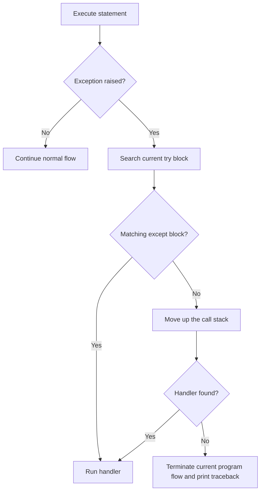
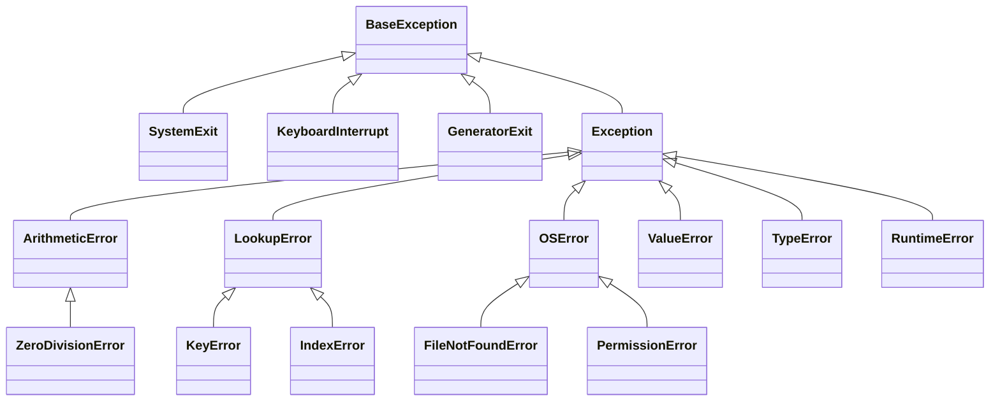
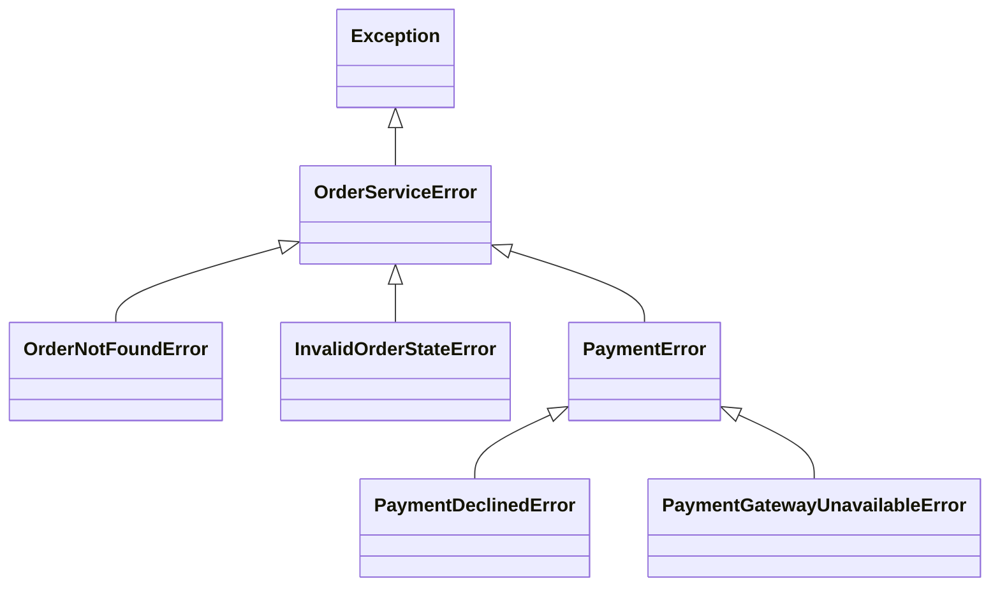
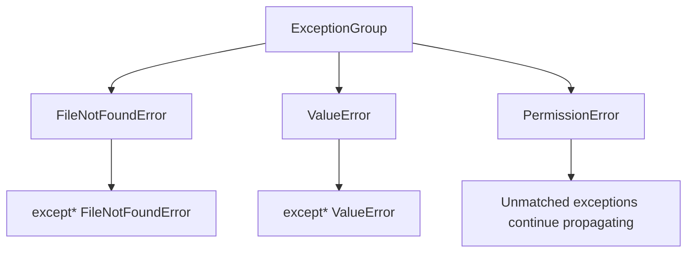
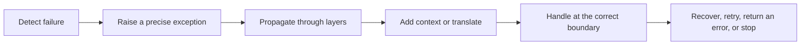

# Python: Exception Handling and Custom Exceptions

> Exception handling lets a program respond to runtime failures in a controlled way. Good exception design keeps normal business logic readable, preserves debugging information, and gives callers enough context to decide what to do next.

## Index

1. [Errors and Exceptions](#1-errors-and-exceptions)
2. [How Exceptions Flow Through a Program](#2-how-exceptions-flow-through-a-program)
3. [The `try` and `except` Blocks](#3-the-try-and-except-blocks)
4. [`else` and `finally`](#4-else-and-finally)
5. [Catching Multiple Exceptions](#5-catching-multiple-exceptions)
6. [The Exception Hierarchy](#6-the-exception-hierarchy)
7. [Raising Exceptions](#7-raising-exceptions)
8. [Exception Chaining](#8-exception-chaining)
9. [Creating Custom Exceptions](#9-creating-custom-exceptions)
10. [Designing an Exception Hierarchy](#10-designing-an-exception-hierarchy)
11. [Adding Structured Information](#11-adding-structured-information)
12. [`ExceptionGroup` and `except*`](#12-exceptiongroup-and-except)
13. [Exceptions in Real Applications](#13-exceptions-in-real-applications)
14. [Logging Exceptions](#14-logging-exceptions)
15. [Exceptions and Context Managers](#15-exceptions-and-context-managers)
16. [Testing Exception Behaviour](#16-testing-exception-behaviour)
17. [Best Practices](#17-best-practices)
18. [Quick Revision](#18-quick-revision)

---

# 1. Errors and Exceptions

Python programs mainly face two categories of errors.

## 1.1 Syntax errors

A syntax error means Python cannot understand the source code.

```python
def calculate_total(items)
    return sum(items)
```

The missing colon prevents the program from starting:

```text
SyntaxError: expected ':'
```

Syntax errors are detected while Python parses the code. A `try` block normally cannot recover from a syntax error in the same source file because that file cannot be executed successfully.

## 1.2 Exceptions

An exception happens while syntactically valid code is running.

```python
price = 100
quantity = 0

average = price / quantity
```

This raises:

```text
ZeroDivisionError: division by zero
```

Common runtime exceptions include:

| Exception | Typical reason |
|---|---|
| `ValueError` | Correct type, but invalid value |
| `TypeError` | Operation received an inappropriate type |
| `KeyError` | Dictionary key does not exist |
| `IndexError` | Sequence index is out of range |
| `AttributeError` | Object does not contain the requested attribute |
| `FileNotFoundError` | Requested file does not exist |
| `PermissionError` | Process does not have permission |
| `TimeoutError` | An operation exceeded its allowed time |
| `ConnectionError` | Network connection failed |
| `ZeroDivisionError` | Number was divided by zero |

An exception is an object. Its class describes the failure category, while its message and attributes provide details.

---

# 2. How Exceptions Flow Through a Program

When an exception is raised, Python stops normal execution and searches for a matching handler.



Consider the following call chain:

```python
def load_user(user_id: int) -> dict:
    return query_database(user_id)


def query_database(user_id: int) -> dict:
    raise ConnectionError("Database is unavailable")


try:
    user = load_user(42)
except ConnectionError as exc:
    print(f"Could not load user: {exc}")
```

`query_database()` does not handle the exception, so it propagates to `load_user()`. That function also does not handle it, so Python continues upward until it finds the matching `except ConnectionError` block.

This process is called **exception propagation** or **stack unwinding**.

> [!KEY]
> Handle an exception at the level that has enough context to make a useful decision. Lower-level code often raises an error; service or application-level code decides whether to retry, convert it, return an error response, or stop the operation.

---

# 3. The `try` and `except` Blocks

The basic structure is:

```python
try:
    risky_operation()
except SpecificException:
    handle_failure()
```

Example:

```python
def divide(total: float, count: int) -> float:
    try:
        return total / count
    except ZeroDivisionError:
        return 0.0
```

The `except` block runs only when the protected code raises the specified exception.

## 3.1 Accessing the exception object

Use `as` to access details:

```python
try:
    age = int("unknown")
except ValueError as exc:
    print(f"Invalid age: {exc}")
```

The variable `exc` is the exception instance.

Useful standard attributes include:

```python
try:
    int("abc")
except ValueError as exc:
    print(exc.args)
    print(str(exc))
```

Possible output:

```text
("invalid literal for int() with base 10: 'abc'",)
invalid literal for int() with base 10: 'abc'
```

## 3.2 Keep the `try` block narrow

Protect only the statement or small group of statements expected to fail.

```python
# Too broad: unrelated bugs may be caught.
try:
    user = repository.get_user(user_id)
    full_name = user["first_name"] + " " + user["last_name"]
    send_welcome_email(user["email"])
except KeyError:
    handle_invalid_user_data()
```

A better structure is:

```python
user = repository.get_user(user_id)

try:
    first_name = user["first_name"]
    last_name = user["last_name"]
except KeyError as exc:
    raise ValueError(f"Missing required user field: {exc.args[0]}") from exc

full_name = f"{first_name} {last_name}"
send_welcome_email(user["email"])
```

A narrow block makes it clear which operation is expected to fail and prevents accidental handling of unrelated programming errors.

---

# 4. `else` and `finally`

A complete exception-handling structure can contain four parts:

```python
try:
    result = risky_operation()
except ExpectedError:
    recover()
else:
    use(result)
finally:
    clean_up()
```

## 4.1 `else`

The `else` block runs only when the `try` block finishes without an exception.

```python
def parse_port(raw_port: str) -> int:
    try:
        port = int(raw_port)
    except ValueError as exc:
        raise ValueError("Port must be an integer") from exc
    else:
        print("Port was parsed successfully")
        return port
```

Why use `else` instead of placing everything inside `try`?

```python
try:
    port = int(raw_port)
    start_server(port)
except ValueError:
    ...
```

If `start_server()` unexpectedly raises `ValueError`, the handler may incorrectly treat it as a parsing problem.

A clearer version is:

```python
try:
    port = int(raw_port)
except ValueError as exc:
    raise ValueError("Port must be an integer") from exc
else:
    start_server(port)
```

The handler now covers only the operation it understands.

## 4.2 `finally`

The `finally` block runs whether the operation:

- succeeds,
- raises a handled exception,
- raises an unhandled exception,
- executes `return`,
- executes `break` or `continue`.

```python
connection = open_connection()

try:
    process_data(connection)
finally:
    connection.close()
```

This is useful for releasing resources such as:

- files,
- database connections,
- locks,
- temporary resources,
- network sessions.

In modern Python, a context manager is usually cleaner:

```python
with open("report.txt", "r", encoding="utf-8") as file:
    data = file.read()
```

The file is closed automatically, even if reading fails.

> [!IMPORTANT]
> Avoid `return`, `break`, or `continue` inside `finally`. These statements can hide an active exception and make failures difficult to diagnose.

---

# 5. Catching Multiple Exceptions

## 5.1 Separate handlers

Use separate handlers when each exception requires different behaviour.

```python
try:
    configuration = load_configuration("settings.json")
except FileNotFoundError:
    configuration = create_default_configuration()
except PermissionError:
    raise RuntimeError("Configuration file cannot be read")
except ValueError:
    raise RuntimeError("Configuration file contains invalid data")
```

Python checks handlers from top to bottom and executes the first matching block.

## 5.2 Handle several types together

Use a tuple when multiple exceptions require the same response:

```python
try:
    value = int(user_input)
except (TypeError, ValueError):
    value = 0
```

## 5.3 Handler ordering matters

A child exception must appear before its parent:

```python
try:
    read_file(path)
except FileNotFoundError:
    print("File does not exist")
except OSError:
    print("Another operating-system error occurred")
```

`FileNotFoundError` inherits from `OSError`. Reversing these handlers would make the specific handler unreachable:

```python
try:
    read_file(path)
except OSError:
    print("All OSError subclasses are caught here")
except FileNotFoundError:
    print("This block will never run")
```

---

# 6. The Exception Hierarchy

Python exceptions form an inheritance hierarchy.



## 6.1 `BaseException`

`BaseException` is the root of the hierarchy. It includes exceptions representing interpreter-level control signals:

- `SystemExit`
- `KeyboardInterrupt`
- `GeneratorExit`

Application code normally should not catch these.

```python
# Usually too broad
try:
    run_application()
except BaseException:
    pass
```

This can prevent users from stopping the program with `Ctrl+C` and can interfere with interpreter shutdown.

## 6.2 `Exception`

Most application-level exceptions inherit from `Exception`.

```python
try:
    process_request()
except Exception as exc:
    log_unexpected_error(exc)
    raise
```

Catching `Exception` can be reasonable at an application boundary, such as:

- a web request middleware,
- a background worker boundary,
- a command-line entry point,
- a message-consumer loop.

At that boundary, the application can log the error, clean up, and convert it into a suitable external response.

It is normally too broad inside low-level business logic because it may hide programming defects.

---

# 7. Raising Exceptions

Use `raise` when a function cannot complete its contract.

```python
def calculate_discount(price: float, percentage: float) -> float:
    if price < 0:
        raise ValueError("price cannot be negative")

    if not 0 <= percentage <= 100:
        raise ValueError("percentage must be between 0 and 100")

    return price * percentage / 100
```

## 7.1 Raise a class or instance

Both forms are valid:

```python
raise ValueError
```

```python
raise ValueError("percentage must be between 0 and 100")
```

Raising an instance is more useful because it includes a meaningful message.

## 7.2 Re-raise the current exception

A bare `raise` inside an exception handler preserves the original traceback:

```python
try:
    process_payment()
except PaymentGatewayError:
    logger.exception("Payment processing failed")
    raise
```

Do not replace it with `raise exc` when you want to preserve the original traceback location:

```python
try:
    process_payment()
except PaymentGatewayError as exc:
    raise  # Preferred
```

`raise exc` raises the same object again from the current line and can make the traceback less clear.

## 7.3 Choose the correct exception type

Use existing built-in exceptions when they accurately describe the problem.

```python
def set_retry_count(count: int) -> None:
    if not isinstance(count, int):
        raise TypeError("count must be an integer")

    if count < 0:
        raise ValueError("count cannot be negative")
```

A useful distinction:

- **`TypeError`**: the kind of object is inappropriate.
- **`ValueError`**: the object type is acceptable, but its value is invalid.

---

# 8. Exception Chaining

Applications often catch a low-level exception and raise a higher-level one.

```python
def load_customer(customer_id: int) -> dict:
    try:
        return database.fetch_customer(customer_id)
    except ConnectionError as exc:
        raise CustomerRepositoryError(
            f"Could not load customer {customer_id}"
        ) from exc
```

The `from exc` syntax creates an explicit relationship between the two exceptions.

Example traceback structure:

```text
ConnectionError: database connection refused

The above exception was the direct cause of the following exception:

CustomerRepositoryError: Could not load customer 42
```

This is called **explicit exception chaining**.

## 8.1 Why chaining matters

The higher-level exception gives business context:

```text
Could not load customer 42
```

The original exception preserves the technical cause:

```text
database connection refused
```

Without chaining, developers may lose the information needed to debug the root failure.

## 8.2 Suppressing context with `from None`

Sometimes a lower-level error is not useful to the caller:

```python
def get_required_setting(settings: dict, key: str) -> str:
    try:
        return settings[key]
    except KeyError:
        raise ConfigurationError(
            f"Required setting '{key}' is missing"
        ) from None
```

The caller sees only the domain-level error.

Use `from None` intentionally. Suppressing the original context can make production debugging harder.

## 8.3 Chaining-related attributes

Python stores exception relationships using:

- `exception.__cause__` for explicit `raise ... from ...`,
- `exception.__context__` for an exception raised while another is being handled,
- `exception.__suppress_context__` when context display is suppressed.

These attributes are particularly useful in logging, debugging tools, and frameworks.

---

# 9. Creating Custom Exceptions

Create a custom exception when the failure belongs to your application's domain and built-in exception types do not communicate enough meaning.

```python
class InsufficientBalanceError(Exception):
    """Raised when an account cannot complete a withdrawal."""
```

Use it like this:

```python
def withdraw(balance: float, amount: float) -> float:
    if amount <= 0:
        raise ValueError("amount must be greater than zero")

    if amount > balance:
        raise InsufficientBalanceError(
            f"Cannot withdraw {amount}; available balance is {balance}"
        )

    return balance - amount
```

Caller:

```python
try:
    new_balance = withdraw(balance=500.0, amount=700.0)
except InsufficientBalanceError as exc:
    print(f"Withdrawal rejected: {exc}")
```

## 9.1 Custom exceptions are normal classes

A custom exception can define an initializer, attributes, methods, and documentation.

```python
class InsufficientBalanceError(Exception):
    """Raised when a withdrawal exceeds the available balance."""

    def __init__(
        self,
        *,
        account_id: str,
        available: float,
        requested: float,
    ) -> None:
        self.account_id = account_id
        self.available = available
        self.requested = requested

        message = (
            f"Account {account_id} has balance {available}, "
            f"but withdrawal {requested} was requested"
        )
        super().__init__(message)
```

Raise it:

```python
raise InsufficientBalanceError(
    account_id="ACC-1042",
    available=500.0,
    requested=700.0,
)
```

Handle its structured information:

```python
try:
    withdraw_from_account("ACC-1042", 700.0)
except InsufficientBalanceError as exc:
    audit_log(
        account_id=exc.account_id,
        available=exc.available,
        requested=exc.requested,
    )
```

Calling `super().__init__(message)` ensures standard exception behaviour, including a useful string representation and populated `args`.

## 9.2 Naming convention

Custom exception names normally end with `Error`:

```python
class ValidationError(Exception):
    pass


class ResourceNotFoundError(Exception):
    pass


class PaymentDeclinedError(Exception):
    pass
```

The name should describe the failed condition, not the operation that happened to detect it.

---

# 10. Designing an Exception Hierarchy

A larger application benefits from one package-level base exception.

```python
class OrderServiceError(Exception):
    """Base exception for the order service."""


class OrderNotFoundError(OrderServiceError):
    """Raised when an order does not exist."""


class InvalidOrderStateError(OrderServiceError):
    """Raised when an operation is invalid for the current order state."""


class PaymentError(OrderServiceError):
    """Base exception for payment-related failures."""


class PaymentDeclinedError(PaymentError):
    """Raised when a payment provider declines a payment."""


class PaymentGatewayUnavailableError(PaymentError):
    """Raised when the payment provider cannot be reached."""
```

Hierarchy:



Callers can choose their required level of precision:

```python
try:
    order_service.place_order(command)
except PaymentDeclinedError:
    show_alternative_payment_method()
except PaymentError:
    show_temporary_payment_failure()
except OrderServiceError:
    show_generic_order_failure()
```

## 10.1 Domain errors versus infrastructure errors

A useful layered design is:

```text
Database/HTTP library exception
            │
            ▼
Repository or gateway exception
            │
            ▼
Domain/application exception
            │
            ▼
API, CLI, or worker response
```

Example:

```python
class CustomerServiceError(Exception):
    pass


class CustomerUnavailableError(CustomerServiceError):
    pass


class CustomerRepository:
    def get(self, customer_id: int) -> dict:
        try:
            return self._database.fetch_one(customer_id)
        except DatabaseConnectionError as exc:
            raise CustomerUnavailableError(
                f"Customer {customer_id} is temporarily unavailable"
            ) from exc
```

This prevents the rest of the application from depending directly on a specific database library's exception classes.

---

# 11. Adding Structured Information

Exception messages are useful for humans, but application code should not parse them to make decisions.

Avoid logic like:

```python
try:
    place_order()
except OrderServiceError as exc:
    if "out of stock" in str(exc):
        ...
```

Instead, provide a specific type or structured attributes:

```python
class InsufficientStockError(OrderServiceError):
    def __init__(
        self,
        *,
        product_id: str,
        requested: int,
        available: int,
    ) -> None:
        self.product_id = product_id
        self.requested = requested
        self.available = available

        super().__init__(
            f"Product {product_id}: requested {requested}, "
            f"available {available}"
        )
```

Caller:

```python
try:
    inventory.reserve("PROD-10", quantity=8)
except InsufficientStockError as exc:
    return {
        "error": "insufficient_stock",
        "product_id": exc.product_id,
        "requested": exc.requested,
        "available": exc.available,
    }
```

## 11.1 Adding notes

Modern Python exceptions support `add_note()`.

```python
try:
    process_import(file_path)
except ValueError as exc:
    exc.add_note(f"Import file: {file_path}")
    exc.add_note(f"Batch ID: {batch_id}")
    raise
```

The notes are shown with the traceback and add context without replacing the original message or exception type.

This is useful when an exception moves through multiple layers and each layer can contribute meaningful diagnostic information.

---

# 12. `ExceptionGroup` and `except*`

Concurrent operations may fail more than once. Python provides `ExceptionGroup` for representing multiple independent exceptions as one failure.

```python
errors: list[Exception] = []

for file_name in file_names:
    try:
        import_file(file_name)
    except Exception as exc:
        errors.append(exc)

if errors:
    raise ExceptionGroup("Some files could not be imported", errors)
```

Use `except*` to handle matching subgroups:

```python
try:
    import_all_files(file_names)
except* FileNotFoundError as group:
    for exc in group.exceptions:
        print(f"Missing file: {exc}")
except* ValueError as group:
    for exc in group.exceptions:
        print(f"Invalid file content: {exc}")
```

Unlike normal `except`, more than one `except*` block can run because different exceptions inside the group may match different handlers.



This feature is especially relevant to:

- asynchronous task groups,
- concurrent file processing,
- parallel network requests,
- batch operations.

For ordinary single-failure code, normal `try` and `except` remain the standard choice.

---

# 13. Exceptions in Real Applications

## 13.1 Validation layer

Use exceptions when a function cannot fulfil its documented contract.

```python
class InvalidEmailError(ValueError):
    pass


def normalize_email(email: str) -> str:
    normalized = email.strip().lower()

    if "@" not in normalized:
        raise InvalidEmailError("Email address must contain '@'")

    return normalized
```

The caller can decide how the error should appear in an API, form, or command-line interface.

## 13.2 Repository layer

Convert vendor-specific exceptions into application-specific exceptions.

```python
class RepositoryError(Exception):
    pass


class UserRepositoryUnavailableError(RepositoryError):
    pass


def get_user(user_id: int) -> dict:
    try:
        return database.query_user(user_id)
    except DatabaseTimeoutError as exc:
        raise UserRepositoryUnavailableError(
            f"Could not load user {user_id}"
        ) from exc
```

## 13.3 Service layer

Differentiate recoverable business outcomes from unexpected technical failures.

```python
class CheckoutError(Exception):
    pass


class ProductOutOfStockError(CheckoutError):
    pass


class PaymentDeclinedError(CheckoutError):
    pass


def checkout(command: CheckoutCommand) -> Order:
    inventory.reserve(command.items)
    payment.charge(command.payment_method, command.total)
    return orders.create(command)
```

The API boundary can translate these exceptions:

```python
try:
    order = checkout(command)
except ProductOutOfStockError as exc:
    return error_response(status=409, code="OUT_OF_STOCK", detail=str(exc))
except PaymentDeclinedError as exc:
    return error_response(status=422, code="PAYMENT_DECLINED", detail=str(exc))
except CheckoutError as exc:
    return error_response(status=400, code="CHECKOUT_FAILED", detail=str(exc))
```

## 13.4 Retryable and non-retryable errors

Exception types can communicate retry behaviour.

```python
class ExternalServiceError(Exception):
    pass


class TemporaryExternalServiceError(ExternalServiceError):
    """The operation may succeed when retried."""


class PermanentExternalServiceError(ExternalServiceError):
    """Retrying the same request is not expected to help."""
```

Usage:

```python
try:
    shipping_gateway.create_label(order)
except TemporaryExternalServiceError:
    retry_later(order.id)
except PermanentExternalServiceError:
    mark_order_for_manual_review(order.id)
```

This is clearer and safer than searching for words such as `"timeout"` or `"invalid"` inside an error message.

---

# 14. Logging Exceptions

Use `logger.exception()` inside an active exception handler. It records the message and traceback.

```python
import logging

logger = logging.getLogger(__name__)


def run_job(job_id: str) -> None:
    try:
        process_job(job_id)
    except JobProcessingError:
        logger.exception("Job processing failed", extra={"job_id": job_id})
        raise
```

`logger.error()` does not automatically include a traceback unless `exc_info=True` is supplied:

```python
logger.error("Job processing failed", exc_info=True)
```

## 14.1 Log at the right boundary

Repeatedly logging and re-raising the same exception at every layer creates duplicate log entries.

```text
Repository logs error
    ↓
Service logs the same error
    ↓
API middleware logs the same error
```

A cleaner approach is:

- lower layers add context or convert the exception,
- the application boundary logs the final unhandled failure once,
- expected business failures may be logged at a lower severity or not logged as errors.

## 14.2 Do not expose internal details

A server can log detailed information internally:

```text
Database connection failed for host db.internal:5432
```

But the public API response should be safe and stable:

```json
{
  "code": "SERVICE_UNAVAILABLE",
  "message": "The service is temporarily unavailable."
}
```

Tracebacks, SQL statements, credentials, tokens, file paths, and internal hostnames should not be exposed to clients.

---

# 15. Exceptions and Context Managers

A context manager controls setup and cleanup around a block.

```python
with acquire_lock("inventory"):
    update_inventory()
```

Its protocol uses:

```python
class ManagedResource:
    def __enter__(self):
        print("Acquire resource")
        return self

    def __exit__(self, exc_type, exc_value, traceback):
        print("Release resource")
        return False
```

`__exit__()` receives exception details when the `with` block fails.

- Returning `False` or `None` lets the exception continue.
- Returning `True` suppresses the exception.

Example:

```python
class IgnoreFileNotFound:
    def __enter__(self):
        return self

    def __exit__(self, exc_type, exc_value, traceback):
        return exc_type is FileNotFoundError
```

Usage:

```python
with IgnoreFileNotFound():
    delete_file("temporary.txt")
```

Suppress exceptions only when the missing failure is truly acceptable. Silent suppression can hide defects.

The standard library already provides a focused helper:

```python
from contextlib import suppress

with suppress(FileNotFoundError):
    delete_file("temporary.txt")
```

---

# 16. Testing Exception Behaviour

Exceptions are part of a function's public behaviour and should be tested.

Using `pytest`:

```python
import pytest


def test_withdraw_rejects_insufficient_balance() -> None:
    with pytest.raises(InsufficientBalanceError) as captured:
        withdraw(balance=100.0, amount=150.0)

    assert captured.value.available == 100.0
    assert captured.value.requested == 150.0
```

Test the exception type and meaningful structured fields. Avoid over-coupling tests to the exact wording of a long message unless the message itself is part of a public contract.

Test explicit chaining when it matters:

```python
def test_repository_preserves_database_error() -> None:
    with pytest.raises(CustomerUnavailableError) as captured:
        repository.get(42)

    assert isinstance(captured.value.__cause__, DatabaseConnectionError)
```

Using `unittest`:

```python
import unittest


class WithdrawalTests(unittest.TestCase):
    def test_rejects_insufficient_balance(self) -> None:
        with self.assertRaises(InsufficientBalanceError):
            withdraw(balance=100.0, amount=150.0)
```

---

# 17. Best Practices

## 17.1 Catch specific exceptions

```python
try:
    port = int(raw_port)
except ValueError:
    ...
```

Specific handlers clearly document expected failures and avoid hiding unrelated defects.

## 17.2 Keep protected code small

```python
try:
    payload = json.loads(raw_payload)
except json.JSONDecodeError as exc:
    raise InvalidPayloadError("Request body contains invalid JSON") from exc

process_payload(payload)
```

Only JSON parsing is expected to raise `JSONDecodeError`.

## 17.3 Preserve the original cause

```python
try:
    gateway.send(request)
except GatewayTimeout as exc:
    raise NotificationUnavailableError(
        "Notification service timed out"
    ) from exc
```

This gives callers domain meaning while retaining debugging detail.

## 17.4 Use exceptions for exceptional outcomes

Do not use exceptions as a replacement for simple normal branching.

```python
# Normal condition
if user.is_active:
    allow_access()
else:
    deny_access()
```

An inactive user may be an expected business state, not an unexpected runtime failure.

However, an exception is suitable when a function promises to return an active user but cannot:

```python
def get_active_user(user_id: int) -> User:
    user = repository.get(user_id)

    if not user.is_active:
        raise InactiveUserError(user_id)

    return user
```

The right choice depends on the function's contract.

## 17.5 Do not silently swallow failures

```python
try:
    synchronize_data()
except Exception:
    pass
```

This makes failures invisible and can leave the system in an incorrect state.

A deliberate fallback should be explicit:

```python
try:
    profile = profile_service.fetch(user_id)
except ProfileServiceUnavailableError:
    logger.warning("Using basic profile", extra={"user_id": user_id})
    profile = create_basic_profile(user_id)
```

## 17.6 Use cleanup abstractions

Prefer context managers over manual cleanup:

```python
with database.transaction():
    create_order()
    reserve_inventory()
```

They centralize cleanup and transaction behaviour.

## 17.7 Document public exceptions

A public function should make important exception behaviour clear.

```python
def reserve_stock(product_id: str, quantity: int) -> Reservation:
    """
    Reserve inventory for a product.

    Raises:
        ValueError: If quantity is not positive.
        ProductNotFoundError: If the product does not exist.
        InsufficientStockError: If available stock is too low.
    """
```

This helps callers understand which failures they are expected to handle.

## 17.8 Keep error messages useful

A strong message explains:

- what failed,
- relevant identifiers,
- the invalid or unavailable state,
- enough context for diagnosis.

```python
raise InsufficientStockError(
    product_id="PROD-10",
    requested=8,
    available=3,
)
```

Avoid including secrets, access tokens, passwords, or sensitive personal information.

---

# 18. Quick Revision

## Core structure

```python
try:
    result = risky_operation()
except ExpectedError as exc:
    handle_expected_failure(exc)
else:
    use_successful_result(result)
finally:
    release_resources()
```

## Control flow

```text
try succeeds
    ├── else runs
    └── finally runs

try raises matching exception
    ├── matching except runs
    └── finally runs

try raises unhandled exception
    ├── no matching except runs
    ├── finally runs
    └── exception propagates
```

## Key rules

| Requirement | Recommended approach |
|---|---|
| Handle an expected failure | Catch its specific exception |
| Translate a low-level failure | Raise a domain exception using `from exc` |
| Release a resource | Use a context manager or `finally` |
| Preserve a traceback | Use bare `raise` |
| Represent a domain failure | Create a custom `Exception` subclass |
| Support broad package handling | Define one package-level base exception |
| Store machine-readable details | Add exception attributes |
| Add diagnostic context | Use `add_note()` or exception chaining |
| Handle concurrent failures | Use `ExceptionGroup` and `except*` |
| Log an active exception | Use `logger.exception()` |

## Mental model



> [!KEY]
> Good exception handling does not mean catching every error. It means representing failures clearly, handling expected problems at the correct layer, preserving useful debugging context, and allowing unexpected failures to remain visible.

---

## Official References

- [Python Tutorial: Errors and Exceptions](https://docs.python.org/3/tutorial/errors.html)
- [Python Standard Library: Built-in Exceptions](https://docs.python.org/3/library/exceptions.html)
- [Python Language Reference: The `raise` Statement](https://docs.python.org/3/reference/simple_stmts.html#the-raise-statement)
- [Python Standard Library: `contextlib`](https://docs.python.org/3/library/contextlib.html)
- [Python Standard Library: `logging`](https://docs.python.org/3/library/logging.html)
