# Garbage Collection and Reference Counting in Python

> Python memory management is easiest to understand as two cooperating systems:  
> **reference counting** usually removes objects immediately, while the **cyclic garbage collector** finds unreachable objects that still reference one another.

---

# 1. The Big Picture

Python automatically manages the lifetime of objects.

When an object is no longer needed, Python can reclaim the memory associated with it. In **CPython**, this normally happens through two mechanisms:

| Mechanism | Main responsibility | Typical timing |
|---|---|---|
| Reference counting | Reclaims objects whose reference count becomes zero | Usually immediate |
| Cyclic garbage collector | Detects unreachable groups of objects that reference one another | Periodically |

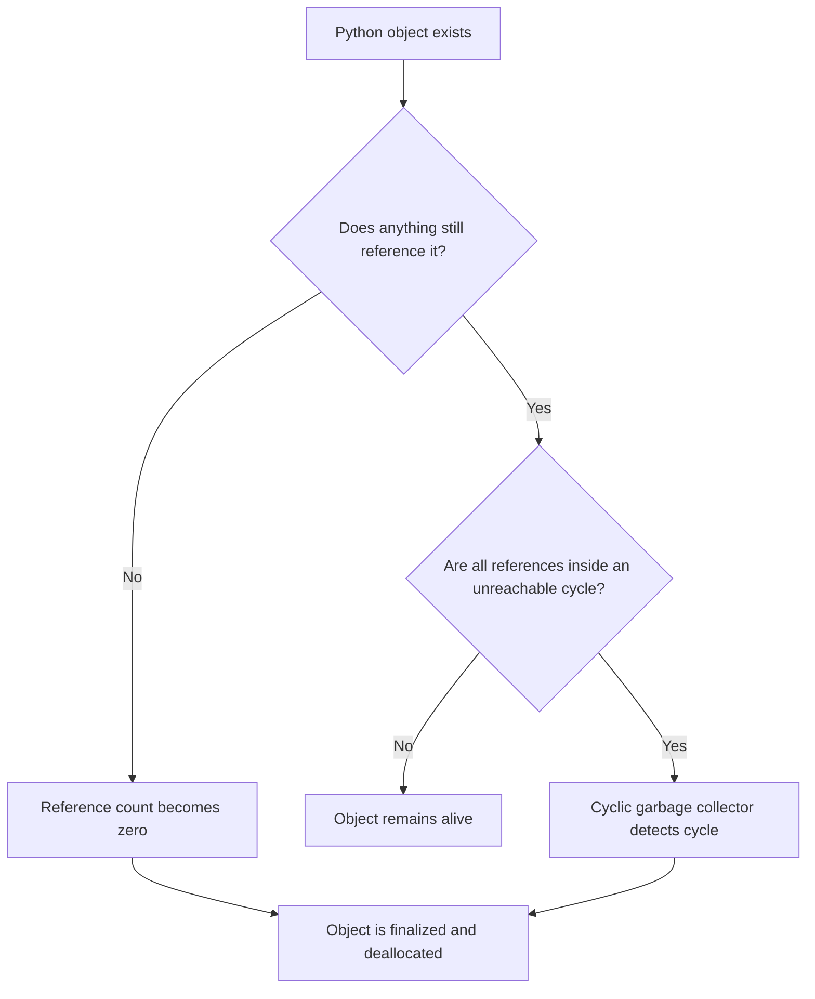

## Core idea

An object is considered **reachable** when your program can still access it by following references from active roots such as:

- Local variables
- Global variables
- Module attributes
- Class attributes
- Container elements
- Active stack frames
- Running threads
- C extension references

An object becomes garbage only when it is no longer reachable from the running program.

---

# 2. Python Objects and References

Python variables do not directly contain ordinary Python objects. A variable name usually holds a **reference** to an object.

```python
user = {"name": "Aarav"}
```

Conceptually:

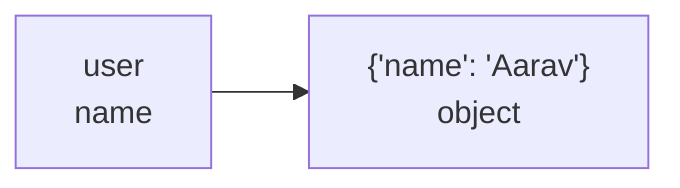

Assigning another variable does not copy the dictionary:

```python
user = {"name": "Aarav"}
backup = user
```

Now both names refer to the same object:

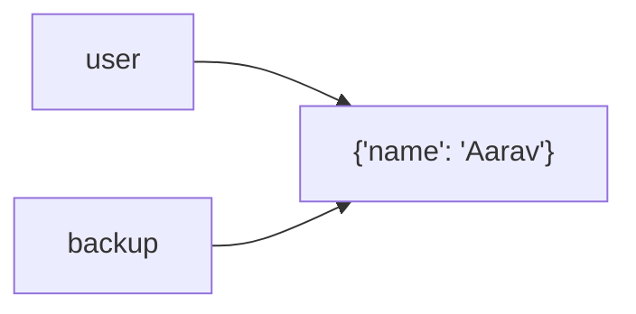

Therefore:

```python
backup["name"] = "Meera"

print(user)
# {'name': 'Meera'}
```

The object is shared because both variables reference the same dictionary.

---

# 3. Reference Counting

## 3.1 What is a reference count?

In CPython, most objects maintain an internal counter representing how many active references point to them.

Conceptually:

```text
Object: {"name": "Aarav"}
Reference count: 2

References:
- user
- backup
```

When a new strong reference is created, the reference count normally increases.

When a strong reference is removed, the count normally decreases.

When the reference count reaches zero, the object can usually be deallocated immediately.

---

## 3.2 Reference count flow

```python
data = [10, 20, 30]   # One reference
alias = data          # Another reference

del data              # Removes one reference
del alias             # Removes the final reference
```

Conceptual flow:

```text
data = [10, 20, 30]
Reference count: 1

alias = data
Reference count: 2

del data
Reference count: 1

del alias
Reference count: 0
Object can be destroyed
```

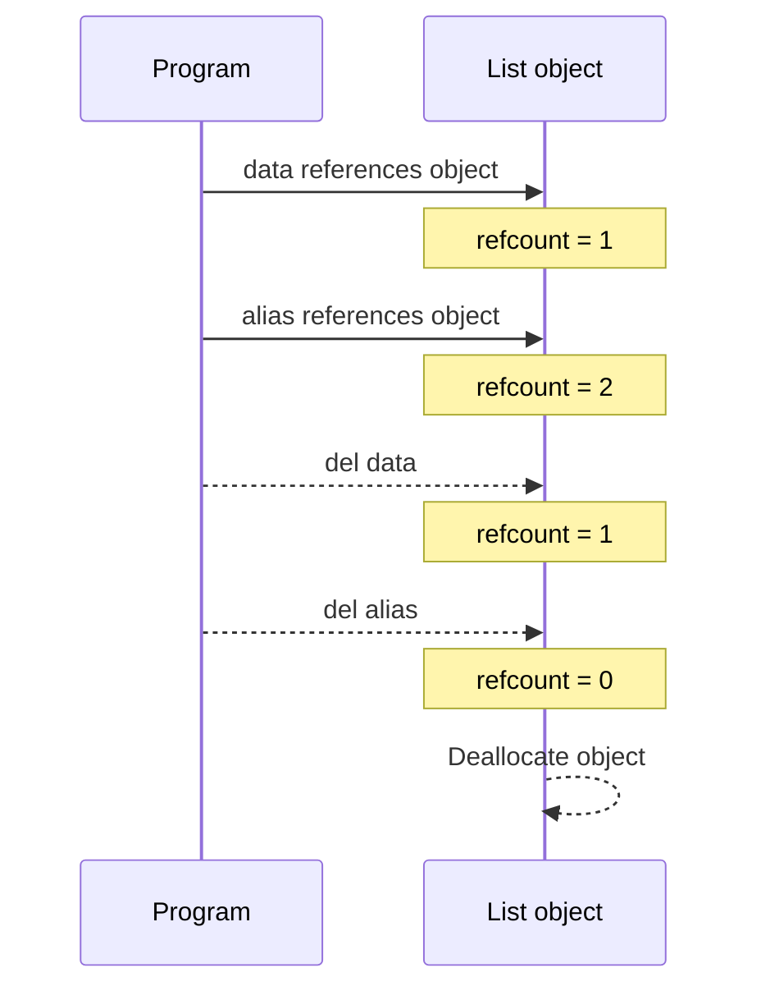

---

## 3.3 Operations that commonly increase references

A new reference may be created when an object is:

- Assigned to another variable
- Added to a list, tuple, set, or dictionary
- Stored as an object attribute
- Passed to a function
- Captured by a closure
- Stored in a module-level variable
- Returned and retained by a caller

Example:

```python
class Cache:
    pass


item = {"id": 101}       # Reference from item

items = [item]           # Reference from list

cache = Cache()
cache.current = item     # Reference from attribute
```

The dictionary is now reachable through several paths.

---

## 3.4 Operations that commonly decrease references

A reference may be removed when:

- A variable is deleted
- A variable is assigned a different object
- An item is removed from a container
- An attribute is deleted or replaced
- A local scope finishes
- A containing object is destroyed

```python
value = {"status": "active"}

value = None
```

The assignment does not delete the dictionary directly. It removes the reference previously held by `value` and makes `value` reference `None`.

---

## 3.5 Inspecting the reference count

CPython provides `sys.getrefcount()`:

```python
import sys


items = []

print(sys.getrefcount(items))
```

The result is normally at least one count higher than expected because passing `items` into `getrefcount()` temporarily creates another reference.

```python
import sys


items = []
before = sys.getrefcount(items)

alias = items
after = sys.getrefcount(items)

print(before)
print(after)
```

Important points:

- `sys.getrefcount()` is mainly a CPython debugging aid.
- The exact number can be affected by temporary references.
- Interactive shells, debuggers, tracing tools, and function calls may keep extra references.
- Application logic should not depend on an exact reference count.

---

# 4. What `del` Actually Does

A common misunderstanding is:

> `del` deletes an object.

More accurately:

> `del` removes a name, item, or attribute reference.

Example:

```python
numbers = [1, 2, 3]
alias = numbers

del numbers

print(alias)
# [1, 2, 3]
```

The list still exists because `alias` still references it.

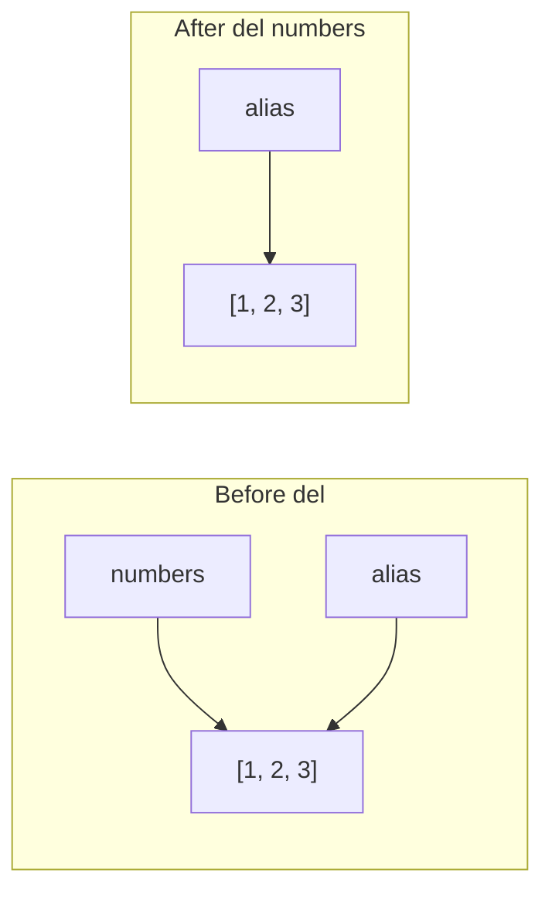

The object becomes eligible for immediate deallocation only when its last strong reference is removed.

---

## 4.1 Rebinding also removes a reference

```python
config = {"timeout": 30}
config = {"timeout": 60}
```

The name `config` is rebound to a new dictionary.

If nothing else refers to the old dictionary, its reference count reaches zero.

---

## 4.2 Container removal

```python
task = {"id": 10}
queue = [task]

del task
```

The object remains alive because `queue[0]` still references it.

```python
queue.clear()
```

Now the container reference is removed. If no other references exist, the object can be reclaimed.

---

# 5. The Circular Reference Problem

Reference counting alone cannot reclaim every unreachable object.

Consider two objects that reference each other:

```python
class Node:
    def __init__(self, name: str) -> None:
        self.name = name
        self.link: Node | None = None


first = Node("first")
second = Node("second")

first.link = second
second.link = first
```

Reference graph:

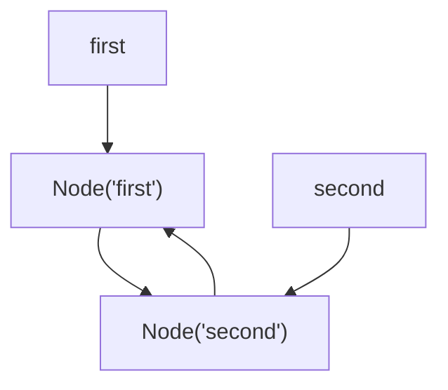

Now remove the external names:

```python
del first
del second
```

The two objects are unreachable from the application, but each one is still referenced by the other.

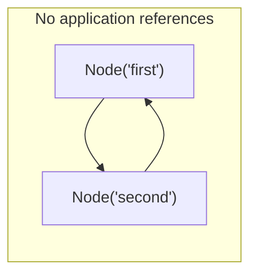

Their reference counts are not zero.

Reference counting alone would leave them in memory.

This is why CPython also needs a cyclic garbage collector.

---

# 6. The Cyclic Garbage Collector

The cyclic garbage collector looks for groups of tracked container objects that:

1. Reference one another
2. Are no longer reachable from the application
3. Can therefore be safely reclaimed

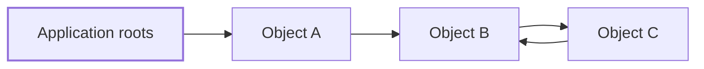

In this graph, `B` and `C` are still reachable through `A`, so they must remain alive.

Now remove the path from the root:

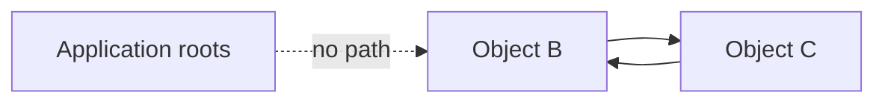

`B` and `C` form a cycle, but the cycle is unreachable. The garbage collector can reclaim it.

---

## 6.1 Not every object is tracked

The cyclic collector mainly tracks objects that may participate in reference cycles, such as:

- Lists
- Dictionaries
- Sets
- Tuples containing tracked objects
- User-defined class instances
- Frames
- Functions and closures

Simple atomic values usually do not need cyclic tracking:

- Integers
- Strings
- Bytes
- `None`
- Some immutable objects containing only atomic values

You can inspect tracking with `gc.is_tracked()`:

```python
import gc


print(gc.is_tracked(100))
print(gc.is_tracked("python"))
print(gc.is_tracked([]))
print(gc.is_tracked([1, 2, 3]))
```

Tracking details are implementation optimizations and should not normally influence application design.

---

## 6.2 Demonstrating cycle collection

```python
import gc
import weakref


class Node:
    def __init__(self, name: str) -> None:
        self.name = name
        self.link: Node | None = None


first = Node("first")
second = Node("second")

first.link = second
second.link = first

first_ref = weakref.ref(first)
second_ref = weakref.ref(second)

del first
del second

print(first_ref() is None)
print(second_ref() is None)

gc.collect()

print(first_ref() is None)
print(second_ref() is None)
```

Before the explicit collection, the objects may still exist because they are part of a cycle.

After collection, the weak references should normally return `None`.

Do not rely on the exact timing of an automatic cyclic collection.

---

# 7. Generational Garbage Collection

The cyclic garbage collector uses generations based on a useful observation:

> Most newly created objects become unreachable quickly, while objects that survive for a long time are likely to remain alive.

For Python 3.14.5 and later, the traditional three-generation model is used:

| Generation | Meaning | Collection frequency |
|---|---|---|
| Generation 0 | Newly tracked objects | Most frequent |
| Generation 1 | Objects that survived younger collection | Less frequent |
| Generation 2 | Long-lived objects | Least frequent |

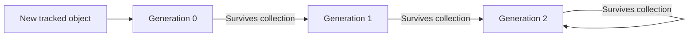

## Why generations help

Scanning every tracked object after every allocation would be expensive.

Instead, Python examines young objects more often because they are more likely to have become garbage.

Long-lived objects are examined less often, reducing collection overhead.

---

## 7.1 When collection starts

The collector monitors the difference between tracked object allocations and deallocations.

A collection can begin when this net allocation count crosses a configured threshold.

```python
import gc


print(gc.get_count())
print(gc.get_threshold())
```

Typical output has the form:

```text
(current_count_0, current_count_1, current_count_2)
(threshold_0, threshold_1, threshold_2)
```

Do not hard-code assumptions about exact default threshold values. They are implementation details and may differ across Python versions or builds.

---

## 7.2 Python 3.14 version note

Python 3.14.0 through 3.14.4 temporarily used a newer incremental collector with two generations.

From Python 3.14.5 onward, CPython restored the generational collector behavior used in Python 3.13, including generations `0`, `1`, and `2`.

For interview discussions, first explain the stable concept:

- Reference counting handles most objects
- A cycle detector handles unreachable cycles
- The collector organizes tracked objects by age

Then mention version-specific generation details only when relevant.

---

# 8. The `gc` Module

The `gc` module provides control and diagnostic access to the cyclic collector.

```python
import gc
```

## 8.1 Common functions

| Function | Purpose |
|---|---|
| `gc.collect()` | Run a full collection |
| `gc.collect(0)` | Collect the youngest generation |
| `gc.collect(1)` | Collect through the middle generation |
| `gc.collect(2)` | Collect through the oldest generation |
| `gc.enable()` | Enable automatic cyclic collection |
| `gc.disable()` | Disable automatic cyclic collection |
| `gc.isenabled()` | Check whether automatic collection is enabled |
| `gc.get_count()` | Read current generation counters |
| `gc.get_threshold()` | Read collection thresholds |
| `gc.set_threshold()` | Change thresholds |
| `gc.get_stats()` | Read per-generation statistics |
| `gc.get_objects()` | Inspect tracked objects |
| `gc.is_tracked()` | Check whether an object is tracked |
| `gc.get_referrers()` | Find tracked objects referring to an object |
| `gc.get_referents()` | Find tracked objects referred to by an object |
| `gc.set_debug()` | Enable GC debugging flags |

---

## 8.2 Force a collection

```python
import gc


collected = gc.collect()

print(f"Collected objects: {collected}")
```

The return value is the total number of collected and uncollectable objects found during that collection.

Manual collection is useful for:

- Controlled tests
- Memory diagnostics
- Long-running batch stages
- Measuring cycle creation
- Special low-latency workloads after profiling

It should not be added blindly to normal request handling.

---

## 8.3 Collection statistics

```python
import gc
from pprint import pprint


pprint(gc.get_stats())
```

The result contains one dictionary per generation.

Typical fields include:

- `collections`
- `collected`
- `uncollectable`

Example processing:

```python
import gc


for generation, stats in enumerate(gc.get_stats()):
    print(
        f"Generation {generation}: "
        f"collections={stats['collections']}, "
        f"collected={stats['collected']}, "
        f"uncollectable={stats['uncollectable']}"
    )
```

---

## 8.4 Enable GC event callbacks

You can measure collection activity using `gc.callbacks`:

```python
import gc
import time
from typing import Any


collection_started_at: dict[int, float] = {}


def track_gc(phase: str, info: dict[str, Any]) -> None:
    generation = int(info["generation"])

    if phase == "start":
        collection_started_at[generation] = time.perf_counter()
        return

    started_at = collection_started_at.pop(generation, None)
    if started_at is None:
        return

    duration_ms = (time.perf_counter() - started_at) * 1_000

    print(
        f"GC generation={generation}, "
        f"collected={info['collected']}, "
        f"uncollectable={info['uncollectable']}, "
        f"duration_ms={duration_ms:.3f}"
    )


gc.callbacks.append(track_gc)
```

In production, callbacks must stay lightweight. A callback that performs slow logging or heavy allocation can itself create performance problems.

---

## 8.5 Disabling the collector

```python
import gc


gc.disable()

try:
    # Carefully measured work that does not create problematic cycles
    run_critical_operation()
finally:
    gc.enable()
```

Important:

- `gc.disable()` disables automatic cyclic garbage collection.
- It does not disable CPython reference counting.
- Objects whose reference count reaches zero can still be reclaimed.
- Unreachable cycles can accumulate while cyclic collection is disabled.
- Disable it only after measuring and understanding the workload.

---

## 8.6 Tuning thresholds

```python
import gc


original = gc.get_threshold()

try:
    gc.set_threshold(1_000, 15, 15)
    run_workload()
finally:
    gc.set_threshold(*original)
```

Changing thresholds affects collection frequency.

General trade-off:

| Threshold direction | Likely effect |
|---|---|
| Lower thresholds | More frequent collections, potentially lower retained cyclic garbage |
| Higher thresholds | Fewer collections, potentially larger memory growth between collections |

Threshold tuning is workload-specific. Measure:

- GC pause duration
- Number of collections
- Peak resident memory
- Request latency
- Throughput
- Number of cyclic objects collected

---

# 9. Weak References

A weak reference points to an object without keeping that object alive.

This is useful when one relationship should not control the target object's lifetime.

```python
import weakref


class User:
    pass


user = User()
reference = weakref.ref(user)

print(reference() is user)
# True

del user

print(reference())
# None
```

---

## 9.1 Breaking parent-child cycles

A tree often has:

- Parent references to children
- Child references to the parent

A strong reference in both directions creates cycles.

```python
class Node:
    def __init__(self, name: str) -> None:
        self.name = name
        self.children: list[Node] = []
        self.parent: Node | None = None
```

A weak parent reference can prevent the child from extending the parent's lifetime:

```python
import weakref


class Node:
    def __init__(self, name: str) -> None:
        self.name = name
        self.children: list[Node] = []
        self._parent_ref: weakref.ReferenceType[Node] | None = None

    @property
    def parent(self) -> Node | None:
        if self._parent_ref is None:
            return None

        return self._parent_ref()

    def add_child(self, child: Node) -> None:
        child._parent_ref = weakref.ref(self)
        self.children.append(child)
```

Diagram:

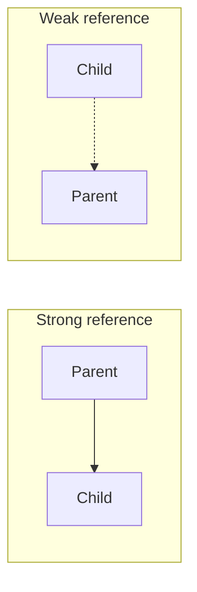

Use weak references when the relationship is observational or secondary.

Do not use them automatically everywhere. They add complexity and the referenced object may disappear at any time.

---

## 9.2 Weak containers

Python provides weak-reference containers:

```python
import weakref


cache: weakref.WeakValueDictionary[str, object]
cache = weakref.WeakValueDictionary()
```

Common types:

- `weakref.WeakKeyDictionary`
- `weakref.WeakValueDictionary`
- `weakref.WeakSet`

These are useful for metadata registries and caches that should not keep objects alive by themselves.

---

# 10. Finalization and `__del__`

`__del__()` is a finalizer that Python may invoke when an object is being finalized.

```python
class Connection:
    def __del__(self) -> None:
        print("Connection object finalized")
```

However, `__del__()` should not be the primary mechanism for important cleanup.

Reasons include:

- Finalization timing is not portable across Python implementations.
- Objects can be kept alive unexpectedly by references.
- Cyclic collection is not immediate.
- Interpreter shutdown may make module globals unavailable.
- Exceptions raised inside `__del__()` cannot be handled normally.
- Finalizers can resurrect objects by creating a new reference to `self`.

---

## 10.1 Object resurrection

```python
saved: object | None = None


class Example:
    def __del__(self) -> None:
        global saved
        saved = self
```

When finalization runs, `self` is assigned to the global `saved`.

The object becomes reachable again.

This is called **resurrection**.

It makes lifecycle behavior difficult to reason about and should generally be avoided.

---

## 10.2 Prefer `weakref.finalize`

For fallback cleanup not tied to object resurrection, `weakref.finalize` is often easier to manage than a custom `__del__()`:

```python
from pathlib import Path
import weakref


class TemporaryFile:
    def __init__(self, path: Path) -> None:
        self.path = path
        self._finalizer = weakref.finalize(
            self,
            self._remove_file,
            path,
        )

    @staticmethod
    def _remove_file(path: Path) -> None:
        path.unlink(missing_ok=True)
```

This is still fallback cleanup.

For deterministic external resource handling, use a context manager.

---

# 11. Resource Management Is Different

Garbage collection manages Python object memory.

It should not be treated as a reliable scheduler for releasing external resources such as:

- Files
- Database connections
- Sockets
- Locks
- Transactions
- Temporary directories
- Cloud clients
- OS handles

Bad approach:

```python
file = open("report.txt", "w", encoding="utf-8")
file.write("data")

# Hoping garbage collection closes the file
```

Better approach:

```python
with open("report.txt", "w", encoding="utf-8") as file:
    file.write("data")
```

The context manager closes the file deterministically even if an exception occurs.

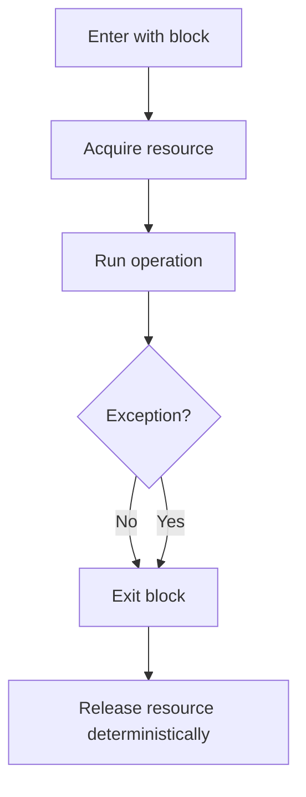

The same principle applies to database transactions:

```python
from django.db import transaction


with transaction.atomic():
    update_order()
    create_payment_record()
```

The resource or transaction lifetime is controlled by program structure, not by garbage collection timing.

---

# 12. Memory Leaks in Python

Automatic memory management does not mean a Python application cannot leak memory.

A practical definition of a memory leak is:

> Memory usage keeps growing because objects or native allocations remain retained longer than intended.

---

## 12.1 Accidental global retention

```python
processed_requests: list[dict[str, object]] = []


def handle_request(payload: dict[str, object]) -> None:
    processed_requests.append(payload)
```

Every payload remains reachable through the global list.

The garbage collector is working correctly. The application is retaining the objects.

---

## 12.2 Unbounded cache

```python
cache: dict[str, bytes] = {}


def load_document(document_id: str) -> bytes:
    if document_id not in cache:
        cache[document_id] = read_document(document_id)

    return cache[document_id]
```

If document IDs keep changing, the cache grows forever.

Use a bounded cache:

```python
from functools import lru_cache


@lru_cache(maxsize=1_000)
def load_document(document_id: str) -> bytes:
    return read_document(document_id)
```

---

## 12.3 Event-listener retention

```python
subscribers: list[object] = []


def subscribe(listener: object) -> None:
    subscribers.append(listener)
```

If listeners are never removed, the registry keeps them alive.

Possible solutions:

- Explicit unsubscribe logic
- Weak references
- Scoped event buses
- Lifecycle-aware cleanup

---

## 12.4 Closures retaining large objects

```python
def build_processor(records: list[dict[str, object]]):
    def process() -> int:
        return len(records)

    return process
```

The returned function captures `records`.

As long as the closure remains alive, the entire list remains alive.

---

## 12.5 Exception tracebacks

Tracebacks can retain stack frames, and stack frames retain local variables.

```python
stored_exceptions: list[Exception] = []


def run() -> None:
    large_data = bytearray(100_000_000)

    try:
        raise RuntimeError("Failed")
    except RuntimeError as exc:
        stored_exceptions.append(exc)
```

Retaining exceptions or tracebacks can indirectly retain large local objects.

Store concise error information instead when the full traceback is unnecessary:

```python
stored_errors: list[str] = []


def run() -> None:
    large_data = bytearray(100_000_000)

    try:
        raise RuntimeError("Failed")
    except RuntimeError as exc:
        stored_errors.append(str(exc))
```

---

## 12.6 Native memory

Libraries implemented in C, C++, Rust, or other native languages may allocate memory outside Python's object heap.

Examples include:

- NumPy arrays
- Image-processing buffers
- Machine-learning tensors
- Database drivers
- Compression libraries
- C extension caches

Python-level object inspection may not explain all process memory growth.

---

## 12.7 Memory may not return to the operating system

Even after Python objects are freed, process resident memory may remain high because:

- CPython's allocator may keep arenas for reuse
- Native libraries may cache memory
- Memory can become fragmented
- Built-in free lists may retain reusable blocks
- The operating system reports allocated pages differently

Therefore:

```text
Object was reclaimed
```

does not always imply:

```text
Process RSS immediately decreased
```

This distinction is important when investigating production memory usage.

---

# 13. Debugging Memory Problems

A reliable investigation should distinguish between:

1. Live Python objects
2. Unreachable cycles
3. Allocator reuse
4. Native allocations
5. Operating-system memory reporting

---

## 13.1 Start with `tracemalloc`

`tracemalloc` records Python memory allocation traces.

```python
import tracemalloc


tracemalloc.start()

before = tracemalloc.take_snapshot()

run_workload()

after = tracemalloc.take_snapshot()

for statistic in after.compare_to(before, "lineno")[:10]:
    print(statistic)
```

This helps identify Python source lines responsible for increased allocated memory.

A more complete helper:

```python
import gc
import tracemalloc
from collections.abc import Callable
from typing import Any


def profile_allocations(
    operation: Callable[..., Any],
    *args: object,
    **kwargs: object,
) -> Any:
    gc.collect()
    tracemalloc.start()

    before = tracemalloc.take_snapshot()

    try:
        return operation(*args, **kwargs)
    finally:
        gc.collect()

        after = tracemalloc.take_snapshot()
        differences = after.compare_to(before, "lineno")

        print("Largest Python allocation differences:")

        for item in differences[:10]:
            print(item)

        tracemalloc.stop()
```

---

## 13.2 Inspect generation statistics

```python
import gc
from pprint import pprint


pprint(gc.get_stats())
```

Questions to consider:

- Is generation 0 collecting very frequently?
- Are many cyclic objects collected?
- Are uncollectable objects reported?
- Does memory grow even when collection counts look normal?

---

## 13.3 Inspect referrers carefully

```python
import gc


target = find_suspicious_object()

gc.collect()

referrers = gc.get_referrers(target)

for referrer in referrers:
    print(type(referrer))
```

Warnings:

- `gc.get_referrers()` is a debugging tool, not an application feature.
- Calling it creates additional temporary references.
- Frames, debuggers, notebooks, and inspection code may appear as referrers.
- Returned objects may be in temporary internal states.
- It does not reveal every native or extension-level reference.

---

## 13.4 Inspect referents

```python
import gc


for referent in gc.get_referents(target):
    print(type(referent), repr(referent)[:100])
```

This helps understand what tracked objects the target refers to.

---

## 13.5 Debug unreachable objects

```python
import gc


gc.set_debug(gc.DEBUG_SAVEALL)

try:
    create_suspected_cycles()
    gc.collect()

    print(f"Saved unreachable objects: {len(gc.garbage)}")

    for obj in gc.garbage[:20]:
        print(type(obj), repr(obj)[:100])
finally:
    gc.set_debug(0)
    gc.garbage.clear()
```

`DEBUG_SAVEALL` deliberately keeps unreachable objects in `gc.garbage` instead of freeing them.

Use it only during debugging and clear the saved list afterward.

---

## 13.6 Compare object counts cautiously

```python
import gc
from collections import Counter


def tracked_type_counts() -> Counter[str]:
    return Counter(type(obj).__name__ for obj in gc.get_objects())


before = tracked_type_counts()

run_workload()
gc.collect()

after = tracked_type_counts()

for type_name, count in (after - before).most_common(20):
    print(type_name, count)
```

This can reveal growing object categories, but it has limitations:

- Not all objects are GC-tracked
- The inspection itself allocates objects
- A count increase may be legitimate
- Native memory is not represented
- Objects may be reused between samples

---

## 13.7 Production investigation flow

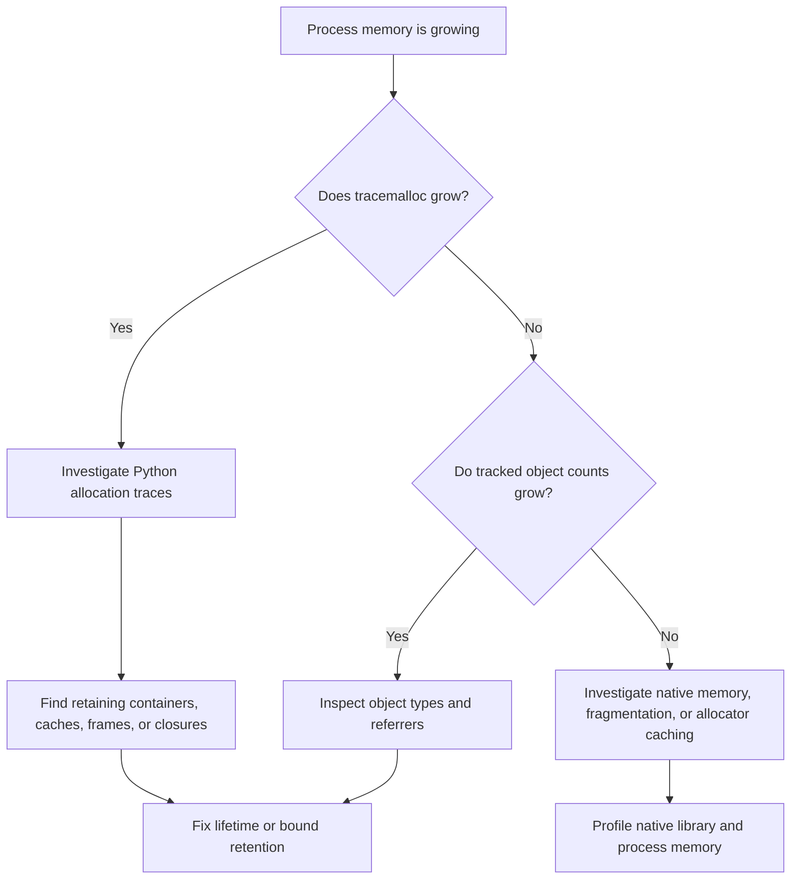

---

# 14. Practical Performance Guidance

## 14.1 Let Python manage GC by default

For most applications, the default configuration is the correct starting point.

This includes:

- Django applications
- FastAPI services
- CLI tools
- Background workers
- Data-processing scripts
- Automation services

Tune only after collecting evidence.

---

## 14.2 Reduce object retention before tuning GC

When memory grows, first check:

- Global collections
- Caches
- Session storage
- Request histories
- Metrics labels
- Background task references
- Unclosed generators
- Closures
- Exception tracebacks
- ORM query-result retention
- Native library buffers

GC tuning cannot reclaim objects that are still reachable.

---

## 14.3 Avoid forcing collection per request

Bad pattern:

```python
def api_endpoint():
    result = process_request()
    gc.collect()
    return result
```

Possible problems:

- Increased response latency
- Reduced throughput
- Full-heap scanning
- Unpredictable pauses
- Treating symptoms instead of retention causes

Manual collection may make sense at natural workload boundaries:

```python
def process_large_batch(batch: list[Record]) -> None:
    process(batch)
    release_batch_state()
    gc.collect()
```

Even here, confirm the benefit with measurements.

---

## 14.4 Break cycles when lifecycle clarity matters

Cycles are not automatically bugs.

However, explicit lifecycle management can still be valuable when objects hold:

- Large buffers
- Native handles
- Complex callbacks
- Framework references
- Long-lived graphs
- Finalizers

Possible techniques:

```python
class Worker:
    def close(self) -> None:
        self.callback = None
        self.owner = None
        self.large_buffer = None
```

Use lifecycle methods to express ownership clearly.

---

## 14.5 Use bounded caches

Prefer:

```python
from functools import lru_cache


@lru_cache(maxsize=512)
def load_configuration(key: str) -> Configuration:
    return fetch_configuration(key)
```

Instead of:

```python
cache: dict[str, Configuration] = {}
```

A bounded cache provides a predictable upper limit.

---

## 14.6 Use context managers for resources

```python
with database.connection() as connection:
    connection.execute(query)
```

```python
with lock:
    update_shared_state()
```

```python
with TemporaryDirectory() as directory:
    generate_files(directory)
```

This makes cleanup deterministic and readable.

---

## 14.7 Measure the right metrics

For GC-sensitive workloads, observe:

- Process RSS
- Python allocated memory
- Generation collection counts
- GC pause duration
- Number of objects collected
- Request latency percentiles
- Throughput
- Cache size
- Queue depth
- Native allocator metrics

One metric alone rarely explains a memory problem.

---

# 15. CPython vs Other Python Implementations

Reference counting is a CPython implementation detail, not a guarantee of the Python language itself.

Other implementations may use different strategies.

| Implementation | Memory-management note |
|---|---|
| CPython | Primarily reference counting plus cyclic GC |
| PyPy | Uses a tracing garbage collector; finalization timing differs |
| Jython | Relies substantially on JVM garbage collection |
| IronPython | Relies substantially on .NET garbage collection |

Code should not depend on an object being finalized immediately after its last visible reference disappears.

Portable code uses explicit cleanup:

```python
with open("data.txt", encoding="utf-8") as file:
    contents = file.read()
```

Not:

```python
file = open("data.txt", encoding="utf-8")
contents = file.read()
del file  # Do not depend on this for portable cleanup timing
```

---

# 16. Complete Mental Model

Use this step-by-step model when reasoning about an object's lifetime.

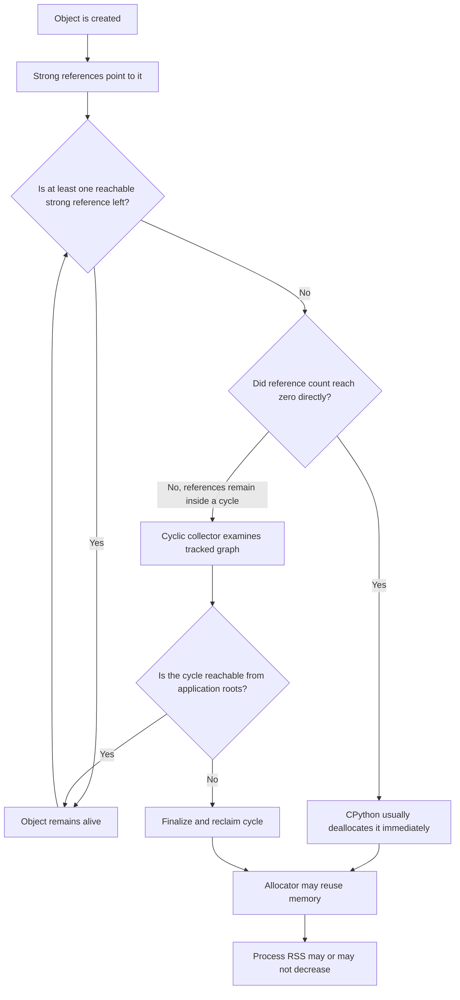

## Memory-management layers

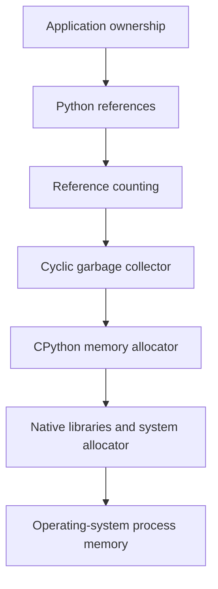

A memory issue can exist at any of these layers.

---

# 17. Key Takeaways

1. A Python variable normally holds a reference to an object, not the object itself.

2. CPython primarily uses reference counting to manage object lifetime.

3. When an object's reference count reaches zero, CPython usually reclaims it immediately.

4. `del` removes a reference; it does not guarantee immediate destruction of the underlying object.

5. Reference counting cannot independently reclaim unreachable circular reference graphs.

6. The cyclic garbage collector detects unreachable cycles among tracked objects.

7. Python 3.14.5 and later use the restored three-generation collector behavior.

8. GC only reclaims unreachable objects. It cannot fix an application that still retains references.

9. Use `with`, `close()`, and explicit lifecycle methods for external resources.

10. Use weak references when a relationship should not keep another object alive.

11. Treat `__del__()` as a fallback finalization mechanism, not your primary resource-management design.

12. Start memory investigations with retention analysis and `tracemalloc`, then inspect GC behavior and native memory.

13. High process memory does not always mean live Python objects are leaking.

14. GC tuning should follow measurement, not guesswork.

15. For portable Python code, do not depend on CPython's immediate reference-count finalization.

---

## Compact Revision Diagram

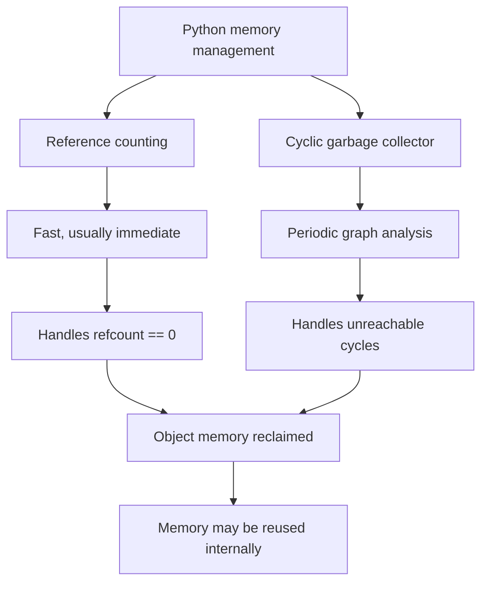

---

## Official References

- Python Standard Library: `gc` — Garbage Collector interface
- Python Language Reference: Data model and object lifetime
- Python Programming FAQ: `del`, `__del__()`, cycles, and weak references
- Python 3.14 What's New: garbage collector changes in Python 3.14.5
