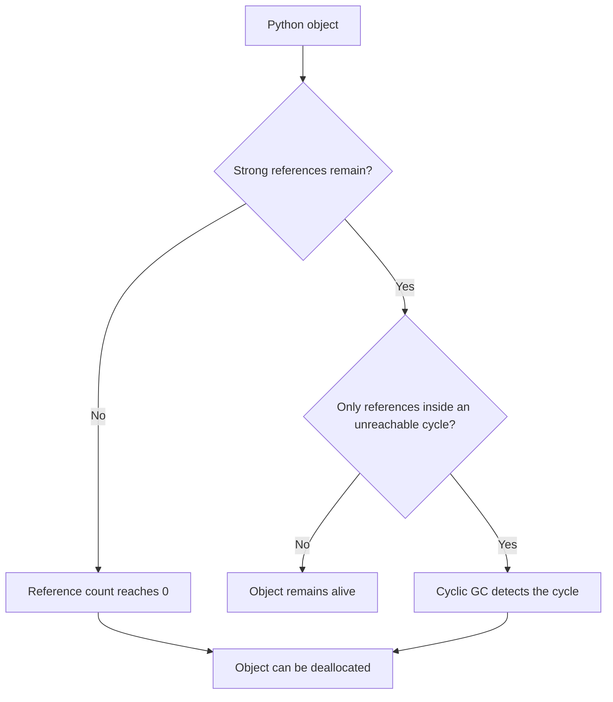
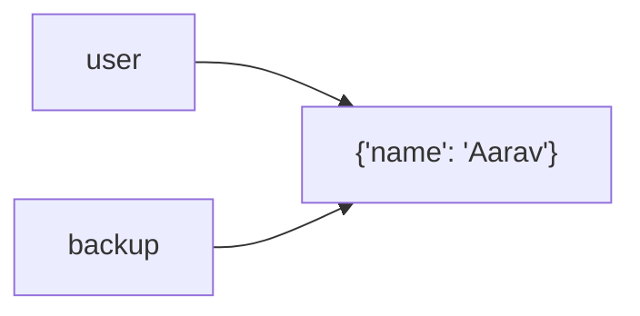
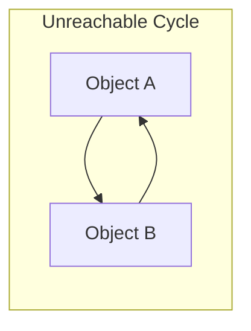
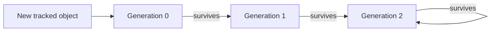
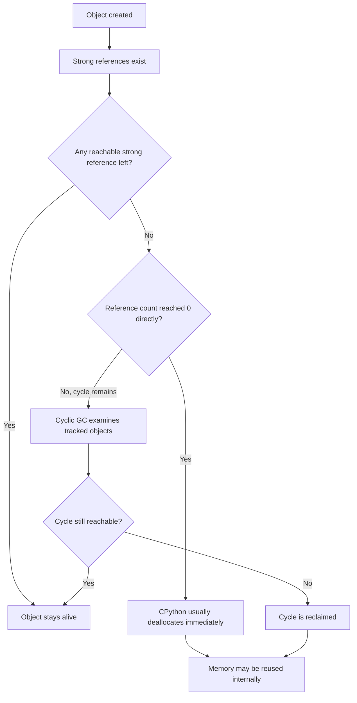

# Garbage Collection and Reference Counting in Python

> In **CPython**, memory cleanup mainly works through **reference counting**, while a **cyclic garbage collector** handles unreachable reference cycles.

## Index

1. [Core Mental Model](#1-core-mental-model)
2. [References and Reference Counting](#2-references-and-reference-counting)
3. [Why Reference Counting Is Not Enough](#3-why-reference-counting-is-not-enough)
4. [Generational Garbage Collection](#4-generational-garbage-collection)
5. [The `gc` Module](#5-the-gc-module)
6. [Weak References](#6-weak-references)
7. [Resource Management vs Garbage Collection](#7-resource-management-vs-garbage-collection)
8. [Memory Growth and Debugging](#8-memory-growth-and-debugging)
9. [Practical Example](#9-practical-example)
10. [Interview-Focused Summary](#10-interview-focused-summary)

---

# 1. Core Mental Model

Python variables do not normally contain objects directly. A variable name holds a **reference** to an object.

In CPython, object lifetime is mainly handled by two cooperating mechanisms:

- **Reference counting** — usually reclaims an object as soon as its last strong reference disappears.
- **Cyclic garbage collection** — finds unreachable objects that still reference each other.



The important rule is:

> Garbage collection can reclaim only objects that are no longer reachable. It cannot free an object that your application still references.

---

# 2. References and Reference Counting

## 2.1 Variables hold references

```python
user = {"name": "Aarav"}
backup = user
```

Both names point to the **same dictionary**.



Therefore, changing the object through one reference is visible through the other:

```python
backup["name"] = "Meera"

print(user)
# {'name': 'Meera'}
```

---

## 2.2 What reference counting means

CPython keeps track of strong references to most objects.

Conceptually:

```text
data = [10, 20, 30]     reference count increases
alias = data             another strong reference

del data                 one reference removed
del alias                final reference removed

reference count = 0
→ object can be deallocated
```

A reference can come from:

- A local or global variable
- A list, dictionary, tuple, or set
- An object attribute
- A function argument
- A closure
- A module or framework object

---

## 2.3 What `del` actually does

`del` does **not** mean "destroy this object."

It removes a reference.

```python
numbers = [1, 2, 3]
alias = numbers

del numbers

print(alias)
# [1, 2, 3]
```

The list remains alive because `alias` still references it.

The same idea applies when a variable is rebound:

```python
config = {"timeout": 30}
config = None
```

The old dictionary becomes reclaimable only if no other strong reference points to it.

---

## 2.4 `sys.getrefcount()`

CPython exposes a debugging helper:

```python
import sys

items = []

print(sys.getrefcount(items))
```

The result is usually higher than expected because passing `items` to `getrefcount()` temporarily creates another reference.

Use it for investigation, not application logic.

---

# 3. Why Reference Counting Is Not Enough

Reference counting cannot solve a **reference cycle** by itself.

Consider:

```text
Object A → Object B
Object B → Object A
```

Even after the application stops referencing both objects, each object still has an internal reference from the other.



Their reference counts do not naturally reach zero.

The **cyclic garbage collector** exists to find and reclaim these unreachable cycles.

## Objects commonly involved in cycles

The collector mainly tracks objects capable of containing references, such as:

- Lists
- Dictionaries
- Sets
- User-defined class instances
- Frames
- Functions and closures
- Tuples containing tracked objects

Simple atomic values such as many integers and strings normally do not need cyclic tracking.

You can inspect this with:

```python
import gc

gc.is_tracked([1, 2, 3])   # Usually True
gc.is_tracked(100)         # Usually False
```

These tracking details are CPython implementation behavior and should rarely affect normal application design.

---

# 4. Generational Garbage Collection

CPython's cyclic collector organizes tracked objects by age.

The main idea is:

> Most temporary objects die young, while objects that survive several collections are more likely to remain alive.

For **Python 3.14.5 and later**, CPython again uses three generations:

| Generation | Meaning | Typical collection frequency |
|---|---|---|
| `0` | Newly tracked objects | Most frequent |
| `1` | Objects that survived younger collections | Less frequent |
| `2` | Long-lived objects | Least frequent |



## Python 3.14 version note

Python **3.14.0 through 3.14.4** temporarily used a newer two-generation incremental collector.

Starting with **Python 3.14.5**, CPython restored the three-generation collector behavior used in Python 3.13.

For interviews, focus first on the stable idea:

1. Reference counting handles most object cleanup.
2. Cyclic GC handles unreachable cycles.
3. Tracked objects are collected based partly on age and allocation activity.

Version-specific details are secondary unless the interviewer asks about recent CPython changes.

---

# 5. The `gc` Module

The `gc` module controls and inspects the **cyclic garbage collector**.

It does not replace reference counting.

## Common functions

| Function | Purpose |
|---|---|
| `gc.collect()` | Run a full cyclic collection |
| `gc.collect(0)` | Collect the youngest generation |
| `gc.collect(1)` | Collect through the middle generation |
| `gc.collect(2)` | Collect through the oldest generation |
| `gc.enable()` | Enable automatic cyclic GC |
| `gc.disable()` | Disable automatic cyclic GC |
| `gc.isenabled()` | Check whether automatic GC is enabled |
| `gc.get_count()` | Read current collection counters |
| `gc.get_threshold()` | Read GC thresholds |
| `gc.set_threshold()` | Change collection thresholds |
| `gc.get_stats()` | Read per-generation statistics |
| `gc.is_tracked(obj)` | Check whether an object is GC-tracked |
| `gc.get_referrers(obj)` | Inspect tracked objects referring to an object |

## Important behavior

```python
import gc

collected = gc.collect()
print(collected)
```

`gc.collect()` returns the number of objects found as collected plus uncollectable during that collection.

Manual collection can be useful for:

- Memory debugging
- Controlled tests
- Large batch boundaries
- Profiling GC-sensitive workloads

Avoid calling `gc.collect()` on every web request unless profiling proves it is necessary. Full collections can add latency while failing to fix the real cause if objects are still reachable.

---

## Disabling GC

```python
import gc

gc.disable()

try:
    run_measured_workload()
finally:
    gc.enable()
```

`gc.disable()` disables **automatic cyclic collection only**.

Reference counting still works, so objects whose reference count reaches zero can still be reclaimed.

Unreachable cycles can accumulate while automatic cyclic GC is disabled.

---

# 6. Weak References

A **weak reference** points to an object without keeping that object alive.

```python
import weakref

class User:
    pass

user = User()
reference = weakref.ref(user)

del user

print(reference())
# None
```

Weak references are useful when a relationship should observe an object but should not own its lifetime.

Common uses include:

- Parent references in object trees
- Object registries
- Metadata maps
- Caches

Python also provides:

- `weakref.WeakKeyDictionary`
- `weakref.WeakValueDictionary`
- `weakref.WeakSet`
- `weakref.finalize`

Do not use weak references by default. They are useful when ownership semantics genuinely require them.

---

# 7. Resource Management vs Garbage Collection

Garbage collection manages **Python object lifetime**.

It should not be used as the cleanup strategy for external resources such as:

- Files
- Database connections
- Sockets
- Locks
- Transactions
- Temporary directories
- OS handles

Prefer deterministic cleanup with a context manager:

```python
with open("report.txt", "w", encoding="utf-8") as file:
    file.write("data")
```

For Django transactions:

```python
from django.db import transaction

with transaction.atomic():
    update_order()
    create_payment_record()
```

The `with` block makes ownership and cleanup explicit even if an exception occurs.

Also avoid depending on `__del__()` for critical cleanup. Finalization timing can vary, cycles can delay it, and interpreter shutdown makes finalizers harder to reason about.

---

# 8. Memory Growth and Debugging

Automatic garbage collection does **not** guarantee that a process cannot keep growing in memory.

A common Python "memory leak" is actually **unintended retention**: the program still has references to objects that are no longer useful.

Typical sources include:

- Unbounded caches
- Global lists or dictionaries
- Event listeners that are never removed
- Closures retaining large objects
- Stored exceptions and tracebacks
- ORM query results held too long
- Native libraries allocating memory outside Python's managed heap

## Key distinction

```text
Object is unreachable
        ↓
Python can reclaim it
        ↓
Allocator may keep that memory for reuse
        ↓
Process RSS may stay high
```

Therefore:

> "Python freed the object" does not necessarily mean "the operating system immediately shows lower process memory."

---

## Practical debugging flow

Start with `tracemalloc` when Python-level allocations appear to be growing:

```python
import gc
import tracemalloc

tracemalloc.start()

gc.collect()
before = tracemalloc.take_snapshot()

run_workload()

gc.collect()
after = tracemalloc.take_snapshot()

for stat in after.compare_to(before, "lineno")[:10]:
    print(stat)
```

Useful tools and signals:

- `tracemalloc` — Python allocation growth
- `gc.get_stats()` — collection activity
- `gc.get_referrers()` — unexpected retaining objects
- Process RSS — total process memory
- Library-specific profilers — native memory such as NumPy or ML tensors

A good investigation asks:

1. Are Python allocations growing?
2. Which object types remain alive?
3. What still references them?
4. Is the growth actually native memory or allocator reuse?

---

# 9. Practical Example

This single example shows why cyclic GC is necessary.

```python
import gc
import weakref


class Node:
    def __init__(self, name: str) -> None:
        self.name = name
        self.other: Node | None = None


first = Node("first")
second = Node("second")

first.other = second
second.other = first

first_ref = weakref.ref(first)
second_ref = weakref.ref(second)

del first
del second

print(first_ref() is None)
# May still be False because the objects reference each other.

gc.collect()

print(first_ref() is None)
print(second_ref() is None)
# Expected: True, True
```

## What happens

```text
1. first references second
2. second references first
3. External names are deleted
4. Internal references keep both reference counts above zero
5. The cycle is unreachable from the program
6. Cyclic GC detects the unreachable cycle
7. Both objects can be reclaimed
```

This is the key reason CPython needs both reference counting and cyclic garbage collection.

---

# 10. Interview-Focused Summary

## Reference counting

- CPython primarily manages object lifetime using reference counts.
- Creating a strong reference usually increases the count.
- Removing a strong reference usually decreases it.
- When the count reaches zero, the object can normally be reclaimed immediately.

## Cyclic garbage collector

- Reference counting alone cannot reclaim unreachable cycles.
- CPython's cyclic GC periodically examines tracked container objects.
- In Python 3.14.5+, the collector again uses generations `0`, `1`, and `2`.

## `del`

- `del` removes a reference.
- It does not guarantee that the underlying object is destroyed.

## Weak references

- A weak reference does not keep its target alive.
- Useful for caches, registries, and non-owning relationships.

## Resource cleanup

- Use `with`, `close()`, or explicit lifecycle methods for files, sockets, transactions, and similar resources.
- Do not rely on garbage collection timing.

## Memory debugging

- First look for objects that are still reachable unintentionally.
- Use `tracemalloc`, GC statistics, referrer inspection, and process-level memory metrics.
- High RSS does not automatically mean live Python objects are leaking.

---

## Final Mental Model



> **Interview-ready explanation:** CPython primarily uses reference counting, so most objects are reclaimed when their last strong reference disappears. Reference counting cannot handle unreachable reference cycles, so CPython also has a generational cyclic garbage collector. The `gc` module lets us inspect or control that collector, while weak references help express non-owning relationships. Garbage collection should not be confused with deterministic resource cleanup, which should use context managers or explicit lifecycle methods.
