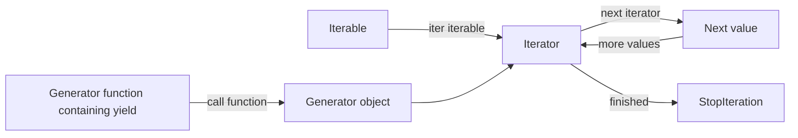
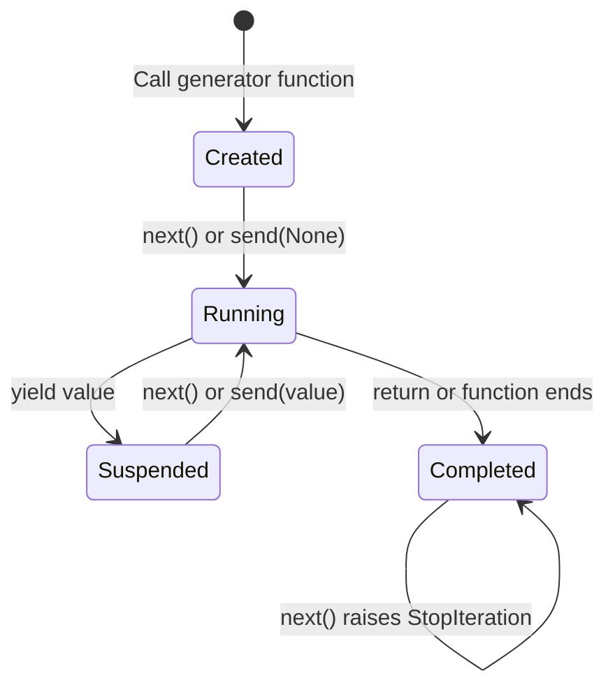
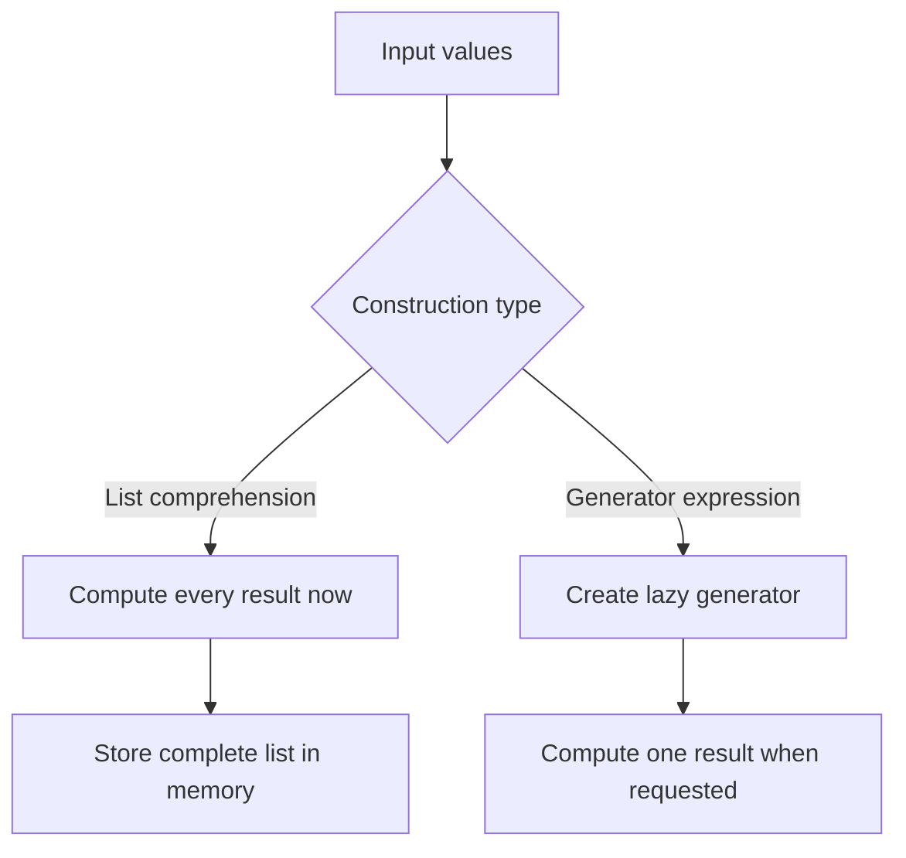
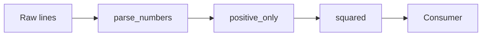

# Python Generators, Iterators, and `yield`

> Iteration is Python's standard mechanism for processing values one at a time. An **iterable** provides an iterator, an **iterator** produces the next value, and a **generator** is a convenient way to create an iterator using `yield`.

This topic is important in day-to-day Python development because it appears in loops, file processing, database result streaming, API pagination, data pipelines, and memory-efficient processing.

---

## 1. Core Mental Model

The following three terms are related, but they are not identical.

| Concept | Meaning | Main methods/syntax | Can usually be reused? |
|---|---|---|---|
| **Iterable** | An object that can provide an iterator | `__iter__()` | Yes, depending on the object |
| **Iterator** | An object that returns one item at a time | `__iter__()`, `__next__()` | No; normally one pass |
| **Generator** | A special iterator created by a generator function or expression | `yield` or `(expression for item in iterable)` | No; normally one pass |



### 1.1 Iterable

An **iterable** is an object whose elements can be processed one at a time.

Common iterables include:

- `list`
- `tuple`
- `str`
- `set`
- `dict`
- `range`
- file objects
- custom objects implementing `__iter__()`

```python
numbers = [10, 20, 30]

for number in numbers:
    print(number)
```

The list is iterable because Python can obtain an iterator from it.

```python
numbers = [10, 20, 30]
iterator = iter(numbers)

print(iterator)
```

A reusable container usually creates a **new iterator** each time `iter()` is called.

```python
numbers = [10, 20, 30]

first_iterator = iter(numbers)
second_iterator = iter(numbers)

print(first_iterator is second_iterator)  # False
```

### 1.2 Iterator

An **iterator** represents a stream of values. It tracks its current position and returns the next item when requested.

```python
numbers = [10, 20, 30]
iterator = iter(numbers)

print(next(iterator))  # 10
print(next(iterator))  # 20
print(next(iterator))  # 30
```

After the final item, calling `next()` raises `StopIteration`.

```python
numbers = [10]
iterator = iter(numbers)

print(next(iterator))  # 10
print(next(iterator))  # Raises StopIteration
```

An iterator is also iterable. Its `__iter__()` method returns the same iterator object.

```python
numbers = iter([10, 20, 30])

print(iter(numbers) is numbers)  # True
```

This is why an iterator is generally **single-use**. After it has been consumed, it remains exhausted.

### 1.3 Generator

A **generator** is a special type of iterator. Python creates it from either:

1. A generator function containing `yield`
2. A generator expression

```python
def generate_numbers():
    yield 10
    yield 20
    yield 30

numbers = generate_numbers()

print(type(numbers))
print(next(numbers))  # 10
```

Calling `generate_numbers()` does not execute the function body immediately. It creates a generator object. Execution begins when Python requests the first value.

---

## 2. How Python Iteration Works

### 2.1 `iter()` and `next()`

Python iteration is mainly built on two built-in functions:

```python
iterator = iter(iterable)
value = next(iterator)
```

- `iter(object)` asks an iterable for an iterator.
- `next(iterator)` asks that iterator for its next value.
- When no values remain, the iterator raises `StopIteration`.

You can provide a default value to `next()` to avoid handling `StopIteration` manually.

```python
iterator = iter([10])

print(next(iterator, None))  # 10
print(next(iterator, None))  # None
```

Use a unique sentinel when `None` could be a valid item.

```python
missing = object()
iterator = iter([None])

value = next(iterator, missing)

if value is missing:
    print("No value available")
else:
    print(value)  # None
```

### 2.2 How a `for` Loop Works Internally

This loop:

```python
for number in [10, 20, 30]:
    print(number)
```

Conceptually behaves like this:

```python
iterator = iter([10, 20, 30])

while True:
    try:
        number = next(iterator)
    except StopIteration:
        break

    print(number)
```

```mermaid
sequenceDiagram
    participant Loop as for loop
    participant Iterable
    participant Iterator

    Loop->>Iterable: iter(iterable)
    Iterable-->>Loop: iterator
    Loop->>Iterator: next(iterator)
    Iterator-->>Loop: item 1
    Loop->>Iterator: next(iterator)
    Iterator-->>Loop: item 2
    Loop->>Iterator: next(iterator)
    Iterator-->>Loop: StopIteration
    Note over Loop: Loop ends normally
```

In normal application code, you should let the `for` loop handle `StopIteration` rather than catching it yourself.

### 2.3 The Iterator Protocol

A standard iterator implements:

```python
def __iter__(self):
    return self

def __next__(self):
    ...
```

The responsibilities are:

- `__iter__()` returns the iterator object.
- `__next__()` returns the next value.
- `__next__()` raises `StopIteration` when the sequence is complete.

---

## 3. Creating a Custom Iterator

The following iterator counts down from a starting number.

```python
class Countdown:
    def __init__(self, start: int) -> None:
        if start < 0:
            raise ValueError("start must be zero or greater")

        self.current = start

    def __iter__(self) -> "Countdown":
        return self

    def __next__(self) -> int:
        if self.current == 0:
            raise StopIteration

        value = self.current
        self.current -= 1
        return value


countdown = Countdown(3)

for number in countdown:
    print(number)
```

Output:

```text
3
2
1
```

State changes after every call:

```text
Initial state: current = 3
      next()
          ↓
Return 3, store current = 2
      next()
          ↓
Return 2, store current = 1
      next()
          ↓
Return 1, store current = 0
      next()
          ↓
Raise StopIteration
```

The same behavior is much shorter with a generator:

```python
def countdown(start: int):
    if start < 0:
        raise ValueError("start must be zero or greater")

    while start > 0:
        yield start
        start -= 1
```

Generators are usually preferable when the iteration logic can be expressed naturally as sequential steps. A custom iterator class is still useful when iteration is part of a larger stateful object or when multiple related methods are required.

---

## 4. Generator Functions and `yield`

A function becomes a **generator function** when its body contains `yield`.

```python
def generate_user_ids():
    yield 101
    yield 102
    yield 103
```

Calling it returns a generator object:

```python
generator = generate_user_ids()

print(generator)
```

The body starts only when the generator is advanced.

```python
def generate_user_ids():
    print("Generator started")
    yield 101
    print("Resumed after first yield")
    yield 102


generator = generate_user_ids()
print("Object created")

print(next(generator))
print(next(generator))
```

Output:

```text
Object created
Generator started
101
Resumed after first yield
102
```

### 4.1 Execution Lifecycle

A generator repeatedly moves between **running**, **suspended**, and **completed** states.



When execution reaches `yield`:

1. A value is returned to the caller.
2. The function pauses.
3. Local variables and the current execution position are preserved.
4. The next call resumes immediately after that `yield`.

```python
def running_total(values):
    total = 0

    for value in values:
        total += value
        yield total


for total in running_total([10, 20, 30]):
    print(total)
```

Output:

```text
10
30
60
```

The local variable `total` remains available between iterations.

### 4.2 `return` vs `yield`

| `return` | `yield` |
|---|---|
| Ends a normal function call | Pauses a generator |
| Returns one final result | Produces one value at a time |
| Local execution state is discarded | Local execution state is preserved |
| Calling the function executes it immediately | Calling the function creates a generator object |

Normal function:

```python
def build_numbers() -> list[int]:
    return [1, 2, 3]
```

Generator function:

```python
def generate_numbers():
    yield 1
    yield 2
    yield 3
```

A `return` inside a generator means the generator is finished.

```python
def generate_numbers():
    yield 1
    return
    yield 2  # Never reached
```

A generator may return a value, but that value becomes part of the internal `StopIteration` result. It is mainly useful with `yield from`, not with an ordinary `for` loop.

```python
def worker():
    yield "working"
    return "completed"


generator = worker()
print(next(generator))

try:
    next(generator)
except StopIteration as exc:
    print(exc.value)  # completed
```

### 4.3 Generator Exhaustion

A generator does not restart automatically.

```python
def generate_numbers():
    yield 1
    yield 2


generator = generate_numbers()

print(list(generator))  # [1, 2]
print(list(generator))  # []
```

Create a new generator object to iterate again.

```python
print(list(generate_numbers()))  # [1, 2]
print(list(generate_numbers()))  # [1, 2]
```

When a function receives an arbitrary iterable, avoid consuming it during debugging or validation unless that is intentional.

```python
def process(values):
    # Converting values to a list here would consume a generator.
    for value in values:
        print(value)
```

---

## 5. Generator Expressions

A generator expression is a compact way to create a generator.

```python
squares = (number * number for number in range(5))

print(next(squares))  # 0
print(next(squares))  # 1
print(next(squares))  # 4
```

Compare it with a list comprehension:

```python
square_list = [number * number for number in range(1_000_000)]
square_generator = (number * number for number in range(1_000_000))
```

- The list comprehension creates all results immediately.
- The generator expression computes each result only when requested.



Generator expressions work especially well with functions that already consume iterables.

```python
total = sum(number * number for number in range(1_000_000))
```

The extra parentheses can be omitted when the generator expression is the only function argument.

```python
largest = max(user.score for user in users)
```

Use a list comprehension when:

- all values are needed in memory;
- the values will be accessed multiple times;
- indexing or slicing is required;
- the dataset is reasonably small.

Use a generator expression when:

- values can be processed sequentially;
- the input may be large;
- processing should start before every result is produced;
- only some values may be consumed.

---

## 6. `yield from`

`yield from` delegates iteration to another iterable or generator.

Without `yield from`:

```python
def combined_values():
    for value in [1, 2, 3]:
        yield value

    for value in [4, 5, 6]:
        yield value
```

With `yield from`:

```python
def combined_values():
    yield from [1, 2, 3]
    yield from [4, 5, 6]
```

It is useful for composing small generators.

```python
def active_user_ids(users):
    for user in users:
        if user.is_active:
            yield user.id


def all_active_user_ids(teams):
    for team in teams:
        yield from active_user_ids(team.users)
```

It can also capture the return value of a subgenerator.

```python
def load_records():
    yield "record-1"
    yield "record-2"
    return 2


def run_import():
    imported_count = yield from load_records()
    print(f"Imported {imported_count} records")


for record in run_import():
    print(record)
```

Output:

```text
record-1
record-2
Imported 2 records
```

Conceptually:

```text
Caller
  │
  ▼
Parent generator
  │  yield from
  ▼
Child iterable/generator
  │
  ├── yields values directly to caller
  └── returns final value to parent generator
```

`yield from` is more than a shorter `for` loop: it also delegates generator operations such as `send()`, `throw()`, and `close()` when supported by the delegated generator.

---

## 7. Practical Development Patterns

### 7.1 Streaming a Large File

File objects are iterators, so files can be processed one line at a time without loading the full content into memory.

```python
from collections.abc import Iterator
from pathlib import Path


def error_lines(path: Path) -> Iterator[str]:
    with path.open(encoding="utf-8") as file:
        for line in file:
            if "ERROR" in line:
                yield line.rstrip("\n")


for line in error_lines(Path("application.log")):
    print(line)
```

Flow:

```text
Open file
   ↓
Read one line
   ↓
Is it an error line?
   ├── No  → read next line
   └── Yes → yield line → pause
                         ↓
                    caller processes it
                         ↓
                    resume generator
```

The file remains open while the generator is being consumed. The `with` block exits when the generator finishes, is closed, or encounters an exception.

### 7.2 Processing API Pagination

A generator can hide pagination details from the caller.

```python
from collections.abc import Callable, Iterator
from typing import Any

PageFetcher = Callable[[str | None], dict[str, Any]]


def iter_users(fetch_page: PageFetcher) -> Iterator[dict[str, Any]]:
    next_token: str | None = None

    while True:
        response = fetch_page(next_token)

        for user in response["items"]:
            yield user

        next_token = response.get("next_token")
        if next_token is None:
            break
```

The caller sees one logical stream:

```python
for user in iter_users(fetch_page):
    process_user(user)
```

The pagination loop, continuation token, and page boundaries remain internal implementation details.

### 7.3 Building Lazy Pipelines

Generators can be connected into stages.

```python
from collections.abc import Iterable, Iterator


def parse_numbers(lines: Iterable[str]) -> Iterator[int]:
    for line in lines:
        stripped = line.strip()
        if stripped:
            yield int(stripped)


def positive_only(numbers: Iterable[int]) -> Iterator[int]:
    for number in numbers:
        if number > 0:
            yield number


def squared(numbers: Iterable[int]) -> Iterator[int]:
    for number in numbers:
        yield number * number


lines = ["10", "-3", "", "4"]
pipeline = squared(positive_only(parse_numbers(lines)))

print(list(pipeline))  # [100, 16]
```



Each stage requests values only as needed. This supports streaming and keeps transformation responsibilities separate.

Python's `itertools` module provides optimized building blocks for many lazy pipelines, including `chain`, `islice`, `filterfalse`, `takewhile`, and `batched`.

### 7.4 Processing Data in Batches

Batching is common when writing to databases, calling external APIs, or processing messages.

For modern Python versions, `itertools.batched()` provides this behavior directly.

```python
from itertools import batched

records = range(1, 11)

for batch in batched(records, 3):
    print(batch)
```

Output:

```text
(1, 2, 3)
(4, 5, 6)
(7, 8, 9)
(10,)
```

A custom typed implementation is also useful when supporting environments without `itertools.batched()`.

```python
from collections.abc import Iterable, Iterator
from itertools import islice
from typing import TypeVar

T = TypeVar("T")


def batches(values: Iterable[T], size: int) -> Iterator[tuple[T, ...]]:
    if size < 1:
        raise ValueError("size must be at least 1")

    iterator = iter(values)

    while batch := tuple(islice(iterator, size)):
        yield batch
```

---

## 8. Advanced Generator Communication

Most generators only need `yield` and ordinary iteration. Generator objects also support two-way communication and controlled termination.

### 8.1 `send()`

`send(value)` resumes a generator and makes `value` become the result of the suspended `yield` expression.

```python
def accumulator():
    total = 0

    while True:
        value = yield total
        total += value


generator = accumulator()

print(next(generator))      # 0: prime the generator
print(generator.send(10))   # 10
print(generator.send(5))    # 15
```

Flow:

```text
next(generator)
      ↓
yield total (0) ────────────→ caller receives 0
      ↑
send(10) makes value = 10
      ↓
total becomes 10
      ↓
yield total (10) ───────────→ caller receives 10
```

A newly created generator must first be advanced to its initial `yield`. This is normally done with `next(generator)` or `generator.send(None)`.

`send()` is useful for specialized state machines and coroutine-style designs. In most modern asynchronous application code, `async`/`await` is clearer.

### 8.2 `throw()`

`throw(exception)` raises an exception at the point where the generator is paused.

```python
def resilient_stream():
    while True:
        try:
            yield "ready"
        except ValueError as exc:
            print(f"Handled: {exc}")


generator = resilient_stream()
print(next(generator))
print(generator.throw(ValueError("invalid input")))
```

Use this only when the generator owns meaningful exception-handling behavior. Ordinary application code usually communicates errors by raising them normally.

### 8.3 `close()`

`close()` asks a generator to stop by raising `GeneratorExit` inside it.

```python
def managed_generator():
    try:
        yield 1
        yield 2
    finally:
        print("Cleaning up")


generator = managed_generator()
print(next(generator))
generator.close()
```

Output:

```text
1
Cleaning up
```

A `finally` block is the correct place for generator-owned cleanup. For external resources, context managers should still be used whenever possible.

---

## 9. Type Hints

Use abstract collection types from `collections.abc` for most public function signatures.

```python
from collections.abc import Iterable, Iterator


def normalize_names(names: Iterable[str]) -> Iterator[str]:
    for name in names:
        cleaned = name.strip().lower()
        if cleaned:
            yield cleaned
```

This communicates that:

- the function accepts any iterable of strings;
- the result is an iterator of strings;
- callers should not assume indexing, length, or repeated iteration.

For a generator that only yields values, `Iterator[T]` is normally the clearest return type.

```python
from collections.abc import Iterator


def numbers() -> Iterator[int]:
    yield 1
    yield 2
```

Use `typing.Generator` when `send()` and the generator's return value are important.

```python
from typing import Generator


def accumulator() -> Generator[int, int, str]:
    total = 0

    while total < 100:
        value = yield total
        total += value

    return "limit reached"
```

The type parameters mean:

```text
Generator[YieldType, SendType, ReturnType]
Generator[int,       int,      str]
```

For generator expressions and iterator-returning APIs, `Iterator[T]` is generally simpler and exposes fewer implementation details.

---

## 10. Synchronous vs Asynchronous Generators

A regular generator produces values for a normal `for` loop.

```python
def generate_numbers():
    yield 1
    yield 2


for number in generate_numbers():
    print(number)
```

An asynchronous generator is defined with `async def` and contains `yield`. It produces values for an `async for` loop.

```python
from collections.abc import AsyncIterator


async def stream_events(client) -> AsyncIterator[dict]:
    while event := await client.next_event():
        yield event


async def consume_events(client) -> None:
    async for event in stream_events(client):
        print(event)
```

| Synchronous generator | Asynchronous generator |
|---|---|
| Defined with `def` | Defined with `async def` |
| Consumed with `for` | Consumed with `async for` |
| Uses `Iterator[T]` | Uses `AsyncIterator[T]` |
| Suitable for synchronous lazy computation | Suitable for values arriving through asynchronous I/O |

An asynchronous generator may use `await`, but it cannot use `yield from`. Delegation must be written explicitly with `async for`.

---

## 11. Performance and Memory

Generators are **lazy**, but lazy does not automatically mean faster.

### Memory behavior

List construction:

```python
squares = [number * number for number in range(1_000_000)]
```

All results are stored.

Generator construction:

```python
squares = (number * number for number in range(1_000_000))
```

The generator stores its execution state and computes values incrementally.

```text
List
Input ──→ compute all values ──→ store all values ──→ consume

Generator
Input ──→ compute one value ──→ consume ──→ compute next value ──→ ...
```

### When generators help

Generators are especially useful when:

- processing large files;
- streaming database rows;
- consuming paginated APIs;
- transforming message streams;
- scanning until the first match;
- building multi-stage data pipelines;
- processing potentially infinite sequences.

```python
def natural_numbers():
    number = 1

    while True:
        yield number
        number += 1
```

An infinite generator is safe only when the consumer limits it.

```python
from itertools import islice

print(list(islice(natural_numbers(), 5)))
# [1, 2, 3, 4, 5]
```

### When a list is better

A list is often better when:

- results must be reused multiple times;
- random access is required;
- the number of items is small;
- errors should happen during construction rather than later consumption;
- the complete snapshot must not change while being processed.

Lazy execution can delay exceptions until iteration begins.

```python
def parse_numbers(values):
    for value in values:
        yield int(value)


numbers = parse_numbers(["10", "invalid"])
print("Generator created successfully")

print(next(numbers))  # 10
print(next(numbers))  # ValueError occurs here
```

That behavior is powerful, but callers should understand when work and errors occur.

---

## 12. Best Practices

### Prefer generators for sequential, lazy processing

```python
def matching_orders(orders, minimum_total):
    for order in orders:
        if order.total >= minimum_total:
            yield order
```

This lets the caller decide whether to process every result, stop early, convert to a list, or pass the stream into another function.

### Accept `Iterable`, return `Iterator`

```python
from collections.abc import Iterable, Iterator


def transform(values: Iterable[str]) -> Iterator[str]:
    for value in values:
        yield value.strip().upper()
```

This keeps the input flexible and clearly communicates lazy output.

### Keep generator responsibilities focused

A generator should usually represent one clear stream transformation.

```python
def valid_emails(rows):
    for row in rows:
        email = row.get("email")
        if email and "@" in email:
            yield email.lower()
```

Separate fetching, filtering, transformation, and persistence when they have different responsibilities.

### Use built-in iterator tools

Before writing a custom generator, check whether Python already provides the operation through:

- `enumerate()`
- `zip()`
- `map()`
- `filter()`
- `reversed()`
- `iter()` with a callable and sentinel
- `itertools`

Example: read fixed-size blocks until the file returns `b""`.

```python
from functools import partial

with open("payload.bin", "rb") as file:
    blocks = iter(partial(file.read, 4096), b"")

    for block in blocks:
        process(block)
```

### Document single-pass behavior

When an API returns an iterator, name and type it clearly so callers know it may be consumed only once.

```python
def iter_transactions(account_id: int) -> Iterator[Transaction]:
    ...
```

Names such as `iter_users()`, `stream_events()`, and `generate_batches()` communicate lazy behavior better than a vague name like `get_data()`.

### Control resource lifetime explicitly

A generator that opens a resource may keep that resource open while suspended.

```python
def lines(path):
    with open(path, encoding="utf-8") as file:
        yield from file
```

Consume it completely, close the generator when stopping early, or design the API so resource ownership is explicit.

```python
generator = lines("application.log")

try:
    print(next(generator))
finally:
    generator.close()
```

### Test both values and laziness

```python
def generate_values(events):
    for event in events:
        yield event.value


def test_generate_values():
    events = [Event(value=10), Event(value=20)]

    result = generate_values(events)

    assert iter(result) is result
    assert list(result) == [10, 20]
    assert list(result) == []
```

For streaming code, also test:

- empty input;
- early termination;
- exceptions during iteration;
- cleanup behavior;
- large or infinite inputs with explicit limits.

---

## 13. Final Summary

```text
Iterable
  └── can create an iterator using iter()

Iterator
  ├── returns itself from __iter__()
  ├── returns the next item from __next__()
  ├── raises StopIteration when finished
  └── is normally single-pass

Generator
  ├── is a type of iterator
  ├── is created by a generator function or expression
  ├── pauses at yield
  ├── preserves local execution state
  └── computes values lazily
```

The main relationship is:

```python
iterable = [1, 2, 3]
iterator = iter(iterable)


def generator_function():
    yield 1
    yield 2
    yield 3


generator = generator_function()

# Both iterator and generator support next().
print(next(iterator))
print(next(generator))
```

Use an **iterable** when an object represents a collection or source of values. Use an **iterator** when you need explicit stateful traversal. Use a **generator** when you want to express that traversal clearly, lazily, and with minimal boilerplate.

---

## Official References

- [Python 3.14 Glossary: iterable, iterator, and generator](https://docs.python.org/3.14/glossary.html)
- [Python Language Reference: Yield expressions](https://docs.python.org/3.14/reference/expressions.html#yield-expressions)
- [Python Standard Types: Iterator types](https://docs.python.org/3.14/library/stdtypes.html#iterator-types)
- [Python Tutorial: Iterators and generators](https://docs.python.org/3.14/tutorial/classes.html#iterators)
- [Python Functional Programming HOWTO: Iterators and generators](https://docs.python.org/3.14/howto/functional.html)
- [Python `itertools` module](https://docs.python.org/3.14/library/itertools.html)
- [PEP 255: Simple Generators](https://peps.python.org/pep-0255/)
- [PEP 342: Coroutines via Enhanced Generators](https://peps.python.org/pep-0342/)
- [PEP 380: Syntax for Delegating to a Subgenerator](https://peps.python.org/pep-0380/)
