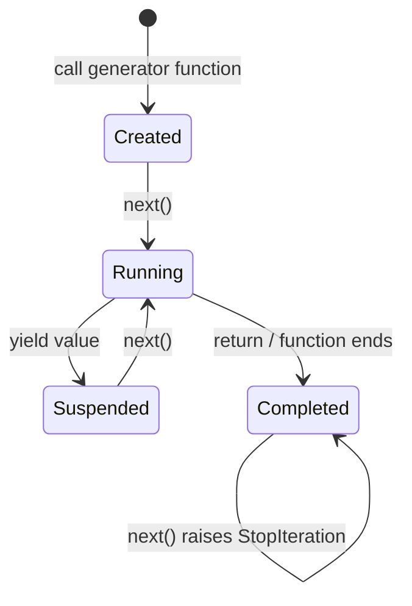
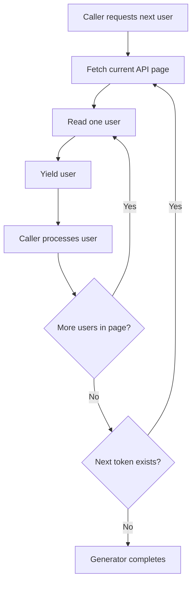
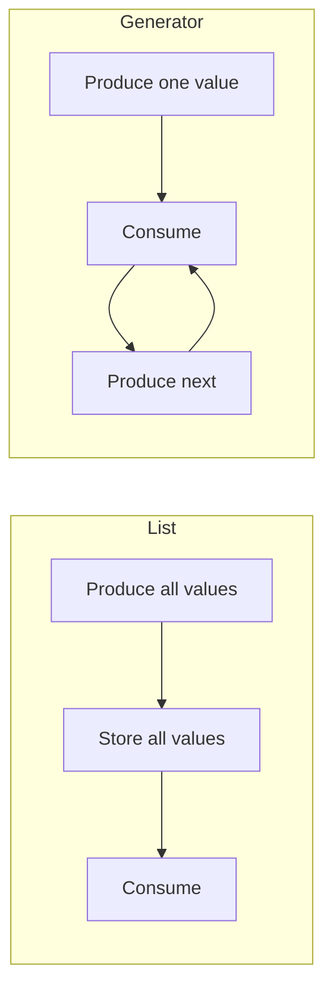

# Python Generators, Iterators, and `yield`

> Python iteration is built around three related concepts: **iterables provide iterators, iterators produce values one at a time, and generators are a concise way to create iterators using `yield`.**

## In Short

- An **iterable** is something Python can loop over, such as a list, tuple, string, file, or custom collection.
- An **iterator** keeps traversal state and returns the next value through `__next__()`.
- A **generator** is an iterator created by a generator function or generator expression.
- Calling a generator function **does not execute its body immediately**. It returns a generator object.
- `yield` produces a value, pauses execution, and preserves local state for the next iteration.
- Generators are **lazy and single-pass**. They are useful for files, database rows, paginated APIs, pipelines, and potentially large streams of data.
- `yield from` delegates iteration to another iterable or generator.
- Generators usually reduce memory usage, but laziness does **not** automatically make code faster.

```mermaid
flowchart LR
    A[Iterable] -->|iter()| B[Iterator]
    B -->|next()| C[Value]
    C -->|request next value| B
    B -->|no values left| D[StopIteration]

    E[Generator function] -->|call| F[Generator object]
    F --> B
```

---

## 1. Core Mental Model

### 1.1 Iterable

An **iterable** is an object that can provide an iterator.

Common examples are:

- `list`, `tuple`, `set`, `dict`
- `str`
- `range`
- file objects
- custom objects implementing `__iter__()`

A reusable container such as a list normally creates a **new iterator** each time `iter()` is called.

### 1.2 Iterator

An **iterator** represents an active traversal through values.

It follows the iterator protocol:

- `__iter__()` returns the iterator itself.
- `__next__()` returns the next value.
- `__next__()` raises `StopIteration` when no values remain.

Because the iterator itself stores the current position, it is normally **single-pass**.

### 1.3 Generator

A **generator** is a special iterator created in one of two common ways:

1. A function containing `yield`
2. A generator expression such as `(x * x for x in values)`

The important relationship is:

```text
Iterable
   │
   └── provides ──> Iterator
                       │
                       └── Generator is a specialized iterator
```

| Concept | Purpose | Usually reusable? |
|---|---|---|
| **Iterable** | Provides values to iterate over | Often yes |
| **Iterator** | Tracks traversal and returns one item at a time | No |
| **Generator** | Implements lazy iteration using `yield` | No |

---

## 2. How Python Iteration Works

A `for` loop uses the iterator protocol internally.

Conceptually:

```text
iterable
   │
   │ iter()
   ▼
iterator
   │
   │ next()
   ▼
value
   │
   ├── more values ──> next()
   │
   └── finished ─────> StopIteration ──> loop ends
```

A loop such as:

```python
for item in values:
    process(item)
```

behaves conceptually like:

```python
iterator = iter(values)

while True:
    try:
        item = next(iterator)
    except StopIteration:
        break

    process(item)
```

In normal application code, you usually let the `for` loop handle `StopIteration` rather than catching it yourself.

---

## 3. Generator Functions and `yield`

A function becomes a **generator function** when its body contains `yield`.

Calling that function returns a generator object immediately. The function body starts only when the generator is advanced with `next()`, a `for` loop, or another generator operation.

When execution reaches `yield`:

1. A value is returned to the caller.
2. The generator pauses.
3. Local variables are preserved.
4. The execution position is preserved.
5. The next iteration resumes immediately after that `yield`.



### `return` vs `yield`

| `return` | `yield` |
|---|---|
| Finishes a normal function | Pauses a generator |
| Returns a final result | Produces values incrementally |
| Local execution state is discarded | Local execution state is preserved |
| Function work happens during the call | Generator work happens during iteration |

A `return` inside a generator ends the generator. Internally, its optional return value becomes the value carried by `StopIteration`, which is mainly relevant when using `yield from`.

---

## 4. Generator Expressions and `yield from`

### 4.1 Generator Expressions

A generator expression is the lazy form of a comprehension:

```python
(number * number for number in values)
```

It produces values only when requested instead of building the complete result in memory.

Use a generator expression when the consumer only needs to process values sequentially. Use a list comprehension when you actually need the complete collection, repeated access, indexing, or its length.

### 4.2 `yield from`

`yield from iterable` delegates value production to another iterable.

Conceptually:

```text
Caller
  │
  ▼
Parent generator
  │
  │ yield from
  ▼
Child iterable / generator
  │
  └──────── values ────────> Caller
```

It is useful when a generator is composed from smaller generators or nested iterable sources.

For delegated generators, `yield from` also handles advanced generator communication such as `send()`, `throw()`, and `close()`.

---

## 5. Practical Example: Paginated API as One Stream

A common backend use case is an API that returns users page by page. The application usually does not want pagination logic everywhere, so a generator can expose all users as one logical stream.

```python
from collections.abc import Callable, Iterator
from typing import Any

PageFetcher = Callable[[str | None], dict[str, Any]]


def iter_users(fetch_page: PageFetcher) -> Iterator[dict[str, Any]]:
    next_token: str | None = None

    while True:
        response = fetch_page(next_token)

        for user in response["items"]:
            yield user

        next_token = response.get("next_token")

        if next_token is None:
            break


for user in iter_users(fetch_page):
    process(user)
```

### What happens here?

1. `iter_users(fetch_page)` returns a generator object.
2. No API request is made until iteration starts.
3. The first page is fetched only when the caller needs the first user.
4. Each user is yielded one at a time.
5. The generator pauses after every `yield`.
6. When the current page is exhausted, it fetches the next page.
7. When `next_token` becomes `None`, the generator finishes.



### Why this pattern is useful

The caller works with a simple `for` loop while the generator owns:

- pagination
- continuation tokens
- lazy fetching
- traversal state

It also allows the caller to stop early without first fetching every page.

---

## 6. Important Generator Behavior

### 6.1 Generators Are Single-Pass

Once a generator has been consumed, it remains exhausted.

```text
generator created
      │
      ▼
values consumed
      │
      ▼
generator exhausted
      │
      └── iterating again produces no values
```

If the values need to be processed again, create a **new generator object** or materialize them into a collection such as a list when appropriate.

### 6.2 Execution Is Lazy

Generator work happens during iteration, not necessarily when the generator object is created.

This means:

- expensive work can be delayed until needed;
- processing can stop early;
- exceptions may also occur later, during consumption.

That timing difference is important when debugging streaming code.

### 6.3 Memory Efficient Does Not Mean Automatically Faster

A list stores all produced results.

A generator mainly stores:

- its current execution state;
- local variables;
- the current yielded value.

That usually gives generators a memory advantage for large streams.



A list can still be the better choice when the data is small and the result must be reused, indexed, sorted repeatedly, or inspected as a complete snapshot.

---

## 7. Typing Generators

For normal generator functions, prefer abstract types from `collections.abc`.

```python
from collections.abc import Iterable, Iterator
```

A common API style is:

```text
accept Iterable[T]  →  return Iterator[T]
```

This communicates that the function:

- accepts any iterable source;
- produces values lazily;
- does not promise indexing or repeated iteration.

For most generator functions that only yield values, `Iterator[T]` is sufficient.

`typing.Generator[YieldType, SendType, ReturnType]` is useful when advanced `send()` behavior or the generator's return value is part of the API.

---

## 8. Advanced Generator Methods

Generator objects support several methods beyond normal iteration.

| Method | Purpose |
|---|---|
| `next(generator)` | Resume until the next `yield` |
| `generator.send(value)` | Resume and send a value into the suspended `yield` |
| `generator.throw(exc)` | Raise an exception where the generator is paused |
| `generator.close()` | Request generator termination using `GeneratorExit` |

For normal backend development, `next()` and standard iteration cover most use cases. `send()`, `throw()`, and direct `close()` are more specialized and are mainly useful for state-machine, coroutine-style, or explicit resource-management designs.

---

## 9. Synchronous vs Asynchronous Generators

A synchronous generator uses `def` and is consumed with `for`.

An asynchronous generator uses `async def`, contains `yield`, and is consumed with `async for`.

| Synchronous generator | Asynchronous generator |
|---|---|
| `def` + `yield` | `async def` + `yield` |
| Consumed with `for` | Consumed with `async for` |
| Usually typed as `Iterator[T]` | Usually typed as `AsyncIterator[T]` |
| Best for synchronous lazy processing | Best for asynchronously arriving values |

An asynchronous generator can use `await`, which makes it useful for streaming events, WebSocket messages, database cursors, or other async I/O sources.

`yield from` is **not allowed** inside an asynchronous generator; delegation is normally written with `async for`.

---

## 10. When to Use Generators

Generators are a strong fit for:

- large files;
- paginated APIs;
- database row streaming;
- message or event streams;
- transformation pipelines;
- batch processing;
- early-exit searches;
- potentially infinite sequences.

Prefer a normal collection such as a list when:

- the full result is small;
- values must be reused multiple times;
- indexing or slicing is required;
- the total length is needed frequently;
- the complete snapshot should exist before processing starts.

---

## 11. Best Practices

### Prefer generators for clear sequential streaming

A generator should usually represent one understandable flow of values rather than mixing unrelated responsibilities.

### Accept `Iterable`, return `Iterator`

This keeps function inputs flexible and clearly communicates lazy output.

### Make lazy behavior obvious in API names

Names such as:

- `iter_users()`
- `stream_events()`
- `generate_batches()`

make single-pass behavior clearer than a vague name such as `get_data()`.

### Be aware of resource lifetime

A suspended generator can keep local resources alive. If a generator owns a file, connection, or similar resource, structure cleanup carefully and use context managers where appropriate.

### Use built-in iterator tools first

Before writing custom iteration logic, check Python's built-ins and `itertools`, especially:

- `enumerate()`
- `zip()`
- `map()`
- `filter()`
- `iter()`
- `itertools.chain()`
- `itertools.islice()`
- `itertools.batched()`

In current Python, `itertools.batched()` lazily groups values into tuples, and its `strict` option can require every batch to have exactly the requested size.

---

## Interview Takeaway

The most important idea is not simply that generators "save memory."

A strong understanding is:

> A generator is a specialized iterator whose execution can pause at `yield` and resume later with its local state preserved. It follows Python's iterator protocol, produces values lazily, and is normally consumed only once.

For day-to-day backend development, the most useful applications are **streaming data, hiding pagination, processing large inputs, and building lazy pipelines**. Use generators when values naturally flow one at a time; use a concrete collection when the complete result needs to exist and be reused.
