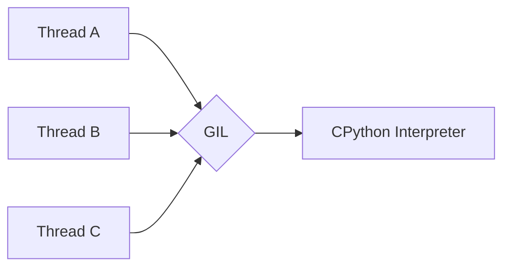
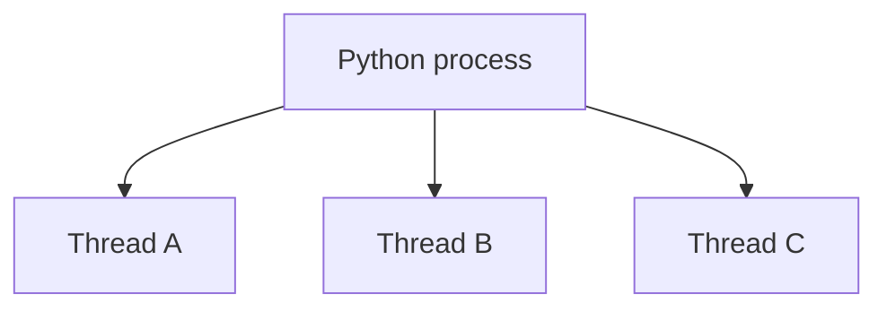
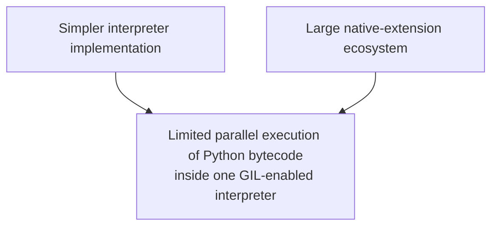
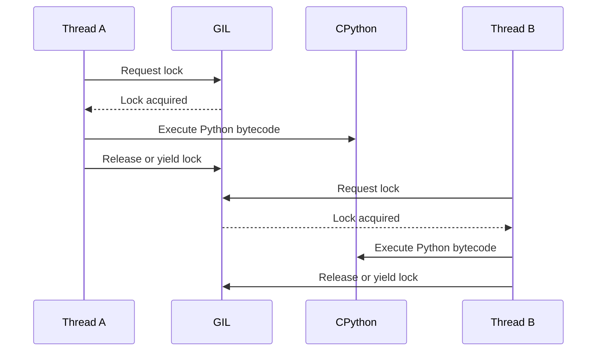
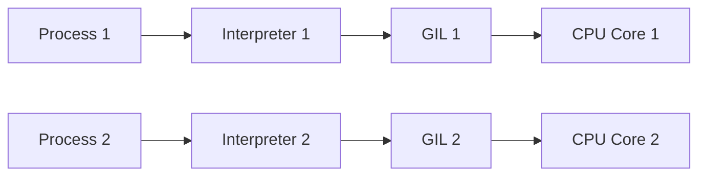
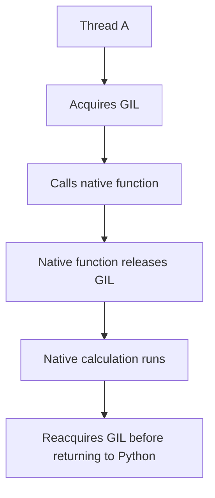
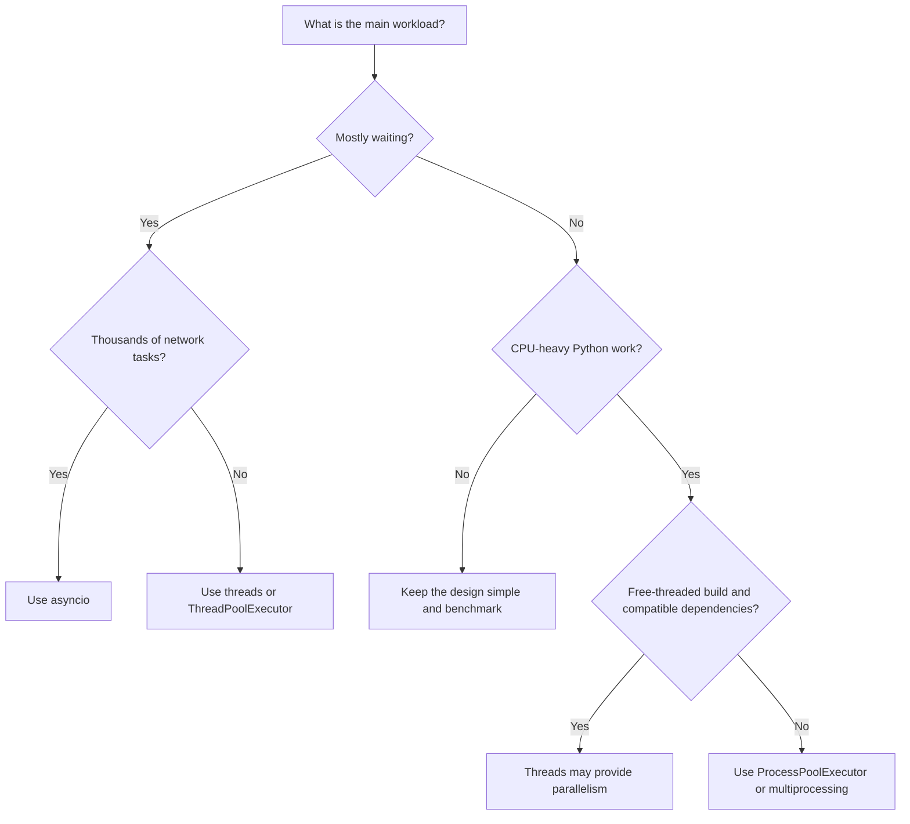
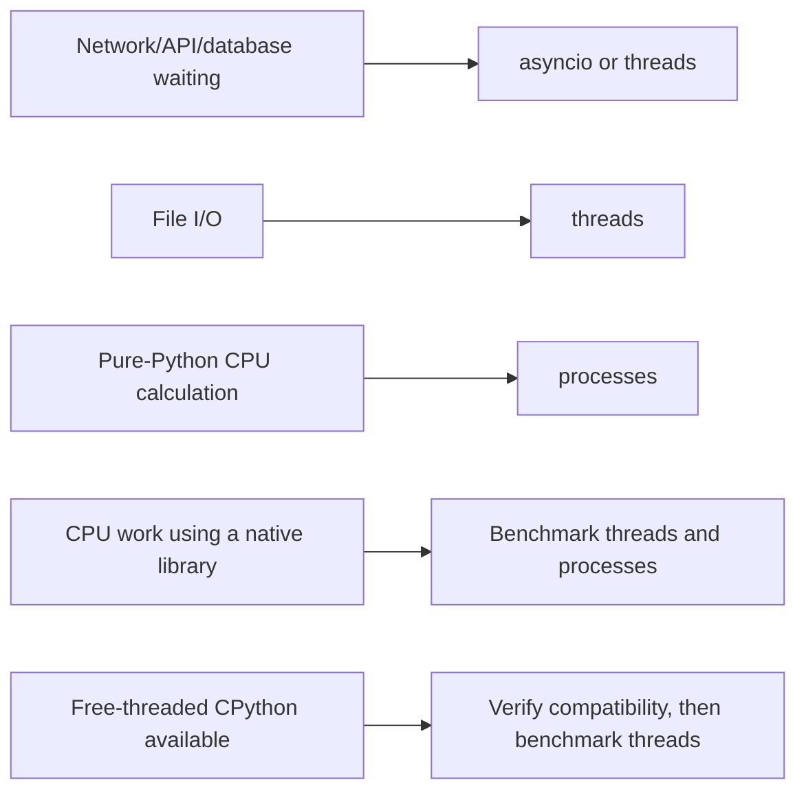
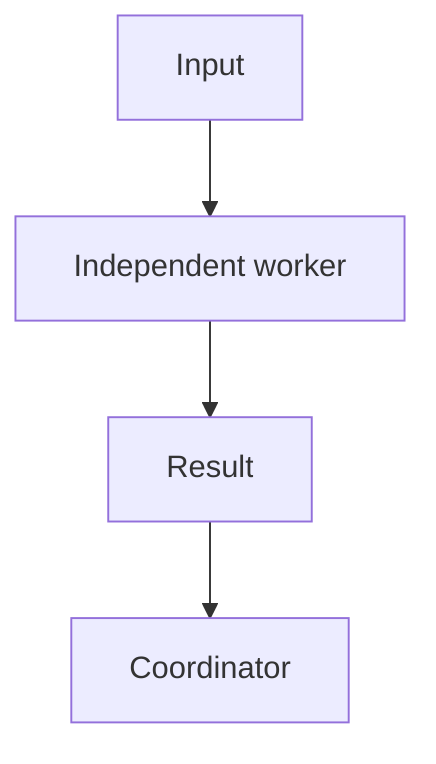

# GIL (Global Interpreter Lock)

> The **Global Interpreter Lock (GIL)** is a locking mechanism used by CPython.
>
> In a normal GIL-enabled CPython interpreter, only one thread can execute Python bytecode at a time.

## In short

- The GIL is a **CPython implementation detail**, not a rule of the Python language, and other implementations may use a different concurrency model.
- In a normal GIL-enabled build only the thread holding the lock executes Python bytecode, so threads give concurrency but not multi-core Python execution.
- It exists because CPython manages object lifetime with reference counting, and one global lock kept interpreter internals and the C-extension model simple.
- A thread stops holding the GIL on blocking I/O, `time.sleep()`, a lock or queue wait, when CPython lets another thread run, or when native code releases it explicitly.
- Threads remain effective for I/O-bound work; CPU-bound pure-Python work normally needs processes for real multi-core execution.
- Native extensions such as NumPy or pandas may release the GIL during native work, so some CPU-heavy library calls do run in parallel — benchmark instead of assuming.
- Python 3.13 added an optional experimental free-threaded build and 3.14 an officially supported one (PEP 703); locks and package-compatibility checks are still required.



**Interview answer:** The GIL is a lock inside CPython that protects the interpreter and many internal objects, and it means only one thread executes Python bytecode at a time. For I/O-bound code that barely matters, because a thread releases the GIL while it waits on the network, a database, a file, or `time.sleep()` — so threads still overlap the waiting. For CPU-bound pure-Python work threads do not scale across cores, so I use processes, a native library that releases the GIL, or a free-threaded build where the dependencies support it.

**Gotcha:** Assuming the GIL makes threaded code thread-safe. It protects interpreter internals, not a complete application-level operation: a check-then-act sequence such as reading a balance, comparing it, then subtracting can be interrupted between those logical steps, so shared mutable state still needs an explicit `threading.Lock`.

---

# 1. Overview

Python supports multiple concurrency approaches:

- Threads
- Processes
- Asynchronous programming
- Multiple isolated interpreters
- Free-threaded execution

The GIL mainly affects **threads executing Python code inside CPython**.

| Approach | Behaviour |
|---|---|
| `threading` | Affected by the GIL in normal CPython |
| `multiprocessing` | Separate process and separate interpreter |
| `asyncio` | Cooperative concurrency, usually one thread |
| Isolated interpreters | Separate interpreter state |
| Free-threaded CPython | Optional build where the GIL can be disabled |

The most important practical idea is:

> Threads are generally effective for I/O-bound work, while processes are usually better for CPU-bound pure-Python work in a normal GIL-enabled CPython build.

---

# 2. What Is the GIL?

GIL means: `Global Interpreter Lock`

It is a lock that protects access to the CPython interpreter and many internal Python objects.

In a normal CPython process with the GIL enabled: `Only one thread executes Python bytecode at a time`

Suppose a program creates three threads:



All three threads exist, but they compete for the same interpreter lock. Only the thread that holds the GIL can execute Python bytecode.

## Important Scope

The GIL is mainly associated with **CPython**, which is the standard and most commonly used Python implementation.

It is not a rule of the Python language itself.

Other Python implementations may use a different concurrency model.

---

# 3. Why Does CPython Have a GIL?

The GIL historically made CPython's memory management and extension ecosystem easier to implement safely.

## 3.1 Reference Counting

CPython primarily manages object lifetime using reference counting.

```python
user_name = "Avadh"
display_name = user_name
```

Conceptually:

```text
"Avadh" object
Reference count = 2
```

When a reference is created or removed, CPython updates the object's reference count.

Without synchronization, two threads could update the same count at the same time.

```text
Initial reference count = 2

Thread A reads 2
Thread B reads 2

Thread A writes 3
Thread B writes 3

Expected value = 4
Actual value   = 3
```

The GIL provides broad protection around many interpreter-level operations.

## 3.2 Simpler Interpreter Internals

The GIL historically simplified access to objects such as:

- Lists
- Dictionaries
- Functions
- Classes
- Modules
- Reference counts
- Interpreter state

Without one global lock, CPython would need more fine-grained synchronization throughout the interpreter.

## 3.3 C Extension Compatibility

Many Python packages use native C or C++ extensions.

Examples include:

- NumPy
- pandas
- Pillow
- cryptography
- Database drivers

The GIL historically provided a relatively simple model for extension authors when interacting with Python objects.

## Main Trade-off



---

# 4. How the GIL Works

A simplified execution sequence is:



From the developer's perspective, thread execution may look like this:

```text
Time ------------------------------------------------------>

Thread A: [running] [waiting] [running] [waiting]
Thread B: [waiting] [running] [waiting] [running]
```

The threads make progress concurrently, but only one normally executes Python bytecode at a specific instant.

## When a Thread May Release or Yield the GIL

A thread may stop holding the GIL when:

- It performs blocking I/O.
- It calls `time.sleep()`.
- It waits for a lock or queue.
- CPython allows another thread to run.
- Native extension code explicitly releases the GIL.

Example:

```python
import time

def load_data() -> None:
    print("Loading started")
    time.sleep(2)
    print("Loading completed")
```

While the thread is sleeping, another thread can execute.

---

# 5. Concurrency, Parallelism, and Workload Type

Concurrency means several tasks make progress over overlapping periods; parallelism means they execute at the same instant on different CPU cores. In a normal GIL-enabled CPython build, threads provide concurrency but not parallel execution of Python bytecode.

That is why the effect of the GIL depends heavily on the type of work: I/O-bound work, which spends most of its time waiting on a network, disk, or database, still benefits from threads, while CPU-bound pure-Python work needs processes.

See [Multithreading vs Multiprocessing vs Asyncio](threading-multiprocessing-asyncio.md) for the full taxonomy and the workload-identification guide.

---

# 6. Threads with I/O-Bound Work

Consider three simulated API calls.

## Sequential Version

```python
from time import perf_counter, sleep

def fetch_user(user_id: int) -> str:
    sleep(2)
    return f"User {user_id}"

def main() -> None:
    started_at = perf_counter()

    results = [
        fetch_user(1),
        fetch_user(2),
        fetch_user(3),
    ]

    elapsed = perf_counter() - started_at

    print(results)
    print(f"Completed in {elapsed:.2f} seconds")

if __name__ == "__main__":
    main()
```

Approximate execution time: `2 seconds + 2 seconds + 2 seconds = 6 seconds`

## Threaded Version

```python
from concurrent.futures import ThreadPoolExecutor
from time import perf_counter, sleep

def fetch_user(user_id: int) -> str:
    """Simulate a network or database operation."""
    sleep(2)
    return f"User {user_id}"

def main() -> None:
    user_ids = [1, 2, 3]
    started_at = perf_counter()

    with ThreadPoolExecutor(max_workers=3) as executor:
        results = list(executor.map(fetch_user, user_ids))

    elapsed = perf_counter() - started_at

    print(results)
    print(f"Completed in {elapsed:.2f} seconds")

if __name__ == "__main__":
    main()
```

Approximate execution time: `Around 2 seconds`

The exact result depends on the environment.

## Why Threads Help

```text
Thread 1: [waiting for API ----------------]
Thread 2: [waiting for API ----------------]
Thread 3: [waiting for API ----------------]

Total time: approximately one waiting period
```

The program spends most of its time waiting, so the GIL is not the main bottleneck.

---

# 7. Threads with CPU-Bound Work

Consider a CPU-heavy pure-Python calculation.

```python
def calculate_sum_of_squares(limit: int) -> int:
    return sum(number * number for number in range(limit))
```

Running several copies using threads may not produce a meaningful speed improvement in a GIL-enabled CPython interpreter.

```python
from concurrent.futures import ThreadPoolExecutor
from time import perf_counter

def calculate_sum_of_squares(limit: int) -> int:
    return sum(number * number for number in range(limit))

def main() -> None:
    limits = [8_000_000] * 4
    started_at = perf_counter()

    with ThreadPoolExecutor(max_workers=4) as executor:
        results = list(executor.map(calculate_sum_of_squares, limits))

    elapsed = perf_counter() - started_at

    print(results)
    print(f"Completed in {elapsed:.2f} seconds")

if __name__ == "__main__":
    main()
```

## What Happens Internally

```text
Thread A wants the GIL
Thread B wants the GIL
Thread C wants the GIL
Thread D wants the GIL

Only one executes Python bytecode at a time.
```

Thread switching also adds overhead.

Therefore: `More threads do not automatically mean faster CPU execution`

---

# 8. Using Multiprocessing for CPU Work

Each process has its own:

- Memory space
- Python interpreter
- GIL in a traditional build



Because the processes do not share one interpreter-level GIL, they can run on multiple CPU cores.

## `ProcessPoolExecutor` Example

```python
from concurrent.futures import ProcessPoolExecutor
from time import perf_counter

def calculate_sum_of_squares(limit: int) -> int:
    """Perform CPU-heavy pure-Python work."""
    return sum(number * number for number in range(limit))

def main() -> None:
    limits = [8_000_000] * 4
    started_at = perf_counter()

    with ProcessPoolExecutor() as executor:
        results = list(executor.map(calculate_sum_of_squares, limits))

    elapsed = perf_counter() - started_at

    print(results)
    print(f"Completed in {elapsed:.2f} seconds")

if __name__ == "__main__":
    main()
```

The `if __name__ == "__main__":` guard is important when using multiprocessing.

## Multiprocessing Trade-offs

| Advantages | Disadvantages |
|---|---|
| True multi-core execution | Higher memory usage |
| Suitable for CPU-heavy work | Process startup cost |
| Separate failure boundaries | Data must often be serialized |
| Avoids one shared GIL | Shared state is more difficult |
| Good task isolation | Inter-process communication overhead |

Use processes when each task performs enough work to justify the additional overhead.

---

# 9. The GIL Does Not Prevent Race Conditions

A common misunderstanding is:

> The GIL makes all threaded Python code thread-safe.

This is incorrect.

The GIL protects interpreter internals. It does not automatically protect a complete application-level operation.

## Unsafe Example

```python
class BankAccount:
    def __init__(self, balance: int) -> None:
        self.balance = balance

    def withdraw(self, amount: int) -> bool:
        if self.balance >= amount:
            self.balance -= amount
            return True

        return False
```

The withdrawal is a multi-step operation:

```text
1. Read balance
2. Compare balance
3. Calculate new balance
4. Store new balance
```

A thread switch can happen between these logical steps.

## Safe Version with a Lock

```python
import threading

class BankAccount:
    def __init__(self, balance: int) -> None:
        self.balance = balance
        self._lock = threading.Lock()

    def withdraw(self, amount: int) -> bool:
        with self._lock:
            if self.balance < amount:
                return False

            self.balance -= amount
            return True
```

The lock protects the complete business rule: `The account balance must not become negative`

## Common Synchronization Tools

Python provides:

- `threading.Lock`
- `threading.RLock`
- `threading.Semaphore`
- `threading.Event`
- `threading.Condition`
- `queue.Queue`

## Important Rule

> Use explicit synchronization when multiple threads access shared mutable state.

Do not depend on the GIL for application correctness.

---

# 10. Native Extensions and the GIL

The statement that only one thread runs at a time requires an important qualification:

> The GIL primarily limits simultaneous execution of Python bytecode.

Native extension code may release the GIL while performing work that does not need direct access to Python objects.

Conceptually:



While Thread A is running native code without the GIL, another thread may execute.

Packages that may perform some operations in native code include:

- NumPy
- pandas
- Pillow
- SciPy
- Compression libraries
- Cryptography libraries
- Database drivers

Whether threads achieve parallelism depends on the specific package and operation.

## Practical Lesson

Pure-Python code: `Usually limited by the GIL for CPU-heavy threading`

Optimized native code: `May release the GIL and run in parallel`

Always benchmark the actual workload instead of assuming behavior.

---

# 11. Free-Threaded Python

CPython now supports an optional build where the GIL can be disabled.

## 11.1 Version Status

| Python version | Free-threaded support |
|---|---|
| 3.12 and earlier | Traditional GIL-enabled CPython |
| 3.13 | Optional experimental free-threaded build |
| 3.14 | Optional officially supported free-threaded build |

The standard CPython build remains GIL-enabled by default.

Free-threaded execution allows multiple threads to run Python code in parallel on available CPU cores.

This work is based on **PEP 703**, which makes the GIL optional.

## 11.2 Check Whether the GIL Is Enabled

On supported recent CPython versions:

```python
import sys

print(sys._is_gil_enabled())
```

Possible output: `True`

or: `False`

A compatibility-friendly check can be written as:

```python
import sys

def is_gil_enabled() -> bool:
    checker = getattr(sys, "_is_gil_enabled", None)

    if checker is None:
        return True

    return checker()

print(f"GIL enabled: {is_gil_enabled()}")
```

## 11.3 Check Whether Python Supports Free Threading

```python
import sysconfig

is_free_threaded_build = (
    sysconfig.get_config_var("Py_GIL_DISABLED") == 1
)

print(f"Free-threaded build: {is_free_threaded_build}")
```

## 11.4 Free Threading Does Not Remove Race Conditions

```text
GIL disabled
    does not mean
Locks are unnecessary
```

Multiple threads can execute simultaneously, so shared-state synchronization becomes even more important.

```python
import threading

shared_results: list[int] = []
results_lock = threading.Lock()

def store_result(result: int) -> None:
    with results_lock:
        shared_results.append(result)
```

## 11.5 Package Compatibility

Some C extensions may not yet fully support free-threaded execution.

A package may:

- Work normally
- Require a special free-threaded build
- Perform more slowly
- Re-enable the GIL at runtime
- Be unsupported

Before using free-threaded Python in production, verify:

- Package compatibility
- Thread safety
- Performance improvement
- Memory usage
- Single-thread performance
- Deployment support

## 11.6 When Free-Threaded Python Helps

It is most useful when:

- The workload is CPU-bound.
- Tasks can execute safely in parallel.
- The application uses threads naturally.
- Dependencies support free threading.
- Benchmarks show a real improvement.

It may provide little benefit when:

- The workload is mostly I/O waiting.
- A database or external API is the bottleneck.
- The application has heavy lock contention.
- Dependencies re-enable the GIL.
- The workload is already handled by optimized native libraries.

---

# 12. Choosing the Right Concurrency Model

Use the following decision flow.



## Tool Comparison

| Tool | Memory Model | Multi-Core Python Execution | Best Use |
|---|---|---:|---|
| `threading` | Shared memory | Not normally with a GIL-enabled build | I/O-bound tasks |
| `ThreadPoolExecutor` | Shared memory | Not normally with a GIL-enabled build | Simple concurrent I/O |
| `asyncio` | Event loop | No by default | Many network operations |
| `multiprocessing` | Separate memory | Yes | CPU-bound work |
| `ProcessPoolExecutor` | Separate memory | Yes | Independent CPU tasks |
| `InterpreterPoolExecutor` | Isolated interpreters | Yes | Isolated CPU tasks |
| Free-threaded threads | Shared memory | Yes | Compatible thread-safe workloads |
| Native extensions | Library-specific | Often possible | Numerical or specialized work |

## Simple Selection Guide



---

# 13. Practical Development Guidelines

## 13.1 Identify the Real Bottleneck

The correct concurrency model depends on the actual bottleneck.

Before adding concurrency, measure whether the application is limited by:

- CPU usage
- Network latency
- Database latency
- Disk operations
- Lock contention
- Serialization
- External service response time

## 13.2 Prefer High-Level APIs

Prefer:

```python
ThreadPoolExecutor
ProcessPoolExecutor
asyncio
```

over manually creating and managing many workers.

High-level APIs provide:

- Worker management
- Result collection
- Exception propagation
- Resource cleanup
- Context-manager support

## 13.3 Minimize Shared Mutable State

Prefer this design:



Avoid this design when possible:

```text
Many workers
    ↓
One large shared mutable object
```

## 13.4 Keep Critical Sections Small

Good:

```python
result = perform_expensive_work()

with lock:
    shared_results.append(result)
```

Avoid:

```python
with lock:
    result = perform_expensive_work()
    shared_results.append(result)
```

The second version holds the lock during expensive work and prevents other threads from making progress.

## 13.5 Use Queues for Worker Communication

For producer-consumer workflows, use `queue.Queue`.

```python
from queue import Queue

task_queue: Queue[int] = Queue()
```

A queue provides thread-safe communication without manually protecting a shared list.

## 13.6 Do Not Assume an Operation Is Atomic

Avoid correctness assumptions such as: `"This works because CPython currently executes it atomically."`

Behavior may change across:

- Python versions
- Free-threaded builds
- Other Python implementations
- Native extensions
- Refactored code

Protect the complete business operation explicitly.

## 13.7 Benchmark Realistic Workloads

Measure:

- Total execution time
- Requests per second
- Average latency
- High-percentile latency
- CPU utilization
- Memory utilization
- Process startup overhead
- Serialization cost
- Lock waiting time

Use realistic data sizes and production-like conditions.

## 13.8 Handle Worker Failures

Concurrency code should account for:

- Exceptions
- Timeouts
- Cancellation
- Partial results
- Worker crashes
- Resource cleanup
- Application shutdown

Example:

```python
from concurrent.futures import ThreadPoolExecutor, as_completed

def process_item(item_id: int) -> str:
    if item_id == 3:
        raise ValueError("Invalid item")

    return f"Processed {item_id}"

def main() -> None:
    item_ids = [1, 2, 3, 4]

    with ThreadPoolExecutor(max_workers=4) as executor:
        future_to_item = {
            executor.submit(process_item, item_id): item_id
            for item_id in item_ids
        }

        for future in as_completed(future_to_item):
            item_id = future_to_item[future]

            try:
                result = future.result()
            except Exception as error:
                print(f"Item {item_id} failed: {error}")
            else:
                print(result)

if __name__ == "__main__":
    main()
```

---

# 14. References

- [Python Glossary: Global Interpreter Lock](https://docs.python.org/3/glossary.html#term-global-interpreter-lock)
- [Python `threading` Documentation](https://docs.python.org/3/library/threading.html)
- [Python Free-Threading Guide](https://docs.python.org/3/howto/free-threading-python.html)
- [Python `concurrent.futures` Documentation](https://docs.python.org/3/library/concurrent.futures.html)
- [Python `multiprocessing` Documentation](https://docs.python.org/3/library/multiprocessing.html)
- [PEP 703: Making the Global Interpreter Lock Optional](https://peps.python.org/pep-0703/)
- [PEP 779: Supported Status for Free-Threaded Python](https://peps.python.org/pep-0779/)
